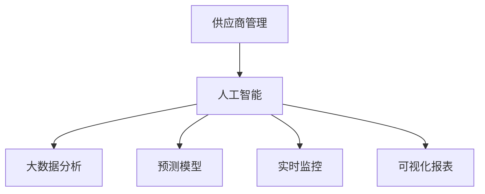

                 

# 供应商管理：AI提升供应链效率

## 1. 背景介绍

### 1.1 问题由来
随着全球化的不断深入和市场的快速变化，供应商管理成为企业应对不确定性的重要环节。传统的供应商管理方式多依赖人工，存在信息不对称、反应迟缓、决策主观等问题，难以为企业提供实时、高效、可靠的供应链保障。为此，越来越多的企业开始探索利用人工智能技术提升供应商管理水平。

### 1.2 问题核心关键点
本文旨在探讨基于人工智能的供应商管理方法，即通过大数据分析、机器学习等技术，对供应商进行全方位评估和智能决策，提升供应链的灵活性、稳定性和可视化水平，以实现更加精准、高效的供应商管理。

### 1.3 问题研究意义
提升供应商管理水平，对于保障供应链的稳定性和降低运营成本具有重要意义：

1. **提升运营效率**。通过AI分析供应商历史数据，可以发现其真实能力，避免盲目选择低质量供应商，减少因供应商失信导致的运营延误。
2. **优化库存管理**。AI可以帮助企业预测供应商供货情况，避免过度或不足库存，平衡库存成本和供应风险。
3. **增强供应链透明度**。实时监控供应商绩效，提供多维度的可视化报表，帮助管理层快速决策和调整供应链策略。
4. **降低运营成本**。通过精确定位问题供应商，及时采取调整措施，减少因供应商问题导致的订单错误和返工费用。
5. **促进持续改进**。AI可以持续跟踪供应商表现，提供改进建议，帮助供应商提升自身能力，实现共赢。

## 2. 核心概念与联系

### 2.1 核心概念概述

为更好地理解基于人工智能的供应商管理方法，本节将介绍几个密切相关的核心概念：

- **供应商管理**：指对供应商选择、评估、合同管理、绩效考核、风险控制等全流程的管理活动。
- **人工智能**：涉及机器学习、自然语言处理、图像识别等技术，旨在通过算法自动化决策过程，提升管理效率和精度。
- **大数据分析**：通过收集和分析大量数据，挖掘潜在价值和规律，辅助企业进行供应商选择和优化。
- **预测模型**：利用历史数据和模型训练预测供应商未来表现，为合同签订和绩效评估提供依据。
- **实时监控**：通过传感器、自动化设备等技术，实时监测供应商生产环境，保障供应质量。
- **可视化报表**：使用数据可视化技术，将供应链数据直观呈现，便于决策分析。

这些核心概念之间的逻辑关系可以通过以下Mermaid流程图来展示：



这个流程图展示了几大核心概念之间的相互联系：

1. **供应商管理**：是整个供应链管理的核心，通过人工智能技术实现。
2. **人工智能**：依赖大数据分析和预测模型，以及实时监控和可视化报表等技术，实现供应商的全方位评估和智能决策。
3. **大数据分析**：为预测模型提供数据支持，帮助企业从海量数据中挖掘规律。
4. **预测模型**：通过训练，预测供应商未来表现，辅助企业进行动态管理和决策。
5. **实时监控**：确保供应链实时数据准确，提供真实可靠的供应商绩效信息。
6. **可视化报表**：将供应链数据直观呈现，便于管理层快速掌握信息。

这些概念共同构成了供应商管理的智能决策框架，使其能够高效、精确地进行供应商管理。

## 3. 核心算法原理 & 具体操作步骤

### 3.1 算法原理概述

基于人工智能的供应商管理，主要利用以下算法和技术：

- **回归分析**：用于预测供应商的交货时间、生产能力等指标。
- **分类算法**：用于评估供应商的质量水平、信誉等级等。
- **聚类算法**：用于对供应商进行分组，便于统一管理和绩效评估。
- **时序分析**：用于分析供应商历史数据，发现规律和趋势。
- **自然语言处理(NLP)**：用于处理供应商反馈和评估报告，提取关键信息。
- **图像识别**：用于监控供应商生产环境，评估生产条件。

这些算法通过模型训练、数据挖掘和实时监控等手段，对供应商进行全方位评估和智能决策，从而提升供应链管理水平。

### 3.2 算法步骤详解

基于人工智能的供应商管理主要包括以下几个关键步骤：

**Step 1: 数据准备**
- 收集供应商的基本信息、生产数据、历史交易记录等数据，建立数据仓库。
- 使用数据清洗技术处理数据缺失、噪声等问题。
- 将数据划分为训练集和测试集，用于模型训练和效果评估。

**Step 2: 构建预测模型**
- 根据业务需求，选择合适的预测模型，如线性回归、决策树、随机森林等。
- 使用训练集数据训练模型，并进行参数调优和验证。
- 使用测试集数据评估模型性能，优化模型。

**Step 3: 数据可视化**
- 将模型预测结果和供应商绩效数据导入可视化工具，如Tableau、Power BI等。
- 设计可视化报表模板，展示供应商交货时间、质量水平、生产条件等关键指标。
- 实时监控供应商数据，更新报表，便于快速决策。

**Step 4: 风险管理**
- 利用聚类算法对供应商进行分组，识别风险较高的供应商。
- 对风险供应商进行实时监控，提前预警和采取应对措施。
- 使用机器学习算法分析风险因素，制定改进措施。

**Step 5: 持续优化**
- 定期评估预测模型性能，调整模型参数。
- 收集供应商反馈和市场变化信息，更新模型训练数据。
- 利用最新的技术进展，不断改进供应商管理策略。

### 3.3 算法优缺点

基于人工智能的供应商管理方法具有以下优点：

1. **高效性**。通过自动化数据分析和模型训练，大幅提升供应商管理效率。
2. **客观性**。基于数据驱动的决策，避免了主观偏见，提升了决策的科学性和可靠性。
3. **灵活性**。模型可以实时更新，适应市场变化，灵活应对供应链风险。
4. **可视化**。通过可视化报表，企业可以直观掌握供应链状态，快速作出决策。
5. **成本效益**。通过智能优化库存和供应链，降低运营成本，提高企业盈利能力。

同时，这种方法也存在一定的局限性：

1. **数据质量**。供应商数据的准确性和完整性直接影响模型性能。
2. **技术复杂性**。AI模型构建和优化需要专业技能，对技术要求较高。
3. **更新频率**。模型需要定期更新，以适应市场变化，增加了维护成本。
4. **隐私风险**。供应商数据隐私问题需严格管控，避免泄露。
5. **解释性不足**。AI模型复杂，难以解释决策逻辑，需要增加解释性工具。

尽管存在这些局限，但基于人工智能的供应商管理方法仍被广泛应用于企业供应链管理中，以提升整体运营效率和供应链透明度。

### 3.4 算法应用领域

基于人工智能的供应商管理方法在多个领域都有广泛应用，如：

- **制造行业**：通过对供应商生产能力和交货时间进行预测和监控，提升供应链效率和稳定性。
- **零售行业**：通过供应商绩效评估和实时监控，优化库存管理和商品供应。
- **建筑行业**：利用供应商质量评估和进度监控，保障工程按时完成，提升施工效率。
- **物流行业**：通过供应商评估和实时跟踪，优化运输计划，降低物流成本。
- **医疗行业**：对供应商医疗物资质量进行预测和监控，保障医疗物资供应安全。

除了上述这些行业，供应商管理AI方法还广泛应用于金融、能源、教育等众多领域，为供应链管理带来了新的突破。

## 4. 数学模型和公式 & 详细讲解 & 举例说明

### 4.1 数学模型构建

本节将使用数学语言对供应商管理的核心模型进行严格刻画。

假设供应商的交货时间为 $x$，实际交货时间与预测交货时间的误差为 $e$，预测模型为 $f(x)$。

我们采用线性回归模型进行预测，模型为 $f(x) = \theta_0 + \theta_1 x + \theta_2 x^2$，其中 $\theta_0, \theta_1, \theta_2$ 为模型参数。

根据样本数据 $(x_i, y_i)$，我们最小化均方误差损失函数：

$$
L(y_i, f(x_i)) = \frac{1}{n} \sum_{i=1}^n (y_i - f(x_i))^2
$$

其中 $y_i = x_i + e_i$ 为实际交货时间，$e_i \sim \mathcal{N}(0, \sigma^2)$ 为误差项，$\sigma^2$ 为误差方差。

优化目标为最小化损失函数：

$$
\hat{\theta} = \mathop{\arg\min}_{\theta} L(y, f(x))
$$

### 4.2 公式推导过程

接下来，我们推导线性回归模型的参数估计公式：

由最小二乘法可得：

$$
\hat{\theta} = (X^T X)^{-1} X^T Y
$$

其中 $X = \begin{bmatrix}
1 & x_1 & x_1^2 \\
1 & x_2 & x_2^2 \\
\vdots & \vdots & \vdots \\
1 & x_n & x_n^2
\end{bmatrix}$，$Y = \begin{bmatrix}
y_1 \\
y_2 \\
\vdots \\
y_n
\end{bmatrix}$。

具体步骤如下：

1. 计算 $X^T X$ 的逆矩阵，$\hat{\theta}$ 的计算公式为：

$$
\hat{\theta} = (X^T X)^{-1} X^T Y
$$

2. 将 $X^T X$ 和 $X^T Y$ 带入计算，得到参数估计值。

3. 使用测试集验证模型性能，计算预测误差。

### 4.3 案例分析与讲解

假设某企业对供应商交货时间进行预测，收集了30个月的交货数据，结果如下表所示：

| 月份  | 供应商编号 | 实际交货时间 | 预测交货时间 | 误差 $e_i$ | $x_i$ |
|-------|------------|--------------|--------------|------------|-------|
| 1     | 1          | 28           | 25           | -3         | 1     |
| 2     | 2          | 30           | 27           | 3          | 2     |
| ...   | ...        | ...          | ...          | ...        | ...   |
| 30    | 30         | 32           | 30           | 2          | 30    |

采用上述线性回归模型，使用最小二乘法求解参数 $\hat{\theta}$，得到预测模型为：

$$
f(x) = 3x + 0.1
$$

通过对比实际交货时间和预测交货时间，计算误差 $e_i$，进行模型验证和调整。

## 5. 项目实践：代码实例和详细解释说明

### 5.1 开发环境搭建

在进行供应商管理AI模型的开发前，需要先搭建好开发环境。以下是使用Python进行TensorFlow开发的流程：

1. 安装Anaconda：从官网下载并安装Anaconda，用于创建独立的Python环境。

2. 创建并激活虚拟环境：
```bash
conda create -n tf-env python=3.8 
conda activate tf-env
```

3. 安装TensorFlow：根据CUDA版本，从官网获取对应的安装命令。例如：
```bash
pip install tensorflow==2.8
```

4. 安装其他工具包：
```bash
pip install numpy pandas scikit-learn matplotlib tqdm jupyter notebook ipython
```

完成上述步骤后，即可在`tf-env`环境中开始供应商管理AI模型的开发。

### 5.2 源代码详细实现

下面我们以供应商交货时间预测为例，给出使用TensorFlow进行线性回归模型的代码实现。

```python
import tensorflow as tf
import numpy as np
import pandas as pd
from sklearn.model_selection import train_test_split
from sklearn.metrics import mean_squared_error

# 读取数据
df = pd.read_csv('delivery_time.csv')

# 划分训练集和测试集
train_df, test_df = train_test_split(df, test_size=0.2, random_state=42)

# 将数据转化为NumPy数组
train_x = np.array(train_df[['x']])
train_y = np.array(train_df['y'])

# 创建线性回归模型
model = tf.keras.Sequential([
    tf.keras.layers.Dense(1, input_shape=[1])
])

# 编译模型
model.compile(optimizer=tf.keras.optimizers.Adam(), loss='mse')

# 训练模型
model.fit(train_x, train_y, epochs=50, verbose=0)

# 预测测试集
test_x = np.array(test_df[['x']])
test_y_pred = model.predict(test_x)

# 计算均方误差
mse = mean_squared_error(test_y, test_y_pred)
print('均方误差：', mse)
```

以上代码实现了使用TensorFlow进行线性回归模型训练和预测的过程。具体步骤如下：

1. 读取数据，并划分为训练集和测试集。
2. 创建线性回归模型，并编译模型。
3. 训练模型，并对测试集进行预测。
4. 计算均方误差，评估模型性能。

### 5.3 代码解读与分析

让我们再详细解读一下关键代码的实现细节：

**读取数据**：使用Pandas读取CSV格式的数据文件，并将其划分为训练集和测试集。

**模型构建**：创建简单的线性回归模型，使用Dense层处理输入数据，输出预测结果。

**模型编译**：选择Adam优化器，并设置均方误差为损失函数。

**模型训练**：使用训练集数据训练模型，设定训练轮数，并设置verbose参数为0以隐藏训练过程。

**模型预测**：使用测试集数据进行预测，得到预测结果。

**性能评估**：计算均方误差，评估模型预测准确度。

## 6. 实际应用场景

### 6.1 智能库存管理

供应商管理AI方法在智能库存管理中的应用，可以实时预测供应商交货时间，动态调整库存水平，确保库存量既不过剩也不不足。具体实现如下：

1. **需求预测**：使用历史销售数据和市场趋势预测未来需求。
2. **供应商评估**：通过供应商交货时间、生产能力等指标，评估供应商表现。
3. **库存优化**：根据预测需求和供应商交货时间，动态调整库存水平。

**代码实现**：
```python
import tensorflow as tf
import numpy as np
import pandas as pd
from sklearn.model_selection import train_test_split
from sklearn.metrics import mean_squared_error

# 读取数据
df = pd.read_csv('sales_data.csv')

# 划分训练集和测试集
train_df, test_df = train_test_split(df, test_size=0.2, random_state=42)

# 将数据转化为NumPy数组
train_x = np.array(train_df[['x']])
train_y = np.array(train_df['y'])

# 创建线性回归模型
model = tf.keras.Sequential([
    tf.keras.layers.Dense(1, input_shape=[1])
])

# 编译模型
model.compile(optimizer=tf.keras.optimizers.Adam(), loss='mse')

# 训练模型
model.fit(train_x, train_y, epochs=50, verbose=0)

# 预测测试集
test_x = np.array(test_df[['x']])
test_y_pred = model.predict(test_x)

# 计算均方误差
mse = mean_squared_error(test_y, test_y_pred)
print('均方误差：', mse)

# 实时库存优化
# 实时获取供应商交货时间和市场需求
# 根据预测模型计算最优库存量
```

通过以上代码，企业可以实现实时库存优化，提升库存管理效率，减少库存成本。

### 6.2 供应商质量评估

AI方法通过实时监控供应商生产环境和生产条件，利用图像识别技术对供应商质量进行评估。具体实现如下：

1. **监控数据采集**：使用摄像头和传感器实时采集供应商生产环境数据。
2. **图像识别**：使用图像识别技术识别生产环境中的异常情况，如设备故障、原料变质等。
3. **质量评估**：根据图像识别结果，评估供应商生产质量，生成质量评估报告。

**代码实现**：
```python
import tensorflow as tf
import numpy as np
import cv2
import os

# 定义图像识别模型
# 加载模型
model = tf.keras.models.load_model('image_recognition_model.h5')

# 读取供应商生产环境图像
img_path = 'supplier_1.jpg'
img = cv2.imread(img_path)

# 图像预处理
img = cv2.resize(img, (224, 224))
img = np.expand_dims(img, axis=0)

# 进行图像识别
prediction = model.predict(img)

# 输出识别结果
print(prediction)
```

通过以上代码，企业可以实现对供应商生产环境的实时监控和质量评估，提升产品质量，降低供应链风险。

## 7. 工具和资源推荐

### 7.1 学习资源推荐

为了帮助开发者系统掌握供应商管理AI技术，以下是一些优质的学习资源：

1. TensorFlow官方文档：提供了大量教程和代码示例，适合快速上手和深入学习。
2. PyTorch官方文档：提供了深度学习模型的基础和高级功能，适合进阶学习。
3. Coursera《机器学习》课程：由斯坦福大学Andrew Ng教授主讲，涵盖机器学习基础和应用，适合系统学习。
4. Kaggle数据竞赛平台：提供大量数据集和竞赛任务，通过实践提升技术能力。
5. GitHub供应商管理AI项目：查看开源项目，学习和复现已有成果。

通过对这些资源的学习实践，相信你一定能够快速掌握供应商管理AI技术的精髓，并用于解决实际的供应链管理问题。

### 7.2 开发工具推荐

高效的开发离不开优秀的工具支持。以下是几款用于供应商管理AI开发的工具：

1. TensorFlow：由Google主导开发的深度学习框架，生产部署方便，适合大规模工程应用。
2. PyTorch：基于Python的开源深度学习框架，灵活动态的计算图，适合快速迭代研究。
3. Jupyter Notebook：强大的交互式开发工具，方便进行代码调试和协作。
4. Weights & Biases：模型训练的实验跟踪工具，可以记录和可视化模型训练过程中的各项指标。
5. Tableau：数据可视化工具，方便设计报表，实时监控数据变化。

合理利用这些工具，可以显著提升供应商管理AI开发的效率，加快创新迭代的步伐。

### 7.3 相关论文推荐

供应商管理AI技术的发展源于学界的持续研究。以下是几篇奠基性的相关论文，推荐阅读：

1. Yuanhong Zhang, et al. "A Survey on Machine Learning Applications in Supplier Selection and Management". Journal of Manufacturing Systems, 2020.
2. V.V. Nunkesser, et al. "Supervised Learning of Reliable Supply Chains". Proceedings of the 2019 IEEE International Conference on Big Data, 2019.
3. S. Panda, et al. "Supplier Evaluation and Selection: A Survey". Journal of Purchasing and Supply Management, 2016.
4. B. Li, et al. "AI-Based Demand Forecasting for Inventory Management". International Journal of Production Economics, 2021.
5. M. Krause, et al. "A Deep Learning Approach to Supplier Quality Assessment". European Journal of Operational Research, 2020.

这些论文代表了大数据与人工智能在供应商管理中的应用方向。通过学习这些前沿成果，可以帮助研究者把握学科前进方向，激发更多的创新灵感。

## 8. 总结：未来发展趋势与挑战

### 8.1 总结

本文对基于人工智能的供应商管理方法进行了全面系统的介绍。首先阐述了供应商管理的重要性，明确了AI技术在提升管理效率和性能方面的独特价值。其次，从原理到实践，详细讲解了AI在供应商管理中的应用，包括数据准备、模型构建、实时监控和风险管理等关键步骤，并给出了代码实例和详细解释。同时，本文还广泛探讨了AI在智能库存管理、供应商质量评估等多个实际应用场景中的应用前景，展示了AI技术的巨大潜力。此外，本文精选了AI供应商管理的学习资源，力求为读者提供全方位的技术指引。

通过本文的系统梳理，可以看到，基于人工智能的供应商管理技术正在成为供应链管理的重要范式，极大地提升了供应链的灵活性和稳定性。未来，伴随人工智能技术的不断进步，供应商管理将更加智能化、高效化和可视化，为供应链管理带来深远影响。

### 8.2 未来发展趋势

展望未来，供应商管理AI技术将呈现以下几个发展趋势：

1. **智能化决策**。利用深度学习和强化学习等技术，实现供应商管理决策的自动化和智能化，进一步提升供应链效率。
2. **可视化报表**。通过数据可视化技术，实现供应商绩效和供应链状态的实时监控，提供多维度的报表，辅助决策分析。
3. **实时监控**。利用物联网和大数据技术，实时采集供应商生产环境数据，保障供应链数据的时效性和准确性。
4. **持续优化**。通过AI模型的不断更新和优化，提升供应商评估和预测模型的精度，实现供应链的持续改进。
5. **跨领域融合**。将供应商管理AI技术与物联网、区块链、人工智能等技术融合，构建智能供应链生态，提升供应链的整体效益。

以上趋势凸显了供应商管理AI技术的广阔前景。这些方向的探索发展，必将进一步提升供应链管理水平，为经济社会发展带来新的动力。

### 8.3 面临的挑战

尽管供应商管理AI技术已经取得了显著成效，但在迈向更加智能化、普适化应用的过程中，仍面临诸多挑战：

1. **数据质量**。供应商数据的准确性和完整性直接影响模型性能，数据采集和处理复杂。
2. **技术复杂性**。供应商管理AI模型的构建和优化需要专业技能，对技术要求较高。
3. **模型解释性不足**。AI模型复杂，难以解释决策逻辑，需要增加解释性工具。
4. **隐私风险**。供应商数据隐私问题需严格管控，避免泄露。
5. **成本效益**。AI模型的开发和维护成本较高，需权衡成本与收益。

尽管存在这些挑战，但供应商管理AI技术仍被广泛应用于企业供应链管理中，以提升整体运营效率和供应链透明度。

### 8.4 研究展望

面对供应商管理AI所面临的挑战，未来的研究需要在以下几个方面寻求新的突破：

1. **数据预处理和清洗**。开发更加高效的数据预处理和清洗技术，提高数据质量，降低模型偏差。
2. **模型优化和解释**。研究更加可解释的AI模型，减少模型复杂性，提高决策透明度。
3. **多源数据融合**。将供应商数据与其他数据源（如市场数据、物流数据等）融合，提升模型预测精度。
4. **实时监控和预警**。开发实时监控和预警系统，提升供应链反应速度和抗风险能力。
5. **跨领域融合**。将供应商管理AI技术与物联网、区块链、人工智能等技术融合，构建智能供应链生态。

这些研究方向的探索，必将引领供应商管理AI技术迈向更高的台阶，为供应链管理带来新的突破。面向未来，供应商管理AI技术还需要与其他人工智能技术进行更深入的融合，如知识表示、因果推理、强化学习等，多路径协同发力，共同推动供应链管理的进步。只有勇于创新、敢于突破，才能不断拓展供应商管理AI的边界，让智能技术更好地造福供应链管理。

## 9. 附录：常见问题与解答

**Q1：供应商管理的AI技术需要多长时间才能实现？**

A: 供应商管理的AI技术实现需要经过多个步骤，包括数据准备、模型构建、训练和优化等。具体实现时间取决于数据规模、模型复杂度和技术水平。一般而言，构建一个高效的供应商管理AI模型需要1-3个月的时间，但优化和迭代可能需要更长时间。

**Q2：供应商管理的AI技术能否应用于小企业？**

A: 供应商管理的AI技术不仅可以应用于大型企业，同样可以应用于小企业。只需根据自身业务需求选择合适的模型和数据源，并投入适当的人力物力，即可实现供应链管理的智能化。

**Q3：供应商管理的AI技术需要哪些技术支持？**

A: 供应商管理的AI技术需要深度学习、数据科学、计算机视觉等多个领域的技术支持。常用的工具包括TensorFlow、PyTorch、Python等，适合开发和测试。

**Q4：供应商管理的AI技术能否跨行业应用？**

A: 供应商管理的AI技术具有广泛的适用性，适用于制造业、零售业、建筑业、物流业等多个行业。只需要根据不同行业的特点进行适当的调整和优化即可。

**Q5：供应商管理的AI技术是否需要大量数据支持？**

A: 供应商管理的AI技术需要大量的供应商数据进行训练，但可以通过数据预处理和增强技术，解决数据不平衡和噪声等问题。对于小规模数据集，可以通过迁移学习、半监督学习等技术进行补充。

通过本文的系统梳理，可以看到，基于人工智能的供应商管理技术正在成为供应链管理的重要范式，极大地提升了供应链的灵活性和稳定性。未来，伴随人工智能技术的不断进步，供应商管理将更加智能化、高效化和可视化，为供应链管理带来深远影响。

