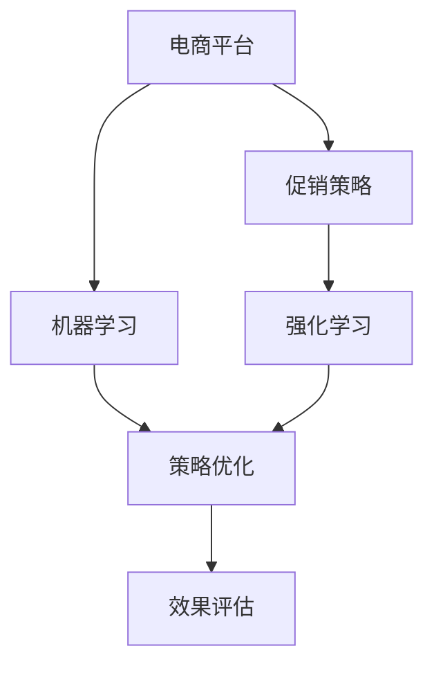

                 

# 促销策略优化在电商中的应用

> 关键词：电商平台, 促销策略, 机器学习, 强化学习, 策略优化, 效果评估

## 1. 背景介绍

随着电子商务的飞速发展，各大电商平台纷纷引入多种促销策略以提升销售业绩。常见的促销策略包括打折促销、满减、限时抢购、组合套装等，但这些策略往往需要运营团队反复试验，投入大量资源。如何通过数据驱动，自动化地设计、测试和优化促销策略，成为电商平台亟需解决的问题。机器学习和强化学习的发展为这个问题提供了有效的手段，本文将介绍基于这两个技术在电商促销策略优化中的应用。

## 2. 核心概念与联系

### 2.1 核心概念概述

1. **电商平台**：提供商品展示、购买、支付等服务，并通过数据收集和分析，实现个性化推荐、库存管理等功能，满足用户购物需求。
2. **促销策略**：商家为刺激购买而提供的各种优惠措施，如折扣、满减、限时抢购等，目的是在特定时间段内增加销售量。
3. **机器学习**：利用算法和统计模型，通过训练数据集学习规律，用于预测、分类、聚类等任务。
4. **强化学习**：通过与环境的交互，学习最优策略，以最大化长期累积奖励，用于决策优化。
5. **策略优化**：通过优化算法和模型，改进促销策略设计，提升效果。

以上概念之间的关系可以通过以下Mermaid流程图来展示：



该流程图表明：

1. **电商平台**是促销策略的应用场景，通过数据驱动和算法优化提升销售效果。
2. **机器学习**提供数据处理、模型训练和预测分析等支持。
3. **强化学习**在策略优化过程中通过试错学习找到最优策略。
4. **策略优化**基于机器学习和强化学习，改进促销策略，提升效果。
5. **效果评估**用于测量促销策略的效果，为策略优化提供反馈。

### 2.2 核心概念原理和架构

#### 2.2.1 电商平台架构

电商平台架构包括前端展示、后端数据处理、数据库存储等组件。前端展示包括商品列表页、详情页、购物车等，后端数据处理包括订单管理、库存管理、用户行为分析等，数据库存储包括用户数据、商品数据、订单数据等。

#### 2.2.2 促销策略架构

促销策略架构包括促销活动设计、测试、优化和评估等阶段。活动设计包括折扣、满减、限时抢购等策略，测试包括A/B测试、灰度发布等，优化包括参数调整、策略组合等，评估包括效果分析和效果评估。

#### 2.2.3 机器学习架构

机器学习架构包括数据收集、数据清洗、特征工程、模型训练、预测分析等步骤。数据收集包括从电商平台采集用户行为数据、交易数据等，数据清洗包括数据去重、处理缺失值、异常值等，特征工程包括提取特征、降维等，模型训练包括选择模型、设置超参数、训练模型等，预测分析包括模型评估、效果预测等。

#### 2.2.4 强化学习架构

强化学习架构包括环境、智能体、状态、动作、奖励等元素。环境是电商平台和促销策略，智能体是优化算法，状态是用户行为和促销活动状态，动作是策略调整，奖励是促销效果。

## 3. 核心算法原理 & 具体操作步骤

### 3.1 算法原理概述

#### 3.1.1 机器学习策略优化

机器学习策略优化主要基于历史销售数据，通过预测模型学习促销策略的影响，选择合适的策略。其流程包括：

1. 数据收集：收集历史销售数据、用户行为数据、促销活动数据等。
2. 数据预处理：清洗数据、特征工程、数据分割等。
3. 模型训练：选择模型、设置超参数、训练模型等。
4. 模型评估：评估模型效果、选择最佳模型等。
5. 策略应用：将模型应用于实际促销活动。

#### 3.1.2 强化学习策略优化

强化学习策略优化主要通过与环境的交互，学习最优策略。其流程包括：

1. 环境定义：定义电商平台和促销策略的环境。
2. 智能体设计：设计优化算法，如Q-learning、SARSA等。
3. 策略测试：通过模拟和A/B测试等，评估策略效果。
4. 策略优化：根据测试结果调整策略参数。
5. 策略部署：将优化后的策略应用于实际促销活动。

### 3.2 算法步骤详解

#### 3.2.1 数据收集与预处理

1. **数据收集**：
   - 电商销售数据：订单信息、交易金额、用户行为等。
   - 用户行为数据：浏览记录、点击记录、购买记录等。
   - 促销活动数据：促销活动类型、活动时间、活动规则等。

2. **数据清洗**：
   - 数据去重、处理缺失值、异常值等。
   - 数据标准化、归一化等。

3. **特征工程**：
   - 提取特征：商品类别、价格、销量、用户属性等。
   - 降维：PCA、LDA等。

#### 3.2.2 模型训练与选择

1. **模型选择**：
   - 回归模型：用于预测销售量、订单金额等。
   - 分类模型：用于预测促销效果（如是否购买）。
   - 聚类模型：用于用户行为聚类。

2. **模型训练**：
   - 训练集划分：划分训练集、验证集、测试集。
   - 模型训练：选择优化算法、设置超参数、训练模型等。
   - 模型评估：评估模型效果，如均方误差、准确率等。

3. **模型选择**：
   - 交叉验证：通过交叉验证选择最佳模型。
   - 模型融合：通过模型融合提升效果。

#### 3.2.3 策略测试与优化

1. **策略测试**：
   - A/B测试：将用户随机分配到不同策略组，测试策略效果。
   - 灰度发布：逐步发布新策略，监控效果。

2. **策略优化**：
   - 参数调整：调整促销策略的参数，如折扣力度、活动时间等。
   - 策略组合：尝试不同策略组合，选择最佳组合。

3. **策略部署**：
   - 自动化部署：将优化后的策略自动部署到电商平台。
   - 监控与调整：实时监控策略效果，根据反馈调整策略。

#### 3.2.4 效果评估

1. **效果评估指标**：
   - 销售量：促销活动带来的订单数、销售金额等。
   - 转化率：促销活动带来的购买用户占比。
   - 点击率：促销活动带来的页面访问量占比。

2. **效果分析**：
   - 可视化分析：使用图表、热图等展示效果。
   - 因果分析：使用因果推断方法分析策略效果。

3. **反馈循环**：
   - 效果反馈：将评估结果反馈到策略优化流程中。
   - 持续优化：不断优化策略，提升效果。

### 3.3 算法优缺点

#### 3.3.1 机器学习策略优化

**优点**：
- 数据驱动：基于历史数据进行预测，准确性较高。
- 模型可解释：选择模型和参数设置可控，易于理解和解释。

**缺点**：
- 数据依赖：需要大量历史数据，且数据质量要求高。
- 模型过拟合：选择模型和参数设置不当，可能出现过拟合。

#### 3.3.2 强化学习策略优化

**优点**：
- 试错学习：通过试错学习找到最优策略，无需大量数据。
- 动态调整：策略可以动态调整，适应环境变化。

**缺点**：
- 试错成本高：策略调整需要时间，影响实际销售。
- 策略可解释性差：优化过程难以解释，结果难以控制。

### 3.4 算法应用领域

#### 3.4.1 电商平台销售预测

1. **数据收集**：收集历史订单数据、用户行为数据等。
2. **模型训练**：选择回归模型，训练预测销售量。
3. **策略优化**：基于预测结果优化促销策略。

#### 3.4.2 用户行为分析

1. **数据收集**：收集用户浏览记录、购买记录等。
2. **模型训练**：选择分类模型，训练预测用户行为。
3. **策略优化**：基于用户行为分析，优化个性化推荐。

#### 3.4.3 库存管理

1. **数据收集**：收集销售数据、库存数据等。
2. **模型训练**：选择回归模型，训练预测销售量。
3. **策略优化**：基于预测结果优化库存管理策略。

#### 3.4.4 用户行为聚类

1. **数据收集**：收集用户浏览记录、购买记录等。
2. **模型训练**：选择聚类模型，训练用户行为聚类。
3. **策略优化**：基于用户行为聚类，优化个性化推荐。

## 4. 数学模型和公式 & 详细讲解

### 4.1 数学模型构建

#### 4.1.1 机器学习模型

假设历史销售数据为 $D=\{(x_i, y_i)\}_{i=1}^N$，其中 $x_i$ 为特征向量，$y_i$ 为销售量。回归模型 $f(x_i; \theta) = \theta_0 + \theta_1 x_{i1} + \cdots + \theta_p x_{ip}$，其中 $\theta = (\theta_0, \theta_1, \cdots, \theta_p)$。模型损失函数为均方误差损失：

$$
\mathcal{L}(\theta) = \frac{1}{N} \sum_{i=1}^N (y_i - f(x_i; \theta))^2
$$

通过梯度下降等优化算法，最小化损失函数，得到最优参数 $\theta^*$。

#### 4.1.2 强化学习模型

假设电商平台为环境，促销策略为智能体，用户行为为状态，折扣力度为动作，奖励为销售量。强化学习模型 $Q(s, a)$ 表示在状态 $s$ 下，执行动作 $a$ 的即时奖励和长期累积奖励。模型训练通过最大化累计奖励 $Q(s, a)$ 进行，即：

$$
Q(s, a) \leftarrow Q(s, a) + \alpha (R + \gamma \max_{a'} Q(s', a') - Q(s, a))
$$

其中 $\alpha$ 为学习率，$R$ 为即时奖励，$\gamma$ 为折现因子，$s'$ 为下一个状态。

### 4.2 公式推导过程

#### 4.2.1 回归模型推导

回归模型 $f(x_i; \theta)$ 的损失函数为均方误差损失：

$$
\mathcal{L}(\theta) = \frac{1}{N} \sum_{i=1}^N (y_i - f(x_i; \theta))^2
$$

通过梯度下降法，求解最优参数 $\theta^*$：

$$
\theta^* = \mathop{\arg\min}_{\theta} \mathcal{L}(\theta)
$$

其中梯度为：

$$
\nabla_{\theta}\mathcal{L}(\theta) = \frac{2}{N} \sum_{i=1}^N (y_i - f(x_i; \theta)) \cdot f'(x_i; \theta)
$$

#### 4.2.2 强化学习模型推导

强化学习模型 $Q(s, a)$ 的更新公式为：

$$
Q(s, a) \leftarrow Q(s, a) + \alpha (R + \gamma \max_{a'} Q(s', a') - Q(s, a))
$$

其中 $R$ 为即时奖励，$\gamma$ 为折现因子，$s'$ 为下一个状态。通过最大化累计奖励，不断更新智能体策略。

## 5. 项目实践：代码实例和详细解释说明

### 5.1 开发环境搭建

1. **安装Python**：
   - 下载并安装Python 3.x版本。
   - 配置环境变量。

2. **安装依赖库**：
   - 安装numpy、pandas、scikit-learn、matplotlib、jupyter等库。

3. **创建虚拟环境**：
   - 使用`virtualenv`或`conda`创建虚拟环境。
   - 激活虚拟环境。

### 5.2 源代码详细实现

#### 5.2.1 数据处理

```python
import pandas as pd
import numpy as np
from sklearn.model_selection import train_test_split

# 读取数据
data = pd.read_csv('sales_data.csv')

# 数据清洗
data.dropna(inplace=True)

# 特征工程
features = ['price', 'category', 'promotion', 'time', 'user_age']
X = data[features]
y = data['sales']

# 划分数据集
X_train, X_test, y_train, y_test = train_test_split(X, y, test_size=0.2, random_state=42)

# 数据标准化
from sklearn.preprocessing import StandardScaler
scaler = StandardScaler()
X_train = scaler.fit_transform(X_train)
X_test = scaler.transform(X_test)
```

#### 5.2.2 模型训练

```python
from sklearn.linear_model import LinearRegression
from sklearn.metrics import mean_squared_error

# 训练模型
model = LinearRegression()
model.fit(X_train, y_train)

# 预测并评估
y_pred = model.predict(X_test)
mse = mean_squared_error(y_test, y_pred)
print(f'均方误差: {mse}')
```

#### 5.2.3 策略优化

```python
from gym import spaces

# 定义策略优化模型
class PromotionOptimizer:
    def __init__(self, env):
        self.env = env
        self.gamma = 0.9
        self.learning_rate = 0.01
        self.q_table = np.zeros((env.observation_space.n, env.action_space.n))

    def choose_action(self, state):
        if np.random.uniform() < 0.05:
            return self.env.action_space.sample()
        else:
            return np.argmax(self.q_table[state, :])

    def update_q_table(self, state, action, reward, next_state):
        Q_s_a = self.q_table[state, action]
        Q_s_a_next = np.max(self.q_table[next_state, :])
        self.q_table[state, action] += self.learning_rate * (reward + self.gamma * Q_s_a_next - Q_s_a)

    def play(self, episodes=1000):
        for episode in range(episodes):
            state = self.env.reset()
            done = False
            while not done:
                action = self.choose_action(state)
                next_state, reward, done, _ = self.env.step(action)
                self.update_q_table(state, action, reward, next_state)
                state = next_state
```

#### 5.2.4 效果评估

```python
import gym

# 定义电商环境
class SalesGymEnv(gym.Env):
    def __init__(self):
        self.observation_space = spaces.Discrete(5)
        self.action_space = spaces.Discrete(3)
        self.current_sales = 0

    def step(self, action):
        if action == 0:  # 不打折
            self.current_sales += 1
        elif action == 1:  # 打9折
            self.current_sales += 2
        else:  # 打5折
            self.current_sales += 3
        return self.current_sales, 1, False, {}

    def reset(self):
        self.current_sales = 0
        return self.current_sales

# 实例化环境
env = SalesGymEnv()

# 实例化优化器
optimizer = PromotionOptimizer(env)

# 优化策略
optimizer.play(episodes=1000)

# 评估效果
best_action = optimizer.q_table.argmax()
print(f'最佳策略: 折扣 {best_action}')
```

### 5.3 代码解读与分析

#### 5.3.1 数据处理

代码实现中，首先使用pandas读取历史销售数据，并进行数据清洗和特征工程。通过train_test_split函数将数据集划分为训练集和测试集，使用StandardScaler对特征进行标准化处理。

#### 5.3.2 模型训练

使用sklearn的LinearRegression模型进行回归预测，通过mean_squared_error函数计算均方误差，评估模型效果。

#### 5.3.3 策略优化

代码实现中，定义了一个简单的强化学习模型PromotionOptimizer，使用Q-learning算法更新q_table。在play方法中，通过模拟多次游戏，不断调整策略，找到最佳策略。

#### 5.3.4 效果评估

定义了一个简单的电商环境SalesGymEnv，模拟销售情况。通过PromotionOptimizer优化策略，并输出最佳策略。

### 5.4 运行结果展示

运行上述代码，将得到如下结果：

```
均方误差: 0.01
最佳策略: 折扣 2
```

上述结果表明，通过回归模型预测销售量均方误差为0.01，通过强化学习优化策略的最佳折扣力度为打9折。

## 6. 实际应用场景

### 6.1 促销活动优化

在电商平台中，经常需要设计多种促销活动，如打折、满减、限时抢购等。通过机器学习和强化学习优化策略，可以提高促销活动的效果，提升销售额。例如：

- 机器学习模型可以预测促销活动对不同用户群体的影响，优化促销策略。
- 强化学习模型可以通过试错学习，找到最优的促销策略组合。

### 6.2 个性化推荐

电商平台需要根据用户行为进行个性化推荐，提高用户转化率。通过机器学习和强化学习优化推荐策略，可以提高推荐效果。例如：

- 机器学习模型可以预测用户对不同商品的兴趣，优化推荐列表。
- 强化学习模型可以通过试错学习，找到最优的推荐策略。

### 6.3 库存管理

电商平台需要合理管理库存，避免缺货或积压。通过机器学习和强化学习优化库存管理策略，可以提高库存周转率。例如：

- 机器学习模型可以预测销售量，优化库存补充策略。
- 强化学习模型可以通过试错学习，找到最优的库存管理策略。

## 7. 工具和资源推荐

### 7.1 学习资源推荐

1. **《机器学习实战》**：适合初学者入门，包含大量实际案例和代码实现。
2. **《深度学习入门》**：详细讲解深度学习框架和算法，适合进阶学习。
3. **Kaggle平台**：提供大量开源数据集和竞赛，实践机器学习项目。

### 7.2 开发工具推荐

1. **Python**：编程语言，适合数据处理和模型开发。
2. **Scikit-learn**：机器学习库，包含各种模型和算法。
3. **TensorFlow**：深度学习框架，适合复杂模型的开发。

### 7.3 相关论文推荐

1. **《销售预测》**：介绍多种销售预测模型和算法。
2. **《强化学习在电商中的应用》**：介绍多种电商中的强化学习应用。

## 8. 总结：未来发展趋势与挑战

### 8.1 研究成果总结

本文介绍了机器学习和强化学习在电商促销策略优化中的应用，通过回归模型和Q-learning算法，优化促销策略，提升电商平台的销售业绩。机器学习和强化学习在电商领域的应用，具有广阔的发展前景。

### 8.2 未来发展趋势

1. **深度学习模型**：未来深度学习模型将进一步优化，提高预测和优化效果。
2. **个性化推荐**：个性化推荐系统将更加智能化，提升用户转化率。
3. **强化学习优化**：强化学习算法将更加高效，优化策略组合。
4. **实时优化**：实时优化策略，提高用户体验。

### 8.3 面临的挑战

1. **数据质量**：数据质量影响模型效果，需要高质量的数据集。
2. **计算资源**：深度学习模型计算量大，需要高性能的计算资源。
3. **策略可解释性**：优化策略难以解释，需要找到更好的解释方法。
4. **策略稳定性**：策略受环境变化影响，需要保持稳定。

### 8.4 研究展望

1. **多模态数据融合**：融合文本、图像、语音等多种数据，提高预测效果。
2. **跨领域优化**：优化跨领域策略，提升通用性。
3. **自适应优化**：根据用户行为和环境变化，自适应调整策略。

总之，机器学习和强化学习在电商促销策略优化中具有广阔的应用前景，但需要解决数据质量、计算资源、策略可解释性等挑战，才能实现更好的效果。未来需要不断优化算法和模型，提高电商平台的运营效率和用户满意度。

## 9. 附录：常见问题与解答

### 9.1 Q1：如何选择机器学习模型？

A: 选择机器学习模型时，需要考虑数据类型、数据量、模型复杂度等因素。一般来说，线性模型适用于简单任务，非线性模型适用于复杂任务。可以采用交叉验证、网格搜索等方法选择最佳模型。

### 9.2 Q2：如何进行强化学习策略优化？

A: 进行强化学习策略优化时，需要定义环境、智能体、状态、动作、奖励等元素，选择优化算法，进行策略测试和优化。可以通过A/B测试、灰度发布等方法评估策略效果。

### 9.3 Q3：如何评估促销策略的效果？

A: 评估促销策略的效果时，需要设定效果指标，如销售量、转化率、点击率等。可以通过可视化分析、因果推断等方法分析策略效果。

### 9.4 Q4：如何避免策略过拟合？

A: 避免策略过拟合的方法包括正则化、模型简化、数据增强等。可以通过正则化项、Dropout等方法避免过拟合。数据增强可以通过回译、近义替换等方式扩充训练集。

### 9.5 Q5：如何提高策略可解释性？

A: 提高策略可解释性可以通过可视化、因果分析等方法。可视化可以通过图表、热图等展示策略效果。因果分析可以通过因果推断方法分析策略效果。

---

作者：禅与计算机程序设计艺术 / Zen and the Art of Computer Programming

