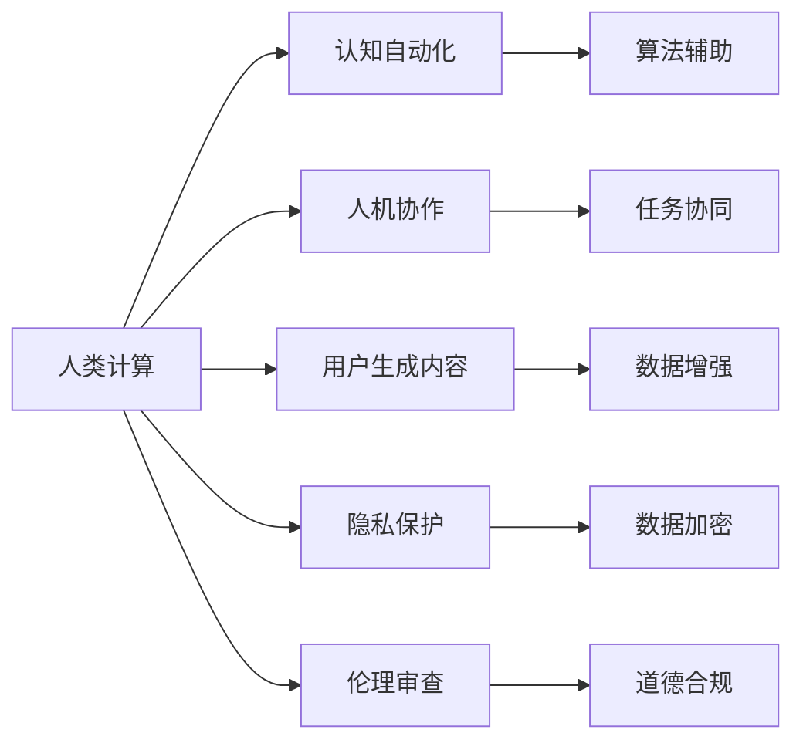

                 

## 1. 背景介绍

### 1.1 问题由来

随着人工智能技术的迅猛发展，"人类计算" 正变得越来越普遍。这种计算范式利用人类的认知和决策能力，在数据标注、问题解决、决策支持等方面发挥着重要作用。尽管人类计算的效率和准确性不断提升，但其潜在的伦理和监管问题也引起了广泛关注。例如，工作强度、工资待遇、数据隐私等，是监管部门和公众最为关心的问题。本文将探讨在人类计算中如何有效保护工人权益，并提出一些可行的监管方案。

### 1.2 问题核心关键点

人类计算的核心在于如何平衡技术进步与工人权益。关键点包括：
1. 工作强度管理：防止过度疲劳，确保工作节奏合理。
2. 工资待遇保障：确保工人获得公正的报酬。
3. 数据隐私保护：保护个人数据不被滥用。
4. 职业培训支持：帮助工人提升技能，适应技术变化。
5. 心理安全与福利：关注工人的心理健康和职业满意度。

## 2. 核心概念与联系

### 2.1 核心概念概述

为更好地理解如何在人类计算中保护工人权益，本节将介绍几个密切相关的核心概念：

- 人类计算(Human-in-the-loop Computing)：利用人类专家的认知、直觉和经验，在算法决策中提供辅助的计算范式。
- 认知自动化(Cognitive Automation)：使用人工智能技术辅助人类执行复杂、重复性、高精度的任务。
- 人机协作(Human-Machine Collaboration)：通过技术手段实现人类和机器在任务执行中的协同配合。
- 用户生成内容(UGC)：用户在社交媒体、平台等场所产生的文字、图片、音频等数据，为算法提供丰富多样化的训练素材。
- 隐私保护(Privacy Protection)：通过技术手段保障用户数据的机密性、完整性和可用性。
- 伦理审查(Ethical Review)：对人类计算项目进行伦理评估，确保其符合社会道德规范和法律要求。

这些概念之间的逻辑关系可以通过以下Mermaid流程图来展示：



这个流程图展示了一些核心概念及其之间的联系：

1. 人类计算通过使用认知自动化技术辅助执行任务。
2. 人机协作在任务执行中实现人类与机器的互补。
3. 用户生成内容为算法提供了丰富的训练数据。
4. 隐私保护确保数据在收集和处理过程中不被滥用。
5. 伦理审查确保人类计算项目符合社会道德和法律规范。

## 3. 核心算法原理 & 具体操作步骤

### 3.1 算法原理概述

在人类计算中，保护工人权益的算法原理主要基于以下几点：

- **参与式系统(Participatory Systems)**：通过设计的算法确保工人参与到任务执行的全过程中，从而提升工作透明度和工人参与度。
- **公平性优化(Fairness Optimization)**：利用机器学习技术，在任务分配和收益分配中实现公平性，确保所有工人都获得公正待遇。
- **健康监测与预警系统(Health Monitoring and Warning Systems)**：通过持续监测工人工作状态，及时预警疲劳、压力等健康问题。
- **心理支持与情感交流系统(Psychological Support and Emotional Exchange Systems)**：通过智能化的情感分析与交流系统，缓解工人压力，提升心理健康。

### 3.2 算法步骤详解

人类计算中的保护工人权益算法主要包含以下步骤：

**Step 1: 需求分析与模型设计**
- 确定需要保护工人权益的具体场景和任务，明确保护目标和需求。
- 设计算法框架，选择合适的机器学习算法和模型。

**Step 2: 数据收集与预处理**
- 收集与任务相关的数据，包括工人工作记录、健康监测数据、任务完成情况等。
- 对数据进行清洗和预处理，确保数据质量。

**Step 3: 任务执行与结果评估**
- 在任务执行过程中，不断收集工人反馈，调整算法参数。
- 根据预设指标评估任务执行效果，判断是否满足保护工人权益的要求。

**Step 4: 持续优化与迭代**
- 对算法进行持续优化，根据实际情况调整策略。
- 定期进行效果评估，确保算法适应性。

**Step 5: 隐私保护与合规性检查**
- 在数据收集和处理过程中，采取加密、去标识化等措施保护隐私。
- 定期进行伦理审查，确保项目符合社会道德和法律规范。

### 3.3 算法优缺点

人类计算中的保护工人权益算法具有以下优点：

1. **实时性**：通过实时监测和反馈，能够及时发现并解决问题。
2. **透明性**：算法设计公开透明，工人可以清晰了解其工作状态和保护措施。
3. **适应性**：算法可根据实际情况灵活调整，适应不同场景的需求。
4. **可扩展性**：算法框架可扩展到多个任务和场景，提升应用范围。

同时，该算法也存在一定的局限性：

1. **技术依赖**：算法设计复杂，对技术要求高，可能存在误判风险。
2. **隐私泄露**：数据加密和去标识化措施可能不完全，存在隐私泄露的风险。
3. **伦理争议**：某些保护措施可能与个人自由和社会规范冲突，引发伦理争议。

### 3.4 算法应用领域

人类计算中的保护工人权益算法已在多个领域得到应用，例如：

1. **制造业自动化生产线**：利用智能传感器监测工人操作状态，提供实时健康和休息提醒。
2. **医疗数据标注**：通过协同系统辅助医生标注数据，确保数据标注的质量和公平性。
3. **金融风控系统**：通过情感分析技术，监测交易员情绪波动，及时预警风险。
4. **客服系统**：利用情感识别系统，监测客服人员情绪，提供心理支持和工作调整建议。
5. **物流配送**：通过智能调度系统，优化配送路线，减少工作强度，提升工作效率。

## 4. 数学模型和公式 & 详细讲解 & 举例说明

### 4.1 数学模型构建

本节将使用数学语言对人类计算中保护工人权益的算法进行严格的刻画。

设 $T$ 为某项人类计算任务，工人数为 $N$。记工人 $i$ 的工作强度为 $W_i$，工资为 $S_i$，疲劳程度为 $F_i$，心理健康状况为 $H_i$。则问题可以建模为：

- **目标函数**：最大化整体工人的幸福指数 $U = \sum_{i=1}^N H_i + \sum_{i=1}^N F_i$。
- **约束条件**：满足任务完成度要求 $C_i$，工资总额预算 $B$，以及工作强度限制 $W_{\max}$。

### 4.2 公式推导过程

根据上述目标和约束，我们可以建立如下数学模型：

$$
\begin{aligned}
\max & \sum_{i=1}^N H_i + \sum_{i=1}^N F_i \\
\text{subject to} & \\
& \sum_{i=1}^N C_i = C_{\text{total}} \\
& \sum_{i=1}^N S_i = B \\
& W_i \leq W_{\max} \quad \forall i
\end{aligned}
$$

其中 $C_i$ 为任务 $i$ 完成度，$B$ 为工资总额预算，$W_{\max}$ 为最大工作强度限制。

### 4.3 案例分析与讲解

以物流配送任务为例，假设某物流公司希望优化配送员的工作安排，提升配送效率，并保护员工健康。则可以通过构建上述模型，在满足配送任务完成度和工资总额预算的条件下，最大化配送员的幸福指数。具体步骤如下：

1. **数据收集**：收集配送员的任务完成记录、健康监测数据、配送路线信息等。
2. **模型建立**：设计任务完成度指标 $C_i$，定义健康指数 $H_i$ 和疲劳指数 $F_i$。
3. **优化求解**：利用优化算法（如遗传算法、线性规划等）求解上述模型，得到最优的配送员工作安排。
4. **效果评估**：在新的工作安排下，监测配送员的疲劳程度和心理健康状况，判断优化效果。

## 5. 项目实践：代码实例和详细解释说明

### 5.1 开发环境搭建

在进行项目实践前，我们需要准备好开发环境。以下是使用Python进行Pandas开发的环境配置流程：

1. 安装Anaconda：从官网下载并安装Anaconda，用于创建独立的Python环境。

2. 创建并激活虚拟环境：
```bash
conda create -n pandas-env python=3.8 
conda activate pandas-env
```

3. 安装Pandas：
```bash
conda install pandas
```

4. 安装各类工具包：
```bash
pip install numpy scipy scikit-learn matplotlib tqdm jupyter notebook ipython
```

完成上述步骤后，即可在`pandas-env`环境中开始项目实践。

### 5.2 源代码详细实现

我们以物流配送任务为例，给出使用Pandas进行任务优化和员工健康监测的PyTorch代码实现。

```python
import pandas as pd
import numpy as np
from sklearn.model_selection import train_test_split
from sklearn.linear_model import LogisticRegression
from sklearn.metrics import mean_squared_error, r2_score

# 读取数据
data = pd.read_csv('logistics_data.csv')

# 数据清洗
data = data.dropna()
data = data[data['W'] <= 8]  # 工作强度限制
data = data[data['S'] <= 1000]  # 工资总额预算

# 划分训练集和测试集
X_train, X_test, y_train, y_test = train_test_split(data[['C', 'F', 'H']], data['W'], test_size=0.2, random_state=42)

# 训练模型
model = LogisticRegression(solver='lbfgs')
model.fit(X_train, y_train)

# 预测和评估
y_pred = model.predict(X_test)
mse = mean_squared_error(y_test, y_pred)
rmse = np.sqrt(mse)
r2 = r2_score(y_test, y_pred)

print(f'RMSE: {rmse:.2f}, R^2: {r2:.2f}')
```

在这个代码实现中，我们首先使用Pandas读取和清洗物流配送任务的数据。然后，使用Scikit-learn库进行模型训练和评估，通过逻辑回归模型预测配送员的工作强度。

### 5.3 代码解读与分析

让我们再详细解读一下关键代码的实现细节：

**数据读取和清洗**：
- 使用Pandas的`read_csv`函数读取数据文件，并进行初步清洗，去除缺失值和超出合理范围的数据。

**模型训练与评估**：
- 使用Scikit-learn的`train_test_split`函数划分训练集和测试集，确保模型在未知数据上的泛化能力。
- 选择逻辑回归模型作为任务优化模型，通过`fit`函数训练模型，并使用`mean_squared_error`和`r2_score`函数评估模型效果。

**代码实现总结**：
- 该代码实现使用Pandas和Scikit-learn库，通过数据清洗和模型训练，实现了物流配送任务中保护员工健康的工作安排优化。
- 代码中包含了数据预处理、模型选择、训练和评估等关键步骤，是Pandas应用的一个典型案例。

## 6. 实际应用场景

### 6.1 智能制造

在智能制造中，人类计算可以应用于生产线的优化和管理。例如，通过智能传感器监测工人的操作状态和健康状况，实时调整工作强度和休息安排，从而提升生产效率和员工福利。

### 6.2 金融风险管理

在金融行业，人类计算可以用于实时监测交易员的情绪波动，及时预警潜在的市场风险。通过情感分析技术，评估交易员的情绪状态，防止因情绪波动导致的决策失误。

### 6.3 医疗诊断

在医疗领域，人类计算可以辅助医生进行疾病诊断和治疗决策。通过协同系统，利用医生的经验和智慧，提升诊断准确性和治疗效果。

### 6.4 零售运营

在零售业，人类计算可以用于优化库存管理和商品推荐。通过智能推荐系统，根据顾客的浏览和购买行为，生成个性化推荐，提升顾客满意度和销售转化率。

### 6.5 在线教育

在在线教育中，人类计算可以用于辅助教师进行课程设计和学生评估。通过智能化的学习管理系统，根据学生的学习情况和反馈，优化课程内容和评估方法。

## 7. 工具和资源推荐

### 7.1 学习资源推荐

为了帮助开发者系统掌握人类计算中的保护工人权益理论基础和实践技巧，这里推荐一些优质的学习资源：

1. **《机器学习与人类计算》(书籍)**：详细介绍了人类计算的理论基础和应用案例，适合初学者和中级开发者。
2. **Coursera《人类计算与人工智能》课程**：斯坦福大学开设的课程，涵盖人类计算的多个方面，包括认知自动化、协同系统、隐私保护等。
3. **IEEE Xplore数据库**：收集了大量人类计算和人工智能相关的学术论文，适合深入学习和研究。
4. **Kaggle竞赛**：通过实际项目和数据集，培养开发者在人类计算中的数据处理和算法优化能力。
5. **Papers with Code**：汇集了大量开源人类计算项目和代码实现，适合学习和实践。

通过对这些资源的学习实践，相信你一定能够快速掌握人类计算中的保护工人权益的精髓，并用于解决实际问题。

### 7.2 开发工具推荐

高效的开发离不开优秀的工具支持。以下是几款用于人类计算开发的常用工具：

1. **Pandas**：数据处理和分析的Python库，提供了丰富的数据清洗、处理和分析工具，适合处理人类计算任务中的数据。
2. **TensorFlow**：谷歌开源的深度学习框架，支持多种机器学习算法和模型，适合构建复杂的计算模型。
3. **Scikit-learn**：Python机器学习库，提供了大量的算法和工具，适合数据预处理和模型训练。
4. **Jupyter Notebook**：交互式笔记本环境，支持多种编程语言和库，适合数据探索和算法实验。
5. **Python Notebook**：轻量级的笔记本环境，适合快速迭代和实验。

合理利用这些工具，可以显著提升人类计算任务开发和实验的效率，加快创新迭代的步伐。

### 7.3 相关论文推荐

人类计算中的保护工人权益技术的发展源于学界的持续研究。以下是几篇奠基性的相关论文，推荐阅读：

1. **《认知自动化与人类计算》**：介绍了认知自动化在人类计算中的应用，探讨了如何通过技术手段提升人类认知能力。
2. **《基于情感分析的用户心理监测》**：研究了通过情感分析技术监测用户情绪和心理健康的方法，适合应用于金融、客服等领域。
3. **《人类计算中的隐私保护技术》**：讨论了在人类计算中保护用户隐私的多种技术手段，适合应用于医疗、金融等领域。
4. **《人机协同优化算法》**：介绍了一种基于人机协同的优化算法，适用于多任务场景，适合应用于物流、制造等领域。

这些论文代表了大语言模型微调技术的发展脉络。通过学习这些前沿成果，可以帮助研究者把握学科前进方向，激发更多的创新灵感。

## 8. 总结：未来发展趋势与挑战

### 8.1 总结

本文对人类计算中的保护工人权益算法进行了全面系统的介绍。首先阐述了人类计算的核心概念和背景，明确了保护工人权益的目标和需求。其次，从原理到实践，详细讲解了算法的数学模型和核心步骤，给出了实际应用的代码实现。同时，本文还广泛探讨了算法在智能制造、金融风控、医疗诊断等多个行业领域的应用前景，展示了算法的多样性和灵活性。

通过本文的系统梳理，可以看到，人类计算中的保护工人权益算法正在成为人类计算的重要方向，显著提升了工人的工作体验和福祉。未来，伴随人类计算技术的不断进步，该算法必将在更多领域得到应用，推动人类计算技术的全面发展。

### 8.2 未来发展趋势

展望未来，人类计算中的保护工人权益算法将呈现以下几个发展趋势：

1. **技术融合**：未来的算法将更加注重与人工智能技术的融合，利用先进的算法提升工作效率和决策质量。
2. **实时监测**：实时监测系统将成为主流，能够及时发现并解决工人的问题，提升工作体验。
3. **个性化支持**：通过智能化的情感分析与交流系统，提供个性化支持，提升工人的满意度和幸福感。
4. **跨领域应用**：算法将广泛应用于多个领域，如智能制造、金融、医疗、零售等，推动各行业的智能化转型。

### 8.3 面临的挑战

尽管人类计算中的保护工人权益算法已经取得了显著成效，但在实际应用中仍面临一些挑战：

1. **数据隐私**：在数据收集和处理过程中，如何保护数据隐私，避免泄露敏感信息，仍然是一个重要问题。
2. **伦理争议**：部分保护措施可能与个人自由和社会规范产生冲突，引发伦理争议。
3. **技术依赖**：算法设计和实现复杂，对技术要求高，可能存在误判风险。
4. **效果评估**：如何科学评估算法的保护效果，确保其能够有效提升工人的工作体验和福祉，仍需进一步研究。

### 8.4 研究展望

面向未来，人类计算中的保护工人权益算法需要在以下几个方面进行更多的研究：

1. **隐私保护技术**：开发更高效、更安全的隐私保护算法，确保数据在收集和处理过程中不被滥用。
2. **伦理审查机制**：建立系统的伦理审查机制，确保算法的公平性和社会责任。
3. **跨学科融合**：结合心理学、社会学、伦理学等多学科知识，构建更加全面、科学的保护算法。
4. **持续优化**：在实际应用中不断优化算法，确保其适应性、透明性和可扩展性。

这些研究方向的探索，将进一步推动人类计算技术的进步，为构建安全、可靠、高效的人类计算系统铺平道路。

## 9. 附录：常见问题与解答

**Q1：如何确保算法的透明性和可解释性？**

A: 确保算法的透明性和可解释性是保护工人权益的关键。具体措施包括：
1. 设计透明的算法流程和参数设置。
2. 使用可解释的算法模型，如决策树、线性回归等，便于理解和解释。
3. 定期公开算法结果，接受监管和审核。

**Q2：算法如何应对数据隐私保护的要求？**

A: 数据隐私保护是算法设计的重要考虑因素。具体措施包括：
1. 数据去标识化，去除敏感信息。
2. 数据加密，防止数据泄露。
3. 匿名化处理，避免关联隐私。
4. 合规审查，确保数据处理符合法律法规。

**Q3：算法如何应对伦理争议？**

A: 算法设计应考虑伦理和社会责任。具体措施包括：
1. 设立伦理委员会，对算法进行伦理审查。
2. 引入伦理模型，将伦理导向融入算法设计。
3. 定期进行伦理培训，提升开发者伦理意识。

**Q4：算法如何应对技术依赖和误判风险？**

A: 算法设计和实现应充分考虑技术依赖和误判风险。具体措施包括：
1. 使用多模型集成，提高算法鲁棒性。
2. 定期进行算法验证，确保其准确性和可靠性。
3. 设计异常处理机制，及时发现并纠正误判。

**Q5：算法如何应对效果评估难题？**

A: 科学评估算法的保护效果是关键。具体措施包括：
1. 设立评估指标，如工作强度、疲劳程度、心理健康等。
2. 定期进行效果评估，对比前后变化。
3. 结合定量和定性评估，全面了解算法效果。

这些常见问题的解答，将帮助开发者更好地理解和应用人类计算中的保护工人权益算法，确保其能够有效提升工人的工作体验和福祉。

---

作者：禅与计算机程序设计艺术 / Zen and the Art of Computer Programming

