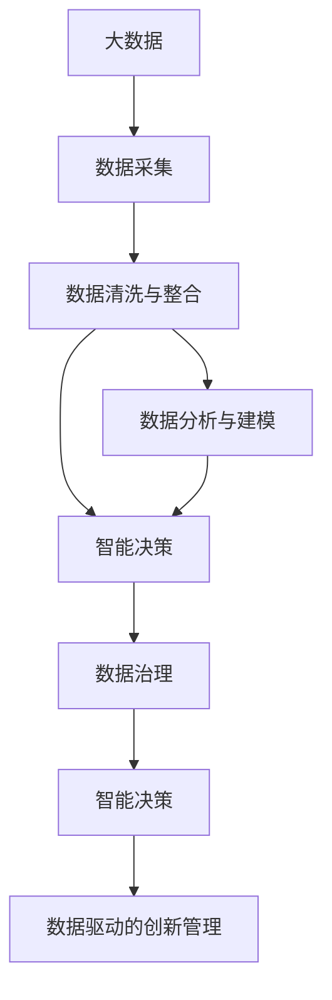

                 

# 信息差的创新管理驱动力：大数据如何推动创新管理

> 关键词：创新管理,信息差,大数据,智能决策,数据驱动,机器学习,数据治理,数据安全

## 1. 背景介绍

### 1.1 问题由来

在现代社会中，信息差（Information Gap）是一个普遍存在的现象，它影响着个人和组织的决策和创新。信息差指的是决策者需要了解的信息与其已掌握的信息之间存在的差距，这种差距可能会限制决策的有效性和创新性。例如，企业决策者可能没有足够的数据来支持其战略选择，或者市场信息与消费者实际需求之间存在偏差。

大数据技术的崛起为有效管理信息差提供了新的手段。大数据的广泛应用，使得企业能够获取和处理海量数据，从中发现隐藏的模式和趋势，为决策和创新提供支持。然而，如何有效地管理和利用大数据，从而驱动创新管理，仍然是一个具有挑战性的问题。

### 1.2 问题核心关键点

有效管理信息差，需要解决以下几个关键问题：

1. **数据获取**：如何高效、全面地获取所需数据。
2. **数据清洗与整合**：如何处理数据的噪声和冗余，实现数据的有效整合。
3. **数据分析与建模**：如何利用数据分析和机器学习技术，提取有价值的信息。
4. **智能决策**：如何将分析结果转化为实际的决策和行动。
5. **数据治理**：如何建立数据治理体系，确保数据的质量和安全。

## 2. 核心概念与联系

### 2.1 核心概念概述

要深入理解大数据如何推动创新管理，首先需要掌握以下几个核心概念：

- **大数据**：指数据量巨大、类型多样、速度快且价值密度低的数据集合。大数据技术包括数据采集、存储、处理和分析等环节。
- **信息差**：决策者需要了解的信息与其已掌握的信息之间的差距。有效管理信息差有助于提升决策和创新的准确性和效率。
- **智能决策**：基于数据分析和机器学习模型，自动或半自动地做出决策，以优化资源配置和业务流程。
- **数据驱动**：通过数据分析和智能决策，将数据作为决策和行动的基础，而不是依赖直觉或经验。
- **机器学习**：利用算法让机器自动从数据中学习，并做出预测或决策。
- **数据治理**：制定数据标准、管理和保护数据资产，确保数据的质量和安全。

这些概念之间的联系可以通过以下Mermaid流程图来展示：



这个流程图展示了大数据在信息差管理中的作用和流程：

1. 大数据通过数据采集获取信息。
2. 数据清洗与整合，将多源数据整合成可用格式。
3. 数据分析与建模，通过机器学习提取有价值的信息。
4. 智能决策，利用分析结果指导决策和创新。
5. 数据治理，确保数据的质量和安全。

这些环节相互依存，共同构成了一个完整的、基于大数据的创新管理系统。

## 3. 核心算法原理 & 具体操作步骤

### 3.1 算法原理概述

大数据驱动的创新管理，主要基于数据驱动和机器学习的方法。其核心算法原理包括以下几个步骤：

1. **数据采集与预处理**：从各种数据源收集数据，并进行清洗和预处理，去除噪声和冗余，保证数据质量。
2. **数据分析与建模**：利用机器学习算法，如回归分析、聚类、分类和预测等，对数据进行深入分析，提取有价值的模式和规律。
3. **智能决策**：结合业务场景和分析结果，自动或半自动地做出决策，优化资源配置和业务流程。
4. **迭代优化**：通过不断迭代优化，提升决策和创新的准确性和效率。

### 3.2 算法步骤详解

#### 数据采集与预处理

数据采集是信息差管理的第一步。常见的数据源包括企业内部系统、市场调研、社交媒体、物联网等。数据预处理则包括数据清洗、去重、填充缺失值等，以提高数据质量。

##### 数据清洗
数据清洗是数据预处理的核心环节。常用的数据清洗方法包括：
- 删除重复数据。
- 处理缺失值。
- 纠正错误和异常值。

##### 数据整合
数据整合是将来自不同源的数据整合成一个统一、标准化的数据集。常见的数据整合技术包括：
- 数据拼接（Concatenation）。
- 数据联接（Join）。
- 数据集成（Integration）。

#### 数据分析与建模

数据分析与建模是信息差管理的核心环节。常用的数据分析与建模方法包括：
- 回归分析（Regression Analysis）：用于预测连续数值型变量的变化趋势。
- 聚类分析（Cluster Analysis）：将数据分为多个相似的群组，揭示数据的内在结构。
- 分类分析（Classification）：将数据分为不同的类别，常用于分类任务。
- 预测分析（Prediction）：利用历史数据预测未来趋势，常用于预测任务。

##### 机器学习模型
常用的机器学习模型包括：
- 线性回归（Linear Regression）。
- 逻辑回归（Logistic Regression）。
- 决策树（Decision Tree）。
- 随机森林（Random Forest）。
- 支持向量机（Support Vector Machine）。
- 神经网络（Neural Networks）。

#### 智能决策

智能决策是将分析结果转化为实际的决策和行动。智能决策的核心是构建智能决策系统，常用的智能决策系统包括：
- 规则引擎（Rule Engine）：基于业务规则进行决策。
- 优化算法（Optimization Algorithms）：优化决策参数，提升决策效果。
- 强化学习（Reinforcement Learning）：通过试错的方式，不断调整决策策略，提升决策效果。

##### 决策支持系统（DSS）
决策支持系统（DSS）是一种基于数据和模型支持用户做出决策的系统。DSS的组成包括：
- 数据仓库（Data Warehouse）：存储和管理历史数据。
- 多维分析（OLAP）：支持多维数据建模和分析。
- 数据挖掘（Data Mining）：从数据中提取有价值的信息。
- 智能报表（Intelligent Reporting）：自动生成分析报告和图表。

#### 迭代优化

迭代优化是通过不断迭代改进，提升决策和创新的准确性和效率。常用的迭代优化方法包括：
- A/B测试（A/B Testing）：通过对比实验，评估决策效果。
- 灰度发布（Gray Release）：逐步发布新功能，减少风险。
- 反馈机制（Feedback Mechanism）：收集用户反馈，不断优化决策。

### 3.3 算法优缺点

大数据驱动的创新管理算法具有以下优点：

1. **数据驱动**：基于数据分析和机器学习，使得决策和创新更加客观和科学。
2. **全面性**：大数据技术能够处理多种类型的数据，提供全面、准确的信息。
3. **自动化**：利用智能决策系统和优化算法，实现自动化决策，提高效率。
4. **灵活性**：大数据技术支持实时分析和动态调整，适应快速变化的市场环境。

然而，大数据驱动的创新管理也存在以下缺点：

1. **数据隐私**：大数据分析涉及大量个人和企业数据，可能引发数据隐私问题。
2. **数据质量**：大数据质量参差不齐，数据清洗和整合过程复杂，可能影响分析结果。
3. **计算资源**：大数据分析需要大量的计算资源，可能带来高昂的计算成本。
4. **技术门槛**：大数据技术和机器学习模型需要专业知识，对技术人员的要求较高。

### 3.4 算法应用领域

大数据驱动的创新管理算法已经在多个领域得到了广泛应用：

- **金融领域**：用于风险评估、信用评分、欺诈检测等。
- **医疗领域**：用于疾病预测、患者分组、治疗方案推荐等。
- **零售领域**：用于需求预测、库存管理、个性化推荐等。
- **制造领域**：用于设备维护、质量控制、供应链优化等。
- **物流领域**：用于路线优化、仓库管理、配送调度等。

## 4. 数学模型和公式 & 详细讲解 & 举例说明

### 4.1 数学模型构建

大数据驱动的创新管理涉及多个数学模型，下面以线性回归模型为例，详细讲解其构建和应用。

#### 线性回归模型

线性回归模型是一种经典的机器学习模型，用于预测连续数值型变量的变化趋势。其数学模型为：

$$ y = \beta_0 + \beta_1 x_1 + \beta_2 x_2 + ... + \beta_n x_n + \epsilon $$

其中，$y$ 为预测变量，$x_i$ 为解释变量，$\beta_i$ 为回归系数，$\epsilon$ 为误差项。

#### 模型训练与预测

线性回归模型的训练过程包括：
1. 数据预处理：将数据标准化或归一化，以提高模型的拟合效果。
2. 模型拟合：利用最小二乘法（Least Squares）求解回归系数 $\beta_i$。
3. 模型评估：通过均方误差（MSE）或平均绝对误差（MAE）评估模型效果。

线性回归模型的预测过程包括：
1. 输入数据标准化或归一化。
2. 利用模型参数 $\beta_i$ 进行预测。
3. 输出预测结果。

### 4.2 公式推导过程

线性回归模型的推导过程如下：

1. 最小二乘法求解回归系数：
$$ \beta = (X^T X)^{-1} X^T y $$

2. 均方误差（MSE）：
$$ MSE = \frac{1}{n} \sum_{i=1}^n (y_i - \hat{y_i})^2 $$

3. 平均绝对误差（MAE）：
$$ MAE = \frac{1}{n} \sum_{i=1}^n |y_i - \hat{y_i}| $$

通过这些公式，可以完整地构建和评估线性回归模型，实现对连续数值型变量的预测。

### 4.3 案例分析与讲解

以金融风险评估为例，分析线性回归模型的应用：

假设某银行需要评估客户的信用风险，预测客户的违约概率。其历史数据包括客户的收入、负债、资产、年龄等信息。可以利用线性回归模型，建立收入、负债、资产和年龄与违约概率之间的关系，从而预测新客户的违约概率。

## 5. 项目实践：代码实例和详细解释说明

### 5.1 开发环境搭建

要进行大数据驱动的创新管理项目实践，需要搭建以下开发环境：

1. **安装Python和相关库**：
```bash
pip install pandas numpy matplotlib scikit-learn
```

2. **安装机器学习库**：
```bash
pip install scikit-learn
```

3. **安装大数据处理库**：
```bash
pip install dask distributed
```

4. **安装可视化库**：
```bash
pip install matplotlib
```

5. **安装数据采集工具**：
```bash
pip install beautifulsoup4 requests
```

完成上述步骤后，即可进行大数据驱动的创新管理项目的开发。

### 5.2 源代码详细实现

#### 数据采集与预处理

```python
import pandas as pd
import requests

def fetch_data(url):
    response = requests.get(url)
    html = response.content.decode('utf-8')
    soup = BeautifulSoup(html, 'html.parser')
    data = []
    for row in soup.find_all('tr'):
        cols = row.find_all('td')
        data.append([col.text for col in cols])
    return pd.DataFrame(data)

url = 'https://example.com/data'
df = fetch_data(url)
```

#### 数据清洗与整合

```python
df = df.dropna()  # 删除缺失值
df = df.drop_duplicates()  # 删除重复数据
```

#### 数据分析与建模

```python
from sklearn.linear_model import LinearRegression

# 将数据分为训练集和测试集
train_data = df.sample(frac=0.8, random_state=42)
test_data = df.drop(train_data.index)

# 训练模型
X = train_data[['income', 'debt', 'assets', 'age']]
y = train_data['default']
model = LinearRegression()
model.fit(X, y)

# 预测测试集
test_X = test_data[['income', 'debt', 'assets', 'age']]
test_y = model.predict(test_X)
```

#### 智能决策

```python
def predict_default(customer):
    income, debt, assets, age = customer
    default_prob = model.predict([[income, debt, assets, age]])
    return default_prob > 0.5

customer = [100000, 50000, 200000, 35]
is_default = predict_default(customer)
print(is_default)
```

#### 迭代优化

```python
from sklearn.model_selection import cross_val_score

# 交叉验证评估模型效果
scores = cross_val_score(model, X, y, cv=5)
mean_score = scores.mean()
std_score = scores.std()
print('交叉验证均方误差：', mean_score)
print('交叉验证标准差：', std_score)
```

### 5.3 代码解读与分析

在上述代码中，我们实现了从数据采集到智能决策的全过程：

1. **数据采集与预处理**：通过requests库和BeautifulSoup库，从指定URL采集数据，并进行缺失值和重复值处理。
2. **数据清洗与整合**：利用Pandas库删除缺失值和重复值，保证数据质量。
3. **数据分析与建模**：利用scikit-learn库构建线性回归模型，并对数据进行训练和预测。
4. **智能决策**：根据模型预测结果，判断客户是否违约。
5. **迭代优化**：利用交叉验证评估模型效果，通过迭代优化提升模型精度。

## 6. 实际应用场景

### 6.1 金融风险管理

在金融领域，大数据驱动的创新管理可以应用于信用评分、风险评估、欺诈检测等方面。通过大数据分析和机器学习模型，金融机构能够更准确地预测客户的违约概率，降低信用风险，提高贷款质量。

### 6.2 医疗健康管理

在医疗领域，大数据驱动的创新管理可以应用于疾病预测、患者分组、治疗方案推荐等方面。通过大数据分析和机器学习模型，医院能够更准确地预测患者的疾病风险，提供个性化的治疗方案，提高治疗效果。

### 6.3 零售客户管理

在零售领域，大数据驱动的创新管理可以应用于需求预测、库存管理、个性化推荐等方面。通过大数据分析和机器学习模型，零售企业能够更准确地预测市场需求，优化库存管理，提高销售业绩。

### 6.4 物流供应链管理

在物流领域，大数据驱动的创新管理可以应用于路线优化、仓库管理、配送调度等方面。通过大数据分析和机器学习模型，物流企业能够更高效地规划路线，优化仓库管理，提高配送效率。

## 7. 工具和资源推荐

### 7.1 学习资源推荐

要系统掌握大数据驱动的创新管理，以下是几个推荐的学习资源：

1. **《Python数据分析》**：深入讲解Python和Pandas库，适合初学者和中级用户。
2. **《机器学习实战》**：实战导向，讲解scikit-learn库，适合中级用户。
3. **《数据科学基础》**：讲解数据清洗、数据整合、数据分析等基础知识，适合初级用户。
4. **《数据科学实战》**：讲解大数据处理、机器学习模型构建和应用，适合中级用户。
5. **《数据治理》**：讲解数据治理、数据安全、数据质量等知识，适合高级用户。

### 7.2 开发工具推荐

以下是几个推荐的大数据驱动的创新管理开发工具：

1. **Python**：简单易用的编程语言，支持数据分析和机器学习。
2. **Pandas**：数据处理和分析库，支持数据清洗、数据整合等操作。
3. **scikit-learn**：机器学习库，支持回归、分类、聚类等模型构建。
4. **TensorFlow**：深度学习库，支持神经网络模型构建和训练。
5. **Keras**：高级神经网络库，支持快速构建和训练模型。
6. **PyTorch**：深度学习库，支持动态图和静态图模式。

### 7.3 相关论文推荐

以下是几篇推荐的大数据驱动的创新管理相关论文：

1. **《大数据驱动的创新管理：理论与实践》**：系统讲解大数据驱动的创新管理理论和方法。
2. **《数据治理框架研究》**：介绍数据治理的基本框架和关键技术。
3. **《机器学习模型评估与选择》**：讲解机器学习模型的评估方法和选择策略。
4. **《智能决策系统设计与实现》**：介绍智能决策系统的设计和实现方法。
5. **《数据隐私保护与伦理》**：探讨数据隐私保护和伦理问题，提出解决方案。

## 8. 总结：未来发展趋势与挑战

### 8.1 研究成果总结

大数据驱动的创新管理在多个领域已经取得了显著成果，为决策和创新提供了强有力的支持。未来，该领域还将继续发展，带来更多的机遇和挑战。

### 8.2 未来发展趋势

1. **人工智能与大数据的融合**：未来，人工智能与大数据的深度融合将成为趋势，通过深度学习模型提升数据分析的准确性和深度。
2. **实时数据分析**：实时数据分析和处理技术将进一步提升，能够快速响应用户需求和市场变化。
3. **跨领域应用**：大数据驱动的创新管理将拓展到更多领域，如智能交通、智慧城市、智能制造等。
4. **数据隐私与安全**：数据隐私和安全的保护将得到更多重视，引入区块链等技术，确保数据的安全性和隐私性。

### 8.3 面临的挑战

1. **数据质量**：数据质量问题仍然是未来需要解决的重要挑战，需要进一步提高数据清洗和整合的效率和效果。
2. **技术门槛**：大数据技术和机器学习模型的复杂性，使得技术门槛较高，需要进一步降低门槛，提升用户使用体验。
3. **数据隐私**：大数据分析涉及大量个人和企业数据，需要建立严格的数据隐私保护机制。
4. **计算资源**：大数据分析需要大量的计算资源，需要进一步优化算法，提升计算效率。

### 8.4 研究展望

未来，大数据驱动的创新管理还需要在以下几个方面进行深入研究：

1. **跨领域数据整合**：如何有效整合多种类型的数据，建立统一的数据模型。
2. **智能决策优化**：如何通过优化算法，提升智能决策系统的效率和效果。
3. **数据隐私保护**：如何通过技术手段，保护数据隐私和用户隐私。
4. **多模态数据分析**：如何结合多种数据模态，提升数据分析的全面性和准确性。

## 9. 附录：常见问题与解答

**Q1: 大数据驱动的创新管理与传统方法有何区别？**

A: 大数据驱动的创新管理与传统方法相比，具有以下几个区别：
1. 数据驱动：大数据驱动的创新管理基于数据和模型，使得决策和创新更加客观和科学。
2. 全面性：大数据驱动的创新管理能够处理多种类型的数据，提供全面、准确的信息。
3. 自动化：大数据驱动的创新管理利用智能决策系统和优化算法，实现自动化决策，提高效率。

**Q2: 大数据驱动的创新管理是否适用于所有行业？**

A: 大数据驱动的创新管理可以适用于大多数行业，但需要根据不同行业的特点进行定制化应用。对于数据密集型行业，如金融、医疗、零售等，大数据驱动的创新管理能够带来显著的效益。而对于数据较少或数据质量较低的行业，则需要进一步优化数据采集和预处理流程。

**Q3: 数据隐私保护在大数据驱动的创新管理中如何实现？**

A: 数据隐私保护是大数据驱动的创新管理中的一个重要问题。常用的数据隐私保护方法包括：
1. 数据匿名化：通过数据脱敏、去标识化等技术，保护用户隐私。
2. 差分隐私：通过添加噪声，保护数据的隐私性。
3. 访问控制：建立严格的数据访问权限控制机制，限制数据访问范围。
4. 区块链技术：通过区块链技术，确保数据的安全性和隐私性。

**Q4: 如何构建一个高效的大数据驱动的创新管理系统？**

A: 构建高效的大数据驱动的创新管理系统需要考虑以下几个方面：
1. 数据采集与预处理：选择合适的数据源，进行数据清洗和整合。
2. 数据分析与建模：选择合适的机器学习模型，进行数据建模和分析。
3. 智能决策：建立智能决策系统，实现自动化决策。
4. 迭代优化：通过不断迭代优化，提升决策和创新的准确性和效率。

**Q5: 大数据驱动的创新管理是否能够解决所有问题？**

A: 大数据驱动的创新管理可以解决很多问题，但并不能解决所有问题。大数据驱动的创新管理需要结合具体的业务场景和问题，才能发挥最佳效果。在实际应用中，还需要结合经验、专家知识等，进行综合决策和创新。

---

作者：禅与计算机程序设计艺术 / Zen and the Art of Computer Programming

