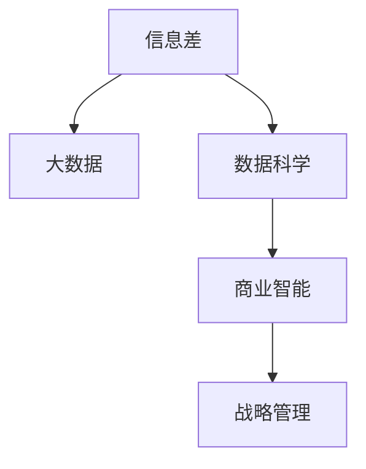

                 

## 1. 背景介绍

### 1.1 问题由来

在全球化和信息化的浪潮中，企业面临的环境日益复杂，市场竞争越来越激烈。如何在变幻莫测的市场环境中，做出及时、准确的战略决策，成为了企业管理的核心挑战。信息差（Information Gap），即决策者与实际市场情况之间的信息不对称，成为影响战略规划效果的重要因素。通过大数据技术，可以有效缩小信息差，提高决策的科学性和前瞻性。

### 1.2 问题核心关键点

信息差的战略规划主要围绕以下几个关键点展开：

1. **信息收集**：如何全面、及时、准确地收集相关市场信息，如消费者需求、竞争对手动态、市场趋势等。
2. **数据处理**：如何高效地存储、清洗、转换数据，提取有价值的信息，构建可操作的决策模型。
3. **分析与预测**：如何通过数据分析和机器学习算法，对市场趋势进行预测，评估不同战略方案的效果。
4. **决策优化**：如何结合实际业务场景，应用数据驱动的决策优化方法，提升战略规划的精准度。

### 1.3 问题研究意义

在数字时代，信息差战略规划技术能够帮助企业更科学地识别市场机会，规避风险，提升竞争力和市场份额。通过系统化应用大数据技术，企业可以：

1. **精准定位**：全面掌握市场和消费者行为，识别新趋势和新需求。
2. **竞争情报**：及时监控竞争对手动态，制定差异化竞争策略。
3. **资源配置**：优化资源分配，提高运营效率，实现成本领先。
4. **风险管理**：预测和应对市场波动，保障业务稳定运行。

因此，研究大数据在信息差战略规划中的应用，对于提升企业决策质量和管理水平，具有重要意义。

## 2. 核心概念与联系

### 2.1 核心概念概述

为更好地理解信息差战略规划方法，本节将介绍几个密切相关的核心概念：

- **信息差（Information Gap）**：决策者与市场实际状态之间的信息不对称，是大数据分析和战略规划的关键考量点。
- **大数据（Big Data）**：指规模庞大、多样化和高速变化的数据集合，提供全面、实时的市场信息，支撑战略决策。
- **数据科学（Data Science）**：涵盖数据收集、处理、分析和应用的一系列技术和方法，是信息差战略规划的重要工具。
- **商业智能（Business Intelligence, BI）**：通过数据可视化、报表生成等手段，帮助企业进行战略分析和管理决策。
- **战略管理（Strategic Management）**：涉及企业整体发展方向和资源配置的规划和实施，是信息差分析的核心应用场景。

这些核心概念之间的逻辑关系可以通过以下Mermaid流程图来展示：



这个流程图展示了信息差战略规划的关键要素及其之间的关系：

1. 信息差是战略规划的核心，需要通过大数据收集、处理、分析等环节进行处理。
2. 大数据提供了信息差分析的素材，是信息差战略规划的基础。
3. 数据科学是处理大数据的关键方法，支撑信息差分析的准确性和效率。
4. 商业智能将数据科学成果转化为可视化的报表和分析工具，服务于战略管理。
5. 战略管理则是信息差分析的最终应用，通过数据驱动优化企业战略。

这些概念共同构成了信息差战略规划的技术框架，使其能够系统地应用大数据技术，提升企业的决策质量和竞争力。

## 3. 核心算法原理 & 具体操作步骤

### 3.1 算法原理概述

信息差战略规划的核心算法原理基于数据驱动的决策支持系统（Decision Support System, DSS），结合大数据分析和商业智能技术，构建数据驱动的战略决策模型。其主要流程包括：

1. **数据收集**：通过传感器、交易数据、社交媒体等渠道，全面收集市场信息。
2. **数据处理**：对收集的数据进行清洗、转换和集成，构建统一的数据仓库。
3. **分析建模**：利用数据科学和机器学习算法，构建预测模型和指标体系。
4. **战略评估**：通过模拟和预测，评估不同战略方案的效果，选择最优方案。
5. **战略实施**：将最优战略方案转化为具体的操作计划，并进行实时监控和调整。

### 3.2 算法步骤详解

信息差战略规划的详细步骤如下：

**Step 1: 数据收集与整合**

- **数据源选择**：根据业务需求，选择合适的数据源，如销售记录、社交媒体、市场调研等。
- **数据采集**：使用ETL（Extract, Transform, Load）工具，自动化地采集数据。
- **数据清洗**：去除无效数据、处理异常值、填补缺失值等，确保数据质量。
- **数据集成**：通过数据仓库技术，将来自不同渠道的数据进行集成，形成统一的数据集合。

**Step 2: 数据分析与建模**

- **数据探索**：使用描述性统计和数据可视化工具，对数据进行初步分析，理解数据特征。
- **特征工程**：提取与战略决策相关的特征变量，如市场规模、用户行为、竞争对手表现等。
- **模型选择**：根据问题特点选择合适的机器学习模型，如回归、分类、聚类、预测等。
- **模型训练**：使用历史数据对模型进行训练，调整模型参数，优化模型性能。
- **模型验证**：通过交叉验证、留出法等方法，评估模型泛化能力。

**Step 3: 战略评估与决策**

- **方案设计**：根据问题设定，设计多个战略方案，如市场扩展、产品创新、成本优化等。
- **情景分析**：使用多种情景模拟，预测不同战略方案的效果，评估风险和机会。
- **优化算法**：结合多目标优化算法，综合评估各方案的优劣，选择最优方案。
- **决策支持**：利用商业智能工具，生成可视化报表和分析报告，支持决策。

**Step 4: 战略实施与监控**

- **实施计划**：根据最优战略方案，制定详细的执行计划和资源配置方案。
- **实时监控**：建立实时监控系统，跟踪战略实施效果，及时调整策略。
- **反馈机制**：建立反馈机制，定期收集实施结果，进行效果评估和迭代优化。

### 3.3 算法优缺点

信息差战略规划方法具有以下优点：

1. **全面性和实时性**：通过大数据技术，可以全面、实时地收集和处理市场信息，支持快速反应。
2. **精确性和预测性**：通过机器学习算法，能够准确预测市场趋势和消费者行为，提供科学的决策依据。
3. **可操作性和可扩展性**：结合商业智能工具，将数据分析成果转化为可视化的报表和分析工具，支持决策落地。

同时，该方法也存在以下局限性：

1. **数据质量依赖**：对数据源的选择和数据处理的准确性要求较高，数据质量直接影响分析结果。
2. **技术门槛较高**：需要专业的数据科学家和商业智能分析师，对技术要求较高。
3. **模型复杂性**：构建和训练复杂的机器学习模型，需要大量的时间和计算资源。
4. **业务适应性**：模型需结合实际业务场景进行调整和优化，复杂性较高。

尽管存在这些局限性，但就目前而言，信息差战略规划方法在数据驱动的决策支持中仍具有显著的优势，是提升企业战略规划质量的重要手段。

### 3.4 算法应用领域

信息差战略规划方法在多个领域得到了广泛应用，如：

1. **金融行业**：利用大数据分析客户行为和市场趋势，优化投资决策和风险管理。
2. **零售行业**：通过消费者行为分析，优化商品库存和定价策略，提升销售业绩。
3. **制造业**：结合生产数据和市场信息，进行供应链优化和产品迭代，提高生产效率。
4. **医疗行业**：分析患者数据和临床试验结果，制定个性化治疗方案和药物研发策略。
5. **物流行业**：通过路线优化和运输数据分析，提升配送效率和降低运营成本。
6. **政府管理**：应用大数据进行政策评估和公共服务优化，提升政府治理能力。

## 4. 数学模型和公式 & 详细讲解  
### 4.1 数学模型构建

本节将使用数学语言对信息差战略规划方法进行更加严格的刻画。

设企业面临的决策问题为 $P$，相关的市场数据为 $D$，信息差为 $G$，数据科学模型为 $M$，商业智能工具为 $BI$，战略管理目标为 $T$。则信息差战略规划的目标可以表示为：

$$
\min_{G, M, BI} \mathcal{L}(G, M, BI, T)
$$

其中 $\mathcal{L}$ 为总损失函数，衡量信息差战略规划的效果。

在实际应用中，我们可以进一步细化目标函数，如：

- 数据收集的完整性和准确性 $\mathcal{L}_{data}$
- 数据分析的精确性和可靠性 $\mathcal{L}_{analysis}$
- 决策支持的效果和易用性 $\mathcal{L}_{support}$
- 战略实施的效率和效果 $\mathcal{L}_{implementation}$

这些子目标函数的具体表达式根据具体应用场景和需求而定。

### 4.2 公式推导过程

以下我们以金融行业投资决策为例，推导信息差战略规划的总损失函数及其组成部分。

设投资决策问题为 $P$，历史市场数据为 $D$，信息差为 $G$，数据科学模型为 $M$，商业智能工具为 $BI$，投资策略为目标 $T$。

**数据收集**：

- 收集历史市场数据 $D$，包括股票价格、交易量、市场情绪等。
- 设定数据收集的质量指标 $\mathcal{L}_{data}$，如完整性、准确性、时效性。

**数据分析**：

- 提取与投资决策相关的特征变量，如股票价格趋势、市场波动性等。
- 选择回归模型 $M$ 对特征变量进行建模，预测未来股价变化。
- 设定数据分析的精确性指标 $\mathcal{L}_{analysis}$，如均方误差、R2值等。

**决策支持**：

- 生成可视化报表和分析报告，利用商业智能工具 $BI$ 支持决策。
- 设定决策支持的效果和易用性指标 $\mathcal{L}_{support}$，如用户体验、信息可得性等。

**战略实施**：

- 根据投资模型和市场信息，制定投资策略 $T$。
- 实时监控投资效果，评估投资策略的效果。
- 设定战略实施的效率和效果指标 $\mathcal{L}_{implementation}$，如回报率、风险控制等。

最终，信息差战略规划的总损失函数 $\mathcal{L}$ 可以表示为：

$$
\mathcal{L} = \alpha \mathcal{L}_{data} + \beta \mathcal{L}_{analysis} + \gamma \mathcal{L}_{support} + \delta \mathcal{L}_{implementation}
$$

其中 $\alpha, \beta, \gamma, \delta$ 为权重系数，根据实际需求进行调整。

### 4.3 案例分析与讲解

以下以零售行业为例，分析信息差战略规划的应用过程和效果。

**背景**：某零售企业面临市场竞争加剧的问题，希望通过数据驱动的决策支持，优化商品库存和定价策略。

**数据收集**：

- 收集历史销售数据、市场调研数据、社交媒体数据等。
- 设定数据收集的质量指标 $\mathcal{L}_{data}$，如数据完整性、时效性。

**数据分析**：

- 提取与商品库存和定价相关的特征变量，如季节性变化、竞争对手定价、促销活动等。
- 选择回归模型 $M$ 对特征变量进行建模，预测未来销售趋势和消费者行为。
- 设定数据分析的精确性指标 $\mathcal{L}_{analysis}$，如预测准确率、召回率。

**决策支持**：

- 利用商业智能工具 $BI$ 生成可视化报表和分析报告，支持库存管理和定价策略制定。
- 设定决策支持的效果和易用性指标 $\mathcal{L}_{support}$，如报表清晰度、用户满意度。

**战略实施**：

- 根据预测模型和市场信息，制定库存管理和定价策略 $T$。
- 实时监控销售数据，评估策略效果。
- 设定战略实施的效率和效果指标 $\mathcal{L}_{implementation}$，如库存周转率、销售额增长率。

最终，通过信息差战略规划，该企业能够更加准确地预测市场趋势，优化库存和定价策略，提高销售业绩和运营效率。

## 5. 项目实践：代码实例和详细解释说明
### 5.1 开发环境搭建

在进行信息差战略规划实践前，我们需要准备好开发环境。以下是使用Python进行Pandas、NumPy、Scikit-learn等库的开发环境配置流程：

1. 安装Anaconda：从官网下载并安装Anaconda，用于创建独立的Python环境。

2. 创建并激活虚拟环境：
```bash
conda create -n data-env python=3.8 
conda activate data-env
```

3. 安装必要的Python包：
```bash
pip install pandas numpy scikit-learn matplotlib seaborn jupyter notebook
```

4. 安装Jupyter Notebook：
```bash
pip install jupyterlab
```

完成上述步骤后，即可在`data-env`环境中开始信息差战略规划实践。

### 5.2 源代码详细实现

这里以一个简单的案例，使用Pandas和Scikit-learn库实现信息差战略规划。

首先，定义数据集和模型：

```python
import pandas as pd
from sklearn.linear_model import LinearRegression
from sklearn.metrics import mean_squared_error

# 定义数据集
data = pd.read_csv('sales_data.csv')

# 定义目标变量和特征变量
target = 'sales'
features = ['season', 'promo', 'competitor_price']

# 定义训练集和测试集
train_data = data.iloc[:800, :]
test_data = data.iloc[800:, :]

# 定义回归模型
model = LinearRegression()
```

然后，进行数据预处理和模型训练：

```python
# 数据预处理
X_train = train_data[features]
y_train = train_data[target]

# 模型训练
model.fit(X_train, y_train)
```

接着，评估模型性能和进行战略评估：

```python
# 模型评估
X_test = test_data[features]
y_test = test_data[target]
y_pred = model.predict(X_test)

# 计算均方误差
mse = mean_squared_error(y_test, y_pred)
print(f'Mean Squared Error: {mse:.2f}')

# 计算投资回报率
ROI = (y_test.mean() - y_pred.mean()) / y_test.mean() * 100
print(f'ROI: {ROI:.2f}%')
```

最后，生成可视化报表和决策支持：

```python
import matplotlib.pyplot as plt

# 绘制销售趋势图
plt.plot(y_test, label='Actual')
plt.plot(y_pred, label='Predicted')
plt.legend()
plt.show()

# 生成可视化报表
report = pd.DataFrame({
    'Actual Sales': y_test,
    'Predicted Sales': y_pred,
    'ROI': ROI
})
report.to_csv('strategy_report.csv')
```

以上就是使用Pandas和Scikit-learn进行信息差战略规划的完整代码实现。可以看到，通过简单的数据处理和机器学习模型，即可实现基于数据驱动的投资决策支持。

### 5.3 代码解读与分析

让我们再详细解读一下关键代码的实现细节：

**数据集定义**：
- `pd.read_csv()`方法：从CSV文件中读取数据集，转化为Pandas DataFrame对象。
- `features`列表：定义了与投资决策相关的特征变量。

**模型定义**：
- `LinearRegression()`：定义线性回归模型。

**数据预处理**：
- `iloc`方法：根据行号和列号选择数据子集。
- `fit()`方法：使用训练数据训练模型。

**模型评估**：
- `mean_squared_error()`：计算预测值与实际值之间的均方误差。
- `ROI`：计算投资回报率。

**可视化报表**：
- `matplotlib`库：绘制销售趋势图，展示模型预测效果。
- `pandas`库：生成可视化报表，支持战略评估。

可以看到，通过Pandas和Scikit-learn库，我们可以快速构建和应用信息差战略规划模型，评估投资决策的效果，并生成报表支持战略优化。

## 6. 实际应用场景

### 6.1 金融行业

**应用场景**：银行需要快速响应市场变化，优化信贷策略。

**解决思路**：收集历史信贷数据、市场利率、宏观经济指标等数据，使用机器学习模型预测客户违约概率和信贷需求，评估不同信贷策略的效果，选择最优方案。

**关键步骤**：
1. 数据收集：通过金融交易记录、社交媒体、新闻报道等渠道，收集历史信贷数据和市场信息。
2. 数据分析：提取与信贷策略相关的特征变量，如客户信用历史、收入水平、市场情绪等。
3. 模型训练：使用回归模型、决策树等算法对特征变量进行建模，预测客户违约概率。
4. 决策支持：生成可视化报表和分析报告，支持信贷策略制定。
5. 战略实施：根据预测模型和市场信息，制定信贷策略。
6. 实时监控：建立实时监控系统，跟踪信贷效果，及时调整策略。

**效果评估**：通过应用信息差战略规划，银行能够更加准确地评估客户信用风险，优化信贷策略，降低违约率，提升业务效率。

### 6.2 零售行业

**应用场景**：零售企业需要优化库存和定价策略，提升销售业绩。

**解决思路**：收集历史销售数据、市场调研数据、社交媒体数据等，使用机器学习模型预测销售趋势和消费者行为，评估不同库存和定价策略的效果，选择最优方案。

**关键步骤**：
1. 数据收集：通过销售记录、市场调研、社交媒体等渠道，收集相关数据。
2. 数据分析：提取与库存和定价策略相关的特征变量，如季节性变化、竞争对手定价、促销活动等。
3. 模型训练：使用回归模型、分类模型等算法对特征变量进行建模，预测销售趋势。
4. 决策支持：生成可视化报表和分析报告，支持库存和定价策略制定。
5. 战略实施：根据预测模型和市场信息，制定库存和定价策略。
6. 实时监控：建立实时监控系统，跟踪销售数据，及时调整策略。

**效果评估**：通过应用信息差战略规划，零售企业能够更加准确地预测市场趋势，优化库存和定价策略，提高销售业绩和运营效率。

### 6.3 制造业

**应用场景**：制造业企业需要优化供应链和生产计划，提高生产效率。

**解决思路**：收集生产数据、市场需求数据、原材料价格等数据，使用机器学习模型预测需求变化和生产成本，评估不同供应链和生产计划的效果，选择最优方案。

**关键步骤**：
1. 数据收集：通过生产记录、市场需求、原材料供应商等渠道，收集相关数据。
2. 数据分析：提取与供应链和生产计划相关的特征变量，如生产效率、库存水平、市场趋势等。
3. 模型训练：使用回归模型、时间序列预测模型等算法对特征变量进行建模，预测市场需求和生产成本。
4. 决策支持：生成可视化报表和分析报告，支持供应链和生产计划制定。
5. 战略实施：根据预测模型和市场信息，制定供应链和生产计划。
6. 实时监控：建立实时监控系统，跟踪生产数据，及时调整策略。

**效果评估**：通过应用信息差战略规划，制造业企业能够更加准确地预测市场需求和生产成本，优化供应链和生产计划，提高生产效率和市场响应速度。

## 7. 工具和资源推荐
### 7.1 学习资源推荐

为了帮助开发者系统掌握信息差战略规划的理论基础和实践技巧，这里推荐一些优质的学习资源：

1. **《Data Science for Business》**：Foster Provost和Tom Fawcett合著的书籍，介绍了数据科学在商业决策中的应用，包括信息差战略规划的基本原理和实践方法。

2. **Coursera《Data Science and Statistical Learning》课程**：由Johns Hopkins大学开设的课程，系统介绍了数据科学的基本概念和方法，适合初学者入门。

3. **Kaggle**：数据科学竞赛平台，通过实际案例和数据集，帮助你理解信息差战略规划的具体应用和效果评估。

4. **机器学习系列课程**：如Andrew Ng在Coursera上的《Machine Learning》系列课程，深入浅出地讲解了机器学习算法，为信息差战略规划提供了技术支持。

5. **Python数据科学社区**：如Kaggle、DataCamp等平台，提供了丰富的学习资源和实践机会，帮助开发者提升技术能力。

通过对这些资源的学习实践，相信你一定能够快速掌握信息差战略规划的精髓，并用于解决实际的商业问题。

### 7.2 开发工具推荐

高效的开发离不开优秀的工具支持。以下是几款用于信息差战略规划开发的常用工具：

1. **Python**：作为数据科学的主流语言，Python具有丰富的数据处理和机器学习库，如Pandas、NumPy、Scikit-learn等，适合进行数据驱动的决策支持。

2. **R语言**：R语言在统计分析和可视化方面具有优势，适合进行复杂的数据建模和报表生成。

3. **Jupyter Notebook**：作为交互式编程环境，Jupyter Notebook支持Python、R等多种语言，适合进行快速迭代和实验。

4. **Tableau**：商业智能工具，支持数据的可视化分析和报表生成，帮助企业进行战略评估和决策支持。

5. **Power BI**：微软的商业智能工具，提供了强大的数据可视化功能，支持数据的整合和分析。

6. **Tableau Public**：免费的商业智能工具，适合对数据进行可视化展示，分享分析成果。

合理利用这些工具，可以显著提升信息差战略规划的开发效率，加快创新迭代的步伐。

### 7.3 相关论文推荐

信息差战略规划技术的发展得益于学术界的持续研究。以下是几篇奠基性的相关论文，推荐阅读：

1. **"Data Mining and Statistical Learning" by Trevor Hastie, Robert Tibshirani, Jerome Friedman**：介绍了数据挖掘和统计学习的基本概念和方法，为信息差战略规划提供了理论基础。

2. **"Machine Learning Yearning" by Andrew Ng**：由深度学习领域的权威人士撰写，介绍了机器学习在商业决策中的应用，包括信息差战略规划的实践方法。

3. **"Strategic Decision Support Systems: A Survey" by Jan Jensen, Erik M. Z�rgle, Peter Heise**：对信息差战略规划的文献进行综述，详细介绍了各种战略支持系统的构建方法和应用案例。

4. **"Big Data Analytics in Strategy Formulation: A Literature Review" by Jesper Fredriksson, David Morton, Peter W. Henderson**：探讨了大数据在战略规划中的应用，总结了相关文献的研究进展和技术方法。

这些论文代表了大数据在战略规划领域的研究趋势，通过学习这些前沿成果，可以帮助研究者把握学科前进方向，激发更多的创新灵感。

## 8. 总结：未来发展趋势与挑战

### 8.1 总结

本文对信息差战略规划方法进行了全面系统的介绍。首先阐述了信息差战略规划的背景和意义，明确了大数据在信息差分析中的核心作用。其次，从原理到实践，详细讲解了信息差战略规划的数学模型和操作步骤，给出了完整的代码实例和详细解释。同时，本文还探讨了信息差战略规划在金融、零售、制造业等多个领域的应用，展示了其在实际决策支持中的广泛应用前景。最后，本文精选了信息差战略规划的学习资源、开发工具和相关论文，力求为读者提供全方位的技术指引。

通过本文的系统梳理，可以看到，信息差战略规划方法通过大数据技术，显著提升了企业决策的科学性和前瞻性，帮助企业更好地把握市场机会，规避风险，提升竞争力。随着大数据和机器学习技术的不断进步，信息差战略规划必将在更多的领域得到应用，为企业的数字化转型和智能化升级提供有力支持。

### 8.2 未来发展趋势

展望未来，信息差战略规划技术将呈现以下几个发展趋势：

1. **人工智能与大数据融合**：随着人工智能技术的发展，信息差战略规划将更多地结合机器学习、深度学习等技术，提升预测精度和决策效果。
2. **实时数据处理**：大数据技术的演进使得实时数据处理成为可能，信息差战略规划也将更加注重实时性，支持动态决策。
3. **多模态数据融合**：结合文本、图像、视频等多种数据形式，信息差战略规划将更加全面地理解市场环境，提供更准确的决策支持。
4. **跨领域应用拓展**：信息差战略规划将拓展到更多行业领域，如医疗、公共安全、政府治理等，帮助各行业提升决策质量和管理效率。
5. **个性化决策支持**：通过分析用户行为和偏好，信息差战略规划将提供更个性化的决策支持，满足不同用户需求。

### 8.3 面临的挑战

尽管信息差战略规划技术已经取得了显著进展，但在迈向更加智能化、普适化应用的过程中，仍面临以下挑战：

1. **数据质量和多样性**：信息差分析对数据质量和多样性要求较高，但不同数据源的质量参差不齐，可能影响分析结果。
2. **计算资源消耗**：大数据和机器学习模型的计算资源需求较大，需要高性能的计算硬件和算法优化。
3. **技术复杂性**：信息差战略规划涉及复杂的数据处理和模型构建，需要跨学科的知识和技能。
4. **业务理解**：信息差战略规划需要深入理解业务场景和需求，否则可能出现不切实际的分析结果。
5. **隐私和安全**：企业数据涉及用户隐私和商业机密，如何保护数据安全是信息差战略规划的重要挑战。
6. **伦理和合规**：信息差战略规划涉及大量用户数据，需要遵守数据隐私法律法规，避免不道德的商业行为。

尽管存在这些挑战，但通过技术创新和行业合作，信息差战略规划有望在未来逐步克服这些难题，为企业的智能化决策提供更可靠的技术支持。

### 8.4 研究展望

面向未来，信息差战略规划技术需要在以下几个方向进行深入研究：

1. **多源数据融合**：如何有效融合来自不同数据源的数据，提高信息差分析的全面性和准确性。
2. **实时数据处理**：如何实现实时数据处理和分析，提升信息差战略规划的响应速度。
3. **模型优化**：如何优化大数据和机器学习模型，提高预测精度和决策效果。
4. **业务适应性**：如何结合不同业务场景和需求，构建更具针对性的信息差分析模型。
5. **伦理和合规**：如何在保障数据隐私和安全的前提下，进行信息差战略规划。
6. **人机协同**：如何通过人机协同，提升信息差战略规划的可靠性和可解释性。

这些研究方向将引领信息差战略规划技术的进一步发展，为企业的数字化转型和智能化决策提供新的思路和方法。

## 9. 附录：常见问题与解答

**Q1：信息差战略规划是否适用于所有行业？**

A: 信息差战略规划在金融、零售、制造等多个行业都有广泛应用，尤其适合数据驱动的决策场景。但对于一些数据难以获取或质量较低的行业，信息差战略规划的效果可能有限。因此，在实际应用中，需要根据行业特点和数据情况进行选择。

**Q2：如何进行有效的数据收集和处理？**

A: 有效的数据收集和处理是信息差战略规划的基础。建议从以下方面入手：
1. **多源数据采集**：结合多种数据源，如传感器、交易记录、社交媒体等，获取全面、实时的数据。
2. **数据清洗和转换**：使用ETL工具，去除无效数据、处理异常值、填补缺失值等，确保数据质量。
3. **数据集成和存储**：通过数据仓库技术，将不同来源的数据进行集成，形成统一的数据集合。

**Q3：信息差战略规划的计算资源需求如何？**

A: 信息差战略规划需要处理大规模数据和复杂模型，对计算资源有较高要求。建议采取以下措施：
1. **云计算平台**：利用云计算平台的弹性计算资源，支持大规模数据处理和模型训练。
2. **分布式计算**：采用分布式计算框架，如Apache Spark，提高数据处理和模型训练的效率。
3. **模型压缩和优化**：通过模型压缩和优化，减小模型大小，提升计算效率。

**Q4：信息差战略规划的实施效果如何评估？**

A: 信息差战略规划的实施效果评估需要综合考虑多个指标，如预测准确性、战略实施效果、用户体验等。建议从以下方面入手：
1. **预测准确性评估**：通过均方误差、均方根误差等指标评估模型预测效果。
2. **战略实施效果评估**：结合实际业务场景，评估战略实施的效果，如销售额、库存周转率等。
3. **用户体验评估**：通过用户反馈、满意度调查等方法，评估决策支持工具的易用性和用户体验。

**Q5：信息差战略规划的挑战有哪些？**

A: 信息差战略规划面临以下挑战：
1. **数据质量**：不同数据源的质量参差不齐，可能影响分析结果。
2. **计算资源**：大数据和机器学习模型的计算资源需求较大。
3. **技术复杂性**：信息差战略规划涉及复杂的数据处理和模型构建。
4. **业务理解**：需要深入理解业务场景和需求，否则可能出现不切实际的分析结果。
5. **隐私和安全**：企业数据涉及用户隐私和商业机密，如何保护数据安全是重要挑战。
6. **伦理和合规**：需要在保障数据隐私和安全的前提下，进行信息差战略规划。

**Q6：如何优化信息差战略规划的实施效果？**

A: 优化信息差战略规划的实施效果可以从以下几个方面入手：
1. **多源数据融合**：融合多种数据源，提高信息差分析的全面性和准确性。
2. **实时数据处理**：实现实时数据处理和分析，提升信息差战略规划的响应速度。
3. **模型优化**：优化大数据和机器学习模型，提高预测精度和决策效果。
4. **业务适应性**：结合不同业务场景和需求，构建更具针对性的信息差分析模型。
5. **伦理和合规**：在保障数据隐私和安全的前提下，进行信息差战略规划。
6. **人机协同**：通过人机协同，提升信息差战略规划的可靠性和可解释性。

通过优化这些环节，信息差战略规划的实施效果将得到显著提升，为企业决策提供更可靠的技术支持。

---

作者：禅与计算机程序设计艺术 / Zen and the Art of Computer Programming

