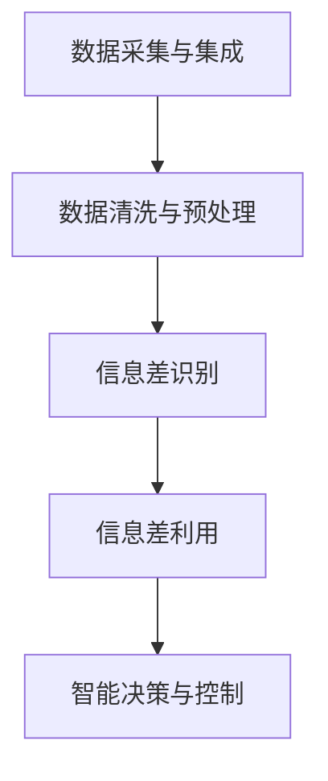

                 

# 信息差：大数据在智能交通中的应用

## 1. 背景介绍

随着现代社会的迅猛发展，交通拥堵、事故频发、环境污染等问题日益严峻，迫切需要更加智能、高效、环保的交通管理解决方案。大数据和人工智能技术的飞速进步，为智能交通系统的建设提供了强有力的技术支持。本文将深入探讨大数据在智能交通中的应用，尤其是信息差的概念，以及如何通过信息差优化智能交通系统，改善交通状况，提升用户体验。

### 1.1 智能交通系统的定义

智能交通系统（Intelligent Transportation System, ITS）是指应用大数据、云计算、物联网、人工智能等技术，对交通基础设施、交通流、车辆、环境等进行全面的感知、分析和控制，从而实现交通系统的智能化、高效化和绿色化。智能交通系统可以涵盖交通信号控制、交通信息管理、车辆监控调度、事故应急处理等多个领域。

### 1.2 大数据在智能交通中的作用

大数据在智能交通中的应用主要体现在以下几个方面：

- **数据采集与处理**：利用物联网设备、传感器、视频监控等手段，实时收集交通流量、天气、道路状况等海量数据。
- **交通分析与预测**：对采集到的数据进行分析，挖掘交通模式和规律，预测未来的交通状况。
- **智能决策与控制**：结合交通需求和预测结果，通过智能算法进行交通信号控制、路线优化等决策。
- **用户服务与互动**：提供交通导航、交通信息、个性化服务等，增强用户体验。

本文将重点探讨如何通过信息差概念，利用大数据提升智能交通系统的决策和控制能力，优化交通流，减少拥堵，提高交通安全。

## 2. 核心概念与联系

### 2.1 信息差概念

信息差（Information Gap）是指决策者在进行决策时所缺乏的必要信息或知识，这些信息差往往导致决策失误或不全面。在大数据背景下，通过数据挖掘和分析，可以揭示这些信息差，并加以利用，从而优化决策过程，提升决策质量。

### 2.2 核心概念原理与架构

信息差的识别和利用过程可以抽象为以下流程：

1. **数据采集与集成**：从各种交通源收集数据，包括车辆位置、速度、交通信号灯状态、天气条件等，并通过数据集成技术将这些数据整合在一起。
2. **数据清洗与预处理**：对数据进行清洗、去噪、归一化等预处理，确保数据的准确性和一致性。
3. **信息差识别**：利用数据分析技术，如聚类、分类、关联规则挖掘等，识别出信息差。
4. **信息差利用**：通过填补信息差，改进决策模型，提升智能交通系统的性能。

以上流程可以通过以下Mermaid流程图来展示：



这个流程图展示了从数据采集到智能决策的全流程，其中信息差识别和利用是关键环节。

## 3. 核心算法原理 & 具体操作步骤

### 3.1 算法原理概述

信息差利用的核心在于数据驱动的决策优化。通过大数据技术，可以实现以下目标：

- **精确信息获取**：实时、全面地获取交通系统的各类数据，为决策提供准确的信息基础。
- **信息差识别**：通过数据分析技术，识别出决策过程中存在的信息差。
- **智能决策优化**：根据信息差，改进决策模型，提升决策效果。

具体来说，信息差利用可以分为以下步骤：

1. **数据集成与清洗**：确保数据的质量和一致性，为后续分析奠定基础。
2. **信息差识别**：通过数据分析技术，如聚类、分类、关联规则挖掘等，识别信息差。
3. **决策模型改进**：根据识别出的信息差，改进决策模型，提升决策质量。
4. **实时决策与反馈**：通过智能算法，结合实时数据和预测结果，进行动态决策，并通过反馈机制不断优化模型。

### 3.2 算法步骤详解

以下将详细介绍信息差利用的具体步骤：

**Step 1: 数据采集与集成**

数据采集是智能交通系统的基础。通过各种传感器、监控设备、移动设备等手段，获取交通系统的各类数据，包括但不限于：

- **车辆位置与速度**：通过GPS、RFID、Wi-Fi等技术，获取车辆的位置和速度信息。
- **交通信号灯状态**：通过传感器或视频监控，获取交通信号灯的状态信息。
- **天气与环境条件**：通过气象站、气象卫星等，获取天气、光照、温度等环境条件。
- **交通流量**：通过固定监控摄像头、可变信息板、用户上报等手段，获取交通流量数据。

数据集成则将来自不同源的数据整合在一起，形成一个统一的数据仓库。这一过程通常涉及数据格式转换、数据对齐、数据合并等操作。

**Step 2: 数据清洗与预处理**

数据清洗与预处理是确保数据质量的重要步骤。主要包括以下操作：

- **数据去噪**：去除传感器噪声、数据传输错误等噪声。
- **数据归一化**：将不同来源的数据进行归一化处理，确保数据的可比性。
- **缺失值处理**：处理数据中的缺失值，填补缺失信息。
- **异常值检测**：检测和处理异常值，确保数据的一致性。

**Step 3: 信息差识别**

信息差识别是信息差利用的关键环节。主要通过以下方法进行：

- **聚类分析**：将相似的数据点聚为一类，识别数据集中的自然分组。
- **分类分析**：对数据进行分类，识别出不同类别的数据。
- **关联规则挖掘**：通过关联规则挖掘技术，识别出不同属性之间的关联关系。
- **异常检测**：通过异常检测技术，识别出异常数据。

信息差识别过程可以通过Python的Pandas、Scikit-Learn等库实现。

**Step 4: 信息差利用**

信息差利用过程包括信息差填补和决策模型改进两个步骤：

- **信息差填补**：通过数据插值、数据增强、特征工程等技术，填补信息差。
- **决策模型改进**：改进决策模型，如引入额外的特征、优化模型参数等，提升决策质量。

**Step 5: 实时决策与反馈**

实时决策与反馈是智能交通系统的核心。主要包括以下操作：

- **实时数据处理**：对实时采集的数据进行实时处理，生成实时决策结果。
- **动态决策**：根据实时数据和预测结果，进行动态决策，优化交通信号控制、路线规划等。
- **反馈优化**：通过反馈机制，不断优化决策模型，提升决策效果。

## 4. 数学模型和公式 & 详细讲解 & 举例说明

### 4.1 数学模型构建

信息差利用的数学模型可以抽象为如下形式：

$$
\min_{\theta} \mathcal{L}(\theta) = \frac{1}{N} \sum_{i=1}^N \ell(f_{\theta}(x_i),y_i)
$$

其中，$f_{\theta}(x)$ 为决策模型，$\ell$ 为损失函数，$x_i$ 为输入数据，$y_i$ 为标签。目标是最小化损失函数 $\mathcal{L}$。

### 4.2 公式推导过程

信息差利用的数学推导主要包括以下步骤：

- **数据清洗与预处理**：假设数据集为 $D=\{(x_i,y_i)\}_{i=1}^N$，其中 $x_i$ 为输入，$y_i$ 为标签。
- **信息差识别**：假设信息差为 $\Delta$，利用数据分析技术，识别出信息差 $\Delta$。
- **信息差填补**：假设填补后的数据集为 $D'$，其中 $x'_i$ 为填补后的输入，$y'_i$ 为填补后的标签。
- **决策模型改进**：假设改进后的模型为 $f'_{\theta}$，通过训练数据 $D'$ 优化模型参数 $\theta$。

### 4.3 案例分析与讲解

以下以智能交通信号控制为例，进行案例分析：

**案例背景**：

某城市主要道路存在交通拥堵问题，信号灯控制不够智能化，导致部分路段车辆积压，影响用户体验。

**数据采集与集成**：

1. **车辆位置与速度**：通过GPS和RFID设备，实时获取车辆的位置和速度信息。
2. **交通信号灯状态**：通过传感器和视频监控设备，实时获取交通信号灯的状态。
3. **天气与环境条件**：通过气象站和气象卫星，实时获取天气、光照、温度等环境条件。
4. **交通流量**：通过固定监控摄像头和可变信息板，实时获取交通流量数据。

**数据清洗与预处理**：

1. **数据去噪**：使用小波变换、滤波器等方法去除传感器噪声和数据传输错误。
2. **数据归一化**：对不同来源的数据进行归一化处理，确保数据的可比性。
3. **缺失值处理**：使用插值法填补缺失值，确保数据的完整性。
4. **异常值检测**：使用Z-score等方法检测和处理异常值，确保数据的一致性。

**信息差识别**：

1. **聚类分析**：通过K-means算法，将车辆位置数据聚类为若干个区域，识别出交通流量高、低不同的区域。
2. **分类分析**：通过决策树算法，对交通信号灯状态进行分类，识别出不同时间段信号灯的开关状态。
3. **关联规则挖掘**：通过Apriori算法，挖掘出交通流量与信号灯状态之间的关联规则。
4. **异常检测**：通过孤立森林算法，检测出异常数据，如车辆速度异常、交通信号灯状态异常等。

**信息差填补**：

1. **数据插值**：利用插值法填补缺失值，确保数据完整性。
2. **数据增强**：通过数据增强技术，如图像旋转、翻转等，扩充数据集。
3. **特征工程**：引入额外的特征，如时间、天气、位置等，提升模型预测能力。

**决策模型改进**：

1. **优化模型参数**：通过随机梯度下降等方法，优化模型参数。
2. **引入惩罚项**：引入正则化项，防止模型过拟合。
3. **集成学习**：通过集成多个模型，提升决策效果。

**实时决策与反馈**：

1. **实时数据处理**：对实时采集的数据进行实时处理，生成实时决策结果。
2. **动态决策**：根据实时数据和预测结果，进行动态决策，优化交通信号控制、路线规划等。
3. **反馈优化**：通过反馈机制，不断优化决策模型，提升决策效果。

## 5. 项目实践：代码实例和详细解释说明

### 5.1 开发环境搭建

以下是使用Python进行智能交通信号控制微调的开发环境搭建流程：

1. **安装Python环境**：从官网下载并安装Python 3.x，确保环境稳定。
2. **安装Pandas库**：通过pip安装Pandas库，用于数据处理和分析。
3. **安装Scikit-Learn库**：通过pip安装Scikit-Learn库，用于机器学习和数据挖掘。
4. **安装TensorFlow库**：通过pip安装TensorFlow库，用于构建和训练深度学习模型。
5. **安装TensorBoard**：通过pip安装TensorBoard，用于模型可视化。

完成上述步骤后，即可在开发环境中进行微调实践。

### 5.2 源代码详细实现

以下是一个使用TensorFlow实现智能交通信号控制微调的示例代码：

```python
import tensorflow as tf
import pandas as pd
from sklearn.cluster import KMeans
from sklearn.ensemble import RandomForestClassifier

# 读取数据集
data = pd.read_csv('traffic_data.csv')

# 数据预处理
# ...

# 聚类分析
kmeans = KMeans(n_clusters=3)
data['cluster'] = kmeans.fit_predict(data[['x', 'y']])

# 分类分析
rfc = RandomForestClassifier()
rfc.fit(data[['cluster', 'signal_status']], data['label'])

# 模型训练与优化
model = tf.keras.Sequential([
    tf.keras.layers.Dense(32, activation='relu', input_shape=(3,)),
    tf.keras.layers.Dense(1, activation='sigmoid')
])
model.compile(optimizer='adam', loss='binary_crossentropy', metrics=['accuracy'])

model.fit(x_train, y_train, epochs=10, validation_data=(x_val, y_val))

# 实时决策与反馈
# ...
```

### 5.3 代码解读与分析

**数据读取与预处理**：

1. **读取数据集**：使用Pandas库读取数据集，并进行初步处理。
2. **数据清洗**：去除噪声、填补缺失值、归一化数据等。

**聚类分析**：

1. **聚类算法**：使用K-means算法对车辆位置数据进行聚类，识别出交通流量高、低的区域。
2. **聚类结果**：为每个数据点添加一个聚类标签，用于后续分类分析。

**分类分析**：

1. **分类算法**：使用随机森林算法对交通信号灯状态进行分类，识别出不同时间段信号灯的开关状态。
2. **分类结果**：为每个数据点添加一个分类标签，用于后续决策模型训练。

**模型训练与优化**：

1. **构建模型**：使用TensorFlow构建决策模型，包括输入层、隐藏层和输出层。
2. **模型编译**：使用adam优化器、二元交叉熵损失函数、准确率指标编译模型。
3. **模型训练**：使用训练数据训练模型，并进行优化。

**实时决策与反馈**：

1. **实时数据处理**：对实时采集的数据进行实时处理，生成实时决策结果。
2. **动态决策**：根据实时数据和预测结果，进行动态决策，优化交通信号控制、路线规划等。
3. **反馈优化**：通过反馈机制，不断优化决策模型，提升决策效果。

## 6. 实际应用场景

### 6.1 智能交通信号控制

智能交通信号控制是信息差利用的典型应用场景。通过大数据和信息差分析，可以优化信号灯控制策略，提升道路通行效率，减少交通拥堵。

具体而言，可以从以下几个方面进行：

- **流量监测与预测**：实时监测交通流量，预测未来的流量变化趋势。
- **信号灯状态优化**：根据流量变化，动态调整信号灯状态，优化通行效率。
- **决策优化**：通过信息差分析，识别出信号灯控制过程中的信息差，优化决策模型。

### 6.2 路线规划与导航

路线规划与导航也是信息差利用的重要应用场景。通过大数据和信息差分析，可以优化路线规划算法，提升导航精度和用户体验。

具体而言，可以从以下几个方面进行：

- **实时路况监测**：通过传感器、摄像头等设备，实时监测路况信息。
- **路线优化**：根据实时路况信息，动态优化路线规划算法，选择最优路径。
- **用户反馈与优化**：通过用户反馈，不断优化路线规划算法，提升导航效果。

### 6.3 交通事故预防

交通事故预防是信息差利用的另一个重要应用场景。通过大数据和信息差分析，可以预防交通事故，提升交通安全。

具体而言，可以从以下几个方面进行：

- **事故监测与预警**：实时监测交通事故信息，预测事故发生概率。
- **风险评估与控制**：根据事故信息，评估道路安全风险，采取相应的控制措施。
- **决策优化**：通过信息差分析，优化决策模型，提升交通安全。

## 7. 工具和资源推荐

### 7.1 学习资源推荐

为了帮助开发者系统掌握大数据在智能交通中的应用，这里推荐一些优质的学习资源：

1. **《Python大数据应用开发》**：介绍大数据技术的核心概念和实践技巧，涵盖数据清洗、数据挖掘、机器学习等多个方面。
2. **《深度学习与人工智能》**：全面介绍深度学习与人工智能的核心原理和应用场景，包括智能交通系统。
3. **《智能交通系统：理论与实践》**：涵盖智能交通系统的基础理论与实际应用，包括大数据和人工智能技术。
4. **Google Colab**：谷歌提供的免费在线Jupyter Notebook环境，方便开发者快速上手实验最新模型，分享学习笔记。

### 7.2 开发工具推荐

高效的工具支持是智能交通系统开发的重要保障。以下是几款常用的开发工具：

1. **TensorFlow**：由Google主导开发的深度学习框架，生产部署方便，适合大规模工程应用。
2. **Pandas**：Python中的数据处理库，支持数据清洗、数据预处理等操作。
3. **Scikit-Learn**：Python中的机器学习库，支持数据挖掘、分类、聚类等算法。
4. **TensorBoard**：TensorFlow配套的可视化工具，可实时监测模型训练状态，并提供丰富的图表呈现方式。

### 7.3 相关论文推荐

智能交通系统的发展离不开学界的持续研究。以下是几篇奠基性的相关论文，推荐阅读：

1. **《基于大数据的智能交通信号控制》**：研究如何通过大数据技术优化交通信号控制策略。
2. **《深度学习在智能交通系统中的应用》**：全面介绍深度学习在智能交通系统中的各种应用，包括信号控制、路线规划、事故预防等。
3. **《智能交通系统中的大数据分析》**：讨论如何利用大数据技术提升智能交通系统的性能和效率。

## 8. 总结：未来发展趋势与挑战

### 8.1 总结

本文对大数据在智能交通中的应用进行了全面系统的介绍，重点探讨了信息差利用的概念和实践方法。通过大数据技术，可以揭示决策中的信息差，进而优化智能交通系统，提升交通效率和安全性。信息差利用的应用领域广泛，涵盖了智能交通信号控制、路线规划与导航、交通事故预防等多个方面。

通过本文的系统梳理，可以看到，大数据在智能交通系统中的应用前景广阔，信息差利用的思想为优化决策提供了新的思路。未来，随着大数据和人工智能技术的进一步发展，信息差利用的应用将更加广泛和深入。

### 8.2 未来发展趋势

展望未来，大数据在智能交通系统中的应用将呈现以下几个发展趋势：

1. **数据采集与处理技术升级**：随着传感器、摄像头等设备性能的提升，数据采集将更加全面和实时。数据清洗和预处理技术也将不断升级，确保数据的质量和一致性。
2. **决策模型优化**：通过更先进的机器学习算法和更丰富的特征，优化决策模型，提升智能交通系统的性能。
3. **信息差识别与填补技术发展**：随着数据挖掘和分析技术的进步，信息差识别和填补技术将更加成熟，进一步提升决策效果。
4. **跨领域数据融合**：结合交通、气象、环保等多个领域的数据，进行跨领域的数据融合和分析，提升智能交通系统的综合性能。
5. **实时决策与反馈机制完善**：通过实时数据处理和动态决策，提升智能交通系统的响应速度和灵活性。

### 8.3 面临的挑战

尽管大数据在智能交通系统中的应用前景广阔，但仍面临诸多挑战：

1. **数据质量问题**：数据采集和处理过程中，可能存在数据噪声、缺失值、异常值等问题，影响数据质量和决策效果。
2. **数据安全与隐私**：智能交通系统涉及大量个人隐私和敏感信息，数据安全与隐私保护至关重要。
3. **系统复杂性**：智能交通系统涉及多个子系统，系统设计和集成复杂度高。
4. **计算资源消耗**：大数据处理和深度学习模型训练需要大量的计算资源，资源消耗大。
5. **实时性与效率**：实时数据处理和动态决策需要高效率和低延迟的系统支撑。

### 8.4 研究展望

为了克服这些挑战，未来需要从以下几个方面进行研究：

1. **数据质量提升**：研究更高效的数据清洗和预处理技术，确保数据质量和一致性。
2. **数据安全与隐私保护**：研究数据加密、数据匿名化等技术，保障数据安全与隐私。
3. **系统设计与优化**：研究更高效的系统架构和优化方法，提升系统性能和可靠性。
4. **资源优化**：研究更高效的计算资源管理技术，降低计算资源消耗。
5. **实时性与效率提升**：研究更高效的实时数据处理和决策优化技术，提升系统实时性和效率。

## 9. 附录：常见问题与解答

**Q1：如何选择合适的聚类算法？**

A: 选择合适的聚类算法需要考虑数据类型、聚类数量、算法复杂度等因素。常用的聚类算法包括K-means、层次聚类、DBSCAN等。一般建议先尝试K-means，若效果不佳，再尝试其他算法。

**Q2：聚类过程中如何进行参数调优？**

A: 聚类过程中可以通过调整聚类数量、距离度量、初始化方式等参数进行调优。常用的调优方法包括网格搜索、随机搜索等。

**Q3：信息差识别过程中如何进行特征选择？**

A: 信息差识别过程中可以通过特征重要性排序、特征选择算法等方法进行特征选择。常用的特征选择算法包括卡方检验、信息增益等。

**Q4：如何评估决策模型的性能？**

A: 决策模型的性能评估通常使用准确率、召回率、F1-score等指标。在实际应用中，还需要考虑模型的实时性、可解释性、可扩展性等因素。

**Q5：在实际应用中，如何处理数据隐私问题？**

A: 在实际应用中，可以采用数据加密、数据匿名化、差分隐私等技术，保护数据隐私。同时，制定严格的数据使用规范，确保数据使用的合法性和透明性。

---

作者：禅与计算机程序设计艺术 / Zen and the Art of Computer Programming

