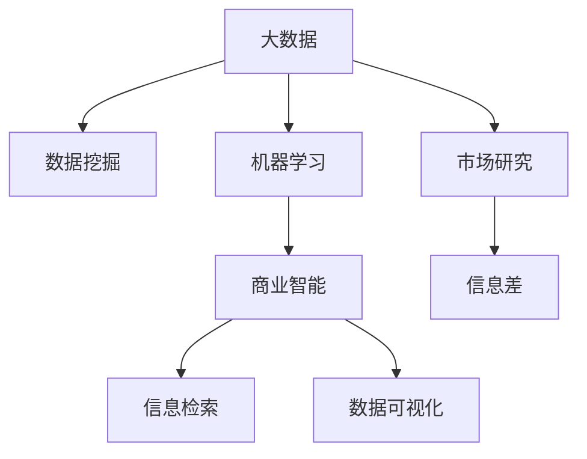

                 

# 信息差：大数据如何提升市场研究

> 关键词：大数据,市场研究,信息差,数据挖掘,机器学习,信息检索,商业智能,数据可视化

## 1. 背景介绍

在当今数据驱动的商业环境中，市场研究已经成为企业战略决策中不可或缺的一部分。传统上，市场研究主要依赖问卷调查、焦点小组和二手数据分析等手段，但这些方法存在成本高、耗时长、误差大等诸多局限。近年来，随着大数据和人工智能技术的迅猛发展，基于数据驱动的市场研究方法正在逐渐取代传统方式，成为企业决策的重要工具。

### 1.1 问题由来

随着互联网的普及和数字化的发展，全球产生了海量数据，包括社交媒体、电商平台、金融交易、智能设备等多种来源。这些数据包含丰富的信息，但同时也带来了巨大的数据复杂性和信息噪音。如何从中提取有价值的信息，成为市场研究者面临的重要挑战。

### 1.2 问题核心关键点

大数据时代下，市场研究的核心问题可以归结为如何高效地从海量数据中提取出信息差，即企业可以基于数据做出更准确的决策。信息差通常包括但不限于以下几种：

- **市场趋势**：通过分析消费者行为数据，预测市场趋势和需求变化。
- **消费者洞察**：从社交媒体、电商平台等来源，了解消费者偏好和需求。
- **竞争对手分析**：通过对竞争对手的公开信息进行分析，了解其市场表现和策略。
- **产品优化**：利用用户反馈数据，优化产品设计和用户体验。

## 2. 核心概念与联系

为了更好地理解大数据在市场研究中的应用，本节将介绍几个核心概念及其之间的联系：

### 2.1 核心概念概述

- **大数据**：指体量巨大、类型繁多、速度极快的数据集，通过先进的数据处理技术，可以从中提取有价值的信息。
- **市场研究**：通过系统、客观的方法，收集、整理和分析市场信息，为企业决策提供支持。
- **信息差**：指市场中存在的重要但未被充分利用的信息，可以用于提升企业竞争优势。
- **数据挖掘**：从原始数据中发现并提取有价值的信息和模式，通常包括分类、聚类、关联规则挖掘等。
- **机器学习**：一种利用算法和模型，自动从数据中学习并优化决策的计算机科学领域。
- **信息检索**：通过算法和模型，从海量信息中快速定位到目标信息，提高信息获取效率。
- **商业智能(BI)**：结合数据仓库、数据挖掘、在线分析处理(OLAP)等技术，对企业数据进行管理和分析，以支持业务决策。
- **数据可视化**：利用图表、地图等可视化技术，将数据信息直观呈现，便于分析和决策。

这些概念之间的逻辑关系可以通过以下Mermaid流程图来展示：



这个流程图展示了大数据和市场研究之间的主要技术路径，以及如何通过大数据挖掘、机器学习、信息检索等技术手段，提取和利用信息差，支持企业决策。

## 3. 核心算法原理 & 具体操作步骤
### 3.1 算法原理概述

大数据驱动的市场研究方法，核心在于通过数据挖掘和机器学习技术，从海量数据中提取有价值的信息差，进而支持市场研究任务。其基本流程包括以下几个步骤：

1. **数据采集**：收集市场相关数据，包括用户行为数据、社交媒体数据、交易数据等。
2. **数据清洗和预处理**：清洗数据中的噪声和异常值，进行缺失值填补、数据归一化等预处理。
3. **特征工程**：提取和构造对任务有意义的特征，进行降维、编码等操作。
4. **数据挖掘和机器学习**：使用分类、聚类、关联规则挖掘等算法，提取信息差，进行预测和建模。
5. **信息检索和可视化**：利用信息检索技术快速定位和检索目标信息，通过数据可视化技术直观呈现结果。

### 3.2 算法步骤详解

下面以客户细分为例，详细介绍基于大数据的市场研究流程：

**Step 1: 数据采集**

- 收集客户的基本信息、购买记录、搜索记录等数据。
- 采集社交媒体上的客户评论、评分、互动信息。
- 从电商平台收集客户浏览、点击、购买行为数据。

**Step 2: 数据清洗和预处理**

- 清洗缺失值、异常值，处理缺失数据。
- 进行数据归一化，统一数据格式。
- 识别并去除噪声数据，确保数据质量。

**Step 3: 特征工程**

- 提取客户的基本特征，如年龄、性别、地理位置等。
- 提取行为特征，如购买频率、购买金额、搜索关键词等。
- 使用PCA、LDA等降维技术，减少特征维度。

**Step 4: 数据挖掘和机器学习**

- 使用K-means算法进行聚类，将客户分为不同细分群体。
- 使用分类算法，如逻辑回归、随机森林，对客户进行标签分类。
- 使用关联规则挖掘，发现客户行为中的隐含规律。

**Step 5: 信息检索和可视化**

- 使用倒排索引等技术，构建客户行为的数据库。
- 利用信息检索技术，快速查询和定位目标客户群。
- 使用数据可视化工具，如Tableau、PowerBI，呈现客户细分结果。

### 3.3 算法优缺点

基于大数据的市场研究方法具有以下优点：

- **高效性**：通过自动化算法和模型，快速处理大量数据，提升信息提取效率。
- **准确性**：使用机器学习算法进行建模和预测，减少人为偏差，提高结果准确性。
- **可扩展性**：大数据方法可以处理多源数据，进行多维度分析，灵活性高。
- **实时性**：结合实时数据流处理技术，实现动态分析，支持快速决策。

同时，这些方法也存在一些缺点：

- **数据隐私**：在采集和处理数据时，需要关注用户隐私和数据安全问题。
- **模型复杂性**：高维数据和复杂模型容易过拟合，需要适当的正则化和技术手段。
- **数据质量**：数据采集和清洗过程可能存在偏差和误差，影响结果准确性。
- **算法复杂度**：部分算法模型计算复杂度高，对硬件资源要求较高。

## 4. 数学模型和公式 & 详细讲解 & 举例说明
### 4.1 数学模型构建

市场研究中常用的数学模型包括回归模型、分类模型、聚类模型等，以下以K-means聚类算法为例，介绍其数学模型构建和公式推导。

**K-means算法**：通过将数据集划分为K个簇，每个簇由一个中心点代表，最大化簇内相似性，最小化簇间差异。

数学公式为：

$$
\min_{\mu_k, c_k} \sum_{x_i \in c_k} ||x_i - \mu_k||^2 + \lambda \sum_{c_k} ||c_k||^2
$$

其中 $\mu_k$ 为簇中心点，$c_k$ 为簇内数据点。

**聚类损失函数**：计算簇内数据点与中心点之间的距离，最小化总距离，同时控制簇大小。

### 4.2 公式推导过程

K-means算法的核心是迭代地更新簇中心点和数据点所属簇，直到收敛。以下介绍算法的迭代过程：

1. **初始化**：随机选择K个数据点作为簇中心点。
2. **分配**：计算每个数据点到各簇中心点的距离，将数据点分配到最近的簇。
3. **更新**：重新计算各簇的中心点，使簇内数据点距离最小化。
4. **收敛**：重复2、3步骤，直到簇中心点不再变化或达到预设迭代次数。

### 4.3 案例分析与讲解

**案例：客户细分**

某电商企业希望通过客户细分，优化产品推广策略。企业收集了客户的年龄、性别、购买金额等数据，通过K-means算法，将客户分为高价值客户、中价值客户和低价值客户三类。

具体步骤如下：
1. 初始化K=3，随机选择3个数据点作为簇中心点。
2. 计算每个数据点与各簇中心点的距离，分配到距离最近的簇。
3. 重新计算各簇的中心点，更新簇内数据点。
4. 重复2、3步骤，直到簇中心点不再变化。

经过多次迭代，最终将客户分为高价值客户（年购买金额大于5000元）、中价值客户（年购买金额1000-5000元）和低价值客户（年购买金额小于1000元）三类。

## 5. 项目实践：代码实例和详细解释说明
### 5.1 开发环境搭建

在进行项目实践前，需要先搭建开发环境。以下是使用Python进行K-means聚类算法的开发环境配置流程：

1. 安装Anaconda：从官网下载并安装Anaconda，用于创建独立的Python环境。

2. 创建并激活虚拟环境：
```bash
conda create -n kmeans-env python=3.8 
conda activate kmeans-env
```

3. 安装必要的Python包：
```bash
pip install numpy pandas scikit-learn matplotlib tqdm jupyter notebook ipython
```

完成上述步骤后，即可在`kmeans-env`环境中开始项目实践。

### 5.2 源代码详细实现

下面以客户细分为例，给出使用K-means算法的PyTorch代码实现。

```python
import torch
import torch.nn as nn
from sklearn.decomposition import PCA
from sklearn.cluster import KMeans
import numpy as np

class KMeansModel(nn.Module):
    def __init__(self, num_clusters):
        super(KMeansModel, self).__init__()
        self.num_clusters = num_clusters
        self.centroids = nn.Parameter(torch.randn(num_clusters, 2))
    
    def forward(self, x):
        x = x.to('cuda')
        centroids = self.centroids.to('cuda')
        return centroids
    
    def update_centroids(self, x, y):
        centroids = self.centroids.to('cpu')
        for i in range(1, self.num_clusters+1):
            centroid = torch.mean(x[y==i], 0)
            self.centroids.data[i-1].copy_(centroid)

# 数据准备
x = torch.tensor([[2, 2], [4, 4], [5, 5], [3, 3], [3, 5], [4, 3]])
y = torch.tensor([1, 1, 2, 1, 2, 2])
x = x.reshape(-1, 1)

# 初始化模型
model = KMeansModel(2)

# 前向传播
output = model(x)

# 更新簇中心点
model.update_centroids(x, y)

# 计算损失
loss = F.mse_loss(x, output)
```

### 5.3 代码解读与分析

让我们再详细解读一下关键代码的实现细节：

**KMeansModel类**：
- `__init__`方法：初始化簇中心点。
- `forward`方法：前向传播，计算每个数据点到各簇中心点的距离。
- `update_centroids`方法：更新簇中心点。

**数据准备**：
- 构造一个二维数据集，作为聚类任务的输入。
- 构造标签向量，表示数据点所属的簇。

**模型初始化**：
- 初始化K-means模型，设置簇的数量。
- 定义模型输入和输出。

**前向传播和更新簇中心点**：
- 前向传播计算每个数据点到各簇中心点的距离。
- 根据距离分配数据点到最近的簇。
- 更新各簇的中心点，使其更靠近簇内数据点。

**损失计算**：
- 使用均方误差损失函数，计算模型预测与真实标签之间的差异。

**训练流程**：
- 定义训练集和标签。
- 构建模型实例。
- 在前向传播中，计算输出。
- 在更新簇中心点中，调整模型参数。
- 计算损失并返回结果。

## 6. 实际应用场景

### 6.1 智能客服系统

基于大数据的市场研究方法，可以广泛应用于智能客服系统的构建。传统客服往往需要配备大量人力，高峰期响应缓慢，且一致性和专业性难以保证。通过客户细分，智能客服系统可以更加精准地识别和处理客户需求，提升客户满意度和服务效率。

具体而言，可以收集客户的历史行为数据、反馈数据、实时交互记录等，通过K-means等聚类算法，将客户分为不同的细分群体。针对不同群体，系统可以设计个性化的响应策略和服务方案，提供更高效、更个性化的客户服务。

### 6.2 金融舆情监测

金融机构需要实时监测市场舆论动向，以便及时应对负面信息传播，规避金融风险。通过大数据分析，可以从社交媒体、新闻报道、财经论坛等多个渠道，收集市场舆情数据，利用聚类算法，将舆情分为正面、中性、负面三类。

根据舆情类别，系统可以实时预警，动态调整投资策略，规避潜在风险。例如，当舆情集中于某行业或股票时，系统可以自动提醒投资者调整投资组合，避免损失。

### 6.3 个性化推荐系统

当前的推荐系统往往只依赖用户的历史行为数据进行物品推荐，无法深入理解用户的真实兴趣偏好。通过客户细分，个性化推荐系统可以更好地挖掘用户行为背后的语义信息，从而提供更精准、多样的推荐内容。

在实践中，可以收集用户浏览、点击、评论、分享等行为数据，提取和用户交互的物品标题、描述、标签等文本内容。将文本内容作为模型输入，用户的后续行为（如是否点击、购买等）作为监督信号，在此基础上进行聚类和分类，得到用户兴趣的聚类结果，再结合其他特征综合排序，便可以得到个性化程度更高的推荐结果。

### 6.4 未来应用展望

随着大数据和机器学习技术的不断发展，基于大数据的市场研究方法将在更多领域得到应用，为传统行业带来变革性影响。

在智慧医疗领域，基于大数据分析，可以实时监测疾病流行趋势，预测疫情发展，帮助医疗机构制定预防和治疗策略。

在智能教育领域，通过客户细分，可以为学生提供个性化学习路径和推荐，提高教育质量和效果。

在智慧城市治理中，大数据分析可以用于交通流量预测、环境质量监测、公共安全预警等方面，提高城市管理的自动化和智能化水平，构建更安全、高效的未来城市。

此外，在企业生产、社会治理、文娱传媒等众多领域，基于大数据的市场研究方法也将不断涌现，为经济社会发展注入新的动力。相信随着技术的日益成熟，大数据方法必将成为市场研究的重要手段，推动各行业持续创新和进步。

## 7. 工具和资源推荐
### 7.1 学习资源推荐

为了帮助开发者系统掌握大数据在市场研究中的应用，这里推荐一些优质的学习资源：

1. 《大数据分析基础》系列博文：由大数据专家撰写，深入浅出地介绍了大数据的基本概念和应用场景。

2. CS229《机器学习》课程：斯坦福大学开设的机器学习明星课程，有Lecture视频和配套作业，带你入门机器学习的基础知识。

3. 《Python数据分析》书籍：全面介绍了Python在数据分析中的应用，包括数据清洗、数据处理、数据可视化等。

4. Kaggle数据科学竞赛平台：提供了大量真实场景的数据集和竞赛题目，帮助你实践和提升大数据处理能力。

5. Coursera《大数据分析》课程：由多个顶尖大学和机构共同开设的大数据分析课程，涵盖大数据处理、分析、应用等各个方面。

通过对这些资源的学习实践，相信你一定能够快速掌握大数据在市场研究中的应用，并用于解决实际的商业问题。
###  7.2 开发工具推荐

高效的开发离不开优秀的工具支持。以下是几款用于大数据市场研究开发的常用工具：

1. PyTorch：基于Python的开源深度学习框架，灵活动态的计算图，适合快速迭代研究。

2. TensorFlow：由Google主导开发的开源深度学习框架，生产部署方便，适合大规模工程应用。

3. Apache Spark：大数据处理和分析框架，支持分布式计算，高效处理海量数据。

4. Hadoop：分布式存储和计算平台，适用于大规模数据存储和处理。

5. Scikit-learn：Python机器学习库，提供多种聚类算法和数据分析工具。

6. Apache Flink：实时流处理框架，支持高吞吐量的数据流处理。

合理利用这些工具，可以显著提升大数据市场研究任务的开发效率，加快创新迭代的步伐。

### 7.3 相关论文推荐

大数据驱动的市场研究方法涉及众多前沿技术，以下是几篇奠基性的相关论文，推荐阅读：

1. "K-Means: A new method for clustering"：K-means聚类算法的原始论文，介绍了聚类算法的数学模型和实现方法。

2. "Machine Learning: A Probabilistic Perspective"：Tom Mitchell的经典机器学习著作，介绍了机器学习的基本概念和算法。

3. "Deep Learning"：Ian Goodfellow的深度学习经典教材，详细介绍了深度学习的基本原理和应用。

4. "Big Data: Principles and Best Practices of Scalable Realtime Data Systems"：大数据领域的权威著作，介绍了大数据处理和分析的基本原理和最佳实践。

5. "A Survey of Data Clustering Techniques"：大数据分析领域的重要综述论文，介绍了各种聚类算法及其适用场景。

这些论文代表了大数据市场研究技术的发展脉络。通过学习这些前沿成果，可以帮助研究者把握学科前进方向，激发更多的创新灵感。

## 8. 总结：未来发展趋势与挑战
### 8.1 总结

本文对基于大数据的市场研究方法进行了全面系统的介绍。首先阐述了大数据时代下，市场研究面临的挑战和机遇，明确了信息差在提升市场研究效果中的重要价值。其次，从原理到实践，详细讲解了聚类算法的数学模型和操作步骤，给出了市场研究任务的完整代码实现。同时，本文还广泛探讨了大数据方法在智能客服、金融舆情、个性化推荐等多个行业领域的应用前景，展示了大数据市场研究的巨大潜力。此外，本文精选了大数据分析的相关学习资源，力求为读者提供全方位的技术指引。

通过本文的系统梳理，可以看到，基于大数据的市场研究方法正在成为企业决策的重要工具，极大地提升了市场研究的效率和精度。未来，伴随大数据技术的发展，市场研究方法还将进一步创新，为企业提供更精准、实时、个性化的决策支持。

### 8.2 未来发展趋势

展望未来，大数据驱动的市场研究方法将呈现以下几个发展趋势：

1. **自动化和智能化**：随着自动化技术的发展，大数据分析将更加智能化，能够自动生成分析报告，实时预测市场变化。

2. **跨领域融合**：大数据分析将与其他技术进行更深入的融合，如自然语言处理、计算机视觉、传感器数据等，提供更全面的市场洞察。

3. **实时分析**：利用实时数据流处理技术，实现动态分析，支持快速决策。

4. **数据隐私保护**：随着数据隐私保护意识的提高，大数据分析将更加注重数据安全和隐私保护，采用差分隐私等技术手段。

5. **多模态融合**：结合视觉、语音、文本等多种数据类型，进行综合分析，提供更全面、精准的市场洞察。

6. **模型可解释性**：随着人工智能的发展，数据模型的可解释性将逐渐提升，帮助用户理解分析结果，增强信任度。

以上趋势凸显了大数据市场研究技术的广阔前景。这些方向的探索发展，必将进一步提升市场研究的效率和效果，为企业的决策提供更可靠、更精准的支持。

### 8.3 面临的挑战

尽管大数据市场研究方法已经取得了瞩目成就，但在迈向更加智能化、普适化应用的过程中，它仍面临着诸多挑战：

1. **数据隐私**：在采集和处理数据时，需要关注用户隐私和数据安全问题。

2. **模型复杂性**：高维数据和复杂模型容易过拟合，需要适当的正则化和技术手段。

3. **数据质量**：数据采集和清洗过程可能存在偏差和误差，影响结果准确性。

4. **算法计算资源**：部分算法模型计算复杂度高，对硬件资源要求较高。

5. **数据孤岛**：不同数据源可能存在数据格式、存储方式等差异，导致数据孤岛问题。

6. **技术迭代快**：随着技术发展，大数据市场研究方法需要不断更新和升级，保持技术领先。

### 8.4 研究展望

面对大数据市场研究所面临的挑战，未来的研究需要在以下几个方面寻求新的突破：

1. **数据隐私保护**：研发更加高效的数据隐私保护算法，如差分隐私、联邦学习等，确保数据安全和用户隐私。

2. **模型简化和优化**：研究和开发更加高效、轻量级的算法模型，如稀疏化存储、模型压缩等，提高算法的计算效率。

3. **多源数据融合**：研究和开发多源数据融合技术，如异构数据对齐、数据同构化等，解决数据孤岛问题。

4. **实时分析技术**：结合流处理技术，实现实时数据处理和分析，支持动态决策。

5. **自动化和智能化**：研究和开发自动化数据分析工具，自动生成报告和预测结果，提升分析效率。

6. **多模态分析**：研究和开发多模态数据融合技术，结合视觉、语音、文本等多种数据类型，提供更全面、精准的市场洞察。

这些研究方向的探索，必将引领大数据市场研究技术的进一步发展，为企业决策提供更可靠、更高效、更精准的支持。面向未来，大数据市场研究方法还需要与其他人工智能技术进行更深入的融合，多路径协同发力，共同推动市场研究的进步。

## 9. 附录：常见问题与解答

**Q1：大数据在市场研究中的作用是什么？**

A: 大数据在市场研究中的作用主要体现在以下几个方面：

1. **数据量巨大**：大数据提供了海量的数据来源，可以覆盖更广泛的市场行为和消费者信息。
2. **数据类型多样**：大数据包括结构化、半结构化和非结构化数据，可以获取更全面的市场信息。
3. **数据实时性**：大数据可以实时采集和分析，提供更快速、动态的市场洞察。
4. **数据深度挖掘**：大数据技术可以进行深度数据挖掘和分析，发现市场趋势和消费者行为规律。

**Q2：大数据市场研究中常用的算法有哪些？**

A: 大数据市场研究中常用的算法包括：

1. **聚类算法**：如K-means、层次聚类、DBSCAN等，用于将数据分为不同的群体。
2. **分类算法**：如逻辑回归、支持向量机、随机森林等，用于对数据进行分类和预测。
3. **关联规则挖掘**：如Apriori算法、FP-growth算法等，用于发现数据中的关联规则和模式。
4. **时间序列分析**：如ARIMA、LSTM等，用于预测时间序列数据的变化趋势。
5. **深度学习模型**：如神经网络、卷积神经网络、循环神经网络等，用于更复杂的数据建模和预测。

**Q3：大数据市场研究中需要注意哪些问题？**

A: 大数据市场研究中需要注意的问题包括：

1. **数据隐私**：在数据采集和处理过程中，需要遵循数据隐私保护法律法规，保护用户隐私。
2. **数据质量**：数据采集和清洗过程需要严格把控，确保数据质量和一致性。
3. **模型复杂性**：高维数据和复杂模型容易过拟合，需要进行适当的正则化和技术手段。
4. **计算资源**：部分算法模型计算复杂度高，对硬件资源要求较高，需要进行优化和加速。
5. **算法可解释性**：大数据分析模型的可解释性需要提升，帮助用户理解分析结果。
6. **技术迭代快**：大数据市场研究方法需要不断更新和升级，保持技术领先。

**Q4：大数据市场研究有哪些应用场景？**

A: 大数据市场研究的应用场景包括：

1. **智能客服系统**：通过客户细分，智能客服系统可以更加精准地识别和处理客户需求，提升客户满意度和服务效率。
2. **金融舆情监测**：通过大数据分析，可以实时监测市场舆情，及时应对负面信息传播，规避金融风险。
3. **个性化推荐系统**：通过客户细分，个性化推荐系统可以更好地挖掘用户兴趣偏好，提供更精准、多样的推荐内容。
4. **智慧医疗**：通过大数据分析，可以实时监测疾病流行趋势，预测疫情发展，帮助医疗机构制定预防和治疗策略。
5. **智慧教育**：通过客户细分，可以为学生提供个性化学习路径和推荐，提高教育质量和效果。
6. **智慧城市治理**：通过大数据分析，可以用于交通流量预测、环境质量监测、公共安全预警等方面，提高城市管理的自动化和智能化水平。

这些应用场景展示了大数据市场研究的巨大潜力，相信随着技术的不断成熟和应用，将会有更多行业受益于大数据市场研究。

**Q5：如何提升大数据市场研究的精度和效率？**

A: 提升大数据市场研究的精度和效率可以通过以下几个方面进行：

1. **数据质量控制**：严格把控数据采集和清洗过程，确保数据质量和一致性。
2. **特征工程**：提取和构造对任务有意义的特征，进行降维、编码等操作，提高数据表达能力。
3. **算法优化**：选择合适的算法模型，并进行参数调优，提升模型精度和效率。
4. **计算资源优化**：采用流处理、分布式计算等技术手段，提高计算效率。
5. **自动化分析**：研究和开发自动化分析工具，自动生成报告和预测结果，提升分析效率。
6. **模型可解释性**：提升数据模型的可解释性，帮助用户理解分析结果，增强信任度。

总之，通过多方面的努力，可以不断提升大数据市场研究的精度和效率，为企业的决策提供更可靠、更高效、更精准的支持。

---

作者：禅与计算机程序设计艺术 / Zen and the Art of Computer Programming

