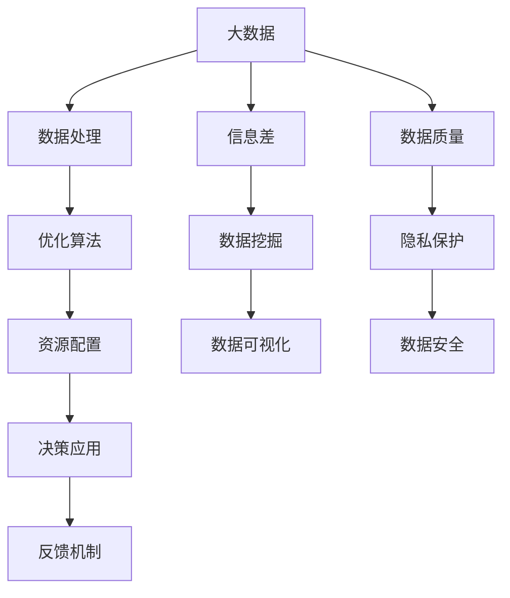

                 

# 信息差：大数据如何提升资源配置

## 1. 背景介绍

在当今数字经济时代，资源配置是各类机构运营的核心问题。如何高效利用有限的资源，最大化产出效益，是企业和政府机构面临的共同挑战。大数据技术的兴起，为优化资源配置提供了新的思路和方法。通过采集和分析海量数据，大数据可以在多个层面提升资源配置的效率和效果，驱动生产力提升和社会效益增加。

### 1.1 问题由来

资源配置本质上是一个优化问题，即在资源约束条件下，最大化目标函数。传统上，人们依靠经验和直觉进行决策，然而在复杂多变的环境下，这种方法往往导致决策失误和资源浪费。大数据技术通过提供高质量、实时化的数据，辅助决策过程，实现更科学、合理的资源配置。

近年来，全球范围内出现了大规模数据应用的浪潮。智能推荐、金融风险管理、交通流量优化等领域，都充分展示了大数据技术在提升资源配置效率方面的巨大潜力。但与此同时，数据质量、隐私保护、计算能力等挑战也亟待解决。因此，如何充分利用大数据技术，优化资源配置，是一个值得深入研究的课题。

### 1.2 问题核心关键点

大数据优化资源配置的核心关键点包括：
- 数据质量：确保数据准确、全面、时效性强。
- 算法模型：构建高效、鲁棒的优化算法，提升决策质量。
- 技术工具：选择适合的数据处理、分析、可视工具，提升工作效率。
- 组织机制：建立数据驱动的决策机制，推动资源配置的科学化。

## 2. 核心概念与联系

### 2.1 核心概念概述

为更好地理解大数据优化资源配置的原理和应用，本节将介绍几个关键概念：

- **大数据**：指海量、多样、复杂的数据集，具有体量大、时效性强、价值密度低等特点。
- **优化算法**：指求解多目标优化问题的一类算法，包括线性规划、整数规划、非线性规划等。
- **资源配置**：指在有限资源下，对各项任务进行合理分配，以实现最优的产出效益。
- **信息差**：指数据中未被利用的信息，通过大数据分析可以挖掘这些信息，提升决策质量。

这些核心概念之间相互联系，共同构成大数据优化资源配置的理论基础。

### 2.2 核心概念原理和架构的 Mermaid 流程图



这个流程图展示了大数据优化资源配置的核心流程：

1. 从大数据中挖掘出信息差，构建准确的优化模型。
2. 使用高效算法对模型求解，优化资源配置。
3. 将优化结果应用于实际决策，提升资源利用率。
4. 建立反馈机制，持续优化决策过程。

## 3. 核心算法原理 & 具体操作步骤

### 3.1 算法原理概述

大数据优化资源配置的原理基于数据驱动的决策支持系统，通过收集、处理和分析海量数据，辅助决策者进行科学决策。核心算法包括：

- **数据采集**：通过传感器、网络爬虫、数据库等手段，收集多源异构数据。
- **数据清洗**：对采集到的数据进行预处理，包括去重、去噪、归一化等，提升数据质量。
- **数据分析**：使用统计分析、机器学习等技术，提取数据中的有用信息，构建优化模型。
- **模型求解**：使用优化算法，求解模型的最优解，生成资源配置方案。
- **方案评估**：对生成的方案进行评估和调整，确保其合理性和可操作性。

### 3.2 算法步骤详解

大数据优化资源配置的详细步骤包括：

**Step 1: 数据采集**

- 确定需要采集的数据类型和来源。
- 使用传感器、网络爬虫、数据库等方式进行数据采集。
- 确保数据的时效性和准确性，避免遗漏和错误。

**Step 2: 数据清洗**

- 对采集到的数据进行预处理，去除冗余和噪声。
- 对数据进行归一化、标准化处理，统一数据格式。
- 使用数据清洗工具，如Python的Pandas库，自动化处理复杂数据。

**Step 3: 数据分析**

- 使用统计分析、机器学习等技术，提取数据中的有用信息。
- 构建优化模型，使用线性规划、整数规划等算法，求解最优解。
- 对模型进行验证和调优，确保其可靠性和准确性。

**Step 4: 模型求解**

- 使用优化算法，求解模型的最优解。
- 根据优化结果，生成资源配置方案。
- 使用可视化工具，将结果展示给决策者，便于理解和使用。

**Step 5: 方案评估**

- 对生成的方案进行评估和调整，确保其合理性和可操作性。
- 使用A/B测试、模拟实验等方法，验证方案的实际效果。
- 根据评估结果，进一步优化算法和模型，提升资源配置的效率和效果。

### 3.3 算法优缺点

大数据优化资源配置算法具有以下优点：

- **数据驱动决策**：利用大数据优势，提供全面、准确的数据支持，辅助决策过程。
- **优化效果显著**：通过模型求解，生成最优资源配置方案，提升资源利用率。
- **持续改进**：基于反馈机制，持续优化模型和算法，提升决策质量。

同时，该方法也存在以下缺点：

- **数据质量要求高**：需要高质量、全面、时效的数据，否则算法结果可能失真。
- **计算复杂度高**：优化算法往往需要复杂的计算资源，耗时较长。
- **模型可解释性差**：复杂的优化模型难以解释，决策过程缺乏透明度。
- **隐私保护挑战**：数据采集和分析过程中，需注意隐私保护，避免数据泄露。

### 3.4 算法应用领域

大数据优化资源配置方法广泛应用于各类企业和机构，包括但不限于以下几个领域：

- **智能推荐系统**：通过分析用户行为数据，推荐个性化的商品和服务，提升用户满意度。
- **金融风险管理**：利用大数据分析客户行为和市场趋势，进行风险评估和控制。
- **交通流量优化**：分析交通数据，优化交通信号灯和路线规划，提升交通效率。
- **物流配送优化**：利用大数据分析客户订单和物流数据，优化配送路线和库存管理。
- **工业生产优化**：分析生产数据，优化生产流程和资源分配，提升生产效率。

## 4. 数学模型和公式 & 详细讲解

### 4.1 数学模型构建

为更好地理解大数据优化资源配置的数学模型，本节将构建一个简单的资源配置模型。

假设某公司需要配置有限的资金R，用于生产某种产品。设每件产品的生产成本为C，销售价格为P，市场容量为D，需求函数为Q(D)。目标是在资金和需求限制下，最大化利润F，即：

$$
\maximize F = P \times Q(D) - C \times R
$$

约束条件包括：

$$
C \times R \leq P \times Q(D) \quad (资金限制)
$$
$$
D \geq Q(D) \geq 0 \quad (市场需求)
$$
$$
R \geq 0 \quad (可用资金)
$$

其中，$P$、$Q(D)$、$C$、$R$均为变量。

### 4.2 公式推导过程

根据上述目标函数和约束条件，构建拉格朗日乘子法模型：

$$
\mathcal{L}(P, Q(D), R, \lambda) = P \times Q(D) - C \times R + \lambda(P \times Q(D) - C \times R)
$$

对每个变量求偏导数，并令其为0：

$$
\frac{\partial \mathcal{L}}{\partial P} = Q(D) + \lambda \times Q(D) = 0
$$
$$
\frac{\partial \mathcal{L}}{\partial Q(D)} = P + \lambda = 0
$$
$$
\frac{\partial \mathcal{L}}{\partial R} = -C + \lambda = 0
$$
$$
\frac{\partial \mathcal{L}}{\partial \lambda} = P \times Q(D) - C \times R = 0
$$

解以上方程组，即可得到最优的$P$、$Q(D)$、$R$值。

### 4.3 案例分析与讲解

以物流配送优化为例，分析大数据如何帮助优化资源配置。

假设某物流公司需要配送N件包裹到M个站点，每个站点的需求量$D_i$、运输成本$C_i$、配送成本$P_i$已知。目标是设计最优的配送路线，使得总配送成本最低。构建如下模型：

$$
\minimize C = \sum_{i=1}^M C_i \times D_i
$$

约束条件包括：

$$
\sum_{i=1}^M D_i = N \quad (总需求量)
$$
$$
D_i \geq 0 \quad (非负约束)
$$

使用整数规划算法求解上述模型，得到最优的配送量$D_i$，进而确定最优的配送路线。

## 5. 项目实践：代码实例和详细解释说明

### 5.1 开发环境搭建

在进行大数据优化资源配置的实践前，我们需要准备好开发环境。以下是使用Python进行开发的环境配置流程：

1. 安装Anaconda：从官网下载并安装Anaconda，用于创建独立的Python环境。

2. 创建并激活虚拟环境：
```bash
conda create -n bigdata-env python=3.8 
conda activate bigdata-env
```

3. 安装必要的库：
```bash
conda install pandas numpy matplotlib scipy scikit-learn statsmodels
pip install networkx matplotlib
```

完成上述步骤后，即可在`bigdata-env`环境中开始大数据优化资源配置的实践。

### 5.2 源代码详细实现

下面以物流配送优化为例，给出使用Python实现整数规划的代码示例。

首先，定义问题参数：

```python
import numpy as np
import networkx as nx
from scipy.optimize import linprog

# 定义站点和包裹信息
D = [10, 8, 5, 7, 12]
C = [1.2, 1.3, 1.5, 1.4, 1.1]
N = sum(D)

# 定义整数规划模型
A = np.array([[1, 0, 0, 0, 0], [0, 1, 0, 0, 0], [0, 0, 1, 0, 0], [0, 0, 0, 1, 0], [0, 0, 0, 0, 1]])
b = np.array([N, 0, 0, 0, 0])
c = np.array([C])
```

然后，求解整数规划模型：

```python
# 求解整数规划模型
res = linprog(c, A_ub=A, b_ub=b, bounds=(0, None), method='simplex')
print(res)
```

最后，使用网络图表示最优解：

```python
# 创建网络图
G = nx.DiGraph()
G.add_nodes_from(range(1, 6))
G.add_edges_from([(i, i+1) for i in range(1, 5)])

# 显示网络图
nx.draw(G, with_labels=True)
```

以上代码实现了从定义整数规划模型到求解最优解的完整过程。可以看到，使用Python结合SciPy和NetworkX库，可以高效地解决各类优化问题，提供可视化的结果展示。

### 5.3 代码解读与分析

让我们再详细解读一下关键代码的实现细节：

**问题参数定义**：
- 定义了站点的需求量`D`、运输成本`C`和总包裹数`N`。
- 定义了整数规划模型的系数矩阵`A`、边界向量`b`和目标系数向量`c`。

**求解整数规划模型**：
- 使用SciPy的`linprog`函数求解整数规划问题。
- 通过指定`method='simplex'`，使用单纯形法求解。
- 打印求解结果，包含目标函数值、约束条件、变量值等关键信息。

**网络图绘制**：
- 使用NetworkX库创建有向图，表示站点间的物流关系。
- 使用`add_nodes_from`和`add_edges_from`方法，添加节点和边。
- 使用`nx.draw`方法，绘制图形并显示标签。

可以看到，Python结合SciPy和NetworkX库，可以方便地进行优化问题的求解和可视化展示，有助于快速迭代和验证算法效果。

## 6. 实际应用场景

### 6.1 智能推荐系统

大数据优化资源配置在智能推荐系统中的应用，主要体现在两个方面：

- **用户行为分析**：通过分析用户历史行为数据，构建用户画像，预测其兴趣偏好，推荐个性化的商品和服务。
- **资源分配优化**：在有限的推荐资源下，优化推荐算法，提升用户满意度。

以电商平台的商品推荐为例，分析大数据如何优化资源配置。

假设电商平台有K类商品，每个用户的历史行为数据包括浏览、点击、购买等行为。目标是最大化推荐效果，生成用户最感兴趣的商品列表。构建如下模型：

$$
\minimize E = \sum_{k=1}^K C_k \times R_k
$$

约束条件包括：

$$
\sum_{k=1}^K R_k = N \quad (总推荐量)
$$
$$
R_k \geq 0 \quad (非负约束)
$$

使用优化算法求解上述模型，得到最优的推荐量$R_k$，进而确定最优的推荐商品列表。

### 6.2 金融风险管理

大数据优化资源配置在金融风险管理中的应用，主要体现在以下两个方面：

- **风险评估**：通过分析客户历史交易数据，构建风险模型，评估其信用风险和市场风险。
- **资金配置**：在有限的资金资源下，优化资金分配策略，降低风险暴露。

以银行贷款风险管理为例，分析大数据如何优化资源配置。

假设银行有M个贷款申请，每个申请的信用评级为$R_i$、贷款额度为$C_i$、逾期还款概率为$P_i$。目标是最大化贷款收益，最小化违约损失。构建如下模型：

$$
\minimize L = \sum_{i=1}^M (1-P_i) \times C_i
$$

约束条件包括：

$$
\sum_{i=1}^M C_i = R \quad (总资金)
$$
$$
C_i \geq 0 \quad (非负约束)
$$

使用优化算法求解上述模型，得到最优的贷款额度$C_i$，进而确定最优的贷款申请名单。

### 6.3 交通流量优化

大数据优化资源配置在交通流量优化中的应用，主要体现在以下两个方面：

- **交通需求预测**：通过分析历史交通数据，预测未来交通流量，优化交通信号灯。
- **路径规划优化**：在有限的道路资源下，优化路径规划策略，降低交通拥堵。

以城市交通流量优化为例，分析大数据如何优化资源配置。

假设城市有N条道路，每条道路的交通流量为$D_i$、通行能力为$C_i$、当前拥堵度为$P_i$。目标是最大化交通效率，最小化拥堵程度。构建如下模型：

$$
\minimize C = \sum_{i=1}^N C_i \times P_i
$$

约束条件包括：

$$
\sum_{i=1}^N D_i = T \quad (总流量)
$$
$$
D_i \geq 0 \quad (非负约束)
$$

使用优化算法求解上述模型，得到最优的交通流量$D_i$，进而确定最优的交通信号灯设置。

### 6.4 未来应用展望

随着大数据技术的进一步发展，大数据优化资源配置将有更广泛的应用前景。未来，可能的应用场景包括：

- **智慧城市治理**：通过大数据分析，优化城市资源配置，提升城市管理效率。
- **供应链管理**：利用大数据分析，优化供应链中的资源分配和流程管理，提升供应链效率。
- **智能农业**：通过大数据分析，优化农业资源配置，提升农业生产效率。
- **能源管理**：利用大数据分析，优化能源资源配置，提升能源利用效率。
- **环境监测**：通过大数据分析，优化环境资源配置，提升环境保护效果。

## 7. 工具和资源推荐

### 7.1 学习资源推荐

为了帮助开发者系统掌握大数据优化资源配置的理论基础和实践技巧，这里推荐一些优质的学习资源：

1. 《Python数据科学手册》系列博文：由大模型技术专家撰写，深入浅出地介绍了Python在数据分析和优化中的应用。

2. 《机器学习实战》课程：由斯坦福大学开设的机器学习课程，涵盖各类机器学习算法和优化技术，适合入门学习。

3. 《统计学习方法》书籍：李航所著的机器学习教材，系统讲解了各类统计学习算法，包括线性规划、整数规划等。

4. PyTorch官方文档：PyTorch的官方文档，提供了丰富的模型实现和优化算法，是实践学习的重要资料。

5. Scikit-learn官方文档：Scikit-learn的官方文档，提供了丰富的机器学习库和优化算法，是实践学习的重要资料。

通过对这些资源的学习实践，相信你一定能够快速掌握大数据优化资源配置的精髓，并用于解决实际的优化问题。

### 7.2 开发工具推荐

高效的开发离不开优秀的工具支持。以下是几款用于大数据优化资源配置开发的常用工具：

1. Python：作为数据科学领域的主流语言，Python具有丰富的数据处理和科学计算库，适合进行大数据分析。

2. R语言：作为数据科学领域的另一主流语言，R具有丰富的统计分析库，适合进行大数据优化问题的建模和求解。

3. Scikit-learn：基于Python的开源机器学习库，提供了丰富的优化算法和数据处理工具，适合进行机器学习问题的优化。

4. NetworkX：基于Python的开源网络分析库，适合进行网络图表示和分析。

5. Gurobi：专业的数学规划求解器，支持整数规划、线性规划等多种优化算法，适合进行大规模优化问题的求解。

合理利用这些工具，可以显著提升大数据优化资源配置任务的开发效率，加快创新迭代的步伐。

### 7.3 相关论文推荐

大数据优化资源配置的研究源于学界的持续研究。以下是几篇奠基性的相关论文，推荐阅读：

1. "A Linear Programming Formulation for Distribution Planning"：提出了线性规划模型用于物流配送优化的经典算法。

2. "Multi-objective Integer Linear Programming Model for Energy Management"：提出了整数规划模型用于能源管理优化的经典算法。

3. "Data Mining and Statistical Learning"：Liu等所著的经典教材，系统讲解了各类数据挖掘和统计学习方法，包括线性规划、整数规划等。

4. "A Survey on Mixed Integer Linear Programming Models in Transportation and Logistics"：Sumida等综述了各类混合整数规划模型在交通运输和物流领域的应用。

5. "A Survey on Mixed Integer Programming Approaches for Energy Management"：Goyal等综述了各类混合整数规划模型在能源管理领域的应用。

这些论文代表了大数据优化资源配置的研究脉络。通过学习这些前沿成果，可以帮助研究者把握学科前进方向，激发更多的创新灵感。

## 8. 总结：未来发展趋势与挑战

### 8.1 总结

本文对大数据优化资源配置进行了全面系统的介绍。首先阐述了大数据优化资源配置的研究背景和意义，明确了大数据技术在提升资源配置效率方面的独特价值。其次，从原理到实践，详细讲解了大数据优化资源配置的数学模型和关键步骤，给出了优化问题的代码实现。同时，本文还广泛探讨了大数据优化资源配置在智能推荐、金融风险管理、交通流量优化等多个行业领域的应用前景，展示了大数据技术的广阔前景。

通过本文的系统梳理，可以看到，大数据优化资源配置方法在提升资源利用率、优化决策过程等方面具有重要价值，是大数据技术的重要应用方向。未来，伴随大数据技术的持续演进，该技术必将在更多领域发挥更大作用，驱动生产力提升和社会效益增加。

### 8.2 未来发展趋势

展望未来，大数据优化资源配置技术将呈现以下几个发展趋势：

1. **算法复杂度降低**：未来，算法复杂度将不断降低，使得优化问题更容易求解，从而推广到大规模、复杂系统。

2. **算法自动化提升**：自动机器学习(AutoML)技术将提升算法优化过程的自动化水平，降低人工干预和调参需求。

3. **算法融合创新**：算法融合是未来发展的重要方向，例如，融合强化学习、因果推断等新方法，提升资源配置的动态性和智能性。

4. **算法可解释性增强**：未来，算法将更注重可解释性和透明性，使得优化过程和结果更加可信和可接受。

5. **算法效率提升**：通过算法优化和模型压缩等技术，提升优化算法的效率和资源占用，降低计算成本。

6. **跨领域应用拓展**：大数据优化资源配置技术将拓展到更多领域，如医疗、教育、农业等，提升各行业的资源配置效率。

### 8.3 面临的挑战

尽管大数据优化资源配置技术已经取得了显著进展，但在迈向更加智能化、普适化应用的过程中，仍面临诸多挑战：

1. **数据质量问题**：尽管大数据技术已经非常成熟，但数据质量问题依然存在，例如，数据不完整、数据噪声、数据偏见等，这些问题都会影响算法的优化效果。

2. **计算资源限制**：优化算法往往需要高计算资源，对于大规模、复杂系统的优化，计算资源成本较高，难以规模化部署。

3. **算法鲁棒性不足**：算法在面对未知数据和复杂环境时，鲁棒性不足，容易出现决策失误。

4. **算法可解释性差**：优化算法往往黑盒化，难以解释其内部工作机制和决策逻辑，难以用于高风险应用。

5. **隐私和安全问题**：大数据分析过程中，数据隐私和安全问题亟需解决，避免数据泄露和滥用。

6. **实时性不足**：大数据分析往往需要较长计算时间，难以实时应用于实时系统。

### 8.4 研究展望

面对大数据优化资源配置面临的挑战，未来的研究需要在以下几个方面寻求新的突破：

1. **数据质量提升**：通过数据清洗、数据补全等技术，提升数据质量，降低数据偏见和噪声。

2. **计算资源优化**：通过算法优化、模型压缩等技术，降低计算资源消耗，提升算法效率。

3. **算法鲁棒性增强**：引入鲁棒优化技术，提高算法在复杂环境下的鲁棒性和可靠性。

4. **算法可解释性增强**：引入可解释性技术，增强算法和模型的可解释性和透明性，提升算法的可信度和接受度。

5. **隐私和安全保护**：引入隐私保护和数据安全技术，确保数据在采集、存储和分析过程中的安全。

6. **实时性提升**：引入实时计算技术，实现大数据分析的实时化和在线化，提升实时决策能力。

这些研究方向的探索，将引领大数据优化资源配置技术迈向更高的台阶，为构建智能、高效、安全的资源配置系统提供坚实的基础。

## 9. 附录：常见问题与解答

**Q1：大数据优化资源配置是否可以应用于非线性优化问题？**

A: 大数据优化资源配置主要针对线性规划、整数规划等线性优化问题。对于非线性优化问题，也可以尝试使用逐步线性化等技术进行处理，但需要更多的数学工具和计算资源。

**Q2：如何在数据质量较差的情况下，进行大数据优化资源配置？**

A: 在数据质量较差的情况下，可以采用数据清洗、数据补全、数据融合等技术，提升数据质量。同时，可以引入鲁棒优化技术，提升算法对噪声数据的鲁棒性。

**Q3：大数据优化资源配置是否适用于大规模复杂系统？**

A: 大数据优化资源配置方法在理论上可以应用于大规模复杂系统，但需要更强的计算资源和算法优化。未来，随着计算资源和算法技术的进步，将能更好地应用于大规模、复杂系统。

**Q4：大数据优化资源配置是否需要专业知识？**

A: 大数据优化资源配置需要一定的专业知识，例如，了解各类优化算法、统计分析方法等。但通过学习相关教材和实践项目，可以快速掌握所需知识。

**Q5：大数据优化资源配置是否可以应用于多目标优化问题？**

A: 大数据优化资源配置可以应用于多目标优化问题，通过构建多目标优化模型，可以在多个目标之间进行权衡和优化。例如，在智能推荐系统中，可以通过优化推荐效果和点击率，实现多目标优化。

---

作者：禅与计算机程序设计艺术 / Zen and the Art of Computer Programming

