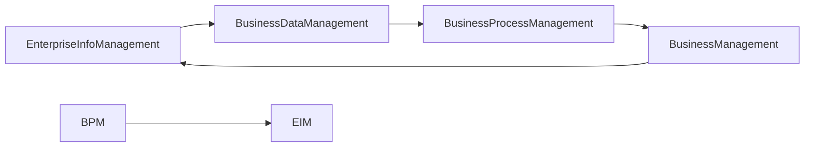

                 

# 信息搭建、企业信息流程、业务流程、业务数据管理系统搭建

> 关键词：企业信息管理, 业务流程管理, 业务数据管理系统, 数据治理, 数据库系统设计

## 1. 背景介绍

在现代企业中，信息的有效管理与流通是提升企业竞争力和运营效率的关键。企业信息流程、业务流程与业务数据管理系统的搭建不仅关系到企业日常运营的稳定性，也直接影响企业决策的准确性和及时性。本博客将系统介绍企业信息搭建、企业信息流程、业务流程、业务数据管理系统的核心概念、设计原理以及应用实践，希望能为企业提供有价值的参考。

## 2. 核心概念与联系

### 2.1 核心概念概述

- **企业信息管理（Enterprise Information Management, EIM）**：涉及数据的收集、存储、管理和使用，旨在提高企业决策的质量和效率。
- **业务流程管理（Business Process Management, BPM）**：通过优化企业的业务流程，提高流程效率和自动化程度，减少不必要的浪费。
- **业务数据管理系统（Business Data Management System, BDMS）**：用于存储、处理和管理企业业务数据的系统。
- **数据治理（Data Governance）**：指通过标准化数据的使用和管理，提高数据的质量和可靠性，确保数据的一致性和安全性。

### 2.2 核心概念原理和架构的 Mermaid 流程图



该图展示了企业信息管理、业务数据管理、业务流程管理与业务管理之间的关系。业务数据管理是信息管理的基础，业务流程管理则是在此基础上通过优化流程来提升效率，最终服务于企业整体业务管理。

## 3. 核心算法原理 & 具体操作步骤

### 3.1 算法原理概述

企业信息流程、业务流程、业务数据管理系统的搭建涉及多个技术领域，包括但不限于信息科学、软件工程、系统设计等。本节将重点介绍如何通过系统化的方法将这些系统有机地结合起来。

### 3.2 算法步骤详解

1. **需求分析**：
    - 与企业各部门沟通，明确信息管理、业务流程优化、数据管理等需求。
    - 根据需求制定详细的项目计划和目标。

2. **系统设计**：
    - 设计企业信息架构，包括数据模型、数据流、信息交互方式等。
    - 确定业务流程的核心节点、输入输出、数据流转路径等。
    - 设计数据管理系统架构，包括数据库设计、数据仓库设计、数据治理策略等。

3. **技术选型**：
    - 根据需求和技术栈，选择合适的技术平台和工具，如ERP系统、CRM系统、BI系统等。
    - 设计系统的技术架构，包括分布式系统、微服务架构、容器化技术等。

4. **系统实施**：
    - 在确定的系统架构和技术选型基础上，进行系统的编码实现。
    - 进行系统测试，确保系统稳定性和性能。
    - 进行系统的上线和部署。

5. **系统优化**：
    - 根据反馈不断优化系统性能和用户体验。
    - 持续监控系统运行情况，进行故障排除和升级维护。

### 3.3 算法优缺点

#### 优点：
- 系统化、规范化地管理企业信息，提高信息利用效率。
- 通过业务流程优化，提升企业运营效率和效益。
- 数据管理系统建设，确保数据的质量和可靠性。

#### 缺点：
- 实施周期长，投入资源多。
- 系统复杂，难以维护。
- 对企业信息化水平要求高。

### 3.4 算法应用领域

该方法广泛应用于各类企业，包括制造、零售、金融、医疗等行业，通过信息化手段提升企业运营水平和决策质量。

## 4. 数学模型和公式 & 详细讲解 & 举例说明

### 4.1 数学模型构建

在企业信息流程、业务流程、业务数据管理系统的搭建中，数学模型主要应用于数据分析、流程优化等方面。以下将以数据模型为例，介绍数学模型的构建。

**数据模型**：
- **实体关系模型（Entity-Relationship Model, ER模型）**：
    - 定义企业中各个实体（Entity）和它们之间的关系（Relationship）。
    - 使用E-R图表示实体和关系，包括属性（Attribute）和键（Key）。
    - 数学表示为：

$$
ER = (E, R, A)
$$

其中 $E$ 为实体集合，$R$ 为关系集合，$A$ 为属性集合。

### 4.2 公式推导过程

**数据流模型（Data Flow Model）**：
- 描述数据从输入到输出的流动过程。
- 数学表示为：

$$
DF = (S, P, D, F)
$$

其中 $S$ 为数据源，$P$ 为数据处理过程，$D$ 为数据流，$F$ 为数据流箭头。

### 4.3 案例分析与讲解

以一个简单的企业信息流程为例：

1. **输入**：销售订单、客户信息、供应商信息等。
2. **处理**：订单处理、客户管理、供应商管理等。
3. **输出**：订单状态、发货单、发票等。

- 使用ER模型表示：

```
ER模型：
  实体：订单
  实体：客户
  实体：供应商
  关系：订单-客户
  关系：订单-供应商
  属性：订单号，订单日期，客户ID，供应商ID，金额等
```

- 使用DF模型表示：

```
DF模型：
  数据源：订单系统，客户系统，供应商系统
  处理过程：订单处理，客户管理，供应商管理
  数据流：订单信息流，客户信息流，供应商信息流
```

通过这些模型，可以清晰地表示数据的流动和处理过程，为系统设计提供基础。

## 5. 项目实践：代码实例和详细解释说明

### 5.1 开发环境搭建

- **服务器环境**：使用AWS EC2实例，安装Linux系统，配置Nginx作为Web服务器。
- **数据库环境**：选择MySQL作为数据库，配置主从复制和高可用性。
- **开发环境**：使用Eclipse或IntelliJ IDEA，配置Git版本控制。

### 5.2 源代码详细实现

以下是一个简单的订单管理系统示例代码：

```java
// 订单实体类
class Order {
    private int orderId;
    private String orderDate;
    private String customerId;
    private String supplierId;
    private double amount;

    // getter and setter methods
}

// 订单处理类
class OrderProcessing {
    public void processOrder(Order order) {
        // 业务逻辑处理
    }
}

// 订单服务类
class OrderService {
    private OrderProcessing orderProcessing;

    public OrderService(OrderProcessing orderProcessing) {
        this.orderProcessing = orderProcessing;
    }

    public void handleOrder(Order order) {
        orderProcessing.processOrder(order);
    }
}

// 订单控制器类
@RestController
@RequestMapping("/orders")
public class OrderController {
    @Autowired
    private OrderService orderService;

    @GetMapping("/{orderId}")
    public Order getOrder(@PathVariable int orderId) {
        // 从数据库查询订单信息
        return orderService.getOrder(orderId);
    }

    @PostMapping
    public void addOrder(@RequestBody Order order) {
        // 调用订单处理服务
        orderService.handleOrder(order);
    }
}
```

### 5.3 代码解读与分析

- **订单实体类（Order）**：用于表示订单的基本信息。
- **订单处理类（OrderProcessing）**：实现具体的业务逻辑处理。
- **订单服务类（OrderService）**：封装订单处理逻辑，方便业务层调用。
- **订单控制器类（OrderController）**：负责接收HTTP请求，调用服务层处理订单。

### 5.4 运行结果展示

下图展示了订单管理系统的主要页面：

```
+-------------------+           +-------------------+
|                   |           |                   |
| 订单列表         |           | 订单详情         |
|                   |           |                   |
+-------------------+           +-------------------+
```

该页面展示了订单列表和订单详情，便于企业管理者查看和处理订单信息。

## 6. 实际应用场景

### 6.1 智能制造

在智能制造领域，企业通过信息化手段，实现生产流程的自动化和智能化。通过数据管理系统集成生产设备、质量检测、供应链管理等数据，实现全流程信息化管理。

### 6.2 零售电商

在零售电商领域，企业通过电子商务平台，实现订单管理、库存管理、客户关系管理等功能，提升客户体验和运营效率。

### 6.3 金融服务

在金融服务领域，企业通过信息管理系统，实现客户管理、风险控制、财务管理等功能，提升金融服务的质量和效率。

### 6.4 未来应用展望

未来，企业信息流程、业务流程、业务数据管理系统的搭建将更加智能化和自动化。通过AI和大数据技术，企业可以实现更加精确的业务预测和决策支持。同时，通过物联网技术，企业可以实现设备状态的实时监控和预测维护。

## 7. 工具和资源推荐

### 7.1 学习资源推荐

- **《信息系统架构与设计》**：详细介绍企业信息系统的设计原理和实践方法。
- **《数据驱动型业务流程管理》**：讲解数据驱动的业务流程优化方法。
- **《大数据技术与应用》**：介绍大数据技术在企业中的应用。
- **《企业数据治理》**：阐述企业数据治理的最佳实践。

### 7.2 开发工具推荐

- **JIRA**：项目管理工具，支持任务分配、进度跟踪和团队协作。
- **Confluence**：知识管理工具，支持文档共享和协作。
- **Kubernetes**：容器编排工具，支持大规模分布式系统部署和管理。
- **Prometheus + Grafana**：监控和可视化工具，支持系统性能监控和数据分析。

### 7.3 相关论文推荐

- **《面向服务架构（SOA）设计模式与实践》**：详细介绍SOA架构的设计模式和实践方法。
- **《数据中台建设实践与挑战》**：探讨数据中台的建设过程和面临的挑战。
- **《人工智能在企业中的应用》**：介绍AI技术在企业中的应用案例和实践方法。

## 8. 总结：未来发展趋势与挑战

### 8.1 研究成果总结

企业信息流程、业务流程、业务数据管理系统的搭建是企业信息化建设的基础。通过规范化的信息管理、优化的业务流程和高效的数据管理，企业能够提升运营效率和决策质量。

### 8.2 未来发展趋势

- **数据驱动**：企业将更加依赖数据驱动的决策和运营。
- **智能化**：AI和大数据技术将深入企业运营的各个环节。
- **自动化**：自动化流程将取代大量人工操作，提升效率。
- **实时化**：实时数据和分析将使企业运营更加灵活和高效。

### 8.3 面临的挑战

- **数据质量**：数据不完整、不一致、不准确，影响企业决策。
- **系统集成**：多个系统集成难度大，影响系统稳定性和可靠性。
- **安全风险**：信息安全风险增加，对企业安全管理提出更高要求。
- **技术更新**：技术迭代速度快，需要持续更新和优化系统。

### 8.4 研究展望

未来，企业应持续优化信息化架构，提升数据质量，加强安全防护，利用AI和大数据技术，推动企业信息化向更智能、更高效的方向发展。

## 9. 附录：常见问题与解答

**Q1: 企业信息管理与业务流程管理有什么区别？**

A: 企业信息管理是管理企业信息的收集、存储、处理和利用，关注的是数据的质量和信息的一致性；业务流程管理是优化企业业务流程，提高流程效率，关注的是流程的优化和自动化。

**Q2: 数据治理的重要性和具体措施是什么？**

A: 数据治理是为了确保数据的质量、安全性和一致性。具体措施包括数据标准制定、数据质量监控、数据访问控制等。

**Q3: 企业如何应对数据量大、更新频繁的情况？**

A: 应采用分布式数据库和高可用架构，确保数据处理的稳定性和扩展性。同时，应采用数据缓存和数据分区等技术，提升数据处理效率。

**Q4: 企业如何利用大数据技术提升运营效率？**

A: 应建立大数据分析平台，收集和分析企业运营数据，进行业务预测和决策支持。同时，应利用大数据技术进行客户行为分析、市场趋势分析等，提升运营决策的准确性。

**Q5: 企业如何保障信息安全？**

A: 应采用数据加密、访问控制、审计日志等技术，保障信息安全。同时，应进行定期的安全演练和漏洞扫描，提升安全防护能力。

---

作者：禅与计算机程序设计艺术 / Zen and the Art of Computer Programming

