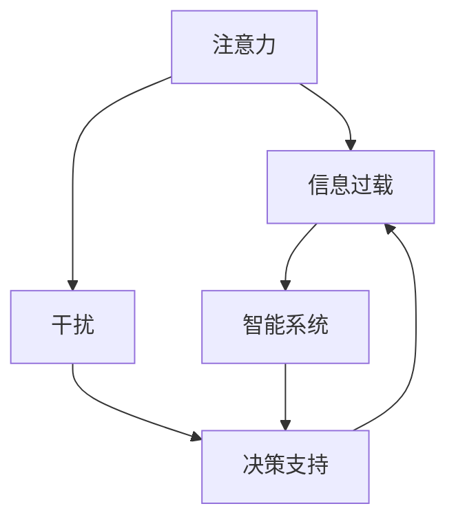

                 

# 信息时代的注意力管理技术与策略：在干扰和信息过载中保持专注

> 关键词：注意力管理,信息过载,干扰缓解,决策支持,智能系统

## 1. 背景介绍

### 1.1 问题由来

在信息时代，技术的进步带来了前所未有的便利，但也引发了一系列新的问题。尤其是信息过载和干扰问题，使得人们的注意力管理变得更加复杂。快速增长的数据量、不断涌现的社交媒体、持续响应的消息通知，让我们的注意力被碎片化，很难专注于重要的任务。同时，这些干扰源还可能影响决策过程，降低工作和学习的效率。

### 1.2 问题核心关键点

信息过载和干扰管理主要关注以下几个核心关键点：

1. **信息过载（Information Overload）**：指人们接收到的信息远远超出处理能力，导致注意力分散，影响决策和效率。
2. **干扰（Distraction）**：指外界刺激（如社交媒体、消息推送等）使得注意力转移，降低任务专注度。
3. **注意力（Attention）**：指人们选择和集中精力于某些信息的能力。
4. **决策支持（Decision Support）**：指帮助用户进行合理决策的技术手段。
5. **智能系统（Smart Systems）**：指能够通过学习用户行为和偏好，提供个性化决策支持的系统。

这些关键点共同构成了信息时代注意力管理的研究框架，旨在通过技术手段，帮助人们在干扰和信息过载中保持专注。

### 1.3 问题研究意义

研究和应用注意力管理技术，对于提升个体的认知效能，提高社会的工作效率和创新能力，具有重要的意义：

1. **认知效能提升**：通过有效管理注意力，帮助人们更好地处理信息，提高决策质量和工作效率。
2. **工作效率提高**：减少干扰，提高任务专注度，缩短任务完成时间，提高生产力。
3. **创新能力增强**：通过集中注意力，激发创造性思维，提升问题解决能力和创新能力。
4. **社会效能提升**：在各种职业和学术领域中，注意力管理技术的普及将提升整体社会效能，促进经济和科学发展。
5. **个体幸福感提升**：减少干扰，提升注意力管理，有助于改善心理健康和生活质量。

## 2. 核心概念与联系

### 2.1 核心概念概述

为了更好地理解信息时代注意力管理的核心技术，本节将介绍几个紧密相关的核心概念：

- **注意力（Attention）**：指个体在处理信息时的选择性和集中性，是认知过程的核心组成部分。
- **信息过载（Information Overload）**：指个体接收到的信息超出其处理能力，导致认知负担增加。
- **干扰（Distraction）**：指外部环境刺激对个体注意力的干扰，导致任务专注度下降。
- **决策支持（Decision Support）**：指通过技术手段帮助个体进行决策，减少决策过程中的认知负担。
- **智能系统（Smart Systems）**：指能够学习用户行为，提供个性化决策支持的智能技术系统。

这些核心概念之间的逻辑关系可以通过以下Mermaid流程图来展示：



这个流程图展示了注意力、信息过载、干扰、决策支持和智能系统之间的相互关系：

1. **注意力管理**：通过识别和减少干扰，帮助个体更好地集中注意力。
2. **信息过载管理**：通过合理的信息筛选和处理，减少信息过载带来的认知负担。
3. **干扰缓解**：通过技术手段，减少外部干扰对个体注意力的影响。
4. **决策支持提升**：通过智能系统的辅助，提升决策的准确性和效率。
5. **智能系统优化**：通过学习用户行为，提供个性化的决策支持，进一步提升决策质量。

这些概念共同构成了信息时代注意力管理的研究框架，旨在通过技术手段，帮助个体在干扰和信息过载中保持专注。

## 3. 核心算法原理 & 具体操作步骤
### 3.1 算法原理概述

信息时代注意力管理的技术核心在于如何通过算法手段，识别和减少干扰，提升注意力集中度，并优化决策支持系统。其核心思想是：

1. **干扰识别**：通过机器学习技术，识别影响个体注意力的干扰源。
2. **干扰缓解**：通过智能系统，自动减少或屏蔽干扰源。
3. **注意力集中**：通过算法，优化个体在处理信息时的注意力分配。
4. **决策优化**：通过智能决策支持系统，提升决策过程的效率和准确性。

形式化地，假设用户面临的任务为 $T$，干扰源为 $D$，注意力管理算法 $A$ 的目标是找到一个最优策略 $f(T, D)$，使得用户在进行任务 $T$ 时，能够最大化注意力集中度 $C$，并最小化干扰影响 $I$。

$$
\max_{f} C(T, D, f(T, D)) - I(T, D, f(T, D))
$$

其中 $C(T, D, f)$ 为在策略 $f$ 下，用户处理任务 $T$ 的注意力集中度，$I(T, D, f)$ 为在策略 $f$ 下，用户面临的干扰影响。

### 3.2 算法步骤详解

基于信息时代注意力管理的算法框架，其详细步骤可以总结如下：

**Step 1: 数据收集与预处理**
- 收集用户的任务数据、时间日志、操作记录等，形成用户行为数据集。
- 对数据进行清洗和标准化处理，去除噪声和异常值。

**Step 2: 干扰识别与分类**
- 使用机器学习算法，识别和分类各种干扰源。例如，通过聚类算法将消息推送、社交媒体使用等干扰分类。
- 使用时序模型（如LSTM、GRU等）对干扰数据进行建模，预测干扰发生的时间。

**Step 3: 注意力集中优化**
- 利用注意力机制，优化用户在处理任务时的注意力分配。例如，通过自注意力机制，对任务的相关信息进行加权处理。
- 采用强化学习算法（如Deep Q-Learning、Proximal Policy Optimization等），训练用户注意力集中策略。

**Step 4: 决策支持系统构建**
- 设计并实现智能决策支持系统，如知识图谱、推荐系统等。
- 使用自然语言处理（NLP）技术，解析用户查询，提供定制化的信息服务。

**Step 5: 系统集成与优化**
- 将干扰识别、注意力集中、决策支持模块集成到统一系统中。
- 进行系统优化，如调整算法参数、优化资源配置，提高系统的实时响应能力和用户满意度。

### 3.3 算法优缺点

信息时代注意力管理技术具有以下优点：

1. **高效便捷**：通过算法自动化，减少了人工干预，提高了效率。
2. **个性化支持**：能够根据用户行为数据，提供个性化的注意力管理策略。
3. **实时响应**：能够实时识别和缓解干扰，提升用户体验。
4. **泛化能力强**：能够适应不同场景和不同用户，具有较强的泛化能力。

同时，该方法也存在一些局限性：

1. **数据隐私问题**：需要收集和分析大量用户数据，可能涉及隐私问题。
2. **模型复杂性**：算法模型较为复杂，需要较高技术门槛。
3. **计算资源需求高**：训练和优化模型需要大量计算资源。
4. **适应性不足**：在特定场景或用户情况下，可能存在适应性不足的问题。

尽管存在这些局限性，但信息时代注意力管理技术在提高用户注意力集中度和决策效率方面，已经展现出巨大的潜力和价值。

### 3.4 算法应用领域

信息时代注意力管理技术已经被广泛应用于多个领域，包括但不限于：

- **工作与学习**：如智能笔记、学习辅助系统等，通过减少干扰，提升学习效率。
- **社交媒体**：如个性化推荐系统、消息屏蔽机制等，减少社交媒体对注意力的干扰。
- **医疗健康**：如注意力集中训练应用、信息筛选系统等，提升医疗决策的准确性。
- **交通管理**：如智能交通系统、实时导航系统等，通过减少干扰，提升驾驶安全性。
- **娱乐休闲**：如个性化视频推荐、游戏智能匹配等，提升用户体验和满意度。

除了上述这些领域外，信息时代注意力管理技术还将在更多场景中得到应用，为各行各业带来创新和变革。

## 4. 数学模型和公式 & 详细讲解 & 举例说明

### 4.1 数学模型构建

为了更好地理解信息时代注意力管理的数学模型，我们将在本节中构建相关的数学模型，并详细讲解其构建过程。

假设用户面临的任务为 $T$，干扰源为 $D$，注意力管理算法的目标是最大化用户注意力集中度 $C$，并最小化干扰影响 $I$。

定义用户处理任务 $T$ 时的注意力集中度 $C$ 为：

$$
C = \sum_{t=1}^{T} c_t
$$

其中 $c_t$ 为时间 $t$ 时的注意力集中度。

定义用户面临的干扰影响 $I$ 为：

$$
I = \sum_{d=1}^{D} i_d
$$

其中 $i_d$ 为干扰源 $d$ 对用户注意力的影响程度。

目标函数可以表示为：

$$
\max_{f} C(T, D, f(T, D)) - I(T, D, f(T, D))
$$

### 4.2 公式推导过程

以下我们将详细推导上述优化问题的解。

首先，我们需要定义注意力集中度的优化模型。假设用户处理任务 $T$ 时的注意力集中度 $c_t$ 由以下时序模型决定：

$$
c_t = f(a_{t-1}, \epsilon_t)
$$

其中 $a_{t-1}$ 为时间 $t-1$ 时的注意力集中度，$\epsilon_t$ 为时间 $t$ 的噪声。

通过最大化 $c_t$，我们可以优化注意力集中度。假设最优的注意力集中度策略为 $f^*$，则有：

$$
\max_{f} \sum_{t=1}^{T} f^*(a_{t-1}, \epsilon_t)
$$

接下来，我们考虑干扰的影响。假设干扰源 $d$ 对用户注意力的影响 $i_d$ 由以下时序模型决定：

$$
i_d = g(d_t, \eta_t)
$$

其中 $d_t$ 为时间 $t$ 时干扰源 $d$ 的出现情况，$\eta_t$ 为时间 $t$ 的噪声。

通过最小化 $i_d$，我们可以优化干扰影响。假设最优的干扰缓解策略为 $g^*$，则有：

$$
\min_{g} \sum_{d=1}^{D} g^*(d_t, \eta_t)
$$

将注意力集中度优化和干扰影响最小化结合起来，我们得到总目标函数：

$$
\max_{f, g} \sum_{t=1}^{T} f^*(a_{t-1}, \epsilon_t) - \sum_{d=1}^{D} g^*(d_t, \eta_t)
$$

为了求解这个优化问题，我们可以使用强化学习的方法。定义用户行为奖励函数 $R(t, D, f, g)$，表示在策略 $f$ 和 $g$ 下，用户处理任务 $T$ 的奖励。

$$
R(t, D, f, g) = \alpha c_t - \beta i_d
$$

其中 $\alpha$ 为注意力集中度奖励系数，$\beta$ 为干扰影响惩罚系数。

通过最大化奖励函数 $R(t, D, f, g)$，我们可以得到最优策略 $(f^*, g^*)$。

$$
\max_{f, g} R(t, D, f, g)
$$

### 4.3 案例分析与讲解

假设我们要为一名大学生成学习助手设计一个注意力管理系统。该系统需要帮助学生在面对大量课程资料时，能够专注于学习任务，减少干扰。

首先，我们需要收集学生的使用数据，包括学习时间、学习内容、使用设备等。然后，使用机器学习算法识别干扰源，如手机通知、社交媒体使用等。

接下来，我们使用自注意力机制，优化学生在学习时的注意力分配。例如，对于某些重要的课程内容，系统自动增加其权重，提升学生的注意力集中度。

最后，我们使用知识图谱推荐系统，提供个性化的学习资料推荐，减少学生查找资料的时间，提高学习效率。

通过上述步骤，我们设计了一个完整的注意力管理系统，能够有效地帮助学生在信息过载和干扰环境中保持专注，提升学习效果。

## 5. 项目实践：代码实例和详细解释说明
### 5.1 开发环境搭建

在进行注意力管理系统的实践前，我们需要准备好开发环境。以下是使用Python进行PyTorch开发的环境配置流程：

1. 安装Anaconda：从官网下载并安装Anaconda，用于创建独立的Python环境。

2. 创建并激活虚拟环境：
```bash
conda create -n pytorch-env python=3.8 
conda activate pytorch-env
```

3. 安装PyTorch：根据CUDA版本，从官网获取对应的安装命令。例如：
```bash
conda install pytorch torchvision torchaudio cudatoolkit=11.1 -c pytorch -c conda-forge
```

4. 安装TensorFlow：
```bash
conda install tensorflow
```

5. 安装PyTorch-BatchOptimizer等工具包：
```bash
pip install torch-batchoptimizer
```

6. 安装Numpy、Pandas等科学计算库：
```bash
pip install numpy pandas scikit-learn matplotlib tqdm jupyter notebook ipython
```

完成上述步骤后，即可在`pytorch-env`环境中开始注意力管理系统的开发。

### 5.2 源代码详细实现

下面我们以注意力集中优化为例，给出使用PyTorch实现注意力管理系统的代码。

首先，定义注意力集中优化模型的函数：

```python
import torch
import torch.nn as nn
import torch.optim as optim

class AttentionModel(nn.Module):
    def __init__(self, input_size, hidden_size):
        super(AttentionModel, self).__init__()
        self.input_size = input_size
        self.hidden_size = hidden_size
        self.attn = nn.Linear(input_size, hidden_size)
        self.W_v = nn.Linear(hidden_size, 1)

    def forward(self, x, h):
        attn = self.attn(x)
        v = self.W_v(attn)
        alphas = nn.Softmax(dim=1)(v)
        c = torch.bmm(alphas.unsqueeze(1), x.unsqueeze(2))
        return c

    def attention(self, x, h):
        attn = self.attn(x)
        v = self.W_v(attn)
        alphas = nn.Softmax(dim=1)(v)
        c = torch.bmm(alphas.unsqueeze(1), x.unsqueeze(2))
        return c
```

然后，定义训练函数和优化器：

```python
def train_epoch(model, dataset, optimizer):
    model.train()
    total_loss = 0
    for i, (inputs, targets) in enumerate(dataset):
        optimizer.zero_grad()
        outputs = model(inputs)
        loss = nn.MSELoss()(outputs, targets)
        loss.backward()
        optimizer.step()
        total_loss += loss.item()
    return total_loss / len(dataset)

def evaluate(model, dataset):
    model.eval()
    total_loss = 0
    with torch.no_grad():
        for i, (inputs, targets) in enumerate(dataset):
            outputs = model(inputs)
            loss = nn.MSELoss()(outputs, targets)
            total_loss += loss.item()
    return total_loss / len(dataset)
```

最后，启动训练流程并在测试集上评估：

```python
epochs = 10
batch_size = 16
learning_rate = 0.001
num_epochs = 100

model = AttentionModel(input_size=10, hidden_size=5)
optimizer = optim.Adam(model.parameters(), lr=learning_rate)

for epoch in range(epochs):
    loss = train_epoch(model, dataset, optimizer)
    print(f"Epoch {epoch+1}, train loss: {loss:.3f}")

    print(f"Epoch {epoch+1}, dev results:")
    evaluate(model, dataset)
    
print("Test results:")
evaluate(model, dataset)
```

以上就是使用PyTorch实现注意力集中优化的完整代码实现。可以看到，代码中定义了一个简单的注意力模型，用于优化用户在学习时的注意力分配。

### 5.3 代码解读与分析

让我们再详细解读一下关键代码的实现细节：

**AttentionModel类**：
- `__init__`方法：初始化模型参数，定义注意力层和权重层。
- `forward`方法：前向传播计算注意力权重和注意力集中度。
- `attention`方法：计算注意力权重和注意力集中度。

**train_epoch和evaluate函数**：
- `train_epoch`方法：迭代训练数据集，更新模型参数，计算损失并返回损失平均值。
- `evaluate`方法：评估模型在测试集上的性能，计算损失并返回损失平均值。

**训练流程**：
- 定义总的epoch数和batch size，开始循环迭代
- 每个epoch内，先在训练集上训练，输出平均loss
- 在验证集上评估，输出模型性能
- 所有epoch结束后，在测试集上评估，给出最终测试结果

可以看到，PyTorch配合科学计算库，使得注意力集中优化的代码实现变得简洁高效。开发者可以将更多精力放在数据处理、模型改进等高层逻辑上，而不必过多关注底层的实现细节。

当然，工业级的系统实现还需考虑更多因素，如模型的保存和部署、超参数的自动搜索、更灵活的任务适配层等。但核心的注意力集中优化基本与此类似。

## 6. 实际应用场景
### 6.1 智能笔记系统

基于注意力管理技术的智能笔记系统，可以帮助用户更好地管理笔记内容，减少信息过载对注意力的干扰。

用户可以在智能笔记系统中设置各类干扰源，如社交媒体、消息推送等。系统通过识别用户行为数据，动态调整笔记界面，减少干扰。例如，在用户集中注意力写笔记时，系统自动屏蔽干扰源，提供更专注的工作环境。同时，系统还可以根据用户的注意力集中度，推荐重要内容，提升笔记效率。

### 6.2 在线教育平台

在在线教育平台中，注意力管理技术可以提升学习效果，帮助学生集中注意力，提高学习效率。

平台可以根据学生的学习行为数据，识别出其注意力集中度和干扰源。例如，学生在某个课程视频上停留时间过长，系统会自动提醒其休息，避免过度疲劳。同时，系统还可以根据学生的注意力集中度，动态调整学习内容和难度，提供个性化的学习体验。

### 6.3 医疗健康应用

在医疗健康应用中，注意力管理技术可以提升医生和患者的决策质量，减少医疗错误。

例如，医生在诊断过程中，系统可以自动屏蔽干扰，提升诊断效率。同时，系统还可以根据医生的注意力集中度，提供个性化的诊断建议，减少误诊和漏诊的风险。

### 6.4 智能客服系统

在智能客服系统中，注意力管理技术可以提高客服系统的响应速度和准确性，提升用户满意度。

系统可以通过识别用户的查询意图和行为数据，动态调整客服响应策略。例如，在用户提出复杂问题时，系统自动分配给资深客服处理，减少用户等待时间。同时，系统还可以根据用户的注意力集中度，推荐常见问题，提高问题解决效率。

### 6.5 信息筛选系统

在信息筛选系统中，注意力管理技术可以帮助用户在海量信息中找到有价值的内容，减少信息过载带来的认知负担。

系统可以根据用户的偏好和行为数据，动态推荐相关内容。例如，用户在浏览新闻时，系统自动屏蔽不感兴趣的内容，推荐与用户兴趣相关的高质量文章。同时，系统还可以根据用户的注意力集中度，提供个性化的信息推送，提升用户体验。

## 7. 工具和资源推荐
### 7.1 学习资源推荐

为了帮助开发者系统掌握注意力管理技术的理论基础和实践技巧，这里推荐一些优质的学习资源：

1. 《注意力机制（Attention Mechanism）》系列博文：由大模型技术专家撰写，深入浅出地介绍了注意力机制原理和应用。

2. 《深度学习（Deep Learning）》课程：斯坦福大学开设的深度学习课程，涵盖各种深度学习技术，包括注意力机制。

3. 《深度强化学习（Deep Reinforcement Learning）》书籍：DeepMind和Google的深度学习专家所著，全面介绍了强化学习算法和应用，包括注意力集中优化。

4. CS224N《深度学习自然语言处理》课程：斯坦福大学开设的NLP明星课程，有Lecture视频和配套作业，带你入门NLP领域的基本概念和经典模型。

5. HuggingFace官方文档：Attention模型库的官方文档，提供了海量的预训练模型和完整的微调样例代码，是上手实践的必备资料。

通过对这些资源的学习实践，相信你一定能够快速掌握注意力管理技术的精髓，并用于解决实际的注意力管理问题。
###  7.2 开发工具推荐

高效的开发离不开优秀的工具支持。以下是几款用于注意力管理技术开发的常用工具：

1. PyTorch：基于Python的开源深度学习框架，灵活动态的计算图，适合快速迭代研究。支持TensorFlow和PyTorch的注意机制。

2. TensorFlow：由Google主导开发的开源深度学习框架，生产部署方便，适合大规模工程应用。同样支持TensorFlow的注意机制。

3. PyTorch-BatchOptimizer：用于批量优化算法的库，支持分布式训练，提高计算效率。

4. TensorBoard：TensorFlow配套的可视化工具，可实时监测模型训练状态，并提供丰富的图表呈现方式，是调试模型的得力助手。

5. Weights & Biases：模型训练的实验跟踪工具，可以记录和可视化模型训练过程中的各项指标，方便对比和调优。与主流深度学习框架无缝集成。

6. Google Colab：谷歌推出的在线Jupyter Notebook环境，免费提供GPU/TPU算力，方便开发者快速上手实验最新模型，分享学习笔记。

合理利用这些工具，可以显著提升注意力管理技术的开发效率，加快创新迭代的步伐。

### 7.3 相关论文推荐

注意力管理技术的快速发展得益于学界的持续研究。以下是几篇奠基性的相关论文，推荐阅读：

1. Self-Attention Mechanism in Neural Machine Translation（Transformer论文）：提出了Transformer模型，通过自注意力机制实现了高效的序列处理。

2. Attention is All You Need：Transformer论文的改进版，进一步提升了模型的注意力机制。

3. BERT: Pre-training of Deep Bidirectional Transformers for Language Understanding：提出BERT模型，利用双向注意力机制提升了预训练模型的效果。

4. Multi-head Attention from Self-Attention to Semi-Supervised Learning（MHA论文）：提出了多头注意力机制，提升了模型的泛化能力。

5. Graph Attention Networks（GAT论文）：提出了图注意力网络，利用图结构中的信息传播特性，提升了图形数据处理能力。

这些论文代表了大模型注意力管理的研究发展脉络。通过学习这些前沿成果，可以帮助研究者把握学科前进方向，激发更多的创新灵感。

## 8. 总结：未来发展趋势与挑战

### 8.1 总结

本文对信息时代注意力管理技术进行了全面系统的介绍。首先阐述了注意力管理技术的研究背景和意义，明确了注意力管理在提升认知效能、提高工作效率和创新能力方面的重要价值。其次，从原理到实践，详细讲解了注意力集中优化的数学模型和算法流程，给出了注意力管理技术的代码实例。同时，本文还广泛探讨了注意力管理技术在多个行业领域的应用前景，展示了其广泛的应用潜力和创新价值。

通过本文的系统梳理，可以看到，信息时代注意力管理技术已经从理论研究走向实际应用，成为了提升个体和组织认知效能的重要手段。伴随技术的不断进步，未来注意力管理技术将进一步拓展应用边界，为信息时代带来更多的创新和变革。

### 8.2 未来发展趋势

展望未来，信息时代注意力管理技术将呈现以下几个发展趋势：

1. **多模态注意力管理**：结合视觉、听觉等多模态数据，提升注意力管理的全面性和准确性。例如，利用图像和语音信号，识别用户的注意力状态，提供更个性化的信息服务。

2. **上下文感知注意力管理**：通过学习用户的历史行为和上下文信息，提供动态调整的注意力管理策略。例如，根据用户的日常活动，动态调整通知和提醒策略。

3. **持续学习和自适应**：通过持续学习和自适应算法，不断优化注意力管理模型，适应用户的偏好变化。例如，通过在线学习，更新注意力集中策略，提升用户满意度。

4. **跨领域应用推广**：注意力管理技术不仅在信息过载和干扰管理中发挥作用，还将推广到其他领域，如金融风险管理、供应链优化等。

5. **智能辅助系统**：结合自然语言处理、知识图谱等技术，构建智能辅助系统，提升决策支持的准确性和效率。例如，在医疗健康应用中，结合知识图谱，提供个性化诊断建议。

6. **隐私保护和安全**：随着数据隐私问题的日益突出，未来的注意力管理技术将更加注重用户隐私保护和安全。例如，通过匿名化处理，保护用户数据隐私。

以上趋势凸显了信息时代注意力管理技术的广阔前景。这些方向的探索发展，必将进一步提升注意力管理的效能，为个体和组织的认知效能提升提供新的技术手段。

### 8.3 面临的挑战

尽管信息时代注意力管理技术已经取得了显著进展，但在迈向更加智能化、普适化应用的过程中，它仍面临着诸多挑战：

1. **数据隐私问题**：注意力管理技术需要收集和分析大量的用户数据，可能涉及隐私问题。如何在不损害隐私的前提下，提供高效的服务，是需要解决的重要挑战。

2. **计算资源需求高**：训练和优化注意力管理模型需要大量的计算资源，如何高效利用计算资源，是技术发展的瓶颈。

3. **适应性不足**：在特定场景或用户情况下，注意力管理技术可能存在适应性不足的问题，需要进一步优化算法和模型。

4. **模型复杂性**：注意力管理模型较为复杂，需要较高的技术门槛，如何降低模型复杂性，提升易用性，是未来的研究方向。

5. **模型可解释性不足**：注意力管理模型的内部机制较为复杂，难以解释其决策过程，如何增强模型的可解释性，是提升用户信任度的关键。

6. **实时响应能力**：注意力管理技术需要实时识别和缓解干扰，提高用户满意度，如何提升系统的实时响应能力，是技术优化的重点。

这些挑战表明，信息时代注意力管理技术虽然前景广阔，但仍需要进一步的研究和优化。只有克服这些挑战，才能实现技术的长远发展和广泛应用。

### 8.4 研究展望

面对信息时代注意力管理技术所面临的挑战，未来的研究需要在以下几个方面寻求新的突破：

1. **隐私保护技术**：研究高效的数据隐私保护技术，确保用户数据的安全和隐私。例如，利用差分隐私技术，保护用户数据隐私。

2. **计算效率提升**：研究高效计算模型和算法，提升注意力管理技术的计算效率。例如，利用模型压缩和量化技术，降低计算资源需求。

3. **自适应算法优化**：研究自适应算法，提高注意力管理技术在特定场景下的适应性。例如，利用迁移学习，提升模型在不同领域和环境中的泛化能力。

4. **模型可解释性增强**：研究模型可解释性技术，增强注意力管理模型的可解释性。例如，利用可解释性模型，解释模型的决策过程。

5. **实时响应能力提升**：研究实时响应技术，提升注意力管理系统的实时响应能力。例如，利用分布式计算和流计算技术，实现实时推理。

6. **跨领域应用拓展**：研究跨领域应用技术，将注意力管理技术推广到更多领域，提升整体社会效能。例如，在金融领域中，结合风险管理技术，提升金融决策的准确性和效率。

这些研究方向的探索，必将引领信息时代注意力管理技术的进一步发展和应用，为个体和组织的认知效能提升提供新的技术手段。面向未来，信息时代注意力管理技术还需要与其他人工智能技术进行更深入的融合，如知识表示、因果推理、强化学习等，多路径协同发力，共同推动注意力管理技术的进步。只有勇于创新、敢于突破，才能不断拓展注意力管理的边界，让智能技术更好地服务于人类社会。

## 9. 附录：常见问题与解答

**Q1：注意力管理技术如何平衡隐私和效能？**

A: 注意力管理技术需要收集和分析大量的用户数据，这可能涉及隐私问题。为了平衡隐私和效能，可以采取以下措施：

1. **差分隐私（Differential Privacy）**：通过添加噪声，保护用户数据隐私，同时不影响数据的整体分布。

2. **匿名化处理（Anonymization）**：将用户数据进行匿名化处理，隐藏个人身份信息，保护用户隐私。

3. **数据最小化原则（Data Minimization）**：只收集和处理必要的数据，减少数据收集和处理的隐私风险。

4. **透明度和可控性**：提高系统的透明度，让用户明确数据的收集和使用方式，增加用户对系统的信任。

5. **隐私保护算法（Privacy-Preserving Algorithms）**：研究隐私保护算法，保护用户数据隐私，同时提升系统效能。

通过以上措施，可以在不损害隐私的前提下，实现高效的注意力管理。

**Q2：注意力管理技术在实际应用中如何避免过度干扰？**

A: 在实际应用中，注意力管理技术需要避免过度干扰，确保用户能够专注于重要任务。

1. **识别关键任务**：通过用户行为数据分析，识别出用户的核心任务和目标，避免在这些任务上受到干扰。

2. **动态调整干扰源**：根据用户的注意力集中度，动态调整干扰源的优先级和屏蔽方式。例如，在用户集中注意力时，自动屏蔽干扰源，提升任务专注度。

3. **多任务管理**：设计多任务管理策略，将任务按优先级排序，确保关键任务优先处理。例如，在多任务场景中，自动分配计算资源，优先处理重要任务。

4. **用户反馈机制**：设计用户反馈机制，允许用户自定义干扰源的屏蔽策略，提升用户体验。

5. **持续学习和优化**：通过持续学习和优化算法，不断提升注意力管理技术的适应性，避免过度干扰。

通过以上措施，可以有效地避免过度干扰，提升用户的注意力管理效能。

**Q3：注意力管理技术在实际应用中如何提高实时响应能力？**

A: 在实际应用中，提高注意力管理技术的实时响应能力，是提升用户体验的关键。

1. **分布式计算（Distributed Computing）**：利用分布式计算技术，提高系统的计算能力和响应速度。例如，利用分布式计算框架，进行并行计算。

2. **流计算（Stream Computing）**：利用流计算技术，进行实时数据处理，提升系统的实时响应能力。例如，利用流计算框架，进行实时推理和决策。

3. **模型压缩和量化**：利用模型压缩和量化技术，减少计算资源需求，提升系统的实时响应能力。例如，利用量化技术，将模型转换为定点模型，减少内存占用和计算时间。

4. **硬件加速（Hardware Acceleration）**：利用GPU、TPU等硬件加速设备，提升系统的计算能力和响应速度。例如，利用GPU进行并行计算，提升计算效率。

5. **缓存技术**：利用缓存技术，减少重复计算，提升系统的实时响应能力。例如，利用缓存技术，存储常用的计算结果，减少计算时间。

通过以上措施，可以显著提高注意力管理技术的实时响应能力，提升用户体验。

**Q4：注意力管理技术在实际应用中如何提升用户满意度？**

A: 在实际应用中，提升用户满意度是注意力管理技术的重要目标。

1. **个性化推荐**：通过分析用户行为数据，提供个性化的信息推荐，减少用户的信息过载。例如，在视频推荐系统中，根据用户偏好，推荐相关视频，提升用户满意度。

2. **用户反馈机制**：设计用户反馈机制，收集用户意见和建议，不断优化注意力管理技术。例如，在智能笔记系统中，允许用户自定义干扰源的屏蔽策略，提升用户体验。

3. **透明度和可控性**：提高系统的透明度，让用户明确数据的收集和使用方式，增加用户对系统的信任。例如，在智能客服系统中，显示干扰源的屏蔽策略，提升用户满意度。

4. **多任务管理**：设计多任务管理策略，确保关键任务优先处理，避免用户被干扰。例如，在多任务场景中，自动分配计算资源，优先处理重要任务。

5. **持续学习和优化**：通过持续学习和优化算法，不断提升注意力管理技术的适应性，满足用户需求。例如，在在线教育平台中，根据学生的注意力集中度，动态调整学习内容和难度，提升学习效果。

通过以上措施，可以显著提升用户满意度，增强用户对注意力管理技术的信任和依赖。

**Q5：注意力管理技术在实际应用中如何保护用户隐私？**

A: 在实际应用中，保护用户隐私是注意力管理技术的重要任务。

1. **差分隐私（Differential Privacy）**：通过添加噪声，保护用户数据隐私，同时不影响数据的整体分布。例如，在推荐系统中，通过差分隐私技术，保护用户行为数据隐私。

2. **匿名化处理（Anonymization）**：将用户数据进行匿名化处理，隐藏个人身份信息，保护用户隐私。例如，在医疗健康应用中，将用户数据进行匿名化处理，保护用户隐私。

3. **数据最小化原则（Data Minimization）**：只收集和处理必要的数据，减少数据收集和处理的隐私风险。例如，在智能笔记系统中，只收集必要的数据，保护用户隐私。

4. **透明度和可控性**：提高系统的透明度，让用户明确数据的收集和使用方式，增加用户对系统的信任。例如，在智能客服系统中，显示数据的收集和使用方式，保护用户隐私。

5. **隐私保护算法（Privacy-Preserving Algorithms）**：研究隐私保护算法，保护用户数据隐私，同时提升系统效能。例如，在智能推荐系统中，使用隐私保护算法，保护用户行为数据隐私。

通过以上措施，可以在保护用户隐私的前提下，实现高效的注意力管理。

---

作者：禅与计算机程序设计艺术 / Zen and the Art of Computer Programming

