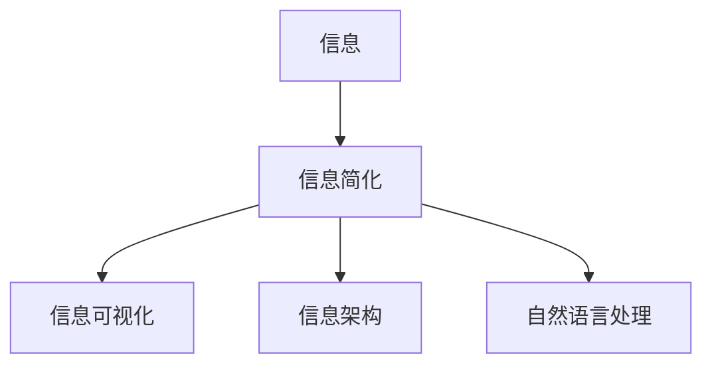

                 

# 信息简化的原则与艺术：在混乱中建立秩序与简化

## 1. 背景介绍

### 1.1 问题由来
随着信息技术的快速发展和互联网的普及，我们正处于一个信息爆炸的时代。海量的数据和信息给人们的生活带来了便利，同时也带来了新的挑战。在这样一个信息纷繁复杂的环境中，如何有效筛选、整理和简化信息，成为了当前信息管理和处理的一个核心问题。

### 1.2 问题核心关键点
信息简化不仅是一个技术问题，更是一个艺术问题。它要求我们能够以用户为中心，以内容为王，在处理和展示信息时，通过去除冗余、突出重点、引导关注，为用户呈现更加清晰、直观、易懂的视图，从而提升用户的体验和满意度。

### 1.3 问题研究意义
信息简化技术在信息处理、数据管理、用户体验设计等领域具有重要意义：

1. **提升信息效率**：通过去除冗余信息，提高信息检索和处理的速度，提升工作效率。
2. **改善用户体验**：简化的信息更容易理解和操作，能显著提升用户的使用体验。
3. **优化资源配置**：在信息存储和传输中，简化可以减少资源占用，降低成本。
4. **推动创新发展**：信息简化技术能够激发更多创新，驱动信息处理和应用的新方向。

## 2. 核心概念与联系

### 2.1 核心概念概述

要深入理解信息简化的原则与艺术，首先需要了解几个关键概念：

- **信息简化**：指通过技术手段，去除冗余信息，突出重点内容，提升信息的质量和可理解性。
- **信息可视化**：通过图形、图表等方式，将信息以视觉形式呈现，使复杂信息变得易理解。
- **信息架构**：规划和组织信息内容的结构，使之逻辑清晰、易于导航。
- **自然语言处理**：利用计算机对文本信息进行自动化处理，包括文本摘要、自动分类等。

### 2.2 核心概念原理和架构的 Mermaid 流程图



这个流程图展示了信息简化与其他核心概念之间的联系：

1. **A(信息) --> B(信息简化)**：原始信息经过简化，去除了冗余内容，保留了重要信息。
2. **B(信息简化) --> C(信息可视化)**：简化的信息通过图表、图标等方式进行视觉呈现，更加直观。
3. **B(信息简化) --> D(信息架构)**：简化的信息在良好的信息架构下，逻辑清晰，易于导航。
4. **B(信息简化) --> E(自然语言处理)**：简化的信息通过自然语言处理技术，可以自动化进行摘要、分类等操作。

这些概念和技术的相互融合，构成了信息简化的完整框架，帮助我们从多个角度提升信息的质量和可理解性。

## 3. 核心算法原理 & 具体操作步骤

### 3.1 算法原理概述

信息简化技术主要包括三个核心算法：信息筛选、信息聚合和信息呈现。

**信息筛选**：从原始信息中筛选出最有价值的内容。

**信息聚合**：将筛选出的信息进行汇总、归类，形成逻辑清晰、易于理解的视图。

**信息呈现**：通过图形、图表等方式，将聚合后的信息直观展示给用户。

这三个步骤相辅相成，构成了一个完整的简化流程。

### 3.2 算法步骤详解

#### 3.2.1 信息筛选

**Step 1: 数据收集**
收集需要处理的信息，可以是文本、图像、音频等多种形式的数据。

**Step 2: 预处理**
对收集到的数据进行清洗、分词、去噪等预处理操作，去除无用信息和干扰项。

**Step 3: 特征提取**
利用算法提取数据中的关键特征，如文本中的关键词、情感极性等，为后续筛选提供依据。

**Step 4: 筛选规则设计**
根据业务需求和目标，设计信息筛选规则。可以使用规则引擎或机器学习模型，自动筛选出符合规则的信息。

**Step 5: 筛选执行**
根据筛选规则，对数据进行过滤，保留有价值的信息。

#### 3.2.2 信息聚合

**Step 1: 信息归类**
将筛选后的信息按照一定的分类标准进行归类，如按时间、地点、事件等进行分组。

**Step 2: 信息汇总**
对同组的信息进行汇总，提炼出核心内容。例如，将同一段时间内的信息进行聚合，找出趋势和规律。

**Step 3: 信息排序**
根据用户需求和信息的重要性，对汇总后的信息进行排序。可以使用基于重要性、相关性的排序算法，如TF-IDF、PageRank等。

**Step 4: 信息摘要**
对汇总和排序后的信息进行摘要，提炼出主要内容。可以使用自动摘要算法，如TextRank、Luhn算法等。

**Step 5: 信息呈现**
将聚合后的信息，以图表、报表、图形等方式呈现出来，直观展示信息内容。

#### 3.2.3 信息呈现

**Step 1: 选择展示方式**
根据信息类型和用户需求，选择合适的展示方式，如柱状图、折线图、散点图等。

**Step 2: 设计界面**
设计简洁、易用的界面，突出信息重点，降低用户的学习成本。

**Step 3: 交互设计**
增加交互功能，如缩放、筛选、过滤等，提升用户体验。

**Step 4: 测试优化**
对设计好的展示界面进行测试和优化，确保信息的准确性和易用性。

### 3.3 算法优缺点

#### 3.3.1 优点

1. **效率提升**：通过自动化信息处理，显著提高信息处理的速度。
2. **用户友好**：简化的信息更直观、易懂，提升用户体验。
3. **成本降低**：减少人工操作，降低人力成本。
4. **灵活性强**：可以针对不同场景，灵活调整信息简化策略。

#### 3.3.2 缺点

1. **数据丢失风险**：自动化筛选可能会误删重要信息，需要人为审查和校对。
2. **复杂性高**：信息简化的算法和规则设计较为复杂，需要一定的技术门槛。
3. **依赖于数据质量**：信息简化的效果高度依赖于原始数据的质量和完整性。

### 3.4 算法应用领域

信息简化技术广泛应用于以下领域：

- **新闻推荐**：根据用户兴趣和行为数据，对新闻信息进行筛选、聚合和呈现，提高推荐效果。
- **搜索引擎**：优化搜索结果的排序和摘要，提升用户搜索体验。
- **金融分析**：对金融市场数据进行筛选、分析和展示，辅助投资决策。
- **医疗诊断**：对患者病历和症状信息进行筛选和聚合，辅助医生诊断。
- **社交媒体**：对用户发布的内容进行筛选和展示，优化社交互动体验。

## 4. 数学模型和公式 & 详细讲解 & 举例说明

### 4.1 数学模型构建

信息简化的核心数学模型包括信息筛选模型、信息聚合模型和信息呈现模型。

**信息筛选模型**：利用算法对信息进行筛选和过滤，去除冗余和噪声。

**信息聚合模型**：对筛选后的信息进行汇总、排序和分类。

**信息呈现模型**：将聚合后的信息以视觉形式呈现，如图形、图表等。

### 4.2 公式推导过程

#### 4.2.1 信息筛选模型

假设原始信息集为 $D=\{d_1, d_2, ..., d_n\}$，筛选规则为 $R$，筛选后的信息集为 $D'$，则信息筛选模型可以表示为：

$$
D' = \{d_i | d_i \in D, R(d_i)\}
$$

其中 $R(d_i)$ 表示信息 $d_i$ 是否符合筛选规则 $R$。

#### 4.2.2 信息聚合模型

假设筛选后的信息集为 $D'=\{d_1', d_2', ..., d_m'\}$，信息聚合规则为 $A$，聚合后的信息集为 $D''$，则信息聚合模型可以表示为：

$$
D'' = \{(a_1', a_2', ..., a_k') | a_i' \in D', A(a_i')\}
$$

其中 $A(a_i')$ 表示信息片段 $a_i'$ 是否符合聚合规则 $A$。

#### 4.2.3 信息呈现模型

假设聚合后的信息集为 $D''=\{d_1'', d_2'', ..., d_l''\}$，信息呈现方式为 $V$，呈现后的信息集为 $D'''$，则信息呈现模型可以表示为：

$$
D''' = \{v_i | v_i \in V(d_j'')\}
$$

其中 $V(d_j'')$ 表示信息片段 $d_j''$ 以何种方式 $V$ 呈现。

### 4.3 案例分析与讲解

**案例：新闻推荐系统**

- **数据收集**：从不同新闻源收集新闻内容。
- **预处理**：去除无用标签、HTML标签，分词等。
- **信息筛选**：利用TF-IDF算法对新闻进行筛选，保留用户感兴趣的新闻。
- **信息聚合**：对筛选后的新闻按照时间、地域、类别进行分组和排序。
- **信息呈现**：以卡片、摘要等方式展示新闻内容，增加互动功能，如点赞、评论等。

## 5. 项目实践：代码实例和详细解释说明

### 5.1 开发环境搭建

为了实现信息简化的功能，需要搭建一个开发环境。以下是基本配置：

1. **安装Python**：
```bash
sudo apt-get update
sudo apt-get install python3
```

2. **安装Pip**：
```bash
sudo apt-get install python3-pip
```

3. **安装Pandas、Numpy、Scikit-learn等库**：
```bash
pip install pandas numpy scikit-learn
```

4. **安装TensorFlow**：
```bash
pip install tensorflow
```

5. **安装Matplotlib、Plotly等可视化库**：
```bash
pip install matplotlib plotly
```

### 5.2 源代码详细实现

以下是Python代码实现信息筛选和信息聚合的示例：

```python
import pandas as pd
import numpy as np
from sklearn.feature_extraction.text import TfidfVectorizer

# 模拟数据
data = pd.DataFrame({
    'title': ['新闻1', '新闻2', '新闻3', '新闻4', '新闻5'],
    'content': ['新闻内容1', '新闻内容2', '新闻内容3', '新闻内容4', '新闻内容5'],
    'category': ['体育', '娱乐', '科技', '娱乐', '体育']
})

# 信息筛选
tfidf = TfidfVectorizer()
tfidf_matrix = tfidf.fit_transform(data['content'])

# 计算TF-IDF得分
scores = np.array(tfidf_matrix.todense()).reshape(-1)

# 筛选出得分前3的新闻
filtered_data = data[scores.argsort()[-3:]].copy()

# 信息聚合
filtered_data['merged_content'] = filtered_data['content'].apply(lambda x: ' '.join(x.split()))
filtered_data['merged_category'] = filtered_data['category'].apply(lambda x: ''.join(x.split()))

# 显示筛选和聚合后的结果
filtered_data
```

### 5.3 代码解读与分析

**代码解读**：

1. **数据收集**：通过Pandas库创建模拟数据，包含新闻标题、内容和类别。
2. **信息筛选**：使用Scikit-learn库中的TfidfVectorizer进行TF-IDF计算，筛选出得分前3的新闻。
3. **信息聚合**：对筛选后的新闻内容进行合并，提取类别。
4. **展示结果**：输出筛选和聚合后的数据。

**代码分析**：

- **TF-IDF计算**：TF-IDF是一种常用的文本特征提取算法，用于衡量文本中词语的重要程度。
- **数据筛选**：通过TF-IDF得分排序，筛选出重要新闻。
- **信息合并**：将新闻内容合并为一句话，方便展示。
- **类别提取**：将类别字符串转换为单独的类别字段。

## 6. 实际应用场景

### 6.1 新闻推荐

信息简化的技术在新闻推荐系统中得到了广泛应用。通过筛选、聚合和呈现，用户能够快速获取到有价值的新闻信息，提升阅读体验。

**实际案例**：腾讯新闻

- **数据来源**：全球各大新闻源的新闻。
- **信息筛选**：基于用户兴趣和行为数据，筛选出相关新闻。
- **信息聚合**：按照时间、地域、类别进行分组和排序。
- **信息呈现**：以卡片、摘要等方式展示新闻，增加互动功能。

### 6.2 金融分析

在金融分析领域，信息简化技术能够帮助投资者快速获取和理解市场信息，辅助投资决策。

**实际案例**：雪球网

- **数据来源**：股票交易数据、公司财报、新闻等。
- **信息筛选**：根据用户兴趣和投资组合，筛选出相关新闻和财报。
- **信息聚合**：按照时间、公司、行业进行分组和排序。
- **信息呈现**：以报表、图表等方式展示市场趋势和公司业绩。

### 6.3 医疗诊断

在医疗诊断领域，信息简化技术能够帮助医生快速获取和理解患者病历和症状信息，辅助诊断。

**实际案例**：丁香园

- **数据来源**：患者病历、医学文献、医学报告等。
- **信息筛选**：根据患者症状和诊断要求，筛选出相关病历和文献。
- **信息聚合**：按照时间、病情、诊断结果进行分组和排序。
- **信息呈现**：以图形、图表等方式展示诊断趋势和病情变化。

## 7. 工具和资源推荐

### 7.1 学习资源推荐

为了帮助开发者掌握信息简化的技术，以下是一些优质的学习资源：

1. **《Python数据科学手册》**：介绍了Python在数据处理、可视化等方面的应用。
2. **《机器学习实战》**：涵盖了机器学习的基础知识，包括数据预处理、特征提取、模型训练等。
3. **《自然语言处理综论》**：介绍了自然语言处理的基本原理和技术，包括文本分类、情感分析、信息检索等。
4. **Kaggle**：提供大量公开数据集和竞赛，实践信息简化技术。
5. **Coursera**：提供多门信息处理和自然语言处理的在线课程，如斯坦福的《自然语言处理》课程。

### 7.2 开发工具推荐

为了实现信息简化的功能，推荐以下开发工具：

1. **Python**：灵活、高效的编程语言，适用于信息处理和数据分析。
2. **Pandas**：强大的数据处理和分析库，支持多种数据格式和数据操作。
3. **Scikit-learn**：机器学习库，提供多种特征提取和模型训练算法。
4. **TensorFlow**：深度学习框架，支持大规模模型训练和部署。
5. **Matplotlib**：绘图库，支持多种图表类型和自定义样式。

### 7.3 相关论文推荐

信息简化的技术发展得益于大量的学术研究。以下是几篇重要的相关论文：

1. **《信息检索中的向量空间模型》**：提出了向量空间模型，用于文本检索和信息分类。
2. **《基于TF-IDF的文本分类》**：介绍了TF-IDF算法，用于文本特征提取和分类。
3. **《自然语言处理中的神经网络》**：探讨了神经网络在自然语言处理中的应用，包括文本生成、情感分析等。

## 8. 总结：未来发展趋势与挑战

### 8.1 总结

信息简化技术在信息处理、数据管理、用户体验设计等领域具有重要意义。通过信息筛选、聚合和呈现，我们能够从混乱中建立秩序，提升信息的质量和可理解性，从而提升用户的体验和效率。

### 8.2 未来发展趋势

展望未来，信息简化技术将呈现以下几个发展趋势：

1. **自动化程度提升**：随着机器学习算法的进步，信息简化的自动化程度将进一步提升，减少人工干预。
2. **智能推荐系统**：结合个性化推荐算法，提供更加精准的信息推荐。
3. **多模态信息融合**：结合文本、图像、语音等多模态数据，提供更全面的信息服务。
4. **实时化处理**：利用实时数据流处理技术，实现实时信息筛选和呈现。
5. **智能化交互**：结合自然语言处理和语音识别技术，实现智能交互，提升用户体验。

### 8.3 面临的挑战

尽管信息简化技术取得了一定的进展，但在实际应用中仍然面临诸多挑战：

1. **数据质量问题**：原始数据质量的不确定性，可能影响信息简化的效果。
2. **算法复杂性**：信息简化的算法和规则设计较为复杂，需要较高的技术门槛。
3. **用户需求变化**：用户需求和兴趣的动态变化，需要持续优化信息简化的策略。
4. **隐私和伦理问题**：信息简化的过程中，涉及隐私保护和伦理问题，需要谨慎处理。

### 8.4 研究展望

未来，信息简化技术需要在以下几个方面进行深入研究：

1. **自动化和智能化**：进一步提升算法的自动化和智能化水平，减少人工干预。
2. **多模态信息融合**：探索多模态信息融合技术，提升信息服务的全面性。
3. **实时处理和推荐**：研究实时数据流处理和智能推荐算法，提供更加实时的信息服务。
4. **隐私和伦理**：在信息简化的过程中，充分考虑隐私保护和伦理问题，确保信息的合规使用。

总之，信息简化技术在信息处理和用户体验设计中具有重要意义。通过不断的技术创新和应用实践，相信我们能够更好地应对信息爆炸时代的挑战，提升信息的质量和效率，为用户带来更加优质的体验。

## 9. 附录：常见问题与解答

**Q1：信息简化技术对信息质量有什么影响？**

A: 信息简化技术通过去除冗余信息，提升信息的质量和可理解性，但同时也存在一定的风险，如误删重要信息。因此，在进行信息简化时，需要结合业务需求和用户反馈，合理设计筛选规则，进行人工审查和校对，确保信息的质量。

**Q2：信息简化的算法和规则如何设计？**

A: 信息简化的算法和规则设计需要考虑以下几个因素：

1. **业务需求**：根据业务目标和用户需求，设计筛选和聚合规则。
2. **数据质量**：评估数据质量，去除噪音和干扰项，提取有价值的信息。
3. **用户行为**：分析用户行为数据，提取常见需求和偏好，优化规则设计。
4. **技术手段**：结合机器学习和自然语言处理技术，提升筛选和聚合的自动化水平。

**Q3：信息简化的效果如何评估？**

A: 信息简化的效果评估可以从以下几个方面进行：

1. **准确性**：评估信息筛选的准确性，确保去除的冗余信息正确。
2. **完整性**：评估信息聚合的完整性，确保保留的核心内容完整。
3. **可用性**：评估信息呈现的可用性，确保信息的直观和易懂。
4. **用户反馈**：结合用户反馈，不断优化信息简化的策略和效果。

**Q4：信息简化的技术难点有哪些？**

A: 信息简化的技术难点主要包括以下几个方面：

1. **数据质量问题**：原始数据质量的不确定性，可能影响信息简化的效果。
2. **算法复杂性**：信息简化的算法和规则设计较为复杂，需要较高的技术门槛。
3. **用户需求变化**：用户需求和兴趣的动态变化，需要持续优化信息简化的策略。
4. **隐私和伦理问题**：信息简化的过程中，涉及隐私保护和伦理问题，需要谨慎处理。

**Q5：信息简化的未来方向有哪些？**

A: 信息简化的未来方向主要包括以下几个方面：

1. **自动化和智能化**：进一步提升算法的自动化和智能化水平，减少人工干预。
2. **多模态信息融合**：结合文本、图像、语音等多模态数据，提供更全面的信息服务。
3. **实时处理和推荐**：研究实时数据流处理和智能推荐算法，提供更加实时的信息服务。
4. **隐私和伦理**：在信息简化的过程中，充分考虑隐私保护和伦理问题，确保信息的合规使用。

总之，信息简化技术在信息处理和用户体验设计中具有重要意义。通过不断的技术创新和应用实践，相信我们能够更好地应对信息爆炸时代的挑战，提升信息的质量和效率，为用户带来更加优质的体验。

---

作者：禅与计算机程序设计艺术 / Zen and the Art of Computer Programming

