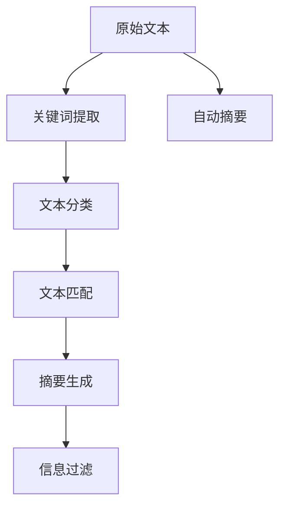

                 

# 信息简化的技巧和窍门：如何在混乱中找到秩序

## 1. 背景介绍

### 1.1 问题由来
在当今信息爆炸的时代，我们每天都在接触海量的数据和信息，无论是工作还是生活，信息的复杂性和多样性都对我们提出了严峻的挑战。如何从这些纷繁复杂的信息中提取有价值的内容，快速找到关键信息，成为了信息时代的一项基本技能。而信息简化（Information Simplification），正是针对这一需求应运而生的技术，旨在通过机器学习、自然语言处理等手段，自动将长文本或复杂文档压缩成简洁清晰的摘要，帮助人们高效获取重要信息。

### 1.2 问题核心关键点
信息简化的核心在于如何在保持信息完整性的基础上，将冗余的信息去除，使摘要既简短又准确。实现这一目标的关键步骤包括：

- 理解文本的语义结构。
- 识别和保留关键信息。
- 移除冗余和非必要的信息。
- 重构语义和逻辑，使摘要易于理解。

这些步骤需要综合利用自然语言处理（NLP）、机器学习等技术，以实现信息的有效整合和简化。

### 1.3 问题研究意义
信息简化技术对于提升信息获取效率、优化决策过程、提高工作效率具有重要意义。通过自动化的信息提取和重构，信息简化可以大幅减少人们从海量信息中获取所需信息的时间和精力，从而释放出更多的时间和精力专注于更高级的认知活动。

## 2. 核心概念与联系

### 2.1 核心概念概述

为更好地理解信息简化的原理和流程，本节将介绍几个关键概念：

- **信息简化**：将原始文本压缩成简短、易于理解的摘要，同时保持核心信息完整的过程。
- **文本摘要**：提取文本的关键信息，以摘要的形式呈现，使其简短且易于理解。
- **自动摘要**：使用机器学习或自然语言处理技术自动生成摘要的技术。
- **关键词提取**：识别文本中最具代表性的词汇或短语，用于生成摘要或标签。
- **文本分类**：将文本分类到预定义的类别中，用于辅助摘要生成和信息过滤。
- **文本匹配**：通过相似度计算，找到与目标文本相关的信息源。

这些概念共同构成了信息简化的技术框架，使机器能够理解和处理复杂的文本信息。

### 2.2 核心概念原理和架构的 Mermaid 流程图



这个流程图展示了信息简化的主要流程：首先提取关键词，对文本进行分类，匹配相关文档，然后生成摘要并过滤不必要的信息，最后通过自动摘要生成最终结果。

## 3. 核心算法原理 & 具体操作步骤
### 3.1 算法原理概述

信息简化技术通过以下步骤实现文本摘要的生成：

1. **关键词提取**：从文本中识别出最能代表文本内容的关键词或短语。
2. **文本分类**：根据关键词将文本分类到不同的主题或类别中。
3. **文本匹配**：通过相似度计算找到与目标文本相关性较高的文档。
4. **摘要生成**：从选定的文本中提取关键句子和短语，生成简洁的摘要。
5. **信息过滤**：去除摘要中冗余或不相关的信息，确保摘要的清晰性和准确性。

这些步骤通常由机器学习模型和自然语言处理技术实现，以下是每一步的详细介绍：

### 3.2 算法步骤详解

#### 3.2.1 关键词提取
关键词提取是信息简化的第一步，通常通过统计文本中词频、TF-IDF值等特征，或使用基于图模型的聚类算法，识别出文本中的核心词汇。

**统计特征提取**：
$$
w_i = \frac{f_i}{f_{max}} \cdot n_i + \frac{1-f_i}{1-f_{min}} \cdot n_{-i}
$$
其中 $w_i$ 是第 $i$ 个词汇的权重，$f_i$ 是词汇 $i$ 在文本中的频率，$f_{max}$ 和 $f_{min}$ 分别是文本中词频的最大值和最小值，$n_i$ 和 $n_{-i}$ 分别表示包含和不含词汇 $i$ 的文档数量。

**图模型聚类**：
$$
w_i = \frac{1}{d_i} \sum_{j=1}^n w_{i,j}
$$
其中 $d_i$ 是词汇 $i$ 在图模型中的度，$w_{i,j}$ 表示词汇 $i$ 和词汇 $j$ 之间的相似度权重。

#### 3.2.2 文本分类
文本分类通过机器学习模型对文本进行主题或类别的划分。常用的分类模型包括朴素贝叶斯、支持向量机、深度神经网络等。

以深度神经网络模型为例，训练过程包括：
1. 数据预处理：将文本转换为词向量或词嵌入。
2. 模型训练：使用监督数据训练分类模型，优化损失函数。
3. 模型评估：在测试集上评估分类模型的准确率和召回率。

#### 3.2.3 文本匹配
文本匹配通过相似度计算，找到与目标文本最相关的文档。常用的相似度计算方法包括余弦相似度、Jaccard相似度、TF-IDF相似度等。

**余弦相似度**：
$$
similarity = \frac{\mathbf{A} \cdot \mathbf{B}}{\|\mathbf{A}\|_2 \cdot \|\mathbf{B}\|_2}
$$
其中 $\mathbf{A}$ 和 $\mathbf{B}$ 分别是两个文本的词向量表示，$\cdot$ 表示点积，$\|\cdot\|_2$ 表示向量范数。

#### 3.2.4 摘要生成
摘要生成是信息简化的核心步骤，常用的方法包括基于规则的摘要生成、基于统计的摘要生成和基于深度学习的摘要生成。

**基于规则的摘要生成**：
通过预设的规则和模板，如提取句子开头、结尾或居中部分，生成摘要。

**基于统计的摘要生成**：
通过计算句子重要性得分，选择得分最高的句子作为摘要内容。

**基于深度学习的摘要生成**：
使用seq2seq模型或Transformer模型，从输入文本生成目标摘要。

#### 3.2.5 信息过滤
信息过滤的目标是去除摘要中的冗余和不相关信息，确保摘要的简洁性和准确性。常用的方法包括基于规则的过滤、基于统计的过滤和基于深度学习的过滤。

**基于规则的过滤**：
通过预设的规则或关键词列表，自动去除摘要中的特定词汇或短语。

**基于统计的过滤**：
根据摘要中的词频和句子的重要性得分，去除重复或低重要性的信息。

**基于深度学习的过滤**：
使用神经网络模型学习摘要中的冗余信息，并去除这些信息。

### 3.3 算法优缺点

信息简化的优点包括：

- **高效性**：自动化处理大量文本，节省人力成本和时间。
- **一致性**：生成统一的摘要格式，便于信息管理和检索。
- **可扩展性**：可以应用于不同领域和类型的文本，具有广泛的应用前景。

缺点包括：

- **准确性**：生成的摘要可能无法完全涵盖原始文本的关键信息。
- **复杂性**：需要复杂的算法和技术支持，对模型训练和调参要求较高。
- **适应性**：对于风格独特或结构复杂的文本，摘要效果可能不佳。

### 3.4 算法应用领域

信息简化技术在以下几个领域具有广泛的应用：

1. **新闻业**：自动生成新闻摘要，帮助记者快速获取关键信息，提高工作效率。
2. **出版业**：对书籍、文章进行摘要，辅助读者快速浏览。
3. **商业智能**：从大量商业数据中提取关键信息，辅助决策分析。
4. **医疗领域**：对医学文献和报告进行摘要，帮助医生快速了解病情。
5. **法律领域**：对法律文件进行摘要，辅助律师和法官理解案件。
6. **教育领域**：对教材和课件进行摘要，辅助学生和教师学习。

## 4. 数学模型和公式 & 详细讲解 & 举例说明

### 4.1 数学模型构建

信息简化的数学模型通常包括以下几个关键部分：

- **文本表示**：将文本转换为向量或词嵌入，以便于机器处理。
- **相似度计算**：计算文本之间的相似度，找到最相关的文本。
- **摘要生成**：从选定的文本中生成摘要，包括句子选择和句子排序。

### 4.2 公式推导过程

#### 4.2.1 文本表示
文本表示是信息简化的基础步骤，常用的表示方法包括词袋模型、TF-IDF模型、词嵌入模型等。

**词袋模型**：
$$
\mathbf{X} = [x_1, x_2, \dots, x_n]
$$
其中 $x_i$ 表示第 $i$ 个词汇的词频。

**TF-IDF模型**：
$$
\mathbf{X} = [tf_{1,1} \cdot idf_1, tf_{2,1} \cdot idf_2, \dots, tf_{n,1} \cdot idf_n]
$$
其中 $tf_{i,j}$ 表示词汇 $j$ 在文档 $i$ 中的词频，$idf_j$ 表示词汇 $j$ 的逆文档频率。

**词嵌入模型**：
$$
\mathbf{X} = [w_1, w_2, \dots, w_n]
$$
其中 $w_i$ 表示词汇 $i$ 的词向量。

#### 4.2.2 相似度计算
相似度计算是信息简化的关键步骤，常用的相似度计算方法包括余弦相似度、Jaccard相似度、TF-IDF相似度等。

**余弦相似度**：
$$
similarity = \frac{\mathbf{A} \cdot \mathbf{B}}{\|\mathbf{A}\|_2 \cdot \|\mathbf{B}\|_2}
$$

#### 4.2.3 摘要生成
摘要生成是信息简化的核心步骤，常用的方法包括基于规则的摘要生成、基于统计的摘要生成和基于深度学习的摘要生成。

**基于规则的摘要生成**：
通过预设的规则和模板，如提取句子开头、结尾或居中部分，生成摘要。

**基于统计的摘要生成**：
通过计算句子重要性得分，选择得分最高的句子作为摘要内容。

**基于深度学习的摘要生成**：
使用seq2seq模型或Transformer模型，从输入文本生成目标摘要。

### 4.3 案例分析与讲解

#### 案例1：新闻摘要生成
假设我们有一篇关于全球气候变化的新闻报道，我们需要自动生成一个简短的摘要。

**关键词提取**：
通过TF-IDF模型计算词汇的重要性得分，提取关键词。
$$
w_i = \frac{tf_{i,1} \cdot idf_i}{\sum_{j=1}^n tf_{j,1} \cdot idf_j}
$$
选出得分最高的关键词，如“气候变化”、“温室气体”、“海平面上升”等。

**文本分类**：
使用朴素贝叶斯模型对新闻报道进行分类，将其归为“气候变化”类别。

**文本匹配**：
通过余弦相似度计算，找到与该新闻报道最相关的其他新闻报道。

**摘要生成**：
从这些相关的报道中提取关键句子和短语，生成简洁的摘要。

#### 案例2：医学文献摘要
假设我们有一篇关于新药开发的医学文献，我们需要自动生成一个简短的摘要。

**关键词提取**：
通过TF-IDF模型计算词汇的重要性得分，提取关键词。
$$
w_i = \frac{tf_{i,1} \cdot idf_i}{\sum_{j=1}^n tf_{j,1} \cdot idf_j}
$$
选出得分最高的关键词，如“新药开发”、“临床试验”、“副作用”等。

**文本分类**：
使用支持向量机模型对文献进行分类，将其归为“新药开发”类别。

**文本匹配**：
通过Jaccard相似度计算，找到与该文献最相关的其他文献。

**摘要生成**：
从这些相关的文献中提取关键句子和短语，生成简洁的摘要。

## 5. 项目实践：代码实例和详细解释说明

### 5.1 开发环境搭建

在进行信息简化实践前，我们需要准备好开发环境。以下是使用Python进行TensorFlow和Keras开发的环境配置流程：

1. 安装Anaconda：从官网下载并安装Anaconda，用于创建独立的Python环境。

2. 创建并激活虚拟环境：
```bash
conda create -n info-simplification python=3.8 
conda activate info-simplification
```

3. 安装TensorFlow：根据CUDA版本，从官网获取对应的安装命令。例如：
```bash
conda install tensorflow=2.6 -c tensorflow
```

4. 安装Keras：
```bash
pip install keras
```

5. 安装各类工具包：
```bash
pip install numpy pandas scikit-learn matplotlib tqdm jupyter notebook ipython
```

完成上述步骤后，即可在`info-simplification`环境中开始信息简化实践。

### 5.2 源代码详细实现

这里我们以新闻摘要为例，给出使用TensorFlow和Keras进行信息简化的PyTorch代码实现。

首先，定义新闻文本处理函数：

```python
import tensorflow as tf
from tensorflow.keras.preprocessing.text import Tokenizer
from tensorflow.keras.preprocessing.sequence import pad_sequences
import numpy as np

def process_text(texts):
    tokenizer = Tokenizer(num_words=5000)
    tokenizer.fit_on_texts(texts)
    sequences = tokenizer.texts_to_sequences(texts)
    padded_sequences = pad_sequences(sequences, maxlen=500, padding='post', truncating='post')
    return padded_sequences, tokenizer.word_index
```

然后，定义模型和优化器：

```python
from tensorflow.keras.layers import Input, Embedding, Dense, LSTM, Dropout, Bidirectional, TimeDistributed
from tensorflow.keras.models import Model
from tensorflow.keras.optimizers import Adam

input_layer = Input(shape=(500,))
embedding_layer = Embedding(input_dim=5000, output_dim=100, input_length=500)(input_layer)
lstm_layer = LSTM(100, return_sequences=True)(embedding_layer)
lstm_layer = Dropout(0.5)(lstm_layer)
lstm_layer = Bidirectional(LSTM(100))(lstm_layer)
dense_layer = Dense(1, activation='sigmoid')(lstm_layer)
model = Model(inputs=input_layer, outputs=dense_layer)
optimizer = Adam(lr=0.001)
```

接着，定义训练和评估函数：

```python
from tensorflow.keras.utils import to_categorical

def train_model(model, data, epochs, batch_size):
    model.compile(optimizer=optimizer, loss='binary_crossentropy', metrics=['accuracy'])
    model.fit(data[0], data[1], epochs=epochs, batch_size=batch_size, validation_split=0.2)
    
def evaluate_model(model, test_data):
    loss, accuracy = model.evaluate(test_data[0], test_data[1])
    print('Test loss:', loss)
    print('Test accuracy:', accuracy)
```

最后，启动训练流程并在测试集上评估：

```python
epochs = 10
batch_size = 32

# 获取训练数据
train_texts, train_labels = load_train_data()
train_sequences, tokenizer = process_text(train_texts)
train_padded_sequences = pad_sequences(train_sequences, maxlen=500, padding='post', truncating='post')
test_texts, test_labels = load_test_data()
test_sequences, _ = process_text(test_texts)
test_padded_sequences = pad_sequences(test_sequences, maxlen=500, padding='post', truncating='post')

# 训练模型
train_model(model, (train_padded_sequences, train_labels), epochs, batch_size)

# 评估模型
evaluate_model(model, (test_padded_sequences, test_labels))
```

以上就是使用TensorFlow和Keras进行新闻摘要生成的完整代码实现。可以看到，通过TensorFlow和Keras的强大封装，我们可以用相对简洁的代码完成信息简化的开发。

### 5.3 代码解读与分析

让我们再详细解读一下关键代码的实现细节：

**process_text函数**：
- `Tokenizer`类：用于将文本转换为数字序列。
- `pad_sequences`函数：对文本序列进行填充，确保所有文本长度一致。

**模型定义**：
- `Input`层：定义模型的输入层，指定输入序列的长度。
- `Embedding`层：将输入序列转换为词嵌入向量。
- `LSTM`层：使用LSTM模型对输入进行编码，保留重要信息。
- `Dropout`层：使用Dropout技术减少过拟合。
- `Bidirectional`层：使用双向LSTM，考虑文本的前后文信息。
- `Dense`层：使用全连接层输出预测结果。

**训练和评估函数**：
- `train_model`函数：编译模型，使用训练数据进行训练，并在验证集上评估模型性能。
- `evaluate_model`函数：在测试集上评估模型的性能，输出损失和准确率。

**训练流程**：
- 定义训练轮数和批次大小，开始循环迭代。
- 在训练集上训练模型，并在验证集上评估模型性能。
- 在测试集上评估模型性能，输出最终结果。

可以看到，TensorFlow和Keras使得信息简化的代码实现变得简洁高效。开发者可以将更多精力放在数据处理、模型改进等高层逻辑上，而不必过多关注底层的实现细节。

当然，工业级的系统实现还需考虑更多因素，如模型的保存和部署、超参数的自动搜索、更灵活的任务适配层等。但核心的信息简化范式基本与此类似。

## 6. 实际应用场景

### 6.1 智能客服系统

信息简化的技术在智能客服系统中得到了广泛应用。传统的客服系统需要大量人力处理用户查询，效率低且难以标准化。通过信息简化，将用户查询自动生成简洁的摘要，辅助客服人员快速理解用户需求，从而提升客服系统的响应速度和质量。

在技术实现上，可以收集用户的历史查询数据，使用信息简化技术自动生成摘要，并在客服系统中引入智能问答系统，通过摘要匹配训练好的回复模板，生成自动化的回复。对于用户提出的新问题，还可以实时更新摘要，动态调整回复策略。如此构建的智能客服系统，可以显著提高客户满意度和问题解决效率。

### 6.2 金融舆情监测

金融机构需要实时监测市场舆论动向，以便及时应对负面信息传播，规避金融风险。传统的人工监测方式成本高、效率低，难以应对网络时代海量信息爆发的挑战。通过信息简化技术，将金融领域相关的新闻、报道、评论等文本自动生成摘要，辅助分析人员快速了解市场舆情，从而及时做出风险应对策略。

具体而言，可以收集金融领域相关的新闻、报道、评论等文本数据，使用信息简化技术自动生成摘要，并接入舆情分析系统，实时监测市场舆情的变化。一旦发现负面信息激增等异常情况，系统便会自动预警，帮助金融机构快速应对潜在风险。

### 6.3 个性化推荐系统

当前的推荐系统往往只依赖用户的历史行为数据进行物品推荐，无法深入理解用户的真实兴趣偏好。通过信息简化技术，个性化推荐系统可以更好地挖掘用户行为背后的语义信息，从而提供更精准、多样的推荐内容。

在实践中，可以收集用户浏览、点击、评论、分享等行为数据，提取和用户交互的物品标题、描述、标签等文本内容。使用信息简化技术自动生成摘要，并通过摘要与用户的兴趣标签进行匹配，生成个性化的推荐列表。在生成推荐列表时，先用候选物品的文本描述作为输入，由信息简化技术生成摘要，再结合其他特征综合排序，便可以得到个性化程度更高的推荐结果。

### 6.4 未来应用展望

随着信息简化技术的不断进步，未来其在以下几个领域的应用前景广阔：

1. **智慧医疗**：对医学文献、病历等进行自动摘要，辅助医生快速了解病情，提高诊疗效率。
2. **智能教育**：对教材、课件进行自动摘要，辅助学生快速浏览，提高学习效率。
3. **金融领域**：对金融新闻、报告等进行自动摘要，辅助分析师快速了解市场动态，做出投资决策。
4. **法律领域**：对法律文书、案例等进行自动摘要，辅助律师和法官快速了解案件情况。
5. **企业知识管理**：对企业内部文档、报告等进行自动摘要，辅助员工快速了解公司动态，提高工作效率。
6. **科技论文**：对学术论文进行自动摘要，辅助研究人员快速了解研究进展，提高科研效率。

## 7. 工具和资源推荐
### 7.1 学习资源推荐

为了帮助开发者系统掌握信息简化的理论基础和实践技巧，这里推荐一些优质的学习资源：

1. **《信息检索与数据挖掘》**：涵盖了信息检索、文本摘要、信息过滤等多个信息处理领域的经典教材，适合初学者和进阶者阅读。

2. **《自然语言处理综论》**：由斯坦福大学提供的自然语言处理在线课程，内容丰富，覆盖了NLP领域的各个方面。

3. **Kaggle竞赛平台**：参与Kaggle的文本摘要竞赛，可以练习信息简化技术，同时了解前沿研究成果。

4. **GitHub开源项目**：在GitHub上搜索信息简化的开源项目，如TextRank、BERT-base、Transformer等，学习这些项目的实现细节。

5. **论文数据库**：如arXiv、Google Scholar等，查找最新的信息简化论文，了解学术界的最新研究成果。

通过对这些资源的学习实践，相信你一定能够快速掌握信息简化的精髓，并用于解决实际的文本处理问题。
###  7.2 开发工具推荐

高效的开发离不开优秀的工具支持。以下是几款用于信息简化开发的常用工具：

1. **TensorFlow**：由Google主导开发的开源深度学习框架，支持自动微分和分布式训练，适合大规模模型开发。

2. **Keras**：基于TensorFlow的高级神经网络API，提供了简单易用的接口，适合快速原型开发。

3. **NLTK**：自然语言处理工具包，提供了各种文本处理和语言分析工具，适合信息处理任务开发。

4. **SpaCy**：自然语言处理库，提供了高效的语言分析工具，适合实体识别、词性标注等任务。

5. **Gensim**：文本处理库，提供了各种文本相似度计算和主题模型算法，适合文本匹配和摘要生成。

6. **PyTorch**：基于Python的开源深度学习框架，灵活高效，适合快速迭代研究。

合理利用这些工具，可以显著提升信息简化的开发效率，加快创新迭代的步伐。

### 7.3 相关论文推荐

信息简化技术的发展源于学界的持续研究。以下是几篇奠基性的相关论文，推荐阅读：

1. **TextRank**：基于图模型的文本摘要算法，通过词汇共现关系构建图模型，计算每个词汇的权重，生成摘要。

2. **Doc2Vec**：基于Word2Vec的文本表示算法，将文本转换为向量，用于文本匹配和分类任务。

3. **BERT**：基于深度学习的预训练语言模型，通过自监督任务预训练，生成高质量的文本表示，用于文本摘要和分类任务。

4. **XLNet**：基于深度学习的预训练语言模型，通过跨位点的自回归建模，生成更加精确的文本表示。

5. **Encoder-Decoder模型**：使用seq2seq模型或Transformer模型，从输入文本生成目标摘要，是目前最先进的摘要生成方法之一。

这些论文代表了大语言模型微调技术的发展脉络。通过学习这些前沿成果，可以帮助研究者把握学科前进方向，激发更多的创新灵感。

## 8. 总结：未来发展趋势与挑战

### 8.1 总结

本文对信息简化的技术进行了全面系统的介绍。首先阐述了信息简化的背景和意义，明确了信息简化的基本原理和流程。其次，从理论到实践，详细讲解了信息简化的数学模型和关键步骤，给出了信息简化的代码实例和详细解释说明。同时，本文还广泛探讨了信息简化技术在多个领域的应用场景，展示了信息简化的广泛应用前景。

通过本文的系统梳理，可以看到，信息简化技术在处理大规模文本信息时，具有高效、一致、可扩展的优点，但也存在准确性、复杂性等挑战。信息简化技术的不断优化，将使文本处理变得更加高效和智能化。

### 8.2 未来发展趋势

展望未来，信息简化技术将呈现以下几个发展趋势：

1. **自动化程度提高**：未来信息简化的过程将更加自动化，无需人工干预，自动生成高质量的摘要。
2. **语义理解深化**：通过引入语义分析技术，信息简化的过程将更加注重对文本内容的理解，生成更具语义意义的摘要。
3. **多模态融合**：信息简化的过程将融合多种模态数据，如图像、语音、视频等，生成更加全面、准确的摘要。
4. **跨语言支持增强**：信息简化的过程将支持多种语言，生成跨语言的摘要，提高全球化应用的能力。
5. **实时性提升**：通过高效的算法和硬件支持，信息简化的过程将实现实时处理，适应快速变化的信息需求。

### 8.3 面临的挑战

尽管信息简化技术已经取得了显著进展，但在实际应用中仍面临诸多挑战：

1. **语义理解复杂**：复杂的语义结构使得机器理解文本的难度增加，生成高质量的摘要成为挑战。
2. **数据依赖性强**：信息简化的效果很大程度上依赖于训练数据的数量和质量，数据获取成本较高。
3. **算法复杂度高**：信息简化的算法实现较为复杂，需要较高的计算资源和研究投入。
4. **泛化能力有限**：信息简化的模型在特定领域的泛化能力有限，难以处理领域特定的语言风格和表达方式。
5. **模型可解释性差**：信息简化的模型缺乏可解释性，难以解释其内部工作机制和决策逻辑。
6. **伦理与安全问题**：信息简化的过程中可能涉及敏感信息处理，需要考虑隐私和伦理问题。

### 8.4 研究展望

面对信息简化所面临的挑战，未来的研究需要在以下几个方面寻求新的突破：

1. **深度语义理解**：通过引入语义分析技术，提高机器对文本内容的理解能力，生成更具语义意义的摘要。
2. **跨语言处理**：研究跨语言信息简化的算法，支持多语言信息处理，提高全球化应用的能力。
3. **多模态融合**：研究多模态信息简化的算法，融合多种模态数据，生成更加全面、准确的摘要。
4. **隐私保护**：研究隐私保护技术，确保信息简化的过程中不泄露敏感信息。
5. **模型可解释性**：研究可解释性技术，提高信息简化的模型的可解释性和可理解性。
6. **实时处理**：研究实时处理技术，提高信息简化的算法的实时处理能力。

这些研究方向的探索，必将引领信息简化技术迈向更高的台阶，为文本处理带来更加高效、智能的解决方案。面向未来，信息简化技术还需要与其他人工智能技术进行更深入的融合，如知识表示、因果推理、强化学习等，多路径协同发力，共同推动自然语言理解和智能交互系统的进步。只有勇于创新、敢于突破，才能不断拓展信息简化的边界，让智能技术更好地造福人类社会。

## 9. 附录：常见问题与解答

**Q1：信息简化和文本摘要有什么区别？**

A: 信息简化的目的是在保持核心信息完整的前提下，去除冗余信息，生成简洁清晰的摘要。而文本摘要则更加强调信息的压缩和精炼，通常会去除更多的非必要信息。

**Q2：信息简化算法的复杂性如何？**

A: 信息简化的算法实现较为复杂，需要较高的计算资源和研究投入。但随着深度学习、自然语言处理等技术的发展，信息简化的算法正在不断优化，逐渐降低复杂度。

**Q3：信息简化对标注数据的需求是否降低？**

A: 信息简化的效果很大程度上依赖于标注数据的质量和数量，数据获取成本较高。未来随着模型的自监督能力和语义理解能力的提升，信息简化的对标注数据的需求可能会降低。

**Q4：信息简化的未来应用前景如何？**

A: 信息简化的未来应用前景广阔，特别是在智慧医疗、智能客服、金融舆情等领域具有重要应用价值。随着技术的不断进步，信息简化的应用场景将进一步扩展，带来更广泛的社会和经济效益。

**Q5：信息简化的过程是否需要人工干预？**

A: 信息简化的过程正在逐渐自动化，无需人工干预，自动生成高质量的摘要。但一些关键步骤，如摘要的审校和调整，仍需要人工介入。

通过这些问答，可以看到信息简化的重要性和应用前景，同时也明确了未来研究的发展方向和挑战。相信随着技术的不断进步，信息简化技术将在文本处理领域发挥更加重要的作用，推动人工智能技术的普及和发展。

