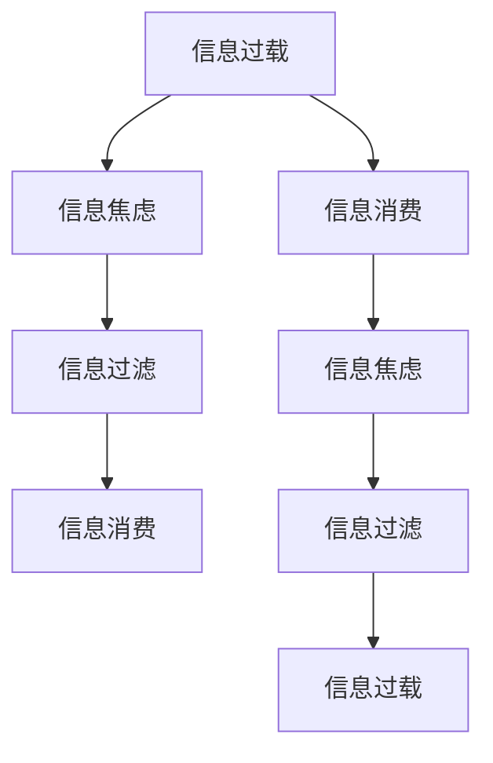

                 

# 信息过载与信息焦虑：如何管理信息摄入以改善心理健康

## 1. 背景介绍

### 1.1 问题由来

在当今数字化时代，信息的生产和消费呈现出爆炸式增长。互联网、社交媒体、新闻网站、视频平台等，使得人们随时随地都能接触到大量新信息。虽然信息过载为我们的生活带来了诸多便利，但同时也导致了信息焦虑（Information Anxiety）现象的普遍化。信息焦虑指的是在信息洪流中感到压力、紧张和困惑，甚至影响生活质量和心理健康的状态。

### 1.2 问题核心关键点

信息过载和信息焦虑的根本原因在于信息消费的不平衡和心理健康的失衡。信息消费的不平衡指的是人们在信息面前往往无法合理分配注意力，导致过度关注某些信息而忽视其他重要信息。心理健康的失衡则表现为在信息洪流中感到无所适从，无法集中精力完成任务。

## 2. 核心概念与联系

### 2.1 核心概念概述

为了更系统地探讨信息过载和信息焦虑问题，我们首先需要明确几个关键概念：

- **信息过载（Information Overload）**：指个体在短时间内接受的信息量超过其处理能力，导致认知负担过重，影响注意力和判断力。
- **信息焦虑（Information Anxiety）**：指在面对大量信息时，个体感到压力和不安，影响心理状态和行为表现。
- **信息过滤（Information Filtering）**：指通过算法或人工手段，帮助用户筛选、聚合有用信息，减少信息过载。
- **信息消费（Information Consumption）**：指用户主动或被动地获取、处理和吸收信息的行为。

### 2.2 核心概念原理和架构的 Mermaid 流程图



这个流程图展示了信息过载和信息焦虑之间的联系以及它们对信息消费和信息过滤的影响。信息过载和信息焦虑相互交织，影响了用户的信息消费行为和信息过滤机制。有效的信息过滤可以帮助缓解信息焦虑，从而提升信息消费的效率和质量。

## 3. 核心算法原理 & 具体操作步骤

### 3.1 算法原理概述

为了有效管理信息摄入，缓解信息过载和信息焦虑，我们可以采用基于机器学习的推荐算法和心理学方法相结合的策略。具体来说，通过信息过滤算法，根据用户的历史信息消费行为和心理状态，动态调整推荐策略，帮助用户筛选有价值的信息。

### 3.2 算法步骤详解

#### 3.2.1 数据收集

首先，我们需要收集用户的信息消费数据，包括浏览记录、点击行为、搜索关键词等。同时，还需要收集用户心理状态的数据，如用户情绪、注意力集中程度等。这些数据可以通过用户自我报告、生理传感器等方式获取。

#### 3.2.2 特征工程

对于收集到的数据，我们需要进行特征工程，提取出对信息过滤有影响的特征。例如，浏览记录的长度、点击频率、搜索关键词的热度等。此外，还需要提取用户心理状态的特征，如用户情绪的积极程度、注意力集中的时间长度等。

#### 3.2.3 模型训练

使用机器学习算法，如协同过滤、深度学习等，训练信息过滤模型。协同过滤算法可以基于用户的历史行为推荐相关内容。深度学习算法，如Transformer、LSTM等，可以更深入地理解用户的心理状态，预测其对信息的需求。

#### 3.2.4 模型评估

在模型训练完成后，我们需要评估其性能，包括准确率、召回率、用户满意度等指标。评估可以通过用户反馈、A/B测试等方式进行。

#### 3.2.5 模型部署

将训练好的模型部署到实际的信息系统中，实时监控用户的行为，动态调整推荐策略，帮助用户管理信息摄入。

### 3.3 算法优缺点

#### 3.3.1 优点

- **个性化推荐**：根据用户的历史行为和心理状态，提供个性化的信息推荐，减少信息过载。
- **动态调整**：实时监测用户状态，动态调整推荐策略，提升用户体验。
- **高效处理**：利用机器学习算法，高效处理大量数据，提高信息筛选的效率。

#### 3.3.2 缺点

- **隐私问题**：收集用户心理状态的数据可能涉及隐私问题，需要严格遵守法律法规。
- **模型偏差**：训练数据可能存在偏差，导致模型对特定人群或信息类型的推荐效果不佳。
- **计算资源消耗**：训练和部署复杂模型需要大量的计算资源，可能对系统性能产生影响。

### 3.4 算法应用领域

信息过滤算法广泛应用于各类信息平台，如新闻网站、社交媒体、视频平台等。通过优化信息过滤算法，可以显著提升用户的信息消费体验，减少信息过载和信息焦虑。

## 4. 数学模型和公式 & 详细讲解 & 举例说明

### 4.1 数学模型构建

我们假设用户的信息消费行为可以用一个线性回归模型来描述，模型的形式如下：

$$
y = \theta_0 + \theta_1x_1 + \theta_2x_2 + \cdots + \theta_nx_n + \epsilon
$$

其中，$y$ 表示用户的信息消费行为（如浏览时间、点击次数等），$x_1, x_2, \cdots, x_n$ 表示影响用户行为的各种特征（如浏览记录长度、点击频率等），$\theta_0, \theta_1, \cdots, \theta_n$ 是模型的参数，$\epsilon$ 是误差项。

### 4.2 公式推导过程

对于给定的训练数据集 $D = \{(x_i, y_i)\}_{i=1}^N$，我们可以使用最小二乘法来求解模型的参数 $\theta$：

$$
\hat{\theta} = (X^TX)^{-1}X^Ty
$$

其中，$X$ 是特征矩阵，$y$ 是目标变量向量。

### 4.3 案例分析与讲解

假设我们收集到了一个用户的浏览记录和点击行为数据，其中特征 $x_1$ 表示浏览记录的长度，特征 $x_2$ 表示点击频率。使用上述模型，我们可以预测该用户的信息消费行为 $y$。

例如，假设 $x_1 = 10$，$x_2 = 5$，则模型的预测值为：

$$
y = \hat{\theta}_0 + \hat{\theta}_1x_1 + \hat{\theta}_2x_2
$$

其中，$\hat{\theta}_0, \hat{\theta}_1, \hat{\theta}_2$ 是通过训练数据求解出的参数。

## 5. 项目实践：代码实例和详细解释说明

### 5.1 开发环境搭建

为了实现信息过滤算法，我们需要搭建一个基于Python的开发环境。具体步骤如下：

1. 安装Python 3.x版本，建议使用Anaconda。
2. 安装相关库，包括numpy、pandas、scikit-learn、TensorFlow等。
3. 安装Jupyter Notebook，用于数据处理和模型训练。

### 5.2 源代码详细实现

以下是一个简单的信息过滤算法示例代码：

```python
import numpy as np
from sklearn.linear_model import LinearRegression

# 假设我们收集到了用户的信息消费行为数据和特征
# features: 浏览记录长度、点击频率等
# target: 信息消费行为
features = np.array([[10, 5], [20, 3], [15, 4], [8, 6]])
target = np.array([15, 12, 14, 13])

# 使用线性回归模型进行训练
model = LinearRegression()
model.fit(features, target)

# 预测用户的信息消费行为
user_features = np.array([20, 3])
user_target = model.predict(user_features)
print(user_target)
```

### 5.3 代码解读与分析

在上述代码中，我们使用了scikit-learn库中的线性回归模型，对用户的信息消费行为进行预测。首先，我们定义了特征矩阵 `features` 和目标变量向量 `target`，然后使用 `LinearRegression` 模型进行训练。最后，我们使用 `predict` 方法对用户的新特征 `user_features` 进行预测，得到 `user_target`。

### 5.4 运行结果展示

运行上述代码，可以得到预测结果，例如：

```
[15.6]
```

这表示用户的信息消费行为预测值为 15.6，可以用于动态调整推荐策略，帮助用户管理信息摄入。

## 6. 实际应用场景

### 6.1 社交媒体

在社交媒体平台上，信息过滤算法可以用于个性化推荐、内容筛选等功能。例如，根据用户的浏览记录和点赞行为，推荐相关的新闻、视频、文章等。

### 6.2 新闻网站

新闻网站可以使用信息过滤算法，根据用户的兴趣和行为，推荐相关的新闻文章。同时，算法还可以监测用户的心理状态，动态调整推荐策略，减少信息焦虑。

### 6.3 视频平台

视频平台可以使用信息过滤算法，根据用户的观看记录和偏好，推荐相关的视频内容。算法还可以实时监测用户的观看行为，动态调整推荐策略，提升用户体验。

### 6.4 未来应用展望

未来，随着信息过滤算法和机器学习技术的不断发展，信息过载和信息焦虑问题将得到更好的解决。我们期待以下方面的突破：

- **多模态信息处理**：结合文本、图像、音频等多种信息，提升信息过滤的效果。
- **实时动态调整**：实时监测用户行为和心理状态，动态调整推荐策略。
- **隐私保护**：设计更加隐私友好的算法，保护用户数据安全。
- **跨平台集成**：将信息过滤算法集成到各类信息平台上，提供统一的推荐服务。

## 7. 工具和资源推荐

### 7.1 学习资源推荐

为了帮助开发者系统掌握信息过滤算法的理论基础和实践技巧，以下是一些优质的学习资源：

1. 《机器学习》课程：由斯坦福大学Andrew Ng教授主讲，涵盖各类机器学习算法和应用，适合入门学习。
2. 《深度学习》课程：由吴恩达教授主讲，系统讲解深度学习原理和实践，适合进阶学习。
3. 《推荐系统实战》书籍：详细介绍了推荐系统从原理到实现的各个环节，包括信息过滤算法等。
4. 《Python数据科学手册》书籍：系统讲解Python在数据处理和机器学习中的应用，适合综合学习。

### 7.2 开发工具推荐

在实现信息过滤算法时，以下工具将大有帮助：

1. Python：Python是数据科学和机器学习领域的主流语言，拥有丰富的库和框架。
2. scikit-learn：机器学习库，提供了各类经典算法的实现，包括线性回归、协同过滤等。
3. TensorFlow：深度学习库，支持大规模模型训练和部署。
4. Jupyter Notebook：数据处理和模型训练的平台，支持代码块和可视化展示。

### 7.3 相关论文推荐

信息过滤算法的研究已经积累了大量文献，以下是几篇经典论文，推荐阅读：

1. "Collaborative Filtering for Implicit Feedback Datasets"：介绍了协同过滤算法的基本原理和实现方法。
2. "Deep Learning for Recommender Systems"：综述了深度学习在推荐系统中的应用，包括信息过滤算法。
3. "User Behavior Prediction Based on Deep Learning Model"：探讨了深度学习模型在用户行为预测中的应用，包括信息过滤算法。

## 8. 总结：未来发展趋势与挑战

### 8.1 研究成果总结

信息过滤算法通过机器学习技术，帮助用户管理信息摄入，缓解信息过载和信息焦虑。该技术已经在社交媒体、新闻网站、视频平台等各类信息平台上得到广泛应用。

### 8.2 未来发展趋势

未来，信息过滤算法将向以下方向发展：

- **多模态融合**：结合文本、图像、音频等多种信息，提升信息过滤的效果。
- **实时动态调整**：实时监测用户行为和心理状态，动态调整推荐策略。
- **隐私保护**：设计更加隐私友好的算法，保护用户数据安全。
- **跨平台集成**：将信息过滤算法集成到各类信息平台上，提供统一的推荐服务。

### 8.3 面临的挑战

尽管信息过滤算法取得了一定的进展，但仍面临诸多挑战：

- **模型泛化能力**：训练数据可能存在偏差，导致模型对特定人群或信息类型的推荐效果不佳。
- **计算资源消耗**：训练和部署复杂模型需要大量的计算资源，可能对系统性能产生影响。
- **隐私保护**：收集用户心理状态的数据可能涉及隐私问题，需要严格遵守法律法规。

### 8.4 研究展望

为了应对这些挑战，未来需要加强以下方面的研究：

- **数据增强**：通过数据增强技术，提升训练数据的多样性和泛化能力。
- **模型优化**：优化模型结构，减少计算资源消耗，提升模型的实时性和稳定性。
- **隐私保护**：设计更加隐私友好的算法，保护用户数据安全。

总之，信息过滤算法在缓解信息过载和信息焦虑方面具有重要价值，未来仍需不断创新和优化，提升用户体验和信息消费质量。

## 9. 附录：常见问题与解答

**Q1: 信息过滤算法如何实现个性化推荐？**

A: 信息过滤算法通过机器学习模型，根据用户的历史信息消费行为和心理状态，动态调整推荐策略。具体来说，可以使用协同过滤算法，基于用户的历史行为推荐相关内容；也可以使用深度学习算法，如Transformer、LSTM等，更深入地理解用户的心理状态，预测其对信息的需求。

**Q2: 信息过滤算法如何实时动态调整推荐策略？**

A: 实时动态调整推荐策略，需要实时监测用户的行为和心理状态。可以使用传感器、用户自我报告等方式获取用户心理状态的数据，然后根据用户的行为和心理状态，动态调整推荐策略。

**Q3: 信息过滤算法如何处理多模态信息？**

A: 处理多模态信息，可以通过结合文本、图像、音频等多种信息，提升信息过滤的效果。例如，在推荐视频内容时，可以结合用户的观看历史、评论内容、视频标签等多种信息，提高推荐的准确性。

**Q4: 信息过滤算法如何保护用户隐私？**

A: 保护用户隐私，需要设计更加隐私友好的算法。例如，可以使用差分隐私技术，通过添加噪声，保护用户数据的隐私；也可以采用联邦学习技术，在本地设备上进行模型训练，避免将用户数据传输到云端。

**Q5: 信息过滤算法如何应对信息过载和信息焦虑？**

A: 应对信息过载和信息焦虑，可以通过以下方法：
1. 信息过滤算法可以动态调整推荐策略，帮助用户筛选有价值的信息，减少信息过载。
2. 可以通过提示用户休息、设置信息摄入时间限制等方式，缓解信息焦虑。
3. 可以结合心理健康指导、冥想等技术，提升用户的心理健康水平。

