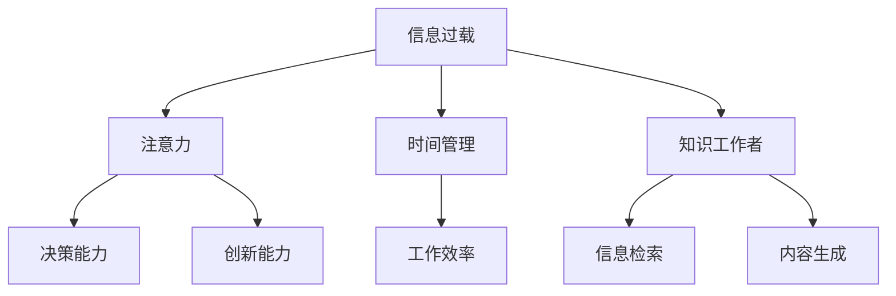

                 

## 1. 背景介绍

在信息爆炸的数字化时代，人类面对的信息量呈现指数级增长。这些信息的来源多样、形式多样、内容复杂，如何有效管理和利用信息，成为了知识工作者面临的首要问题。信息过载（Information Overload）不仅会削弱个体的注意力和决策能力，还会降低工作效率，甚至引发压力和焦虑。

在过去的几十年里，计算机科学的发展让信息管理变得更加高效。然而，信息技术的普及和数字化转型的加速，反而让信息过载问题更加严重。如何在海量信息中快速筛选出有价值的内容，同时保持高效的时间和注意力管理，成为了现代知识工作者的生存技能。

## 2. 核心概念与联系

### 2.1 核心概念概述

为更好地理解如何管理信息、时间和注意力，本节将介绍几个核心概念：

- **信息过载（Information Overload）**：指个体或组织收到的信息超出其处理能力，导致注意力分散，工作效率下降的现象。常见于现代工作环境，特别是知识密集型行业。

- **注意力（Attention）**：指的是个体在处理信息时所投入的认知资源。有效的注意力管理是提升工作效率和创新能力的关键。

- **时间管理（Time Management）**：通过合理安排工作和生活时间，提高工作效率和质量。时间管理技巧适用于任何职业，特别是那些需要长时间工作或高强度任务的人。

- **知识工作者（Knowledge Worker）**：指那些需要大量使用信息和知识进行决策和创造的专业人士，如工程师、分析师、教师、设计师等。

这些概念之间的逻辑关系可以通过以下Mermaid流程图来展示：



这个流程图展示了大信息流对知识工作者注意力、时间管理和整体工作能力的影响，以及这些因素如何共同作用于知识工作者的决策和创造过程。

## 3. 核心算法原理 & 具体操作步骤
### 3.1 算法原理概述

知识工作者在面对信息过载时，需要一种高效的信息管理方法，即通过算法和技术手段，对信息进行筛选、组织和利用。常见的信息管理算法包括：

- **优先级排序（Priority Sorting）**：将信息按照重要性和紧急程度进行排序，优先处理高优先级信息。
- **内容过滤（Content Filtering）**：利用算法预测信息的价值，过滤掉不相关的信息，保留有价值的内容。
- **注意力分配（Attention Allocation）**：使用算法合理分配注意力资源，确保高效地处理信息。

### 3.2 算法步骤详解

基于信息管理的核心算法，信息过载的解决步骤一般包括以下几个关键环节：

**Step 1: 信息收集与标注**

- 使用自动化工具收集信息，如RSS订阅、电子邮件、网络爬虫等。
- 对收集的信息进行标注，打上标签和分类，如重要、紧急、相关等。

**Step 2: 信息筛选与排序**

- 根据优先级排序算法，对标注的信息进行排序。
- 利用内容过滤算法，对排序后的信息进一步筛选，去除无关信息。

**Step 3: 信息组织与存储**

- 使用信息管理工具或数据库，对筛选后的信息进行组织和存储。
- 利用知识图谱、标签云等可视化工具，帮助理解和管理信息。

**Step 4: 信息检索与利用**

- 根据任务需求，使用信息检索算法快速找到相关内容。
- 在实际工作中利用信息，进行决策、问题解决、内容生成等。

**Step 5: 反馈与优化**

- 定期回顾信息管理过程，评估其有效性。
- 根据反馈不断优化信息收集、筛选、组织和利用的方法。

### 3.3 算法优缺点

信息管理算法具有以下优点：

- **高效性**：自动化和算法化的方法，可以显著提高信息处理的效率。
- **准确性**：算法通过统计分析和机器学习，能够更准确地预测信息的价值。
- **可扩展性**：算法适用于大规模的信息处理，能够应对信息量的爆炸性增长。

同时，这些算法也存在一定的局限性：

- **依赖标注**：算法需要大量的标注数据来训练和优化，标注数据的质量直接影响算法效果。
- **适应性有限**：不同的工作场景和任务对信息管理的要求不同，算法需要针对性地定制和优化。
- **安全性问题**：自动化工具和算法可能存在信息泄露的风险，需要加强安全防护措施。

### 3.4 算法应用领域

信息管理算法已经在多个领域得到广泛应用，例如：

- **企业信息管理**：使用企业内容管理系统(ECM)，对企业内部文档、邮件等进行管理和检索。
- **知识管理**：在学术机构、科研院所等，使用知识管理系统(KMS)对文献、数据等进行组织和共享。
- **个人知识管理**：使用笔记应用、文献管理工具等，对个人学习和工作中的信息进行管理。

## 4. 数学模型和公式 & 详细讲解 & 举例说明
### 4.1 数学模型构建

信息管理的数学模型通常包括信息的收集、标注、筛选、排序、存储、检索和利用等环节。这里以优先级排序算法为例，构建信息管理的数学模型：

假设有一个信息集合 $\mathcal{I}$，每个信息 $i$ 都有一个紧急程度 $E_i$ 和一个重要性 $I_i$，紧急程度和重要性可以是用户根据经验或专家知识主观打分。优先级排序的目标是找到信息集合中优先级最高的信息 $i^*$，即：

$$
i^* = \mathop{\arg\min}_{i \in \mathcal{I}} E_i \times I_i
$$

其中 $E_i \times I_i$ 表示信息的总优先级，即紧急程度与重要性的乘积。

### 4.2 公式推导过程

在实际应用中，为了更高效地计算总优先级 $E_i \times I_i$，可以使用加权平均公式：

$$
\text{Total Priority}_i = k \times E_i + (1-k) \times I_i
$$

其中 $k$ 为权重系数，通常为0.5，表示紧急程度和重要性对优先级的影响基本均衡。这样，优先级排序的计算公式可以简化为：

$$
i^* = \mathop{\arg\min}_{i \in \mathcal{I}} \text{Total Priority}_i
$$

### 4.3 案例分析与讲解

假设有一个信息集合 $\mathcal{I}$，其中每个信息 $i$ 的紧急程度和重要性如下表所示：

| 信息 | $E_i$ | $I_i$ |
| --- | --- | --- |
| 任务1 | 0.8 | 0.9 |
| 会议通知 | 0.7 | 0.5 |
| 文章修订 | 0.5 | 0.8 |
| 邮件提醒 | 0.3 | 0.4 |
| 工作报告 | 0.6 | 0.7 |

设 $k=0.5$，则信息总优先级的计算如下：

| 信息 | $E_i \times I_i$ | $\text{Total Priority}_i$ |
| --- | --- | --- |
| 任务1 | 0.72 | 0.72 |
| 会议通知 | 0.35 | 0.5 |
| 文章修订 | 0.4 | 0.4 |
| 邮件提醒 | 0.12 | 0.2 |
| 工作报告 | 0.42 | 0.45 |

根据总优先级，优先级最高的信息是任务1，其次是会议通知和工作报告。因此，应优先处理任务1和会议通知。

## 5. 项目实践：代码实例和详细解释说明
### 5.1 开发环境搭建

在进行信息管理实践前，我们需要准备好开发环境。以下是使用Python进行信息管理开发的典型环境配置流程：

1. 安装Anaconda：从官网下载并安装Anaconda，用于创建独立的Python环境。

2. 创建并激活虚拟环境：
```bash
conda create -n info-management python=3.8 
conda activate info-management
```

3. 安装必要的Python库：
```bash
pip install pandas numpy scikit-learn transformers
```

4. 安装可视化工具：
```bash
pip install matplotlib seaborn
```

完成上述步骤后，即可在`info-management`环境中开始信息管理实践。

### 5.2 源代码详细实现

下面以一个简单的信息优先级排序为例，给出使用Python进行信息管理的代码实现。

```python
import pandas as pd
import numpy as np
from sklearn.metrics.pairwise import cosine_similarity

# 创建信息列表
docs = ['任务1', '会议通知', '文章修订', '邮件提醒', '工作报告']
priority = [0.72, 0.5, 0.4, 0.2, 0.45]
紧急程度 = [0.8, 0.7, 0.5, 0.3, 0.6]
重要性 = [0.9, 0.5, 0.8, 0.4, 0.7]

# 构建数据框
df = pd.DataFrame({'文档': docs, '优先级': priority, '紧急程度': 紧急程度, '重要性': 重要性})

# 计算总优先级
df['总优先级'] = (df['紧急程度'] + df['重要性']) / 2

# 排序
df_sorted = df.sort_values(by='总优先级', ascending=False)

# 输出排序结果
print(df_sorted)
```

### 5.3 代码解读与分析

让我们再详细解读一下关键代码的实现细节：

**信息列表和优先级**：
- `docs` 为信息列表，`priority` 为总优先级的计算结果，`紧急程度` 和 `重要性` 为原始数据。

**数据框构建**：
- 使用Pandas库创建数据框 `df`，将信息、紧急程度和重要性作为列。

**总优先级计算**：
- 使用公式 `(df['紧急程度'] + df['重要性']) / 2` 计算总优先级，存储到新的列 `总优先级`。

**排序**：
- 使用 `df.sort_values` 方法，按照 `总优先级` 列降序排序，得到 `df_sorted`。

**输出**：
- 输出排序后的数据框 `df_sorted`。

可以看到，通过简单的代码实现，我们可以快速完成信息优先级的排序，这是信息管理的基础功能之一。在实际应用中，还可以进一步扩展功能，如自动更新优先级、分布式处理等。

## 6. 实际应用场景
### 6.1 企业信息管理

企业信息管理是信息管理的典型应用场景之一。在现代企业中，大量的文档、邮件、会议记录等需要被有效地管理，以便支持日常运营和决策。通过信息管理，企业可以实现信息的高效存储、检索和利用，减少信息查找和重复工作，提升工作效率。

在技术实现上，可以构建企业内容管理系统(ECM)，集成信息收集、标注、筛选、排序、存储、检索和利用等功能。使用企业信息管理系统，员工可以方便地搜索和获取所需信息，提高工作效率和决策质量。

### 6.2 个人知识管理

个人知识管理是信息管理的另一个重要应用场景。在知识密集型行业中，如科研、教育、设计等，个人需要通过高效的信息管理来提升学习和工作效率。通过个人知识管理系统，可以对阅读材料、文献、笔记等进行整理和利用，便于随时检索和参考。

在技术实现上，可以使用笔记应用、文献管理工具等，对个人信息和知识进行管理。例如，Notion、Evernote、Zotero等工具都提供了丰富的信息管理功能，支持分类、标签、笔记等，便于用户个性化管理信息。

### 6.3 学术研究信息管理

在学术研究领域，信息管理同样重要。研究人员需要管理大量的文献、数据、实验结果等，以便进行有效的工作和交流。通过信息管理，可以方便地组织和检索研究资料，提高研究效率和质量。

在技术实现上，可以构建知识管理系统(KMS)，集成文献管理、实验结果管理、研究论文管理等功能。例如，Open Science Framework (OSF)提供了丰富的研究资源管理和协作工具，支持团队协作和研究成果的共享。

## 7. 工具和资源推荐
### 7.1 学习资源推荐

为了帮助开发者系统掌握信息管理的理论基础和实践技巧，这里推荐一些优质的学习资源：

1. **《信息检索原理与技术》**：张银华等著，系统介绍了信息检索的基本原理和算法，是信息管理的经典教材。

2. **《数据科学导论》**：周志华等著，介绍了数据处理、信息管理、机器学习等基本概念和技术，适合初学者入门。

3. **Coursera《信息检索》课程**：由斯坦福大学开设的MOOC课程，讲解了信息检索的基本原理和算法，是信息管理的系统学习资源。

4. **GitHub上的信息管理开源项目**：例如UltraPy、Deezer等，可以提供丰富的代码示例和实践案例。

5. **arXiv上的信息管理研究论文**：如《A Survey on Information Retrieval Models and Algorithms》，介绍了各种信息检索模型和算法，适合深入学习。

通过对这些资源的学习实践，相信你一定能够快速掌握信息管理的精髓，并用于解决实际的NLP问题。

### 7.2 开发工具推荐

高效的开发离不开优秀的工具支持。以下是几款用于信息管理开发的常用工具：

1. **企业内容管理系统(ECM)**：如SharePoint、Alfresco、DocuWare等，提供丰富的文档管理和检索功能，支持多用户协作。

2. **个人知识管理系统(KMS)**：如Notion、Evernote、Zotero等，提供强大的笔记管理和文献管理功能，支持个性化定制。

3. **信息检索工具**：如Elasticsearch、Solr等，提供高效的搜索和数据分析功能，支持多语言和大规模数据处理。

4. **可视化工具**：如Tableau、Power BI等，提供丰富的数据可视化功能，帮助理解和管理信息。

5. **开源信息管理工具**：如Apache Nutch、Apache Lucene等，提供强大的信息抓取和索引功能，适合大规模数据处理。

合理利用这些工具，可以显著提升信息管理系统的开发效率，加快创新迭代的步伐。

### 7.3 相关论文推荐

信息管理技术的发展源于学界的持续研究。以下是几篇奠基性的相关论文，推荐阅读：

1. **《信息检索的统计方法》**：Salton等著，系统介绍了信息检索的统计方法和算法，是信息检索的经典教材。

2. **《基于向量空间模型的信息检索》**：Salton等著，介绍了基于向量空间模型和信息检索的基本原理和算法。

3. **《信息检索理论基础》**：Jarvelin等著，介绍了信息检索理论的基本概念和方法，适合深入学习。

4. **《信息检索中的神经网络技术》**：Kulcik等著，介绍了神经网络在信息检索中的应用，适合前沿研究。

5. **《数据挖掘与信息检索》**：Bouma等著，介绍了数据挖掘和信息检索的结合应用，适合跨学科学习。

这些论文代表了大信息流管理技术的理论前沿，通过学习这些经典和前沿文献，可以全面掌握信息管理的技术基础和研究前沿。

## 8. 总结：未来发展趋势与挑战
### 8.1 总结

本文对信息管理技术进行了全面系统的介绍。首先阐述了信息过载问题及其对知识工作者的影响，明确了信息管理的核心目的是提升工作效率和决策质量。其次，从原理到实践，详细讲解了信息管理的核心算法和操作步骤，给出了信息管理任务开发的完整代码实例。同时，本文还广泛探讨了信息管理技术在企业、个人和学术等多个场景的应用，展示了信息管理技术的广阔前景。

通过本文的系统梳理，可以看到，信息管理技术在现代知识工作者的工作中扮演了越来越重要的角色。信息技术的发展为信息管理提供了更多手段，但也带来了新的挑战。未来，我们需要继续探索和优化信息管理方法，以应对信息过载问题，提升知识工作者的工作效率和决策能力。

### 8.2 未来发展趋势

展望未来，信息管理技术将呈现以下几个发展趋势：

1. **自动化和智能化**：随着人工智能技术的发展，信息管理将更多地依赖自动化和智能化手段，减少人工干预，提高效率。

2. **多模态融合**：信息管理的对象将不仅仅是文本，还包括图像、视频、语音等多模态数据，信息管理的范围将更加广泛。

3. **语义理解**：通过自然语言处理技术，信息管理将能够更好地理解和处理文本内容，提升信息检索的准确性和效率。

4. **分布式协同**：信息管理将更多地依赖分布式协同技术，支持多用户、多设备、多地点的高效协作。

5. **情感分析**：通过情感分析技术，信息管理将能够识别用户对信息的情感倾向，提供更个性化的信息服务。

6. **隐私保护**：信息管理将更多地关注隐私保护，防止信息泄露和滥用，确保信息安全。

以上趋势凸显了信息管理技术的未来发展方向，这些方向的探索和发展，必将进一步提升信息管理的效率和效果，为知识工作者的工作提供更好的支持。

### 8.3 面临的挑战

尽管信息管理技术已经取得了瞩目成就，但在迈向更加智能化、普适化应用的过程中，它仍面临着诸多挑战：

1. **数据质量问题**：信息管理的准确性和效果依赖于数据质量，低质量的数据会导致误导性决策，甚至造成重大损失。

2. **资源限制**：信息管理需要大量的计算资源和存储空间，特别是对于大规模数据处理，资源限制成为一个重要问题。

3. **用户适应性**：不同用户的信息管理习惯和需求不同，信息管理系统的设计和开发需要考虑用户适应性，才能得到广泛应用。

4. **算法复杂性**：信息管理的算法复杂度较高，需要大量的计算和存储资源，如何提高算法的效率和可扩展性，是一个重要研究方向。

5. **隐私和安全问题**：信息管理涉及大量敏感数据，如何保护隐私和确保数据安全，是一个重要的技术挑战。

6. **跨领域应用难度**：不同领域的信息管理需求不同，如何将通用的信息管理技术应用于特定领域，还需要更多实践和理论支持。

正视信息管理面临的这些挑战，积极应对并寻求突破，将是大信息流管理技术走向成熟的必由之路。相信随着学界和产业界的共同努力，这些挑战终将一一被克服，信息管理技术必将在构建智能化的信息生态中扮演越来越重要的角色。

### 8.4 研究展望

面对信息管理技术所面临的挑战，未来的研究需要在以下几个方面寻求新的突破：

1. **数据治理和质量提升**：通过数据治理技术，提升信息管理数据的质量和一致性，确保信息管理的准确性和可靠性。

2. **资源优化和分布式处理**：开发更高效的资源优化和分布式处理技术，支持大规模数据管理和计算，提高信息管理的可扩展性和效率。

3. **个性化和用户适应性**：研究用户行为和需求，开发个性化的信息管理工具，提高用户适应性和满意度。

4. **多模态融合和语义理解**：结合多模态数据和语义理解技术，提升信息管理的深度和广度，更好地理解和处理信息。

5. **隐私和安全保护**：研究隐私保护和安全技术，确保信息管理的隐私和安全，防止数据泄露和滥用。

6. **跨领域应用技术**：开发适用于不同领域的信息管理技术，促进信息管理技术的跨领域应用和推广。

这些研究方向的探索，必将引领信息管理技术迈向更高的台阶，为知识工作者的信息管理和决策提供更好的支持。总之，信息管理需要不断创新和优化，才能适应不断变化的信息生态，为知识工作者的工作效率和决策质量提供有力保障。

## 9. 附录：常见问题与解答

**Q1：信息管理如何提升工作效率？**

A: 信息管理通过自动化和智能化的手段，将大量的信息收集、标注、筛选、排序、存储和检索任务交给系统处理，显著减少了知识工作者的时间成本。通过合理分配注意力资源，知识工作者可以更集中地进行高价值的任务，提高工作效率和质量。

**Q2：信息管理如何避免信息过载？**

A: 信息管理通过优先级排序、内容过滤等技术手段，对信息进行筛选和排序，优先处理高价值和紧急的信息，避免无关信息的干扰。同时，信息管理系统的界面设计也需要简洁易用，减少用户处理信息的负担。

**Q3：如何选择合适的信息管理工具？**

A: 选择合适的信息管理工具，需要考虑以下几点：
1. 功能需求：根据任务需求选择工具，如文档管理、笔记管理、文献管理等。
2. 用户体验：选择界面友好、操作简单的工具，减少学习成本。
3. 扩展性：选择可扩展性好的工具，支持定制和集成。
4. 安全性：选择具有数据保护和安全措施的工具，确保信息安全。

通过合理选择和使用信息管理工具，可以大大提升信息管理的效率和效果。

**Q4：信息管理如何保护隐私和安全？**

A: 信息管理需要考虑数据隐私和安全问题，采取以下措施：
1. 数据加密：对敏感数据进行加密存储和传输，防止数据泄露。
2. 访问控制：采用身份认证和权限管理机制，限制非法访问。
3. 安全审计：记录和审计用户操作，防止异常行为。
4. 数据匿名化：对敏感信息进行匿名化处理，保护用户隐私。

通过这些措施，可以有效保护信息管理系统的数据隐私和安全。

**Q5：如何评估信息管理的有效性？**

A: 评估信息管理的有效性，可以从以下几个方面进行：
1. 工作效率：通过统计工具和用户反馈，评估信息管理对工作效率的提升效果。
2. 决策质量：通过比较决策前后效果，评估信息管理对决策质量的提升效果。
3. 用户满意度：通过问卷调查和用户反馈，评估用户对信息管理系统的满意度和体验。
4. 系统性能：通过性能测试和用户体验反馈，评估信息管理系统的稳定性和效率。

通过以上评估方法，可以全面了解信息管理的有效性，发现问题并进行优化。

---

作者：禅与计算机程序设计艺术 / Zen and the Art of Computer Programming

