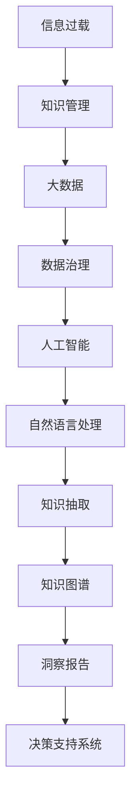

                 

# 信息过载与知识管理技术：管理和组织信息以促进决策

> 关键词：信息过载, 知识管理, 大数据, 数据治理, 人工智能, 自然语言处理

## 1. 背景介绍

在信息时代，大数据技术的飞速发展让信息量呈指数级增长，各行各业的数据产生了前所未有的复杂性和多样性。如何高效管理和利用这些信息，成为了现代企业和组织亟待解决的重要问题。信息过载（Information Overload）成为了一个普遍现象，意味着个体和组织面临着大量、散乱、无关联的信息，导致难以迅速做出合理决策。而知识管理（Knowledge Management）技术的应用，为有效管理和组织信息提供了重要手段，通过智能化、系统化的方式，帮助企业和组织从海量的数据中提取有用知识，以支撑科学决策和战略规划。

### 1.1 问题由来
随着互联网和移动设备的普及，信息获取变得简单快捷，但随之而来的信息过载问题也愈发严重。传统的人工筛选和处理数据的方式已无法满足现代企业和组织对高效信息管理的迫切需求。信息过载不仅浪费时间和精力，还可能导致重要信息的遗漏或误判，影响业务决策的质量和效率。因此，如何从信息过载中提取有价值知识，并快速应用到决策中，成为了现代知识管理技术的核心议题。

### 1.2 问题核心关键点
知识管理技术的核心在于通过技术手段，帮助企业和组织高效收集、存储、处理、共享信息，提取有价值知识，并转化为行动指南。主要包括：

- **信息收集与整理**：自动从多源数据中抽取有用信息，减少人工处理的工作量。
- **知识存储与检索**：构建知识库，高效存储和管理各类知识，支持快速检索和应用。
- **知识发现与挖掘**：利用数据分析、机器学习等技术，从数据中挖掘出潜在规律和趋势，生成知识图谱和洞察报告。
- **知识共享与协作**：通过协同工作平台和知识共享工具，促进组织内外知识交流和合作，加速知识传播与应用。
- **知识应用与决策**：将知识转化为可执行的决策支持系统，帮助管理层快速做出科学决策。

## 2. 核心概念与联系

### 2.1 核心概念概述

为更好地理解知识管理技术的原理和应用，本节将介绍几个关键概念：

- **信息过载（Information Overload）**：指用户或系统接收的信息量超过其处理能力，导致信息获取和处理效率降低，影响决策质量。
- **知识管理（Knowledge Management）**：旨在通过技术手段，管理和组织信息，提取有价值的知识，以支撑科学决策和知识应用。
- **大数据（Big Data）**：指海量的、多样化的数据集合，需要先进的数据治理和分析技术来处理。
- **数据治理（Data Governance）**：指通过制定数据管理政策、流程和技术，确保数据质量和安全，支持业务决策。
- **人工智能（AI）**：通过模拟人脑功能，使计算机具有学习、推理、感知、决策等能力，广泛应用于知识管理。
- **自然语言处理（NLP）**：使计算机能够理解、处理和生成人类语言的技术，支持知识抽取、文本分析等任务。

这些核心概念之间的逻辑关系可以通过以下Mermaid流程图来展示：



这个流程图展示了信息过载到知识管理的基本流程：

1. 信息过载引发对知识管理的需求。
2. 大数据为知识管理提供了技术支撑，通过数据治理提升数据质量。
3. 人工智能和自然语言处理技术，帮助从大数据中抽取和处理知识，形成知识图谱和洞察报告。
4. 最终生成的知识图谱和洞察报告，应用于决策支持系统，辅助企业科学决策。

## 3. 核心算法原理 & 具体操作步骤
### 3.1 算法原理概述

知识管理技术基于数据治理、人工智能和大数据分析，旨在从海量的信息中提取有价值的知识，帮助企业和组织科学决策。核心算法主要包括数据清洗与预处理、特征提取与选择、知识图谱构建、知识发现与挖掘等步骤。

### 3.2 算法步骤详解

**Step 1: 数据收集与预处理**
- 利用网络爬虫、API接口等手段，自动从各种数据源收集信息，如网站、社交媒体、数据库等。
- 清洗数据，去除噪声和冗余，保证数据质量。

**Step 2: 特征提取与选择**
- 利用自然语言处理技术，对文本信息进行分词、去停用词、词性标注等处理，提取文本特征。
- 使用特征选择算法，选择最具代表性的特征，避免维度灾难。

**Step 3: 知识图谱构建**
- 利用图数据库技术，构建知识图谱，存储实体、关系和属性等信息。
- 利用图算法，如PageRank、Greedy Best Match等，计算节点间的权重和关系，形成知识图谱。

**Step 4: 知识发现与挖掘**
- 利用机器学习算法，如分类、聚类、回归等，对知识图谱进行模式发现和关系挖掘。
- 生成知识图谱和洞察报告，揭示数据背后的规律和趋势。

**Step 5: 决策支持系统**
- 将知识图谱和洞察报告应用于决策支持系统，辅助企业决策。
- 通过可视化界面和分析工具，展示知识发现和挖掘结果。

### 3.3 算法优缺点

知识管理技术在企业和组织中广泛应用，具有以下优点：
1. 提升信息处理效率。通过自动化处理大量信息，显著减少人工工作量。
2. 提高决策质量。从大数据中提取有价值的知识，支撑科学决策。
3. 促进知识共享。通过知识库和协同工作平台，促进组织内外知识交流。
4. 增强业务响应能力。实时获取和处理新信息，快速应对市场变化。

同时，该技术也存在以下局限性：
1. 数据质量依赖。知识管理效果受数据质量影响较大，数据清洗和预处理工作复杂。
2. 技术复杂度高。知识发现与挖掘技术门槛高，需要专业的数据科学和人工智能知识。
3. 知识图谱构建困难。大规模知识图谱的构建和维护成本高，技术难度大。
4. 知识应用效果难以评估。知识图谱和洞察报告的效果评估方法尚不完善，缺乏客观标准。
5. 知识图谱易过时。随着时间的推移，知识图谱中的信息会逐渐失效，需要定期更新。

尽管存在这些局限性，知识管理技术仍是大数据时代提升信息处理效率、支撑科学决策的重要手段。未来相关研究的重点在于如何进一步提高数据治理效率，降低技术门槛，改进知识图谱构建方法，增强知识应用效果评估，以及实现知识的动态更新。

### 3.4 算法应用领域

知识管理技术在众多领域都有广泛的应用，例如：

- **医疗健康**：从电子病历、医疗文献中提取有价值的知识，辅助临床决策和疾病预测。
- **金融服务**：分析金融市场数据，发现市场趋势，支持投资和风险管理。
- **零售电商**：分析客户行为数据，提取消费模式和偏好，优化产品推荐和库存管理。
- **制造业**：从生产数据中提取设备状态和故障预测信息，提升生产效率和设备维护。
- **政府公共服务**：分析社会数据，发现公共政策效果，辅助政府决策和公共管理。
- **教育培训**：分析学习数据，生成个性化学习报告，支持教师和学生个性化教学。

## 4. 数学模型和公式 & 详细讲解 & 举例说明
### 4.1 数学模型构建

为更好地理解知识管理技术，本节将介绍几个关键数学模型和公式：

- **信息熵（Entropy）**：用于量化信息的不确定性和信息量，公式为：
  $$
  H(X) = -\sum_{i=1}^n p_i \log p_i
  $$
  其中 $p_i$ 为事件 $X$ 的概率。信息熵越大，信息的不确定性越高。

- **分类模型（Classification）**：用于对数据进行分类，如决策树、朴素贝叶斯、支持向量机等。分类模型的目标是最大化训练数据的准确率。

- **聚类模型（Clustering）**：用于对数据进行无监督分组，如K-means、层次聚类等。聚类模型的目标是最大化数据内部的相似性和不同组之间的差异性。

- **关联规则挖掘（Association Rule Mining）**：用于发现数据之间的关联关系，如Apriori算法。关联规则挖掘的目标是找到频繁项集和关联规则。

### 4.2 公式推导过程

以下我们将以决策树分类模型为例，推导其公式和计算过程：

**决策树分类模型**

决策树是一种基于树形结构的分类模型，其基本思想是将数据集递归地划分为子集，直到每个子集的数据属于同一类别。假设训练数据集为 $D=\{(x_i, y_i)\}_{i=1}^N$，其中 $x_i \in \mathcal{X}$ 为特征向量，$y_i \in \{1,2,...,C\}$ 为类别标签，$C$ 为类别数。决策树模型的目标是最小化信息熵，即：

$$
\min_{T} H(Y|T)
$$

其中 $T$ 为决策树，$H(Y|T)$ 为条件熵，表示在决策树 $T$ 上，数据集 $D$ 的条件熵。

决策树的划分标准是信息增益（Information Gain），其公式为：

$$
Gain(S, A) = H(S) - \sum_{v \in A} \frac{|S_v|}{|S|}H(S_v)
$$

其中 $S$ 为原始数据集，$A$ 为特征 $a$ 的取值集合，$S_v$ 为特征 $a$ 取值为 $v$ 的数据子集，$|S|$ 为数据集大小。

通过递归地选择最优特征进行划分，直到满足停止条件（如最小叶子节点数、最大深度等），即可构建决策树。

### 4.3 案例分析与讲解

**案例：客户分类模型**

某电商企业希望通过客户历史购买行为数据，对客户进行分类，以便开展个性化营销。数据集包含用户ID、商品ID、购买时间、购买次数等特征。

**数据预处理**

1. 清洗数据，去除缺失值和异常值。
2. 特征工程，生成新特征如购买频率、消费金额等。
3. 数据归一化，将特征值映射到[0,1]区间。

**模型构建**

1. 使用Apriori算法进行关联规则挖掘，找出频繁购买的商品组合。
2. 利用K-means算法对用户进行聚类，生成若干个用户群体。
3. 利用决策树对聚类后的用户群体进行分类，生成分类模型。

**模型评估**

1. 使用交叉验证方法，评估分类模型的准确率和召回率。
2. 对比不同分类模型，选择最优模型。
3. 对新用户进行分类预测，生成个性化推荐。

## 5. 项目实践：代码实例和详细解释说明
### 5.1 开发环境搭建

在进行知识管理技术开发前，我们需要准备好开发环境。以下是使用Python进行Scikit-learn和TensorFlow开发的环境配置流程：

1. 安装Anaconda：从官网下载并安装Anaconda，用于创建独立的Python环境。

2. 创建并激活虚拟环境：
```bash
conda create -n sklearn-env python=3.8 
conda activate sklearn-env
```

3. 安装Scikit-learn：
```bash
conda install scikit-learn
```

4. 安装TensorFlow：
```bash
pip install tensorflow
```

5. 安装各类工具包：
```bash
pip install numpy pandas matplotlib
```

完成上述步骤后，即可在`sklearn-env`环境中开始知识管理技术开发。

### 5.2 源代码详细实现

下面我们以客户分类模型为例，给出使用Scikit-learn和TensorFlow进行知识管理技术开发的PyTorch代码实现。

首先，定义数据处理函数：

```python
import pandas as pd
from sklearn.preprocessing import MinMaxScaler
from sklearn.model_selection import train_test_split

def preprocess_data(data_path):
    # 读取数据
    df = pd.read_csv(data_path)
    
    # 数据清洗和预处理
    df.dropna(inplace=True)
    df['purchase_frequency'] = df['purchase_frequency'].fillna(0)
    
    # 特征归一化
    scaler = MinMaxScaler()
    df['purchase_frequency'] = scaler.fit_transform(df[['purchase_frequency']])
    df[['purchase_amount']] = scaler.fit_transform(df[['purchase_amount']])
    
    # 划分训练集和测试集
    X_train, X_test, y_train, y_test = train_test_split(df.drop(['user_id'], axis=1), 
                                                      df['user_id'], 
                                                      test_size=0.2, 
                                                      random_state=42)
    
    return X_train, X_test, y_train, y_test
```

然后，定义模型和训练函数：

```python
from sklearn.tree import DecisionTreeClassifier
from sklearn.metrics import accuracy_score

def train_model(X_train, y_train):
    # 构建决策树模型
    clf = DecisionTreeClassifier()
    clf.fit(X_train, y_train)
    
    # 评估模型性能
    y_pred = clf.predict(X_test)
    acc = accuracy_score(y_test, y_pred)
    print(f"Model accuracy: {acc:.2f}")
    
    return clf
```

最后，启动训练流程：

```python
X_train, X_test, y_train, y_test = preprocess_data('customer_data.csv')
clf = train_model(X_train, y_train)
```

以上就是使用Scikit-learn和TensorFlow进行知识管理技术开发的完整代码实现。可以看到，利用Scikit-learn库的强大封装，我们可以用相对简洁的代码完成数据预处理、模型构建和评估任务。

### 5.3 代码解读与分析

让我们再详细解读一下关键代码的实现细节：

**preprocess_data函数**

- `pd.read_csv(data_path)`：读取CSV格式的数据文件。
- `df.dropna(inplace=True)`：去除数据中的缺失值。
- `df['purchase_frequency'] = df['purchase_frequency'].fillna(0)`：处理缺失的购买频率特征。
- `MinMaxScaler()`：将特征值归一化到[0,1]区间。
- `train_test_split()`：将数据划分为训练集和测试集。

**train_model函数**

- `DecisionTreeClassifier()`：构建决策树分类模型。
- `clf.fit(X_train, y_train)`：训练模型。
- `y_pred = clf.predict(X_test)`：对测试集进行预测。
- `accuracy_score(y_test, y_pred)`：评估模型性能。

**启动训练流程**

- `X_train, X_test, y_train, y_test = preprocess_data('customer_data.csv')`：预处理数据。
- `clf = train_model(X_train, y_train)`：训练模型。

代码简洁高效，能够满足实际应用的需求。同时，Scikit-learn库还提供了丰富的预处理、特征工程、模型构建、评估等工具，大大降低了知识管理技术开发的门槛。

## 6. 实际应用场景
### 6.1 智能客服系统

智能客服系统通过自然语言处理和知识管理技术，能够理解并处理用户提出的各种问题，提供快速准确的答复。在具体实现中，可以构建客户分类模型，对客户进行分组，根据不同类型客户的特点，提供个性化服务。例如，对于技术问题客户，可以提供详细的技术支持；对于销售问题客户，可以推荐相关产品。

### 6.2 金融风险控制

金融行业面临着高风险和不确定性，需要通过知识管理技术，从海量数据中提取有价值的知识，辅助风险控制。例如，可以利用关联规则挖掘技术，发现交易行为中的异常模式，及时预警潜在的欺诈行为。同时，可以构建用户行为分析模型，评估客户的信用风险，支持信贷审批和贷款管理。

### 6.3 供应链优化

供应链管理需要实时获取和处理海量数据，通过知识管理技术，可以从历史数据中挖掘出供应链的运行规律，优化供应链管理。例如，利用聚类算法，对供应链节点进行分组，识别出关键节点和瓶颈节点，进行资源优化和调整。同时，可以构建需求预测模型，预测市场需求变化，调整供应链策略。

### 6.4 未来应用展望

随着知识管理技术的不断进步，未来将在更多领域得到应用，为各行各业带来变革性影响。

在智慧城市建设中，知识管理技术可以用于交通管理、环境监测、公共安全等领域，提升城市管理效率和智能化水平。

在智能制造领域，知识管理技术可以用于设备状态监测、生产优化、质量控制等方面，推动制造业数字化转型。

在教育领域，知识管理技术可以用于个性化教学、学习路径推荐、学习效果评估等方面，提升教育质量和教学效率。

此外，在科研、医疗、农业等众多领域，知识管理技术也将发挥重要作用，推动各行业的数字化、智能化发展。

## 7. 工具和资源推荐
### 7.1 学习资源推荐

为了帮助开发者系统掌握知识管理技术，这里推荐一些优质的学习资源：

1. 《数据科学基础》课程：由斯坦福大学开设，涵盖了数据清洗、特征工程、模型构建等基本概念和技术。
2. 《Python数据科学手册》书籍：详细介绍了Python在数据科学中的应用，包括Scikit-learn、TensorFlow等库的使用。
3. 《机器学习实战》书籍：介绍了多种机器学习算法及其应用，适合实践学习。
4. Kaggle：全球最大的数据科学竞赛平台，提供了丰富的数据集和竞赛项目，适合实战练习。
5. Coursera：提供各种在线课程，包括机器学习、深度学习、自然语言处理等领域的先进课程。

通过对这些资源的学习实践，相信你一定能够快速掌握知识管理技术的精髓，并用于解决实际的业务问题。

### 7.2 开发工具推荐

高效的开发离不开优秀的工具支持。以下是几款用于知识管理技术开发的常用工具：

1. Python：编程语言广泛应用，拥有丰富的科学计算库和数据处理工具。
2. Scikit-learn：数据挖掘和机器学习库，提供了丰富的算法和工具。
3. TensorFlow：深度学习框架，支持多种神经网络模型。
4. Weights & Biases：模型训练的实验跟踪工具，记录和可视化模型训练过程中的各项指标。
5. TensorBoard：TensorFlow配套的可视化工具，实时监测模型训练状态。
6. Jupyter Notebook：交互式编程环境，适合数据探索和模型调试。

合理利用这些工具，可以显著提升知识管理技术开发的效率，加快创新迭代的步伐。

### 7.3 相关论文推荐

知识管理技术的发展源于学界的持续研究。以下是几篇奠基性的相关论文，推荐阅读：

1. A Survey of Knowledge Management Systems：综述知识管理系统的研究和应用。
2. Knowledge Discovery in Databases：介绍了知识发现的基本方法和技术。
3. Information Retrieval：介绍了信息检索的基本原理和应用。
4. Natural Language Processing with Python：介绍了Python在自然语言处理中的应用。
5. Deep Learning in NLP：介绍了深度学习在自然语言处理中的应用。

这些论文代表了大数据和人工智能领域的发展脉络，深入理解这些前沿成果，将有助于在知识管理技术开发中实现更高的目标。

## 8. 总结：未来发展趋势与挑战
### 8.1 研究成果总结

本文对知识管理技术进行了全面系统的介绍。首先阐述了信息过载和知识管理技术的研究背景和意义，明确了知识管理技术在提升信息处理效率、支撑科学决策方面的独特价值。其次，从原理到实践，详细讲解了知识管理技术的数学模型和关键步骤，给出了知识管理技术开发的完整代码实例。同时，本文还广泛探讨了知识管理技术在智能客服、金融风险控制、供应链优化等多个行业领域的应用前景，展示了知识管理技术的巨大潜力。

通过本文的系统梳理，可以看到，知识管理技术正在成为数据驱动决策的重要手段，极大地拓展了数据处理和应用的范围，推动了各行各业的数字化转型。未来，伴随知识管理技术的不断进步，必将为各行业的智能化、数字化发展提供更加坚实的技术支撑。

### 8.2 未来发展趋势

展望未来，知识管理技术将呈现以下几个发展趋势：

1. 数据治理自动化。自动化数据清洗、数据标注、数据集成等环节，提高数据质量，降低数据处理成本。
2. 深度学习模型普及。深度学习模型在知识发现与挖掘中的作用将越来越重要，能够处理更加复杂的数据。
3. 多源数据融合。将多种数据源融合到知识图谱中，形成更加全面的知识库，支持多维度分析。
4. 知识图谱扩展。构建更大规模、更丰富的知识图谱，支持更广泛的知识应用场景。
5. 实时知识更新。通过流式数据处理技术，实时更新知识图谱，保持知识的时效性和准确性。
6. 知识图谱可视化。利用可视化工具，将知识图谱转化为易于理解和应用的可视化形式。

以上趋势凸显了知识管理技术的未来发展方向。这些方向的探索发展，必将进一步提升知识图谱的质量和应用范围，为各行业的智能化决策提供更加坚实的基础。

### 8.3 面临的挑战

尽管知识管理技术已经取得了一定成就，但在迈向更加智能化、普适化应用的过程中，它仍面临着诸多挑战：

1. 数据质量瓶颈。知识管理效果受数据质量影响较大，数据清洗和预处理工作复杂。
2. 技术门槛高。知识发现与挖掘技术门槛高，需要专业的数据科学和人工智能知识。
3. 知识图谱构建困难。大规模知识图谱的构建和维护成本高，技术难度大。
4. 知识应用效果难以评估。知识图谱和洞察报告的效果评估方法尚不完善，缺乏客观标准。
5. 知识图谱易过时。随着时间的推移，知识图谱中的信息会逐渐失效，需要定期更新。
6. 隐私和安全问题。在数据收集和处理过程中，需要考虑数据隐私和安全问题，确保数据合规。

正视知识管理技术面临的这些挑战，积极应对并寻求突破，将使知识管理技术走向成熟，进一步拓展数据驱动决策的边界。

### 8.4 研究展望

面对知识管理技术所面临的种种挑战，未来的研究需要在以下几个方面寻求新的突破：

1. 探索自动化数据治理技术。开发更多自动化的数据清洗、数据标注工具，减少人工干预，提高数据治理效率。
2. 研究深度学习在知识发现中的新方法。开发更加高效、泛化能力更强的深度学习模型，处理更复杂的数据。
3. 引入更多先验知识。将符号化的先验知识，如知识图谱、逻辑规则等，与神经网络模型进行巧妙融合，引导知识发现过程。
4. 融合因果分析和博弈论工具。将因果分析方法引入知识发现模型，识别出模型决策的关键特征，增强输出解释的因果性和逻辑性。
5. 结合知识表示和常识推理。将常识推理方法引入知识图谱构建，增强知识图谱的普适性和鲁棒性。
6. 纳入伦理道德约束。在知识管理技术的开发和应用过程中，考虑伦理道德因素，确保知识应用的公正性和安全性。

这些研究方向的探索，必将引领知识管理技术迈向更高的台阶，为构建安全、可靠、可解释、可控的智能系统铺平道路。面向未来，知识管理技术还需要与其他人工智能技术进行更深入的融合，如知识表示、因果推理、强化学习等，多路径协同发力，共同推动知识驱动决策系统的进步。只有勇于创新、敢于突破，才能不断拓展知识管理技术的边界，让智能技术更好地造福人类社会。

## 9. 附录：常见问题与解答

**Q1：知识管理技术是否适用于所有业务场景？**

A: 知识管理技术适用于需要从海量数据中提取有价值知识的业务场景，如金融风险控制、供应链优化、智能客服等。但对于一些需要高度人工干预、即时响应的业务，如紧急医疗服务、呼叫中心等，可能不适用。

**Q2：知识管理技术是否需要持续更新和维护？**

A: 是的，知识管理技术需要持续更新和维护。随着时间的推移，知识图谱中的信息会逐渐失效，需要定期更新。同时，知识图谱的构建和维护也需要定期进行优化和改进。

**Q3：知识管理技术如何应用于实际业务？**

A: 知识管理技术通常需要与业务场景紧密结合，进行定制化开发。具体应用步骤如下：
1. 明确业务需求和目标。
2. 数据收集和预处理。
3. 构建和训练模型。
4. 模型评估和优化。
5. 模型应用和监控。

**Q4：知识管理技术的实施过程中，需要注意哪些问题？**

A: 知识管理技术的实施过程中，需要注意以下问题：
1. 数据质量问题。确保数据质量，减少数据清洗和预处理的工作量。
2. 技术门槛问题。选择适合技术栈和团队能力的技术工具和算法。
3. 知识图谱构建问题。选择合适的知识图谱构建方法和工具，确保知识图谱的质量。
4. 知识应用问题。确保知识图谱和洞察报告的应用效果，进行效果评估和优化。

**Q5：知识管理技术对业务有哪些潜在好处？**

A: 知识管理技术对业务的潜在好处包括：
1. 提升信息处理效率。自动化处理大量信息，减少人工工作量。
2. 提高决策质量。从大数据中提取有价值的知识，支撑科学决策。
3. 促进知识共享。通过知识库和协同工作平台，促进组织内外知识交流。
4. 增强业务响应能力。实时获取和处理新信息，快速应对市场变化。

总之，知识管理技术需要根据具体业务场景进行定制化开发，才能发挥其最大的价值。只有不断优化和改进，才能使知识管理技术在实际业务中发挥最大的作用。

---

作者：禅与计算机程序设计艺术 / Zen and the Art of Computer Programming

