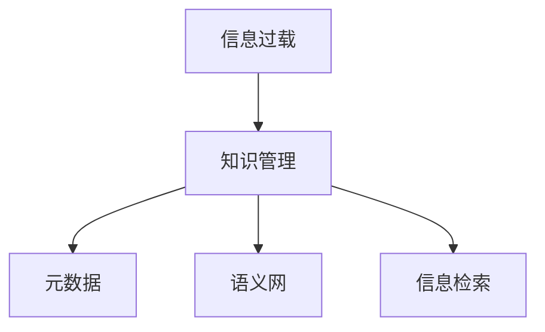

                 

# 信息过载与知识管理策略与实践：管理和组织信息

## 1. 背景介绍

### 1.1 问题由来
在信息时代，我们每天都在面对着海量的数据和信息，从互联网的搜索结果、社交媒体的帖文、邮件，到传感器采集的物联网数据。这些信息源源不断涌来，让我们应接不暇。信息过载不仅使得我们难以处理、理解这些信息，还会消耗大量时间和精力，降低工作效率，甚至影响我们的心理和身体健康。如何有效管理这些信息，使之转化为有价值的知识，成为现代社会中一个重要议题。

### 1.2 问题核心关键点
信息过载问题的主要核心在于两点：
- **信息量的巨大**：随着技术的发展，信息生成速度越来越快，存储和处理能力不断提高，使得信息量呈指数级增长。
- **信息质量的多样性**：这些信息来源广泛、格式不一，包含了噪音、垃圾信息，质量参差不齐。

要解决这些问题，需要一套系统的方法来对信息进行有效筛选、整合和组织，从而提炼出有价值的知识，供决策和实践使用。

## 2. 核心概念与联系

### 2.1 核心概念概述

为更好地理解信息管理和知识组织的方法，本节将介绍几个关键概念及其联系：

- **信息过载(Information Overload)**：指人们接收的信息超出自身处理能力的情况。这不仅指信息量的巨大，更关乎信息质量的良莠不齐。

- **知识管理(Knowledge Management)**：指组织或个人通过收集、整理、共享和应用信息，将隐性知识转化为显性知识的过程。知识管理的目标是最大化信息价值，为决策提供支持。

- **元数据(Metadata)**：描述数据的数据，如数据的来源、格式、结构等。元数据对于信息的组织和搜索至关重要。

- **语义网(Semantic Web)**：使用Web技术表达和检索语义信息，通过RDF等数据模型，实现信息的更深层次理解。

- **信息检索(Information Retrieval)**：通过算法对大量数据进行搜索、分类、索引，快速定位相关信息。

这些概念之间的逻辑关系可以通过以下Mermaid流程图来展示：



## 3. 核心算法原理 & 具体操作步骤
### 3.1 算法原理概述

知识管理的核心在于将杂乱无章的信息转化为结构化的知识。这一过程通常涉及以下几个步骤：

1. **信息采集**：从各种渠道收集相关信息。
2. **信息清洗**：对采集到的信息进行筛选、去重、纠错等处理，提高信息质量。
3. **信息组织**：通过分类、归档等方式对信息进行结构化处理，便于检索和应用。
4. **知识提炼**：利用算法和技术手段，将信息转化为可应用的显性知识。

具体到算法层面，知识管理过程主要依赖以下技术：

- **自然语言处理(NLP)**：对文本信息进行分词、实体识别、情感分析等处理，提取关键信息。
- **机器学习与数据挖掘**：利用算法模型对信息进行聚类、关联分析、分类等操作，发现信息间的关系和规律。
- **元数据管理**：通过元数据管理工具，对数据进行标准化和规范化处理，提高信息检索和共享效率。
- **语义网技术**：利用RDF等数据模型，构建语义图谱，实现信息的深层次理解和关联。

### 3.2 算法步骤详解

知识管理的算法步骤主要包括：

**Step 1: 信息采集与清洗**

1. **信息源收集**：通过爬虫、API、数据库等方式，从Web、社交媒体、文档、传感器等不同来源收集信息。
2. **信息预处理**：包括数据去重、格式转换、缺失值填充等预处理步骤，保证信息完整性和一致性。
3. **信息清洗**：通过自然语言处理、规则过滤等技术，去除噪音、错误信息，提高信息质量。

**Step 2: 信息组织与存储**

1. **信息分类**：通过算法模型对信息进行自动分类，如聚类算法、分类算法等。
2. **元数据标注**：为信息添加元数据，如创建时间、来源、重要性等，便于后续检索和管理。
3. **知识存储**：将信息存储在数据库、知识库中，使用RDF等语义模型表示信息间的关系。

**Step 3: 知识提炼与分析**

1. **知识抽取**：利用NLP、机器学习等技术，从信息中抽取关键实体、关系、概念等，构建知识图谱。
2. **关联分析**：通过数据挖掘技术，如关联规则、图谱分析等，发现信息间的关系和规律。
3. **知识应用**：将提炼出的知识应用于决策、预测、优化等任务中，实现信息价值最大化。

### 3.3 算法优缺点

知识管理算法的优点包括：

- **系统化处理**：利用算法和工具，对信息进行自动化的分类、清洗和组织，提高处理效率。
- **精确度提升**：通过机器学习等技术，提高信息检索和知识抽取的精确度。
- **知识复用**：将提炼出的知识存储于知识库中，供不同场景和任务使用，提高信息价值。

算法的主要缺点在于：

- **数据依赖性高**：需要高质量、大量结构化数据才能发挥效用。
- **算法复杂性高**：需要结合多种算法和技术，设计和实现较为复杂。
- **知识偏置**：算法可能受限于训练数据的质量和范围，导致知识提取有偏。

### 3.4 算法应用领域

知识管理算法已经在多个领域得到了广泛应用，包括：

- **企业决策支持**：通过知识管理技术，将分散的业务信息整合为结构化的知识，支持企业决策。
- **个性化推荐系统**：利用用户历史行为数据和知识图谱，实现个性化推荐。
- **搜索引擎优化**：通过元数据管理和信息检索技术，优化搜索引擎的搜索结果，提高用户满意度。
- **医疗信息管理**：将医疗数据和知识整合，辅助医生诊断和治疗。
- **科学研究**：通过知识图谱和关联分析，加速科研发现和知识传播。

## 4. 数学模型和公式 & 详细讲解  
### 4.1 数学模型构建

知识管理的数学模型主要涉及信息检索和知识图谱构建两个方面。

**信息检索模型**：假设有信息集合 $D=\{d_1, d_2, ..., d_n\}$，查询为 $q$。信息检索的目标是找到与查询最相关的文档子集 $D'=\{d_{i_1}, d_{i_2}, ..., d_{i_m}\}$，使得：

$$
f(D', q) = \max_{D'} f(D', q)
$$

其中 $f(D', q)$ 为信息检索函数，衡量查询与文档的相似度。

**知识图谱模型**：知识图谱通过RDF等语义模型表示实体、关系和属性。设实体 $e$ 有 $r$ 个属性，属性 $a_j$ 的值为 $v_{e_j}$，则实体 $e$ 的表示可以写为：

$$
e = (e_1, e_2, ..., e_r) = ((a_1, v_{e_1}), (a_2, v_{e_2}), ..., (a_r, v_{e_r}))
$$

其中 $e_j$ 为属性 $a_j$ 的取值。

### 4.2 公式推导过程

**信息检索公式推导**：假设信息集合 $D$ 中的每个文档 $d$ 与查询 $q$ 的相似度由向量空间模型表示，则 $f(D', q)$ 可以写为：

$$
f(D', q) = \frac{\sum_{d \in D'} \cos(\vec{d}, \vec{q})}{\sum_{d \in D'} ||\vec{d}||}
$$

其中 $\vec{d}$ 和 $\vec{q}$ 为文档和查询的向量表示，$\cos(\vec{d}, \vec{q})$ 为余弦相似度，$||\vec{d}||$ 为文档向量的长度。

**知识图谱公式推导**：假设知识图谱中的实体 $e_1$ 和 $e_2$ 有 $r$ 个共同属性 $a_1, a_2, ..., a_r$，则 $e_1$ 和 $e_2$ 的关系表示为：

$$
r = \sum_{i=1}^r \delta_{e_{1,i}} \cdot \delta_{e_{2,i}}
$$

其中 $\delta_{e_{1,i}}$ 和 $\delta_{e_{2,i}}$ 为 $e_1$ 和 $e_2$ 在属性 $a_i$ 上的取值。

### 4.3 案例分析与讲解

以一个简单的医疗知识图谱为例，分析知识图谱的构建和应用过程：

**案例背景**：某医院希望建立一个医疗知识图谱，用于辅助医生诊断和治疗。

**步骤1：数据收集**：从医院的信息管理系统、医学文献数据库、电子病历等渠道收集医疗数据。

**步骤2：数据清洗**：清洗重复、格式不一致的数据，补充缺失值，保证数据质量。

**步骤3：信息分类**：利用聚类算法对数据进行分类，如按疾病类型、治疗方法等分类。

**步骤4：元数据标注**：为每条数据添加元数据，如患者ID、病历号、诊断时间等，便于检索和共享。

**步骤5：知识图谱构建**：使用RDF等语义模型，将分类后的数据表示为实体和关系，构建医疗知识图谱。

**步骤6：知识应用**：利用图谱分析和关联规则，辅助医生进行疾病诊断、药物推荐等。

## 5. 项目实践：代码实例和详细解释说明
### 5.1 开发环境搭建

在进行知识管理项目开发前，我们需要准备好开发环境。以下是使用Python进行知识图谱开发的简单环境配置流程：

1. 安装Python：从官网下载并安装Python，建议选择3.8或更高版本。

2. 安装相关库：安装必要的Python库，如pandas、numpy、scikit-learn等。

3. 搭建数据仓库：使用MySQL、Hadoop、ElasticSearch等工具搭建数据仓库，用于存储和管理数据。

4. 安装图形化工具：安装Python的图形化界面工具，如Jupyter Notebook、PyCharm等，方便编写和调试代码。

完成上述步骤后，即可在本地或云端环境中开始知识管理项目的开发。

### 5.2 源代码详细实现

下面我们以构建医疗知识图谱为例，给出使用Python进行知识管理的代码实现。

首先，定义数据处理函数：

```python
import pandas as pd
from sklearn.cluster import KMeans
from sklearn.preprocessing import LabelEncoder

def preprocess_data(df):
    # 数据清洗
    df = df.drop_duplicates()
    df = df.dropna()
    
    # 数据标注
    label_encoder = LabelEncoder()
    df['label'] = label_encoder.fit_transform(df['label'])
    
    # 数据分类
    kmeans = KMeans(n_clusters=5, random_state=0).fit(df[['feature1', 'feature2', 'feature3']])
    df['cluster'] = kmeans.labels_
    
    return df
```

然后，定义知识图谱构建函数：

```python
from rdflib import Namespace, Graph, URIRef

def build_knowledge_graph(df):
    g = Graph()
    
    # 定义命名空间
    namespace = Namespace('http://example.org/')
    
    # 创建实体和关系
    for i, row in df.iterrows():
        e1 = URIRef(namespace + 'entity' + str(i))
        e2 = URIRef(namespace + 'entity' + str(i+1))
        g.add((e1, namespace + 'related', e2))
    
    # 输出知识图谱
    return g
```

最后，定义知识图谱查询函数：

```python
def query_knowledge_graph(g, query):
    # 构建查询图
    g_query = Graph()
    for relation, entity in query.split(' '):
        g_query.add((namespace[entity], namespace[relation], namespace[entity]))
    
    # 匹配查询图
    results = g.query(g_query.serialize(format='xml'))
    
    # 输出结果
    for result in results:
        print(result)
```

通过上述代码，可以完成医疗知识图谱的构建和查询。具体步骤包括：

1. 使用Pandas库对原始数据进行清洗和标注。
2. 使用KMeans算法对数据进行分类，确定实体和关系。
3. 使用RDFLib库构建知识图谱，表示实体和关系。
4. 使用SPARQL查询语言，从知识图谱中提取信息。

### 5.3 代码解读与分析

让我们再详细解读一下关键代码的实现细节：

**preprocess_data函数**：
- 数据清洗：使用Pandas的drop_duplicates和dropna方法去除重复和缺失数据。
- 数据标注：使用sklearn的LabelEncoder将类别变量进行编码，方便后续分析。
- 数据分类：使用KMeans算法对特征变量进行聚类，得到分类结果。

**build_knowledge_graph函数**：
- 定义命名空间：使用RDFLib的Namespace方法定义知识图谱的命名空间。
- 创建实体和关系：遍历数据集，为每对实体添加关系，构建知识图谱。
- 输出知识图谱：使用Graph类返回构建的知识图谱。

**query_knowledge_graph函数**：
- 构建查询图：使用SPARQL查询语言，将查询条件转换为图谱中的实体和关系。
- 匹配查询图：使用Graph类的query方法匹配查询图，提取匹配结果。
- 输出结果：遍历匹配结果，输出相关信息。

通过这些代码，可以完成从原始数据到知识图谱的构建，并通过查询图谱获取相关知识。

## 6. 实际应用场景
### 6.1 企业决策支持

企业在日常运营中会面临大量信息，包括市场分析报告、客户反馈、财务报表等。通过知识管理技术，将这些信息整理成结构化的知识，可以为企业决策提供有力支持。

**应用场景**：某大型企业希望优化其市场策略。企业收集了大量市场调研报告和客户反馈数据，希望从中提炼出关键信息，辅助市场部门制定决策。

**解决方案**：使用知识管理技术，将数据进行清洗、分类、标注和存储，构建企业知识图谱。市场部门可以通过查询图谱，获取市场趋势、客户偏好等信息，辅助制定市场策略。

### 6.2 个性化推荐系统

个性化推荐系统需要根据用户历史行为数据，推荐其可能感兴趣的内容。通过知识管理技术，可以从海量数据中提炼出用户兴趣和偏好，提供更加个性化的推荐。

**应用场景**：某在线视频平台希望提高用户留存率，提供个性化的视频推荐服务。

**解决方案**：平台收集用户观看历史、评分、点赞等信息，使用知识管理技术构建用户兴趣图谱。推荐算法可以从图谱中提取用户兴趣点，推荐相关视频，提高用户满意度。

### 6.3 搜索引擎优化

搜索引擎需要快速准确地匹配查询词，从海量数据中筛选出相关信息。通过知识管理技术，可以提高搜索引擎的准确性和效率。

**应用场景**：某电商企业希望提高其搜索引擎的搜索结果相关性，提升用户体验。

**解决方案**：企业将商品信息、用户评价、交易记录等数据进行清洗、分类、标注和存储，构建商品图谱。搜索引擎可以从图谱中快速匹配查询词，提供相关搜索结果。

### 6.4 未来应用展望

随着技术的不断进步，知识管理将迎来更多创新和突破：

- **深度学习**：利用深度学习技术，提升知识图谱的构建和查询效率，挖掘信息间的深层关系。
- **自然语言处理**：结合NLP技术，从文本中提取关键信息，构建更精准的知识图谱。
- **联邦学习**：利用联邦学习技术，在不同节点上协同构建知识图谱，提高数据隐私和安全性。
- **跨领域知识融合**：结合跨领域知识图谱，构建更加全面的知识体系，支持更广泛的应用场景。

## 7. 工具和资源推荐
### 7.1 学习资源推荐

为了帮助开发者系统掌握知识管理的技术基础和实践技巧，这里推荐一些优质的学习资源：

1. 《知识图谱构建与分析》系列书籍：详细介绍了知识图谱的基本概念、构建方法和应用实例，是知识管理领域的经典教材。

2. 《大数据与信息管理》课程：斯坦福大学开设的课程，讲解大数据与信息管理的基本原理和实践方法。

3. 《深度学习与知识图谱》博客：由深度学习专家撰写，介绍深度学习在知识图谱中的应用，包含大量的代码实现和案例分析。

4. Semantic Web wiki：提供语义网技术的学习资源，包括相关论文、工具和应用案例，适合深入研究语义网技术。

5. Kaggle平台：提供各类数据集和竞赛项目，通过实际项目练习，提升知识管理技能。

通过对这些资源的学习实践，相信你一定能够快速掌握知识管理的技术要点，并用于解决实际的业务问题。

### 7.2 开发工具推荐

高效的开发离不开优秀的工具支持。以下是几款用于知识管理开发的常用工具：

1. Python语言：通用性强，拥有丰富的数据处理和机器学习库，如Pandas、NumPy、scikit-learn等，适合快速迭代研究。

2. RDFLib库：开源的RDF处理库，支持知识图谱的构建和查询，是构建语义网应用的重要工具。

3. Jupyter Notebook：免费的交互式开发环境，支持Python和其他语言的混合编程，适合数据探索和模型实验。

4. PyCharm IDE：功能强大的Python集成开发环境，支持代码高亮、调试、版本控制等，适合大规模项目开发。

5. Apache Cassandra：开源的分布式数据库，适合存储大规模知识图谱，支持高可用和高扩展性。

合理利用这些工具，可以显著提升知识管理项目的开发效率，加快创新迭代的步伐。

### 7.3 相关论文推荐

知识管理技术的进展得益于学界的持续研究。以下是几篇奠基性的相关论文，推荐阅读：

1. Knowledge Discovery in Databases: Algorithms and Applications：描述了知识发现的基本概念、算法和应用，是知识管理领域的经典之作。

2. The Principles of Knowledge Representation and Reasoning：介绍了知识表示和推理的基本原理和应用方法，是语义网领域的权威教材。

3. Semantic Web Services and Semantic Mashups：探讨了语义网服务在互联网中的应用，强调了跨领域知识的融合。

4. How to Assemble Webmined Knowledge Sources into a Semantic Graph：介绍了一种从Web数据中构建知识图谱的方法，适用于大规模语义网应用。

5. Building a Knowledge Graph from Crowdsourced Wikipedia Articles：提出了一种从维基百科文章中构建知识图谱的方法，提高了知识图谱构建的效率和质量。

这些论文代表了大规模知识管理的最新进展，通过学习这些前沿成果，可以帮助研究者把握学科前进方向，激发更多的创新灵感。

## 8. 总结：未来发展趋势与挑战

### 8.1 总结

本文对知识管理技术进行了全面系统的介绍。首先阐述了信息过载问题的背景和核心关键点，明确了知识管理在提升信息价值、支持决策方面的重要性。其次，从原理到实践，详细讲解了知识管理的数学模型和操作步骤，给出了知识管理任务开发的完整代码实例。同时，本文还广泛探讨了知识管理技术在企业决策支持、个性化推荐、搜索引擎优化等多个领域的应用前景，展示了知识管理技术的广阔潜力。此外，本文精选了知识管理技术的各类学习资源，力求为读者提供全方位的技术指引。

通过本文的系统梳理，可以看到，知识管理技术正在成为信息时代的重要支撑，极大地提升了信息处理和应用的效率和精度。未来，伴随深度学习、自然语言处理、联邦学习等技术的不断发展，知识管理技术必将在更多领域得到应用，为社会经济的发展带来深远影响。

### 8.2 未来发展趋势

展望未来，知识管理技术将呈现以下几个发展趋势：

1. **深度学习融合**：利用深度学习技术，提高知识图谱的构建和查询效率，挖掘信息间的深层关系。

2. **自然语言处理强化**：结合NLP技术，从文本中提取关键信息，构建更精准的知识图谱。

3. **跨领域知识融合**：结合跨领域知识图谱，构建更加全面的知识体系，支持更广泛的应用场景。

4. **联邦学习应用**：利用联邦学习技术，在不同节点上协同构建知识图谱，提高数据隐私和安全性。

5. **知识图谱动态更新**：构建动态知识图谱，实时更新信息，保持知识的时效性和准确性。

以上趋势凸显了知识管理技术的巨大前景。这些方向的探索发展，必将进一步提升知识管理系统的性能和应用范围，为构建智能化的信息社会铺平道路。

### 8.3 面临的挑战

尽管知识管理技术已经取得了显著成就，但在迈向更加智能化、普适化应用的过程中，它仍面临诸多挑战：

1. **数据质量瓶颈**：知识管理依赖高质量、结构化数据，数据采集和清洗成本高，数据质量难以保证。

2. **算法复杂性高**：知识管理算法涉及多种技术和工具，设计和实现较为复杂。

3. **知识偏置问题**：算法可能受限于训练数据的质量和范围，导致知识提取有偏。

4. **隐私和安全风险**：知识管理涉及大量敏感数据，数据隐私和安全问题尤为突出。

5. **知识图谱构建效率低**：大规模知识图谱的构建需要耗费大量时间和资源，难以适应快速变化的信息环境。

正视知识管理面临的这些挑战，积极应对并寻求突破，将是大规模知识管理技术走向成熟的必由之路。相信随着学界和产业界的共同努力，这些挑战终将一一被克服，知识管理技术必将在构建智能化的信息社会中扮演越来越重要的角色。

### 8.4 研究展望

面对知识管理技术面临的种种挑战，未来的研究需要在以下几个方面寻求新的突破：

1. **高效知识图谱构建**：开发高效的知识图谱构建算法，提高数据清洗和分类的效率，降低构建成本。

2. **智能知识发现**：利用深度学习等技术，提升知识发现和抽取的准确度，发现隐含的深层关系。

3. **知识图谱动态维护**：构建动态知识图谱，实时更新信息，保持知识的时效性和准确性。

4. **跨领域知识融合**：结合跨领域知识图谱，构建更加全面的知识体系，支持更广泛的应用场景。

5. **知识图谱的可视化**：开发知识图谱的可视化工具，帮助用户直观理解和管理知识图谱。

这些研究方向和突破，将进一步推动知识管理技术的发展，为构建智能化的信息社会提供更多可能性。总之，知识管理需要从数据、算法、工程、业务等多个维度协同发力，才能真正实现其价值。

## 9. 附录：常见问题与解答

**Q1：知识管理技术如何适用于企业决策支持？**

A: 知识管理技术通过收集、整理、共享和应用信息，将隐性知识转化为显性知识，支持企业决策。具体来说，知识管理可以：
- 整合企业内部和外部的信息资源，构建知识图谱。
- 通过查询图谱，获取关键信息，辅助决策。
- 提供定制化的报告和分析，支持高层管理决策。

**Q2：知识图谱如何构建？**

A: 知识图谱的构建一般包括以下步骤：
1. 数据采集：从各种数据源（如数据库、Web、文档等）采集数据。
2. 数据清洗：去除重复、缺失数据，补充缺失值。
3. 数据标注：为数据添加元数据，便于后续处理。
4. 数据分类：利用聚类、分类等算法，对数据进行分类和标注。
5. 图谱构建：使用RDF等语义模型，将数据表示为实体和关系，构建知识图谱。

**Q3：知识管理技术有哪些挑战？**

A: 知识管理技术面临以下挑战：
1. 数据质量瓶颈：知识管理依赖高质量、结构化数据，数据采集和清洗成本高。
2. 算法复杂性高：知识管理算法涉及多种技术和工具，设计和实现较为复杂。
3. 知识偏置问题：算法可能受限于训练数据的质量和范围，导致知识提取有偏。
4. 隐私和安全风险：知识管理涉及大量敏感数据，数据隐私和安全问题尤为突出。
5. 知识图谱构建效率低：大规模知识图谱的构建需要耗费大量时间和资源。

**Q4：知识管理技术如何应用于个性化推荐系统？**

A: 个性化推荐系统通过知识管理技术，从用户历史行为数据中提取用户兴趣和偏好，构建用户兴趣图谱。具体来说，知识管理可以：
- 收集用户历史行为数据，构建用户兴趣图谱。
- 从图谱中提取用户兴趣点，提供个性化的推荐。
- 实时更新推荐结果，满足用户动态需求。

**Q5：知识图谱的构建方法有哪些？**

A: 知识图谱的构建方法包括：
1. 数据抽取：从文本、数据库、Web等数据源中抽取实体和关系。
2. 数据清洗：去除重复、噪声数据，补充缺失值。
3. 数据标注：为数据添加元数据，便于后续处理。
4. 图谱构建：使用RDF等语义模型，将数据表示为实体和关系，构建知识图谱。

通过这些方法，可以构建不同类型的知识图谱，满足不同的应用需求。

---

作者：禅与计算机程序设计艺术 / Zen and the Art of Computer Programming

