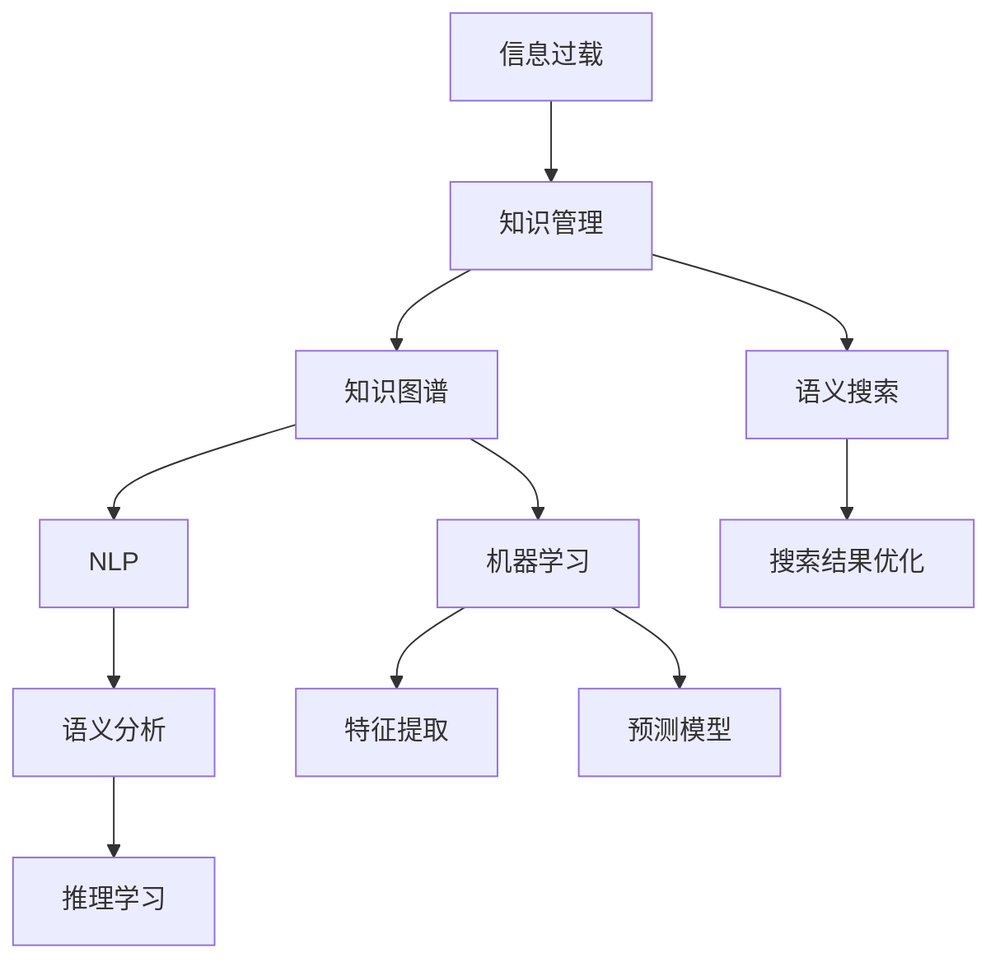

                 

# 信息过载与知识管理系统实施指南：有效组织和检索信息

> 关键词：信息过载,知识管理,知识图谱,语义搜索,机器学习,自然语言处理,NLP

## 1. 背景介绍

### 1.1 问题由来

在信息时代，信息的爆炸式增长给个人和企业带来了前所未有的便利，同时也引发了信息过载的困扰。过量的信息不仅容易让人无所适从，还可能淹没真正有价值的知识，影响决策和创新。据统计，每天产生的数据量高达2.5千亿字节，信息的真实价值在其中的占比不足10%。

知识管理(Knowledge Management, KMS)的目标就是通过系统化的方法，将这些零散的、无序的信息转变为系统化的、结构化的知识，帮助组织和个人更有效地利用信息。但随着数据规模的扩大和复杂度的提升，传统的文档管理、文件搜索等方法已经难以适应当前的需求。

## 2. 核心概念与联系

### 2.1 核心概念概述

为更好地理解知识管理系统，我们首先需要梳理几个核心概念：

- **信息过载(Information Overload)**：指信息量巨大到超出了人们处理能力的状态，常见表现为无法及时处理和有效利用信息，影响工作效率和决策质量。

- **知识管理(Knowledge Management)**：指通过系统化的方法，整合、管理和运用组织中的各类知识，提高知识共享、传递和利用效率。

- **知识图谱(Knowledge Graph)**：指利用图结构来表示实体和实体之间的关系，以支持高效的语义搜索和知识推理。

- **语义搜索(Semantic Search)**：指通过理解查询词的含义，自动匹配语义相关的信息，以提高搜索的准确性和相关性。

- **机器学习(Machine Learning)**：指通过算法和模型，自动从数据中学习规律和知识，用于预测、分类、聚类等任务。

- **自然语言处理(Natural Language Processing, NLP)**：指利用计算机处理、理解、生成自然语言，是知识管理系统的重要组成部分。

这些概念之间的联系通过以下Mermaid流程图展示：



## 3. 核心算法原理 & 具体操作步骤

### 3.1 算法原理概述

知识管理系统的核心算法围绕着信息抽取、语义建模、搜索匹配和推荐展开。其原理可以简单概括为：

1. **信息抽取**：从海量的非结构化数据中，提取出有价值的信息实体，如文档标题、关键词、实体关系等。
2. **语义建模**：将抽取的信息转化为语义化的知识图谱或文档结构，以支持高效的检索和推理。
3. **搜索匹配**：通过语义搜索算法，将查询词与知识图谱中的实体和关系进行匹配，找到最相关的结果。
4. **推荐算法**：根据用户的历史行为和偏好，通过推荐算法为用户推荐最相关的信息。

### 3.2 算法步骤详解

下面详细介绍知识管理系统的核心算法步骤：

**Step 1: 信息抽取**

信息抽取的目标是从文本数据中自动提取出实体、关系和属性等信息，常见方法包括：

1. **命名实体识别(Named Entity Recognition, NER)**：识别出文本中的组织、人名、地点等实体。
2. **关系抽取(Relation Extraction)**：识别出实体之间的关系，如“谁”和“谁”之间的关系。
3. **属性抽取(Attribute Extraction)**：从实体中提取出关键属性，如人名中的性别、年龄等。

信息抽取的实现通常依赖于NLP技术和机器学习模型，如基于规则的抽取、基于统计的抽取、基于深度学习的抽取等。

**Step 2: 语义建模**

语义建模的核心任务是将信息转化为语义化的知识表示，常见方法包括：

1. **知识图谱(Knowledge Graph)**：利用图结构表示实体和关系，如RDF、GraphDB等。
2. **文档结构化(Document Structure)**：将文本转化为结构化的层次结构，如MD5、HuggingFace等。

知识图谱和文档结构化技术能够帮助系统更高效地理解、存储和检索信息。

**Step 3: 搜索匹配**

语义搜索算法的目标是通过理解查询词的含义，找到与之语义相关的信息。常见方法包括：

1. **倒排索引(Inverted Index)**：将文档内容倒排存储，快速定位到包含查询词的文档。
2. **向量空间模型(Vector Space Model, VSM)**：将查询词和文档表示为向量，计算它们之间的相似度。
3. **语义检索(Semantic Retrieval)**：利用深度学习模型，如BERT、GPT等，理解查询词和文档的语义关系。

搜索匹配算法的效果直接影响知识管理的效率和效果。

**Step 4: 推荐算法**

推荐算法通过分析用户的历史行为和偏好，为用户推荐最相关的信息。常见方法包括：

1. **协同过滤(Collaborative Filtering)**：根据用户和物品之间的相似度，推荐相似的物品。
2. **基于内容的推荐(Content-based Recommendation)**：根据物品的特征，推荐与用户偏好相似的物品。
3. **混合推荐(Mixed Recommendation)**：综合多种推荐方法，取长补短，提高推荐效果。

推荐算法需要依赖大量的用户行为数据，对数据的实时性和多样性要求较高。

### 3.3 算法优缺点

知识管理系统的核心算法具有以下优点：

1. **高效性**：能够快速从海量数据中抽取和匹配信息，提升知识管理的效率。
2. **准确性**：利用语义搜索和推荐算法，提供更相关、更有价值的信息。
3. **可扩展性**：能够处理大规模数据集，适应不同领域和场景的知识管理需求。

但同时也存在一些局限性：

1. **依赖数据质量**：系统的性能很大程度上依赖于数据的质量和完备性。
2. **模型复杂度高**：信息抽取、语义建模、搜索匹配等步骤涉及复杂算法，对计算资源要求较高。
3. **动态更新困难**：知识图谱和推荐模型的更新需要较长时间，难以快速适应新数据和新需求。

## 4. 数学模型和公式 & 详细讲解 & 举例说明

### 4.1 数学模型构建

假设知识图谱中的实体和关系可以表示为$G=(E,R)$，其中$E$为实体集合，$R$为关系集合。实体和关系之间的关联表示为$E_{ij} \in R$，表示实体$i$与实体$j$之间存在关系$E_{ij}$。

知识图谱可以表示为一个有向图，其中节点表示实体，边表示实体之间的关系。利用图神经网络(Graph Neural Network, GNN)，可以从图结构中提取实体之间的关联信息。

**公式推导过程**

设实体$i$的属性表示为$\mathbf{x}_i \in \mathbb{R}^d$，关系$E_{ij}$的属性表示为$\mathbf{r}_{ij} \in \mathbb{R}^d$。则实体$i$的属性更新公式为：

$$
\mathbf{x}_i^{t+1} = \mathbf{x}_i^t + \alpha \sum_{j \in N(i)} \mathbf{r}_{ij} (\mathbf{x}_j^t)
$$

其中，$N(i)$表示与实体$i$直接相连的实体集合，$\alpha$为学习率。

通过多轮迭代，实体$i$的属性将逐渐融合其邻居实体的属性，形成更全面的表示。

### 4.2 案例分析与讲解

以知识图谱中的医疗信息为例，考虑一个包含医生、医院、疾病、药物等实体的知识图谱，其中实体之间的关系可能包括治疗关系、诊断关系等。利用图神经网络，可以高效地进行信息抽取和关联推理。

假设医生$i$的诊疗能力表示为$\mathbf{x}_i$，疾病$j$的严重程度表示为$\mathbf{x}_j$。根据治疗关系$E_{ij}$，可以得到如下推理公式：

$$
\mathbf{x}_i = f(\mathbf{x}_i, \mathbf{x}_j, \mathbf{r}_{ij})
$$

其中，$f$为推理函数，$\mathbf{r}_{ij}$表示治疗关系的相关属性。通过反复迭代，医生$i$可以逐渐了解其对多种疾病$j$的诊疗能力，形成更全面的诊疗知识表示。

### 4.3 实践案例

例如，在医疗领域，可以利用知识图谱和推荐算法，帮助医生快速找到最适合的治疗方案。具体步骤包括：

1. **信息抽取**：从电子病历、研究论文等数据中，提取出医生、疾病、药物等实体，以及它们之间的关系。
2. **语义建模**：构建医疗知识图谱，将实体和关系存储为图结构。
3. **搜索匹配**：根据患者症状，利用语义搜索算法，匹配最相关的疾病和药物。
4. **推荐算法**：根据医生的历史诊疗记录，推荐最合适的治疗方案。

## 5. 项目实践：代码实例和详细解释说明

### 5.1 开发环境搭建

知识管理系统通常需要依赖于多种开源工具和技术栈。以下是常见的开发环境搭建流程：

1. **安装Python**：推荐安装3.8及以上版本。可以使用Anaconda或Miniconda创建虚拟环境，保证项目依赖隔离。
```bash
conda create -n kms-env python=3.8
conda activate kms-env
```

2. **安装相关库**：安装TensorFlow、PyTorch、Scikit-learn、NLTK等常用库。
```bash
pip install tensorflow pytorch scikit-learn nltk transformers
```

3. **搭建知识图谱**：可以使用Neo4j、Neo4j-GraphDB等图数据库，存储和管理知识图谱。
4. **搭建搜索服务**：可以使用Elasticsearch、Solr等搜索引擎，实现高效搜索匹配。
5. **搭建推荐系统**：可以使用TensorFlow或PyTorch搭建推荐模型，实现个性化推荐。

### 5.2 源代码详细实现

以下是一个使用TensorFlow和Keras构建知识图谱的示例代码：

```python
import tensorflow as tf
from tensorflow.keras.layers import Input, Dense, Embedding, GraphConv

# 定义节点和边
node1 = Input(shape=(1,), name='node1')
node2 = Input(shape=(1,), name='node2')
edge = tf.keras.layers.Dot(dot='square_euclidean', normalize=True)([node1, node2])

# 定义图卷积层
graph = tf.keras.layers.Graph()
graph.add_input(node1)
graph.add_input(node2)
graph.add_input(edge)
graph.add_node(Embedding(input_dim=10, output_dim=10, mask_zero=True)(graph.output_edge))
graph.add_node(Dense(10)(graph.output_edge))
graph.add_node(GraphConv(10, activation='relu', use_bias=False)(graph.output_edge))

# 定义训练过程
model = tf.keras.Model(inputs=[node1, node2], outputs=graph.output_edge)
model.compile(optimizer='adam', loss='mse')
model.fit([node1, node2], graph.output_edge, epochs=10, batch_size=32)
```

### 5.3 代码解读与分析

**代码解读**

1. **定义节点和边**：使用`Input`层定义节点和边，使用`Dot`层计算节点之间的距离。
2. **定义图卷积层**：通过`Graph`层定义图结构，添加节点和边，并使用`Embedding`、`Dense`和`GraphConv`层进行图卷积运算。
3. **定义训练过程**：使用`Model`层定义输入和输出，使用`compile`方法配置优化器和损失函数，使用`fit`方法进行模型训练。

**代码分析**

- **节点和边的定义**：在知识图谱中，节点表示实体，边表示实体之间的关系。通过`Input`层定义节点和边，可以使用图卷积层对图结构进行特征提取。
- **图卷积层的定义**：通过`Graph`层定义图结构，添加节点和边，并使用`Embedding`、`Dense`和`GraphConv`层进行图卷积运算。`Embedding`层用于将节点表示为向量，`Dense`层用于对节点进行线性变换，`GraphConv`层用于进行图卷积运算。
- **训练过程的定义**：使用`Model`层定义输入和输出，使用`compile`方法配置优化器和损失函数，使用`fit`方法进行模型训练。

### 5.4 运行结果展示

在知识图谱训练完成后，可以通过可视化工具展示图结构和节点之间的关系。例如，使用GraphViz工具可以将知识图谱中的实体和关系转换为图形，方便查看和分析。

## 6. 实际应用场景

### 6.1 智慧医疗

在智慧医疗领域，知识管理系统可以广泛应用于医疗决策支持、临床路径优化、疾病预测等领域。

**医疗决策支持**：利用知识图谱和推荐算法，帮助医生快速查找相关病例和治疗方法，提供最优的治疗方案。

**临床路径优化**：通过知识图谱和深度学习模型，分析病历数据，优化诊疗流程，减少误诊和误治。

**疾病预测**：利用知识图谱中的统计信息和预测模型，对疾病进行早期预警和预防。

### 6.2 企业知识管理

在企业知识管理领域，知识管理系统可以应用于知识文档管理、知识检索、知识推荐等场景。

**知识文档管理**：通过知识图谱和文档结构化技术，对企业的各类文档进行分类和归档，方便搜索和管理。

**知识检索**：利用语义搜索算法，快速定位到相关的知识和文档，提升信息检索效率。

**知识推荐**：根据员工的历史行为和偏好，推荐最相关的文档和信息，提高知识共享和利用效率。

### 6.3 金融领域

在金融领域，知识管理系统可以应用于风险评估、投资策略优化、市场分析等场景。

**风险评估**：通过知识图谱和推荐算法，分析客户数据和市场信息，评估金融风险，制定风险管理策略。

**投资策略优化**：利用知识图谱和深度学习模型，分析历史数据和市场趋势，优化投资组合，提高投资回报率。

**市场分析**：利用知识图谱和自然语言处理技术，分析新闻、公告等文本数据，预测市场走势，提供投资建议。

## 7. 工具和资源推荐

### 7.1 学习资源推荐

为了帮助开发者掌握知识管理系统的相关技术，以下是一些优质的学习资源：

1. **《知识图谱与语义技术》**：系统介绍了知识图谱的基本概念、构建方法、应用场景，适合初学者入门。
2. **Keras官方文档**：详细的Keras教程和示例代码，帮助开发者快速上手深度学习。
3. **Stanford NLP课程**：斯坦福大学开设的NLP课程，包含语义搜索和自然语言处理等内容，适合进阶学习。
4. **Elasticsearch官方文档**：详细的Elasticsearch教程和API文档，帮助开发者构建高效搜索系统。

### 7.2 开发工具推荐

以下是一些常用的知识管理系统开发工具：

1. **TensorFlow**：谷歌开发的深度学习框架，支持大规模模型训练和优化。
2. **PyTorch**：Facebook开发的深度学习框架，灵活高效，适合快速迭代研究。
3. **Neo4j**：流行的图数据库，支持复杂图结构的存储和管理。
4. **Elasticsearch**：流行的搜索引擎，支持高效的语义搜索和文本分析。
5. **NLTK**：自然语言处理工具包，提供丰富的文本处理和分析功能。

### 7.3 相关论文推荐

以下是一些关于知识管理系统的重要论文，推荐阅读：

1. **《Knowledge Graph: A Structured Representation for Semantic Search》**：介绍知识图谱的基本概念和构建方法，适合入门学习。
2. **《Knowledge Graph Embeddings》**：介绍知识图谱中的实体和关系表示，适合进阶学习。
3. **《Semantic Search in Information Retrieval》**：介绍语义搜索的基本原理和应用，适合深入学习。
4. **《Neural Architecture for Knowledge Graphs》**：介绍基于神经网络的图结构表示方法，适合研究前沿技术。

## 8. 总结：未来发展趋势与挑战

### 8.1 总结

本文对知识管理系统进行了全面系统的介绍，从核心算法原理到实际应用场景，详细讲解了知识管理系统的构建方法和实践应用。通过本文的系统梳理，可以看到，知识管理系统能够有效组织和检索信息，提升信息管理的效率和质量。

## 9. 附录：常见问题与解答

**Q1：知识管理系统的核心算法有哪些？**

A: 知识管理系统的核心算法包括信息抽取、语义建模、搜索匹配和推荐算法。信息抽取用于从文本中提取出实体、关系和属性；语义建模用于将信息转化为语义化的知识表示；搜索匹配用于通过语义搜索算法，匹配查询词与知识图谱中的实体和关系；推荐算法用于根据用户的历史行为和偏好，为用户推荐最相关的信息。

**Q2：知识管理系统如何高效抽取实体和关系？**

A: 知识管理系统通常依赖于自然语言处理技术，如命名实体识别(NER)和关系抽取(RE)等。这些技术通过分析文本数据，自动识别出其中的实体和关系。例如，利用BERT等预训练模型进行NER和RE任务，能够自动提取出文本中的重要信息，并构建知识图谱。

**Q3：知识管理系统如何提高检索效率？**

A: 知识管理系统通常采用语义搜索算法，如向量空间模型(VSM)和语义检索(Semantic Retrieval)等。这些算法通过理解查询词的含义，自动匹配语义相关的信息，以提高搜索的准确性和相关性。例如，利用BERT等预训练模型进行语义搜索，能够快速定位到最相关的信息，提升检索效率。

**Q4：知识管理系统如何构建推荐系统？**

A: 知识管理系统通常采用协同过滤(CF)、基于内容的推荐(Content-based)和混合推荐(Mixed)等方法。这些方法通过分析用户的历史行为和偏好，为用户推荐最相关的信息。例如，利用协同过滤算法，根据用户和物品之间的相似度，推荐相似的物品；利用基于内容的推荐算法，根据物品的特征，推荐与用户偏好相似的物品；利用混合推荐算法，综合多种推荐方法，取长补短，提高推荐效果。

**Q5：知识管理系统的应用场景有哪些？**

A: 知识管理系统可以应用于智慧医疗、企业知识管理、金融领域等多个场景。例如，在智慧医疗领域，可以应用于医疗决策支持、临床路径优化、疾病预测等；在企业知识管理领域，可以应用于知识文档管理、知识检索、知识推荐等；在金融领域，可以应用于风险评估、投资策略优化、市场分析等。

---

作者：禅与计算机程序设计艺术 / Zen and the Art of Computer Programming

