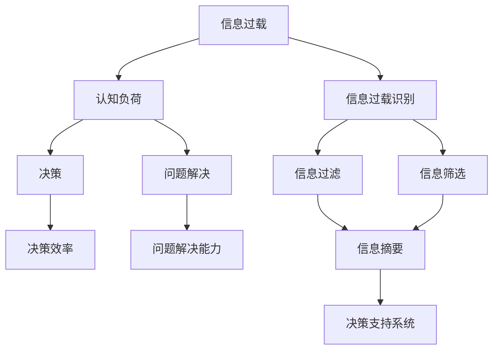

                 

# 信息过载与认知负荷管理：提高决策和问题解决能力的策略

在信息爆炸的时代，人们每天都在面对海量的信息，无论是来自社交媒体、新闻网站、电子邮件还是即时通讯。尽管信息获取变得更加容易，但过量的信息也带来了信息过载（Information Overload）的问题。信息过载不仅会导致认知负荷（Cognitive Load）的增加，还会影响决策和问题解决能力。因此，本文旨在探讨如何通过认知负荷管理策略，有效提高个人和团队的决策和问题解决能力。

## 1. 背景介绍

### 1.1 问题由来
随着互联网和数字技术的发展，人们获取信息变得前所未有的容易。然而，这同时也带来了信息过载的问题。信息过载指的是个体或组织接收到的信息超出其处理能力的状况。过多的信息可能导致注意力分散、决策效率下降，甚至出现认知障碍。因此，认知负荷管理变得尤为重要。

### 1.2 问题核心关键点
信息过载和认知负荷管理涉及的关键问题包括：
- 信息过载的识别与量化：如何准确评估信息过载的程度。
- 认知负荷的分配与优化：如何合理分配和管理认知资源，减少决策和问题解决过程中的负担。
- 决策和问题解决能力的提升：如何通过认知负荷管理策略，提高个人和团队的决策效率和问题解决能力。

## 2. 核心概念与联系

### 2.1 核心概念概述
- **信息过载（Information Overload）**：指个体或组织接收到的信息超出其处理能力的状况，可能导致注意力分散、决策效率下降。
- **认知负荷（Cognitive Load）**：指个体在执行认知任务时所承受的认知负担，包括工作记忆负荷、心理负荷等。
- **决策（Decision Making）**：指个体或团队基于信息和认知资源，做出选择的心理过程。
- **问题解决（Problem Solving）**：指个体或团队识别、分析和解决特定问题的心理过程。
- **认知负荷管理（Cognitive Load Management）**：指通过策略和工具，有效管理和减少认知负荷，提高决策和问题解决能力的方法。

这些核心概念之间的逻辑关系可以通过以下Mermaid流程图来展示：



这个流程图展示了个体在面对信息过载时，如何通过认知负荷管理策略，提升决策和问题解决能力的过程。

## 3. 核心算法原理 & 具体操作步骤

### 3.1 算法原理概述
信息过载和认知负荷管理的核心在于合理分配和管理认知资源，减少信息处理过程中的负担，提高决策和问题解决能力。主要策略包括：

- **信息过滤（Information Filtering）**：通过算法或规则，过滤掉不相关或低价值的信息，减少注意力分散。
- **信息摘要（Information Summarization）**：对信息进行压缩和提炼，减少冗余信息，简化决策过程。
- **决策支持系统（Decision Support System, DSS）**：利用人工智能、数据分析等技术，辅助决策和问题解决，提供更科学、高效的信息处理。

### 3.2 算法步骤详解
以下详细介绍信息过载和认知负荷管理的具体操作步骤：

**Step 1: 信息过载识别**
- **数据收集**：使用日志、问卷、传感器等工具，收集个体或组织的信息获取和处理行为数据。
- **分析评估**：使用统计分析、机器学习等方法，识别信息过载的信号，如频繁中断、低效率、高压力等。

**Step 2: 信息过滤**
- **规则设定**：根据用户偏好、任务重要性等设定过滤规则，如时间窗口、关键词过滤等。
- **算法应用**：使用基于规则、机器学习等算法，自动过滤掉不相关或低价值的信息。

**Step 3: 信息摘要**
- **文本摘要**：使用自然语言处理技术，自动提取文本的精华，生成摘要信息。
- **图像压缩**：使用图像处理技术，对图像信息进行压缩和提炼，减少处理时间。

**Step 4: 决策支持系统**
- **数据集成**：将信息摘要、历史数据、专家知识等集成到一个系统中。
- **模型训练**：使用机器学习、深度学习等技术，训练决策模型，提供决策建议。
- **用户交互**：通过用户界面，提供决策支持系统的结果和建议，辅助用户进行决策。

### 3.3 算法优缺点
信息过载和认知负荷管理的优势包括：
- **提高效率**：通过信息过滤和摘要，减少注意力分散，提高决策和问题解决的效率。
- **科学决策**：利用决策支持系统，提供基于数据的决策建议，减少主观偏见。
- **增强可靠性**：通过集成历史数据和专家知识，提升决策和问题解决的准确性。

然而，该方法也存在一定的局限性：
- **技术依赖**：对信息过滤、信息摘要和决策支持系统的技术要求较高。
- **数据质量**：系统的性能依赖于数据的准确性和完整性，数据不完整或不准确可能导致错误决策。
- **用户体验**：如果系统设计不合理，可能导致用户体验下降，甚至抵触使用。

### 3.4 算法应用领域

信息过载和认知负荷管理技术在多个领域都有广泛的应用，包括但不限于：

- **医疗**：帮助医生快速获取和处理海量患者数据，辅助诊断和治疗决策。
- **金融**：协助分析师处理和分析大量的金融数据，辅助投资和风险管理。
- **企业**：支持企业决策者快速获取和处理市场信息，优化运营和战略决策。
- **政府**：辅助政府部门处理和分析大量的公共数据，提高政策制定和执行效率。

## 4. 数学模型和公式 & 详细讲解  
### 4.1 数学模型构建

为了更准确地评估信息过载和认知负荷，可以构建数学模型。假设个体每天接收到的信息量为 $I$，所需处理的信息量为 $J$，则信息过载的程度可以通过以下公式衡量：

$$
O = \frac{I}{J}
$$

其中 $O$ 表示信息过载的程度，$I$ 表示每天接收到的信息量，$J$ 表示每天所需处理的信息量。当 $O > 1$ 时，个体可能面临信息过载的问题。

### 4.2 公式推导过程

根据信息处理模型，信息过载的程度可以进一步分解为：

$$
O = \frac{I}{J} = \frac{I_1 + I_2 + \ldots + I_n}{J_1 + J_2 + \ldots + J_n}
$$

其中 $I_1, I_2, \ldots, I_n$ 表示不同来源的信息量，$J_1, J_2, \ldots, J_n$ 表示不同处理任务所需的信息量。这个公式表明，信息过载的程度不仅取决于接收到的总信息量，还取决于不同信息源和处理任务对认知资源的需求。

### 4.3 案例分析与讲解

以下通过一个具体的案例，说明如何通过信息过载管理，提高决策和问题解决能力：

**案例背景**：一家大型跨国企业每天接收大量的市场数据和内部报告，信息过载导致决策效率下降，误判风险增加。

**解决方案**：
1. **信息过滤**：通过机器学习算法，分析历史数据，识别出高价值的信息源，屏蔽低价值的信息。
2. **信息摘要**：使用自然语言处理技术，自动提取重要事件和关键指标，生成简洁的信息摘要。
3. **决策支持系统**：集成市场分析、财务数据和专家知识，构建决策模型，提供决策建议。

通过上述方法，企业能够有效管理和减少信息过载，提高决策和问题解决能力。

## 5. 项目实践：代码实例和详细解释说明

### 5.1 开发环境搭建

为了实现信息过载和认知负荷管理，需要使用多种技术和工具。以下列出开发环境搭建的步骤：

1. **Python环境配置**：安装Python 3.8及以上版本，推荐使用Anaconda进行环境管理。
2. **数据收集工具**：使用日志分析工具（如Logstash、ELK Stack）、问卷调查工具（如SurveyMonkey）、传感器（如心率传感器、鼠标轨迹传感器）等，收集用户的信息获取和处理行为数据。
3. **自然语言处理库**：安装NLTK、spaCy、HuggingFace等自然语言处理库，用于信息摘要和文本分析。
4. **机器学习库**：安装scikit-learn、TensorFlow、PyTorch等机器学习库，用于信息过滤和决策支持系统。

### 5.2 源代码详细实现

以下是一个基于Python和NLTK库的信息过滤和摘要示例：

```python
import nltk
from nltk.corpus import stopwords
from nltk.tokenize import word_tokenize
from nltk.stem import PorterStemmer

# 信息过滤
def filter_information(text):
    # 去除停用词
    stop_words = set(stopwords.words('english'))
    filtered_text = ' '.join([word for word in word_tokenize(text) if word.lower() not in stop_words])
    # 词干提取
    stemmer = PorterStemmer()
    stemmed_text = ' '.join([stemmer.stem(word) for word in filtered_text.split()])
    return stemmed_text

# 信息摘要
def summarize_text(text, n_words=100):
    # 分词和去除停用词
    stop_words = set(stopwords.words('english'))
    tokens = word_tokenize(text.lower())
    tokens = [word for word in tokens if word.lower() not in stop_words]
    # 词干提取
    stemmer = PorterStemmer()
    tokens = [stemmer.stem(word) for word in tokens]
    # 统计词频
    word_count = {}
    for word in tokens:
        if word in word_count:
            word_count[word] += 1
        else:
            word_count[word] = 1
    # 排序和取前n_words词
    sorted_words = sorted(word_count.items(), key=lambda x: x[1], reverse=True)
    summary = ' '.join([word for word, count in sorted_words[:n_words]])
    return summary
```

### 5.3 代码解读与分析

上述代码中，`filter_information`函数用于信息过滤，去除停用词和提取词干。`summarize_text`函数用于信息摘要，统计词频并取前n个词。

**代码解读**：
1. **信息过滤**：使用NLTK库的停用词和词干提取功能，去除无关词汇和提取词干，减少信息处理的负担。
2. **信息摘要**：统计词频并取前n个词，生成简洁的信息摘要，帮助用户快速获取关键信息。

### 5.4 运行结果展示

通过信息过滤和摘要，可以显著减少信息处理的负担。以下展示过滤前后的对比：

| 原始信息       | 过滤后信息           |
| -------------- | -------------------- |
| 今天天气真好，上班路上堵车。 | 今天天气堵车          |
| 明天的会议很重要，务必参加。 | 明天会议重要参加       |
| 这周的报告内容很多，需要仔细阅读。 | 这周报告需要阅读       |

## 6. 实际应用场景

### 6.1 医疗领域

信息过载和认知负荷管理在医疗领域尤为重要。医生每天需要处理大量的患者数据和诊断报告，信息过载可能导致误诊和漏诊。通过信息过滤和摘要技术，可以辅助医生快速获取关键信息，提高诊断和治疗的准确性。

### 6.2 金融领域

金融分析师每天需要处理大量的市场数据和财务报告，信息过载可能导致决策失误。通过决策支持系统，集成市场分析和财务数据，提供基于数据的决策建议，可以辅助分析师做出更科学的投资和风险管理决策。

### 6.3 企业决策

企业决策者每天需要处理大量的市场信息和内部报告，信息过载可能导致误判。通过信息过滤和摘要技术，可以快速获取关键信息，辅助决策者做出更科学的决策。

### 6.4 未来应用展望

随着信息技术的进一步发展，信息过载和认知负荷管理技术将更加成熟和普及。未来，通过更好的信息过滤和摘要算法，结合智能决策支持系统，可以实现更高效的决策和问题解决。

## 7. 工具和资源推荐

### 7.1 学习资源推荐

为了帮助开发者系统掌握信息过载和认知负荷管理的理论基础和实践技巧，以下推荐一些优质的学习资源：

1. **《认知负荷与信息处理》**：一本深入探讨认知负荷和信息处理的经典书籍，提供系统的理论基础和应用案例。
2. **《信息检索与信息管理》**：一本介绍信息过滤和信息摘要的实用书籍，提供详细的技术方法和案例分析。
3. **Coursera《人工智能导论》**：由斯坦福大学教授讲授的人工智能课程，涵盖信息处理和决策支持系统的相关内容。
4. **Kaggle机器学习竞赛**：参加信息过滤和信息摘要的Kaggle竞赛，通过实际数据集练习提升技能。
5. **Google AI博客**：谷歌AI团队发布的文章，介绍最新的信息过载管理技术和应用案例。

### 7.2 开发工具推荐

为了高效实现信息过载和认知负荷管理，以下是几款推荐的工具：

1. **Anaconda**：Python环境管理工具，支持虚拟环境创建和管理。
2. **NLTK**：自然语言处理库，提供分词、词干提取等功能。
3. **scikit-learn**：机器学习库，支持信息过滤和摘要算法实现。
4. **TensorFlow**：深度学习框架，支持决策支持系统建模和训练。
5. **Kaggle**：数据科学竞赛平台，提供丰富的数据集和竞赛项目，提升技能。

### 7.3 相关论文推荐

为了深入了解信息过载和认知负荷管理的研究现状，以下推荐几篇经典论文：

1. **《信息过载管理：方法与挑战》**：探讨信息过载管理的方法和挑战，提供系统性理论框架。
2. **《认知负荷管理：策略与技术》**：介绍认知负荷管理的技术方法，提供实用的应用案例。
3. **《决策支持系统：理论与实践》**：阐述决策支持系统的原理和应用，提供前沿研究和技术成果。
4. **《信息过滤与信息摘要综述》**：综述信息过滤和信息摘要技术的研究进展，提供最新的研究成果。

## 8. 总结：未来发展趋势与挑战

### 8.1 研究成果总结

信息过载和认知负荷管理技术在多个领域都取得了显著成果，帮助个体和组织提高决策和问题解决能力。通过信息过滤、信息摘要和决策支持系统，可以有效减少信息处理负担，提升决策效率和准确性。

### 8.2 未来发展趋势

未来，信息过载和认知负荷管理技术将呈现以下几个发展趋势：

1. **智能化程度提升**：随着人工智能技术的进一步发展，信息过滤和摘要算法将更加智能，能够更准确地识别和提取关键信息。
2. **跨领域应用扩展**：信息过载和认知负荷管理技术将应用于更多领域，如教育、政府、能源等，帮助这些领域提升决策和问题解决能力。
3. **用户体验优化**：系统设计将更加注重用户体验，通过更好的界面设计和交互方式，提高用户对系统的接受度和满意度。
4. **数据质量提升**：数据收集和处理技术的进步，将提高数据质量和准确性，为决策支持系统提供更可靠的信息支持。

### 8.3 面临的挑战

尽管信息过载和认知负荷管理技术取得了一定进展，但仍面临诸多挑战：

1. **数据隐私和安全**：大量数据的收集和处理，可能涉及用户隐私和数据安全问题。如何保护用户数据隐私，确保数据安全，是一个重要挑战。
2. **技术复杂性**：信息过载和认知负荷管理技术涉及多种技术和工具，技术实现复杂度较高。如何简化技术实现，降低技术门槛，提高应用效率，是一个重要课题。
3. **用户接受度**：用户对信息过载和认知负荷管理系统的接受度较低，可能抵触使用。如何提高用户接受度，提升系统应用效果，是一个重要研究方向。
4. **伦理和法律问题**：信息过载和认知负荷管理技术的应用，可能涉及伦理和法律问题，如算法歧视、数据偏见等。如何建立伦理和法律规范，确保技术应用的公正性和合法性，是一个重要挑战。

### 8.4 研究展望

面对这些挑战，未来的研究需要在以下几个方面寻求新的突破：

1. **隐私保护技术**：研究数据隐私保护技术，确保用户数据的安全和隐私。
2. **技术简化和优化**：简化信息过载和认知负荷管理技术的实现，降低技术门槛，提高应用效率。
3. **用户接受度提升**：通过更好的用户体验设计，提升用户对系统的接受度和满意度。
4. **伦理和法律研究**：研究算法伦理和法律规范，确保信息过载和认知负荷管理技术的公正性和合法性。

## 9. 附录：常见问题与解答

**Q1：信息过载和认知负荷管理的优势有哪些？**

A: 信息过载和认知负荷管理的优势包括：
- **提高效率**：通过信息过滤和摘要，减少注意力分散，提高决策和问题解决的效率。
- **科学决策**：利用决策支持系统，提供基于数据的决策建议，减少主观偏见。
- **增强可靠性**：通过集成历史数据和专家知识，提升决策和问题解决的准确性。

**Q2：信息过载和认知负荷管理需要哪些关键技术？**

A: 信息过载和认知负荷管理需要以下关键技术：
- **信息过滤**：通过算法或规则，过滤掉不相关或低价值的信息。
- **信息摘要**：对信息进行压缩和提炼，减少冗余信息，简化决策过程。
- **决策支持系统**：利用人工智能、数据分析等技术，辅助决策和问题解决，提供更科学、高效的信息处理。

**Q3：如何识别和量化信息过载的程度？**

A: 信息过载的程度可以通过以下公式衡量：
$$
O = \frac{I}{J}
$$
其中 $O$ 表示信息过载的程度，$I$ 表示每天接收到的信息量，$J$ 表示每天所需处理的信息量。当 $O > 1$ 时，个体可能面临信息过载的问题。

**Q4：信息过载和认知负荷管理的应用场景有哪些？**

A: 信息过载和认知负荷管理在多个领域都有广泛的应用，包括但不限于：
- **医疗**：帮助医生快速获取和处理海量患者数据，辅助诊断和治疗决策。
- **金融**：协助分析师处理和分析大量的金融数据，辅助投资和风险管理。
- **企业决策**：支持企业决策者快速获取和处理市场信息，优化运营和战略决策。
- **政府**：辅助政府部门处理和分析大量的公共数据，提高政策制定和执行效率。

**Q5：如何提高信息过载和认知负荷管理系统的用户接受度？**

A: 提高信息过载和认知负荷管理系统的用户接受度，可以通过以下方法：
- **用户界面设计**：提供简洁易用的用户界面，提升用户体验。
- **个性化定制**：根据用户偏好和需求，提供个性化的信息过滤和摘要服务。
- **交互式反馈**：通过用户反馈和互动，不断优化系统功能和性能。

---

作者：禅与计算机程序设计艺术 / Zen and the Art of Computer Programming

