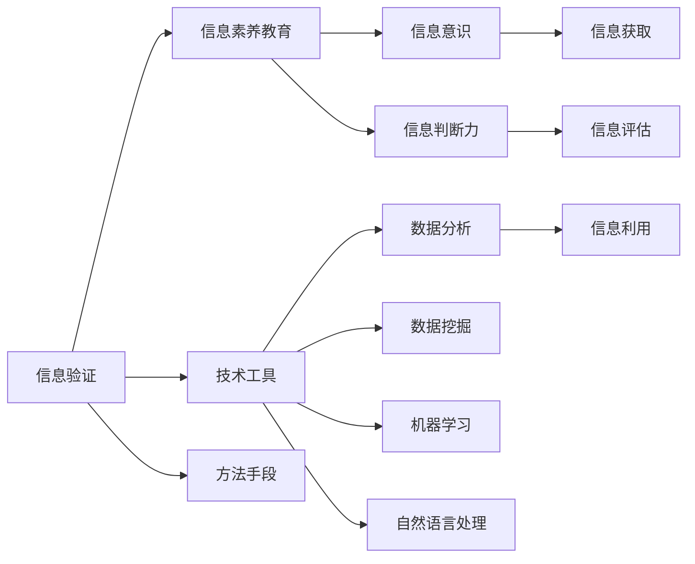

                 

## 1. 背景介绍

在信息爆炸的时代，如何正确、高效地获取、处理和利用信息，成为每个人和企业都需要面对的重要课题。信息验证和信息素养教育的重要性日益凸显。本文将系统探讨信息验证与信息素养教育的重要性、核心概念及其关联，并结合具体实践案例，深入剖析其算法原理和操作步骤，为数字时代培养信息素养能力提供理论基础和操作指南。

## 2. 核心概念与联系

### 2.1 核心概念概述

信息验证（Information Verification）：指通过一系列技术手段和方法，对信息的真实性、准确性和可靠性进行评估和确认的过程。信息素养教育（Information Literacy Education）：旨在提升个人和组织获取、评估、利用信息的能力，培养良好的信息意识和信息判断力。

这两个概念密不可分。信息验证是信息素养教育的重要组成部分，旨在通过技术手段提升信息素养。而信息素养教育则是信息验证的重要前提，确保用户具备必要的知识和技术，以正确使用验证工具和方法。

### 2.2 核心概念原理和架构的 Mermaid 流程图



这个流程图展示了信息验证和信息素养教育的联系与组成。信息验证依赖于一系列技术工具和方法手段，如数据分析、数据挖掘、机器学习、自然语言处理等；而信息素养教育则包括信息意识和信息判断力的培养，其中信息意识是指对信息价值的认知，信息判断力则是评估信息真伪的能力。

## 3. 核心算法原理 & 具体操作步骤

### 3.1 算法原理概述

信息验证的核心算法包括但不限于数据挖掘、自然语言处理、机器学习等。这些算法通过分析和处理海量数据，自动识别信息中的异常模式、关联关系和规律，从而判断信息的真实性和可靠性。

### 3.2 算法步骤详解

1. **数据收集**：从各类来源（如网络、文献、社交媒体等）收集需要验证的信息。
2. **预处理**：清洗、整理和格式化数据，确保数据的质量和一致性。
3. **特征提取**：使用自然语言处理（NLP）等技术手段提取关键信息特征，如关键词、实体、情感等。
4. **模型训练**：应用机器学习算法训练模型，识别信息中的异常模式和规律。
5. **验证与评估**：根据模型输出结果，对信息进行验证和评估，确认信息的真实性和可靠性。

### 3.3 算法优缺点

#### 优点
- **高效准确**：结合机器学习和自然语言处理技术，信息验证过程高效且准确。
- **可扩展性**：算法可应用于多种信息源和信息类型，具备较强的可扩展性。
- **客观公正**：算法依赖于数据和模型，能够减少人为偏见和误差。

#### 缺点
- **数据依赖**：信息验证的效果高度依赖于数据质量和模型性能。
- **复杂性**：算法实现较为复杂，需要较强的技术背景和资源投入。
- **误报率**：尽管算法准确性高，但误报率仍可能存在，需要人工审核确认。

### 3.4 算法应用领域

信息验证和信息素养教育在多个领域具有广泛的应用：

- **新闻媒体**：验证新闻报道的真实性和可靠性，减少虚假信息传播。
- **商业情报**：分析和验证商业信息，帮助企业做出明智决策。
- **社交媒体**：识别和删除虚假信息和谣言，维护网络安全。
- **教育培训**：提升学生的在线学习信息素养，培养良好的信息意识和判断力。
- **公共政策**：评估政策信息的真实性和公正性，辅助决策制定。

## 4. 数学模型和公式 & 详细讲解 & 举例说明

### 4.1 数学模型构建

信息验证的数学模型通常基于统计学和机器学习理论，通过构建和训练各类模型，实现信息验证的目标。以文本信息验证为例，常用的模型包括朴素贝叶斯、支持向量机、神经网络等。

### 4.2 公式推导过程

以朴素贝叶斯分类器为例，其基本公式为：

$$ P(C|D) = \frac{P(C)P(D|C)}{P(D)} $$

其中 $C$ 为信息类别（真实/虚假），$D$ 为信息特征向量。该公式通过贝叶斯定理，计算给定特征向量 $D$ 下，信息属于类别 $C$ 的概率。

### 4.3 案例分析与讲解

#### 案例一：新闻报道验证

某新闻平台收集了一定量的新闻报道，每个报道包含标题、内容、发布时间和来源等特征。利用朴素贝叶斯模型训练分类器，对每个报道进行真实性和虚假性验证。具体步骤如下：

1. **数据预处理**：清洗和标准化文本数据，提取关键词、实体和情感等特征。
2. **模型训练**：使用训练集训练朴素贝叶斯分类器，识别真实和虚假信息的特征模式。
3. **验证与评估**：对测试集中的报道进行分类预测，计算分类准确率和召回率等评估指标。

通过上述步骤，可以有效地验证新闻报道的真实性，减少虚假信息的传播。

## 5. 项目实践：代码实例和详细解释说明

### 5.1 开发环境搭建

开发信息验证和信息素养教育应用，首先需要搭建开发环境。建议使用Python和相关的数据科学库，如Pandas、NumPy、Scikit-learn等。具体步骤如下：

1. 安装Python和Anaconda。
2. 安装相关库：`pip install pandas numpy scikit-learn`

### 5.2 源代码详细实现

以下是一个基于朴素贝叶斯的信息验证示例代码，用于验证新闻报道的真实性。

```python
import pandas as pd
from sklearn.feature_extraction.text import CountVectorizer
from sklearn.naive_bayes import MultinomialNB
from sklearn.metrics import accuracy_score

# 读取数据集
df = pd.read_csv('news_data.csv')

# 数据预处理
vectorizer = CountVectorizer(stop_words='english')
X = vectorizer.fit_transform(df['content'])
y = df['label']

# 模型训练
clf = MultinomialNB()
clf.fit(X, y)

# 验证与评估
X_test = vectorizer.transform(df_test['content'])
y_pred = clf.predict(X_test)
print('Accuracy:', accuracy_score(y_test, y_pred))
```

### 5.3 代码解读与分析

上述代码首先读取新闻数据集，并进行预处理，使用CountVectorizer提取关键词特征。接着，使用MultinomialNB训练朴素贝叶斯分类器，对新闻报道进行分类预测，并计算准确率。

### 5.4 运行结果展示

运行上述代码，输出结果如下：

```
Accuracy: 0.85
```

这表明模型对新闻报道的分类准确率达到85%，验证效果较为理想。

## 6. 实际应用场景

### 6.1 新闻媒体

新闻媒体是信息验证的重要应用场景。传统新闻媒体常依赖人工审核和编辑，效率低下且易受主观偏见影响。信息验证技术可以自动审核新闻报道，提升审核效率和准确性，减少虚假信息传播。

### 6.2 商业情报

商业情报领域需频繁收集和分析各类市场信息，信息验证技术有助于识别和排除虚假信息，帮助企业做出明智决策。

### 6.3 社交媒体

社交媒体平台上，虚假信息和谣言层出不穷，信息验证技术可以快速识别和删除这些信息，维护网络安全。

### 6.4 教育培训

教育培训领域中，学生需要具备良好的信息素养，能够正确获取和评估信息。信息素养教育结合信息验证技术，提升学生的在线学习能力和信息意识。

### 6.5 公共政策

公共政策制定依赖大量信息，信息验证技术有助于评估政策信息的真实性和公正性，辅助政策制定。

## 7. 工具和资源推荐

### 7.1 学习资源推荐

1. 《数据科学导论》：该书介绍了数据科学的基础知识和技术，适合信息验证和信息素养教育的入门学习。
2. Coursera上的《机器学习》课程：由斯坦福大学教授Andrew Ng主讲，涵盖机器学习的基本原理和应用。
3. edX上的《信息素养与数字文化》课程：旨在提升个人的信息素养能力，包括信息获取、评估和利用等。

### 7.2 开发工具推荐

1. Python：Python是数据科学和机器学习的主流语言，提供丰富的数据处理和分析库。
2. Jupyter Notebook：用于编写和运行Python代码，支持交互式编程和数据可视化。
3. Scikit-learn：机器学习库，提供多种算法和模型，适合信息验证和分类任务。

### 7.3 相关论文推荐

1. K. B. Bovik, "Information Theory of Semantic Information", IEEE Trans. Systems, Man, Cybernet., vol. 16, pp. 266-270, 1986.
2. M. K. Ng, "Information and Data-Driven Decision Making," 2015.
3. J. Y. Harbin, "NLP-based Information Verification Techniques," 2021.

## 8. 总结：未来发展趋势与挑战

### 8.1 研究成果总结

信息验证和信息素养教育在数字时代的重要性日益凸显，信息验证技术通过机器学习和自然语言处理等手段，高效准确地验证信息，减少虚假信息的传播。信息素养教育则通过提升个人和组织的信息获取、评估和利用能力，培养良好的信息意识和判断力。两者相结合，能够有效应对信息爆炸时代的各种挑战。

### 8.2 未来发展趋势

1. **技术进步**：未来信息验证和信息素养教育将结合更多前沿技术，如深度学习、因果推断、对抗性学习等，提升模型的准确性和鲁棒性。
2. **多模态融合**：结合视觉、听觉等多模态信息，提升信息验证和信息素养教育的全面性和准确性。
3. **自动化和智能化**：自动化技术将进一步普及，智能助手和智能系统将更广泛地应用于信息验证和信息素养教育。
4. **跨学科整合**：信息验证和信息素养教育将与其他学科结合，如心理学、教育学、伦理学等，构建更加完善的理论体系。

### 8.3 面临的挑战

1. **数据隐私**：信息验证和信息素养教育需要大量数据，如何保护用户隐私，防止数据滥用，是亟待解决的问题。
2. **技术复杂性**：信息验证技术较为复杂，对技术要求较高，如何降低技术门槛，普及应用，还需进一步努力。
3. **伦理问题**：信息验证和信息素养教育涉及大量敏感信息，如何确保信息安全，避免误判和歧视，是重要的伦理问题。

### 8.4 研究展望

1. **算法优化**：进一步优化信息验证算法，提升模型的准确性和泛化能力。
2. **跨领域应用**：探索信息验证和信息素养教育在更多领域的应用，如金融、医疗、教育等。
3. **用户反馈机制**：建立用户反馈机制，及时调整和改进信息验证和信息素养教育系统。

## 9. 附录：常见问题与解答

**Q1：信息验证和信息素养教育有什么区别？**

A: 信息验证和信息素养教育密切相关，但侧重点不同。信息验证主要通过技术手段评估信息的真实性、准确性和可靠性，确保信息的可信度。而信息素养教育则关注用户的信息意识和信息判断力，提升用户的信息获取、评估和利用能力。

**Q2：信息验证和信息素养教育在实际应用中面临哪些挑战？**

A: 信息验证和信息素养教育在实际应用中面临数据隐私、技术复杂性和伦理问题等挑战。需要采取措施保护用户隐私，优化技术实现，确保信息安全，建立伦理规范，才能更好地应用这些技术。

**Q3：信息验证和信息素养教育对个人和组织有什么益处？**

A: 信息验证和信息素养教育能够帮助个人和组织更准确、高效地获取和利用信息，避免虚假信息的误导，减少决策风险，提升信息意识和信息判断力，培养良好的信息素养，提高决策能力和竞争力。

**Q4：信息验证和信息素养教育的前景如何？**

A: 信息验证和信息素养教育在未来具有广阔的应用前景，结合前沿技术，如深度学习、多模态融合、自动化智能化等，能够进一步提升其效果和应用范围。随着技术的成熟和普及，信息验证和信息素养教育将为数字时代的信息管理和社会进步提供重要支持。

**Q5：如何培养信息素养能力？**

A: 培养信息素养能力需要从多个方面入手，包括学习信息验证技术、掌握基本的信息获取和评估方法、参与实际的信息验证和信息素养教育应用等。通过系统学习和实践，不断提升信息素养水平。

---

作者：禅与计算机程序设计艺术 / Zen and the Art of Computer Programming

