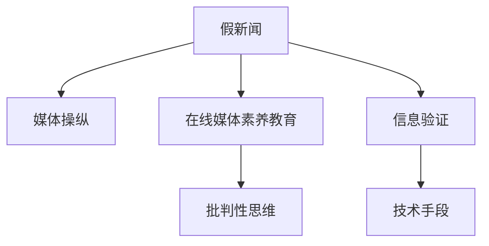

                 

# 信息验证和在线媒体素养教育：为假新闻和媒体操纵做好准备

## 1. 背景介绍

### 1.1 问题由来

随着互联网和社交媒体的快速发展，信息的传播方式和速度发生了革命性的变化。一方面，人们可以更快地获取到全球各地的新闻和信息，另一方面，假新闻和媒体操纵问题也日益严重。虚假信息的传播不仅对个人决策产生误导，也可能影响社会稳定和公共安全。

为了应对这一挑战，信息验证和在线媒体素养教育的重要性日益凸显。通过对公众进行教育，使他们具备批判性思维和信息辨识能力，能够识别和拒绝虚假信息。通过技术手段验证信息的真实性，确保在线媒体的可靠性和可信度。

### 1.2 问题核心关键点

信息验证和在线媒体素养教育的核心在于：
- **信息辨识与甄别**：通过教育提高公众的信息辨识能力，能够识别出虚假信息、伪造数据等。
- **技术手段的应用**：利用AI、机器学习等技术，对信息进行自动化的验证和比对。
- **媒体素养教育**：培养公众对媒体信息的批判性思维和分析能力，提升其在线素养水平。
- **假新闻与媒体操纵的应对**：设计检测和应对虚假信息和媒体操纵的技术和策略。

## 2. 核心概念与联系

### 2.1 核心概念概述

为更好地理解信息验证和在线媒体素养教育，本节将介绍几个密切相关的核心概念：

- **假新闻（Fake News）**：故意制造、传播的虚假新闻或信息，用于误导公众、影响选举等目的。
- **媒体操纵（Media Manipulation）**：通过伪造新闻、操纵图像、篡改视频等方式，误导公众、影响舆论。
- **在线媒体素养（Digital Media Literacy）**：指个体在互联网环境下获取、分析和评估媒体信息的能力。
- **信息验证（Information Verification）**：通过技术手段对信息的真实性和可信度进行验证，确保信息的可靠性。
- **AI与机器学习（AI and Machine Learning）**：利用AI和机器学习技术，自动化的进行信息验证和媒体素养教育。

这些核心概念之间的逻辑关系可以通过以下Mermaid流程图来展示：



这个流程图展示了这个体系的关键环节：

1. 假新闻和媒体操纵是主要问题。
2. 在线媒体素养教育旨在提高公众的信息辨识能力。
3. 信息验证利用技术手段确保信息可靠。
4. 批判性思维是在线媒体素养教育的重要内容。

## 3. 核心算法原理 & 具体操作步骤
### 3.1 算法原理概述

信息验证和在线媒体素养教育的核心算法原理主要包括以下几个方面：

- **自然语言处理（NLP）**：通过文本分析、情感分析等技术，识别出潜在虚假信息和媒体操纵。
- **图像和视频分析**：利用计算机视觉技术，分析图像和视频内容的真实性。
- **网络传播分析**：通过分析信息在网络上的传播路径和影响范围，评估其对公众的影响。
- **机器学习模型**：构建和训练模型，自动识别和验证虚假信息。

### 3.2 算法步骤详解

#### 3.2.1 信息验证步骤

1. **数据收集**：从社交媒体、新闻网站等平台收集信息数据。
2. **预处理**：清洗和格式化数据，去除无用信息。
3. **特征提取**：使用NLP和计算机视觉技术提取文本和图像的特征。
4. **模型训练**：构建和训练机器学习模型，用于识别虚假信息。
5. **验证与测试**：使用测试集评估模型性能，并进行优化。
6. **部署与监控**：将模型部署到实际应用中，持续监控和更新模型。

#### 3.2.2 在线媒体素养教育步骤

1. **需求分析**：分析受众的需求和特点，设计教育内容和形式。
2. **内容设计**：制作教学视频、互动课程等，涵盖信息辨识、批判性思维等内容。
3. **平台建设**：开发在线教育平台，提供课程、论坛、问答等服务。
4. **互动与反馈**：通过互动和反馈机制，提高学习效果。
5. **评估与改进**：定期评估教育效果，不断改进教育内容和形式。

### 3.3 算法优缺点

#### 3.3.1 信息验证的优点

- **高效性**：利用机器学习算法可以快速处理大量信息，提高验证效率。
- **客观性**：自动化验证减少了人为偏见，提高了验证的客观性。
- **覆盖面广**：覆盖文本、图像、视频等多种媒体形式，提供全面的信息验证。

#### 3.3.2 信息验证的缺点

- **误判率高**：虚假信息的伪装和复杂性可能导致误判。
- **数据依赖**：需要大量高质量的标注数据进行训练，数据获取难度大。
- **技术门槛高**：需要较强的技术和数据处理能力，普通用户难以使用。

#### 3.3.3 在线媒体素养的优点

- **提升公众能力**：通过教育提高公众的信息辨识能力，减少虚假信息的传播。
- **互动性强**：互动和反馈机制提高了学习效果。
- **灵活性高**：内容形式多样，适合不同年龄段和背景的用户。

#### 3.3.4 在线媒体素养的缺点

- **内容更新慢**：教育内容需要定期更新，难以跟上信息传播的快速变化。
- **覆盖面有限**：不同用户的信息需求和兴趣差异大，难以全面覆盖。
- **参与度低**：需要用户主动参与学习，用户参与度低影响效果。

### 3.4 算法应用领域

信息验证和在线媒体素养教育在以下领域有着广泛的应用：

- **新闻媒体**：用于新闻事实核查、假新闻检测，提升新闻的可靠性和可信度。
- **社交媒体**：用于检测和标记虚假信息、操纵内容，保护用户免受误导。
- **教育机构**：用于在线教育平台，提高学生的信息辨识能力和在线素养水平。
- **政府机构**：用于监测和分析信息传播情况，提升公共安全和信息透明。
- **企业应用**：用于员工信息辨识能力的培训，提升企业的信息安全水平。

## 4. 数学模型和公式 & 详细讲解 & 举例说明
### 4.1 数学模型构建

信息验证和在线媒体素养教育的数学模型主要基于以下假设：

- **假新闻检测模型**：假新闻检测模型 $M_{\text{fake}}$ 的输入为文本或图像，输出为是否为假新闻的预测结果。模型形式为 $M_{\text{fake}}: X \rightarrow \{0, 1\}$，其中 $X$ 为输入样本，$0$ 表示真实，$1$ 表示假新闻。

- **媒体素养教育模型**：媒体素养教育模型 $M_{\text{literacy}}$ 的输入为用户行为数据，输出为教育效果。模型形式为 $M_{\text{literacy}}: Y \rightarrow \mathcal{R}$，其中 $Y$ 为行为数据，$\mathcal{R}$ 为教育效果。

### 4.2 公式推导过程

#### 4.2.1 假新闻检测模型

假新闻检测模型的构建基于分类问题，常用的损失函数为交叉熵损失函数。假设模型 $M_{\text{fake}}$ 在样本 $(x_i, y_i)$ 上的损失函数为 $\ell(M_{\text{fake}}(x_i), y_i)$，则在数据集 $D=\{(x_i, y_i)\}_{i=1}^N$ 上的经验风险为：

$$
\mathcal{L}(M_{\text{fake}}) = \frac{1}{N} \sum_{i=1}^N \ell(M_{\text{fake}}(x_i), y_i)
$$

模型训练的目标是最小化经验风险，即找到最优模型参数：

$$
\theta^* = \mathop{\arg\min}_{\theta} \mathcal{L}(M_{\text{fake}})
$$

通过梯度下降等优化算法，模型参数 $\theta$ 不断更新，最小化损失函数 $\mathcal{L}$，使得模型预测准确度提高。

#### 4.2.2 媒体素养教育模型

媒体素养教育模型主要关注用户行为数据和教育效果之间的关系。假设模型 $M_{\text{literacy}}$ 在用户行为数据 $Y_i$ 上的输出为教育效果 $R_i$，则在数据集 $D=\{(Y_i, R_i)\}_{i=1}^N$ 上的经验风险为：

$$
\mathcal{L}(M_{\text{literacy}}) = \frac{1}{N} \sum_{i=1}^N (R_i - M_{\text{literacy}}(Y_i))^2
$$

模型训练的目标是最小化经验风险，即找到最优模型参数：

$$
\theta^* = \mathop{\arg\min}_{\theta} \mathcal{L}(M_{\text{literacy}})
$$

通过梯度下降等优化算法，模型参数 $\theta$ 不断更新，最小化损失函数 $\mathcal{L}$，使得教育效果提升。

### 4.3 案例分析与讲解

以假新闻检测为例，我们通过构建一个简单的二分类模型，说明模型的训练和验证过程。

假设假新闻检测模型 $M_{\text{fake}}$ 的输入为文本 $x$，输出为是否为假新闻的预测 $y$。模型的输入表示为词向量，输出为概率分布 $p(y|x)$。模型采用逻辑回归作为分类器，损失函数为交叉熵损失函数。

模型训练步骤如下：

1. **数据预处理**：将文本转换为词向量，去除停用词和噪音。
2. **模型构建**：定义逻辑回归模型，包含输入层、隐藏层和输出层。
3. **模型训练**：使用随机梯度下降法更新模型参数，最小化交叉熵损失。
4. **模型验证**：使用验证集评估模型性能，调整超参数。
5. **模型部署**：将模型部署到实际应用中，进行信息验证。

## 5. 项目实践：代码实例和详细解释说明
### 5.1 开发环境搭建

在进行信息验证和在线媒体素养教育实践前，我们需要准备好开发环境。以下是使用Python进行TensorFlow开发的详细环境配置流程：

1. 安装Anaconda：从官网下载并安装Anaconda，用于创建独立的Python环境。

2. 创建并激活虚拟环境：
```bash
conda create -n tf-env python=3.8 
conda activate tf-env
```

3. 安装TensorFlow：根据CUDA版本，从官网获取对应的安装命令。例如：
```bash
pip install tensorflow tensorflow-gpu -f https://developer.download.nvidia.com/compute/cuda/repos/ubuntu1804/x86_64
```

4. 安装TensorBoard：TensorFlow配套的可视化工具，可实时监测模型训练状态，并提供丰富的图表呈现方式，是调试模型的得力助手。

```bash
pip install tensorboard
```

5. 安装各类工具包：
```bash
pip install numpy pandas scikit-learn matplotlib tqdm jupyter notebook ipython
```

完成上述步骤后，即可在`tf-env`环境中开始信息验证和在线媒体素养教育的实践。

### 5.2 源代码详细实现

这里我们以假新闻检测任务为例，给出使用TensorFlow进行信息验证的代码实现。

首先，定义假新闻检测的数据处理函数：

```python
import tensorflow as tf
from tensorflow.keras.preprocessing.text import Tokenizer
from tensorflow.keras.preprocessing.sequence import pad_sequences
import numpy as np

# 数据预处理函数
def preprocess_data(texts, max_len):
    tokenizer = Tokenizer()
    tokenizer.fit_on_texts(texts)
    sequences = tokenizer.texts_to_sequences(texts)
    padded_sequences = pad_sequences(sequences, maxlen=max_len, padding='post')
    return padded_sequences

# 标签转换函数
def convert_labels(labels):
    return np.array(labels, dtype='float32')
```

然后，定义模型和损失函数：

```python
from tensorflow.keras.models import Sequential
from tensorflow.keras.layers import Embedding, Dense, Dropout

# 定义模型
model = Sequential([
    Embedding(input_dim=vocab_size, output_dim=embedding_dim, input_length=max_len),
    Dropout(0.2),
    Dense(128, activation='relu'),
    Dense(1, activation='sigmoid')
])

# 定义损失函数
loss_function = tf.keras.losses.BinaryCrossentropy()

# 编译模型
model.compile(optimizer='adam', loss=loss_function, metrics=['accuracy'])
```

接着，定义训练和评估函数：

```python
def train_model(model, train_data, epochs):
    # 训练模型
    history = model.fit(train_data['input'], train_data['label'], 
                       validation_data=(val_data['input'], val_data['label']),
                       epochs=epochs, batch_size=32)

    # 评估模型
    test_loss, test_acc = model.evaluate(test_data['input'], test_data['label'])
    print('Test accuracy:', test_acc)
    return history

# 训练模型
train_data = preprocess_data(train_texts, max_len)
val_data = preprocess_data(val_texts, max_len)
test_data = preprocess_data(test_texts, max_len)

history = train_model(model, train_data, epochs=5)
```

最后，在测试集上评估模型的性能：

```python
test_loss, test_acc = model.evaluate(test_data['input'], test_data['label'])
print('Test accuracy:', test_acc)
```

以上就是使用TensorFlow进行假新闻检测的完整代码实现。可以看到，TensorFlow提供了简单易用的API，使得模型的构建、训练和评估过程变得简单高效。

### 5.3 代码解读与分析

让我们再详细解读一下关键代码的实现细节：

**假新闻检测数据处理函数**：
- `preprocess_data`方法：使用Tokenizer将文本转换为词向量，并进行填充处理，使得所有样本的长度一致。

**标签转换函数**：
- `convert_labels`方法：将标签转换为浮点数，用于训练模型的二分类问题。

**模型构建与编译**：
- `Sequential`模型：定义了一个简单的序列模型，包含嵌入层、Dropout层、全连接层和输出层。
- `Embedding`层：将输入的词向量转换为模型可以处理的向量表示。
- `Dense`层：使用全连接层进行特征提取和分类。
- `Dropout`层：防止过拟合，随机丢弃一部分神经元。
- `BinaryCrossentropy`损失函数：用于二分类问题的损失函数。
- `adam`优化器：使用自适应矩估计算法，提高模型训练速度和效果。

**模型训练与评估**：
- `train_model`方法：在训练集上训练模型，并在验证集上评估性能。
- `evaluate`方法：在测试集上评估模型的准确度。

**训练过程**：
- `fit`方法：在指定数据集上训练模型，返回训练过程中的历史记录。
- `evaluate`方法：评估模型在测试集上的性能。

可以看到，TensorFlow的高级API使得模型的构建和训练过程变得非常直观和便捷。开发者可以专注于算法的设计和模型的优化，而不必过多关注底层实现细节。

## 6. 实际应用场景
### 6.1 智能新闻推荐系统

智能新闻推荐系统能够根据用户的历史阅读行为和兴趣偏好，推荐用户可能感兴趣的新闻内容。利用信息验证技术，可以有效识别出虚假新闻和媒体操纵，提高新闻推荐的准确性和可信度。

在技术实现上，可以结合用户行为数据和文本数据，构建假新闻检测模型，用于筛选可信新闻。结合用户兴趣模型，进行新闻推荐。同时，使用在线媒体素养教育技术，提升用户的新闻辨别能力，进一步提升推荐效果。

### 6.2 在线广告验证

在线广告是企业营销的重要手段，但虚假广告和误导性内容也难以避免。通过信息验证技术，可以有效识别出虚假广告和误导性内容，提升广告投放的效果和可信度。

在技术实现上，可以构建广告内容的假新闻检测模型，用于验证广告的真实性。结合广告投放平台，自动过滤掉虚假广告，提升广告的转化率和点击率。同时，利用在线媒体素养教育技术，提升用户对广告的辨识能力，减少虚假广告的传播。

### 6.3 政府信息监管

政府信息监管是保障公共安全、维护社会稳定的重要手段。利用信息验证技术，可以有效识别出虚假信息和媒体操纵，提升信息监管的效果和准确度。

在技术实现上，可以构建政府新闻和信息内容的假新闻检测模型，用于验证新闻的真实性。结合政府信息发布平台，自动过滤掉虚假信息和误导性内容。同时，利用在线媒体素养教育技术，提升公众的信息辨识能力，减少虚假信息的传播。

## 7. 工具和资源推荐
### 7.1 学习资源推荐

为了帮助开发者系统掌握信息验证和在线媒体素养教育的技术基础和实践技巧，这里推荐一些优质的学习资源：

1. **TensorFlow官方文档**：TensorFlow的官方文档，提供了丰富的API和示例代码，是学习和使用TensorFlow的必备资料。

2. **自然语言处理入门教程**：斯坦福大学开设的自然语言处理课程，涵盖了NLP的基础概念和经典模型，适合初学者入门。

3. **假新闻检测论文**：一些经典的研究论文，如《A Survey of Fake News Detection Methods》，提供了假新闻检测的多种方法和技术，有助于深入理解该领域。

4. **在线媒体素养教育资源**：PEN America的《Media Literacy for Digital Citizenship》课程，提供了详细的在线媒体素养教育资源，适合教育工作者和学生使用。

通过对这些资源的学习实践，相信你一定能够快速掌握信息验证和在线媒体素养教育的核心技术，并应用于实际项目中。

### 7.2 开发工具推荐

高效的开发离不开优秀的工具支持。以下是几款用于信息验证和在线媒体素养教育开发的常用工具：

1. **TensorFlow**：基于Python的开源深度学习框架，提供了丰富的API和工具，方便进行模型构建和训练。

2. **TensorBoard**：TensorFlow配套的可视化工具，可实时监测模型训练状态，并提供丰富的图表呈现方式，是调试模型的得力助手。

3. **Jupyter Notebook**：用于编写和运行Python代码的交互式笔记本环境，方便进行数据处理和模型训练。

4. **Gym**：用于模拟环境，训练和测试强化学习模型的环境库。

5. **Kaggle**：数据科学竞赛平台，提供了大量的数据集和挑战赛，方便进行数据探索和算法优化。

合理利用这些工具，可以显著提升信息验证和在线媒体素养教育的开发效率，加快创新迭代的步伐。

### 7.3 相关论文推荐

信息验证和在线媒体素养教育的发展源于学界的持续研究。以下是几篇奠基性的相关论文，推荐阅读：

1. **假新闻检测的综述论文**：《A Survey of Fake News Detection Methods》，提供了假新闻检测的多种方法和技术，有助于深入理解该领域。

2. **在线媒体素养教育的研究论文**：《Digital Media Literacy for Media Literacy Educators》，提供了在线媒体素养教育的方法和策略，有助于指导实际教育工作。

3. **结合假新闻检测和在线媒体素养教育的论文**：《Combining Fake News Detection and Media Literacy Education》，探讨了假新闻检测和在线媒体素养教育的结合方式，提出了新的教育策略和技术。

这些论文代表了大语言模型微调技术的发展脉络。通过学习这些前沿成果，可以帮助研究者把握学科前进方向，激发更多的创新灵感。

## 8. 总结：未来发展趋势与挑战
### 8.1 总结

本文对信息验证和在线媒体素养教育进行了全面系统的介绍。首先阐述了假新闻和媒体操纵问题的严重性，以及信息验证和在线媒体素养教育的重要意义。其次，从原理到实践，详细讲解了信息验证和在线媒体素养教育的数学模型和算法步骤，给出了信息验证任务开发的完整代码实例。同时，本文还广泛探讨了信息验证和在线媒体素养教育在新闻推荐、广告验证、政府信息监管等多个行业领域的应用前景，展示了该技术的巨大潜力。最后，本文精选了信息验证和在线媒体素养教育的相关资源，力求为读者提供全方位的技术指引。

通过本文的系统梳理，可以看到，信息验证和在线媒体素养教育在应对假新闻和媒体操纵问题中具有重要的作用。利用先进的技术手段，可以有效识别虚假信息，提升公众的信息辨识能力，减少误导性内容的传播。未来，伴随技术手段的不断进步和教育水平的提升，信息验证和在线媒体素养教育必将在构建健康、可信的在线环境中发挥更大的作用。

### 8.2 未来发展趋势

展望未来，信息验证和在线媒体素养教育的发展趋势主要包括以下几个方面：

1. **深度学习技术的应用**：利用深度学习技术，构建更加准确的假新闻检测模型，提高信息验证的准确性和效率。
2. **多模态信息的融合**：结合文本、图像、视频等多种信息形式，构建更加全面的信息验证系统。
3. **在线媒体素养教育的普及**：利用在线教育平台和互动机制，普及在线媒体素养教育，提升公众的信息辨识能力。
4. **教育内容的动态更新**：结合实时数据和用户反馈，动态更新教育内容，保持在线媒体素养教育的时效性。
5. **技术与社会问题的结合**：结合社会问题，设计更加贴近实际的应用场景，提升信息验证和在线媒体素养教育的效果。

以上趋势凸显了信息验证和在线媒体素养教育的重要作用，为构建健康、可信的在线环境提供了新的思路和技术手段。这些方向的探索发展，必将进一步提升在线媒体素养教育的效果，减少假新闻和媒体操纵的传播。

### 8.3 面临的挑战

尽管信息验证和在线媒体素养教育在应对假新闻和媒体操纵问题中具有重要的作用，但在迈向更加智能化、普适化应用的过程中，它仍面临着诸多挑战：

1. **数据获取难度大**：高质量的标注数据和用户行为数据获取难度大，数据不足可能导致模型性能下降。
2. **算法复杂度高**：深度学习模型的构建和训练过程复杂，需要较强的技术和计算资源。
3. **用户参与度低**：在线媒体素养教育需要用户主动参与，用户参与度低影响效果。
4. **模型鲁棒性不足**：深度学习模型可能存在过拟合和鲁棒性不足的问题，虚假信息的伪装和复杂性可能导致误判。
5. **社会问题复杂**：社会问题复杂多样，信息验证和在线媒体素养教育需要结合具体场景进行设计和优化。

这些挑战凸显了信息验证和在线媒体素养教育在实际应用中的复杂性，需要技术和社会多方面的共同努力，才能更好地应对假新闻和媒体操纵问题。

### 8.4 研究展望

面对信息验证和在线媒体素养教育所面临的挑战，未来的研究需要在以下几个方面寻求新的突破：

1. **无监督学习的应用**：探索无监督学习和半监督学习的应用，降低对标注数据的依赖，提高模型的泛化能力。
2. **跨模态信息的整合**：结合文本、图像、视频等多种信息形式，构建跨模态的信息验证系统。
3. **用户参与机制的设计**：设计更具吸引力的用户参与机制，提高用户对在线媒体素养教育的参与度。
4. **模型的鲁棒性提升**：通过改进算法和优化模型结构，提升信息验证模型的鲁棒性和泛化能力。
5. **社会问题的研究**：结合社会问题，设计更加贴合实际的信息验证和在线媒体素养教育方案。

这些研究方向的探索，必将引领信息验证和在线媒体素养教育技术迈向更高的台阶，为构建健康、可信的在线环境提供新的技术手段。面向未来，信息验证和在线媒体素养教育还需要与其他人工智能技术进行更深入的融合，如知识表示、因果推理、强化学习等，多路径协同发力，共同推动在线媒体素养教育的进步。只有勇于创新、敢于突破，才能更好地应对假新闻和媒体操纵问题，提升信息验证的效果和在线媒体素养教育的效果。

## 9. 附录：常见问题与解答

**Q1：假新闻检测的误判率高怎么办？**

A: 假新闻检测的误判率高主要是由于虚假新闻的伪装性和复杂性。为了降低误判率，可以采取以下措施：
1. 提高数据质量：收集高质量的标注数据和用户行为数据，提高模型的训练效果。
2. 增强模型复杂度：增加模型的深度和宽度，提高模型的特征提取能力。
3. 使用多种技术手段：结合文本分析和图像分析等技术，综合判断信息真伪。
4. 定期更新模型：定期更新模型参数和特征提取方式，适应新的信息传播方式和趋势。

**Q2：如何提高在线媒体素养教育的效果？**

A: 提高在线媒体素养教育的效果，需要从多个方面入手：
1. 内容丰富多样：制作多样化的教学内容，涵盖新闻辨识、批判性思维、信息筛选等各个方面。
2. 互动机制设计：设计互动和反馈机制，提高用户的学习效果。
3. 社交媒体应用：利用社交媒体平台，推广在线媒体素养教育内容。
4. 定期评估改进：定期评估教育效果，结合用户反馈进行改进。
5. 融合技术与教育：结合AI和机器学习技术，提升教育内容的精准性和个性化。

**Q3：信息验证和在线媒体素养教育的发展前景如何？**

A: 信息验证和在线媒体素养教育的发展前景非常广阔：
1. 技术手段不断进步：深度学习、自然语言处理等技术的进步，将推动信息验证和在线媒体素养教育的发展。
2. 社会需求不断增加：假新闻和媒体操纵问题的增加，将进一步推动信息验证和在线媒体素养教育的应用。
3. 跨领域应用广泛：信息验证和在线媒体素养教育可以在新闻推荐、广告验证、政府信息监管等多个领域得到应用，带来巨大的社会价值。

通过不断探索和创新，信息验证和在线媒体素养教育必将在构建健康、可信的在线环境中发挥更大的作用。

---

作者：禅与计算机程序设计艺术 / Zen and the Art of Computer Programming

