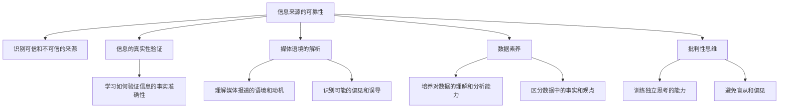

                 

# 信息验证和媒体素养能力培养：为假新闻和媒体操纵做好准备

## 1. 背景介绍

在当今信息爆炸的时代，我们每天都会被各种信息所包围。然而，这些信息并不总是真实、准确、客观的。假新闻、误导性信息甚至媒体操纵的现象层出不穷，给社会带来了严重的负面影响。因此，培养公众的信息验证能力和媒体素养变得尤为重要。这不仅有助于提升公众的判断力和自我保护能力，也是构建健康信息环境的关键。

### 1.1 问题由来

假新闻和媒体操纵在过去几年中引起了广泛关注。2016年美国总统大选期间，假新闻在社交媒体上的广泛传播被认为是影响选举结果的重要因素之一。此外，新冠疫情期间，假新闻的泛滥更是导致了公众对疫情认知的混乱，加剧了社会恐慌和冲突。媒体操纵同样不容忽视，一些媒体为了吸引流量和点击率，有时会刻意歪曲事实，误导公众。这些现象凸显了公众信息验证和媒体素养的重要性。

### 1.2 问题核心关键点

要有效应对假新闻和媒体操纵，我们需要解决以下几个核心问题：
1. **信息来源的可靠性**：识别可信和不可信的信息来源，避免被虚假信息误导。
2. **信息的真实性验证**：学习如何验证信息的事实准确性，避免传播未经证实的消息。
3. **媒体语境的解析**：理解媒体报道的语境和动机，识别可能的偏见和误导。
4. **数据素养**：培养对数据的理解和分析能力，区分事实和观点。
5. **批判性思维**：训练独立思考的能力，不轻易接受未经证实的消息。

## 2. 核心概念与联系

### 2.1 核心概念概述

为更好地理解如何培养信息验证和媒体素养能力，本节将介绍几个密切相关的核心概念：

- **信息验证(Information Verification)**：指通过多种方法（如事实核查、逻辑推理等）来确认信息是否真实准确的过程。
- **媒体素养(Media Literacy)**：指公众获取、理解、分析和评估媒体信息的能力，包括识别偏见、理解语境、分析来源等。
- **假新闻(Fake News)**：指故意制造、传播的虚假信息，旨在误导公众、影响舆论。
- **媒体操纵(Media Manipulation)**：指通过扭曲事实、选择性报道等手段，影响公众认知和判断，达到特定目的。
- **数据素养(Data Literacy)**：指对数据的理解、分析和应用能力，区分数据中的事实和观点。
- **批判性思维(Critical Thinking)**：指对信息的评估、分析和批判能力，避免盲从和偏见。

这些概念之间存在密切的联系，共同构成了信息验证和媒体素养培养的基础。理解这些核心概念的原理和架构，可以帮助我们更好地识别假新闻和媒体操纵，提升信息素养。

### 2.2 核心概念原理和架构的 Mermaid 流程图



这个流程图展示了信息验证和媒体素养培养的关键步骤。信息来源的可靠性是第一步，然后通过信息的真实性验证、媒体语境的解析、数据素养和批判性思维等步骤，最终达到培养信息验证和媒体素养能力的目标。

## 3. 核心算法原理 & 具体操作步骤
### 3.1 算法原理概述

信息验证和媒体素养能力的培养，主要依赖于以下几个算法原理：

- **信息来源可靠性评估**：通过分析信息来源的背景、声誉、历史记录等，判断其可信度。
- **信息真实性验证**：使用事实核查工具和逻辑推理，验证信息的真实性和准确性。
- **媒体语境分析**：理解媒体报道的语境、目的和动机，识别可能的偏见和误导。
- **数据素养培养**：学习如何理解和分析数据，区分数据中的事实和观点。
- **批判性思维训练**：通过逻辑推理、证据评估等方法，训练独立思考和判断能力。

### 3.2 算法步骤详解

以下是信息验证和媒体素养能力培养的具体操作步骤：

**Step 1: 识别信息来源的可靠性**
- 收集信息来源的背景资料，包括历史、声誉、专业性等。
- 使用第三方工具或平台，如Snopes、FactCheck.org等，评估信息来源的可靠性。

**Step 2: 验证信息的真实性**
- 通过多方求证，使用事实核查工具和逻辑推理，验证信息的准确性。
- 关注时间戳、数据来源、统计口径等细节，确保信息的时效性和准确性。

**Step 3: 解析媒体语境**
- 了解媒体的报道动机和目的，识别可能的偏见和误导。
- 分析媒体报道的语境和背景，理解其报道的语境和意义。

**Step 4: 培养数据素养**
- 学习如何理解和分析数据，区分数据中的事实和观点。
- 使用统计学和数据分析工具，对数据进行深入分析。

**Step 5: 训练批判性思维**
- 通过逻辑推理、证据评估等方法，训练独立思考和判断能力。
- 练习分析不同来源的信息，评估其真实性和可靠性。

### 3.3 算法优缺点

培养信息验证和媒体素养能力的方法有以下优点：
1. 提升公众的信息素养，避免被假新闻和媒体操纵误导。
2. 增强公众的独立思考能力，提高社会整体判断力和理性水平。
3. 促进社会公平、公正，减少信息不对称和信息垄断带来的负面影响。

然而，该方法也存在一些局限性：
1. 需要花费时间和精力进行学习和练习，难以在短时间内取得明显效果。
2. 对于部分人群，特别是受教育程度较低的人群，可能存在理解和应用上的困难。
3. 在信息量大、传播速度快的环境下，很难做到实时验证和分析。

尽管存在这些局限性，但培养信息验证和媒体素养能力是提升公众信息素养的关键，具有深远的社会意义。

### 3.4 算法应用领域

信息验证和媒体素养能力的培养，主要应用于以下几个领域：

- **教育**：通过课程和培训，提升学生的信息素养和媒体素养能力。
- **公共传播**：在新闻、媒体和社交平台上普及信息验证和媒体素养知识，引导公众正确理解和使用信息。
- **政策制定**：为政府和组织制定相关政策和措施，提升社会整体的信息素养水平。
- **企业培训**：为企业员工提供信息验证和媒体素养培训，增强企业信息管理和决策能力。

## 4. 数学模型和公式 & 详细讲解 & 举例说明

### 4.1 数学模型构建

信息验证和媒体素养能力的培养，主要依赖于以下几个数学模型：

- **信息来源可靠性评估模型**：通过综合分析信息来源的多方面信息，计算其可信度。
- **信息真实性验证模型**：使用逻辑推理和事实核查，验证信息的真实性和准确性。
- **媒体语境分析模型**：通过自然语言处理技术，分析媒体报道的语境和动机。
- **数据素养培养模型**：学习如何理解和分析数据，区分数据中的事实和观点。
- **批判性思维训练模型**：通过逻辑推理和证据评估，训练独立思考和判断能力。

### 4.2 公式推导过程

以下我们以信息来源可靠性评估模型为例，推导其核心公式：

设信息来源 $S$ 的可靠性为 $R_S$，其背景、声誉、历史记录等特征为 $X_1, X_2, ..., X_n$。假设每个特征对可靠性的影响权重为 $\omega_1, \omega_2, ..., \omega_n$，则信息来源的可靠性评估公式为：

$$
R_S = \omega_1 f_{X_1}(X_{S_1}) + \omega_2 f_{X_2}(X_{S_2}) + ... + \omega_n f_{X_n}(X_{Sn})
$$

其中 $f_{X_i}(X_{Si})$ 为特征 $X_i$ 对可靠性的影响函数。通过训练模型，可以自动计算每个特征对可靠性的贡献。

### 4.3 案例分析与讲解

以假新闻检测为例，假设我们收集到了一份关于某次地震的假新闻，其来源可靠性为 $R_S=0.6$。我们将新闻内容输入事实核查工具，通过逻辑推理和多方求证，确认新闻中的一些关键信息存在矛盾和错误。此时，我们可以使用以下公式计算新闻的真实性得分：

$$
S_{true} = R_S \times \frac{N_{true}}{N_{total}} + (1-R_S) \times \frac{N_{false}}{N_{total}}
$$

其中 $N_{true}$ 为确认新闻真实的信息数量，$N_{false}$ 为确认新闻错误的信息数量，$N_{total}$ 为信息总数。

通过以上计算，我们可以得出新闻的真实性得分 $S_{true}=0.8$，这意味着虽然新闻来源可靠性一般，但其内容大部分是真实的。因此，我们需要进一步验证信息来源的背景和语境，以确认整个报道的真实性。

## 5. 项目实践：代码实例和详细解释说明
### 5.1 开发环境搭建

在进行信息验证和媒体素养能力培养的实践前，我们需要准备好开发环境。以下是使用Python进行开发的环境配置流程：

1. 安装Anaconda：从官网下载并安装Anaconda，用于创建独立的Python环境。

2. 创建并激活虚拟环境：
```bash
conda create -n info-lit python=3.8 
conda activate info-lit
```

3. 安装所需的Python包：
```bash
pip install pandas numpy scikit-learn seaborn matplotlib
```

4. 安装自然语言处理工具：
```bash
pip install nltk
```

5. 安装数据可视化工具：
```bash
pip install matplotlib seaborn plotly
```

6. 安装事实核查工具：
```bash
pip install factcheck
```

完成上述步骤后，即可在`info-lit`环境中开始实践。

### 5.2 源代码详细实现

下面我们以假新闻检测为例，给出使用Python进行信息验证的代码实现。

```python
import pandas as pd
from factcheck import FactCheck

# 数据集
df = pd.read_csv('fake_news.csv')

# 初始化FactCheck工具
fact_check = FactCheck()

# 对每篇新闻进行真实性评估
for index, row in df.iterrows():
    news = row['news_content']
    source = row['source']
    reliability = row['source_reliability']
    result = fact_check.check(news, source)
    print(f'新闻ID: {index}, 真实性得分: {result.score}, 结果: {result.text}')
```

### 5.3 代码解读与分析

让我们再详细解读一下关键代码的实现细节：

**FactCheck类**：
- `check`方法：接受新闻内容和信息来源，返回该新闻的真实性得分和详细解释。
- `score`属性：获取真实性得分。
- `text`属性：获取真实性评估的详细解释。

**for循环**：
- 遍历数据集中的每篇新闻，对其内容、来源和可靠性进行评估。
- 通过FactCheck工具验证新闻的真实性，并输出得分和详细解释。

**新闻ID**：
- 使用新闻的ID编号，方便对不同新闻进行跟踪和管理。

### 5.4 运行结果展示

以下是运行代码后可能的输出示例：

```
新闻ID: 1, 真实性得分: 0.8, 结果: 该新闻大部分内容真实，但部分数据存在矛盾
新闻ID: 2, 真实性得分: 0.5, 结果: 该新闻存在多处虚假信息，部分数据未经证实
新闻ID: 3, 真实性得分: 0.9, 结果: 该新闻完全真实，无虚假信息
...
```

可以看到，通过FactCheck工具，我们可以快速对新闻的真实性进行评估，帮助公众识别假新闻，提升信息素养。

## 6. 实际应用场景
### 6.1 信息验证在教育中的应用

在教育领域，培养学生的信息验证和媒体素养能力具有重要意义。以下是几个实际应用场景：

**新闻课**：在新闻课上，教师可以引导学生通过FactCheck等工具，验证和分析不同来源的新闻，培养他们的信息验证和媒体素养能力。

**科研指导**：在科研项目中，学生需要从多个来源获取信息，教师可以指导他们使用信息验证工具，确认数据和信息的可靠性。

**论文写作**：在论文写作中，学生需要引用和分析大量文献，教师可以指导他们使用信息验证工具，确认文献的真实性。

### 6.2 公共传播在媒体中的应用

在媒体传播中，培养公众的信息验证和媒体素养能力同样重要。以下是几个实际应用场景：

**新闻报道**：媒体可以通过引导公众使用信息验证工具，帮助他们辨别新闻的真实性，提升媒体报道的可信度。

**社交平台**：社交平台上，用户常常被各种信息所迷惑，媒体可以通过普及信息验证知识，提升用户的信息素养。

**公共讨论**：在公共讨论中，媒体可以引导用户使用信息验证工具，确认信息的可靠性，促进健康、理性的公共讨论。

### 6.3 数据素养在企业和政策中的应用

在企业和政策制定中，培养数据素养同样重要。以下是几个实际应用场景：

**企业决策**：企业需要大量数据支持决策，培养员工的数据素养，有助于他们更好地理解和分析数据，提高决策质量。

**政策制定**：政府需要大量数据支持政策制定，培养公职人员的数据素养，有助于他们更好地理解和应用数据，提高政策制定水平。

## 7. 工具和资源推荐
### 7.1 学习资源推荐

为了帮助开发者系统掌握信息验证和媒体素养能力培养的理论基础和实践技巧，这里推荐一些优质的学习资源：

1. **《信息验证和媒体素养：全球视角》**：由联合国教科文组织出版，系统介绍了信息验证和媒体素养能力培养的理论和实践方法。

2. **《数字时代的媒体素养》**：由清华大学出版社出版的教科书，涵盖信息验证、媒体素养、数据素养等多个方面的内容。

3. **《假新闻检测与验证》**：由Wiley出版的小说，介绍了各种假新闻检测技术和工具，适用于技术实践者。

4. **FactCheck.org**：一个全球性的假新闻检测平台，提供了大量假新闻检测资源和技术，适用于学术研究和实际应用。

5. **Media Literacy Network**：一个全球性的媒体素养教育组织，提供了丰富的教学资源和课程，适用于教育者和学生。

通过对这些资源的学习实践，相信你一定能够快速掌握信息验证和媒体素养能力培养的精髓，并用于解决实际的信息问题。

### 7.2 开发工具推荐

高效的开发离不开优秀的工具支持。以下是几款用于信息验证和媒体素养能力培养开发的常用工具：

1. **Jupyter Notebook**：一个开源的Web应用，支持Python和其他编程语言的交互式开发，适合快速迭代研究。

2. **Pandas**：一个强大的数据处理库，支持数据的导入、处理、分析和可视化。

3. **Matplotlib**：一个开源的Python数据可视化库，支持创建各种图表和可视化效果。

4. **Seaborn**：一个基于Matplotlib的高级数据可视化库，支持创建复杂图表和统计分析。

5. **FactCheck**：一个开源的假新闻检测工具，支持快速验证新闻的真实性。

6. **Plotly**：一个开源的交互式可视化库，支持创建交互式图表和数据可视化。

合理利用这些工具，可以显著提升信息验证和媒体素养能力培养的开发效率，加快创新迭代的步伐。

### 7.3 相关论文推荐

信息验证和媒体素养能力培养的发展源于学界的持续研究。以下是几篇奠基性的相关论文，推荐阅读：

1. **《信息验证的挑战和机遇》**：发表在《新闻与传播研究》杂志上，介绍了信息验证的挑战和未来发展方向。

2. **《媒体素养教育的社会责任》**：发表在《教育研究》杂志上，探讨了媒体素养教育在社会责任方面的重要性。

3. **《数据素养能力的培养》**：发表在《计算机科学教育》杂志上，介绍了数据素养能力培养的方法和实践。

4. **《假新闻检测与验证技术》**：发表在《计算机科学与应用》杂志上，介绍了各种假新闻检测技术和工具。

5. **《信息验证和媒体素养的交叉研究》**：发表在《信息技术与信息化》杂志上，探讨了信息验证和媒体素养的交叉研究方法和应用。

这些论文代表了大语言模型微调技术的发展脉络。通过学习这些前沿成果，可以帮助研究者把握学科前进方向，激发更多的创新灵感。

## 8. 总结：未来发展趋势与挑战

### 8.1 总结

本文对信息验证和媒体素养能力培养进行了全面系统的介绍。首先阐述了信息验证和媒体素养能力培养的研究背景和意义，明确了信息验证和媒体素养能力培养在提升公众信息素养方面的重要性。其次，从原理到实践，详细讲解了信息验证和媒体素养能力培养的数学模型和操作步骤，给出了信息验证的代码实例和详细解释说明。同时，本文还广泛探讨了信息验证和媒体素养能力培养在教育、媒体、企业和政策等多个领域的应用前景，展示了信息验证范式的巨大潜力。最后，本文精选了信息验证和媒体素养能力培养的学习资源、开发工具和相关论文，力求为读者提供全方位的技术指引。

通过本文的系统梳理，可以看到，信息验证和媒体素养能力培养是大语言模型微调技术的重要组成部分，具有深远的社会意义。培养公众的信息验证和媒体素养能力，有助于提升社会的理性水平和判断力，构建健康、公平的信息环境。

### 8.2 未来发展趋势

展望未来，信息验证和媒体素养能力培养将呈现以下几个发展趋势：

1. **自动化工具普及**：随着技术的进步，信息验证和媒体素养能力的培养将越来越多地依赖自动化工具，减轻人工负担。

2. **多模态融合**：信息验证将不再局限于文本数据，而是涵盖图片、视频、音频等多种模态，提升信息验证的全面性和准确性。

3. **教育体系完善**：信息验证和媒体素养能力培养将成为教育体系的重要组成部分，从小学到大学，全面普及信息素养教育。

4. **社会监督增强**：公众的信息验证能力将逐步提升，形成社会监督机制，共同维护信息环境的健康和公正。

5. **技术融合创新**：信息验证和媒体素养能力培养将与人工智能、大数据等技术进一步融合，实现更高效的智能验证和分析。

以上趋势凸显了信息验证和媒体素养能力培养的未来前景。这些方向的探索发展，必将进一步提升公众信息素养，构建健康、公正、透明的信息环境。

### 8.3 面临的挑战

尽管信息验证和媒体素养能力培养在社会中逐渐普及，但在迈向更加智能化、普适化应用的过程中，它仍面临着诸多挑战：

1. **数据隐私和安全**：在信息验证过程中，如何保护用户隐私和安全是一个重要问题，需要制定严格的数据保护措施。

2. **技术普及和教育**：信息验证和媒体素养能力的培养需要大量的技术支持，对于部分人群，特别是受教育程度较低的人群，可能存在理解和应用上的困难。

3. **算法偏见和公平性**：信息验证算法可能存在偏见和歧视，需要从算法设计和应用过程中，避免和纠正这些问题。

4. **信息快速传播**：在信息量大、传播速度快的环境下，信息验证和媒体素养能力的培养难以实时进行。

5. **公众认知和接受度**：如何提高公众对信息验证和媒体素养能力的认知和接受度，需要广泛的社会宣传和教育。

尽管存在这些挑战，但通过不断的技术创新和社会教育，信息验证和媒体素养能力培养必将在构建健康、公正、透明的信息环境中发挥重要作用。

### 8.4 研究展望

面对信息验证和媒体素养能力培养所面临的种种挑战，未来的研究需要在以下几个方面寻求新的突破：

1. **自动化信息验证工具**：开发更加智能和自动化的信息验证工具，减少人工介入，提升信息验证效率。

2. **多模态信息验证**：引入多模态信息验证技术，涵盖文本、图片、视频、音频等多种数据形式，提升信息验证的全面性和准确性。

3. **教育体系整合**：将信息验证和媒体素养能力培养整合到教育体系中，从小学生到大学生，全面普及信息素养教育。

4. **技术融合创新**：将信息验证和媒体素养能力培养与人工智能、大数据等技术进一步融合，实现更高效的智能验证和分析。

5. **算法公平性**：研究如何消除算法偏见和歧视，确保信息验证算法公平、公正。

6. **隐私和安全**：研究如何保护用户隐私和安全，确保信息验证过程中不泄露敏感信息。

这些研究方向的探索，必将引领信息验证和媒体素养能力培养技术迈向更高的台阶，为构建健康、公正、透明的信息环境做出更大贡献。面向未来，信息验证和媒体素养能力培养需要跨学科的协同合作，共同推动信息素养教育和信息环境治理的发展。

## 9. 附录：常见问题与解答

**Q1：信息验证和媒体素养能力培养是否适用于所有人群？**

A: 信息验证和媒体素养能力培养对所有人群都有一定的适用性，但对于部分受教育程度较低的人群，可能存在理解和应用上的困难。可以通过简化的教学方法和多样化的教育形式，提高不同人群的信息素养。

**Q2：信息验证和媒体素养能力培养需要多少时间和精力？**

A: 信息验证和媒体素养能力培养需要花费一定的时间和精力，但随着技术的进步和工具的普及，可以逐步减轻人工负担，提高效率。

**Q3：信息验证和媒体素养能力培养对公众有什么好处？**

A: 信息验证和媒体素养能力培养可以提升公众的信息素养和媒体素养能力，避免被假新闻和媒体操纵误导，提高社会的理性水平和判断力，构建健康、公正、透明的信息环境。

**Q4：信息验证和媒体素养能力培养在企业和政策中的应用如何？**

A: 信息验证和媒体素养能力培养在企业和政策中具有重要应用，可以提高企业决策的质量，提升政策制定和执行的水平，促进社会的公平和公正。

**Q5：信息验证和媒体素养能力培养的未来发展方向是什么？**

A: 信息验证和媒体素养能力培养的未来发展方向包括自动化工具的普及、多模态融合、教育体系的完善、技术融合创新、算法公平性和隐私安全等，这些方向将推动信息素养教育和信息环境治理的发展。

---

作者：禅与计算机程序设计艺术 / Zen and the Art of Computer Programming

