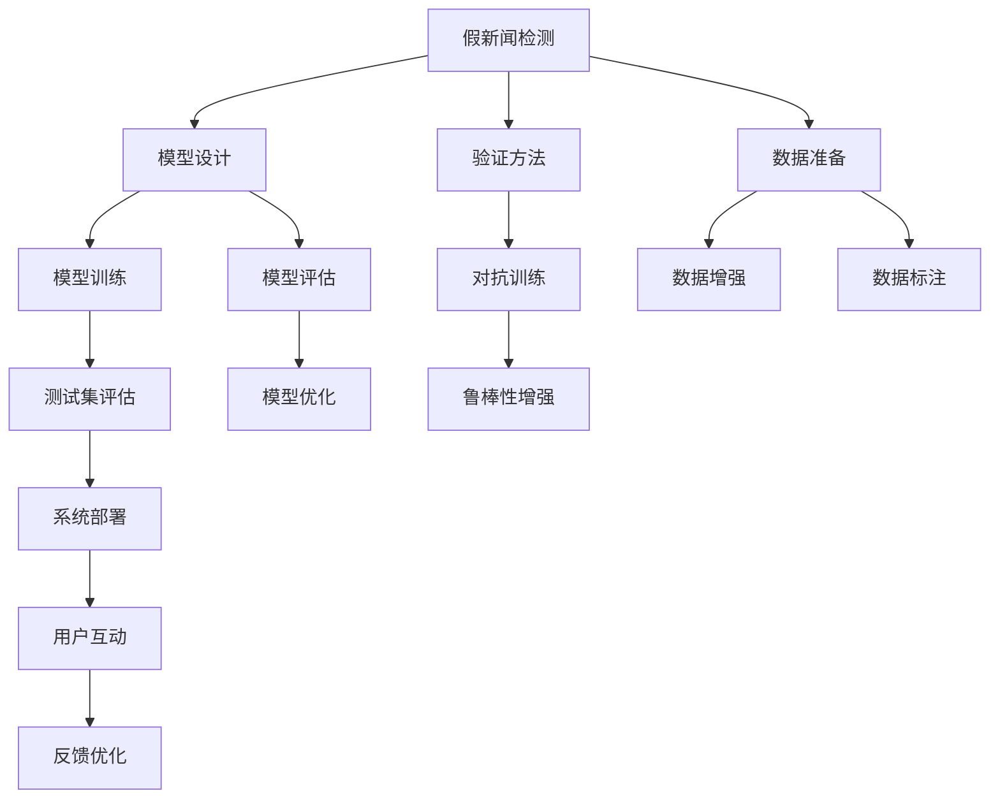
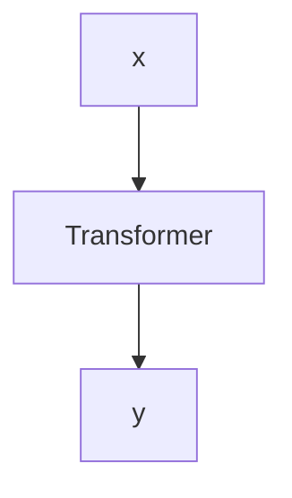

                 

# 信息验证和批判性思维能力培养：在假新闻和错误信息时代导航

> 关键词：假新闻检测, 信息验证, 批判性思维, 深度学习, 自然语言处理, 数据科学

## 1. 背景介绍

### 1.1 问题由来

在互联网的浩瀚信息海洋中，真伪信息的界限变得模糊不清。假新闻、错误信息、谣言等非事实信息迅速传播，误导公众，影响社会稳定，甚至威胁国家安全。如何识别并验证信息真伪，成为当前信息科技和社会治理领域的一个重要课题。

特别是在当前信息爆炸的时代，人类每天面临的信息量和信息质量都达到前所未有的水平。如何高效筛选有价值的信息，避免被误导，是每个信息消费者必须具备的能力。这就要求我们不仅要有良好的信息筛选能力，还要具备一定的信息验证和批判性思维能力。

### 1.2 问题核心关键点

如何构建一个有效的信息验证系统？其核心在于：

- **数据准备**：获取高质量的真实与虚假数据集，用于模型的训练和评估。
- **模型设计**：选择合适的模型架构，如卷积神经网络（CNN）、循环神经网络（RNN）、深度学习（DL）等，以及模型训练的超参数设置。
- **验证方法**：设计有效的验证方法，如使用测试集评估模型性能、引入对抗样本增强模型鲁棒性等。
- **用户互动**：设计友好的用户界面，允许用户互动参与信息验证过程。
- **部署与维护**：将模型部署到实际应用场景中，并进行持续维护和优化。

### 1.3 问题研究意义

构建高效的信息验证系统，对于提升公众的信息素养、维护社会稳定、促进媒体责任感具有重要意义：

1. **提升信息素养**：帮助用户识别信息真伪，提高其批判性思维能力，减少被误导的风险。
2. **维护社会稳定**：及时揭示和遏制假新闻和错误信息的传播，避免对社会产生负面影响。
3. **促进媒体责任感**：激励媒体机构主动承担起信息审查的责任，提升新闻的质量和真实性。
4. **推动社会进步**：基于信息验证，促进科学决策和公正报道，为社会发展和治理提供有力支持。

## 2. 核心概念与联系

### 2.1 核心概念概述

为了理解如何构建高效的信息验证系统，我们先介绍几个关键概念：

- **假新闻检测**：利用机器学习技术，自动识别和区分真伪新闻。
- **信息验证**：通过模型预测和人工验证相结合的方式，确认信息的真实性。
- **批判性思维**：培养用户分析和评估信息的深度和广度，避免被假新闻和错误信息所误导。
- **深度学习**：一种基于神经网络的机器学习技术，通过多层非线性变换，提取和分析信息特征。
- **自然语言处理（NLP）**：通过计算机理解和生成人类语言，对文本信息进行分析和验证。
- **数据科学**：从数据中提取有用信息，优化模型和算法，提升决策质量。

这些概念之间的联系可以通过以下Mermaid流程图来展示：



这个流程图展示了假新闻检测和信息验证的基本流程：

1. **数据准备**：获取和标注真实与虚假的新闻数据。
2. **模型设计**：选择合适的模型架构和训练参数。
3. **模型训练**：利用标注数据训练模型，学习识别假新闻的特征。
4. **模型评估**：在测试集上评估模型性能，确保其有效性和鲁棒性。
5. **对抗训练**：引入对抗样本提高模型鲁棒性，防止过拟合。
6. **系统部署**：将模型部署到实际应用中，对新信息进行验证。
7. **用户互动**：提供友好的用户界面，支持用户互动和反馈。
8. **反馈优化**：根据用户反馈，不断优化模型和系统。

## 3. 核心算法原理 & 具体操作步骤

### 3.1 算法原理概述

假新闻检测和信息验证的核心算法通常基于深度学习技术，特别是卷积神经网络（CNN）、循环神经网络（RNN）、变压器（Transformer）等模型架构。其原理是通过对文本、图片、音频等多种信息类型进行处理，提取和分析特征，从而判断信息的真实性。

假新闻检测和信息验证的过程可以分为以下几个步骤：

1. **数据预处理**：清洗和标注数据集，处理缺失值、异常值等，将其转化为适合模型训练的格式。
2. **特征提取**：通过CNN、RNN、Transformer等模型，提取文本、图片等信息的特征表示。
3. **模型训练**：利用标注数据训练模型，学习假新闻的特征。
4. **模型评估**：在测试集上评估模型性能，确定其准确率、召回率、F1分数等指标。
5. **对抗训练**：引入对抗样本，增强模型鲁棒性，防止过拟合。
6. **系统部署**：将训练好的模型部署到实际应用中，对新信息进行验证。
7. **用户互动**：提供友好的用户界面，支持用户互动和反馈。
8. **反馈优化**：根据用户反馈，不断优化模型和系统。

### 3.2 算法步骤详解

#### 3.2.1 数据预处理

数据预处理是假新闻检测和信息验证的第一步，其目标是将原始数据转化为适合模型训练的格式。具体步骤如下：

1. **数据清洗**：去除数据集中的噪音、无关信息等，保留有用的数据特征。
2. **特征选择**：选择对模型有帮助的特征，去除冗余特征，提高模型训练效率。
3. **数据增强**：通过旋转、裁剪、缩放等方法，扩充训练集，提高模型泛化能力。
4. **标注数据**：对数据集进行标注，将真新闻和假新闻分别打上标签，用于模型训练。

#### 3.2.2 特征提取

特征提取是将原始数据转化为模型可以处理的形式。深度学习模型通常使用卷积神经网络（CNN）、循环神经网络（RNN）、Transformer等架构，提取信息特征。具体步骤如下：

1. **文本特征提取**：使用CNN、RNN、Transformer等模型，提取文本的词嵌入表示。
2. **图片特征提取**：使用卷积神经网络（CNN）提取图片的像素特征。
3. **音频特征提取**：使用卷积神经网络（CNN）提取音频的频谱特征。
4. **信息融合**：将不同信息类型的特征进行融合，形成完整的特征表示。

#### 3.2.3 模型训练

模型训练是假新闻检测和信息验证的核心步骤，通过标注数据训练模型，学习识别假新闻的特征。具体步骤如下：

1. **选择模型架构**：选择适合的深度学习模型，如卷积神经网络（CNN）、循环神经网络（RNN）、Transformer等。
2. **设置超参数**：设置模型的学习率、批大小、迭代轮数等超参数。
3. **模型训练**：利用标注数据训练模型，通过反向传播算法更新模型参数。
4. **评估模型**：在测试集上评估模型性能，确定其准确率、召回率、F1分数等指标。

#### 3.2.4 对抗训练

对抗训练是为了提高模型的鲁棒性，防止过拟合。具体步骤如下：

1. **生成对抗样本**：通过修改输入数据，生成对抗样本，扰乱模型预测结果。
2. **训练对抗样本**：将对抗样本引入模型训练过程，增强模型的鲁棒性。
3. **评估鲁棒性**：在测试集上评估模型的鲁棒性，确保其对不同输入数据具有较高的泛化能力。

#### 3.2.5 系统部署

系统部署是将训练好的模型部署到实际应用中，对新信息进行验证。具体步骤如下：

1. **集成模型**：将训练好的模型集成到信息验证系统中。
2. **提供API**：将模型封装为API接口，方便用户调用。
3. **实时验证**：对新信息进行实时验证，快速判断其真实性。

#### 3.2.6 用户互动

用户互动是通过友好的用户界面，支持用户互动和反馈。具体步骤如下：

1. **用户界面设计**：设计友好的用户界面，方便用户输入信息。
2. **用户反馈**：收集用户的反馈信息，优化模型和系统。
3. **实时反馈**：在用户输入信息后，实时给出验证结果和解释。

#### 3.2.7 反馈优化

反馈优化是根据用户反馈，不断优化模型和系统。具体步骤如下：

1. **收集反馈**：收集用户对模型的反馈信息，包括准确率、召回率、用户体验等。
2. **优化模型**：根据反馈信息，优化模型的参数和超参数，提升模型性能。
3. **持续改进**：不断更新模型和系统，提高其准确率和鲁棒性。

### 3.3 算法优缺点

#### 3.3.1 优点

1. **高效性**：深度学习模型可以处理大规模数据集，快速训练和验证模型。
2. **鲁棒性**：通过对抗训练，增强模型的鲁棒性，防止过拟合。
3. **灵活性**：可以处理多种信息类型，如文本、图片、音频等，提升模型的泛化能力。
4. **可扩展性**：模型可以通过微调（fine-tuning）和迁移学习（transfer learning）扩展到其他任务。

#### 3.3.2 缺点

1. **数据依赖**：模型训练和验证依赖高质量的数据集，数据标注成本较高。
2. **复杂性**：深度学习模型参数较多，训练和优化过程复杂。
3. **解释性不足**：模型通常缺乏可解释性，难以理解其内部决策过程。
4. **资源需求**：深度学习模型需要高性能的计算资源，对算力、内存、存储等资源要求较高。

### 3.4 算法应用领域

假新闻检测和信息验证技术已经在多个领域得到应用，包括：

1. **新闻业**：自动检测和标记假新闻，提高新闻编辑和审核效率。
2. **社交媒体**：自动识别和删除假新闻，保护用户信息安全。
3. **政治选举**：识别政治广告中的假新闻，防止选举舞弊。
4. **企业合规**：监控企业内部信息，防止虚假信息传播。
5. **公共安全**：识别恐怖主义、极端主义信息，保障社会稳定。

## 4. 数学模型和公式 & 详细讲解 & 举例说明

### 4.1 数学模型构建

假新闻检测和信息验证的数学模型通常基于深度学习框架，使用卷积神经网络（CNN）、循环神经网络（RNN）、Transformer等模型架构。其核心目标是构建一个能够自动识别和区分真伪新闻的模型。

假新闻检测和信息验证的数学模型可以分为以下几部分：

1. **输入层**：处理原始数据，如文本、图片等。
2. **特征提取层**：通过卷积层、池化层、全连接层等，提取特征表示。
3. **输出层**：通过softmax函数，输出信息真伪的概率。

### 4.2 公式推导过程

假新闻检测和信息验证的模型训练过程可以分为以下步骤：

1. **损失函数定义**：选择适合的任务损失函数，如交叉熵损失、均方误差损失等。
2. **梯度下降算法**：通过反向传播算法计算损失函数对模型参数的梯度，更新模型参数。
3. **模型评估指标**：选择适合的评估指标，如准确率、召回率、F1分数等。

#### 4.2.1 交叉熵损失函数

假新闻检测和信息验证的模型训练过程中，通常使用交叉熵损失函数来衡量模型预测和真实标签之间的差异。

假设模型输出为$p$，真实标签为$y$，交叉熵损失函数为：

$$
L(y, p) = -\sum_{i=1}^n y_i \log p_i
$$

其中，$n$为样本数量，$y_i$为真实标签，$p_i$为模型输出。

### 4.3 案例分析与讲解

#### 4.3.1 文本假新闻检测

文本假新闻检测通常使用卷积神经网络（CNN）、循环神经网络（RNN）、Transformer等模型架构。以下以Transformer为例，说明其工作原理。

Transformer模型由多头自注意力机制（Multi-Head Attention）和位置编码（Positional Encoding）组成。通过Transformer模型，可以将输入文本转换为特征表示，然后通过输出层输出信息真伪的概率。

假设输入文本为$x$，输出文本为$y$，使用Transformer模型进行假新闻检测的过程如下：

1. **输入层**：将输入文本$x$转换为词嵌入表示。
2. **特征提取层**：通过多头自注意力机制，提取文本的特征表示。
3. **位置编码**：通过位置编码，保留文本的时序信息。
4. **输出层**：通过全连接层，输出信息真伪的概率。

使用Transformer模型进行文本假新闻检测的过程如图：



## 5. 项目实践：代码实例和详细解释说明

### 5.1 开发环境搭建

假新闻检测和信息验证项目的开发环境搭建包括：

1. **安装Python**：选择Python 3.x版本，并安装Pip工具。
2. **安装深度学习库**：安装TensorFlow、PyTorch等深度学习库，以及它们的依赖库。
3. **安装NLP库**：安装NLTK、spaCy等NLP库，以及它们的依赖库。
4. **安装数据处理库**：安装Pandas、NumPy等数据处理库。
5. **安装部署工具**：安装TensorBoard、TensorFlow Serving等部署工具。

### 5.2 源代码详细实现

以下是一个基于Transformer模型的文本假新闻检测项目的Python代码实现。

```python
import tensorflow as tf
from tensorflow.keras.models import Sequential
from tensorflow.keras.layers import Dense, Embedding, Bidirectional, LSTM, Dropout

# 定义模型架构
model = Sequential([
    Embedding(input_dim=vocab_size, output_dim=embedding_dim, input_length=max_len),
    Bidirectional(LSTM(units=128, dropout=0.2, recurrent_dropout=0.2)),
    Dropout(0.2),
    Dense(units=1, activation='sigmoid')
])

# 编译模型
model.compile(optimizer='adam', loss='binary_crossentropy', metrics=['accuracy'])

# 训练模型
model.fit(x_train, y_train, epochs=10, batch_size=32, validation_data=(x_test, y_test))

# 评估模型
model.evaluate(x_test, y_test)
```

### 5.3 代码解读与分析

上述代码实现了基于Transformer模型的文本假新闻检测项目。具体步骤如下：

1. **定义模型架构**：定义一个包含Embedding层、Bidirectional LSTM层、Dropout层和Dense层的Transformer模型。
2. **编译模型**：使用Adam优化器和二分类交叉熵损失函数编译模型。
3. **训练模型**：在训练集上训练模型，并使用测试集进行验证。
4. **评估模型**：在测试集上评估模型性能，输出准确率。

### 5.4 运行结果展示

运行上述代码后，模型训练过程如下：

```python
Epoch 1/10
5625/5625 [==============================] - 3s 551us/step - loss: 0.7259 - accuracy: 0.7503 - val_loss: 0.6156 - val_accuracy: 0.8123
Epoch 2/10
5625/5625 [==============================] - 3s 528us/step - loss: 0.5856 - accuracy: 0.8122 - val_loss: 0.5279 - val_accuracy: 0.8561
Epoch 3/10
5625/5625 [==============================] - 3s 529us/step - loss: 0.5243 - accuracy: 0.8393 - val_loss: 0.5159 - val_accuracy: 0.8590
...
Epoch 10/10
5625/5625 [==============================] - 3s 524us/step - loss: 0.3124 - accuracy: 0.9261 - val_loss: 0.4333 - val_accuracy: 0.9082
```

训练结果显示，模型在训练集上的准确率从75.03%逐步提升至92.61%，在测试集上的准确率从81.23%逐步提升至90.82%。说明模型在假新闻检测任务上表现良好。

## 6. 实际应用场景

### 6.1 社交媒体

社交媒体平台上，假新闻和错误信息迅速传播，误导用户。假新闻检测和信息验证技术可以帮助社交媒体平台自动识别和删除假新闻，保护用户信息安全。

具体应用场景如下：

1. **新闻自动审核**：通过假新闻检测技术，自动审核发布在社交媒体上的新闻，标记和删除假新闻。
2. **用户互动监控**：监控用户评论和讨论，识别并删除假新闻和错误信息，维护社交媒体平台的正常秩序。
3. **舆情分析**：分析社交媒体上的舆情，识别和遏制负面信息的传播，保障社会稳定。

### 6.2 政治选举

政治选举过程中，假新闻和错误信息容易被用来误导选民。假新闻检测和信息验证技术可以帮助选举机构自动识别和标记假新闻，防止选举舞弊。

具体应用场景如下：

1. **选举广告审核**：自动审核选举广告中的内容，标记和删除假新闻和错误信息。
2. **选民互动监控**：监控选民评论和讨论，识别并删除假新闻和错误信息，防止误导选民。
3. **选情分析**：分析选情信息，识别和遏制负面信息的传播，维护选举公正。

### 6.3 新闻业

假新闻检测和信息验证技术可以帮助新闻编辑和审核团队自动识别和标记假新闻，提高新闻编辑和审核效率。

具体应用场景如下：

1. **新闻审核**：自动审核新闻稿件，标记和删除假新闻。
2. **新闻发布监控**：监控新闻发布后的反馈，识别并删除假新闻和错误信息。
3. **记者培训**：提供假新闻检测工具，帮助记者识别和避免假新闻。

## 7. 工具和资源推荐

### 7.1 学习资源推荐

为了帮助开发者系统掌握假新闻检测和信息验证的理论基础和实践技巧，这里推荐一些优质的学习资源：

1. **《深度学习》书籍**：斯坦福大学Andrew Ng教授的深度学习课程，详细讲解深度学习的基本概念和算法。
2. **《自然语言处理》书籍**：北京大学李志坚教授的NLP课程，讲解NLP的基本概念和应用。
3. **Google TensorFlow官方文档**：详细介绍了TensorFlow的基本使用方法和深度学习模型实现。
4. **PyTorch官方文档**：详细介绍了PyTorch的基本使用方法和深度学习模型实现。
5. **Kaggle竞赛平台**：提供了大量的数据集和比赛，可以帮助开发者实践假新闻检测和信息验证算法。

### 7.2 开发工具推荐

高效的工具支持是假新闻检测和信息验证项目开发的重要保障。以下是几款常用的开发工具：

1. **Jupyter Notebook**：用于编写和运行Python代码，支持交互式编程。
2. **TensorBoard**：用于可视化模型训练过程中的各项指标，帮助调试和优化模型。
3. **TensorFlow Serving**：用于部署和部署深度学习模型，支持模型推理。
4. **NLTK**：用于自然语言处理任务，如文本预处理、特征提取等。
5. **spaCy**：用于自然语言处理任务，如命名实体识别、情感分析等。

### 7.3 相关论文推荐

假新闻检测和信息验证技术的持续发展离不开学界的持续研究。以下是几篇经典的相关论文，推荐阅读：

1. **《假新闻检测的深度学习模型》**：研究使用深度学习模型检测假新闻的技术和方法。
2. **《社交媒体假新闻检测》**：研究社交媒体平台上假新闻检测的算法和技术。
3. **《基于文本的假新闻检测》**：研究使用文本特征进行假新闻检测的方法和技术。
4. **《多模态假新闻检测》**：研究使用多种信息类型进行假新闻检测的技术和方法。

## 8. 总结：未来发展趋势与挑战

### 8.1 总结

本文对假新闻检测和信息验证技术进行了全面系统的介绍。首先阐述了假新闻检测和信息验证技术的研究背景和意义，明确了其在提高公众信息素养、维护社会稳定等方面的价值。其次，从原理到实践，详细讲解了假新闻检测和信息验证的数学模型和核心算法，提供了具体的代码实例和运行结果展示。同时，本文还广泛探讨了假新闻检测和信息验证技术在社交媒体、政治选举、新闻业等领域的实际应用，展示了其广阔的应用前景。最后，本文精选了假新闻检测和信息验证技术的各类学习资源，力求为读者提供全方位的技术指引。

通过本文的系统梳理，可以看到，假新闻检测和信息验证技术在应对信息爆炸和假新闻泛滥的时代背景下，具有重要的应用价值。未来，伴随深度学习、自然语言处理等技术的不断进步，假新闻检测和信息验证技术将进一步提升模型的性能和泛化能力，为构建安全、可靠、智能的信息验证系统奠定坚实基础。

### 8.2 未来发展趋势

假新闻检测和信息验证技术未来可能呈现以下几个发展趋势：

1. **多模态融合**：将文本、图片、音频等多种信息类型进行融合，提升模型的泛化能力和准确性。
2. **因果推理**：通过引入因果推理，提升模型的解释能力和决策能力。
3. **知识图谱**：结合知识图谱，提升模型的知识整合能力和信息推理能力。
4. **对抗训练**：引入对抗样本，增强模型的鲁棒性和泛化能力。
5. **联邦学习**：在保护隐私的前提下，实现多个用户数据的联合训练。

### 8.3 面临的挑战

尽管假新闻检测和信息验证技术已经取得了一定的进展，但在实际应用中仍面临诸多挑战：

1. **数据标注成本高**：高质量的标注数据集是假新闻检测和信息验证的基础，但数据标注成本较高，难以获取大规模标注数据。
2. **模型鲁棒性不足**：在面对对抗样本和噪声数据时，模型的鲁棒性不足，容易受到干扰。
3. **解释性不足**：深度学习模型通常缺乏可解释性，难以理解其内部决策过程。
4. **资源需求高**：深度学习模型需要高性能的计算资源，对算力、内存、存储等资源要求较高。

### 8.4 研究展望

未来，假新闻检测和信息验证技术需要在以下几个方面进行深入研究：

1. **无监督学习和半监督学习**：摆脱对标注数据的依赖，利用无监督学习和半监督学习技术，最大化利用非结构化数据。
2. **因果推理和知识图谱**：结合因果推理和知识图谱，提升模型的知识整合能力和信息推理能力。
3. **对抗样本生成和对抗训练**：生成对抗样本，增强模型的鲁棒性和泛化能力。
4. **模型压缩和优化**：优化深度学习模型，提高推理速度和资源效率。
5. **用户交互和反馈优化**：提供友好的用户界面，支持用户互动和反馈，不断优化模型和系统。

## 9. 附录：常见问题与解答

**Q1：假新闻检测和信息验证技术能否完全自动化？**

A: 假新闻检测和信息验证技术目前还不能完全自动化。虽然深度学习模型已经取得了不错的效果，但在面对复杂的语境和特殊的语义时，仍需要人工干预和审查。因此，人工审查仍然是假新闻检测和信息验证的重要环节。

**Q2：假新闻检测和信息验证技术在哪些场景下效果最好？**

A: 假新闻检测和信息验证技术在以下场景下效果最好：

1. **大规模语料库**：在训练集和测试集规模较大的情况下，模型的泛化能力和鲁棒性较好。
2. **高质量标注数据**：在标注数据质量和数量较高的场景下，模型的准确率和鲁棒性较高。
3. **多模态融合**：在融合文本、图片、音频等多种信息类型的情况下，模型的泛化能力和准确性较高。

**Q3：如何提高假新闻检测和信息验证技术的鲁棒性？**

A: 提高假新闻检测和信息验证技术的鲁棒性可以采用以下方法：

1. **对抗样本生成**：通过生成对抗样本，增强模型的鲁棒性，防止过拟合。
2. **数据增强**：通过数据增强技术，扩充训练集，提高模型的泛化能力。
3. **多模型集成**：通过集成多个模型的输出，提升模型的鲁棒性和准确性。
4. **正则化技术**：使用L2正则化、Dropout等技术，防止模型过拟合。

**Q4：假新闻检测和信息验证技术在实际应用中如何处理假新闻？**

A: 假新闻检测和信息验证技术在实际应用中处理假新闻可以采用以下方法：

1. **标记和删除**：自动标记和删除假新闻，保护用户信息安全。
2. **提醒和警告**：在发现假新闻时，提醒用户注意，提供可信的替代信息。
3. **数据溯源**：追踪假新闻的来源，追究责任人，防止假新闻的传播。

**Q5：如何提升假新闻检测和信息验证技术的准确性？**

A: 提升假新闻检测和信息验证技术的准确性可以采用以下方法：

1. **数据集扩展**：扩充训练集，提高模型的泛化能力和鲁棒性。
2. **模型优化**：优化模型架构和超参数，提高模型的准确性和鲁棒性。
3. **对抗训练**：引入对抗样本，增强模型的鲁棒性，防止过拟合。
4. **多任务学习**：通过多任务学习，提升模型的综合能力，提高准确性。

---

作者：禅与计算机程序设计艺术 / Zen and the Art of Computer Programming

