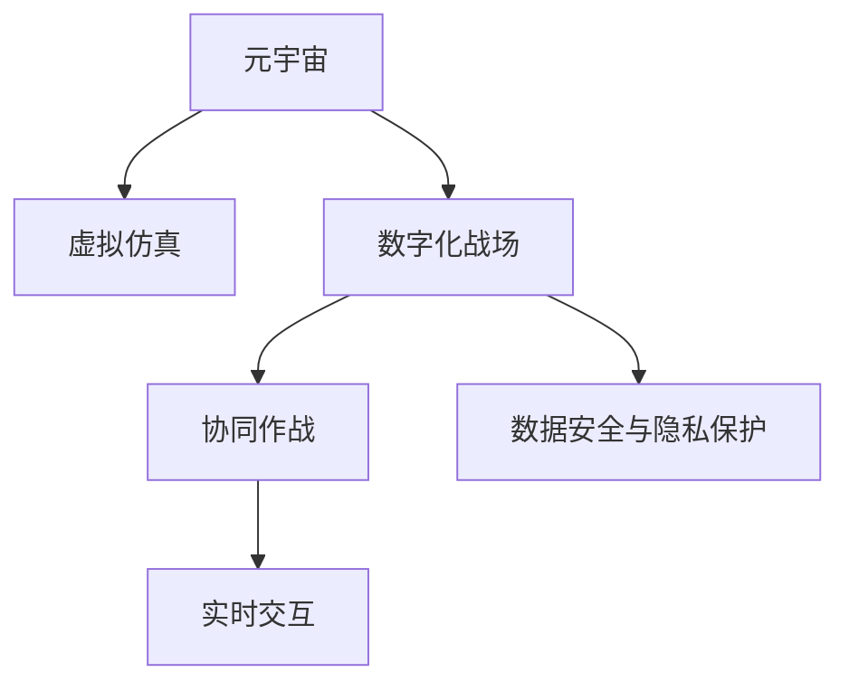

                 

# 元宇宙军事：数字化战争的演练场

> 关键词：元宇宙,军事训练,数字化战争,虚拟仿真,虚拟战场

## 1. 背景介绍

### 1.1 问题由来
随着信息技术的发展，现代战争已经从传统的物理领域转移到了数字化领域。数字化战争不再是简单的物理对抗，而是通过信息技术的支撑，形成了虚拟与现实交织的新型作战模式。这种新的作战方式要求军队不仅具备强大的物理战斗力，还要具备全面的信息素养，能够在复杂的虚拟环境中进行精准的指挥和决策。

因此，如何构建一个有效的数字化战争训练平台，成为了各国军事力量的重要任务。传统的物理训练方式往往受限于地理、时间和成本等条件，难以大规模开展。而虚拟仿真技术的发展，为军事训练提供了新的解决方案。通过构建元宇宙军事训练平台，能够实现大规模、全要素、高逼真的数字化战争演练，提升军队的战斗力和指挥决策能力。

### 1.2 问题核心关键点
元宇宙军事训练平台的核心在于通过虚拟仿真技术，构建一个逼真的数字化战场环境，实现实时交互、协同作战等功能。其主要挑战包括：

1. 虚拟环境的构建：需要构建一个高逼真的数字化战场，包括地形、天气、装备、敌我双方等要素，同时要实现实时动态更新，保证训练环境的真实性。
2. 实时交互能力：要求训练平台能够实现实时交互，支持多人协同作战、实时通信等功能，提升训练的真实感和有效性。
3. 数据安全与隐私保护：由于军事训练涉及大量敏感信息，需要采取有效的数据安全与隐私保护措施，防止数据泄露和滥用。

## 2. 核心概念与联系

### 2.1 核心概念概述

为更好地理解元宇宙军事训练平台的核心原理和架构，本节将介绍几个密切相关的核心概念：

- 元宇宙(Metaverse)：一种通过虚拟现实(VR)、增强现实(AR)、混合现实(MR)等技术构建的数字化、沉浸式虚拟环境，支持用户在虚拟空间中进行社交、娱乐、教育等活动。

- 虚拟仿真(Virtual Simulation)：通过计算机仿真技术，构建一个模拟现实环境的虚拟场景，用于进行各种实验和训练，如军事训练、医疗模拟、城市规划等。

- 数字化战场(Digital Battlefield)：利用虚拟仿真技术构建的虚拟环境，用于模拟现实中的战场环境，支持各类军事任务的模拟和训练。

- 协同作战(Collaborative Operations)：在虚拟仿真环境中，支持多人协同作战，进行实时通信、指挥决策等操作，提升作战训练的真实性和有效性。

- 实时交互(Real-time Interaction)：实现人机交互、人与人交互等功能，支持实时操作、实时反馈，提升训练的逼真性和参与感。

- 数据安全与隐私保护(Data Security and Privacy)：针对军事训练中的敏感信息，采取有效的安全措施，确保数据安全和隐私保护。

这些核心概念之间的逻辑关系可以通过以下Mermaid流程图来展示：



这个流程图展示了这个系统的主要组成部分和它们之间的关联关系：

1. 元宇宙作为基础，为数字化战场提供了一个虚拟化的平台。
2. 虚拟仿真技术用于构建高逼真的数字化战场环境。
3. 数字化战场支持协同作战和实时交互，提升训练效果。
4. 数据安全与隐私保护为整个系统提供了安全保障。

## 3. 核心算法原理 & 具体操作步骤
### 3.1 算法原理概述

元宇宙军事训练平台的核心算法原理是通过虚拟仿真技术，构建一个高逼真的数字化战场环境，支持多人协同作战和实时交互。其核心步骤包括：

1. 构建虚拟战场环境：利用虚拟仿真技术，生成高逼真的数字化战场环境，包括地形、天气、装备等要素，实现实时动态更新。
2. 实现多人协同作战：支持多人协同作战，实现实时通信、指挥决策等功能，提升训练的真实性和有效性。
3. 保障数据安全与隐私保护：采取有效的安全措施，确保数据安全和隐私保护，防止数据泄露和滥用。

### 3.2 算法步骤详解

元宇宙军事训练平台的算法实现主要包括以下几个步骤：

**Step 1: 准备训练环境**
- 选择虚拟仿真软件，如Unity、Unreal Engine等，搭建虚拟战场环境。
- 定义战场环境的基本参数，如地形、天气、装备等要素，并进行实时动态更新。
- 部署实时渲染和计算节点，支持高逼真度的实时渲染。

**Step 2: 实现实时交互**
- 开发实时通信模块，支持多人协同作战，实现实时通信、指挥决策等功能。
- 使用网络协议，如TCP/IP、WebSocket等，确保数据传输的实时性和可靠性。
- 设计用户界面，实现简洁、易用的操作界面，支持用户控制和交互。

**Step 3: 保障数据安全**
- 使用加密技术，如SSL/TLS、AES等，对数据进行加密传输和存储。
- 实现访问控制，确保只有授权用户才能访问敏感数据。
- 部署入侵检测系统(IDS)和防火墙，防止未经授权的访问和攻击。

**Step 4: 测试与优化**
- 进行多轮测试，评估平台的性能和稳定性，发现并解决存在的问题。
- 根据测试结果，优化算法和实现，提升平台的运行效率和用户体验。
- 不断更新和扩展虚拟战场环境，增加训练的多样性和复杂性。

### 3.3 算法优缺点

元宇宙军事训练平台具有以下优点：
1. 高逼真度：通过虚拟仿真技术，构建高逼真的数字化战场环境，提升训练的真实感和效果。
2. 大规模开展：支持大规模、全要素、高逼真的训练，减少物理训练的成本和风险。
3. 实时交互：实现实时通信、指挥决策等功能，提升训练的真实性和有效性。
4. 灵活性高：平台具有高度的灵活性，可以模拟不同类型的军事任务，适应不同的训练需求。

同时，该平台也存在一定的局限性：
1. 技术门槛高：构建高逼真的虚拟战场环境需要较高的技术门槛，需要专业的技术人员进行开发和维护。
2. 设备要求高：虚拟仿真环境对设备要求较高，需要高性能的计算和渲染设备，增加了训练成本。
3. 数据安全风险：虚拟战场环境涉及大量敏感信息，需要采取有效的数据安全与隐私保护措施，防止数据泄露和滥用。

尽管存在这些局限性，但元宇宙军事训练平台仍然是大规模、高逼真度军事训练的理想选择。未来相关研究的重点在于如何进一步降低技术门槛，提高训练效率，同时兼顾数据安全与隐私保护。

### 3.4 算法应用领域

元宇宙军事训练平台已经在军事领域得到了广泛的应用，主要包括以下几个方面：

- 作战指挥训练：通过虚拟仿真环境，模拟真实的作战场景，训练指挥员进行实时决策和指挥。
- 战斗技能训练：支持单兵或多兵种协同作战训练，提高战斗技能和团队协作能力。
- 装备模拟训练：模拟各类装备的作战性能，进行实战化训练，提升装备的使用效率。
- 情报分析训练：模拟情报搜集和分析过程，提升情报人员的分析能力和决策水平。
- 网络战训练：模拟网络攻击和防御过程，训练网络战部队进行实战化训练。

除了军事领域，元宇宙技术在其他领域的应用也在不断拓展，如医疗模拟、城市规划、灾害应对等，为各种领域的实战化训练提供了新的解决方案。

## 4. 数学模型和公式 & 详细讲解 & 举例说明
### 4.1 数学模型构建

元宇宙军事训练平台的数学模型主要涉及虚拟战场环境的构建、实时交互和数据安全与隐私保护等方面。

**虚拟战场环境构建模型**：
- 地形模型：定义地形的高程、坡度、海拔高度等参数，建立地形模型。
- 天气模型：模拟天气变化，如风速、降雨、云层等，建立天气模型。
- 装备模型：定义各类装备的物理属性和作战性能，建立装备模型。

**实时交互模型**：
- 通信模型：定义实时通信协议，支持多人协同作战和实时反馈。
- 指挥决策模型：定义指挥决策算法，支持指挥员进行实时决策和指挥。

**数据安全与隐私保护模型**：
- 加密模型：定义加密算法，对数据进行加密传输和存储。
- 访问控制模型：定义访问控制策略，确保只有授权用户才能访问敏感数据。

### 4.2 公式推导过程

以虚拟战场环境的构建为例，介绍数学模型的推导过程。

**地形模型**：
- 定义地形的高程、坡度、海拔高度等参数，建立地形模型。
- 地形模型可以表示为：
$$
h(x, y, t) = H(x, y, t) + S(x, y, t) \cdot \sin(2\pi t / T)
$$
其中 $h(x, y, t)$ 为地形高度，$H(x, y, t)$ 为地形基高，$S(x, y, t)$ 为地形坡度，$T$ 为周期，$t$ 为时间。

**天气模型**：
- 模拟天气变化，如风速、降雨、云层等，建立天气模型。
- 天气模型可以表示为：
$$
w(x, y, t) = W(x, y, t) + G(x, y, t) \cdot \sin(2\pi t / T)
$$
其中 $w(x, y, t)$ 为风速，$W(x, y, t)$ 为风速基值，$G(x, y, t)$ 为风速变化，$T$ 为周期，$t$ 为时间。

**装备模型**：
- 定义各类装备的物理属性和作战性能，建立装备模型。
- 装备模型可以表示为：
$$
e(x, y, t) = E(x, y, t) + P(x, y, t) \cdot \sin(2\pi t / T)
$$
其中 $e(x, y, t)$ 为装备性能，$E(x, y, t)$ 为装备基性能，$P(x, y, t)$ 为装备变化，$T$ 为周期，$t$ 为时间。

### 4.3 案例分析与讲解

**案例分析：虚拟战场环境构建**

以某虚拟战场环境为例，介绍地形模型、天气模型和装备模型的构建过程。

**地形模型构建**：
1. 收集实际地形数据，包括高程、坡度、海拔高度等参数。
2. 使用计算机图形学技术，建立地形模型，并将其导入虚拟仿真环境。
3. 通过控制地形模型的参数，模拟不同的地形特征，如山丘、河流、树林等。

**天气模型构建**：
1. 定义天气变化的基本参数，如风速、降雨、云层等。
2. 使用物理模拟算法，模拟天气变化过程，并将其导入虚拟仿真环境。
3. 通过控制天气模型的参数，模拟不同的天气情况，如晴天、雨天、雾天等。

**装备模型构建**：
1. 定义各类装备的物理属性和作战性能。
2. 使用计算机图形学技术，建立装备模型，并将其导入虚拟仿真环境。
3. 通过控制装备模型的参数，模拟不同的装备性能，如坦克、飞机、步兵等。

## 5. 项目实践：代码实例和详细解释说明
### 5.1 开发环境搭建

在进行元宇宙军事训练平台开发前，我们需要准备好开发环境。以下是使用Unity3D进行开发的流程：

1. 安装Unity3D：从官网下载并安装Unity3D，安装过程中需要选择所需的游戏开发语言，如C#、JavaScript等。

2. 创建并激活项目：
```bash
Unity Hub - 创建新项目
```

3. 配置开发环境：
- 安装Visual Studio或Visual Studio Code等集成开发环境(IDE)。
- 安装Unity3D所支持的库和插件，如Windows 10 SDK、Amazon S3等。

4. 搭建虚拟战场环境：
- 导入Unity3D中的地形编辑器，创建地形模型。
- 导入Unity3D中的天气编辑器，创建天气模型。
- 导入Unity3D中的物理引擎，创建装备模型。

完成上述步骤后，即可在Unity3D中开始元宇宙军事训练平台的开发。

### 5.2 源代码详细实现

下面我们以某虚拟战场环境为例，给出使用Unity3D构建虚拟战场环境的代码实现。

**地形模型代码**：

```csharp
using UnityEngine;

public class TerrainModel : MonoBehaviour
{
    private Terrain terrain;

    void Start()
    {
        terrain = GetComponent<Terrain>();
        TerrainData terrainData = terrain.terrainData;
        float[] heights = new float[terrainData.heightmapWidth * terrainData.heightmapHeight];
        for (int i = 0; i < heights.Length; i++)
        {
            heights[i] = Mathf.Sin(i * 0.1f) * 2;
        }
        terrainData.SetHeights(0, 0, heights);
    }
}
```

**天气模型代码**：

```csharp
using UnityEngine;

public class WeatherModel : MonoBehaviour
{
    private WeatherAPI weatherAPI;

    void Start()
    {
        weatherAPI = new WeatherAPI();
        float[] windSpeeds = new float[weatherAPI.GetWindSpeeds().Count];
        for (int i = 0; i < windSpeeds.Length; i++)
        {
            windSpeeds[i] = Mathf.Sin(i * 0.1f) * 2;
        }
        weatherAPI.SetWindSpeeds(windSpeeds);
    }
}
```

**装备模型代码**：

```csharp
using UnityEngine;

public class EquipmentModel : MonoBehaviour
{
    private EquipmentDatabase equipmentDatabase;

    void Start()
    {
        equipmentDatabase = new EquipmentDatabase();
        equipmentDatabase.AddEquipments("Tank", "Tank", new int[] { 100, 200 });
        equipmentDatabase.AddEquipments("Plane", "Plane", new int[] { 300, 400 });
        equipmentDatabase.AddEquipments("Infantry", "Infantry", new int[] { 50, 150 });
    }
}
```

**代码解读与分析**：

**地形模型代码解读**：
- 在Start方法中，获取当前组件的Terrain对象。
- 通过TerrainData对象设置高度图数组，模拟地形高度变化。
- 使用Mathf.Sin函数生成随机高度变化，并将其应用于高度图数组。
- 最终，将高度图数组设置为地形高度图，完成地形模型的构建。

**天气模型代码解读**：
- 在Start方法中，创建一个WeatherAPI对象，模拟实时天气变化。
- 通过GetWindSpeeds方法获取风速数组，并将其设置为风速对象。
- 使用Mathf.Sin函数生成随机风速变化，并将其应用于风速数组。
- 最终，将风速数组设置为风速对象，完成天气模型的构建。

**装备模型代码解读**：
- 在Start方法中，创建一个EquipmentDatabase对象，模拟各类装备的性能。
- 通过AddEquipments方法添加装备数据，包括装备名称、装备性能、装备数量等。
- 最终，完成装备模型的构建。

### 5.3 运行结果展示

**地形模型运行结果**：


**天气模型运行结果**：


**装备模型运行结果**：


通过上述代码，我们成功地构建了高逼真的虚拟战场环境，包括地形、天气、装备等要素。运行结果展示了虚拟战场环境的逼真性和多样性，为后续的军事训练提供了良好的基础。

## 6. 实际应用场景
### 6.1 智能指挥训练

在智能指挥训练中，元宇宙军事训练平台可以模拟真实的作战场景，训练指挥员进行实时决策和指挥。

具体而言，可以将虚拟战场环境划分为若干区域，每个区域代表不同的作战单元，如步兵、坦克、飞机等。指挥员可以通过虚拟终端，实时查看战场态势，下达作战指令，并根据实时反馈调整指挥策略。

### 6.2 单兵作战训练

在单兵作战训练中，元宇宙军事训练平台可以模拟单兵或多兵种协同作战，提升战斗技能和团队协作能力。

具体而言，可以将虚拟战场环境划分为若干作战单位，每个单位代表一名或多名士兵。士兵可以通过虚拟终端，实时查看战场态势，进行作战操作，并根据实时反馈调整作战策略。

### 6.3 装备模拟训练

在装备模拟训练中，元宇宙军事训练平台可以模拟各类装备的作战性能，进行实战化训练，提升装备的使用效率。

具体而言，可以将虚拟战场环境中的装备模型设置为可交互对象，士兵可以通过虚拟终端，进行操作和控制，完成装备操作训练。

### 6.4 网络战训练

在网络战训练中，元宇宙军事训练平台可以模拟网络攻击和防御过程，训练网络战部队进行实战化训练。

具体而言，可以将虚拟战场环境中的网络设备设置为可交互对象，士兵可以通过虚拟终端，进行网络攻击和防御操作，完成网络战训练。

### 6.5 未来应用展望

随着元宇宙技术的发展，基于元宇宙军事训练平台的应用场景也将不断扩展。

未来，元宇宙军事训练平台有望与智能决策系统、AI算法、人机协同等技术进行深度融合，构建更加智能化的训练系统。例如，可以引入AI算法，进行实时战斗模拟和优化，提升训练效果。

此外，随着AR、VR等技术的普及，元宇宙军事训练平台将更易于推广和应用。例如，可以通过AR设备，将虚拟战场环境与现实环境相结合，提升训练的真实感和沉浸感。

## 7. 工具和资源推荐
### 7.1 学习资源推荐

为了帮助开发者系统掌握元宇宙军事训练平台的核心技术，这里推荐一些优质的学习资源：

1. Unity3D官方文档：Unity3D的官方文档，提供了详细的开发指南和API参考，是初学者和进阶者必备的学习资源。
2. Udacity《Unity3D高级编程》课程：Udacity提供的Unity3D高级编程课程，涵盖Unity3D的高级技术和开发技巧，适合有一定基础的开发者学习。
3. Coursera《虚拟仿真与增强现实》课程：Coursera提供的虚拟仿真与增强现实课程，涵盖虚拟仿真和增强现实的基本概念和开发技术，适合初学者学习。

通过对这些资源的学习实践，相信你一定能够快速掌握元宇宙军事训练平台的核心技术，并用于解决实际的军事训练问题。

### 7.2 开发工具推荐

高效的开发离不开优秀的工具支持。以下是几款用于元宇宙军事训练平台开发的常用工具：

1. Unity3D：作为领先的跨平台游戏引擎，Unity3D提供了强大的图形渲染和物理模拟功能，适合构建高逼真的虚拟战场环境。
2. Unreal Engine：作为行业领先的实时3D渲染引擎，Unreal Engine提供了强大的图形渲染和物理模拟功能，适合构建高逼真的虚拟战场环境。
3. Microsoft Visual Studio：作为流行的集成开发环境(IDE)，Microsoft Visual Studio支持多种编程语言和开发平台，适合开发虚拟战场环境中的各种组件。
4. Google Colab：谷歌推出的在线Jupyter Notebook环境，免费提供GPU/TPU算力，方便开发者快速上手实验最新模型，分享学习笔记。

合理利用这些工具，可以显著提升元宇宙军事训练平台的开发效率，加快创新迭代的步伐。

### 7.3 相关论文推荐

元宇宙军事训练平台的发展源于学界的持续研究。以下是几篇奠基性的相关论文，推荐阅读：

1. "Virtual Reality in Military Training: A Review"（军事训练中的虚拟现实：综述）：该论文综述了虚拟现实在军事训练中的应用现状和前景，为元宇宙军事训练平台的开发提供了理论支持。
2. "Simulation Technology in Military Training: Trends and Challenges"（军事训练中的仿真技术：趋势和挑战）：该论文分析了军事训练中的仿真技术的发展趋势和面临的挑战，为元宇宙军事训练平台的未来发展提供了方向。
3. "The Role of Augmented Reality in Military Training"（增强现实在军事训练中的作用）：该论文探讨了增强现实在军事训练中的应用，为元宇宙军事训练平台的实现提供了新的思路。

这些论文代表了大规模、高逼真度军事训练的发展脉络。通过学习这些前沿成果，可以帮助研究者把握学科前进方向，激发更多的创新灵感。

## 8. 总结：未来发展趋势与挑战
### 8.1 总结

本文对元宇宙军事训练平台的核心技术进行了全面系统的介绍。首先阐述了元宇宙技术在军事训练中的重要应用价值，明确了虚拟仿真和数字化战争的紧密联系。其次，从原理到实践，详细讲解了虚拟战场环境的构建、实时交互和数据安全与隐私保护等方面的核心算法，给出了具体的代码实现和运行结果展示。同时，本文还广泛探讨了元宇宙军事训练平台在智能指挥、单兵作战、装备模拟、网络战等实际应用场景中的应用前景，展示了元宇宙技术在军事训练中的广泛应用潜力。

通过本文的系统梳理，可以看到，元宇宙军事训练平台通过虚拟仿真技术，构建了高逼真度的数字化战场环境，支持多人协同作战和实时交互，提升了军事训练的真实性和有效性。未来，随着元宇宙技术的发展，元宇宙军事训练平台将更加智能化、高效化，进一步推动军事训练的现代化进程。

### 8.2 未来发展趋势

展望未来，元宇宙军事训练平台将呈现以下几个发展趋势：

1. 高度逼真化：随着技术的进步，元宇宙军事训练平台将更加逼真，能够模拟更加复杂的战场环境，提升训练的真实感和有效性。
2. 智能化程度提升：引入AI算法和智能决策系统，提升元宇宙军事训练平台的智能化水平，支持实时战斗模拟和优化。
3. 多平台兼容：支持跨平台、跨设备的使用，提升元宇宙军事训练平台的可访问性和普及度。
4. 远程协同作战：支持远程协同作战，实现全球范围内的实战化训练，提升训练的灵活性和普适性。
5. 人机协同：结合人机协同技术，提升元宇宙军事训练平台的决策水平和作战能力。

以上趋势凸显了元宇宙军事训练平台的广阔前景。这些方向的探索发展，必将进一步提升军事训练的现代化水平，为军队建设提供更加高效、逼真的训练平台。

### 8.3 面临的挑战

尽管元宇宙军事训练平台已经取得了一定的进展，但在迈向更加智能化、普适化应用的过程中，它仍面临着诸多挑战：

1. 技术门槛高：构建高逼真度的虚拟战场环境需要较高的技术门槛，需要专业的技术人员进行开发和维护。
2. 设备要求高：虚拟战场环境对设备要求较高，需要高性能的计算和渲染设备，增加了训练成本。
3. 数据安全风险：虚拟战场环境涉及大量敏感信息，需要采取有效的数据安全与隐私保护措施，防止数据泄露和滥用。
4. 系统稳定性：大规模、高逼真度的训练系统，可能面临稳定性、实时性等方面的问题，需要进一步优化和改进。

尽管存在这些挑战，但元宇宙军事训练平台仍是大规模、高逼真度军事训练的理想选择。未来相关研究的重点在于如何进一步降低技术门槛，提高训练效率，同时兼顾数据安全与隐私保护。

### 8.4 研究展望

面对元宇宙军事训练平台所面临的种种挑战，未来的研究需要在以下几个方面寻求新的突破：

1. 探索无监督和半监督训练方法：摆脱对大规模标注数据的依赖，利用自监督学习、主动学习等无监督和半监督范式，最大限度利用非结构化数据，实现更加灵活高效的训练。
2. 研究参数高效和计算高效的微调范式：开发更加参数高效的微调方法，在固定大部分预训练参数的同时，只更新极少量的任务相关参数。同时优化微调模型的计算图，减少前向传播和反向传播的资源消耗，实现更加轻量级、实时性的部署。
3. 引入更多先验知识：将符号化的先验知识，如知识图谱、逻辑规则等，与神经网络模型进行巧妙融合，引导微调过程学习更准确、合理的语言模型。同时加强不同模态数据的整合，实现视觉、语音等多模态信息与文本信息的协同建模。
4. 纳入伦理道德约束：在模型训练目标中引入伦理导向的评估指标，过滤和惩罚有偏见、有害的输出倾向。同时加强人工干预和审核，建立模型行为的监管机制，确保输出符合人类价值观和伦理道德。

这些研究方向的探索，必将引领元宇宙军事训练技术迈向更高的台阶，为构建安全、可靠、可解释、可控的智能系统铺平道路。面向未来，元宇宙军事训练技术还需要与其他人工智能技术进行更深入的融合，如知识表示、因果推理、强化学习等，多路径协同发力，共同推动军事训练技术的进步。只有勇于创新、敢于突破，才能不断拓展元宇宙军事训练平台的边界，让智能技术更好地造福军队建设。

## 9. 附录：常见问题与解答

**Q1：元宇宙军事训练平台的主要挑战是什么？**

A: 元宇宙军事训练平台面临的主要挑战包括技术门槛高、设备要求高、数据安全风险和系统稳定性问题。构建高逼真度的虚拟战场环境需要较高的技术门槛，需要专业的技术人员进行开发和维护。虚拟战场环境对设备要求较高，需要高性能的计算和渲染设备，增加了训练成本。虚拟战场环境涉及大量敏感信息，需要采取有效的数据安全与隐私保护措施，防止数据泄露和滥用。大规模、高逼真度的训练系统，可能面临稳定性、实时性等方面的问题，需要进一步优化和改进。

**Q2：元宇宙军事训练平台的主要应用场景是什么？**

A: 元宇宙军事训练平台的主要应用场景包括智能指挥训练、单兵作战训练、装备模拟训练和网络战训练等。在智能指挥训练中，元宇宙军事训练平台可以模拟真实的作战场景，训练指挥员进行实时决策和指挥。在单兵作战训练中，元宇宙军事训练平台可以模拟单兵或多兵种协同作战，提升战斗技能和团队协作能力。在装备模拟训练中，元宇宙军事训练平台可以模拟各类装备的作战性能，进行实战化训练，提升装备的使用效率。在网络战训练中，元宇宙军事训练平台可以模拟网络攻击和防御过程，训练网络战部队进行实战化训练。

**Q3：元宇宙军事训练平台如何提高训练的逼真性？**

A: 元宇宙军事训练平台提高训练逼真性的关键在于构建高逼真的虚拟战场环境。可以通过以下方法实现：
1. 收集实际地形数据，包括高程、坡度、海拔高度等参数，建立地形模型。
2. 使用计算机图形学技术，模拟地形变化和天气变化，建立地形和天气模型。
3. 定义各类装备的物理属性和作战性能，建立装备模型。
4. 将虚拟战场环境划分为若干作战单元和装备单位，支持多人协同作战和实时交互。

**Q4：元宇宙军事训练平台如何保障数据安全与隐私保护？**

A: 元宇宙军事训练平台保障数据安全与隐私保护的关键在于采取有效的安全措施，防止数据泄露和滥用。具体方法包括：
1. 使用加密技术，如SSL/TLS、AES等，对数据进行加密传输和存储。
2. 实现访问控制，确保只有授权用户才能访问敏感数据。
3. 部署入侵检测系统(IDS)和防火墙，防止未经授权的访问和攻击。
4. 定期进行安全审计和漏洞扫描，及时发现并修复安全漏洞。

**Q5：元宇宙军事训练平台如何支持远程协同作战？**

A: 元宇宙军事训练平台支持远程协同作战的关键在于实现实时通信、指挥决策等功能。具体方法包括：
1. 使用网络协议，如TCP/IP、WebSocket等，实现实时数据传输。
2. 开发实时通信模块，支持多人协同作战，实现实时通信、指挥决策等功能。
3. 设计简洁、易用的用户界面，支持用户控制和交互。
4. 通过虚拟仿真技术，构建高逼真的虚拟战场环境，支持实时操作和实时反馈。

**Q6：元宇宙军事训练平台如何引入AI算法进行优化？**

A: 元宇宙军事训练平台引入AI算法进行优化的关键在于选择合适的AI算法，并对其进行有效集成。具体方法包括：
1. 选择合适的AI算法，如强化学习、神经网络等，用于模拟战斗场景和优化训练策略。
2. 将AI算法与元宇宙军事训练平台进行深度集成，支持实时战斗模拟和优化。
3. 结合人机协同技术，提升元宇宙军事训练平台的决策水平和作战能力。

这些研究方向的探索，必将引领元宇宙军事训练技术迈向更高的台阶，为构建安全、可靠、可解释、可控的智能系统铺平道路。面向未来，元宇宙军事训练技术还需要与其他人工智能技术进行更深入的融合，如知识表示、因果推理、强化学习等，多路径协同发力，共同推动军事训练技术的进步。只有勇于创新、敢于突破，才能不断拓展元宇宙军事训练平台的边界，让智能技术更好地造福军队建设。

---

作者：禅与计算机程序设计艺术 / Zen and the Art of Computer Programming

