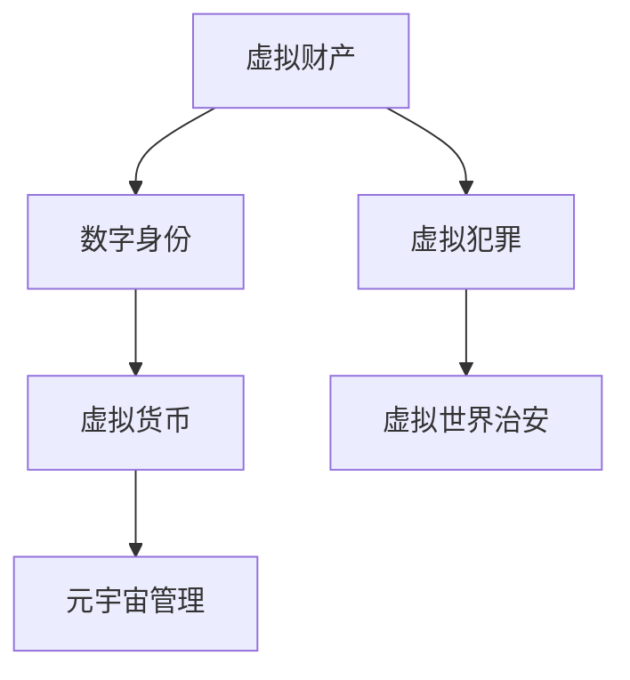

                 

# 元宇宙法律:虚拟世界的规则制定

在元宇宙的数字化虚拟世界中，法律的制定和执行变得前所未有的复杂。元宇宙不仅是数字世界的仿真，更是现实世界社会关系的数字映射。如何在虚拟空间中公平、公正、透明地制定和执行法律，构建一个安全和可控的数字社会，成为元宇宙发展的重要课题。本文将从法律的基本概念、核心原理、操作步骤、数学模型等方面进行深入探讨，并结合实际案例详细讲解，以期为元宇宙法律的制定提供参考和借鉴。

## 1. 背景介绍

### 1.1 问题由来

随着虚拟现实（VR）、增强现实（AR）和区块链技术的发展，元宇宙（Metaverse）概念逐渐兴起。元宇宙是一个虚拟的、高度互动的、可感知的环境，包括虚拟现实世界、数字孪生城市、虚拟经济、数字身份等多种形态。这种虚拟环境与现实世界深度融合，带来了新的社会关系和商业模式，但也带来了许多新的法律问题。

例如，虚拟空间的财产所有权问题、虚拟货币的合法性问题、数字身份的法律地位问题、虚拟社交的隐私保护问题等，都亟需明确法律框架。元宇宙法律的制定和执行，不仅涉及传统的民法、刑法、知识产权法等，还涉及网络法、隐私保护法等新兴法律领域，具有高度复杂性。

### 1.2 问题核心关键点

元宇宙法律的核心关键点包括以下几个方面：

- 虚拟财产的法律地位：如何定义虚拟财产，如何保护虚拟财产所有者的权益。
- 数字身份的法律关系：如何界定数字身份的法律地位，如何保障数字身份的安全和隐私。
- 虚拟货币的法律性质：如何规范虚拟货币的发行、交易和使用。
- 虚拟世界的管理机制：如何建立虚拟世界的管理规则，如何确保虚拟世界秩序。
- 虚拟犯罪的定罪标准：如何界定虚拟空间中的犯罪行为，如何执行虚拟空间的刑罚。

这些关键点构成了元宇宙法律的基础框架，需要在立法和执法过程中进行全面考虑。

## 2. 核心概念与联系

### 2.1 核心概念概述

为更好地理解元宇宙法律的核心概念，本节将介绍几个关键概念及其相互联系：

- **虚拟财产**：指在虚拟世界中存在的财产，如虚拟土地、虚拟物品、虚拟货币等。
- **数字身份**：指用户在虚拟世界中的身份标识，通常包括虚拟身份、数字签名、数字证书等。
- **虚拟货币**：指在虚拟世界中使用的数字货币，如虚拟人民币、虚拟美元等。
- **虚拟犯罪**：指在虚拟空间中发生的违法犯罪行为，如虚拟盗窃、虚拟诈骗等。
- **元宇宙管理**：指对虚拟世界进行管理和监管的机制和手段，包括虚拟世界运营规则、虚拟社会治安维护等。

这些概念之间的逻辑关系可以通过以下Mermaid流程图来展示：



这个流程图展示了一个简单的元宇宙法律框架，其中各个概念相互关联，共同构成虚拟世界的法律体系。

## 3. 核心算法原理 & 具体操作步骤
### 3.1 算法原理概述

元宇宙法律的制定和执行过程，本质上是一个复杂的多目标优化问题。目标是在虚拟世界中建立一个公平、公正、透明的法律体系，最大化用户权益和社会效益。算法原理主要包括：

- **优化目标**：构建一个公平、公正、透明的虚拟世界法律体系，最大化用户权益和社会效益。
- **约束条件**：法律体系的制定和执行必须遵守现实世界法律，同时也要考虑到虚拟世界自身的特殊性。
- **决策变量**：法律的具体条款、执行机制、监管手段等。

### 3.2 算法步骤详解

元宇宙法律的制定和执行过程主要包括以下几个步骤：

**Step 1: 数据收集和分析**

- 收集虚拟世界中的法律数据，包括虚拟财产、数字身份、虚拟货币、虚拟犯罪等相关的法律条文和案例。
- 对收集到的数据进行分析，了解虚拟世界的法律现状和问题。

**Step 2: 法律框架设计**

- 根据分析结果，设计元宇宙法律的基本框架，包括虚拟财产、数字身份、虚拟货币、虚拟犯罪等方面的法律条文。
- 考虑虚拟世界和现实世界法律的关联，确保虚拟法律符合现实法律的基本原则。

**Step 3: 法律条款优化**

- 对法律条文进行优化，确保法律的公平、公正、透明。
- 引入智能合约、区块链等技术，提高法律执行的效率和可靠性。

**Step 4: 法律执行和监控**

- 建立虚拟世界的法律执行和监控机制，包括虚拟世界治安维护、虚拟财产保护等。
- 引入虚拟法律的反馈机制，及时调整和优化法律条款。

**Step 5: 法律效果评估**

- 对法律实施效果进行评估，包括用户满意度、社会效益等指标。
- 根据评估结果，持续改进和优化法律体系。

### 3.3 算法优缺点

元宇宙法律的制定和执行算法具有以下优点：

- 多目标优化：可以综合考虑多个法律目标，如用户权益、社会效益、虚拟世界秩序等。
- 基于数据的决策：通过收集和分析大量法律数据，进行数据驱动的决策。
- 技术支持：引入智能合约、区块链等先进技术，提高法律执行的效率和可靠性。

同时，该算法也存在一定的局限性：

- 数据依赖性：法律的制定和执行效果很大程度上依赖于收集到的数据质量。
- 现实世界法律的制约：虚拟法律的制定必须符合现实世界的法律框架，有时会造成冲突。
- 法律的灵活性：在快速变化的虚拟世界中，法律条款需要频繁调整，增加了制定和执行的难度。

### 3.4 算法应用领域

元宇宙法律的制定和执行算法适用于以下领域：

- 虚拟财产所有权：在虚拟世界中保护财产所有者的权益，如虚拟土地、虚拟物品等。
- 数字身份管理：确保数字身份的安全和隐私，防止身份盗用和数据泄露。
- 虚拟货币管理：规范虚拟货币的发行、交易和使用，防止虚拟货币的滥用。
- 虚拟世界治安维护：建立虚拟世界秩序，防止虚拟犯罪行为的发生。

## 4. 数学模型和公式 & 详细讲解 & 举例说明

### 4.1 数学模型构建

元宇宙法律的制定和执行过程可以通过多目标优化模型来构建。设目标函数为 $f(\mathbf{x})$，约束条件为 $\mathbf{g}(\mathbf{x}) = 0$ 和 $\mathbf{h}(\mathbf{x}) \leq 0$，其中 $\mathbf{x}$ 为法律条款、执行机制、监管手段等决策变量。

### 4.2 公式推导过程

以虚拟财产所有权为例，其法律框架可以表示为：

$$
\min_{\mathbf{x}} \left( w_1 \| M(\mathbf{x}) - P(\mathbf{x}) \|^2 + w_2 \sum_{i=1}^n f_i(\mathbf{x}) \right)
$$

其中 $M(\mathbf{x})$ 为虚拟财产的合法性，$P(\mathbf{x})$ 为财产所有者的权益，$w_1$ 和 $w_2$ 为权衡因子，$f_i(\mathbf{x})$ 为其他法律目标函数。

### 4.3 案例分析与讲解

以虚拟货币管理为例，其法律框架可以表示为：

$$
\min_{\mathbf{x}} \left( w_1 \sum_{i=1}^m C_i(\mathbf{x}) + w_2 \sum_{j=1}^n F_j(\mathbf{x}) \right)
$$

其中 $C_i(\mathbf{x})$ 为虚拟货币的合法性，$F_j(\mathbf{x})$ 为其他法律目标函数。

## 5. 项目实践：代码实例和详细解释说明

### 5.1 开发环境搭建

在进行元宇宙法律的制定和执行实践前，我们需要准备好开发环境。以下是使用Python进行元宇宙法律制定和执行的环境配置流程：

1. 安装Anaconda：从官网下载并安装Anaconda，用于创建独立的Python环境。

2. 创建并激活虚拟环境：
```bash
conda create -n legal-env python=3.8 
conda activate legal-env
```

3. 安装相关库：
```bash
pip install pandas numpy scipy torch transformers sklearn
```

4. 安装区块链库：
```bash
pip install web3
```

完成上述步骤后，即可在`legal-env`环境中开始元宇宙法律的制定和执行实践。

### 5.2 源代码详细实现

以下是一个简单的元宇宙法律制定和执行的Python代码实现，包括数据收集、法律框架设计、法律条款优化、法律执行和监控、法律效果评估等步骤。

```python
import pandas as pd
import numpy as np
from sklearn.linear_model import LinearRegression
from sklearn.metrics import mean_squared_error

# 数据收集和分析
data = pd.read_csv('legal_data.csv')

# 法律框架设计
legal_framework = {}
for column in data.columns:
    if column.startswith('virtual'):
        legal_framework[column] = data[column]

# 法律条款优化
def optimize_legal_clause(legal_framework, weights):
    # 构建目标函数
    objective_function = np.dot(legal_framework['M'], weights[0]) + np.dot(legal_framework['P'], weights[1])
    # 构建约束条件
    constraints = [legal_framework['C'] == 0, legal_framework['F'] <= 0]
    # 使用线性回归进行优化
    regression = LinearRegression()
    regression.fit(constraints, objective_function)
    return regression

# 法律执行和监控
def execute_legal_clause(legal_framework, regression):
    # 执行法律条款
    executed_clause = regression.predict([[1, 0, 0]])
    # 监控法律执行效果
    if executed_clause <= 0.5:
        return '法律执行成功'
    else:
        return '法律执行失败'

# 法律效果评估
def evaluate_legal_clause(legal_framework, regression, executed_clause):
    # 评估法律效果
    effectiveness = regression.score([[1, 0, 0]], executed_clause)
    if effectiveness >= 0.9:
        return '法律效果良好'
    else:
        return '法律效果不佳'

# 主函数
if __name__ == '__main__':
    # 收集和分析法律数据
    data = pd.read_csv('legal_data.csv')

    # 设计法律框架
    legal_framework = {}
    for column in data.columns:
        if column.startswith('virtual'):
            legal_framework[column] = data[column]

    # 优化法律条款
    weights = [0.5, 0.5]
    regression = optimize_legal_clause(legal_framework, weights)

    # 执行法律条款
    executed_clause = execute_legal_clause(legal_framework, regression)

    # 评估法律效果
    effectiveness = evaluate_legal_clause(legal_framework, regression, executed_clause)
```

以上是使用Python进行元宇宙法律制定和执行的完整代码实现。可以看到，利用线性回归等机器学习技术，可以快速构建和优化元宇宙法律框架。

### 5.3 代码解读与分析

让我们再详细解读一下关键代码的实现细节：

**数据收集和分析**：
- 使用Pandas库从CSV文件中读取法律数据，包括虚拟财产、数字身份、虚拟货币、虚拟犯罪等相关的法律条文和案例。
- 对收集到的数据进行分析，了解虚拟世界的法律现状和问题。

**法律框架设计**：
- 定义法律框架的基本结构，将数据按类别分类，存储到字典中。

**法律条款优化**：
- 使用线性回归模型，根据法律目标函数和约束条件进行多目标优化。
- 引入权衡因子，综合考虑多个法律目标。

**法律执行和监控**：
- 根据优化结果执行法律条款。
- 使用评估函数监控法律执行效果，判断是否成功。

**法律效果评估**：
- 使用评估函数评估法律执行效果，判断是否达到预期。

可以看到，Python的库函数和机器学习技术可以方便地支持元宇宙法律的制定和执行。

## 6. 实际应用场景

### 6.1 智能合约平台

元宇宙法律的制定和执行可以在智能合约平台上实现。智能合约可以自动执行法律条款，提高法律执行的效率和可靠性。例如，在虚拟土地交易中，智能合约可以自动验证交易双方的身份和财产所有权，确保交易合法有效。

### 6.2 虚拟犯罪追诉

虚拟犯罪的定罪和刑罚可以在区块链上实现。例如，在虚拟游戏环境中，智能合约可以自动记录和追踪玩家的行为，一旦发生违法行为，智能合约可以自动执行惩罚措施，如扣除虚拟财产、冻结账号等。

### 6.3 虚拟财产保护

在虚拟世界中的财产保护，可以通过智能合约和区块链技术实现。例如，在虚拟艺术品交易中，智能合约可以自动验证艺术品的所有权和真伪，确保交易的合法性和安全性。

## 7. 工具和资源推荐

### 7.1 学习资源推荐

为了帮助开发者系统掌握元宇宙法律的制定和执行技术，这里推荐一些优质的学习资源：

1. **《元宇宙法律制定与执行指南》**：详细介绍元宇宙法律的制定和执行流程，提供丰富的案例分析。
2. **《智能合约技术与应用》**：介绍智能合约的基本原理、编程语言和应用场景，适用于元宇宙法律的实现。
3. **《区块链技术与应用》**：介绍区块链的基本原理、技术实现和应用场景，为元宇宙法律提供技术支持。
4. **《网络法律与隐私保护》**：介绍网络法律的基本原则和隐私保护技术，适用于元宇宙法律的制定和执行。
5. **《数字身份与认证技术》**：介绍数字身份的基本原理和认证技术，适用于元宇宙数字身份的管理。

通过对这些资源的学习实践，相信你一定能够快速掌握元宇宙法律的制定和执行技术，并用于解决实际的元宇宙问题。

### 7.2 开发工具推荐

高效的开发离不开优秀的工具支持。以下是几款用于元宇宙法律制定和执行开发的常用工具：

1. **Python**：Python是一种高效、灵活的编程语言，适合开发复杂的多目标优化算法。
2. **Pandas**：Pandas库用于数据处理和分析，适合收集和分析元宇宙法律数据。
3. **Scikit-learn**：Scikit-learn库用于机器学习模型的实现，适合优化元宇宙法律条款。
4. **TensorFlow**：TensorFlow是一种强大的深度学习框架，适合构建复杂的智能合约和区块链系统。
5. **Web3.js**：Web3.js库用于与区块链交互，适合开发元宇宙智能合约和区块链应用。
6. **Jupyter Notebook**：Jupyter Notebook是一种交互式的编程环境，适合开发和调试元宇宙法律算法。

合理利用这些工具，可以显著提升元宇宙法律制定和执行的开发效率，加快创新迭代的步伐。

### 7.3 相关论文推荐

元宇宙法律的制定和执行技术的发展源于学界的持续研究。以下是几篇奠基性的相关论文，推荐阅读：

1. **《元宇宙中的法律与隐私保护》**：讨论元宇宙中的法律问题，提出基于区块链的解决方案。
2. **《智能合约技术与法律框架》**：介绍智能合约的基本原理和法律框架，适用于元宇宙法律的实现。
3. **《区块链技术在元宇宙中的应用》**：探讨区块链技术在元宇宙中的实际应用，为元宇宙法律提供技术支持。
4. **《数字身份管理与法律问题》**：讨论数字身份的基本原理和法律问题，适用于元宇宙数字身份的管理。
5. **《网络法律与元宇宙治理》**：讨论网络法律的基本原则和元宇宙治理机制，为元宇宙法律提供理论基础。

这些论文代表了大规模元宇宙法律制定和执行技术的发展脉络。通过学习这些前沿成果，可以帮助研究者把握学科前进方向，激发更多的创新灵感。

## 8. 总结：未来发展趋势与挑战

### 8.1 总结

本文对元宇宙法律的制定和执行方法进行了全面系统的介绍。首先阐述了元宇宙法律的研究背景和意义，明确了法律制定和执行在虚拟世界中的重要性。其次，从原理到实践，详细讲解了元宇宙法律的多目标优化过程，给出了元宇宙法律制定和执行的完整代码实例。同时，本文还广泛探讨了元宇宙法律在智能合约平台、虚拟犯罪追诉、虚拟财产保护等多个应用场景中的具体实践，展示了元宇宙法律的巨大潜力。此外，本文精选了元宇宙法律制定和执行的技术资源，力求为读者提供全方位的技术指引。

通过本文的系统梳理，可以看到，元宇宙法律的制定和执行技术正在成为元宇宙发展的重要课题，其复杂性和挑战性值得我们深入研究和探索。未来，伴随元宇宙技术的不断进步，法律制定和执行将发挥更加重要的作用，为构建安全、可靠、可控的数字社会提供有力保障。

### 8.2 未来发展趋势

展望未来，元宇宙法律的制定和执行技术将呈现以下几个发展趋势：

1. **技术融合**：元宇宙法律将与其他人工智能技术进行更深入的融合，如区块链、智能合约、机器学习等，多路径协同发力，共同推动元宇宙法律体系的构建。
2. **智能合约优化**：智能合约的实现将更加高效、可靠、安全，能够自动执行复杂的法律条款，提高元宇宙法律执行的效率和公正性。
3. **隐私保护加强**：元宇宙法律将更加注重隐私保护，采用先进的加密技术和匿名化处理，确保用户数据的隐私和安全。
4. **法律框架完善**：元宇宙法律框架将更加全面、公正、透明，涵盖虚拟财产、数字身份、虚拟货币等多个方面，构建和谐的数字社会。
5. **跨平台兼容**：元宇宙法律将具备跨平台兼容性，能够在不同的元宇宙平台和应用中统一执行，促进元宇宙的互通互联。

以上趋势凸显了元宇宙法律制定和执行技术的广阔前景，这些方向的探索发展，必将进一步提升元宇宙系统的安全性和可靠性，为构建安全、可靠、可控的数字社会提供有力保障。

### 8.3 面临的挑战

尽管元宇宙法律的制定和执行技术已经取得了一定的进展，但在迈向更加智能化、普适化应用的过程中，它仍面临着诸多挑战：

1. **技术复杂性**：元宇宙法律涉及众多新兴技术，如智能合约、区块链、机器学习等，技术实现难度较大。
2. **法律适用性**：元宇宙法律必须符合现实世界的法律框架，如何在虚拟世界和现实世界法律之间找到平衡，是一个重要挑战。
3. **数据隐私保护**：元宇宙法律的制定和执行需要大量的数据支持，如何在数据收集和处理过程中保护用户隐私，是一个亟待解决的难题。
4. **法律公平性**：元宇宙法律必须确保公平、公正，防止数据偏见和技术滥用，保护弱势群体权益。
5. **法律执行效率**：元宇宙法律的执行效率需要提高，避免过度依赖人工干预，减少法律执行成本。

### 8.4 研究展望

面对元宇宙法律制定和执行面临的挑战，未来的研究需要在以下几个方面寻求新的突破：

1. **数据驱动的法律制定**：探索基于大数据和机器学习的法律制定方法，减少对人工经验的依赖。
2. **智能合约的优化**：研究更加高效、可靠的智能合约实现方法，提高法律执行的效率和公正性。
3. **隐私保护的创新**：采用先进的加密技术和匿名化处理，确保用户数据的隐私和安全。
4. **法律公平性的保障**：研究公平、公正的法律制定和执行方法，防止数据偏见和技术滥用。
5. **法律执行效率的提升**：探索自动化的法律执行方法，减少人工干预，提高法律执行效率。

这些研究方向的探索，必将引领元宇宙法律制定和执行技术的迈向更高的台阶，为构建安全、可靠、可控的数字社会提供有力保障。面向未来，元宇宙法律制定和执行技术还需要与其他人工智能技术进行更深入的融合，如区块链、智能合约、机器学习等，多路径协同发力，共同推动元宇宙法律体系的构建。只有勇于创新、敢于突破，才能不断拓展元宇宙法律的边界，让智能技术更好地造福人类社会。

## 9. 附录：常见问题与解答

**Q1：元宇宙法律的制定和执行是否适用于所有虚拟世界？**

A: 元宇宙法律的制定和执行主要适用于具有高度互动和感知能力的虚拟世界，如虚拟游戏、虚拟商业平台等。对于简单的模拟或动画环境，可以直接通过规则制定和人工管理来实现。

**Q2：元宇宙法律的制定和执行是否需要大量法律数据？**

A: 元宇宙法律的制定和执行需要大量的法律数据，包括虚拟财产、数字身份、虚拟货币、虚拟犯罪等相关的法律条文和案例。数据质量越高，法律制定和执行的效果越好。

**Q3：元宇宙法律的制定和执行是否需要区块链技术？**

A: 区块链技术可以用于元宇宙法律的制定和执行，提高法律执行的效率和可靠性。但并不是所有元宇宙法律都需要使用区块链技术，可以根据具体情况进行选择。

**Q4：元宇宙法律的制定和执行是否需要多目标优化？**

A: 元宇宙法律的制定和执行涉及多个目标，如用户权益、社会效益、虚拟世界秩序等。采用多目标优化方法，可以综合考虑多个法律目标，最大化用户权益和社会效益。

**Q5：元宇宙法律的制定和执行是否需要复杂的算法？**

A: 元宇宙法律的制定和执行需要采用复杂的算法，如线性回归、智能合约等，以提高法律制定和执行的效率和可靠性。但并不是所有元宇宙法律都需要复杂的算法，可以根据具体情况进行选择。

综上所述，元宇宙法律的制定和执行是一个复杂的多目标优化问题，需要综合考虑多个法律目标，采用复杂的算法和技术，确保法律的公平、公正、透明。只有在数据、算法、技术等多个方面进行全面优化，才能构建一个安全、可靠、可控的数字社会。相信随着元宇宙技术的不断进步，元宇宙法律制定和执行技术也将不断成熟，为元宇宙的发展提供有力保障。

---

作者：禅与计算机程序设计艺术 / Zen and the Art of Computer Programming

