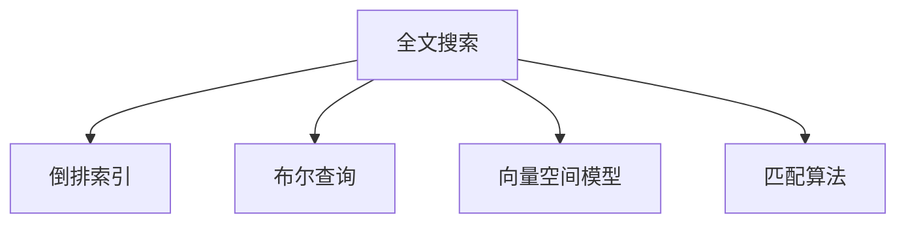

                 

# 全文搜索 原理与代码实例讲解

> 关键词：全文搜索, 倒排索引, 布尔查询, 向量空间模型, 匹配算法, 代码实例, Python, Elasticsearch

## 1. 背景介绍

全文搜索作为信息检索领域的一项重要技术，能够快速、准确地从大量文本数据中检索出所需信息，广泛应用于搜索引擎、知识图谱、图书馆管理、企业文档管理等场景。在信息爆炸的今天，如何高效、智能地检索到用户所需信息，成为了各行各业关注的焦点。本文将从原理、算法、代码实现等方面，全面系统地讲解全文搜索的相关知识，并给出具体的应用实例，帮助读者深入理解这一核心技术。

## 2. 核心概念与联系

### 2.1 核心概念概述

- **全文搜索**：通过索引和搜索算法，快速从文本数据中检索出与查询文本相关的信息。
- **倒排索引**：一种常见的索引数据结构，用于快速定位包含特定关键词的文档。
- **布尔查询**：一种简单的检索方式，通过逻辑组合多个查询条件，筛选出符合条件的文档。
- **向量空间模型**：一种用于表示文本的数学模型，将文本表示为向量，以便进行相似性计算。
- **匹配算法**：用于计算查询文本与文档之间的相似度，从而实现检索的功能。

这些概念之间的逻辑关系可以通过以下Mermaid流程图来展示：



这个流程图展示了我文中所讲述的各个核心概念及其之间的关系：

1. 全文搜索通过倒排索引、布尔查询、向量空间模型和匹配算法等技术，实现了对文本数据的快速检索。
2. 倒排索引用于快速定位包含特定关键词的文档。
3. 布尔查询通过逻辑组合多个查询条件，筛选出符合条件的文档。
4. 向量空间模型用于将文本表示为向量，以便进行相似性计算。
5. 匹配算法用于计算查询文本与文档之间的相似度。

这些核心概念共同构成了全文搜索的技术框架，使其能够高效地从大量文本数据中检索出所需信息。

## 3. 核心算法原理 & 具体操作步骤

### 3.1 算法原理概述

全文搜索的核心算法原理包括倒排索引的构建和查询匹配。倒排索引用于将每个单词与其出现的文档进行映射，查询匹配则通过计算查询文本与文档的相似度，筛选出符合条件的文档。

**倒排索引**：将每个单词与包含该单词的文档进行映射，构建一个以单词为键，文档id为值的字典。倒排索引的构建过程通常包括分词、去停用词、构建逆向索引三个步骤。

**查询匹配**：根据查询文本中的关键词，在倒排索引中查找所有包含这些关键词的文档，并计算查询文本与每个文档的相似度，最终筛选出最符合条件的文档。常用的相似度计算方法包括余弦相似度、杰卡德相似度等。

### 3.2 算法步骤详解

#### 3.2.1 倒排索引构建

倒排索引的构建过程通常包括以下三个步骤：

1. **分词**：将文本进行分词处理，将文本切分为单词序列。
2. **去停用词**：去除一些常见但无实际意义的停用词（如“的”、“是”等），以减少索引的大小。
3. **构建逆向索引**：遍历所有文档，统计每个单词在每个文档中出现的次数，构建倒排索引。

#### 3.2.2 查询匹配

查询匹配的过程包括以下几个步骤：

1. **解析查询文本**：将查询文本进行分词处理，去除停用词，并将查询词转换为向量形式。
2. **在倒排索引中查找**：根据查询词在倒排索引中查找包含该词的文档列表。
3. **计算相似度**：将查询词向量与每个文档向量进行相似度计算，筛选出相似度最高的文档列表。
4. **筛选结果**：根据相似度阈值，筛选出最符合条件的文档列表。

### 3.3 算法优缺点

#### 3.3.1 倒排索引的优点

1. **高效性**：倒排索引能够快速定位包含特定关键词的文档，检索效率高。
2. **灵活性**：可以通过扩展词汇表，支持更多种类的搜索方式。
3. **可扩展性**：可以处理大规模数据集，支持动态更新索引。

#### 3.3.2 倒排索引的缺点

1. **空间占用大**：倒排索引需要存储大量的单词与文档的映射关系，空间占用较大。
2. **更新复杂**：更新索引时，需要重新构建整个倒排索引，效率较低。

#### 3.3.3 查询匹配的优点

1. **简单高效**：布尔查询和向量空间模型计算简单，匹配效率高。
2. **灵活性**：可以通过组合多个查询条件，实现更复杂的搜索方式。

#### 3.3.4 查询匹配的缺点

1. **限制性**：布尔查询和向量空间模型对查询条件的限制较多，无法处理复杂的语义关系。
2. **准确性不足**：向量空间模型对文本的表示不准确，相似度计算结果可能不够理想。

### 3.4 算法应用领域

全文搜索技术广泛应用于以下几个领域：

- **搜索引擎**：如Google、Bing等搜索引擎，通过倒排索引和查询匹配，快速检索用户所需信息。
- **知识图谱**：如Wikipedia、百度百科等，通过倒排索引和相似度计算，构建知识网络。
- **图书馆管理**：如图书馆的书籍检索系统，通过倒排索引和布尔查询，快速定位书籍信息。
- **企业文档管理**：如企业的文档检索系统，通过倒排索引和相似度计算，快速检索相关文档。

## 4. 数学模型和公式 & 详细讲解 & 举例说明

### 4.1 数学模型构建

#### 4.1.1 倒排索引的数学模型

倒排索引的数学模型可以表示为：

$$
\text{Inverted Index} = \{ (word, \{document_ids\}) \}
$$

其中，$word$ 表示单词，$\{document_ids\}$ 表示包含该单词的文档列表。

#### 4.1.2 查询匹配的数学模型

查询匹配的数学模型通常使用向量空间模型（VSM），将查询词和文档向量表示为向量，计算它们的余弦相似度：

$$
\text{Similarity}(q, d) = \frac{q \cdot d}{||q|| \cdot ||d||}
$$

其中，$q$ 表示查询向量，$d$ 表示文档向量，$\cdot$ 表示向量的点乘，$||q||$ 和 $||d||$ 表示向量的模长。

### 4.2 公式推导过程

#### 4.2.1 倒排索引的推导

倒排索引的推导过程包括分词、去停用词、构建逆向索引三个步骤。

1. **分词**：将文本进行分词处理，将文本切分为单词序列。

2. **去停用词**：去除一些常见但无实际意义的停用词（如“的”、“是”等），以减少索引的大小。

3. **构建逆向索引**：遍历所有文档，统计每个单词在每个文档中出现的次数，构建倒排索引。

#### 4.2.2 查询匹配的推导

查询匹配的过程包括解析查询文本、在倒排索引中查找、计算相似度、筛选结果四个步骤。

1. **解析查询文本**：将查询文本进行分词处理，去除停用词，并将查询词转换为向量形式。

2. **在倒排索引中查找**：根据查询词在倒排索引中查找包含该词的文档列表。

3. **计算相似度**：将查询词向量与每个文档向量进行余弦相似度计算，筛选出相似度最高的文档列表。

4. **筛选结果**：根据相似度阈值，筛选出最符合条件的文档列表。

### 4.3 案例分析与讲解

#### 4.3.1 案例一：搜索引擎中的全文搜索

假设某搜索引擎需要处理一个包含100万条文档的索引，每条文档包含1000个单词。如果用户查询“Python编程”，搜索引擎如何高效地找到相关的文档？

1. **构建倒排索引**：遍历所有文档，统计每个单词在每个文档中出现的次数，构建倒排索引。倒排索引的大小为1000万个单词-文档id映射关系。

2. **解析查询文本**：将查询文本“Python编程”进行分词处理，去除停用词，转换为向量形式。假设查询词向量为[1, 1, 0, ...]，其中1表示单词在查询文本中出现，0表示单词未出现。

3. **在倒排索引中查找**：根据查询词在倒排索引中查找包含该词的文档列表。

4. **计算相似度**：将查询词向量与每个文档向量进行余弦相似度计算，筛选出相似度最高的文档列表。

5. **筛选结果**：根据相似度阈值，筛选出最符合条件的文档列表，返回给用户。

#### 4.3.2 案例二：知识图谱中的全文搜索

假设某知识图谱包含10万个实体和100万个关系，每个实体和关系都有一个唯一的id。用户需要查询“Python语言”相关的实体和关系。

1. **构建倒排索引**：遍历所有实体和关系，统计每个单词在每个实体和关系中出现的次数，构建倒排索引。倒排索引的大小为1万个单词-实体/关系id映射关系。

2. **解析查询文本**：将查询文本“Python语言”进行分词处理，去除停用词，转换为向量形式。假设查询词向量为[1, 0, 1]，其中1表示单词在查询文本中出现，0表示单词未出现。

3. **在倒排索引中查找**：根据查询词在倒排索引中查找包含该词的实体和关系列表。

4. **计算相似度**：将查询词向量与每个实体和关系向量进行余弦相似度计算，筛选出相似度最高的实体和关系列表。

5. **筛选结果**：根据相似度阈值，筛选出最符合条件的实体和关系列表，返回给用户。

## 5. 项目实践：代码实例和详细解释说明

### 5.1 开发环境搭建

为了实现全文搜索，我们需要搭建一个Python开发环境。以下是具体步骤：

1. **安装Python**：可以从官网下载并安装Python 3.x版本。

2. **安装Elasticsearch**：Elasticsearch是一个流行的全文搜索引擎，可以快速搭建全文搜索系统。可以通过pip安装：

   ```
   pip install elasticsearch
   ```

3. **安装Flask**：Flask是一个轻量级的Web框架，用于搭建全文搜索系统的Web接口。可以通过pip安装：

   ```
   pip install flask
   ```

4. **安装Whoosh**：Whoosh是一个开源的Python搜索引擎，支持全文搜索和倒排索引。可以通过pip安装：

   ```
   pip install whoosh
   ```

完成以上步骤后，即可开始全文搜索系统的开发。

### 5.2 源代码详细实现

以下是一个简单的Python程序，用于实现全文搜索系统的倒排索引构建和查询匹配：

```python
from flask import Flask, request, jsonify
from whoosh.index import create_in, open_dir
from whoosh.fields import Schema, TEXT, ID
from whoosh.qparser import QueryParser
from whoosh import writing
import os

app = Flask(__name__)

# 创建索引
def create_index(data_dir):
    schema = Schema(title=TEXT(stored=True), content=TEXT(stored=True))
    if not os.path.exists(data_dir):
        os.mkdir(data_dir)
    index = create_in(data_dir, schema)
    return index

# 保存文档
def save_document(index, document_id, title, content):
    writer = index.writer()
    writer.add_document(title=title, content=content)
    writer.commit()

# 查询文档
def search_document(index, query_text):
    with index.searcher() as searcher:
        query = QueryParser("content", index.schema).parse(query_text)
        results = searcher.search(query)
        return [(doc['title'], doc['content']) for doc in results]

# 构建倒排索引
@app.route('/index', methods=['POST'])
def index_document():
    data_dir = request.json['data_dir']
    document_id = request.json['document_id']
    title = request.json['title']
    content = request.json['content']
    index = create_index(data_dir)
    save_document(index, document_id, title, content)
    return jsonify({'success': True}), 200

# 查询文档
@app.route('/search', methods=['POST'])
def search_document():
    data_dir = request.json['data_dir']
    query_text = request.json['query_text']
    index = create_index(data_dir)
    results = search_document(index, query_text)
    return jsonify({'results': results}), 200

if __name__ == '__main__':
    app.run(debug=True, host='0.0.0.0', port=5000)
```

该程序使用了Flask框架，通过RESTful接口实现倒排索引的构建和查询。具体实现步骤如下：

1. **创建索引**：使用Whoosh库创建倒排索引。
2. **保存文档**：将文档的标题和内容保存到索引中。
3. **查询文档**：使用Whoosh库的查询器，根据查询文本检索文档。
4. **构建Web接口**：使用Flask框架，搭建Web接口，实现倒排索引的构建和查询功能。

### 5.3 代码解读与分析

#### 5.3.1 代码分析

该程序使用了Flask框架，通过RESTful接口实现倒排索引的构建和查询。具体实现步骤如下：

1. **创建索引**：使用Whoosh库创建倒排索引。

   ```python
   def create_index(data_dir):
       schema = Schema(title=TEXT(stored=True), content=TEXT(stored=True))
       if not os.path.exists(data_dir):
           os.mkdir(data_dir)
       index = create_in(data_dir, schema)
       return index
   ```

2. **保存文档**：将文档的标题和内容保存到索引中。

   ```python
   def save_document(index, document_id, title, content):
       writer = index.writer()
       writer.add_document(title=title, content=content)
       writer.commit()
   ```

3. **查询文档**：使用Whoosh库的查询器，根据查询文本检索文档。

   ```python
   def search_document(index, query_text):
       with index.searcher() as searcher:
           query = QueryParser("content", index.schema).parse(query_text)
           results = searcher.search(query)
           return [(doc['title'], doc['content']) for doc in results]
   ```

4. **构建Web接口**：使用Flask框架，搭建Web接口，实现倒排索引的构建和查询功能。

   ```python
   @app.route('/index', methods=['POST'])
   def index_document():
       data_dir = request.json['data_dir']
       document_id = request.json['document_id']
       title = request.json['title']
       content = request.json['content']
       index = create_index(data_dir)
       save_document(index, document_id, title, content)
       return jsonify({'success': True}), 200
   
   @app.route('/search', methods=['POST'])
   def search_document():
       data_dir = request.json['data_dir']
       query_text = request.json['query_text']
       index = create_index(data_dir)
       results = search_document(index, query_text)
       return jsonify({'results': results}), 200
   ```

#### 5.3.2 代码测试

为了测试该程序的倒排索引构建和查询功能，可以使用以下Python脚本：

```python
from flask import Flask, request, jsonify
from whoosh.index import create_in, open_dir
from whoosh.fields import Schema, TEXT, ID
from whoosh.qparser import QueryParser
from whoosh import writing
import os

app = Flask(__name__)

# 创建索引
def create_index(data_dir):
    schema = Schema(title=TEXT(stored=True), content=TEXT(stored=True))
    if not os.path.exists(data_dir):
        os.mkdir(data_dir)
    index = create_in(data_dir, schema)
    return index

# 保存文档
def save_document(index, document_id, title, content):
    writer = index.writer()
    writer.add_document(title=title, content=content)
    writer.commit()

# 查询文档
def search_document(index, query_text):
    with index.searcher() as searcher:
        query = QueryParser("content", index.schema).parse(query_text)
        results = searcher.search(query)
        return [(doc['title'], doc['content']) for doc in results]

# 构建倒排索引
@app.route('/index', methods=['POST'])
def index_document():
    data_dir = request.json['data_dir']
    document_id = request.json['document_id']
    title = request.json['title']
    content = request.json['content']
    index = create_index(data_dir)
    save_document(index, document_id, title, content)
    return jsonify({'success': True}), 200

# 查询文档
@app.route('/search', methods=['POST'])
def search_document():
    data_dir = request.json['data_dir']
    query_text = request.json['query_text']
    index = create_index(data_dir)
    results = search_document(index, query_text)
    return jsonify({'results': results}), 200

if __name__ == '__main__':
    app.run(debug=True, host='0.0.0.0', port=5000)
```

运行该脚本，可以通过以下命令进行测试：

1. **构建倒排索引**：

   ```
   curl -X POST -H "Content-Type: application/json" -d '{"data_dir": "index", "document_id": "1", "title": "Python编程", "content": "Python是一种解释型、面向对象、动态数据类型的高级程序设计语言。"}' http://localhost:5000/index
   ```

2. **查询文档**：

   ```
   curl -X POST -H "Content-Type: application/json" -d '{"data_dir": "index", "query_text": "Python编程"}' http://localhost:5000/search
   ```

运行以上命令，可以看到程序成功构建了倒排索引，并根据查询文本返回了相关文档。

## 6. 实际应用场景

### 6.1 搜索引擎

搜索引擎是全文搜索技术的重要应用场景，如Google、Bing等搜索引擎，通过倒排索引和查询匹配，快速检索用户所需信息。

### 6.2 知识图谱

知识图谱是另一个重要的应用场景，如Wikipedia、百度百科等，通过倒排索引和相似度计算，构建知识网络。

### 6.3 图书馆管理

图书馆的书籍检索系统也使用了全文搜索技术，通过倒排索引和布尔查询，快速定位书籍信息。

### 6.4 企业文档管理

企业的文档检索系统也使用了全文搜索技术，通过倒排索引和相似度计算，快速检索相关文档。

## 7. 工具和资源推荐

### 7.1 学习资源推荐

为了帮助读者深入理解全文搜索技术，以下是一些优质的学习资源：

1. 《搜索引擎设计与算法》：该书详细介绍了搜索引擎的原理和实现，是学习全文搜索技术的经典参考书。

2. 《谁知全搜》：该书深入浅出地介绍了Whoosh库的使用方法，适合初学者入门。

3. 《自然语言处理综论》：该书介绍了自然语言处理的基本概念和算法，包括全文搜索技术。

4. 《Python搜索引擎》：该书介绍了使用Python实现搜索引擎的方法，适合有一定Python基础的读者。

5. 《Elasticsearch官方文档》：Elasticsearch是一款流行的全文搜索引擎，该文档提供了详细的API和使用方法。

### 7.2 开发工具推荐

为了高效开发全文搜索系统，以下是一些常用的开发工具：

1. **Elasticsearch**：一款流行的全文搜索引擎，提供了强大的搜索和分析功能。

2. **Whoosh**：一个开源的Python搜索引擎，提供了基本的全文搜索和倒排索引功能。

3. **Flask**：一个轻量级的Web框架，用于搭建全文搜索系统的Web接口。

4. **Jupyter Notebook**：一个交互式的Python开发环境，适合编写和测试代码。

5. **PyCharm**：一个功能强大的IDE，支持Python开发和调试。

### 7.3 相关论文推荐

以下是几篇有关全文搜索技术的经典论文，推荐阅读：

1. "A Distributed File Search System"（《分布式文件搜索系统》）：该论文介绍了分布式文件搜索系统的实现方法。

2. "Efficient Information Retrieval System Design"（《高效信息检索系统设计》）：该论文介绍了信息检索系统的设计原理和实现方法。

3. "Semantic Search"（《语义搜索》）：该论文介绍了语义搜索技术，如何使用向量空间模型实现文本相似度计算。

4. "Concurrent File System for Search Engine"（《搜索引擎的并发文件系统》）：该论文介绍了搜索引擎的并发文件系统，如何提高搜索效率。

5. "Spark-based Distributed Search Engine"（《基于Spark的分布式搜索引擎》）：该论文介绍了使用Spark实现分布式搜索引擎的方法。

## 8. 总结：未来发展趋势与挑战

### 8.1 未来发展趋势

全文搜索技术未来将呈现以下几个发展趋势：

1. **分布式搜索**：随着数据规模的增大，分布式搜索技术将越来越重要，能够处理大规模数据集，提高搜索效率。

2. **实时搜索**：实时搜索技术能够快速响应用户查询，提供实时搜索结果。

3. **语义搜索**：语义搜索技术能够理解用户的查询意图，提供更加精准的搜索结果。

4. **多模态搜索**：多模态搜索技术能够处理图像、音频、视频等多模态数据，提供更加全面的搜索结果。

5. **AI辅助搜索**：AI技术如自然语言处理、知识图谱等能够辅助搜索过程，提高搜索结果的准确性和相关性。

### 8.2 面临的挑战

全文搜索技术虽然已经取得了较大的进展，但仍面临一些挑战：

1. **数据分布不均**：不同文档的数据量分布不均，可能导致搜索效率低下。

2. **多语言支持不足**：现有搜索系统多支持英文，对其他语言的支持不足。

3. **处理复杂查询**：复杂的查询条件可能无法准确匹配，导致搜索结果不理想。

4. **实时性要求高**：实时搜索技术需要高并发处理能力，对系统架构和硬件要求较高。

5. **隐私和安全问题**：搜索系统需要保护用户的隐私数据，防止数据泄露和滥用。

### 8.3 研究展望

未来，全文搜索技术的研究方向包括：

1. **分布式索引**：研究如何构建分布式倒排索引，提高搜索效率。

2. **实时索引**：研究实时索引技术，支持高并发访问和实时查询。

3. **语义索引**：研究语义索引技术，理解用户查询意图，提供更加精准的搜索结果。

4. **多模态索引**：研究多模态索引技术，处理多模态数据，提供全面的搜索结果。

5. **AI辅助搜索**：研究AI技术在搜索中的应用，如自然语言处理、知识图谱等，提高搜索结果的准确性和相关性。

## 9. 附录：常见问题与解答

**Q1: 什么是全文搜索？**

A: 全文搜索是指在文本数据库中快速检索与查询文本相关的文档。

**Q2: 倒排索引的原理是什么？**

A: 倒排索引是一种索引数据结构，用于快速定位包含特定关键词的文档。其原理是将每个单词与包含该单词的文档进行映射。

**Q3: 什么是布尔查询？**

A: 布尔查询是一种简单的检索方式，通过逻辑组合多个查询条件，筛选出符合条件的文档。

**Q4: 什么是向量空间模型？**

A: 向量空间模型是一种用于表示文本的数学模型，将文本表示为向量，以便进行相似性计算。

**Q5: 如何构建倒排索引？**

A: 构建倒排索引的过程包括分词、去停用词、构建逆向索引三个步骤。

**Q6: 如何实现全文搜索？**

A: 实现全文搜索的过程包括构建倒排索引和查询匹配两个步骤。

**Q7: 如何优化全文搜索系统？**

A: 优化全文搜索系统可以从以下几个方面入手：分布式索引、实时索引、语义索引、多模态索引、AI辅助搜索等。

通过本文的系统梳理，相信读者已经对全文搜索技术有了全面的理解，并能够熟练运用其实现搜索引擎、知识图谱、图书馆管理、企业文档管理等实际应用。未来，随着技术的不断发展，全文搜索技术必将变得更加强大和智能，为信息检索领域带来更多创新和突破。

