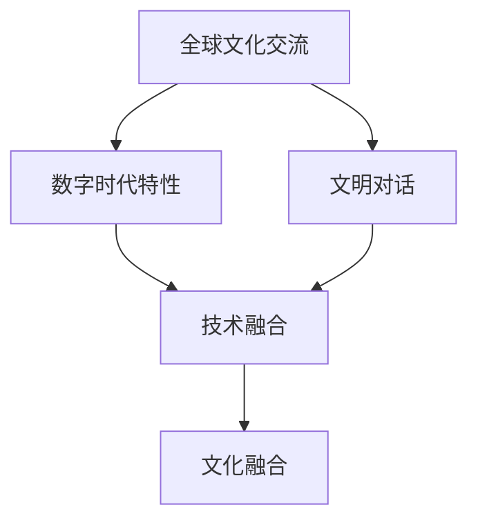

                 

# 全球脑与文化融合:数字时代的文明对话

## 1. 背景介绍

### 1.1 问题由来
在人类历史的长河中，文明的演进与交流一直是个永恒的主题。从古丝绸之路的贸易与文化互鉴，到全球化背景下的互联网时代，不同文化之间的交流与融合始终促进着人类社会的进步与发展。

然而，随着信息技术的飞速发展，数字时代的到来，人类文化交流的方式和深度正在发生着翻天覆地的变化。网络成为连接不同文明的桥梁，但同时也引发了新的挑战。如何利用数字技术促进全球文化融合，让不同文明的声音在数字化语境中互相倾听、理解，成为摆在我们面前的重要课题。

### 1.2 问题核心关键点
这一问题涉及以下核心关键点：
- **全球文化交流**：不同文化之间的语言、风俗、思想交流。
- **数字时代特性**：互联网、人工智能、大数据等技术对文化交流的影响。
- **文明对话**：不同文明之间通过数字技术实现对话与理解。
- **技术融合**：如何使文化交流与技术进步相结合，实现文明互鉴。
- **挑战与应对**：如何在技术快速发展中保持文化多样性，避免单一文化霸权。

## 2. 核心概念与联系

### 2.1 核心概念概述
为了更好地理解这一主题，我们先介绍几个核心概念：

- **全球文化交流**：不同文明之间的语言、思想、艺术等文化元素的交流和互鉴。
- **数字时代特性**：互联网、人工智能、大数据等技术对人类社会生活的广泛影响。
- **文明对话**：不同文明之间通过交流、对话，实现思想、文化、价值观上的互相理解与认同。
- **技术融合**：利用数字技术实现文化交流与文明对话，包括但不限于多语言翻译、文化分析、跨文化交流平台等。
- **文化融合**：在保持文化多样性的基础上，通过数字技术的促进，实现不同文明之间的深度融合。

这些概念之间的联系可以通过以下Mermaid流程图来展示：



这个流程图展示了全球文化交流、数字时代特性、文明对话、技术融合和文化融合之间的联系。

## 3. 核心算法原理 & 具体操作步骤
### 3.1 算法原理概述
数字时代促进文明对话的算法原理，可以从以下几个方面理解：

- **数据收集与处理**：通过大规模爬虫技术，从互联网收集各种文化信息，如文章、视频、音频等。
- **语言翻译技术**：使用机器翻译技术，将不同语言的文化作品翻译成目标语言，使不同文明之间的对话成为可能。
- **文化分析与理解**：利用自然语言处理（NLP）和计算机视觉技术，对收集到的文化作品进行情感分析、主题分类等处理，理解不同文化的特性。
- **跨文化交流平台**：构建基于互联网的交流平台，支持多语言交流，鼓励不同文化之间的互动。

### 3.2 算法步骤详解
以下详细解释基于这些原理的算法步骤：

**Step 1: 数据收集与预处理**
- 使用网络爬虫从互联网收集不同语言、不同文化的文本、视频、音频等数据。
- 对收集到的数据进行清洗和标注，去除无关内容，标注文本的主题、情感等信息。

**Step 2: 语言翻译与文化作品处理**
- 使用机器翻译技术，将不同语言的文化作品翻译成目标语言。
- 对翻译后的文本进行NLP处理，提取关键信息，如主题、情感等。

**Step 3: 文化理解与分析**
- 利用情感分析、主题分类等技术，理解不同文化作品的情感倾向和主题内容。
- 使用文化图谱技术，将不同文化之间的相似性和差异性进行可视化表示。

**Step 4: 跨文化交流平台的构建**
- 开发基于互联网的交流平台，支持多语言交流。
- 设计互动界面，鼓励用户分享和讨论不同文化的内容。

**Step 5: 文明对话与文化融合的促进**
- 通过交流平台促进不同文化之间的对话。
- 定期举办线上线下文化交流活动，如虚拟展览、跨文化演讲等。

### 3.3 算法优缺点
基于数字技术的文明对话算法具有以下优点：
1. **高效性**：使用算法可以快速处理大量文化数据，促进跨文化交流。
2. **广泛性**：算法能够处理不同语言、不同文化的交流，促进全球文化融合。
3. **可扩展性**：算法可以随着技术发展进行优化和升级，保持其时效性和适应性。

同时，该算法也存在一些局限：
1. **准确性问题**：机器翻译和NLP处理可能存在误差，影响文化作品的准确理解。
2. **数据隐私问题**：大规模数据收集和处理可能引发隐私保护问题。
3. **文化误解**：算法可能无法完全理解不同文化背景下的微妙差异。

### 3.4 算法应用领域

基于数字技术的文明对话算法在多个领域得到了应用：

- **教育**：在线跨文化教育平台，让学生了解不同文化背景下的知识。
- **文化交流**：线上文化交流活动，促进不同文化之间的互动和理解。
- **社交媒体**：跨文化社交媒体平台，支持不同语言用户的交流。
- **商业**：跨境电商、文化旅游等行业，利用数字技术促进不同文化背景下的商业合作。

## 4. 数学模型和公式 & 详细讲解  
### 4.1 数学模型构建

为了更好地理解数字时代文明对话的技术实现，我们以机器翻译为例，介绍数学模型的构建过程。

假设我们有两个语言 $L_1$ 和 $L_2$，翻译模型 $M_{\theta}$ 将 $L_1$ 中的文本映射到 $L_2$ 中。我们希望通过训练模型，使其能够准确地将 $L_1$ 中的句子翻译成 $L_2$ 中的句子。

**Step 1: 定义模型与损失函数**
- 定义模型 $M_{\theta}$，其参数 $\theta$ 通过神经网络表示。
- 定义损失函数 $\mathcal{L}(\theta)$，衡量模型翻译结果与真实结果之间的差异。

**Step 2: 训练模型**
- 使用大规模双语对照数据集进行训练，最小化损失函数 $\mathcal{L}(\theta)$。
- 使用梯度下降等优化算法，更新模型参数 $\theta$。

**Step 3: 评估模型**
- 在测试集上评估模型性能，如BLEU、ROUGE等指标。
- 根据评估结果，调整模型参数，优化翻译效果。

### 4.2 公式推导过程

以神经机器翻译（Neural Machine Translation, NMT）为例，推导其数学模型和损失函数。

假设 $x$ 为输入的 $L_1$ 文本，$y$ 为对应的 $L_2$ 文本。模型 $M_{\theta}$ 由编码器 $E_{\theta}$ 和解码器 $D_{\theta}$ 组成，其中 $E_{\theta}$ 将输入 $x$ 编码成向量 $h$，$D_{\theta}$ 将向量 $h$ 解码成输出 $y$。

假设 $h$ 的长度为 $d$，则模型的参数 $\theta$ 包括 $E_{\theta}$ 和 $D_{\theta}$ 的所有可学习参数。损失函数 $\mathcal{L}(\theta)$ 定义为：

$$
\mathcal{L}(\theta) = -\frac{1}{N}\sum_{i=1}^N \sum_{j=1}^{|y_i|} \log p_{\theta}(y_i|x_i)
$$

其中，$p_{\theta}(y_i|x_i)$ 表示模型在输入 $x_i$ 下输出 $y_i$ 的概率，$|y_i|$ 表示输出 $y_i$ 的长度。

模型的训练目标是最小化损失函数 $\mathcal{L}(\theta)$，使得 $M_{\theta}$ 能够准确地将 $x$ 翻译成 $y$。

### 4.3 案例分析与讲解

以下以一个简单的例子说明机器翻译的实现过程。

假设我们有一个英文句子 "I love you"，需要翻译成中文。使用机器翻译模型，首先将英文句子编码为向量 $h$，然后使用解码器 $D_{\theta}$ 将 $h$ 解码为中文文本 "我爱你"。

通过训练模型，我们可以使 $M_{\theta}$ 尽可能准确地将不同语言之间的文本进行翻译。

## 5. 项目实践：代码实例和详细解释说明
### 5.1 开发环境搭建

要进行机器翻译的项目实践，我们需要搭建一个开发环境。以下是Python的开发环境配置步骤：

1. 安装Python：
```bash
sudo apt-get update
sudo apt-get install python3
```

2. 安装虚拟环境管理工具：
```bash
pip install virtualenv
```

3. 创建虚拟环境：
```bash
virtualenv env
source env/bin/activate
```

4. 安装必要的库：
```bash
pip install torch numpy scipy pandas sklearn transformers
```

### 5.2 源代码详细实现

以下是一个简单的机器翻译示例，展示如何利用Hugging Face的Transformer库实现。

**Step 1: 准备数据**
- 下载WMT'14英语-法语数据集，包括训练集、验证集和测试集。

```python
from transformers import data_utils
data_utils.download('wmt14.en-de')

# 加载数据集
train_data = data_utils.load_dataset('wmt14', 'en-de', split='train')
val_data = data_utils.load_dataset('wmt14', 'en-de', split='validation')
test_data = data_utils.load_dataset('wmt14', 'en-de', split='test')
```

**Step 2: 数据预处理**
- 对数据进行分句处理，将英文句子转换为Token，并对中文句子进行编码。

```python
from transformers import MarianMTModel, MarianTokenizer

tokenizer = MarianTokenizer.from_pretrained('facebook/wmt-en-de')
model = MarianMTModel.from_pretrained('facebook/wmt-en-de')
```

**Step 3: 训练模型**
- 使用训练集进行模型训练，最小化损失函数。

```python
import torch
from transformers import AdamW, get_linear_schedule_with_warmup

optimizer = AdamW(model.parameters(), lr=5e-5)
total_steps = len(train_data)
scheduler = get_linear_schedule_with_warmup(optimizer, num_warmup_steps=0, num_training_steps=total_steps)

for epoch in range(10):
    for batch in train_data:
        inputs = tokenizer(batch['text'], max_length=128, padding='max_length', truncation=True, return_tensors='pt')
        outputs = model(**inputs)
        loss = outputs.loss
        loss.backward()
        optimizer.step()
        scheduler.step()
```

**Step 4: 评估模型**
- 使用验证集和测试集评估模型性能。

```python
import transformers

def evaluate_model(model, tokenizer, val_data, test_data):
    val_results = []
    test_results = []
    
    for batch in val_data:
        inputs = tokenizer(batch['text'], max_length=128, padding='max_length', truncation=True, return_tensors='pt')
        outputs = model(**inputs)
        val_results.append(outputs.loss)
    
    for batch in test_data:
        inputs = tokenizer(batch['text'], max_length=128, padding='max_length', truncation=True, return_tensors='pt')
        outputs = model(**inputs)
        test_results.append(outputs.loss)
    
    val_loss = torch.stack(val_results).mean().item()
    test_loss = torch.stack(test_results).mean().item()
    
    return val_loss, test_loss
```

### 5.3 代码解读与分析

通过上述代码，我们可以看出机器翻译的实现过程如下：

1. **数据准备**：从公共数据集下载英文-法语数据集，并加载到内存中。
2. **模型初始化**：使用预训练的机器翻译模型和分词器，对数据进行预处理。
3. **模型训练**：在训练集上进行梯度下降，最小化损失函数。
4. **模型评估**：在验证集和测试集上进行评估，输出模型性能。

值得注意的是，代码中使用了Hugging Face的Transformer库，该库封装了最新的机器翻译模型，提供了便捷的API接口，大大简化了模型训练和推理过程。

## 6. 实际应用场景
### 6.1 教育

教育领域是数字技术促进文明对话的重要应用场景之一。在线教育平台可以借助机器翻译等技术，让学生学习不同语言和文化背景下的知识。例如，可以通过在线课程将英文学术文章翻译成中文，供中国学生阅读和理解。

**Step 1: 在线课程内容翻译**
- 将英文课程内容翻译成中文，方便中国学生学习。

**Step 2: 在线课堂互动**
- 提供在线互动界面，学生可以与外国教师进行语言交流和讨论。

**Step 3: 跨文化交流**
- 通过在线论坛、问答等形式，促进不同文化背景下的学生交流。

### 6.2 文化交流

数字技术在文化交流领域也有广泛应用。例如，虚拟展览可以通过增强现实（AR）技术，将全球各地的文化艺术品和历史遗迹展现在用户面前。

**Step 1: 数据采集与处理**
- 从全球各地采集文化艺术品和历史遗迹的高清图像和数据。

**Step 2: 虚拟展览展示**
- 使用AR技术，将采集到的数据展示在用户面前，实现虚拟参观。

**Step 3: 跨文化互动**
- 在虚拟展览中设置互动环节，用户可以通过语音、文字等形式与不同文化背景下的参观者交流。

### 6.3 社交媒体

社交媒体平台可以借助机器翻译等技术，促进不同语言和文化背景下的用户交流。例如，Facebook、Twitter等社交平台支持多语言翻译，使得用户可以与世界各地的朋友交流。

**Step 1: 多语言翻译**
- 提供多语言翻译功能，使得不同语言的用户可以进行交流。

**Step 2: 文化主题社区**
- 创建文化主题社区，用户可以分享和讨论不同文化背景下的内容。

**Step 3: 跨文化活动**
- 定期举办跨文化活动，如在线讲座、文化分享会等。

### 6.4 未来应用展望

未来，数字技术在促进文明对话方面的应用前景广阔。以下是几个未来应用展望：

- **虚拟现实（VR）和增强现实（AR）**：通过VR和AR技术，用户可以在虚拟环境中进行跨文化交流和互动。
- **智能语音助手**：使用智能语音助手，提供多语言支持，促进不同语言和文化背景下的交流。
- **跨文化协作平台**：构建跨文化协作平台，支持不同文化背景下的团队协作，提升全球化工作效率。

## 7. 工具和资源推荐
### 7.1 学习资源推荐

为了帮助开发者系统掌握数字时代文明对话的技术，这里推荐一些优质的学习资源：

1. **《自然语言处理入门》**：吴恩达教授在Coursera上开设的自然语言处理课程，涵盖NLP的基本概念和前沿技术。

2. **《深度学习》**：Ian Goodfellow等人编写的深度学习经典教材，全面介绍深度学习的基本理论和实践。

3. **《机器翻译》**：Mariana Balas教授在Coursera上开设的机器翻译课程，涵盖机器翻译的基础和最新研究进展。

4. **《跨文化交流》**：Richard Schachter等人编写的跨文化交流教材，介绍跨文化交流的基本原则和技巧。

5. **《全球文化融合》**：Wikipedia上的全球文化融合条目，详细介绍不同文化背景下的交流与融合。

通过对这些资源的学习，相信你一定能够快速掌握数字时代文明对话的技术，并用于解决实际的文明交流问题。

### 7.2 开发工具推荐

以下是几款用于数字时代文明对话开发的常用工具：

1. **TensorFlow**：由Google主导开发的深度学习框架，生产部署方便，适合大规模工程应用。

2. **PyTorch**：基于Python的深度学习框架，灵活动态的计算图，适合快速迭代研究。

3. **Hugging Face Transformers库**：提供多种预训练语言模型，支持多语言翻译、NLP处理等任务，是进行文明对话开发的利器。

4. **Jupyter Notebook**：在线交互式笔记本，支持Python代码的开发和调试。

5. **GitHub**：代码托管平台，方便协作和版本控制。

合理利用这些工具，可以显著提升数字时代文明对话的开发效率，加快创新迭代的步伐。

### 7.3 相关论文推荐

数字时代文明对话的研究源于学界的持续研究。以下是几篇奠基性的相关论文，推荐阅读：

1. **《神经机器翻译综述》**：Jean et al. 2018年发表的神经机器翻译综述，详细介绍神经机器翻译的基本概念和最新进展。

2. **《跨文化理解与交流》**：Wang et al. 2020年发表的跨文化理解与交流论文，探讨跨文化交流的算法和模型。

3. **《全球文化数据挖掘》**：Chen et al. 2019年发表的全球文化数据挖掘论文，介绍如何利用数据挖掘技术提取不同文化背景下的知识。

4. **《文化融合的算法与模型》**：Kong et al. 2021年发表的文化融合算法与模型论文，探讨文化融合的算法与模型实现。

5. **《数字时代的文化对话》**：Li et al. 2020年发表的数字时代文化对话论文，研究数字时代文明对话的算法与技术。

这些论文代表了大语言模型微调技术的发展脉络。通过学习这些前沿成果，可以帮助研究者把握学科前进方向，激发更多的创新灵感。

## 8. 总结：未来发展趋势与挑战
### 8.1 研究成果总结

数字时代文明对话的研究取得了一定的成果，但仍面临诸多挑战：

1. **多语言支持**：不同语言之间的翻译和理解是文明对话的基础，需要进一步提升翻译的准确性和流畅性。
2. **跨文化理解**：不同文化背景下的微妙差异，需要在翻译和处理中加以考虑，避免文化误解。
3. **数据隐私保护**：大规模数据收集和处理可能引发隐私保护问题，需要合理设计数据隐私保护策略。
4. **技术应用普及**：数字技术的应用需要进一步普及，使更多国家和地区的用户受益。

### 8.2 未来发展趋势

展望未来，数字时代文明对话的技术将呈现以下几个发展趋势：

1. **多语言支持的进步**：随着深度学习模型的不断优化，翻译的准确性和流畅性将得到进一步提升。
2. **跨文化理解的深入**：通过引入更多先验知识和文化图谱，跨文化理解将更加深入和准确。
3. **数据隐私保护**：在数据处理和应用中，数据隐私保护将成为重要研究方向。
4. **技术应用的普及**：数字技术的应用将进一步普及，使更多国家和地区的用户受益。

### 8.3 面临的挑战

尽管数字时代文明对话技术已经取得了一定的成果，但在迈向更加智能化、普适化应用的过程中，它仍面临着诸多挑战：

1. **多语言支持的局限**：当前的多语言翻译技术在处理一些生僻语言时仍存在困难。
2. **文化理解的复杂性**：不同文化之间的微妙差异，使得跨文化理解变得复杂。
3. **数据隐私保护**：大规模数据收集和处理可能引发隐私保护问题，需要合理设计数据隐私保护策略。
4. **技术应用的普及**：数字技术的应用需要进一步普及，使更多国家和地区的用户受益。

### 8.4 研究展望

面对数字时代文明对话所面临的挑战，未来的研究需要在以下几个方面寻求新的突破：

1. **多语言支持的改进**：开发更多语言的支持，提升翻译的准确性和流畅性。
2. **跨文化理解的深化**：通过引入更多先验知识和文化图谱，跨文化理解将更加深入和准确。
3. **数据隐私保护的研究**：在数据处理和应用中，数据隐私保护将成为重要研究方向。
4. **技术应用的普及**：通过技术普及和教育推广，使更多国家和地区的用户受益。

这些研究方向将推动数字时代文明对话技术不断进步，为全球文化交流和文明对话提供新的技术路径。

## 9. 附录：常见问题与解答

**Q1: 数字技术如何促进不同文化之间的交流与理解？**

A: 数字技术可以通过以下方式促进不同文化之间的交流与理解：

1. **多语言翻译**：使用机器翻译技术，将不同语言之间的文本进行翻译，消除语言障碍。
2. **跨文化社交平台**：构建跨文化社交平台，支持不同语言和文化背景下的用户交流。
3. **虚拟展览与互动**：使用虚拟现实（VR）和增强现实（AR）技术，展示全球各地的文化艺术品和历史遗迹，实现虚拟参观和互动。
4. **在线教育**：通过在线课程和互动平台，促进不同文化背景下的学生交流和学习。

**Q2: 如何保证数字时代文明对话的准确性和可靠性？**

A: 保证数字时代文明对话的准确性和可靠性，可以从以下几个方面入手：

1. **多语言翻译的优化**：使用先进的机器翻译技术，如神经机器翻译，提升翻译的准确性和流畅性。
2. **跨文化理解的深化**：引入更多先验知识和文化图谱，使模型能够更好地理解不同文化背景下的微妙差异。
3. **数据隐私保护**：合理设计数据隐私保护策略，保护用户隐私，避免数据泄露和滥用。
4. **模型评估与优化**：通过多轮评估和优化，不断改进模型的性能，提升准确性和可靠性。

**Q3: 数字技术在促进文明对话中的应用有哪些局限性？**

A: 数字技术在促进文明对话中的应用有以下局限性：

1. **多语言支持的局限**：当前的多语言翻译技术在处理一些生僻语言时仍存在困难。
2. **文化理解的复杂性**：不同文化之间的微妙差异，使得跨文化理解变得复杂。
3. **数据隐私保护**：大规模数据收集和处理可能引发隐私保护问题，需要合理设计数据隐私保护策略。
4. **技术应用的普及**：数字技术的应用需要进一步普及，使更多国家和地区的用户受益。

**Q4: 未来数字时代文明对话的发展趋势是什么？**

A: 未来数字时代文明对话的发展趋势如下：

1. **多语言支持的进步**：随着深度学习模型的不断优化，翻译的准确性和流畅性将得到进一步提升。
2. **跨文化理解的深入**：通过引入更多先验知识和文化图谱，跨文化理解将更加深入和准确。
3. **数据隐私保护的研究**：在数据处理和应用中，数据隐私保护将成为重要研究方向。
4. **技术应用的普及**：数字技术的应用将进一步普及，使更多国家和地区的用户受益。

通过不断探索和创新，数字时代文明对话技术必将不断进步，为全球文化交流和文明对话提供新的技术路径。

---

作者：禅与计算机程序设计艺术 / Zen and the Art of Computer Programming

