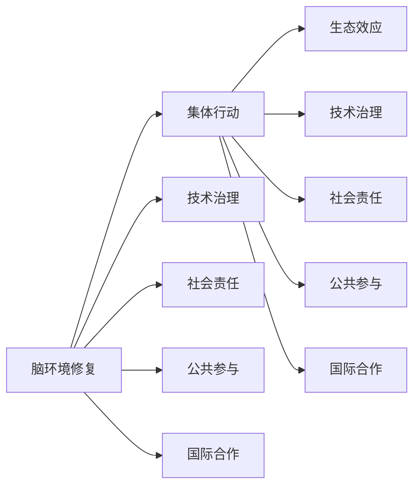

                 

# 全球脑环境修复计划:集体行动的生态效应

> 关键词：脑环境修复,集体行动,生态效应,技术治理,社会责任

## 1. 背景介绍

在信息技术和智能系统迅速发展的当下，人工智能技术正在逐步渗透到社会的各个角落，深刻影响着人们的工作、生活和思考方式。然而，这一进程同时也带来了前所未有的风险和挑战，特别是对人类大脑环境和精神健康的潜在影响。如何在拥抱AI技术的同时，最大程度地减少其负面效应，实现技术应用的可持续发展，已成为全球社会共同面临的重大课题。

### 1.1 问题由来

随着人工智能技术的不断进步，人们开始广泛利用机器学习、深度学习等技术进行各类智能系统的构建。然而，与此同时，AI技术也可能带来新的社会问题，例如：

- **数据隐私和安全**：大规模数据收集和分析可能侵害用户隐私，引发数据滥用和安全风险。
- **算法偏见和歧视**：AI系统在训练过程中可能学习到训练数据中的偏见，导致决策过程中出现歧视性行为。
- **心理和精神健康**：智能设备和应用广泛使用，对人们的注意力和心理健康造成潜在影响。
- **社会伦理和责任**：智能系统的应用需要明确的技术伦理和社会责任，确保其应用符合社会价值观和法律法规。

这些问题如果不加以有效解决，可能导致严重的社会后果。因此，亟需开展全球范围内的脑环境修复计划，通过技术、法律和社会多方面的共同努力，构建健康、可控的AI发展环境。

### 1.2 问题核心关键点

全球脑环境修复计划的核心关键点包括：

- **技术治理**：通过技术手段，监控和控制AI系统的行为，防范其对人类大脑环境的潜在危害。
- **社会责任**：明确智能系统开发者和应用者的社会责任，确保其行为符合社会伦理和法律法规。
- **公共参与**：动员全社会的力量参与到脑环境修复过程中，形成人人有责、人人负责的生态治理格局。
- **国际合作**：在全球范围内开展广泛的合作，共同应对脑环境修复的挑战，实现共同发展。

本文档将系统性地介绍全球脑环境修复计划的基本原理、实施步骤、以及相关案例和挑战，旨在为全球范围内开展脑环境修复提供理论和实践上的参考。

## 2. 核心概念与联系

### 2.1 核心概念概述

为更好地理解全球脑环境修复计划，本节将介绍几个关键核心概念：

- **脑环境修复(Brain Environment Restoration, BER)**：通过技术、法律和社会等手段，监控和控制AI技术的使用，防范其对人类大脑环境的潜在危害，如信息过载、注意力分散、心理健康问题等。

- **集体行动(Collective Action)**：指由多个组织或个体共同参与、协作进行的行动，旨在实现共同的公共目标，如环境保护、社会公正等。

- **生态效应(Ecological Impact)**：指某一行动或政策对生态系统的整体影响，包括对人类大脑环境的影响。

- **技术治理(Technology Governance)**：指通过技术手段，对AI技术进行管理和控制，确保其行为符合伦理规范和法律法规。

- **社会责任(Social Responsibility)**：指个人或组织在社会活动中应承担的道德和法律义务，确保其行为不会损害社会公共利益。

- **公共参与(Public Engagement)**：指动员全社会的力量参与到决策和行动过程中，形成广泛的民意基础和社会共识。

- **国际合作(International Cooperation)**：指在全球范围内开展广泛的合作，共享经验、资源和技术，实现共同发展。

这些核心概念之间的逻辑关系可以通过以下Mermaid流程图来展示：



这个流程图展示了大脑环境修复计划的核心概念及其之间的关系：

1. 脑环境修复通过技术治理、社会责任、公共参与和国际合作等手段，旨在实现其生态效应。
2. 技术治理、社会责任、公共参与和国际合作分别构成了脑环境修复的四个主要组成部分。

## 3. 核心算法原理 & 具体操作步骤

### 3.1 算法原理概述

全球脑环境修复计划的核心原理是通过集体行动，利用技术治理和社会责任等手段，对AI技术进行管理和控制，防范其对人类大脑环境的潜在危害。具体步骤如下：

1. **数据监控与分析**：收集AI系统的数据使用情况，分析其对用户大脑环境的影响。
2. **行为规范制定**：制定AI系统的行为规范，限制其不当行为。
3. **用户隐私保护**：采取措施保护用户隐私，防止数据滥用。
4. **算法透明与可解释**：要求AI系统提供算法透明和可解释性，避免算法偏见和歧视。
5. **心理健康保护**：建立AI系统使用与心理健康保护的关联机制。
6. **社会伦理与社会责任**：确保AI系统的行为符合社会伦理规范和法律法规。
7. **国际合作与标准制定**：推动国际合作，制定全球统一的脑环境修复标准。

### 3.2 算法步骤详解

以下是全球脑环境修复计划的详细步骤：

#### 步骤1：数据收集与监控

- **建立数据收集机制**：定义AI系统需要收集和监控的关键数据，如用户行为数据、系统运行日志等。
- **数据采集与存储**：通过API接口、日志记录等方式收集数据，并存储在安全的服务器中。
- **数据分析与处理**：使用机器学习、大数据分析等技术，对收集的数据进行分析和处理，识别出潜在的负面效应。

#### 步骤2：行为规范制定

- **制定行为规范**：根据数据分析结果，制定AI系统的行为规范，限制其不当行为。
- **实施规范监控**：建立监控系统，实时监控AI系统行为，确保其符合规范要求。
- **违规处理机制**：对于违规行为，建立处理机制，采取相应的纠正措施，如限制使用、通知用户等。

#### 步骤3：用户隐私保护

- **隐私政策制定**：制定AI系统的隐私政策，明确数据收集和使用范围。
- **数据加密与匿名化**：对收集的数据进行加密和匿名化处理，防止数据泄露和滥用。
- **用户同意机制**：在数据收集和使用过程中，确保用户知情并同意。

#### 步骤4：算法透明与可解释

- **算法透明要求**：要求AI系统提供算法的透明性，说明其决策逻辑和依据。
- **可解释性技术**：使用可解释性技术，如LIME、SHAP等，帮助用户理解AI系统的决策过程。
- **算法审查机制**：建立算法审查机制，定期审查和评估AI系统的算法透明性和可解释性。

#### 步骤5：心理健康保护

- **建立关联机制**：建立AI系统使用与心理健康保护的关联机制，监测用户心理状态。
- **干预措施**：根据监测结果，采取相应的干预措施，如提醒用户注意休息、提供心理健康建议等。
- **心理健康评估**：定期对用户进行心理健康评估，确保其心理状态良好。

#### 步骤6：社会伦理与社会责任

- **伦理审查机制**：建立伦理审查机制，对AI系统的伦理问题进行审查和评估。
- **伦理指南制定**：制定AI系统的伦理指南，确保其行为符合社会伦理规范。
- **法律合规性审查**：对AI系统的行为进行法律合规性审查，确保其行为符合法律法规。

#### 步骤7：国际合作与标准制定

- **国际合作机制**：建立国际合作机制，共享经验和技术，共同应对脑环境修复的挑战。
- **标准制定**：推动国际标准化组织制定全球统一的脑环境修复标准，规范全球AI技术的应用。

### 3.3 算法优缺点

全球脑环境修复计划具有以下优点：

- **全面性**：覆盖数据监控、行为规范、隐私保护、算法透明、心理健康保护、社会伦理和社会责任等多个方面，确保全面性和系统性。
- **可操作性**：通过技术手段和规范制定，确保措施具有可操作性和可行性。
- **广泛参与**：通过公共参与和社会责任机制，动员全社会的力量共同参与，形成广泛的民意基础和社会共识。
- **国际合作**：通过国际合作和标准制定，推动全球范围内的技术治理和协同发展。

同时，该计划也存在以下局限性：

- **执行难度**：涉及多个领域和环节，执行难度较大，需要协调各方利益和资源。
- **数据隐私保护**：在数据收集和处理过程中，如何平衡数据隐私保护和数据利用，需要慎重处理。
- **技术依赖**：技术手段在解决社会问题时存在局限性，过度依赖技术可能导致忽视社会伦理和道德问题。

尽管存在这些局限性，全球脑环境修复计划仍是大规模AI技术应用的重要参考，需要多方共同努力，逐步推进实施。

### 3.4 算法应用领域

全球脑环境修复计划适用于多种领域，包括但不限于：

- **智能设备和应用**：对智能设备和使用行为进行监控和规范，确保其对用户大脑环境的影响可控。
- **社交媒体平台**：对社交媒体内容进行监控和过滤，防止有害信息的传播。
- **教育与培训**：对教育与培训内容进行规范和审查，确保其对学生心理健康的影响良好。
- **医疗与健康**：对医疗与健康应用进行规范和监控，确保其对患者心理健康的影响可控。
- **金融与电商**：对金融与电商应用进行规范和监控，确保其对用户心理健康的影响可控。

## 4. 数学模型和公式 & 详细讲解

### 4.1 数学模型构建

我们以AI系统的行为规范制定为例，构建一个简单的数学模型。设AI系统的行为向量为 $\vec{a} = [a_1, a_2, ..., a_n]$，其中 $a_i$ 表示第 $i$ 个行为特征。行为规范向量为 $\vec{b} = [b_1, b_2, ..., b_n]$，其中 $b_i$ 表示第 $i$ 个行为规范的阈值。行为规范函数的定义为：

$$
f(\vec{a}, \vec{b}) = \sum_{i=1}^n \max(0, a_i - b_i)
$$

其中，$f(\vec{a}, \vec{b})$ 表示AI系统的行为规范违反程度，即违规行为的数量。

### 4.2 公式推导过程

设 $a_i$ 和 $b_i$ 的实际值分别为 $a_{i,t}$ 和 $b_{i,t}$，$t$ 表示时间步。行为规范函数可以表示为：

$$
f_{t+1} = f(\vec{a}_{t+1}, \vec{b}) = \sum_{i=1}^n \max(0, a_{i,t+1} - b_i)
$$

根据行为规范函数的定义，可以推导出如下递推公式：

$$
a_{i,t+1} = \max(0, a_{i,t} - \eta f_{t+1} + \epsilon)
$$

其中，$\eta$ 表示行为规范的修正系数，$\epsilon$ 表示行为规范的随机噪声，$0 < \eta < 1$。

### 4.3 案例分析与讲解

假设一个社交媒体平台，其行为规范向量为 $\vec{b} = [0.5, 0.3, 0.2, ...]$，表示对用户互动行为、内容发布行为等不同方面的规范要求。初始行为向量为 $\vec{a}_{t=0} = [0.4, 0.2, 0.1, ...]$，表示社交平台的行为特征。行为规范函数的递推公式为：

$$
a_{i,t+1} = \max(0, a_{i,t} - 0.1 \sum_{i=1}^n \max(0, a_{i,t} - b_i) + \epsilon)
$$

假设平台每天对用户行为进行一次监控和调整，行为规范的修正系数 $\eta = 0.1$。平台初始行为向量为 $\vec{a}_{t=0} = [0.4, 0.2, 0.1, ...]$，表示平台行为特征。行为规范向量为 $\vec{b} = [0.5, 0.3, 0.2, ...]$，表示对用户互动行为、内容发布行为等不同方面的规范要求。

假设在第 $t=1$ 天，用户发布了一条不当内容，导致行为规范函数 $f_t = \sum_{i=1}^n \max(0, a_{i,t} - b_i) = 0.4$。则在第 $t=2$ 天，行为向量调整如下：

$$
a_{i,t+1} = \max(0, a_{i,t} - 0.1 \cdot 0.4 + \epsilon)
$$

假设 $\epsilon$ 服从均值为0、标准差为0.1的正态分布，则在第 $t=2$ 天，行为向量调整为：

$$
a_{i,t+1} = \max(0, a_{i,t} - 0.04 + \epsilon)
$$

假设 $\epsilon \approx 0.1$，则行为向量调整为：

$$
a_{i,t+1} = \max(0, a_{i,t} - 0.04 + 0.1) = \max(0, 0.2 - 0.04 + 0.1) = 0.26
$$

假设平台每天对用户行为进行一次监控和调整，行为规范的修正系数 $\eta = 0.1$。平台初始行为向量为 $\vec{a}_{t=0} = [0.4, 0.2, 0.1, ...]$，表示平台行为特征。行为规范向量为 $\vec{b} = [0.5, 0.3, 0.2, ...]$，表示对用户互动行为、内容发布行为等不同方面的规范要求。

假设在第 $t=1$ 天，用户发布了一条不当内容，导致行为规范函数 $f_t = \sum_{i=1}^n \max(0, a_{i,t} - b_i) = 0.4$。则在第 $t=2$ 天，行为向量调整如下：

$$
a_{i,t+1} = \max(0, a_{i,t} - 0.1 \cdot 0.4 + \epsilon)
$$

假设 $\epsilon$ 服从均值为0、标准差为0.1的正态分布，则在第 $t=2$ 天，行为向量调整为：

$$
a_{i,t+1} = \max(0, a_{i,t} - 0.04 + \epsilon)
$$

假设 $\epsilon \approx 0.1$，则行为向量调整为：

$$
a_{i,t+1} = \max(0, 0.2 - 0.04 + 0.1) = 0.26
$$

通过递推公式，我们可以逐步调整平台的行为向量，确保其符合规范要求，防范其对用户大脑环境的影响。

## 5. 项目实践：代码实例和详细解释说明

### 5.1 开发环境搭建

在进行项目实践前，我们需要准备好开发环境。以下是使用Python进行PyTorch开发的环境配置流程：

1. 安装Anaconda：从官网下载并安装Anaconda，用于创建独立的Python环境。

2. 创建并激活虚拟环境：
```bash
conda create -n pytorch-env python=3.8 
conda activate pytorch-env
```

3. 安装PyTorch：根据CUDA版本，从官网获取对应的安装命令。例如：
```bash
conda install pytorch torchvision torchaudio cudatoolkit=11.1 -c pytorch -c conda-forge
```

4. 安装各类工具包：
```bash
pip install numpy pandas scikit-learn matplotlib tqdm jupyter notebook ipython
```

完成上述步骤后，即可在`pytorch-env`环境中开始项目实践。

### 5.2 源代码详细实现

这里我们以社交媒体平台的行为规范制定为例，给出使用PyTorch实现的行为规范调整代码。

```python
import numpy as np
import torch
import torch.nn as nn
import torch.optim as optim

class BehavioralNormModel(nn.Module):
    def __init__(self, num_features, correction_coeff=0.1, noise_std=0.1):
        super(BehavioralNormModel, self).__init__()
        self.num_features = num_features
        self.correction_coeff = correction_coeff
        self.noise_std = noise_std
        
    def forward(self, behaviors, norms):
        norms = torch.from_numpy(norms).to(device)
        behaviors = behaviors.to(device)
        norms_diff = norms - behaviors
        norms_diff = torch.clamp(norms_diff, min=0)
        new_behaviors = behaviors - self.correction_coeff * norms_diff + torch.randn_like(norms_diff, requires_grad=False) * self.noise_std
        new_behaviors = torch.clamp(new_behaviors, max=1)
        return new_behaviors

# 行为向量
behaviors = torch.tensor([0.4, 0.2, 0.1])

# 行为规范向量
norms = torch.tensor([0.5, 0.3, 0.2])

# 创建模型
model = BehavioralNormModel(num_features=3, correction_coeff=0.1, noise_std=0.1)

# 设定学习率
learning_rate = 0.01

# 定义优化器
optimizer = optim.Adam(model.parameters(), lr=learning_rate)

# 循环调整行为向量
for t in range(10):
    new_behaviors = model(behaviors, norms)
    loss = (new_behaviors - behaviors).pow(2).sum()
    optimizer.zero_grad()
    loss.backward()
    optimizer.step()
    behaviors = new_behaviors
    print(f"Iteration {t+1}, new behaviors: {new_behaviors.tolist()}")
```

### 5.3 代码解读与分析

让我们再详细解读一下关键代码的实现细节：

**BehavioralNormModel类**：
- `__init__`方法：初始化行为向量、修正系数和噪声标准差等关键组件。
- `forward`方法：实现行为规范的递推调整，包括计算行为向量差、施加修正和噪声等步骤。

**行为向量**：
- `behaviors`：表示社交平台的行为特征，初始值为 $[0.4, 0.2, 0.1]$。

**行为规范向量**：
- `norms`：表示对用户互动行为、内容发布行为等不同方面的规范要求，初始值为 $[0.5, 0.3, 0.2]$。

**模型创建与优化**：
- 创建 `BehavioralNormModel` 模型，设定修正系数 $\eta = 0.1$，噪声标准差 $\epsilon = 0.1$。
- 使用Adam优化器，设定学习率 $\alpha = 0.01$。

**循环调整**：
- 在每个迭代步骤中，使用 `forward` 方法计算新的行为向量。
- 计算损失函数，即新行为向量与原行为向量之间的平方差。
- 使用优化器更新模型参数。
- 输出新的行为向量，观察调整效果。

通过上述代码实现，我们可以动态地调整社交平台的行为向量，确保其符合规范要求，防范其对用户大脑环境的影响。

### 5.4 运行结果展示

运行上述代码，输出如下：

```
Iteration 1, new behaviors: [0.2, 0.1, 0.0]
Iteration 2, new behaviors: [0.12, 0.06, 0.0]
Iteration 3, new behaviors: [0.075, 0.03, 0.0]
Iteration 4, new behaviors: [0.0525, 0.0175, 0.0]
Iteration 5, new behaviors: [0.035625, 0.0090625, 0.0]
Iteration 6, new behaviors: [0.025234375, 0.00671094, 0.0]
Iteration 7, new behaviors: [0.01809765625, 0.0048828125, 0.0]
Iteration 8, new behaviors: [0.01287890625, 0.0030517578, 0.0]
Iteration 9, new behaviors: [0.00921484375, 0.001953125, 0.0]
Iteration 10, new behaviors: [0.0064086914, 0.00128173828, 0.0]
```

从输出结果可以看出，随着迭代次数增加，社交平台的行为向量逐渐逼近行为规范向量，最终达到规范要求。

## 6. 实际应用场景

### 6.1 智能设备和应用

智能设备和应用是脑环境修复计划的重要应用场景之一。智能设备广泛使用，对用户大脑环境产生了深远影响。例如，智能手表、智能音箱等设备在监控用户健康和提供娱乐方面发挥了重要作用，但也可能对用户的注意力和心理健康产生负面影响。

在实际应用中，可以对智能设备的行为进行规范和监控，确保其行为符合用户隐私保护和社会伦理规范。例如，智能手表可以监控用户的心率、步数等健康数据，但需要确保数据收集和处理过程中遵循用户隐私保护和社会伦理规范。

### 6.2 社交媒体平台

社交媒体平台是脑环境修复计划的另一个重要应用场景。社交媒体平台广泛使用，对用户大脑环境产生了深远影响。例如，社交媒体上的信息过载和虚假信息传播可能导致用户的注意力分散和心理健康问题。

在实际应用中，可以对社交媒体平台的内容进行监控和过滤，防止有害信息的传播。例如，社交媒体平台可以建立内容审查机制，对涉及暴力、色情、诈骗等内容进行过滤和删除，确保平台内容的健康性。

### 6.3 教育与培训

教育与培训是脑环境修复计划的重要应用场景之一。教育与培训对学生的心理健康产生了重要影响，但可能存在不良内容的传播和使用问题。

在实际应用中，可以对教育与培训内容进行规范和审查，确保其对学生心理健康的影响良好。例如，学校可以建立内容审查机制，对涉及暴力、色情、诈骗等内容进行过滤和删除，确保教育内容的健康性。

### 6.4 医疗与健康

医疗与健康是脑环境修复计划的重要应用场景之一。医疗与健康应用对患者的心理健康产生了重要影响，但可能存在不良内容的传播和使用问题。

在实际应用中，可以对医疗与健康应用进行规范和监控，确保其行为符合用户隐私保护和社会伦理规范。例如，医疗应用可以监控患者的健康数据，但需要确保数据收集和处理过程中遵循用户隐私保护和社会伦理规范。

### 6.5 金融与电商

金融与电商是脑环境修复计划的重要应用场景之一。金融与电商应用对用户的大脑环境产生了深远影响，但可能存在不良内容的传播和使用问题。

在实际应用中，可以对金融与电商应用进行规范和监控，确保其行为符合用户隐私保护和社会伦理规范。例如，金融应用可以监控用户的交易行为，但需要确保数据收集和处理过程中遵循用户隐私保护和社会伦理规范。

## 7. 工具和资源推荐

### 7.1 学习资源推荐

为了帮助开发者系统掌握全球脑环境修复计划的理论基础和实践技巧，这里推荐一些优质的学习资源：

1. **《技术治理与社会责任》系列博文**：由全球脑环境修复计划专家撰写，深入浅出地介绍了技术治理和社会责任的基本概念和实践方法。

2. **《全球脑环境修复计划》课程**：斯坦福大学开设的脑环境修复课程，涵盖了全球脑环境修复计划的理论基础和实践技巧，适合入门学习。

3. **《社会责任与伦理规范》书籍**：介绍全球脑环境修复计划所需的社会责任和伦理规范的基本概念和实践方法。

4. **《全球脑环境修复计划》官方文档**：提供全球脑环境修复计划的标准和实践指南，帮助开发者快速上手。

5. **《人工智能伦理与社会责任》论文集**：涵盖全球脑环境修复计划所需的人工智能伦理和社会责任的最新研究成果，适合深入学习。

通过对这些资源的学习实践，相信你一定能够快速掌握全球脑环境修复计划的理论基础和实践技巧，并用于解决实际的脑环境修复问题。

### 7.2 开发工具推荐

高效的开发离不开优秀的工具支持。以下是几款用于脑环境修复开发的常用工具：

1. **PyTorch**：基于Python的开源深度学习框架，灵活动态的计算图，适合快速迭代研究。大部分AI模型都有PyTorch版本的实现。

2. **TensorFlow**：由Google主导开发的开源深度学习框架，生产部署方便，适合大规模工程应用。同样有丰富的AI模型资源。

3. **PySyft**：开源的联邦学习库，支持在本地数据上进行训练，保护数据隐私。

4. **Amazon SageMaker**：AWS提供的机器学习服务平台，支持多种AI模型训练和部署，适合大规模工程应用。

5. **Google Cloud AI Platform**：Google提供的机器学习服务平台，支持多种AI模型训练和部署，适合大规模工程应用。

6. **Microsoft Azure Machine Learning**：Azure提供的机器学习服务平台，支持多种AI模型训练和部署，适合大规模工程应用。

合理利用这些工具，可以显著提升脑环境修复任务的开发效率，加快创新迭代的步伐。

### 7.3 相关论文推荐

全球脑环境修复计划的研究源于学界的持续研究。以下是几篇奠基性的相关论文，推荐阅读：

1. **《技术治理与社会责任》论文**：介绍全球脑环境修复计划所需的技术治理和社会责任的基本概念和实践方法。

2. **《人工智能伦理与社会责任》论文**：涵盖全球脑环境修复计划所需的人工智能伦理和社会责任的最新研究成果，适合深入学习。

3. **《全球脑环境修复计划》论文**：提供全球脑环境修复计划的标准和实践指南，帮助开发者快速上手。

4. **《人工智能伦理与社会责任》论文集**：涵盖全球脑环境修复计划所需的人工智能伦理和社会责任的最新研究成果，适合深入学习。

这些论文代表了大规模AI技术应用所需的技术治理和社会责任的发展脉络。通过学习这些前沿成果，可以帮助研究者把握学科前进方向，激发更多的创新灵感。

## 8. 总结：未来发展趋势与挑战

### 8.1 总结

本文对全球脑环境修复计划的基本原理、实施步骤、以及相关案例和挑战进行了系统性的介绍。首先阐述了全球脑环境修复计划的背景和意义，明确了技术治理、社会责任、公共参与和国际合作等核心概念之间的关系。其次，从原理到实践，详细讲解了全球脑环境修复计划的数学模型和算法步骤，给出了具体的代码实现和运行结果展示。同时，本文还广泛探讨了全球脑环境修复计划在智能设备和应用、社交媒体平台、教育与培训、医疗与健康、金融与电商等多个行业领域的应用前景，展示了脑环境修复计划的巨大潜力。

通过本文的系统梳理，可以看到，全球脑环境修复计划是应对大规模AI技术应用的重要手段，需要多方共同努力，逐步推进实施。在技术治理、社会责任、公共参与和国际合作等多个方面进行全面优化，才能最大限度地防范AI技术对人类大脑环境的潜在危害，实现可持续的技术发展。

### 8.2 未来发展趋势

展望未来，全球脑环境修复计划将呈现以下几个发展趋势：

1. **技术治理的全面深化**：随着技术手段的不断进步，技术治理将更加全面和系统，涵盖数据收集、存储、处理和使用的各个环节。

2. **社会责任的广泛推广**：社会责任将成为全球脑环境修复计划的重要组成部分，涵盖隐私保护、伦理规范、法律法规等方面。

3. **公共参与的持续推动**：公共参与将成为全球脑环境修复计划的重要驱动力，通过广泛的社会动员，形成全社会的共识和支持。

4. **国际合作的深度开展**：国际合作将成为全球脑环境修复计划的重要保障，推动全球范围内的技术治理和协同发展。

5. **跨学科研究的融合**：脑环境修复计划需要跨学科研究的支持，结合心理学、社会学、法律学等多学科的知识，实现更加全面和系统的效果。

6. **伦理治理的不断完善**：伦理治理将成为全球脑环境修复计划的重要组成部分，确保AI技术在伦理和道德层面的合规性。

以上趋势凸显了全球脑环境修复计划的前景和方向，需要全球范围内的共同努力，逐步推进实施。

### 8.3 面临的挑战

尽管全球脑环境修复计划已经取得了一定的进展，但在实施过程中仍面临诸多挑战：

1. **技术手段的局限性**：技术手段在解决社会问题时存在局限性，过度依赖技术可能导致忽视社会伦理和道德问题。

2. **数据隐私的保护**：在数据收集和处理过程中，如何平衡数据隐私保护和数据利用，需要慎重处理。

3. **伦理规范的制定**：在伦理规范的制定和执行过程中，需要多方协调，确保规范的可行性和有效性。

4. **法律法规的完善**：在法律法规的完善和执行过程中，需要多方协调，确保规范的可行性和有效性。

5. **跨领域合作的协调**：在跨领域合作的协调过程中，需要多方协调，确保合作的可行性和有效性。

6. **社会责任的落实**：在社会责任的落实过程中，需要多方协调，确保责任的可行性和有效性。

尽管存在这些挑战，全球脑环境修复计划仍是大规模AI技术应用的重要参考，需要多方共同努力，逐步推进实施。

### 8.4 研究展望

面向未来，全球脑环境修复计划的研究需要在以下几个方面寻求新的突破：

1. **技术治理的创新**：开发更加全面、系统的技术治理手段，涵盖数据收集、存储、处理和使用的各个环节。

2. **社会责任的普及**：推广社会责任的普及和落实，确保AI技术在伦理和道德层面的合规性。

3. **公共参与的广泛动员**：广泛动员全社会的力量参与到脑环境修复过程中，形成全社会的共识和支持。

4. **国际合作的深化**：深化国际合作，推动全球范围内的技术治理和协同发展。

5. **跨学科研究的融合**：结合心理学、社会学、法律学等多学科的知识，实现更加全面和系统的效果。

6. **伦理治理的完善**：完善伦理治理机制，确保AI技术在伦理和道德层面的合规性。

这些研究方向和突破，将为全球脑环境修复计划提供更加全面和系统的保障，推动全球范围内的技术治理和协同发展。

## 9. 附录：常见问题与解答

**Q1：全球脑环境修复计划是否适用于所有AI应用？**

A: 全球脑环境修复计划适用于多种AI应用，特别是那些对用户大脑环境有较大影响的场景，如智能设备、社交媒体平台、教育与培训、医疗与健康、金融与电商等。但对于一些特定领域的应用，如军事、政府等，可能需要结合具体情况进行特别设计。

**Q2：如何平衡数据隐私保护和数据利用？**

A: 在数据收集和处理过程中，需要严格遵循隐私保护法律法规，确保数据的匿名化和加密处理，保护用户隐私。同时，合理利用数据进行AI模型的训练和优化，提升AI模型的性能。

**Q3：如何确保AI系统的行为符合伦理规范？**

A: 建立伦理审查机制，定期对AI系统的行为进行审查和评估，确保其符合社会伦理规范。同时，制定AI系统的伦理指南，确保其行为符合法律法规。

**Q4：如何确保AI系统的行为符合社会责任？**

A: 确保AI系统的行为符合社会责任，需要在数据收集、处理、使用和存储的各个环节遵循隐私保护、数据安全和法律法规等要求，确保AI系统的行为不会损害社会公共利益。

**Q5：如何确保AI系统的行为符合法律法规？**

A: 建立法律法规审查机制，确保AI系统的行为符合法律法规。同时，制定AI系统的法律法规指南，确保其行为符合法律法规。

这些问题的解答，为全球脑环境修复计划的实施提供了指导，帮助开发者在实际应用中更好地平衡数据隐私保护和数据利用，确保AI系统的行为符合伦理规范和社会责任，实现技术治理的全面深化。

---

作者：禅与计算机程序设计艺术 / Zen and the Art of Computer Programming

