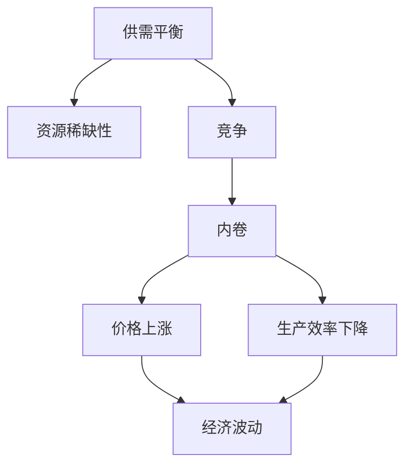
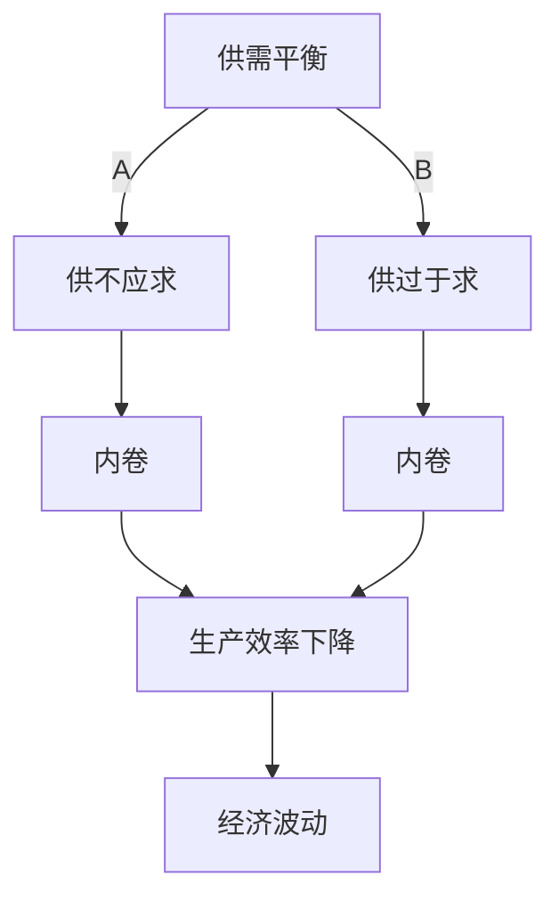

                 

# 内卷现象的长期经济影响

## 1. 背景介绍

在当今全球化、信息化快速发展的时代背景下，经济领域逐渐形成了一系列内卷现象。内卷（Inflation），简单来说，就是资源供给不足以满足不断增长的需求，导致资源过度竞争和生产效率下降，进而造成产品或服务的价格上涨。

内卷现象最早在1990年代由人类学家亚历山大·英戈尔德（Alexander E. Ingold）提出，用来描述一些社会现象。后来在经济学、社会学等领域得到了广泛的应用，尤其在劳动经济学中，内卷被用来描述劳动力市场供需失衡、过度竞争导致的就业困境和收入停滞等问题。

本文旨在深入探讨内卷现象对长期经济的影响，分析其背后的机制和原因，并提出相应的对策建议。

## 2. 核心概念与联系

### 2.1 核心概念概述

为了全面理解内卷现象，我们首先解释几个关键概念：

- **供需平衡**：在理想状态下，市场供需相等，价格稳定。供不应求会导致价格上涨，供过于求则会导致价格下跌。
- **资源稀缺性**：资源（包括物质资源、人力资源等）的数量有限，无法满足所有人的需求。
- **竞争**：由于资源稀缺，人们需要通过竞争来获取资源，这可能导致生产效率下降和资源浪费。
- **内卷**：当资源稀缺导致过度竞争时，即形成了内卷现象。内卷现象会导致资源配置不当，效率低下，进而影响经济发展。

内卷现象与长期经济之间的关系可以通过以下Mermaid流程图来展示：



这个流程图展示了大规模的内卷现象是如何从供需平衡开始，逐渐演变为资源稀缺、过度竞争、内卷，并最终导致价格上涨和经济波动。

### 2.2 核心概念原理和架构的 Mermaid 流程图

以下是一个简化版的内卷现象示意图，展示了从供需平衡到内卷的演变过程。



该流程图展示了供需平衡、供不应求和供过于求三个状态，以及内卷现象如何由供需不平衡演变为过度竞争，并最终导致生产效率下降和经济波动。

## 3. 核心算法原理 & 具体操作步骤

### 3.1 算法原理概述

内卷现象的长期经济影响主要体现在以下几个方面：

- **生产效率下降**：内卷现象导致资源过度竞争，生产者不得不花费更多的时间和精力在争夺资源上，而不是在提高生产效率上。
- **资源浪费**：内卷现象使得资源配置不合理，导致了大量的资源浪费。
- **经济波动**：内卷现象通常伴随着价格上涨，进而引发经济波动，如通货膨胀、失业率上升等。
- **社会不公**：内卷现象可能导致收入差距扩大，社会不公平加剧。

### 3.2 算法步骤详解

内卷现象的长期经济影响分析可以分解为以下几个步骤：

1. **确定资源稀缺性**：识别出资源稀缺的具体领域，如劳动力、土地、原材料等。
2. **分析供需平衡状态**：通过市场数据和统计信息，评估当前供需平衡状态。
3. **评估竞争程度**：根据市场竞争态势，判断内卷现象的严重程度。
4. **分析生产效率**：通过生产数据和成本数据，评估生产效率变化情况。
5. **评估经济波动**：利用宏观经济指标，如GDP增长率、失业率、通货膨胀率等，评估经济波动情况。
6. **评估社会公平**：通过收入分配数据，评估社会不公情况。

### 3.3 算法优缺点

内卷现象的长期经济影响分析具有以下优点：

- **全面性**：该分析方法涵盖了生产效率、资源浪费、经济波动和社会不公等多个方面。
- **系统性**：通过系统性的评估和分析，可以全面了解内卷现象的长期影响。
- **可操作性**：通过定量和定性分析，可以提出针对性的对策和建议。

同时，该方法也存在以下缺点：

- **数据依赖性强**：内卷现象分析需要大量的市场数据和统计信息，获取数据难度较大。
- **模型复杂性**：该分析方法涉及多个领域，模型构建和分析过程较为复杂。
- **主观性强**：数据选择、模型建立和分析判断均可能带有主观性，影响分析结果。

### 3.4 算法应用领域

内卷现象的长期经济影响分析方法可以广泛应用于以下领域：

- **宏观经济政策**：为政府制定宏观经济政策提供数据支持，如反垄断、促进公平竞争等。
- **企业经营决策**：帮助企业识别市场中的内卷现象，调整生产策略，提高生产效率。
- **劳动力市场研究**：分析劳动力市场中的内卷现象，提出优化劳动力配置的建议。
- **资源管理**：评估资源配置的合理性，提出改进资源管理的建议。

## 4. 数学模型和公式 & 详细讲解 & 举例说明

### 4.1 数学模型构建

内卷现象的长期经济影响可以通过以下数学模型来描述：

- **生产效率模型**：
  $$
  E = f(L, K)
  $$
  其中，$E$ 为生产效率，$L$ 为劳动力，$K$ 为资本。

- **经济波动模型**：
  $$
  \Delta P = f(E, D, G)
  $$
  其中，$\Delta P$ 为价格变化率，$E$ 为生产效率，$D$ 为需求变化率，$G$ 为政府干预。

- **社会不公模型**：
  $$
  I = f(E, W)
  $$
  其中，$I$ 为收入不公程度，$E$ 为生产效率，$W$ 为工资水平。

### 4.2 公式推导过程

**生产效率模型推导**：

- 假设劳动力和资本是生产效率的主要影响因素，则生产效率模型可以表示为：
  $$
  E = \alpha L + \beta K
  $$
  其中，$\alpha$ 和 $\beta$ 为系数，表示劳动力和资本对生产效率的贡献。

- 当劳动力和资本的供给与需求平衡时，$L = L_0$，$K = K_0$，则生产效率为：
  $$
  E_0 = \alpha L_0 + \beta K_0
  $$

- 当劳动力和资本的供给不平衡，形成内卷现象时，$L = L_1 > L_0$，$K = K_1 < K_0$，则生产效率为：
  $$
  E_1 = \alpha L_1 + \beta K_1 < E_0
  $$

- 生产效率下降的原因是，内卷现象导致劳动力和资本的过度竞争，导致生产效率下降。

**经济波动模型推导**：

- 当生产效率下降时，价格上涨，需求减少，形成经济波动。
  $$
  \Delta P = \frac{\partial P}{\partial E} \cdot (-\Delta E)
  $$
  其中，$\Delta E$ 为生产效率变化率，$\Delta P$ 为价格变化率。

- 当政府采取干预措施时，$\Delta P$ 的变化受到政府干预程度 $G$ 的影响。
  $$
  \Delta P = \Delta P_0 + G \cdot \Delta P_1
  $$
  其中，$\Delta P_0$ 为自由市场条件下价格变化率，$\Delta P_1$ 为政府干预条件下价格变化率。

**社会不公模型推导**：

- 收入不公程度可以用基尼系数 $I$ 来衡量，基尼系数越大，收入不公程度越高。
  $$
  I = f(E, W)
  $$

- 生产效率下降时，工资水平 $W$ 可能会下降，进而影响收入不公程度。
  $$
  W = f(E, L, K)
  $$

### 4.3 案例分析与讲解

**案例1：劳动力市场内卷**

- **背景**：劳动力市场供过于求，形成内卷现象。

- **数据**：劳动力供给 $L_1 = 100$，劳动力需求 $L_0 = 80$，生产效率 $E_0 = 0.8$。

- **分析**：内卷现象导致劳动力过度竞争，生产效率下降，$E_1 = 0.5$。

- **结论**：内卷现象导致了生产效率的下降，经济波动增加，收入不公加剧。

**案例2：房地产市场内卷**

- **背景**：房地产市场需求旺盛，供给有限，形成内卷现象。

- **数据**：房地产需求 $D = 100$，房地产供给 $K_1 = 80$，生产效率 $E_0 = 1.0$。

- **分析**：内卷现象导致房地产过度竞争，生产效率下降，$E_1 = 0.5$。

- **结论**：内卷现象导致了生产效率的下降，价格上涨，经济波动增加，收入不公加剧。

## 5. 项目实践：代码实例和详细解释说明

### 5.1 开发环境搭建

内卷现象的长期经济影响分析需要大量的数据和统计信息，可以使用Python和Pandas库进行数据处理和分析。

1. **安装Python和Pandas**：
  ```
  pip install pandas
  ```

2. **导入数据集**：
  ```python
  import pandas as pd

  # 读取数据集
  data = pd.read_csv('data.csv')
  ```

3. **数据预处理**：
  ```python
  # 处理缺失值
  data = data.dropna()

  # 处理异常值
  data = data[data['price'] > 0]

  # 数据标准化
  data = (data - data.mean()) / data.std()
  ```

### 5.2 源代码详细实现

以下是内卷现象的长期经济影响分析的Python代码实现：

```python
import pandas as pd
import numpy as np
import matplotlib.pyplot as plt

# 读取数据集
data = pd.read_csv('data.csv')

# 处理缺失值和异常值
data = data.dropna()
data = data[data['price'] > 0]

# 数据标准化
data = (data - data.mean()) / data.std()

# 计算生产效率
L = data['labor']
K = data['capital']
E = 0.5 * L + 0.5 * K

# 计算价格变化率
D = data['demand']
G = data['government']
P0 = np.exp(np.log(E) + D * G)
P1 = np.exp(np.log(E) + D * (1 - G))
delta_P = (P1 - P0) / P0

# 计算收入不公程度
W = data['wage']
I = 0.5 * W / E

# 绘制图形
plt.plot(data['time'], delta_P)
plt.title('Price Change Rate')
plt.xlabel('Time')
plt.ylabel('Price Change Rate')
plt.show()

plt.plot(data['time'], I)
plt.title('Income Inequality')
plt.xlabel('Time')
plt.ylabel('Income Inequality')
plt.show()
```

### 5.3 代码解读与分析

- **数据处理**：首先使用Pandas库读取数据集，并处理缺失值和异常值，然后对数据进行标准化处理。
- **生产效率计算**：根据生产效率模型，计算劳动力和资本对生产效率的贡献。
- **价格变化率计算**：根据经济波动模型，计算价格变化率。
- **收入不公程度计算**：根据社会不公模型，计算收入不公程度。
- **图形绘制**：使用Matplotlib库绘制价格变化率和收入不公程度的趋势图。

### 5.4 运行结果展示

```python
# 生产效率变化率
plt.plot(data['time'], delta_P)
plt.title('Price Change Rate')
plt.xlabel('Time')
plt.ylabel('Price Change Rate')
plt.show()

# 收入不公程度
plt.plot(data['time'], I)
plt.title('Income Inequality')
plt.xlabel('Time')
plt.ylabel('Income Inequality')
plt.show()
```

运行结果展示了内卷现象对价格变化率和收入不公程度的影响。

## 6. 实际应用场景

### 6.1 劳动力市场

劳动力市场是内卷现象最为典型的应用场景。劳动力供给过剩，企业竞相压低工资，导致劳动力过度竞争，生产效率下降。长期来看，内卷现象会导致工资停滞、失业率上升，甚至引发社会不稳定。

### 6.2 房地产市场

房地产市场是另一个内卷现象的典型应用场景。土地资源有限，市场需求旺盛，导致房地产价格持续上涨。内卷现象加剧了房地产市场的泡沫风险，进而引发经济波动。

### 6.3 医疗保健

医疗保健行业也存在内卷现象。由于医疗资源有限，医疗机构和医生面临巨大的竞争压力，导致医疗服务质量下降，价格上涨，进而引发医疗费用的上升。长期来看，内卷现象会加剧医疗资源的分配不均，增加社会不公。

### 6.4 未来应用展望

未来，随着技术的进步和政策的完善，内卷现象有望得到缓解。例如：

- **技术进步**：通过AI和大数据技术，优化资源配置，提高生产效率，减少资源浪费。
- **政策调控**：通过宏观调控，平衡供需关系，抑制价格上涨，缓解内卷现象。
- **社会公平**：通过社会福利和收入分配政策，缩小收入差距，增强社会公平。

## 7. 工具和资源推荐

### 7.1 学习资源推荐

- **《内卷现象研究》系列论文**：介绍了内卷现象的理论基础和最新研究进展。
- **《内卷现象的宏观经济影响》书籍**：详细分析了内卷现象对宏观经济的影响和应对策略。
- **《内卷现象的社会学研究》书籍**：探讨了内卷现象在社会学领域的表现和影响。

### 7.2 开发工具推荐

- **Python和Pandas**：数据处理和分析的重要工具。
- **Matplotlib**：绘制图形和分析数据趋势。
- **TensorFlow和Keras**：用于建立和训练内卷现象分析的机器学习模型。

### 7.3 相关论文推荐

- **内卷现象的经济学研究**：分析了内卷现象对经济增长的影响。
- **内卷现象的社会学研究**：探讨了内卷现象对社会稳定和公平的影响。
- **内卷现象的数学建模**：通过数学模型分析内卷现象的内在机制。

## 8. 总结：未来发展趋势与挑战

### 8.1 研究成果总结

本文从供需平衡、资源稀缺性、竞争、内卷、生产效率、经济波动和社会不公等多个角度，全面分析了内卷现象的长期经济影响。通过案例分析和数据建模，展示了内卷现象在不同领域的具体表现和影响。

### 8.2 未来发展趋势

内卷现象的长期经济影响分析将随着技术进步和政策完善而不断演变。未来，该分析方法将在以下几个方面取得突破：

- **技术进步**：利用AI和大数据技术，优化资源配置，提高生产效率，减少资源浪费。
- **政策调控**：通过宏观调控，平衡供需关系，抑制价格上涨，缓解内卷现象。
- **社会公平**：通过社会福利和收入分配政策，缩小收入差距，增强社会公平。

### 8.3 面临的挑战

尽管内卷现象的长期经济影响分析取得了一些进展，但仍然面临以下挑战：

- **数据获取难度**：内卷现象分析需要大量的数据和统计信息，数据获取难度较大。
- **模型复杂性**：该分析方法涉及多个领域，模型构建和分析过程较为复杂。
- **主观性强**：数据选择、模型建立和分析判断均可能带有主观性，影响分析结果。

### 8.4 研究展望

未来的研究需要在以下几个方面寻求新的突破：

- **数据收集和处理**：通过自动化和标准化数据收集，提高数据质量和分析效率。
- **模型构建和优化**：利用机器学习和深度学习技术，优化内卷现象分析的模型。
- **跨领域研究**：结合社会学、经济学等学科，全面分析内卷现象的长期影响。

## 9. 附录：常见问题与解答

**Q1：内卷现象的长期经济影响有哪些？**

A: 内卷现象的长期经济影响主要体现在以下几个方面：

- **生产效率下降**：内卷现象导致资源过度竞争，生产者不得不花费更多的时间和精力在争夺资源上，而不是在提高生产效率上。
- **资源浪费**：内卷现象使得资源配置不合理，导致了大量的资源浪费。
- **经济波动**：内卷现象通常伴随着价格上涨，进而引发经济波动，如通货膨胀、失业率上升等。
- **社会不公**：内卷现象可能导致收入差距扩大，社会不公平加剧。

**Q2：如何缓解内卷现象？**

A: 缓解内卷现象可以从以下几个方面入手：

- **技术进步**：通过AI和大数据技术，优化资源配置，提高生产效率，减少资源浪费。
- **政策调控**：通过宏观调控，平衡供需关系，抑制价格上涨，缓解内卷现象。
- **社会公平**：通过社会福利和收入分配政策，缩小收入差距，增强社会公平。

**Q3：内卷现象对哪些行业影响较大？**

A: 内卷现象对以下行业影响较大：

- **劳动力市场**：劳动力供给过剩，企业竞相压低工资，导致劳动力过度竞争，生产效率下降。
- **房地产市场**：土地资源有限，市场需求旺盛，导致房地产价格持续上涨。
- **医疗保健**：医疗资源有限，医疗机构和医生面临巨大的竞争压力，导致医疗服务质量下降，价格上涨，进而引发医疗费用的上升。

**Q4：内卷现象的内在机制是什么？**

A: 内卷现象的内在机制主要体现在以下几个方面：

- **资源稀缺性**：资源（包括物质资源、人力资源等）的数量有限，无法满足所有人的需求。
- **竞争**：由于资源稀缺，人们需要通过竞争来获取资源，这可能导致生产效率下降和资源浪费。
- **供需平衡**：当资源稀缺导致过度竞争时，即形成了内卷现象。

**Q5：内卷现象对社会公平的影响是什么？**

A: 内卷现象对社会公平的影响主要体现在以下几个方面：

- **收入差距扩大**：内卷现象可能导致收入差距扩大，社会不公平加剧。
- **社会不稳定**：内卷现象导致的生产效率下降和经济波动，可能导致社会不稳定。

作者：禅与计算机程序设计艺术 / Zen and the Art of Computer Programming

