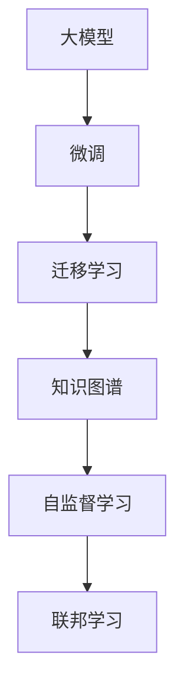

                 

# 创业者如何在大模型时代找准自己的定位和机会？

## 1. 背景介绍

### 1.1 问题由来

随着人工智能（AI）技术的高速发展，尤其是深度学习和大模型的突破，许多创业者和企业纷纷投入其中，希望抓住这一浪潮中的机会。然而，人工智能的复杂性和不断变化的技术景观使得许多创业者感到困惑和迷茫，不知道如何在大模型时代中找到自己的定位和机会。

### 1.2 问题核心关键点

- **大模型普及**：大规模预训练语言模型（如BERT、GPT-3等）的普及，使得AI技术的应用门槛大幅降低。
- **技术演进**：AI技术的快速发展，包括新的架构、算法和工具，要求创业者不断学习新知识。
- **市场竞争**：AI领域的竞争激烈，创业者需要在众多竞争者中寻找独特的切入点和优势。
- **行业应用**：AI技术需要找到合适的应用场景，才能发挥其价值。
- **创新机遇**：AI技术不断涌现的新方法和技术，为创业者提供了丰富的创新机会。

## 2. 核心概念与联系

### 2.1 核心概念概述

在大模型时代，创业者需要了解以下几个关键概念：

- **大模型**：指通过大规模数据训练得到的深度学习模型，如BERT、GPT-3等，具有强大的语言理解和生成能力。
- **微调**：在大模型的基础上，通过少量标注数据进行有监督学习，优化模型在某些特定任务上的性能。
- **迁移学习**：利用大模型的知识，将其应用于新的领域和任务，无需从头训练。
- **知识图谱**：用于表示实体及其关系的数据结构，可以帮助大模型更好地理解现实世界的复杂性。
- **联邦学习**：分布式训练方法，多个参与者在不共享数据的前提下，协同训练模型。
- **自监督学习**：使用未标注的数据进行学习，提升模型的泛化能力。

这些概念之间有紧密的联系，共同构成了大模型时代的技术和应用框架。

### 2.2 核心概念原理和架构的 Mermaid 流程图



## 3. 核心算法原理 & 具体操作步骤

### 3.1 算法原理概述

在大模型时代，创业者需要了解大模型的原理和操作步骤，才能在技术上找到切入点。以下是核心算法原理的概述：

- **预训练**：在大规模无标签数据上，通过自监督学习任务训练大模型，学习到通用的语言表示。
- **微调**：在特定任务的数据集上，通过有监督学习优化模型，适应特定任务的需求。
- **迁移学习**：利用预训练模型在不同任务之间的知识迁移，减少从头训练的时间和成本。
- **自监督学习**：在大规模无标签数据上，通过预测模型自身的隐含信息，提升模型的泛化能力。
- **联邦学习**：多个参与者协同训练模型，保护数据隐私，提升模型性能。

### 3.2 算法步骤详解

#### 3.2.1 数据收集与预处理

1. **数据收集**：创业者需要收集与特定应用场景相关的数据。这些数据可以是文本、图像、视频等多种类型。
2. **数据预处理**：清洗数据，去除噪声和无关信息，将数据转换成模型所需的格式。

#### 3.2.2 模型选择与加载

1. **选择模型**：根据应用场景，选择合适的预训练大模型。如BERT、GPT-3、T5等。
2. **加载模型**：使用深度学习框架（如PyTorch、TensorFlow等）加载预训练模型，并进行必要的微调设置。

#### 3.2.3 微调过程

1. **设置微调参数**：设置学习率、批大小、迭代次数等参数。
2. **数据加载与迭代训练**：使用数据加载器（如Dataloader），将数据批处理，并在每个批次上进行前向传播和反向传播，更新模型参数。
3. **性能评估**：在验证集上评估模型性能，调整参数。
4. **最终测试**：在测试集上测试模型性能，得到最终结果。

#### 3.2.4 应用部署

1. **模型保存**：将训练好的模型保存，方便后续使用。
2. **应用部署**：将模型集成到实际应用中，如API、服务端、移动应用等。

### 3.3 算法优缺点

#### 3.3.1 优点

- **泛化能力强**：预训练大模型在大量数据上学习，具有较强的泛化能力。
- **效率高**：微调所需的标注数据较少，训练时间短。
- **可扩展性**：大模型可以通过迁移学习应用到不同领域，具有较好的可扩展性。

#### 3.3.2 缺点

- **数据依赖**：微调和迁移学习依赖于标注数据，数据获取成本高。
- **资源消耗**：大模型需要高性能的计算资源，初期投入大。
- **模型复杂**：大模型的结构和参数复杂，调试和优化困难。

### 3.4 算法应用领域

#### 3.4.1 自然语言处理（NLP）

- **文本分类**：将文本分类为不同的类别，如新闻分类、情感分析等。
- **命名实体识别**：识别文本中的人名、地名、机构名等实体。
- **机器翻译**：将文本从一种语言翻译成另一种语言。
- **问答系统**：根据用户提出的问题，生成相应的答案。

#### 3.4.2 计算机视觉（CV）

- **图像分类**：将图像分类为不同的类别，如猫狗识别、人脸识别等。
- **目标检测**：在图像中检测出特定的对象，如行人检测、车辆检测等。
- **图像生成**：生成与给定输入相似的图像，如图像风格转换、面部生成等。

#### 3.4.3 推荐系统

- **个性化推荐**：根据用户的历史行为和兴趣，推荐个性化的产品或服务。
- **协同过滤**：利用用户之间的相似性，进行推荐。
- **实时推荐**：根据实时数据，动态调整推荐策略。

## 4. 数学模型和公式 & 详细讲解 & 举例说明

### 4.1 数学模型构建

假设有一个文本分类任务，预训练大模型为BERT，输入为文本 $x$，输出为类别 $y$，损失函数为交叉熵损失 $L$，微调的目标是最小化损失函数：

$$
\min_{\theta} L(\theta; D) = \frac{1}{N} \sum_{i=1}^{N} \ell(\theta; (x_i, y_i))
$$

其中，$N$ 为样本数量，$\ell$ 为交叉熵损失函数。

### 4.2 公式推导过程

1. **输入编码**：将文本 $x$ 编码成向量 $x'$，通过BERT得到编码 $x'$ 和向量 $h$。
2. **线性变换**：将向量 $h$ 线性变换为 $h' = W_1 h + b_1$。
3. **输出预测**：将 $h'$ 通过softmax函数得到类别概率 $p$，计算交叉熵损失 $\ell$。
4. **反向传播**：计算损失函数对模型参数的梯度，更新模型参数。

### 4.3 案例分析与讲解

假设有一个二分类任务，文本 $x = "这是一篇关于人工智能的文章。"，类别 $y = 1$（正面评价）。微调BERT模型，目标是最小化交叉熵损失。

1. **编码和线性变换**：通过BERT得到 $h$，线性变换得到 $h' = W_1 h + b_1$。
2. **输出预测**：通过softmax函数得到概率 $p = softmax(h')$，计算损失 $\ell = -y \log p - (1-y) \log (1-p)$。
3. **反向传播**：计算 $\frac{\partial \ell}{\partial h'}$ 和 $\frac{\partial \ell}{\partial W_1}$，更新模型参数。

## 5. 项目实践：代码实例和详细解释说明

### 5.1 开发环境搭建

1. **安装深度学习框架**：安装PyTorch、TensorFlow等深度学习框架。
2. **安装预训练模型库**：安装BERT、GPT-3等预训练模型的库。
3. **配置数据集**：准备数据集，并进行预处理。

### 5.2 源代码详细实现

以下是一个使用PyTorch微调BERT模型的示例代码：

```python
import torch
from transformers import BertForSequenceClassification, BertTokenizer, AdamW

# 加载预训练模型和 tokenizer
model = BertForSequenceClassification.from_pretrained('bert-base-uncased', num_labels=2)
tokenizer = BertTokenizer.from_pretrained('bert-base-uncased')

# 定义数据集
train_dataset = ...
dev_dataset = ...
test_dataset = ...

# 定义微调参数
device = 'cuda' if torch.cuda.is_available() else 'cpu'
epochs = 3
batch_size = 16
learning_rate = 2e-5
optimizer = AdamW(model.parameters(), lr=learning_rate)

# 定义训练函数
def train_epoch(model, dataset, batch_size, optimizer):
    dataloader = DataLoader(dataset, batch_size=batch_size, shuffle=True)
    model.train()
    total_loss = 0
    for batch in dataloader:
        inputs = tokenizer(batch['text'], return_tensors='pt', padding='max_length', truncation=True, max_length=128)
        inputs = {key: val.to(device) for key, val in inputs.items()}
        outputs = model(**inputs)
        loss = outputs.loss
        total_loss += loss.item()
        optimizer.zero_grad()
        loss.backward()
        optimizer.step()
    return total_loss / len(dataloader)

# 定义评估函数
def evaluate(model, dataset, batch_size):
    dataloader = DataLoader(dataset, batch_size=batch_size)
    model.eval()
    total_preds, total_labels = [], []
    with torch.no_grad():
        for batch in dataloader:
            inputs = tokenizer(batch['text'], return_tensors='pt', padding='max_length', truncation=True, max_length=128)
            inputs = {key: val.to(device) for key, val in inputs.items()}
            outputs = model(**inputs)
            batch_preds = outputs.logits.argmax(dim=1).to('cpu').tolist()
            batch_labels = batch['label'].to('cpu').tolist()
            total_preds.extend(batch_preds)
            total_labels.extend(batch_labels)
    print(classification_report(total_labels, total_preds))

# 训练模型
for epoch in range(epochs):
    train_loss = train_epoch(model, train_dataset, batch_size, optimizer)
    print(f"Epoch {epoch+1}, train loss: {train_loss:.3f}")
    evaluate(model, dev_dataset, batch_size)

# 测试模型
evaluate(model, test_dataset, batch_size)
```

### 5.3 代码解读与分析

1. **数据集加载**：使用`BertTokenizer`将文本数据转换成模型所需的格式，包括token化、padding和truncation。
2. **模型初始化**：加载预训练的BERT模型，并设置微调参数。
3. **训练函数**：在每个epoch中，使用`DataLoader`批处理数据，进行前向传播和反向传播，更新模型参数。
4. **评估函数**：在验证集上评估模型性能，输出分类报告。
5. **模型测试**：在测试集上测试模型性能，输出分类报告。

### 5.4 运行结果展示

运行上述代码，可以得到模型在验证集和测试集上的分类精度和召回率等性能指标。

## 6. 实际应用场景

### 6.1 智能客服

智能客服系统可以利用大模型进行对话理解、意图识别和情感分析。通过微调，可以提升系统对用户问题的理解和回复能力。

### 6.2 金融风控

金融风控系统可以利用大模型进行用户行为分析、信用评分和欺诈检测。通过微调，可以提升模型的预测准确率和鲁棒性。

### 6.3 医疗诊断

医疗诊断系统可以利用大模型进行疾病诊断、病情分析和病理预测。通过微调，可以提升模型的诊断精度和泛化能力。

### 6.4 教育推荐

教育推荐系统可以利用大模型进行个性化推荐和课程推荐。通过微调，可以提升推荐系统的准确率和用户满意度。

## 7. 工具和资源推荐

### 7.1 学习资源推荐

- **在线课程**：Coursera、Udacity等平台的深度学习课程，提供丰富的学习资源和实践机会。
- **书籍**：《深度学习》、《自然语言处理入门》等经典教材，深入介绍深度学习和NLP理论。
- **博客和社区**：Kaggle、GitHub等平台，可以找到大量的学习资料和开源项目，促进学习交流。

### 7.2 开发工具推荐

- **深度学习框架**：PyTorch、TensorFlow等深度学习框架，提供强大的计算图和优化算法。
- **预训练模型库**：HuggingFace、TensorFlow Hub等预训练模型库，提供丰富的预训练模型和工具。
- **可视化工具**：TensorBoard、Weights & Biases等可视化工具，帮助调试和优化模型。

### 7.3 相关论文推荐

- **深度学习**：《深度学习》、《Deep Learning Specialization》等经典教材和课程。
- **自然语言处理**：《Speech and Language Processing》、《Natural Language Processing with PyTorch》等书籍。
- **智能推荐系统**：《推荐系统》、《Machine Learning Yearning》等书籍。

## 8. 总结：未来发展趋势与挑战

### 8.1 研究成果总结

大模型时代为创业者提供了丰富的机会和挑战，需要不断学习和创新。以下是大模型时代的主要研究成果和挑战：

- **预训练技术**：通过大规模数据预训练，提升模型的泛化能力和性能。
- **微调技术**：通过有监督学习，适应特定任务的需求，提升模型的应用能力。
- **迁移学习**：通过知识迁移，降低从头训练的时间和成本。
- **自监督学习**：利用未标注数据，提升模型的泛化能力和鲁棒性。
- **联邦学习**：通过分布式训练，保护数据隐私，提升模型性能。

### 8.2 未来发展趋势

- **技术演进**：AI技术将不断演进，新的架构和算法将不断出现。
- **应用场景**：AI技术将在更多领域得到应用，提升产业智能化水平。
- **数据来源**：数据来源将更加丰富，数据获取成本将逐渐降低。
- **算法优化**：算法优化将更加高效，提升模型的性能和效率。
- **硬件升级**：高性能计算硬件将不断升级，支持更大规模的模型训练。

### 8.3 面临的挑战

- **数据获取**：大模型需要大量高质量数据，数据获取成本高。
- **计算资源**：大模型需要高性能计算资源，初期投入大。
- **模型复杂**：大模型结构复杂，调试和优化困难。
- **模型鲁棒性**：模型面临对抗攻击和鲁棒性不足的问题。
- **伦理问题**：大模型可能存在偏见和歧视，需要解决伦理问题。

### 8.4 研究展望

- **数据增强**：利用数据增强技术，提升模型的泛化能力和鲁棒性。
- **模型压缩**：采用模型压缩技术，减少模型参数和计算资源消耗。
- **可解释性**：提高模型的可解释性，增强模型的透明性和可信度。
- **安全保障**：建立模型的安全保障机制，保护数据和模型安全。
- **伦理治理**：制定伦理规范和标准，解决模型偏见和歧视问题。

## 9. 附录：常见问题与解答

### 9.1 问题解答

#### Q1：大模型和微调有什么区别？

A：大模型是通过大规模数据预训练得到的深度学习模型，如BERT、GPT-3等。微调是在大模型的基础上，通过有监督学习优化模型在特定任务上的性能，如情感分析、文本分类等。

#### Q2：如何选择预训练模型？

A：根据应用场景选择合适的预训练模型。例如，BERT适用于文本分类和命名实体识别，GPT-3适用于生成式任务，如文本生成和对话系统。

#### Q3：微调过程中如何防止过拟合？

A：使用数据增强、正则化、Dropout等方法防止过拟合。还可以通过参数高效微调（PEFT）等方法减少需要微调的参数量，避免过拟合。

#### Q4：大模型需要多少标注数据？

A：大模型的微调通常需要较少的标注数据，但具体需求取决于任务复杂度和数据分布。建议使用尽可能多的标注数据，提升模型性能。

#### Q5：大模型的可解释性如何提高？

A：采用可解释性技术，如注意力机制、可解释性提示等，提高模型的透明性和可信度。同时，合理设计输入格式，提升模型的可解释性。

---

作者：禅与计算机程序设计艺术 / Zen and the Art of Computer Programming

