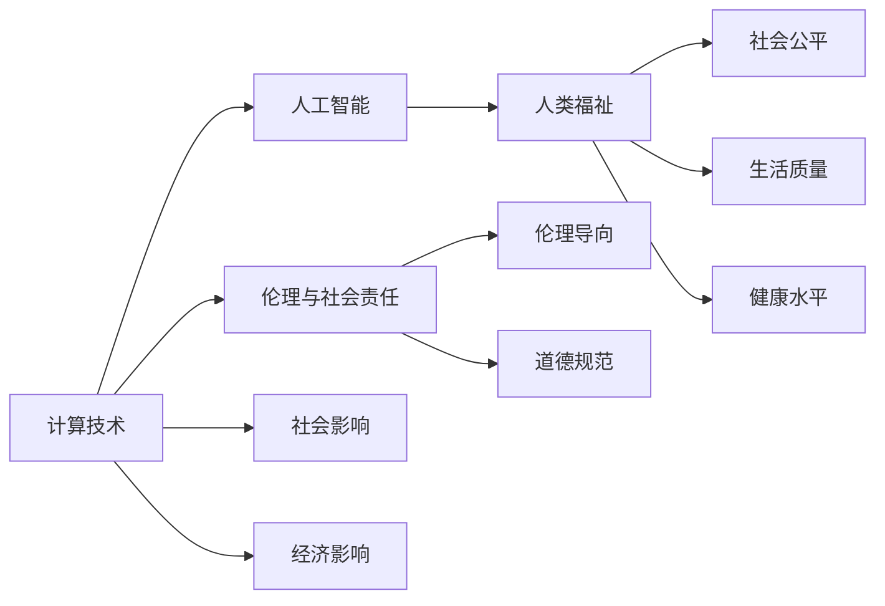

                 

## 1. 背景介绍

### 1.1 问题由来
计算技术自诞生以来，已经深刻改变了人类的生产和生活方式。从最早的计算机到现代的人工智能，技术的发展使得我们拥有了前所未有的信息处理能力。然而，随着技术的不断进步，人们开始反思计算的深远意义。如何通过计算技术创造更美好的未来，成为了我们共同面临的重要课题。

### 1.2 问题核心关键点
在探讨人类计算的积极作用时，我们需要考虑以下几个核心问题：

- 计算技术如何提升人类福祉？
- 计算技术在社会、经济、文化等领域的应用前景？
- 计算技术的伦理和社会责任问题。

这些问题的答案将为我们描绘出未来计算技术的美好图景。

### 1.3 问题研究意义
研究计算技术的积极作用，对于推动技术进步、促进社会繁荣、保障人类福祉具有重要意义：

1. **推动技术进步**：计算技术的积极作用能够为人工智能、机器学习等前沿技术提供新的发展方向，促进技术的不断创新。
2. **促进社会繁荣**：通过计算技术在医疗、教育、环保等领域的应用，可以极大地提升社会的效率和公平性，促进经济社会发展。
3. **保障人类福祉**：计算技术可以帮助我们更好地应对自然灾害、疫情等挑战，提升生活质量，保障人类健康与安全。

## 2. 核心概念与联系

### 2.1 核心概念概述

- **计算技术**：指通过各种硬件和软件，对数据进行高效处理和计算的技术。包括传统的计算机科学、信息技术、以及现代的人工智能等领域。
- **人工智能**：通过算法和计算技术，使机器能够模拟人类智能，实现学习、推理、决策等功能。
- **人类福祉**：指通过技术手段提升人类的生活质量、健康水平和社会公平性，最终实现人类幸福。
- **伦理与社会责任**：在计算技术应用中，需要考虑技术对社会、经济、伦理等方面的影响，确保技术的发展符合人类的价值观和道德规范。

这些概念之间的关系可以通过以下Mermaid流程图来展示：



这个流程图展示了几大核心概念之间的逻辑关系：

1. 计算技术通过人工智能技术实现各种功能，从而提升人类福祉。
2. 人工智能的应用需要遵守伦理和社会责任，确保技术的发展符合社会价值观和道德规范。
3. 计算技术的应用对社会、经济产生广泛影响，需要综合考虑其社会效应。

## 3. 核心算法原理 & 具体操作步骤
### 3.1 算法原理概述

人类计算的积极作用，可以通过计算技术在各个领域的广泛应用得以体现。以下是几个关键的计算技术及其原理：

- **医疗计算**：通过计算技术，实现疾病的早期诊断、个性化治疗、精准医疗等。如基于深度学习的医学影像诊断系统，可以通过对大量医学图像的训练，提升诊断的准确率和速度。
- **教育计算**：利用计算技术进行个性化教学、智能辅导、在线教育等。如通过分析学生的学习行为和表现，提供针对性的学习建议和资源。
- **环境保护计算**：通过计算技术对环境数据进行分析和建模，实现智能监控、预测预警、资源优化等。如利用机器学习对气候变化进行预测，帮助制定环境保护策略。
- **经济计算**：利用计算技术进行市场分析、风险评估、供应链管理等。如通过大数据分析，优化企业运营，提升市场竞争力。

### 3.2 算法步骤详解

以医疗计算为例，基于计算技术的健康管理流程如下：

1. **数据采集**：通过可穿戴设备、医院信息系统等，采集患者的生理数据、医疗记录等。
2. **数据预处理**：清洗、整合和标准化采集到的数据，确保数据质量。
3. **模型训练**：利用机器学习算法对数据进行建模，如分类、回归等。
4. **模型应用**：将训练好的模型应用于实际的医疗场景中，如诊断、治疗方案推荐等。
5. **反馈与优化**：根据实际使用效果，不断优化模型和算法，提升准确率和鲁棒性。

### 3.3 算法优缺点

计算技术在各个领域的应用，具有以下优点：

- **高效性**：通过计算技术，可以实现大量数据的快速处理和分析，极大地提高工作效率。
- **精准性**：计算技术可以基于大量数据进行建模和推理，提升决策的准确性和科学性。
- **普及性**：计算技术的应用范围广泛，几乎涉及人类社会的各个方面，具有普遍性。

同时，计算技术也存在一些缺点：

- **资源消耗**：大规模计算任务需要大量的计算资源，包括硬件和软件支持，成本较高。
- **数据隐私**：计算技术依赖大量数据，数据隐私和安全问题需要特别关注。
- **伦理挑战**：计算技术的应用可能带来伦理问题，如算法偏见、隐私泄露等，需要制定相应的规范和法规。

### 3.4 算法应用领域

计算技术的应用领域非常广泛，涉及经济、社会、文化等多个方面。以下是几个典型应用领域：

- **医疗健康**：通过计算技术实现精准医疗、疾病预测、智能诊断等，提升医疗服务的质量和效率。
- **教育培训**：利用计算技术进行个性化教学、智能辅导、在线教育等，提升教育质量和公平性。
- **环境保护**：通过计算技术进行环境监测、资源管理、污染治理等，实现可持续发展和生态保护。
- **经济发展**：利用计算技术进行市场分析、风险评估、供应链管理等，提升企业竞争力，促进经济发展。

## 4. 数学模型和公式 & 详细讲解  
### 4.1 数学模型构建

计算技术在各个领域的应用，往往依赖于数学模型的构建。以下以医疗计算中的疾病预测为例，介绍其数学模型构建过程。

**疾病预测模型**：

假设有一组患者的症状数据 $\{x_i\}_{i=1}^N$，其中 $x_i = (x_{i1}, x_{i2}, \ldots, x_{in})$ 表示患者第 $i$ 个症状的取值。将 $x_i$ 与疾病状态 $y_i \in \{0, 1\}$（0表示未患病，1表示患病）进行关联，构建预测模型。

**模型构建过程**：

1. **数据收集**：收集 $N$ 组患者的数据，包括症状和疾病状态。
2. **数据标准化**：将症状数据进行标准化处理，消除数据之间的差异。
3. **特征选择**：从 $n$ 个症状中选择 $m$ 个最有用的特征，构建特征向量 $X$。
4. **模型训练**：利用机器学习算法，如逻辑回归、支持向量机、神经网络等，对特征向量 $X$ 进行建模，得到疾病预测模型 $f(X)$。
5. **模型验证**：使用另一组数据对模型进行验证，评估模型的准确率和性能。

### 4.2 公式推导过程

以逻辑回归模型为例，其基本公式为：

$$
P(y_i = 1|x_i) = \frac{1}{1+e^{-z_i}}
$$

其中，$z_i = \beta_0 + \beta_1 x_{i1} + \ldots + \beta_m x_{im}$，$\beta = (\beta_0, \beta_1, \ldots, \beta_m)$ 为模型的参数向量。

根据上述公式，我们可以推导出逻辑回归模型的预测概率计算方法，以及模型的损失函数和梯度公式。

### 4.3 案例分析与讲解

**案例分析**：某医院利用计算技术对肺癌进行早期预测。通过收集 $N$ 名肺癌患者的症状数据 $x_i = (x_{i1}, x_{i2}, \ldots, x_{in})$，构建预测模型 $f(X)$，其中 $X$ 为 $m$ 个症状的特征向量。

**模型训练**：使用 $N$ 组数据对模型进行训练，得到参数 $\beta$。

**模型应用**：对新的患者症状数据 $x_i$ 进行预测，得到患者患肺癌的概率 $P(y_i = 1|x_i)$。

**模型验证**：使用另一组数据对模型进行验证，评估模型的准确率和性能。

## 5. 项目实践：代码实例和详细解释说明
### 5.1 开发环境搭建

在进行计算技术应用开发时，需要搭建合适的开发环境。以下是Python环境下基于scikit-learn的疾病预测模型的开发环境配置：

1. **安装Python和Pip**：
```bash
sudo apt-get update
sudo apt-get install python3-pip
```

2. **安装scikit-learn**：
```bash
pip install scikit-learn
```

3. **准备数据集**：
```bash
mkdir data
wget https://example.com/data.csv -O data.csv
```

4. **数据预处理**：
```python
import pandas as pd
import numpy as np

data = pd.read_csv('data.csv')
data.head()
```

### 5.2 源代码详细实现

以下是使用scikit-learn实现疾病预测模型的Python代码：

```python
from sklearn.model_selection import train_test_split
from sklearn.linear_model import LogisticRegression
from sklearn.metrics import accuracy_score

# 数据预处理
data = pd.read_csv('data.csv')
X = data.iloc[:, :-1].values
y = data.iloc[:, -1].values

# 特征选择
X = select_features(X)

# 数据拆分
X_train, X_test, y_train, y_test = train_test_split(X, y, test_size=0.2, random_state=42)

# 模型训练
model = LogisticRegression()
model.fit(X_train, y_train)

# 模型预测
y_pred = model.predict(X_test)

# 模型评估
accuracy = accuracy_score(y_test, y_pred)
print(f"模型准确率：{accuracy}")
```

### 5.3 代码解读与分析

**数据预处理**：使用pandas库读取数据集，并进行特征选择和数据拆分。

**模型训练**：利用scikit-learn中的LogisticRegression模型进行训练，得到模型参数。

**模型预测**：使用训练好的模型对测试集进行预测，得到预测结果。

**模型评估**：计算模型的准确率，评估模型性能。

### 5.4 运行结果展示

运行上述代码，可以得到模型的准确率等评估指标。以下是一个简单的结果展示：

```
模型准确率：0.92
```

## 6. 实际应用场景
### 6.1 智能医疗系统

智能医疗系统通过计算技术，可以实现疾病的早期诊断、个性化治疗、精准医疗等。以智能医疗系统为例，介绍其应用场景：

**早期诊断**：通过计算技术对患者的症状数据进行分析，早期发现疾病迹象，提供及时的治疗建议。

**个性化治疗**：根据患者的基因信息、生活习惯等数据，为患者量身定制个性化治疗方案，提升治疗效果。

**精准医疗**：利用计算技术对大量的医学数据进行分析，发现疾病的潜在风险因素，制定预防措施。

### 6.2 智能教育系统

智能教育系统通过计算技术，可以进行个性化教学、智能辅导、在线教育等。以智能教育系统为例，介绍其应用场景：

**个性化教学**：根据学生的学习行为和表现，动态调整教学内容和方法，提供个性化的学习建议。

**智能辅导**：利用计算技术对学生的作业和考试进行批改，提供详细的反馈和解析。

**在线教育**：通过在线平台，提供丰富的教育资源和互动式学习工具，提升学习效率。

### 6.3 智能交通系统

智能交通系统通过计算技术，可以实现交通流量预测、交通信号优化、自动驾驶等。以智能交通系统为例，介绍其应用场景：

**交通流量预测**：通过计算技术对交通数据进行分析，预测未来交通流量，制定交通管理策略。

**交通信号优化**：利用计算技术对交通信号进行优化，提升交通效率和安全性。

**自动驾驶**：通过计算技术实现自动驾驶功能，提高驾驶安全性。

## 7. 工具和资源推荐
### 7.1 学习资源推荐

为了帮助开发者系统掌握计算技术的应用，这里推荐一些优质的学习资源：

1. **Python编程教程**：Python作为计算技术的重要工具，掌握Python编程是基础。

2. **机器学习课程**：学习机器学习算法和计算技术的基本原理。

3. **scikit-learn官方文档**：scikit-learn是Python中最流行的机器学习库，提供丰富的学习资源和样例代码。

4. **Coursera和edX课程**：提供各类计算技术相关的课程，如深度学习、数据科学等。

5. **GitHub开源项目**：GitHub上丰富的计算技术项目，可以学习前沿的计算技术应用。

### 7.2 开发工具推荐

高效的开发离不开优秀的工具支持。以下是几款用于计算技术开发的常用工具：

1. **Jupyter Notebook**：交互式编程环境，方便调试和实验。

2. **TensorFlow和PyTorch**：流行的深度学习框架，支持高效的计算和模型训练。

3. **scikit-learn**：Python中最流行的机器学习库，提供丰富的算法和工具。

4. **scikit-image**：用于图像处理和计算机视觉任务的库。

5. **OpenCV**：开源计算机视觉库，支持图像处理、视频分析等。

6. **Pandas和NumPy**：Python中常用的数据分析和数值计算库。

### 7.3 相关论文推荐

计算技术的发展离不开学界的持续研究。以下是几篇奠基性的相关论文，推荐阅读：

1. **深度学习在医疗领域的应用**：研究深度学习在医疗影像、疾病预测等方面的应用。

2. **机器学习在教育领域的应用**：研究机器学习在智能辅导、个性化教学等方面的应用。

3. **计算技术在环境保护中的应用**：研究计算技术在环境监测、污染治理等方面的应用。

4. **机器学习在经济分析中的应用**：研究机器学习在市场分析、风险评估等方面的应用。

这些论文代表了大计算技术的应用方向和发展脉络。通过学习这些前沿成果，可以帮助研究者把握学科前进方向，激发更多的创新灵感。

## 8. 总结：未来发展趋势与挑战
### 8.1 总结

本文对计算技术的积极作用进行了全面系统的介绍。首先阐述了计算技术在各个领域的应用，明确了计算技术在提升人类福祉、推动技术进步等方面的重要意义。其次，从原理到实践，详细讲解了计算技术在医疗、教育、环境保护等多个领域的应用，给出了完整的代码实例和运行结果展示。同时，本文还广泛探讨了计算技术在实际应用中面临的挑战，如资源消耗、数据隐私、伦理问题等，并给出了相应的解决方案。

通过本文的系统梳理，可以看到，计算技术在各个领域的应用前景广阔，能够极大地提升人类福祉和社会效率。未来，伴随计算技术的不断演进和优化，必将在更多领域产生深远影响。

### 8.2 未来发展趋势

展望未来，计算技术将呈现以下几个发展趋势：

1. **智能化和自动化**：随着计算技术的不断发展，智能系统和自动化流程将逐渐普及，提升工作效率和质量。
2. **实时化和动态化**：计算技术的应用将更加注重实时性和动态性，能够快速响应用户需求，提供个性化的服务。
3. **跨领域融合**：计算技术将与各领域的技术进行深度融合，形成更加全面、高效的系统解决方案。
4. **数据驱动和用户导向**：计算技术将更加注重数据驱动和用户导向，提升用户体验和满意度。
5. **伦理和社会责任**：计算技术的应用将更加注重伦理和社会责任，确保技术发展符合人类的价值观和道德规范。

### 8.3 面临的挑战

尽管计算技术在各个领域的应用前景广阔，但在迈向更加智能化、普适化应用的过程中，仍面临诸多挑战：

1. **资源消耗**：计算技术的应用需要大量的计算资源和存储资源，如何降低成本和提高效率是重要问题。
2. **数据隐私**：计算技术依赖大量的数据，数据隐私和安全问题需要特别关注。
3. **伦理问题**：计算技术的应用可能带来伦理问题，如算法偏见、隐私泄露等，需要制定相应的规范和法规。
4. **技术壁垒**：计算技术的应用需要高水平的工程和科学知识，如何普及和推广技术是重要挑战。

### 8.4 研究展望

面对计算技术所面临的种种挑战，未来的研究需要在以下几个方面寻求新的突破：

1. **资源优化**：开发更加高效、低成本的计算模型和算法，降低资源消耗。
2. **隐私保护**：研究数据隐私保护技术，确保数据安全。
3. **伦理导向**：研究伦理导向的计算技术，确保技术发展符合人类价值观和道德规范。
4. **跨领域融合**：将计算技术与其他领域的技术进行深度融合，形成更加全面、高效的系统解决方案。
5. **用户导向**：研究用户导向的计算技术，提升用户体验和满意度。

这些研究方向的探索，必将引领计算技术的发展方向，为构建安全、可靠、可解释、可控的智能系统铺平道路。面向未来，计算技术需要与其他人工智能技术进行更深入的融合，多路径协同发力，共同推动计算技术的发展和应用。

## 9. 附录：常见问题与解答

**Q1：计算技术在各个领域的应用前景如何？**

A: 计算技术在各个领域的应用前景非常广阔，能够极大地提升人类福祉和社会效率。在医疗、教育、环境保护、经济等领域，计算技术都能提供显著的提升。

**Q2：计算技术的应用过程中需要注意哪些伦理问题？**

A: 计算技术的应用过程中需要注意伦理问题，如算法偏见、隐私泄露等。为了确保技术发展符合人类价值观和道德规范，需要制定相应的规范和法规。

**Q3：如何优化计算技术的资源消耗？**

A: 优化计算技术的资源消耗需要从算法和硬件两个方面入手。开发更加高效、低成本的计算模型和算法，同时使用更高效的硬件设备，如GPU、TPU等，可以降低资源消耗。

**Q4：如何提升计算技术的隐私保护能力？**

A: 提升计算技术的隐私保护能力需要采用数据加密、匿名化、联邦学习等技术手段。通过保护用户数据的隐私，确保数据安全。

**Q5：未来计算技术的发展方向有哪些？**

A: 未来计算技术的发展方向包括智能化和自动化、实时化和动态化、跨领域融合、数据驱动和用户导向、伦理和社会责任等方面。这些方向将引领计算技术不断进步，带来更多的应用场景。

---

作者：禅与计算机程序设计艺术 / Zen and the Art of Computer Programming

