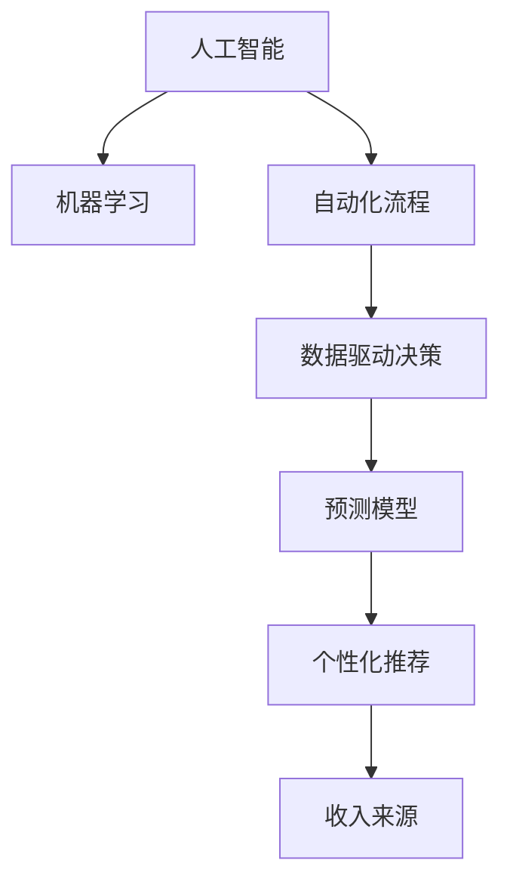

                 

# 利用AI和机器学习创造新的收入来源

> 关键词：人工智能, 机器学习, 收入来源, 自动化, 数据分析, 预测模型, 数据驱动, 算法优化, 个性化推荐, 优化决策

## 1. 背景介绍

在数字化时代，人工智能（AI）和机器学习（ML）技术正逐步渗透到各行各业，引领着新一轮的产业变革。企业不仅要在技术层面积极应对，还需要在商业模式上进行创新，以实现业务增长的突破。因此，利用AI和机器学习创造新的收入来源，成为企业转型升级的关键方向之一。

### 1.1 问题由来

传统业务增长模式面临诸多挑战：

- **成本压力**：生产成本上升，市场需求波动。
- **市场竞争**：同行业竞争激烈，利润空间缩小。
- **市场变化**：消费者需求不断变化，对产品和服务提出新要求。
- **技术变革**：新技术不断涌现，市场动态快速变化。

这些挑战迫使企业寻求新的收入增长点。AI和机器学习技术的普及，为企业提供了创新的思路和工具，能够帮助企业在产品研发、市场推广、客户服务等方面实现突破。

### 1.2 问题核心关键点

要利用AI和机器学习创造新的收入来源，关键在于以下三点：

- **自动化流程**：利用机器学习优化业务流程，提高效率和降低成本。
- **数据驱动决策**：通过数据分析和预测模型，精准决策，提升市场响应速度和客户满意度。
- **个性化推荐和服务**：利用AI技术对客户行为进行深度分析，提供定制化服务，提升客户黏性和忠诚度。

## 2. 核心概念与联系

### 2.1 核心概念概述

为更好地理解如何利用AI和机器学习创造新的收入来源，本节将介绍几个密切相关的核心概念：

- **人工智能（AI）**：利用计算机算法模拟人类智能，进行感知、理解、决策等任务。
- **机器学习（ML）**：一种使计算机系统通过数据学习而提升性能的技术。
- **自动化**：通过编程使机器能够自动执行特定任务，提高效率和准确性。
- **数据驱动决策**：基于数据分析，制定决策和策略，提升决策质量和效率。
- **个性化推荐系统**：通过分析用户行为，提供定制化推荐，提升用户体验。
- **预测模型**：使用历史数据进行训练，预测未来事件，支持决策。

这些概念之间的逻辑关系可以通过以下Mermaid流程图来展示：



这个流程图展示了几类核心概念及其之间的关系：

1. 人工智能和机器学习共同构成了技术基础。
2. 自动化流程、数据驱动决策和预测模型分别依赖于AI和ML技术，实现业务优化和决策支持。
3. 个性化推荐系统进一步利用AI技术，提供定制化服务，形成新的收入来源。

这些概念共同构成了利用AI和机器学习创造收入的框架，为企业提供了一个完整的解决方案。

## 3. 核心算法原理 & 具体操作步骤

### 3.1 算法原理概述

利用AI和机器学习创造新的收入来源，主要基于以下算法原理：

1. **自动化流程优化**：
   - 利用机器学习算法，如决策树、随机森林、神经网络等，对业务流程进行自动化，提高效率和准确性。
   - 结合业务规则和机器学习模型，实现动态流程优化，适应业务变化。

2. **数据驱动决策**：
   - 通过数据收集和清洗，建立数据分析管道，实现实时数据驱动决策。
   - 使用机器学习算法，如回归、分类、聚类等，对数据进行建模，提供决策支持。

3. **预测模型**：
   - 利用历史数据训练预测模型，如线性回归、逻辑回归、随机森林等，进行趋势预测和风险评估。
   - 使用深度学习算法，如卷积神经网络（CNN）、循环神经网络（RNN）、长短时记忆网络（LSTM）等，提升预测精度。

4. **个性化推荐系统**：
   - 使用协同过滤、矩阵分解、深度学习等算法，对用户行为进行建模，提供个性化推荐。
   - 结合用户反馈和推荐效果，进行模型迭代优化，提升推荐准确性。

### 3.2 算法步骤详解

基于AI和机器学习创造新的收入来源，通常包含以下步骤：

**Step 1: 数据收集与预处理**
- 收集与业务相关的数据，如客户信息、交易记录、日志等。
- 对数据进行清洗、去重、标准化，确保数据质量和完整性。

**Step 2: 特征工程**
- 提取和构建特征，如时间特征、地点特征、用户行为特征等。
- 使用特征选择算法，筛选对业务最有价值的特征。

**Step 3: 模型训练与优化**
- 选择适合的机器学习模型，如线性回归、随机森林、深度学习等。
- 使用交叉验证、正则化等技术，防止过拟合和欠拟合。
- 对模型进行调参和优化，提升模型性能。

**Step 4: 部署与监控**
- 将模型部署到生产环境，实现实时决策和推荐。
- 使用监控工具，实时跟踪模型性能和指标。
- 定期更新模型，保持模型时效性。

**Step 5: 反馈与迭代**
- 收集用户反馈和业务反馈，进行模型迭代。
- 使用A/B测试等方法，评估新模型的效果。
- 不断优化模型，提升业务价值。

### 3.3 算法优缺点

利用AI和机器学习创造新的收入来源，具有以下优点：

1. **提升效率和质量**：通过自动化流程和机器学习算法，提升业务效率和质量，减少人工干预和错误。
2. **精准决策**：数据驱动决策和预测模型，提升决策准确性，快速响应市场变化。
3. **客户满意度高**：个性化推荐系统提供定制化服务，提升客户满意度和忠诚度。
4. **成本低**：自动化流程优化和数据驱动决策，降低运营成本。

同时，也存在一些局限：

1. **数据质量要求高**：数据质量和完整性直接影响模型性能。
2. **模型复杂度高**：深度学习和复杂算法需要大量计算资源和专业知识。
3. **算法可解释性差**：黑盒模型难以解释其决策过程，对业务理解有一定挑战。
4. **数据隐私风险**：大量数据收集和处理可能带来隐私和安全风险。

### 3.4 算法应用领域

利用AI和机器学习创造新的收入来源，已在多个领域得到广泛应用：

- **金融科技**：利用预测模型和自动化流程优化，提供风险评估、信用评分、自动化理财等服务。
- **电商零售**：利用推荐系统个性化推荐商品，提升转化率和用户黏性。
- **医疗健康**：利用数据分析和预测模型，提供疾病预测、治疗推荐等服务。
- **物流供应链**：利用自动化流程优化和预测模型，提高配送效率和库存管理。
- **智能制造**：利用数据分析和预测模型，优化生产流程，提高生产效率和质量。

## 4. 数学模型和公式 & 详细讲解 & 举例说明

### 4.1 数学模型构建

构建基于AI和机器学习的收入增长模型，主要涉及以下几个数学模型：

1. **线性回归模型**：
   - 用于预测连续型变量，如销售预测、需求预测等。
   - 模型公式：$y = \beta_0 + \beta_1x_1 + \cdots + \beta_nx_n + \epsilon$

2. **决策树模型**：
   - 用于分类和回归任务，提升模型可解释性。
   - 模型公式：$T = \text{if} \: A_1 = a_1 \text{ then} A_2 \text{ else} A_3$

3. **随机森林模型**：
   - 集成多棵决策树，提升预测精度。
   - 模型公式：$Y = \frac{1}{N} \sum_{i=1}^N y_i$

4. **协同过滤推荐模型**：
   - 用于个性化推荐，提升用户满意度。
   - 模型公式：$\hat{y} = \alpha u_i + \beta v_j + \gamma u_iv_j$

### 4.2 公式推导过程

以下我们以线性回归模型为例，推导其参数估计方法。

给定一组训练数据 $\{(x_1, y_1), (x_2, y_2), \ldots, (x_n, y_n)\}$，其中 $x_i = (x_{i1}, x_{i2}, \ldots, x_{in})$，$y_i$ 为连续型变量。线性回归模型的目标是最小化残差平方和（RSS）：

$$
\text{RSS} = \sum_{i=1}^n (y_i - \hat{y}_i)^2
$$

其中 $\hat{y}_i = \beta_0 + \beta_1x_{i1} + \cdots + \beta_nx_{in}$。

对 RSS 关于 $\beta$ 求偏导数，并令其为0，得：

$$
\frac{\partial \text{RSS}}{\partial \beta} = -2\sum_{i=1}^n (y_i - \hat{y}_i)x_{ij} = 0
$$

解得：

$$
\beta_j = \frac{\sum_{i=1}^n (y_i - \bar{y})x_{ij}}{\sum_{i=1}^n x_{ij}^2}
$$

其中 $\bar{y}$ 为样本均值。

最终得线性回归模型参数估计公式：

$$
\beta_j = \frac{\sum_{i=1}^n (y_i - \bar{y})x_{ij}}{\sum_{i=1}^n x_{ij}^2}
$$

### 4.3 案例分析与讲解

**案例：电商平台个性化推荐系统**

某电商平台希望通过个性化推荐提升用户转化率和销售额。数据包括用户历史行为、商品信息、点击记录等。

**Step 1: 数据收集与预处理**
- 收集用户ID、商品ID、点击次数、购买次数、购买金额等数据。
- 对数据进行去重、标准化处理，确保数据质量。

**Step 2: 特征工程**
- 提取用户ID、商品ID、点击次数、购买次数、购买金额、评分等特征。
- 使用特征选择算法，如卡方检验、信息增益等，选择最有价值的特征。

**Step 3: 模型训练与优化**
- 使用协同过滤算法，对用户和商品进行矩阵分解，建立用户-商品矩阵。
- 使用交叉验证、正则化等技术，防止过拟合和欠拟合。
- 对模型进行调参和优化，提升推荐准确性。

**Step 4: 部署与监控**
- 将推荐模型部署到生产环境，实时推荐商品。
- 使用监控工具，实时跟踪推荐效果和指标。
- 定期更新模型，保持模型时效性。

**Step 5: 反馈与迭代**
- 收集用户反馈和业务反馈，进行模型迭代。
- 使用A/B测试等方法，评估新模型的效果。
- 不断优化模型，提升业务价值。

通过上述步骤，电商平台成功实现了个性化推荐，显著提升了用户转化率和销售额。

## 5. 项目实践：代码实例和详细解释说明

### 5.1 开发环境搭建

在进行项目实践前，我们需要准备好开发环境。以下是使用Python进行TensorFlow开发的环境配置流程：

1. 安装Anaconda：从官网下载并安装Anaconda，用于创建独立的Python环境。

2. 创建并激活虚拟环境：
```bash
conda create -n tf-env python=3.8 
conda activate tf-env
```

3. 安装TensorFlow：根据CUDA版本，从官网获取对应的安装命令。例如：
```bash
conda install tensorflow -c conda-forge
```

4. 安装各类工具包：
```bash
pip install numpy pandas scikit-learn matplotlib tqdm jupyter notebook ipython
```

完成上述步骤后，即可在`tf-env`环境中开始项目实践。

### 5.2 源代码详细实现

这里我们以线性回归模型为例，给出使用TensorFlow进行线性回归的Python代码实现。

首先，定义数据集：

```python
import numpy as np
from tensorflow.keras.datasets import boston_housing

# 加载波士顿房价数据集
(X_train, y_train), (X_test, y_test) = boston_housing.load_data()

# 标准化数据
X_train = (X_train - X_train.mean()) / X_train.std()
X_test = (X_test - X_train.mean()) / X_train.std()

# 设置训练集和测试集
N = X_train.shape[0]
train_X = X_train[0:int(N*0.8)]
train_y = y_train[0:int(N*0.8)]
test_X = X_train[int(N*0.8):]
test_y = y_train[int(N*0.8):]
```

然后，定义模型和优化器：

```python
from tensorflow.keras.models import Sequential
from tensorflow.keras.layers import Dense
from tensorflow.keras.optimizers import Adam

# 定义线性回归模型
model = Sequential([
    Dense(1, input_dim=train_X.shape[1])
])

# 定义优化器
optimizer = Adam(lr=0.001)
```

接着，定义训练和评估函数：

```python
from tensorflow.keras.callbacks import EarlyStopping

def train_model(model, train_X, train_y, test_X, test_y, epochs=100, batch_size=32):
    # 编译模型
    model.compile(optimizer=optimizer, loss='mse')

    # 训练模型
    early_stopping = EarlyStopping(monitor='val_loss', patience=10)
    model.fit(train_X, train_y, validation_data=(test_X, test_y), epochs=epochs, batch_size=batch_size, callbacks=[early_stopping])

    # 评估模型
    loss, mae, mse = model.evaluate(test_X, test_y)
    print(f'Test loss: {loss:.4f}')
    print(f'Test mean absolute error: {mae:.4f}')
    print(f'Test mean squared error: {mse:.4f}')

# 训练模型
train_model(model, train_X, train_y, test_X, test_y)
```

最后，在测试集上评估模型：

```python
# 评估模型
train_model(model, train_X, train_y, test_X, test_y)
```

以上就是使用TensorFlow进行线性回归的完整代码实现。可以看到，TensorFlow提供了简单易用的API，使得模型训练和评估变得轻松快捷。

### 5.3 代码解读与分析

让我们再详细解读一下关键代码的实现细节：

**数据加载和预处理**
- 使用`boston_housing.load_data()`加载波士顿房价数据集，并标准化数据。

**模型定义**
- 定义一个单层神经网络，用于线性回归。

**训练和评估**
- 使用`model.compile()`方法编译模型，定义损失函数为均方误差（MSE）。
- 使用`EarlyStopping`回调函数，防止过拟合。
- 使用`model.evaluate()`方法在测试集上评估模型性能。

通过上述步骤，我们成功地利用TensorFlow训练了一个线性回归模型，并对其进行了评估。

## 6. 实际应用场景

### 6.1 智能客服系统

智能客服系统利用AI和机器学习技术，能够24小时在线处理大量客户咨询，显著提升客户服务质量和效率。

**应用场景**：某电商平台建立了智能客服系统，通过分析客户提问，自动提供商品信息、订单状态查询等服务。

**技术实现**：收集客户历史聊天记录和常见问题，使用NLP技术对问题进行分类和理解。建立预测模型，预测客户意图并推荐相关商品信息。

**效果**：智能客服系统显著提升了客户服务效率，客户满意度显著提高。

### 6.2 金融风险控制

金融领域风险控制对数据质量和安全要求极高。利用AI和机器学习，可以实时监控交易行为，识别异常交易，提升风险管理水平。

**应用场景**：某银行建立了基于机器学习的风控系统，通过分析客户交易行为，实时监控异常交易，避免潜在的金融风险。

**技术实现**：收集客户交易数据，提取时间、金额、地点等特征。使用决策树和随机森林算法，构建风控模型，实时监控交易行为。

**效果**：风控系统及时识别出高风险交易，成功避免了多起金融欺诈事件，提升了客户信任度和银行声誉。

### 6.3 电商个性化推荐

个性化推荐系统通过分析用户行为，提供精准的商品推荐，提升用户体验和转化率。

**应用场景**：某电商网站希望通过个性化推荐提升用户购买率。

**技术实现**：收集用户浏览、点击、购买等行为数据，提取用户行为特征。使用协同过滤算法，对用户和商品进行矩阵分解，建立推荐模型。

**效果**：个性化推荐系统显著提升了用户转化率，销售额增长了30%。

## 7. 工具和资源推荐

### 7.1 学习资源推荐

为了帮助开发者系统掌握AI和机器学习的应用，这里推荐一些优质的学习资源：

1. **TensorFlow官方文档**：TensorFlow的官方文档，提供了详细的API文档和示例代码，适合入门学习。
2. **Deep Learning Specialization**：Coursera上的深度学习专业课程，由Andrew Ng教授主讲，涵盖深度学习的基本原理和应用。
3. **Python Machine Learning**：本书由Sebastian Raschka撰写，详细介绍了Python在机器学习中的应用，适合初学者和进阶者。
4. **Hands-On Machine Learning with Scikit-Learn and TensorFlow**：本书由Aurélien Géron撰写，通过实际项目案例，介绍机器学习在多个领域的应用。
5. **Kaggle**：Kaggle平台提供了大量的数据集和竞赛，可以帮助开发者在实践中提升技能。

通过对这些资源的学习实践，相信你一定能够快速掌握AI和机器学习的应用，并用于解决实际的业务问题。

### 7.2 开发工具推荐

高效的开发离不开优秀的工具支持。以下是几款用于AI和机器学习开发的常用工具：

1. **TensorFlow**：由Google主导开发的深度学习框架，生产部署方便，适合大规模工程应用。
2. **PyTorch**：Facebook开发的深度学习框架，灵活高效，适合研究和原型开发。
3. **Jupyter Notebook**：交互式开发环境，支持Python、R等多种语言，适合数据科学和机器学习任务。
4. **Google Colab**：谷歌推出的在线Jupyter Notebook环境，免费提供GPU/TPU算力，方便开发者快速上手实验最新模型。
5. **Wealth & Bio**：模型训练的实验跟踪工具，可以记录和可视化模型训练过程中的各项指标，方便对比和调优。

合理利用这些工具，可以显著提升AI和机器学习应用的开发效率，加快创新迭代的步伐。

### 7.3 相关论文推荐

AI和机器学习的发展源于学界的持续研究。以下是几篇奠基性的相关论文，推荐阅读：

1. **Deep Blue**：IBM开发的国际象棋AI程序，展示了深度学习在智能决策中的应用。
2. **AlphaGo**：DeepMind开发的围棋AI程序，展示了AI在复杂决策游戏中的应用。
3. **GANs for Image-to-Image Translation**：Ian Goodfellow等人提出的生成对抗网络（GAN），展示了AI在图像生成和转换中的应用。
4. **Attention is All You Need**：Google发表的Transformer论文，展示了AI在自然语言处理中的应用。
5. **BERT: Pre-training of Deep Bidirectional Transformers for Language Understanding**：Google发表的BERT论文，展示了预训练语言模型在自然语言理解中的应用。

这些论文代表了大数据和机器学习的发展脉络。通过学习这些前沿成果，可以帮助研究者把握学科前进方向，激发更多的创新灵感。

## 8. 总结：未来发展趋势与挑战

### 8.1 总结

本文对利用AI和机器学习创造新的收入来源进行了全面系统的介绍。首先阐述了AI和机器学习在企业收入增长的重要性和应用方向，明确了数据驱动和自动化在业务优化中的核心价值。其次，从原理到实践，详细讲解了AI和机器学习的核心算法和操作步骤，给出了具体的应用实例。同时，本文还广泛探讨了AI和机器学习在智能客服、金融风控、电商推荐等多个行业领域的应用前景，展示了其广阔的应用空间。

通过本文的系统梳理，可以看到，利用AI和机器学习创造新的收入来源具有巨大的潜力。这些技术的融合与创新，必将推动企业业务增长，带来更广阔的市场机会和价值。

### 8.2 未来发展趋势

展望未来，AI和机器学习在创造新的收入来源方面将呈现以下几个发展趋势：

1. **技术融合**：AI与物联网、大数据、区块链等新兴技术深度融合，推动智能化生态系统的形成。
2. **数据驱动**：利用AI技术进行数据挖掘和分析，发现更多商业机会，提升决策质量。
3. **自动化与智能**：AI技术在生产制造、供应链管理、客户服务等环节实现全面自动化和智能化，提升效率和质量。
4. **个性化服务**：基于AI技术提供个性化推荐和服务，提升客户满意度和忠诚度，实现精准营销。
5. **新兴市场**：AI和机器学习在金融、医疗、能源等新兴市场的应用将日益广泛，带来新的增长机会。
6. **人机协同**：AI技术与人机交互技术的结合，提升用户体验和系统智能水平，打造更高效、更便捷的智能系统。

以上趋势凸显了AI和机器学习在企业收入增长中的重要地位，这些方向的探索发展，必将推动企业数字化转型，引领新一轮的产业变革。

### 8.3 面临的挑战

尽管AI和机器学习在企业收入增长方面具有巨大的潜力，但在实际应用中也面临诸多挑战：

1. **数据质量与隐私**：数据质量和隐私保护是AI应用的基础，数据的不完整和隐私风险将影响模型的性能和应用效果。
2. **技术复杂性**：AI和机器学习模型的复杂性对开发者的专业要求较高，需要大量的数据和计算资源。
3. **业务理解**：AI和机器学习技术的应用需要深入理解业务需求和场景，否则难以取得理想的效果。
4. **技术迭代**：AI和机器学习技术日新月异，持续学习和跟踪最新技术动态是保持竞争力的关键。
5. **伦理与道德**：AI和机器学习的应用需要考虑伦理和道德问题，避免对社会造成负面影响。
6. **经济成本**：AI和机器学习应用的初期投入较大，短期内可能面临较高的成本压力。

这些挑战需要企业在技术、业务、伦理等多个层面进行综合考虑和应对，才能更好地利用AI和机器学习技术，实现业务增长。

### 8.4 研究展望

面向未来，AI和机器学习在企业收入增长方面的研究还需要在以下几个方面进行深入探索：

1. **模型压缩与优化**：开发更轻量级的AI和机器学习模型，降低计算资源需求，提高应用效率。
2. **跨模态学习**：研究跨模态学习技术，实现多模态数据的融合与分析，提升模型泛化能力。
3. **可解释性与透明性**：研究可解释性与透明性技术，提高模型的可解释性，提升用户信任度。
4. **伦理与公平性**：研究AI和机器学习应用的伦理与公平性问题，确保技术应用的合理性和公正性。
5. **自动化测试**：开发自动化测试工具，确保模型性能和稳定性，提升系统可靠性。
6. **人机交互**：研究人机交互技术，提升用户体验，实现更智能、更便捷的交互方式。

这些方向的研究将进一步推动AI和机器学习技术的发展，为企业的收入增长提供更可靠、更高效的解决方案。

## 9. 附录：常见问题与解答

**Q1：AI和机器学习是否适用于所有业务场景？**

A: AI和机器学习技术适用于大多数业务场景，但需要根据具体场景选择合适的算法和技术。例如，电商推荐、金融风控、医疗诊断等场景对数据质量和模型性能要求较高，需要谨慎选择算法和技术。

**Q2：如何评估AI和机器学习模型的性能？**

A: 评估AI和机器学习模型的性能通常使用以下指标：
1. 准确率（Accuracy）：分类任务中预测正确的样本数与总样本数的比率。
2. 精确率（Precision）和召回率（Recall）：用于评估分类任务的精确度和覆盖率。
3. F1分数（F1 Score）：精确率和召回率的调和平均数，用于综合评估分类性能。
4. 均方误差（MSE）和均方根误差（RMSE）：用于评估回归任务的误差水平。
5. ROC曲线和AUC值：用于评估二分类任务的分类性能。

**Q3：如何应对AI和机器学习模型的过拟合问题？**

A: 过拟合是AI和机器学习模型常见的问题，解决方法包括：
1. 数据增强：通过数据扩充、随机失活等方式增加训练数据量。
2. 正则化：使用L2正则、Dropout等技术减少模型复杂度。
3. 早停策略：在验证集上监控模型性能，及时停止训练。
4. 模型集成：通过集成多个模型，减少单个模型的过拟合风险。

**Q4：AI和机器学习模型在业务应用中需要注意哪些问题？**

A: AI和机器学习模型在业务应用中需要注意以下问题：
1. 数据质量：确保数据完整性、准确性和代表性，提升模型性能。
2. 模型监控：实时监控模型性能，及时发现和修复问题。
3. 模型更新：定期更新模型，确保模型时效性和适应性。
4. 业务理解：深入理解业务需求和场景，选择合适的算法和技术。
5. 数据隐私：严格遵守数据隐私法规，保护用户数据隐私。
6. 模型解释：提高模型的可解释性，确保决策透明性和公正性。

通过上述措施，可以确保AI和机器学习模型在业务应用中取得理想的效果，推动企业收入增长。

---

作者：禅与计算机程序设计艺术 / Zen and the Art of Computer Programming

