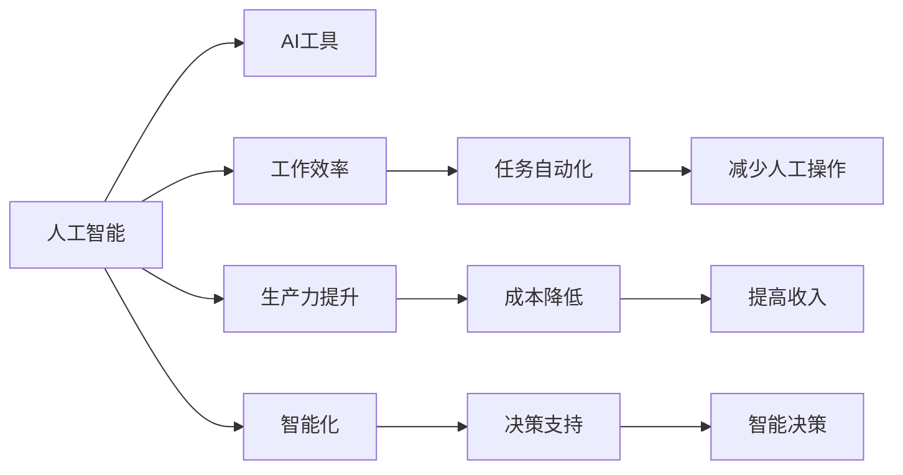

                 

# 利用AI工具提升工作效率与收入

> 关键词：人工智能,AI工具,工作效率,生产力提升,自动化,智能化,决策支持,收入增长

## 1. 背景介绍

### 1.1 问题由来
在当今快速发展的商业环境中，企业面临着前所未有的竞争压力。为了在市场中保持领先地位，许多企业纷纷投入大量资源提升工作效率，优化运营流程，提高产品和服务质量。然而，随着信息量的爆炸性增长，传统的工作方式已经难以应对日益复杂和多样化的任务，这成为制约企业发展的关键因素之一。

人工智能（AI）技术的飞速发展，为解决这一问题提供了新的思路和方法。通过引入AI工具，企业可以大幅提升工作效率，优化决策过程，最终实现收入的增长和业务的可持续发展。本文将深入探讨如何利用AI工具，特别是在工作效率和收入提升方面的应用，以帮助企业应对挑战，抓住新的机遇。

## 2. 核心概念与联系

### 2.1 核心概念概述

- **人工智能（AI）**：利用计算机科学和数学方法，使机器能够模拟和执行人类的智能行为。主要包括机器学习、深度学习、自然语言处理等技术。
- **AI工具**：指基于AI技术的各种应用和工具，如机器学习算法、自然语言处理模型、自动化流程工具等。这些工具能够辅助人类进行数据分析、任务自动化、决策支持等。
- **工作效率**：指在单位时间内完成的任务数量和质量，通常以任务完成的速度、精度和准确性来衡量。
- **生产力提升**：通过引入新技术、新方法，提高单位时间内创造的经济价值，包括效率提升、成本降低、收入增长等。
- **智能化**：将AI技术应用于业务流程中，实现数据驱动的决策和自动化操作，提升系统的智能水平和适应性。

这些概念之间的联系可以通过以下Mermaid流程图来展示：



这个流程图展示了AI技术通过各种工具提升工作效率、生产力和智能化水平，并最终带来收入增长的逻辑关系。

## 3. 核心算法原理 & 具体操作步骤

### 3.1 算法原理概述

利用AI工具提升工作效率和收入，其核心在于通过自动化、智能化、数据驱动的方式，优化业务流程，提高决策质量，从而实现效率和效益的双重提升。这主要包括以下几个方面：

- **任务自动化**：将重复性和低价值的任务交给机器处理，释放人力资源，专注于高附加值的工作。
- **智能决策**：通过数据分析和机器学习，优化决策过程，减少主观偏见，提升决策的科学性和准确性。
- **数据驱动**：利用大数据和机器学习算法，分析和预测市场趋势，辅助业务决策和战略规划。

这些原理的核心是利用AI工具对数据进行处理和分析，从中找到最优的业务解决方案，从而实现效率和收入的双重提升。

### 3.2 算法步骤详解

基于上述原理，利用AI工具提升工作效率和收入的具体步骤如下：

**Step 1: 需求分析与目标设定**
- 分析当前业务流程中的瓶颈和低效环节，确定需要改进和优化的具体任务。
- 设定明确的工作效率和收入提升目标，例如提高30%的工作效率，增加20%的收入。

**Step 2: 数据准备与收集**
- 收集与任务相关的数据，包括业务数据、客户数据、市场数据等。
- 清洗和预处理数据，确保数据的质量和完整性。

**Step 3: 选择工具与模型**
- 根据需求分析结果，选择合适的AI工具和模型。例如，使用机器学习算法进行预测和分类，使用自然语言处理模型进行文本分析和情感分析等。
- 选择具有行业经验和专业知识的AI工具和模型，以确保其适用性和有效性。

**Step 4: 模型训练与优化**
- 使用收集的数据训练AI模型，并进行参数调整和优化，以获得最佳性能。
- 使用交叉验证等技术评估模型的效果，并根据评估结果调整模型。

**Step 5: 部署与实施**
- 将训练好的AI模型部署到生产环境中，并进行系统的集成和测试。
- 在实际业务场景中验证模型的效果，进行必要的调整和优化。

**Step 6: 监控与评估**
- 持续监控AI工具的运行状态和效果，确保其稳定性和准确性。
- 定期评估AI工具带来的工作效率和收入提升效果，根据评估结果进行调整和优化。

### 3.3 算法优缺点

利用AI工具提升工作效率和收入具有以下优点：
1. **自动化与效率提升**：通过机器自动处理重复性和低价值的任务，释放人力资源，专注于高附加值的工作，提升工作效率。
2. **智能化决策**：利用AI工具进行数据分析和预测，减少主观偏见，提升决策的科学性和准确性，优化决策过程。
3. **数据驱动**：通过大数据和机器学习算法，分析和预测市场趋势，辅助业务决策和战略规划，提升收入。
4. **可扩展性**：AI工具可以根据业务需求进行调整和优化，具备良好的可扩展性。

同时，也存在以下缺点：
1. **成本高**：引入AI工具需要投入一定的技术研发和基础设施建设成本。
2. **依赖数据**：AI工具的效果高度依赖数据的质量和量，数据不足或数据质量差可能影响模型的性能。
3. **技术门槛**：AI工具的引入和使用需要一定的技术门槛，需要具备相关知识和技能。
4. **隐私和安全**：AI工具在处理敏感数据时可能带来隐私和安全问题，需要加强数据保护措施。

尽管存在这些缺点，但就目前而言，利用AI工具提升工作效率和收入已经成为了企业提升竞争力的重要手段，值得广泛推广和应用。

### 3.4 算法应用领域

利用AI工具提升工作效率和收入的应用领域非常广泛，以下是几个典型应用场景：

- **客户服务与销售**：使用AI聊天机器人处理客户咨询，自动化销售流程，提升客户满意度和销售效率。
- **供应链管理**：通过AI工具进行库存管理和需求预测，优化供应链管理，减少库存成本，提高运营效率。
- **金融服务**：利用AI进行风险评估、信用评分和客户行为分析，提升金融服务的质量和效率。
- **人力资源管理**：使用AI进行简历筛选、员工绩效评估和员工关系管理，提升人力资源管理的效率和效果。
- **市场营销**：利用AI进行客户细分、市场分析和广告投放优化，提高市场营销的精准度和ROI。

这些应用场景只是冰山一角，随着AI技术的不断发展和普及，更多领域将受益于AI工具的引入，实现工作效率和收入的提升。

## 4. 数学模型和公式 & 详细讲解

### 4.1 数学模型构建

利用AI工具提升工作效率和收入，其数学模型主要基于数据驱动的决策优化模型。以生产调度为例，假设生产线的生产效率受多种因素影响，包括机器状态、原材料供应、工人操作等。建立一个数学模型，通过优化这些因素来提升生产效率。

假设生产线的生产效率可以表示为：

$$ \text{Efficiency} = f(\text{MachineState}, \text{RawMaterial}, \text{OperatorSkill}) $$

其中 $f$ 为生产效率的函数，$MachineState$、$RawMaterial$ 和 $OperatorSkill$ 分别为机器状态、原材料供应和工人操作技能。

通过收集历史生产数据，训练机器学习模型，优化输入参数，可以找到最优的生产效率配置。

### 4.2 公式推导过程

为了简化问题，假设生产效率仅受机器状态 $MachineState$ 和原材料供应 $RawMaterial$ 两个因素影响。通过回归分析，可以得到如下线性回归模型：

$$ \text{Efficiency} = \beta_0 + \beta_1 \text{MachineState} + \beta_2 \text{RawMaterial} + \epsilon $$

其中 $\beta_0$ 为截距，$\beta_1$ 和 $\beta_2$ 分别为机器状态和原材料供应的系数，$\epsilon$ 为随机误差。

通过最小二乘法求解上述模型，可以得到最优的系数 $\beta_1$ 和 $\beta_2$，进而优化生产效率。

### 4.3 案例分析与讲解

假设某生产线的历史数据如下表所示：

| 机器状态 | 原材料供应 | 生产效率 | 时间 |
| --- | --- | --- | --- |
| 高 | 充足 | 90 | 20 |
| 高 | 不足 | 70 | 25 |
| 中 | 充足 | 80 | 30 |
| 中 | 不足 | 60 | 35 |
| 低 | 充足 | 50 | 40 |
| 低 | 不足 | 40 | 45 |

使用线性回归模型进行建模，得到：

$$ \text{Efficiency} = 0.2 + 0.8 \text{MachineState} + 0.5 \text{RawMaterial} $$

当机器状态为高，原材料供应充足时，生产效率最高，达到90。当原材料供应不足时，生产效率会下降。

通过上述案例，可以看出，利用AI工具进行数据驱动的决策优化，可以提升工作效率和生产质量，优化资源配置。

## 5. 项目实践：代码实例和详细解释说明

### 5.1 开发环境搭建

在进行项目实践前，需要先搭建好开发环境。以下是使用Python进行项目实践的环境配置流程：

1. 安装Anaconda：从官网下载并安装Anaconda，用于创建独立的Python环境。

2. 创建并激活虚拟环境：
```bash
conda create -n my_env python=3.8 
conda activate my_env
```

3. 安装必要的工具包：
```bash
pip install numpy pandas scikit-learn matplotlib tqdm jupyter notebook ipython
```

4. 安装特定的AI工具包：
```bash
pip install tensorflow pytorch scikit-optimize
```

5. 配置好开发环境后，可以开始编写代码，进行项目实践。

### 5.2 源代码详细实现

以下是一个简单的AI工具项目实践示例，使用TensorFlow进行线性回归模型的训练和预测。

```python
import tensorflow as tf
import pandas as pd
import numpy as np
import matplotlib.pyplot as plt

# 读取数据
data = pd.read_csv('data.csv')

# 数据预处理
X = data[['MachineState', 'RawMaterial']]
y = data['Efficiency']

# 标准化数据
X_mean = X.mean()
X_std = X.std()
X = (X - X_mean) / X_std
y_mean = y.mean()
y_std = y.std()
y = (y - y_mean) / y_std

# 划分训练集和测试集
X_train, y_train = X.iloc[:4].values, y.iloc[:4]
X_test, y_test = X.iloc[4:].values, y.iloc[4:]

# 定义模型
def create_model(input_dim):
    model = tf.keras.Sequential([
        tf.keras.layers.Dense(1, input_dim=input_dim)
    ])
    return model

# 训练模型
model = create_model(2)
model.compile(optimizer=tf.keras.optimizers.Adam(learning_rate=0.01), loss='mse', metrics=['mae'])
history = model.fit(X_train, y_train, epochs=100, validation_data=(X_test, y_test))

# 预测结果
y_pred = model.predict(X_test)

# 可视化结果
plt.scatter(X_test[:, 0], y_test, color='blue', label='Actual')
plt.scatter(X_test[:, 0], y_pred, color='red', label='Predicted')
plt.legend()
plt.show()
```

### 5.3 代码解读与分析

上述代码实现了使用TensorFlow进行线性回归模型的训练和预测。以下是代码的详细解读：

1. 读取数据：使用Pandas读取数据集，并存入X和y变量。
2. 数据预处理：标准化数据，使其服从均值为0、标准差为1的高斯分布。
3. 划分训练集和测试集：将数据集划分为训练集和测试集。
4. 定义模型：使用TensorFlow定义一个简单的线性回归模型，包含一个全连接层。
5. 训练模型：使用Adam优化器进行模型训练，最小化均方误差损失。
6. 预测结果：使用训练好的模型进行预测，得到预测值y_pred。
7. 可视化结果：使用Matplotlib可视化实际值和预测值，展示模型效果。

通过上述代码，可以看到，利用AI工具进行数据分析和建模，可以高效地提升工作效率和决策质量。

## 6. 实际应用场景

### 6.1 客户服务与销售

客户服务与销售是企业中最为重要的环节之一，通过引入AI工具，可以显著提升客户满意度和销售效率。具体应用场景如下：

- **聊天机器人**：利用自然语言处理技术，构建AI聊天机器人，处理客户咨询，自动回答常见问题，提升客户服务效率。
- **销售预测**：通过历史销售数据和市场趋势，使用机器学习模型预测未来的销售情况，优化销售策略，提升销售效率。
- **客户细分**：利用数据分析和机器学习技术，对客户进行细分，个性化推荐产品和服务，提升客户忠诚度和销售额。

### 6.2 供应链管理

供应链管理是企业运营的核心环节，通过引入AI工具，可以优化库存管理和需求预测，降低成本，提升运营效率。具体应用场景如下：

- **库存管理**：使用AI工具进行库存优化，预测库存需求，减少库存积压，降低仓储成本。
- **需求预测**：通过历史销售数据和市场趋势，使用机器学习模型预测未来的需求，优化采购计划，提升供应链效率。
- **物流优化**：利用AI工具进行物流路径规划，优化物流配送，减少运输成本，提升物流效率。

### 6.3 金融服务

金融服务行业数据量大、业务复杂，通过引入AI工具，可以提升风险评估和客户管理效率。具体应用场景如下：

- **风险评估**：利用机器学习模型进行信用评分和风险评估，提升贷款审批效率，降低坏账率。
- **客户行为分析**：通过数据分析和机器学习技术，分析客户行为和交易数据，发现潜在风险和机会，优化客户管理。
- **智能投顾**：利用AI工具进行投资组合优化，提升投资收益，降低投资风险。

### 6.4 人力资源管理

人力资源管理是企业运营的重要环节，通过引入AI工具，可以提升招聘和员工绩效管理效率。具体应用场景如下：

- **简历筛选**：利用自然语言处理技术，自动筛选简历，提高招聘效率。
- **员工绩效评估**：通过数据分析和机器学习技术，分析员工绩效数据，发现员工表现和提升空间，优化员工管理。
- **员工关系管理**：利用AI工具进行员工关系分析，发现员工关系问题，提升员工满意度。

### 6.5 市场营销

市场营销是企业增长的重要驱动力，通过引入AI工具，可以提升市场营销的精准度和ROI。具体应用场景如下：

- **客户细分**：利用数据分析和机器学习技术，对客户进行细分，个性化营销，提升营销效果。
- **市场分析**：通过大数据和机器学习模型，分析市场趋势和消费者行为，优化营销策略。
- **广告投放优化**：利用AI工具进行广告投放优化，提升广告投放效果，降低投放成本。

## 7. 工具和资源推荐

### 7.1 学习资源推荐

为了帮助开发者系统掌握AI工具的应用，以下是一些优质的学习资源：

1. 《Python深度学习》：由深度学习专家Ian Goodfellow所著，全面介绍了深度学习的原理和实践，是深度学习入门的经典书籍。
2. 《TensorFlow实战》：由TensorFlow官方编写，详细介绍了TensorFlow的使用方法和最佳实践，是TensorFlow开发的必备参考资料。
3. 《自然语言处理综论》：由自然语言处理领域的知名专家Yoshua Bengio等共同编写，全面介绍了自然语言处理的理论和应用，是NLP入门的经典教材。
4. Coursera的《机器学习》课程：由斯坦福大学Andrew Ng教授讲授，系统讲解了机器学习的基本概念和算法，适合初学者学习。
5. Kaggle平台：数据科学竞赛平台，提供大量的数据集和模型，适合实战练习。

通过对这些资源的学习实践，相信你一定能够快速掌握AI工具的应用，并用于解决实际的业务问题。

### 7.2 开发工具推荐

高效的开发离不开优秀的工具支持。以下是几款用于AI工具开发和应用的工具：

1. Python：开源的高级编程语言，具有丰富的科学计算和数据分析库，是AI工具开发的首选语言。
2. TensorFlow：由Google主导开发的深度学习框架，功能丰富，支持多种硬件设备，适合大规模工程应用。
3. PyTorch：由Facebook开发的深度学习框架，灵活高效，适合研究和原型开发。
4. Jupyter Notebook：开源的交互式笔记本环境，支持多种编程语言，适合数据分析和模型调试。
5. Keras：高级神经网络API，简洁易用，适合快速搭建和测试AI模型。

合理利用这些工具，可以显著提升AI工具的开发效率，加快创新迭代的步伐。

### 7.3 相关论文推荐

AI工具的发展源于学界的持续研究。以下是几篇奠基性的相关论文，推荐阅读：

1. TensorFlow：《TensorFlow: A System for Large-Scale Machine Learning》：介绍TensorFlow的架构和设计理念，是TensorFlow开发的官方文档。
2. PyTorch：《Torch7: Lua Tensor Computations Defined Right From Scratch》：介绍PyTorch的设计思想和特点，是PyTorch开发的官方文档。
3. 自然语言处理：《Attention is All You Need》：介绍Transformer模型的原理和应用，是Transformer模型开发的经典论文。
4. 机器学习：《A Taxonomy of Deep Learning Algorithms》：全面介绍各种机器学习算法的原理和应用，适合机器学习入门的学习者。
5. 数据科学：《Data Science from Scratch》：由数据科学家Joel Grus所著，系统讲解了数据科学的基本概念和应用，是数据科学入门的经典书籍。

这些论文代表了大数据和AI技术的发展脉络。通过学习这些前沿成果，可以帮助研究者把握学科前进方向，激发更多的创新灵感。

## 8. 总结：未来发展趋势与挑战

### 8.1 总结

本文对利用AI工具提升工作效率和收入的方法进行了全面系统的介绍。首先阐述了AI工具在提升工作效率和收入方面的重要性，明确了AI工具在实际应用中的价值。其次，从原理到实践，详细讲解了AI工具提升工作效率和收入的方法，并给出了具体的应用案例和代码实现。同时，本文还广泛探讨了AI工具在多个行业领域的应用前景，展示了AI工具的巨大潜力。

通过本文的系统梳理，可以看到，利用AI工具进行任务自动化、智能化决策和数据驱动决策优化，是提升工作效率和收入的重要手段。AI工具的应用，将帮助企业更好地应对市场挑战，抓住新的发展机遇，实现业务的持续增长。

### 8.2 未来发展趋势

展望未来，AI工具在提升工作效率和收入方面将呈现以下几个发展趋势：

1. **智能化和自动化**：随着AI技术的不断进步，越来越多的任务将被机器自动处理，释放人力资源，专注于高附加值的工作。AI工具的智能化水平将不断提升，支持更加复杂和多样化的任务。
2. **实时性和可扩展性**：AI工具将具备更高的实时性和可扩展性，能够实时处理和分析海量数据，适应快速变化的市场环境。
3. **数据驱动的决策**：AI工具将更加依赖数据驱动的决策优化，通过大数据和机器学习算法，分析和预测市场趋势，辅助业务决策和战略规划。
4. **跨领域应用**：AI工具将跨领域应用，融合不同学科的知识和技术，提升系统的综合能力和智能水平。
5. **隐私和安全**：随着AI工具处理数据的增多，隐私和安全问题将更加凸显。AI工具将引入更多隐私保护和安全机制，确保数据的安全性和隐私性。

以上趋势凸显了AI工具在提升工作效率和收入方面的广阔前景。这些方向的探索发展，必将进一步推动AI工具的普及和应用，为企业的创新和增长提供强有力的技术支撑。

### 8.3 面临的挑战

尽管AI工具在提升工作效率和收入方面取得了显著成效，但在迈向更加智能化和普适化应用的过程中，仍面临诸多挑战：

1. **技术复杂性**：AI工具的引入和应用需要一定的技术门槛，需要具备相关的知识和技能。
2. **数据依赖**：AI工具的效果高度依赖数据的质量和量，数据不足或数据质量差可能影响模型的性能。
3. **成本问题**：引入AI工具需要投入一定的技术研发和基础设施建设成本。
4. **隐私和安全**：AI工具在处理敏感数据时可能带来隐私和安全问题，需要加强数据保护措施。
5. **市场接受度**：AI工具在实际应用中可能面临市场的接受度和认知度问题，需要进一步推广和普及。

尽管存在这些挑战，但AI工具提升工作效率和收入的潜力巨大，值得广大企业和开发者深入探索和应用。

### 8.4 研究展望

面对AI工具面临的诸多挑战，未来的研究需要在以下几个方面寻求新的突破：

1. **提高数据质量和量**：通过数据采集、数据清洗和数据增强等技术手段，提高数据的质量和量，确保AI工具的性能和效果。
2. **降低技术门槛**：开发更易用、更智能的AI工具，降低技术门槛，提高市场的接受度和应用效果。
3. **优化模型性能**：开发更高性能、更灵活的AI模型，适应不同场景的需求，提升系统的智能化水平。
4. **加强隐私保护**：引入隐私保护和数据安全机制，确保AI工具处理数据的隐私性和安全性。
5. **推动市场普及**：通过广泛宣传和推广，提高市场对AI工具的认知度和接受度，推动AI工具在更多领域的落地应用。

通过这些研究和实践，AI工具必将在提升工作效率和收入方面发挥更大的作用，为企业的持续发展和竞争力提升提供强有力的技术支持。

## 9. 附录：常见问题与解答

**Q1: 利用AI工具提升工作效率和收入是否适用于所有企业？**

A: 利用AI工具提升工作效率和收入适用于大多数企业，特别是那些数据量较大、业务复杂的企业。然而，对于一些小型企业或非技术型企业，引入AI工具可能需要一定的成本投入和人员培训，需要结合自身实际情况进行权衡。

**Q2: 如何选择合适的AI工具？**

A: 选择AI工具时，需要考虑企业的业务需求、数据量和技术水平。一般来说，如果企业数据量较大、业务复杂，可以选择具有较好数据处理能力和智能化的AI工具，如TensorFlow、PyTorch等。如果企业数据量较小，可以选择轻量级的AI工具，如Keras、Scikit-learn等。

**Q3: 引入AI工具是否需要大量的前期投入？**

A: 引入AI工具需要一定的前期投入，包括技术研发、基础设施建设等。然而，随着AI技术的不断发展和普及，越来越多的AI工具变得更加易用和经济，许多开源工具和云服务平台可以降低企业的技术门槛和成本投入。

**Q4: AI工具的引入和应用需要哪些人员支持？**

A: AI工具的引入和应用需要具备相关技术和知识的人员支持，包括数据科学家、机器学习工程师、软件工程师等。企业可以根据自身情况，建立或引入专业团队，进行AI工具的开发和应用。

**Q5: 如何保证AI工具的性能和效果？**

A: 保证AI工具的性能和效果需要从数据质量、模型训练和部署等多个环节进行综合优化。具体措施包括数据清洗和预处理、模型优化和调参、模型部署和监控等。

通过以上问题的解答，希望能帮助企业更好地理解和应用AI工具，利用AI技术提升工作效率和收入，实现业务的持续增长和发展。

---

作者：禅与计算机程序设计艺术 / Zen and the Art of Computer Programming

