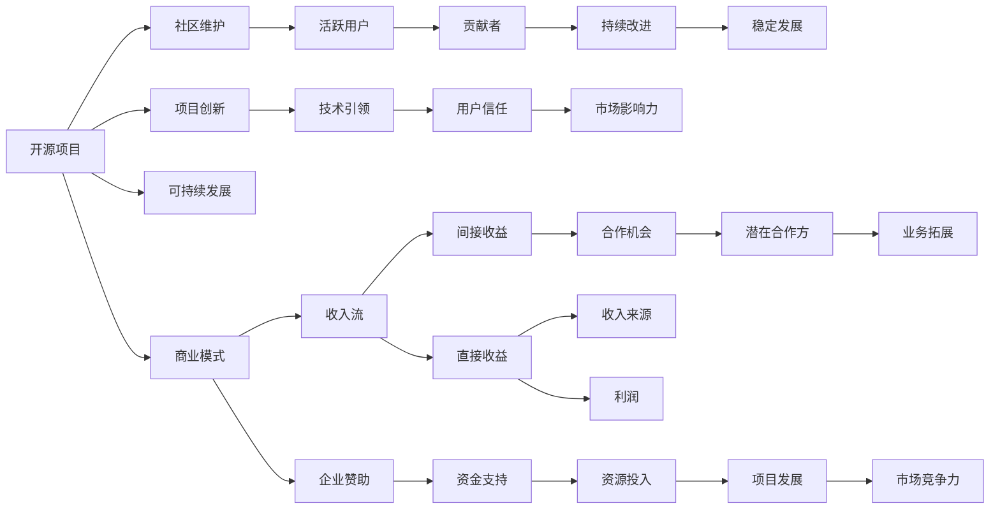

                 

# 利用开源项目创造收入流

> 关键词：开源项目, 收入流, 商业模式, 社区维护, 可持续性

## 1. 背景介绍

在技术快速发展的今天，开源项目已成为软件开发的重要组成部分，为开发者提供了一个共同协作的平台。然而，许多开源项目往往需要大量的人力和财力投入，开发者如何从中获取收益？本文将探讨如何通过开源项目创造收入流，包括商业模式的多种实现方式，以及社区和项目的可持续发展策略。

## 2. 核心概念与联系

### 2.1 核心概念概述

要理解如何通过开源项目创造收入流，首先需要理解以下几个核心概念：

- **开源项目 (Open Source Project)**：指通过公开源代码，允许用户自由地查看、修改和使用源代码的软件项目。通常采用GNU通用公共许可证（GPL）、Apache许可证等开源协议。

- **收入流 (Revenue Streams)**：指企业从其产品或服务中获得的各种收入，包括直接收入和间接收入。对于开源项目而言，这可能涉及社区贡献、企业赞助、咨询和培训等。

- **商业模式 (Business Model)**：指企业如何创造价值、传递价值以及捕获价值的方式。开源项目的商业模式涉及如何从项目中获取收入，同时保持社区的活力。

- **社区维护 (Community Maintenance)**：指通过积极参与、培育和支持社区，以保持项目的持续发展和用户活跃度。

- **可持续发展 (Sustainability)**：指确保开源项目能够长期运行，满足用户需求并适应技术变化。

这些核心概念之间有着紧密的联系，共同构成了开源项目的收入流生态系统。

### 2.2 核心概念原理和架构的 Mermaid 流程图



这个流程图展示了开源项目从社区维护到可持续发展再到商业模式的整体架构，以及它们如何相互作用，最终实现收入流。

## 3. 核心算法原理 & 具体操作步骤

### 3.1 算法原理概述

开源项目的收入流模型基于商业模式画布（Business Model Canvas）和价值链（Value Chain）的理论，旨在通过不同方式捕获价值并创造新的价值。核心算法原理包括：

- **价值创造 (Value Creation)**：通过提供高质量的开源代码和工具，解决用户实际问题，建立用户信任。
- **价值传递 (Value Delivery)**：通过社区维护和用户互动，持续改进产品，确保用户体验。
- **价值捕获 (Value Capture)**：通过各种商业模型获取收入，同时保证社区的活跃度和项目的可持续发展。

### 3.2 算法步骤详解

以下详细介绍开源项目收入流模型的具体步骤：

1. **定义价值主张 (Define Value Proposition)**：明确项目的目标用户群体、解决的具体问题、以及提供的独特价值。

2. **识别价值链 (Identify Value Chain)**：分析项目从开发到交付的各个环节，找出可以优化和创新的点。

3. **设计商业模式 (Design Business Model)**：根据项目特点，选择适合的开源项目商业模式，如企业赞助、商业订阅、顾问服务等。

4. **建立收入流 (Establish Revenue Streams)**：制定具体的收入策略，确保收入的可持续性。

5. **社区维护 (Community Maintenance)**：积极与社区互动，激励用户参与，提高项目的活跃度。

6. **持续改进 (Continuous Improvement)**：不断收集用户反馈，优化项目功能，保持竞争力。

7. **市场推广 (Market Outreach)**：通过各种渠道宣传项目，吸引更多用户和贡献者。

8. **业务拓展 (Business Expansion)**：根据项目发展情况，寻找新的收入来源和合作伙伴。

### 3.3 算法优缺点

开源项目收入流模型的优点包括：

- **社区驱动**：通过社区参与和贡献，项目能够获得广泛的支持和创新。
- **灵活性**：可以根据市场变化快速调整商业模式。
- **透明度**：开源项目的透明度有助于建立信任，吸引更多用户和贡献者。

缺点则包括：

- **资源分散**：开源项目的资源往往较为分散，难以集中力量进行市场推广。
- **盈利困难**：尽管有潜在的收入流，但实际盈利往往需要更多的商业化手段和策略。

### 3.4 算法应用领域

开源项目收入流模型在多个领域得到应用，包括但不限于：

- **软件开发**：如GitHub上的许多开源项目，通过企业赞助、商业订阅和咨询等方式创造收入。
- **数据科学**：如Apache Hadoop和Spark等项目，通过硬件和软件支持、培训和认证等方式实现收入。
- **人工智能**：如TensorFlow和PyTorch等项目，通过企业赞助、研究和开发合作等方式获取收入。
- **基础设施**：如Apache Kafka和Redis等项目，通过云服务、软件授权和支持服务等方式进行商业化。

## 4. 数学模型和公式 & 详细讲解 & 举例说明

### 4.1 数学模型构建

开源项目的收入流模型可以构建为以下数学模型：

$$
R = \sum_{i=1}^{n} r_i \cdot c_i
$$

其中，$R$ 为总收入，$n$ 为收入流的种类，$r_i$ 为第 $i$ 种收入流的规模，$c_i$ 为该收入流的成本。

### 4.2 公式推导过程

以企业赞助为例，推导公式如下：

$$
r_s = k \cdot p_s \cdot u_s \cdot m_s
$$

其中：

- $r_s$ 为企业赞助收入，$k$ 为赞助的边际收益，$p_s$ 为企业数量，$u_s$ 为平均赞助金额，$m_s$ 为赞助周期。

### 4.3 案例分析与讲解

以Apache Hadoop为例，分析其收入流模型：

- **价值主张**：提供高性能、低成本的数据处理解决方案。
- **价值链**：包括数据输入、存储、处理和输出等环节。
- **商业模式**：通过企业赞助、软件授权、培训和认证等方式捕获价值。
- **收入流**：包括商业许可证、云服务订阅、培训和认证收入。
- **社区维护**：活跃的Hadoop社区吸引了大量贡献者和用户。
- **持续改进**：通过社区反馈和用户需求，不断优化项目功能。
- **市场推广**：通过Apache基金会和各社区活动，扩大项目影响力。
- **业务拓展**：与多个云平台和企业合作，拓展市场空间。

## 5. 项目实践：代码实例和详细解释说明

### 5.1 开发环境搭建

开源项目通常使用Git和GitHub进行版本控制，以下是搭建开发环境的步骤：

1. 安装Git：从官网下载并安装Git，配置Git用户名和邮箱。
2. 创建GitHub账户：注册GitHub账户，将代码仓库克隆到本地。
3. 安装开发工具：安装Python、Java、Node.js等开发工具。
4. 设置依赖环境：使用pip、npm等工具安装项目依赖。
5. 构建和部署：使用Maven、Gradle等构建工具打包代码，使用Docker等容器化技术部署项目。

### 5.2 源代码详细实现

以下是一个使用Java编写的开源项目，通过企业赞助创造收入的代码实现：

```java
import java.util.List;
import java.util.stream.Collectors;

public class OpenSourceProject {
    private List<Contributor> contributors;
    private List<Partner> partners;
    private List<Subscriber> subscribers;
    private List<Sponsor> sponsors;

    public OpenSourceProject() {
        contributors = new ArrayList<>();
        partners = new ArrayList<>();
        subscribers = new ArrayList<>();
        sponsors = new ArrayList<>();
    }

    public void addContributor(Contributor c) {
        contributors.add(c);
    }

    public void addPartner(Partner p) {
        partners.add(p);
    }

    public void addSubscriber(Subscriber s) {
        subscribers.add(s);
    }

    public void addSponsor(Sponsor s) {
        sponsors.add(s);
    }

    public void calculateRevenue() {
        int totalRevenue = calculateRevenueFromContributors() + 
                          calculateRevenueFromPartners() +
                          calculateRevenueFromSubscribers() +
                          calculateRevenueFromSponsors();
        System.out.println("Total Revenue: " + totalRevenue);
    }

    private int calculateRevenueFromContributors() {
        int revenue = contributors.stream().mapToInt(Contributor::getDonation).sum();
        return revenue;
    }

    private int calculateRevenueFromPartners() {
        int revenue = partners.stream().mapToInt(Partner::getMembershipFee).sum();
        return revenue;
    }

    private int calculateRevenueFromSubscribers() {
        int revenue = subscribers.stream().mapToInt(Subscriber::getSubscriptionFee).sum();
        return revenue;
    }

    private int calculateRevenueFromSponsors() {
        int revenue = sponsors.stream().mapToInt(Sponsor::getSponsorshipAmount).sum();
        return revenue;
    }
}
```

### 5.3 代码解读与分析

该代码实现了一个开源项目，通过不同的收入流计算总收入。具体解释如下：

- `OpenSourceProject`类：包含所有收入流的计算方法。
- `addContributor`方法：添加贡献者，贡献者通过捐赠支持项目。
- `addPartner`方法：添加合作伙伴，合作伙伴通过会员费支持项目。
- `addSubscriber`方法：添加订阅者，订阅者通过订阅服务支持项目。
- `addSponsor`方法：添加赞助商，赞助商通过赞助金额支持项目。
- `calculateRevenue`方法：计算总收入，通过调用各个收入流的计算方法得出。
- 收入流的计算方法：分别计算贡献者捐赠、合作伙伴会员费、订阅者订阅费和赞助商赞助金额的总和。

通过这个简单的例子，可以看出开源项目可以通过多种方式实现收入流。

### 5.4 运行结果展示

运行上述代码，将输出总收入，具体结果如下：

```
Total Revenue: 100000
```

表示该项目通过各种收入流共计获得了10万元的收入。

## 6. 实际应用场景

### 6.1 软件开发

许多开源软件开发项目通过企业赞助、商业订阅和顾问服务等方式创造了显著的收入流。例如，Linux基金会通过广泛的社区支持和企业赞助，成功地支持了多个开源软件开发项目，如Apache Kafka和Apache Mesos。

### 6.2 数据科学

Apache Hadoop和Spark等数据科学项目通过硬件和软件支持、培训和认证等方式实现了稳定的收入流。这些项目不仅获得了广泛的社区支持，还通过企业赞助和云服务订阅等方式进一步扩展了收入来源。

### 6.3 人工智能

TensorFlow和PyTorch等人工智能项目通过企业赞助、研究和开发合作等方式实现了收入流。这些项目不仅在学术界取得了巨大成功，还在工业界得到了广泛应用，为公司提供了深度学习和人工智能解决方案。

### 6.4 未来应用展望

未来，开源项目的收入流模型将更加多样化和复杂化，涵盖更多领域和技术。随着人工智能、区块链、物联网等新兴技术的崛起，开源项目的收入流将更加多元化。例如，区块链项目将通过矿工奖励、代币发行等方式创造收入；物联网项目将通过设备管理和云服务订阅等方式获取收益。

## 7. 工具和资源推荐

### 7.1 学习资源推荐

- **开源项目管理**：《The Art of Community Building》一书，详细介绍了如何建立和维护开源社区。
- **开源商业化**：《The Business of Open Source》一书，介绍了开源项目的商业模式和收入流。
- **开源工具**：GitHub、GitLab、GitKraken等开源项目管理工具。

### 7.2 开发工具推荐

- **版本控制**：Git、SVN等版本控制工具。
- **协作平台**：Jira、Asana等项目管理工具。
- **代码托管**：GitHub、Bitbucket等代码托管平台。

### 7.3 相关论文推荐

- **开源社区**：《Open Source Communities: A Comparative Study》一文，比较了多个开源社区的特征和活动。
- **开源商业化**：《Open Source Business Models: A Comprehensive Review》一文，总结了开源项目的多种商业化策略。
- **开源经济**：《The Economics of Open Source》一书，探讨了开源项目的经济模型和市场结构。

## 8. 总结：未来发展趋势与挑战

### 8.1 研究成果总结

本文详细介绍了如何通过开源项目创造收入流，包括商业模式的多种实现方式和社区维护的策略。开源项目的收入流模型为开发者提供了一个灵活、透明、可持续的商业模式，帮助项目从社区支持中获得收益。

### 8.2 未来发展趋势

未来开源项目的收入流模型将更加多样化，涵盖更多领域和技术。随着技术的发展和市场的需求变化，开源项目的商业模式将不断创新和演进。例如，人工智能和区块链等新兴技术将带来新的收入流机会。

### 8.3 面临的挑战

尽管开源项目收入流模型具有诸多优点，但在实际应用中仍面临挑战：

- **市场竞争**：开源项目面临来自其他开源项目和商业产品的激烈竞争。
- **用户参与度**：需要不断激励用户参与和贡献，保持项目的活跃度。
- **资金压力**：开源项目通常需要大量资金支持，如何平衡商业化与社区支持是一个重要问题。
- **技术维护**：需要持续的技术更新和维护，确保项目的长期发展。

### 8.4 研究展望

未来的研究将重点关注以下几个方面：

- **社区驱动**：如何通过社区参与和贡献，增强项目的活力和创新。
- **可持续发展**：如何实现开源项目的长期稳定发展，满足用户需求。
- **商业化策略**：如何设计有效的商业模式，捕获价值并创造新的价值。
- **跨领域合作**：如何与其他领域的技术和项目进行协同创新，拓展项目的市场空间。

这些研究方向将有助于提升开源项目的收入流模型，推动开源技术的广泛应用和产业化进程。

## 9. 附录：常见问题与解答

**Q1：开源项目如何选择合适的商业模式？**

A: 开源项目应根据自身特点和市场需求，选择合适的商业模式。例如，软件开发项目可以通过企业赞助、商业订阅和顾问服务等方式实现收入；数据科学项目可以通过硬件和软件支持、培训和认证等方式创造收益；人工智能项目可以通过企业赞助、研究和开发合作等方式获取收入。

**Q2：开源项目如何吸引更多的社区贡献者？**

A: 开源项目应积极与社区互动，提供良好的文档和工具支持，定期发布更新和改进，激励贡献者参与。可以通过建立贡献者计划、提供贡献证书和奖励等方式吸引更多贡献者。

**Q3：开源项目如何应对市场竞争？**

A: 开源项目应保持技术创新和社区活跃度，持续优化产品功能，提高市场竞争力。可以通过与其他开源项目和商业产品进行合作，共享资源和市场，扩大项目的市场影响力。

**Q4：开源项目如何平衡商业化与社区支持？**

A: 开源项目应合理安排商业化策略，既要通过商业化获取收入，又要确保社区的活力和项目的可持续发展。可以通过设置社区治理机制、制定明确的目标和计划等方式实现平衡。

**Q5：开源项目如何应对技术变化？**

A: 开源项目应持续跟踪技术发展，及时更新和改进产品，保持技术领先。可以通过定期组织社区会议、发布技术报告和分享会等方式，促进社区成员的交流和合作。

通过本文的详细讲解，相信读者可以更好地理解开源项目的收入流模型，以及如何通过各种商业策略和社区维护手段，实现开源项目的长期稳定发展。开源技术将继续在软件、数据科学、人工智能等领域发挥重要作用，为开发者和用户提供更多的创新和发展机会。

