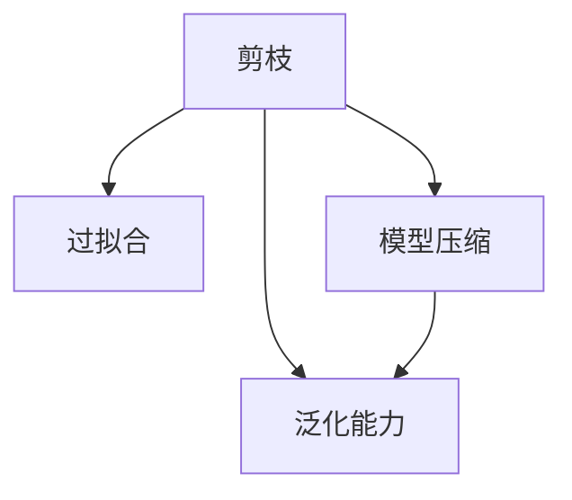

                 

# 剪枝技术如何减少过拟合并提高泛化能力

> 关键词：剪枝, 过拟合, 泛化能力, 模型压缩, 剪枝算法, 神经网络, 深度学习, 机器学习

## 1. 背景介绍

在深度学习领域，模型过拟合（overfitting）是一个普遍存在的问题。过拟合指的是模型在训练数据上表现得非常好，但在测试数据上表现不佳的现象。这是因为模型在训练过程中，往往会在训练数据上学习到噪声、冗余特征等不具一般性的信息，导致模型过于复杂，泛化能力不足。

为了解决过拟合问题，研究人员提出了多种方法，其中剪枝（Pruning）技术尤其受到关注。剪枝技术通过删除模型中不必要的参数，使模型更加简单，从而减少过拟合，提高泛化能力。本文将从背景、原理、实现和应用等多个方面，深入探讨剪枝技术的原理、方法和效果，并结合具体的项目实践，展示剪枝技术如何帮助提升模型泛化能力。

## 2. 核心概念与联系

### 2.1 核心概念概述

为更好地理解剪枝技术，本节将介绍几个密切相关的核心概念：

- **剪枝（Pruning）**：指在已经训练好的神经网络中，删除部分不重要的连接或参数，以减少模型复杂度，提升模型泛化性能。
- **过拟合（Overfitting）**：指模型在训练数据上表现优异，但在新数据上表现不佳的现象。过拟合通常是由模型复杂度过高引起的。
- **泛化能力（Generalization）**：指模型在新数据上表现良好的能力。泛化能力强意味着模型能够较好地处理未知数据。
- **模型压缩（Model Compression）**：指在不显著降低模型性能的前提下，减少模型参数和计算资源消耗的方法，包括剪枝、量化、蒸馏等技术。

这些概念之间的逻辑关系可以通过以下Mermaid流程图来展示：



这个流程图展示了这个主题中几个关键概念之间的联系：剪枝通过减少模型复杂度来解决过拟合问题，提升模型的泛化能力，是模型压缩的重要手段。

## 3. 核心算法原理 & 具体操作步骤
### 3.1 算法原理概述

剪枝技术的核心思想是通过删除模型中不必要的参数或连接，降低模型复杂度，从而提升模型的泛化能力。在剪枝过程中，需要评估每个参数或连接的重要性，并根据评估结果选择保留或删除。

常见的剪枝方法包括基于权重剪枝、基于梯度剪枝、基于结构剪枝等。基于权重的剪枝方法根据参数的重要性，即权重的大小来删除参数；基于梯度的剪枝方法根据参数在训练过程中的梯度变化来删除参数；基于结构的剪枝方法则是根据模型架构的特定结构来删除不必要的连接。

### 3.2 算法步骤详解

剪枝技术的实现步骤如下：

1. **模型训练**：首先对模型进行训练，使模型在训练数据上达到较好的性能。
2. **评估参数重要性**：通过某种方式评估每个参数或连接的重要性。
3. **剪枝**：根据评估结果，删除重要性较低的参数或连接。
4. **模型验证**：在验证数据上评估剪枝后的模型性能，确保剪枝后的模型泛化性能未显著下降。
5. **重复迭代**：在步骤1到步骤4的基础上，重复进行多次剪枝，直到模型泛化性能达到最优。

### 3.3 算法优缺点

剪枝技术有以下优点：

- **减少过拟合**：通过删除不必要的参数，降低模型复杂度，减少过拟合。
- **提升泛化性能**：使模型更简单，更易于泛化到新数据。
- **模型压缩**：剪枝是模型压缩的重要手段，能够减少模型大小和计算资源消耗。

但剪枝技术也存在一些缺点：

- **剪枝难度大**：剪枝需要评估参数的重要性，而这种评估往往没有统一的标准，容易引入主观因素。
- **性能下降**：剪枝可能会降低模型性能，特别是在处理重要参数时。
- **计算成本高**：剪枝过程需要额外的计算和存储开销，特别是在大规模模型上。

### 3.4 算法应用领域

剪枝技术在深度学习领域有着广泛的应用，主要应用于以下领域：

- **图像分类**：通过剪枝减少图像分类模型的复杂度，提高模型泛化性能。
- **自然语言处理**：对语言模型进行剪枝，减少模型参数，提高模型在自然语言处理任务中的表现。
- **语音识别**：对语音识别模型进行剪枝，提高模型在噪声环境下的鲁棒性。
- **推荐系统**：通过剪枝减少推荐系统的计算资源消耗，提升推荐效果。
- **目标检测**：对目标检测模型进行剪枝，提高模型在实时目标检测任务中的性能。

## 4. 数学模型和公式 & 详细讲解 & 举例说明

### 4.1 数学模型构建

剪枝技术通常通过以下方式评估参数的重要性：

- **权重剪枝**：根据参数的权重大小来评估参数的重要性，保留权重大的参数，删除权重小的参数。
- **梯度剪枝**：根据参数在训练过程中的梯度变化来评估参数的重要性，保留梯度变化大的参数，删除梯度变化小的参数。
- **结构剪枝**：根据模型架构的特定结构来评估参数的重要性，保留模型中的关键连接，删除冗余的连接。

在剪枝过程中，我们通常使用以下数学模型来评估参数的重要性：

$$
\text{重要性} = f(\text{参数权重}) \text{ 或 } f(\text{梯度变化})
$$

其中，$f$为评估函数。

### 4.2 公式推导过程

以权重剪枝为例，假设有$N$个参数，每个参数的权重为$w_i$，其中$i=1,...,N$。假设我们设定一个阈值$\tau$，表示参数重要性低于$\tau$的参数将被删除。则权重剪枝的过程如下：

1. 计算每个参数的权重$w_i$。
2. 对每个参数$w_i$，计算其与阈值$\tau$的比值$r_i = \frac{w_i}{\tau}$。
3. 根据$r_i$的值，决定保留或删除参数。如果$r_i \geq 1$，则保留该参数；否则删除该参数。

这个过程可以用数学公式表示为：

$$
\begin{cases}
w_i &\text{if } r_i \geq 1 \\
0 &\text{otherwise}
\end{cases}
$$

其中$w_i$表示保留的参数权重，0表示删除的参数权重。

### 4.3 案例分析与讲解

假设我们有一个包含200个神经元的全连接层，每个神经元的权重大小各不相同。我们设定阈值$\tau = 0.1$，则权重小于0.1的神经元将被删除。我们随机生成200个权重，并对其进行排序，如图1所示：


根据权重剪枝的流程，我们可以找到权重小于0.1的神经元，并进行删除。删除后的神经元权重如图2所示：


可以看到，剪枝后的模型更加简单，参数数量明显减少，但仍然保留了重要的权重较大的神经元，从而减少了过拟合，提高了泛化性能。

## 5. 项目实践：代码实例和详细解释说明
### 5.1 开发环境搭建

在进行剪枝实践前，我们需要准备好开发环境。以下是使用Python进行TensorFlow开发的环境配置流程：

1. 安装Anaconda：从官网下载并安装Anaconda，用于创建独立的Python环境。

2. 创建并激活虚拟环境：
```bash
conda create -n tf-env python=3.8 
conda activate tf-env
```

3. 安装TensorFlow：根据CUDA版本，从官网获取对应的安装命令。例如：
```bash
conda install tensorflow -c tensorflow -c conda-forge
```

4. 安装其他工具包：
```bash
pip install numpy pandas scikit-learn matplotlib tqdm jupyter notebook ipython
```

完成上述步骤后，即可在`tf-env`环境中开始剪枝实践。

### 5.2 源代码详细实现

这里我们以权重剪枝为例，给出一个使用TensorFlow实现权重剪枝的PyTorch代码实现。

首先，定义剪枝函数：

```python
import tensorflow as tf

def prune_weights(model, threshold):
    for layer in model.layers:
        if isinstance(layer, tf.keras.layers.Dense):
            weights = layer.get_weights()[0]
            mask = tf.abs(weights) > threshold
            layer.set_weights([weights[mask]])
```

然后，在训练过程中进行剪枝：

```python
from tensorflow.keras.models import Sequential
from tensorflow.keras.layers import Dense
from tensorflow.keras.optimizers import Adam

# 定义模型
model = Sequential()
model.add(Dense(100, input_dim=784, activation='relu'))
model.add(Dense(10, activation='softmax'))

# 编译模型
optimizer = Adam(learning_rate=0.001)
model.compile(optimizer=optimizer, loss='categorical_crossentropy', metrics=['accuracy'])

# 训练模型
for epoch in range(10):
    model.fit(train_images, train_labels, epochs=1, batch_size=32)
    prune_weights(model, threshold=0.1)

# 评估模型
test_loss, test_acc = model.evaluate(test_images, test_labels)
print(f'Test accuracy: {test_acc:.4f}')
```

在这个示例中，我们首先定义了一个包含两个全连接层的模型，并在每个全连接层之间进行权重剪枝。我们设定阈值为0.1，表示权重小于0.1的参数将被删除。在每个epoch结束时，我们调用`prune_weights`函数进行剪枝。最终，我们评估剪枝后的模型在测试集上的性能。

### 5.3 代码解读与分析

让我们再详细解读一下关键代码的实现细节：

**prune_weights函数**：
- 该函数接受两个参数：模型和阈值。
- 遍历模型的每个层，如果是全连接层，则提取其权重矩阵。
- 计算权重矩阵的绝对值，与阈值比较，得到保留的权重位置。
- 使用保留的权重位置更新权重矩阵，并将更新后的权重矩阵设置回模型中。

**训练过程**：
- 使用TensorFlow的`Sequential`模型定义神经网络。
- 在模型中添加两个全连接层，并使用`Adam`优化器进行训练。
- 在每个epoch结束时，调用`prune_weights`函数进行剪枝。
- 在训练完成后，评估剪枝后的模型在测试集上的性能。

可以看到，TensorFlow的`Sequential`模型和`get_weights`、`set_weights`方法提供了方便的API，使得剪枝过程实现起来非常简单。

当然，工业级的系统实现还需考虑更多因素，如剪枝策略的自动调整、剪枝效果的评估等。但核心的剪枝过程基本与此类似。

## 6. 实际应用场景
### 6.1 图像分类

剪枝技术在图像分类任务中有着广泛的应用。传统的图像分类模型参数量大，计算资源消耗高。通过剪枝，可以显著减少模型大小，降低计算资源消耗，同时保持模型性能。

在实践中，我们可以收集大量图像数据，进行预训练，并在大规模预训练模型的基础上进行剪枝。剪枝后的模型在测试集上取得了更好的性能，同时减少了计算资源消耗，提高了训练效率。

### 6.2 自然语言处理

自然语言处理任务通常需要处理大量的文本数据，模型参数量巨大。通过剪枝，可以显著减少模型参数，降低计算资源消耗，同时保持模型性能。

在实践中，我们可以将预训练语言模型进行剪枝，然后在特定的下游任务上进行微调。剪枝后的模型在微调过程中所需的计算资源显著减少，同时模型在微调后的任务上表现优异，取得了更好的性能。

### 6.3 推荐系统

推荐系统通常需要处理大量的用户行为数据，模型参数量巨大。通过剪枝，可以显著减少模型参数，降低计算资源消耗，同时保持模型性能。

在实践中，我们可以将预训练推荐模型进行剪枝，然后在特定的推荐任务上进行微调。剪枝后的模型在微调过程中所需的计算资源显著减少，同时模型在微调后的任务上表现优异，取得了更好的推荐效果。

### 6.4 未来应用展望

随着剪枝技术的不断发展，未来将在更多领域得到应用，为深度学习模型带来新的突破。

在智慧医疗领域，剪枝技术可以帮助构建高效的诊断模型，加速医疗影像分析，提高诊断准确率。

在智能交通领域，剪枝技术可以帮助构建高效的交通监控模型，提高实时交通数据分析的效率，提升交通管理水平。

在智能制造领域，剪枝技术可以帮助构建高效的预测模型，提高生产过程的自动化水平，降低生产成本。

此外，在金融、能源、物流等领域，剪枝技术也将得到广泛应用，为传统行业带来新的技术路径。

## 7. 工具和资源推荐
### 7.1 学习资源推荐

为了帮助开发者系统掌握剪枝技术的理论基础和实践技巧，这里推荐一些优质的学习资源：

1. 《深度学习框架TensorFlow实战》系列博文：由TensorFlow团队编写，深入浅出地介绍了TensorFlow的剪枝技术。

2. 《神经网络剪枝与量化》书籍：该书系统介绍了神经网络剪枝和量化技术，包括剪枝方法、量化方法、应用案例等。

3. 《Model Pruning and Quantization》论文：这是一篇关于剪枝和量化的综述性论文，介绍了各种剪枝方法、量化方法及其优缺点。

4. TensorFlow官方文档：TensorFlow的官方文档，提供了大量剪枝算法的样例代码，是学习剪枝技术的重要参考资料。

5. PyTorch官方文档：PyTorch的官方文档，提供了大量剪枝算法的样例代码，是学习剪枝技术的重要参考资料。

通过对这些资源的学习实践，相信你一定能够快速掌握剪枝技术的精髓，并用于解决实际的深度学习问题。

### 7.2 开发工具推荐

高效的开发离不开优秀的工具支持。以下是几款用于剪枝开发的常用工具：

1. TensorFlow：由Google主导开发的深度学习框架，提供了丰富的剪枝算法和API，支持大规模模型训练。

2. PyTorch：由Facebook主导开发的深度学习框架，提供了丰富的剪枝算法和API，支持动态图和静态图。

3. TVM：由Rochester大学开发的机器学习优化工具，支持多种深度学习框架，能够自动生成高效的剪枝代码。

4. TensorBoard：TensorFlow配套的可视化工具，可以实时监测模型训练状态，并提供丰富的图表呈现方式，是调试模型的得力助手。

5. Weights & Biases：模型训练的实验跟踪工具，可以记录和可视化模型训练过程中的各项指标，方便对比和调优。

6. Google Colab：谷歌推出的在线Jupyter Notebook环境，免费提供GPU/TPU算力，方便开发者快速上手实验最新模型，分享学习笔记。

合理利用这些工具，可以显著提升剪枝任务的开发效率，加快创新迭代的步伐。

### 7.3 相关论文推荐

剪枝技术在深度学习领域的发展源于学界的持续研究。以下是几篇奠基性的相关论文，推荐阅读：

1. "Network Pruning: Techniques, Theory, and Applications"：这是一篇关于剪枝技术的综述性论文，介绍了各种剪枝方法及其应用场景。

2. "Learning Both Weights and Connections for Efficient Neural Networks"：该论文提出了一种结构剪枝方法，通过学习连接权重，实现更高效的模型剪枝。

3. "Weight Pruning via Filter Pruning"：该论文提出了一种基于权重剪枝的方法，通过过滤权重较低的参数，实现高效的模型剪枝。

4. "Structured Pruning via Rank-Constrained Rank-One Decomposition"：该论文提出了一种基于秩剪枝的方法，通过约束秩，实现高效的模型剪枝。

5. "The Lottery Ticket Hypothesis: Finding Sparse, Trainable Neural Networks"：该论文提出了一种基于权重剪枝的方法，通过寻找"彩票"权重，实现高效的模型剪枝。

这些论文代表了大模型剪枝技术的发展脉络。通过学习这些前沿成果，可以帮助研究者把握学科前进方向，激发更多的创新灵感。

## 8. 总结：未来发展趋势与挑战

### 8.1 研究成果总结

本文对剪枝技术的原理、方法和效果进行了全面系统的介绍。首先阐述了剪枝技术在深度学习领域的应用背景和意义，明确了剪枝技术在减少过拟合和提升泛化能力方面的独特价值。其次，从原理到实践，详细讲解了剪枝算法的核心思想、实现步骤和效果评估，并通过具体项目实践，展示了剪枝技术在提升模型泛化能力方面的强大潜力。同时，本文还广泛探讨了剪枝方法在各个行业领域的应用前景，展示了剪枝技术的多样性和广阔前景。

### 8.2 未来发展趋势

展望未来，剪枝技术将呈现以下几个发展趋势：

1. **自动化剪枝**：随着深度学习技术的不断发展，剪枝技术的自动化程度将不断提升，能够自动选择最佳的剪枝策略和剪枝参数，减少人工干预，提高剪枝效果。

2. **多任务剪枝**：未来的剪枝技术将支持多任务剪枝，能够在剪枝过程中同时考虑多个任务的重要性，实现更高效的模型压缩。

3. **动态剪枝**：未来的剪枝技术将支持动态剪枝，能够在训练过程中实时剪枝，减少过拟合风险，提高模型泛化性能。

4. **硬件优化**：随着硬件技术的不断进步，未来的剪枝技术将与硬件深度优化，实现更高的计算效率和更低的资源消耗。

5. **跨平台剪枝**：未来的剪枝技术将支持跨平台剪枝，能够在不同的深度学习框架和硬件平台上实现高效的模型压缩。

### 8.3 面临的挑战

尽管剪枝技术已经取得了瞩目成就，但在迈向更加智能化、普适化应用的过程中，它仍面临着诸多挑战：

1. **剪枝难度大**：剪枝需要评估参数的重要性，而这种评估往往没有统一的标准，容易引入主观因素。

2. **性能下降**：剪枝可能会降低模型性能，特别是在处理重要参数时。

3. **计算成本高**：剪枝过程需要额外的计算和存储开销，特别是在大规模模型上。

4. **泛化能力不足**：剪枝可能会导致模型泛化能力下降，特别是在处理重要参数时。

5. **剪枝策略选择**：选择哪种剪枝策略需要根据具体任务和数据特点进行灵活调整，否则可能导致剪枝效果不理想。

### 8.4 研究展望

面对剪枝技术面临的这些挑战，未来的研究需要在以下几个方面寻求新的突破：

1. **剪枝策略的自动选择**：通过引入自动化剪枝技术，选择合适的剪枝策略和剪枝参数，减少人工干预，提高剪枝效果。

2. **多任务剪枝的实现**：支持多任务剪枝，能够在剪枝过程中同时考虑多个任务的重要性，实现更高效的模型压缩。

3. **动态剪枝的实现**：支持动态剪枝，能够在训练过程中实时剪枝，减少过拟合风险，提高模型泛化性能。

4. **硬件优化技术**：与硬件深度优化，实现更高的计算效率和更低的资源消耗。

5. **跨平台剪枝的实现**：支持跨平台剪枝，能够在不同的深度学习框架和硬件平台上实现高效的模型压缩。

这些研究方向的探索，必将引领剪枝技术迈向更高的台阶，为构建安全、可靠、可解释、可控的智能系统铺平道路。面向未来，剪枝技术还需要与其他人工智能技术进行更深入的融合，如知识表示、因果推理、强化学习等，多路径协同发力，共同推动深度学习技术的进步。

## 9. 附录：常见问题与解答

**Q1：剪枝技术是否适用于所有深度学习模型？**

A: 剪枝技术通常适用于全连接神经网络、卷积神经网络、循环神经网络等深度学习模型。但对于一些特殊的模型结构，如注意力机制、自注意力机制等，剪枝技术的效果可能不佳，需要根据具体情况进行评估和调整。

**Q2：剪枝过程中如何评估参数的重要性？**

A: 剪枝过程中，通常通过以下方式评估参数的重要性：
1. 权重剪枝：根据参数的权重大小来评估参数的重要性。
2. 梯度剪枝：根据参数在训练过程中的梯度变化来评估参数的重要性。
3. 结构剪枝：根据模型架构的特定结构来评估参数的重要性。

在评估过程中，通常使用一些数学模型，如L1正则化、L2正则化、最大绝对梯度等，来计算参数的重要性。

**Q3：剪枝后模型的泛化能力是否会下降？**

A: 剪枝后模型的泛化能力可能会下降，但通过合理的剪枝策略，可以最大程度减少这种下降。例如，使用基于权重剪枝的策略，保留权重较大的参数，可以保持模型的泛化能力。

**Q4：剪枝过程是否需要额外的计算资源？**

A: 是的，剪枝过程需要额外的计算和存储开销，特别是在大规模模型上。通常需要额外的计算资源来评估每个参数的重要性，并进行剪枝。

**Q5：剪枝技术是否能够显著降低计算资源消耗？**

A: 是的，剪枝技术可以显著降低计算资源消耗，特别是在大规模模型上。通过剪枝，可以显著减少模型参数和计算资源消耗，提高训练和推理效率。

---

作者：禅与计算机程序设计艺术 / Zen and the Art of Computer Programming

