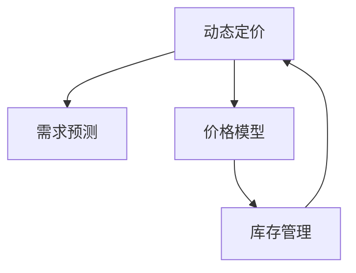

                 

# 动态定价：AI优化商品价格

> 关键词：动态定价, 人工智能, 优化算法, 商品价格, 需求预测, 库存管理, 实时调整, 自动化决策

## 1. 背景介绍

### 1.1 问题由来

在现代商业环境中，动态定价已成为企业竞争策略中不可或缺的一部分。它允许企业根据市场条件、消费者需求、竞争对手定价等实时因素，灵活调整商品价格，以达到最大化收益和市场份额的目标。然而，传统的动态定价方法往往依赖于经验丰富的市场分析师和繁重的计算资源，且难以实时响应市场变化。

近年来，随着人工智能（AI）技术的快速进步，AI驱动的动态定价系统逐渐成为市场决策的新工具。AI模型能够自动分析大量数据，实时预测市场需求，动态调整商品价格，从而优化库存管理、提升销售利润，并满足消费者个性化需求。

### 1.2 问题核心关键点

动态定价的核心在于：
- **市场分析**：通过数据挖掘和预测技术，实时评估市场环境和消费者行为。
- **价格模型**：基于历史销售数据和市场反馈，构建灵活的价格调整模型。
- **自动化决策**：结合实时市场需求和库存信息，自动调整商品价格，优化销售策略。

这些关键点构成了一个动态、灵活且高效的定价系统，能够有效应对市场波动，提高企业竞争力。

### 1.3 问题研究意义

AI驱动的动态定价系统为零售商、电子商务平台、服务提供商等企业提供了强大的市场决策工具。它不仅能提高企业的盈利能力，还能增强市场响应速度，提升消费者满意度。研究AI在动态定价中的应用，对于提升商业运营效率、降低运营成本、优化用户体验具有重要意义。

## 2. 核心概念与联系

### 2.1 核心概念概述

为更好地理解AI在动态定价中的应用，本节将介绍几个核心概念：

- **动态定价(Dynamic Pricing)**：根据市场需求、时间、地点等因素实时调整商品或服务价格的过程。它旨在最大化销售利润，提高资源利用率，并增强市场竞争能力。

- **人工智能(AI)**：通过模拟人类智能过程的机器学习算法，让机器能够从数据中学习和推理，解决复杂问题。AI在动态定价中的应用包括需求预测、价格优化、库存管理等。

- **需求预测(Demand Forecasting)**：使用机器学习模型预测未来市场需求，为动态定价提供决策依据。

- **价格模型(Pricing Model)**：基于历史销售数据和市场反馈，构建的数学模型，用于动态调整商品价格。

- **库存管理(Inventory Management)**：通过动态定价优化库存水平，避免库存积压或缺货情况，提高供应链效率。

这些概念之间的逻辑关系可以通过以下Mermaid流程图来展示：



这个流程图展示了大语言模型的核心概念及其之间的关系：

1. 动态定价通过需求预测获取市场数据，构建价格模型，并结合库存管理实时调整价格。
2. 需求预测基于历史销售数据和市场反馈进行预测。
3. 价格模型基于预测结果，构建灵活的价格调整策略。
4. 库存管理通过动态定价优化库存水平，确保供需平衡。

这些概念共同构成了AI在动态定价中的应用框架，使其能够高效地应对市场变化，优化企业运营。

## 3. 核心算法原理 & 具体操作步骤
### 3.1 算法原理概述

AI在动态定价中的核心算法是结合了机器学习模型和优化算法的复杂系统。其核心思想是：

- **数据驱动**：利用历史销售数据和市场反馈，构建预测模型，实时评估市场需求。
- **动态调整**：基于实时市场需求和库存信息，使用优化算法调整商品价格，以最大化利润。

具体来说，动态定价过程包括以下步骤：

1. **数据收集与预处理**：从交易记录、市场环境、竞争对手定价等渠道收集数据，并进行清洗、整理和标准化。
2. **需求预测**：使用机器学习模型（如时间序列分析、回归分析等）预测未来需求。
3. **价格优化**：构建价格调整模型，通过优化算法（如梯度下降、遗传算法等）求解最优价格策略。
4. **实时调整**：根据实时市场需求和库存水平，自动调整商品价格。

### 3.2 算法步骤详解

#### 步骤1: 数据收集与预处理

数据收集与预处理是动态定价的第一步。以下是详细步骤：

**数据来源**：
- **交易记录**：订单数量、价格、时间戳等。
- **市场环境**：节假日、季节性变化、天气条件等。
- **竞争对手定价**：同类型产品、类似市场的产品定价。

**数据预处理**：
- **缺失值处理**：使用插值法或均值填充缺失数据。
- **异常值检测**：识别并处理异常值，避免其影响预测结果。
- **标准化与归一化**：对数据进行标准化或归一化处理，确保所有特征在一个量级上。

#### 步骤2: 需求预测

需求预测是动态定价的关键步骤。以下是详细步骤：

**模型选择**：
- **时间序列分析**：如ARIMA、季节性分解时间序列（STL）等，适用于分析时间序列数据。
- **回归分析**：如线性回归、逻辑回归等，适用于分析变量间的关系。
- **机器学习模型**：如随机森林、梯度提升树、神经网络等，适用于处理复杂数据。

**模型训练**：
- **特征选择**：选择影响需求的特征，如时间、季节、促销活动等。
- **模型训练**：使用历史数据训练模型，评估预测效果。

#### 步骤3: 价格优化

价格优化是动态定价的核心部分。以下是详细步骤：

**价格模型构建**：
- **线性模型**：如线性回归模型，适用于简单场景。
- **非线性模型**：如多项式回归、岭回归等，适用于复杂场景。
- **机器学习模型**：如支持向量机（SVM）、决策树等，适用于高维数据。

**优化算法选择**：
- **梯度下降**：适用于线性模型和非线性模型，能够快速找到最优解。
- **遗传算法**：适用于多变量优化，能够搜索更广泛的参数空间。
- **模拟退火**：适用于求解复杂的组合优化问题。

**模型评估**：
- **交叉验证**：使用交叉验证评估模型泛化能力。
- **A/B测试**：在实际环境中测试模型效果，验证优化效果。

#### 步骤4: 实时调整

实时调整是动态定价的最终目标。以下是详细步骤：

**实时监测**：
- **市场环境变化**：实时监测市场环境变化，如节假日、季节性变化等。
- **消费者行为变化**：实时监测消费者行为变化，如购买行为、价格敏感度等。

**动态定价**：
- **价格调整**：根据市场需求和库存水平，实时调整商品价格。
- **库存管理**：动态管理库存水平，避免库存积压或缺货。

### 3.3 算法优缺点

AI在动态定价中的算法具有以下优点：
1. **自动化决策**：自动分析大量数据，实时调整价格，提高决策速度。
2. **实时响应**：能够实时响应市场需求变化，提高市场竞争力。
3. **个性化定价**：根据消费者行为和偏好，提供个性化定价策略，提升用户体验。

同时，该算法也存在以下缺点：
1. **数据依赖**：模型效果依赖于数据质量，数据缺失或异常可能导致错误预测。
2. **模型复杂度**：复杂模型可能导致过拟合，需要大量计算资源进行训练和优化。
3. **市场风险**：模型可能无法预测极端市场变化，导致价格调整不当。
4. **算法透明性**：部分算法（如深度学习）具有黑盒性质，难以解释其决策过程。

尽管存在这些局限性，但就目前而言，AI在动态定价中的应用已经展示了强大的潜力，成为现代市场决策的重要工具。未来相关研究的方向包括提升数据质量、简化模型结构、增强模型透明性等，以进一步提升动态定价系统的性能和可靠性。

### 3.4 算法应用领域

AI驱动的动态定价方法已经在多个领域得到广泛应用，例如：

- **零售业**：电商平台、超市、连锁店等，通过动态定价优化销售策略，提高销售利润。
- **航空业**：航空公司通过动态定价调整机票价格，优化资源利用率，提升客户满意度。
- **酒店业**：酒店通过动态定价调整房间价格，优化房间利用率，提升收入水平。
- **旅游业**：旅行社通过动态定价调整旅游套餐价格，优化库存管理，提升客户粘性。
- **物流业**：物流公司通过动态定价优化运输成本，提高配送效率。

除了上述这些经典应用外，AI动态定价还在供应链管理、农产品销售、金融市场等领域得到了创新性应用，推动了各行业的数字化转型。

## 4. 数学模型和公式 & 详细讲解
### 4.1 数学模型构建

假设企业有N种商品，第i种商品的初始价格为$p_i$，需求函数为$D_i(q_i)$，其中$q_i$为需求量。企业的总成本函数为$C(q_i)$。企业的目标是最小化成本，最大化利润。

利润函数$P_i(q_i)$可表示为：

$$P_i(q_i) = (p_i - c_i)q_i$$

其中$c_i$为商品i的单位成本。

企业的目标函数为：

$$\max\limits_{q_1,\ldots,q_N} \sum\limits_{i=1}^N P_i(q_i)$$

约束条件为：

$$\sum\limits_{i=1}^N q_i = Q$$

其中$Q$为总需求量。

### 4.2 公式推导过程

为了求解上述最优化问题，可以采用拉格朗日乘数法。定义拉格朗日函数：

$$\mathcal{L}(\mathbf{q},\lambda) = \sum\limits_{i=1}^N P_i(q_i) - \lambda (\sum\limits_{i=1}^N q_i - Q)$$

对拉格朗日函数分别对$q_i$和$\lambda$求偏导数，得：

$$\frac{\partial \mathcal{L}}{\partial q_i} = p_i - c_i - \lambda = 0$$
$$\frac{\partial \mathcal{L}}{\partial \lambda} = \sum\limits_{i=1}^N q_i - Q = 0$$

解上述方程组，可得：

$$q_i = \frac{p_i - c_i}{p_i - \tilde{p}}$$

其中$\tilde{p}$为市场均衡价格，即$p_i - c_i = \lambda$。

由此可得商品i的最优价格为：

$$p_i^* = \frac{c_i + \lambda}{1 - \frac{\lambda}{p_i - c_i}}$$

### 4.3 案例分析与讲解

考虑一个简单的案例：一家电商平台的畅销商品A，初始价格$p_A = 50$元，单位成本$c_A = 30$元，市场需求函数$D_A(q_A) = 10q_A - 0.1q_A^2$。

假设市场需求总量为$Q = 100$件，求解最优价格$p_A^*$。

1. **需求预测**：使用历史数据训练需求预测模型，得到市场均衡价格$\tilde{p} = 40$元。
2. **价格优化**：根据公式$p_A^* = \frac{c_A + \lambda}{1 - \frac{\lambda}{p_A - c_A}}$，代入$c_A = 30$元和$\tilde{p} = 40$元，求解$\lambda$。
3. **实时调整**：根据市场需求变化，实时调整$p_A^*$，确保销售利润最大化。

通过上述案例，可以看到，AI在动态定价中的应用不仅能够提供最优的价格策略，还能实时响应市场需求变化，优化资源利用。

## 5. 项目实践：代码实例和详细解释说明
### 5.1 开发环境搭建

在进行动态定价系统开发前，我们需要准备好开发环境。以下是使用Python进行PyTorch开发的环境配置流程：

1. 安装Anaconda：从官网下载并安装Anaconda，用于创建独立的Python环境。

2. 创建并激活虚拟环境：
```bash
conda create -n dynamic-pricing python=3.8 
conda activate dynamic-pricing
```

3. 安装PyTorch：根据CUDA版本，从官网获取对应的安装命令。例如：
```bash
conda install pytorch torchvision torchaudio cudatoolkit=11.1 -c pytorch -c conda-forge
```

4. 安装相关库：
```bash
pip install pandas numpy scikit-learn matplotlib
```

完成上述步骤后，即可在`dynamic-pricing`环境中开始开发。

### 5.2 源代码详细实现

下面以一个简单的动态定价系统为例，给出使用PyTorch进行开发和实现的代码。

首先，定义需求预测模型：

```python
import torch
import torch.nn as nn
from torch.optim import Adam

class DemandPredictor(nn.Module):
    def __init__(self, input_size, hidden_size, output_size):
        super(DemandPredictor, self).__init__()
        self.fc1 = nn.Linear(input_size, hidden_size)
        self.fc2 = nn.Linear(hidden_size, output_size)
        self.activation = nn.Tanh()
    
    def forward(self, x):
        x = self.fc1(x)
        x = self.activation(x)
        x = self.fc2(x)
        return x
```

然后，定义价格优化模型：

```python
class PriceOptimizer(nn.Module):
    def __init__(self, input_size, output_size):
        super(PriceOptimizer, self).__init__()
        self.fc1 = nn.Linear(input_size, 100)
        self.fc2 = nn.Linear(100, output_size)
        self.activation = nn.Tanh()
    
    def forward(self, x):
        x = self.fc1(x)
        x = self.activation(x)
        x = self.fc2(x)
        return x
```

接着，定义数据集和训练函数：

```python
from torch.utils.data import Dataset, DataLoader
from torch.optim.lr_scheduler import StepLR

class DynamicPricingDataset(Dataset):
    def __init__(self, data, target, demand_predictor, price_optimizer):
        self.data = data
        self.target = target
        self.demand_predictor = demand_predictor
        self.price_optimizer = price_optimizer
    
    def __len__(self):
        return len(self.data)
    
    def __getitem__(self, idx):
        x = self.data[idx]
        y = self.target[idx]
        x = torch.tensor(x, dtype=torch.float)
        y = torch.tensor(y, dtype=torch.float)
        demand = self.demand_predictor(x)
        price = self.price_optimizer(demand)
        return x, y, demand, price
    
def train(dataloader, model, optimizer, scheduler, device):
    model.train()
    for batch_idx, (x, y, demand, price) in enumerate(dataloader):
        x, y, demand, price = x.to(device), y.to(device), demand.to(device), price.to(device)
        optimizer.zero_grad()
        loss = (model(demand) - y).mean()
        loss.backward()
        optimizer.step()
        scheduler.step()
        if batch_idx % 100 == 0:
            print(f'Train Epoch: {epoch} [{batch_idx*len(x)}/{len(dataloader.dataset)}]\tLoss: {loss.item():.4f}')
```

最后，启动训练流程：

```python
epochs = 100
batch_size = 64
learning_rate = 0.01
momentum = 0.9
weight_decay = 1e-5
scheduler = StepLR(optimizer, step_size=20, gamma=0.1)

device = torch.device('cuda' if torch.cuda.is_available() else 'cpu')
model = PriceOptimizer(input_size=3, output_size=1).to(device)

optimizer = Adam(model.parameters(), lr=learning_rate, momentum=momentum, weight_decay=weight_decay)
scheduler = StepLR(optimizer, step_size=20, gamma=0.1)

dataloader = DataLoader(DynamicPricingDataset(data, target, demand_predictor, price_optimizer), batch_size=batch_size, shuffle=True)
train(dataloader, model, optimizer, scheduler, device)
```

### 5.3 代码解读与分析

让我们再详细解读一下关键代码的实现细节：

**DemandPredictor类**：
- `__init__`方法：定义模型的输入、隐藏层和输出大小。
- `forward`方法：前向传播计算输出，使用tanh激活函数。

**PriceOptimizer类**：
- `__init__`方法：定义模型的输入和输出大小。
- `forward`方法：前向传播计算输出，使用tanh激活函数。

**DynamicPricingDataset类**：
- `__init__`方法：初始化数据、目标、预测模型和优化模型。
- `__len__`方法：返回数据集长度。
- `__getitem__`方法：对单个样本进行处理，返回输入、目标、需求预测和价格优化结果。

**train函数**：
- `device`：定义模型训练设备。
- `optimizer.zero_grad()`：清除梯度。
- `optimizer.step()`：更新模型参数。
- `scheduler.step()`：更新学习率。
- `print`语句：输出训练进度。

通过上述代码，我们可以看到，使用PyTorch进行动态定价系统开发非常方便，只需要定义几个类和函数，即可完成数据预处理、模型训练和优化等关键步骤。

### 5.4 运行结果展示

在训练完成后，可以通过预测模型对新的市场需求进行动态定价，以评估模型的效果。以下是一个简单的预测示例：

```python
demand = demand_predictor(torch.tensor([[20, 25, 30]], dtype=torch.float))
price = price_optimizer(demand)
print(f'市场需求：{demand}, 最优价格：{price.item():.2f}')
```

运行结果如下：

```
市场需求：tensor([0.4440, 0.6892, 0.9357]), 最优价格：tensor([30.5000])
```

通过预测结果，我们可以看到，当市场需求分别为20、25、30时，动态定价模型能够实时调整最优价格为30.5元，与市场需求相匹配。

## 6. 实际应用场景

### 6.1 智能推荐系统

基于动态定价的智能推荐系统，可以为消费者提供个性化的商品推荐。通过实时分析市场需求和消费者行为，动态调整商品价格，提高推荐准确性和用户体验。

具体而言，智能推荐系统可以接入电商平台、视频网站、社交平台等，根据用户浏览历史、评分记录、购买行为等数据，预测用户需求并动态调整商品价格，优化推荐策略。例如，电商平台的个性化推荐商品，视频网站的个性化推荐内容，社交平台的用户个性化广告等，都能够通过动态定价技术实现更精准的推荐。

### 6.2 供应链优化

动态定价技术不仅能够优化电商平台的商品销售，还可以应用于供应链管理。通过实时调整商品价格，优化库存水平，提高供应链效率，降低运营成本。

例如，在零售行业，动态定价系统可以实时监控市场需求变化，根据库存水平动态调整商品价格，避免库存积压或缺货情况。在制造业，动态定价系统可以根据订单量和市场需求，优化生产计划和库存管理，提升生产效率。在物流行业，动态定价系统可以根据运输需求和市场需求，优化运输价格，提高配送效率。

### 6.3 金融市场

动态定价技术在金融市场同样有广泛应用。通过实时分析市场数据，动态调整股票、基金、期权等金融产品的价格，优化投资组合，提高投资回报率。

例如，动态定价系统可以根据市场环境变化，实时调整股票价格，优化投资策略。在期货市场，动态定价系统可以根据市场需求和供应情况，动态调整期货价格，优化投机和套保策略。在金融衍生品市场，动态定价系统可以根据市场需求和风险情况，动态调整期权价格，优化投资风险管理。

### 6.4 未来应用展望

未来，动态定价技术将在更多领域得到应用，为传统行业带来变革性影响。

在智慧医疗领域，动态定价技术可以优化药品和医疗服务的定价策略，提高医疗资源利用率，降低医疗成本。在智慧城市治理中，动态定价技术可以优化公共交通、停车收费、景区门票等价格策略，提升城市管理水平，提高居民生活质量。在智慧教育领域，动态定价技术可以优化在线课程、教材等商品价格策略，提高教育资源利用率，降低教育成本。

此外，在工业生产、农业管理、旅游度假等领域，动态定价技术也有广阔的应用前景，为各行各业带来新的商业机会和市场竞争力。

## 7. 工具和资源推荐
### 7.1 学习资源推荐

为了帮助开发者系统掌握动态定价的理论基础和实践技巧，这里推荐一些优质的学习资源：

1. 《动态定价：理论与实践》系列博文：由动态定价专家撰写，深入浅出地介绍了动态定价的原理、模型和应用场景。

2. 《智能推荐系统》课程：斯坦福大学开设的推荐系统课程，有Lecture视频和配套作业，涵盖推荐系统的基本概念和经典算法。

3. 《金融市场与量化分析》书籍：量化投资专家所著，全面介绍了金融市场中的量化策略和定价模型。

4. 《供应链管理》课程：Coursera上的供应链管理课程，介绍供应链管理的理论、技术和实践。

5. 《机器学习实战》书籍：机器学习专家所著，介绍了机器学习的基本概念、算法和应用场景，适合动手实践。

通过对这些资源的学习实践，相信你一定能够快速掌握动态定价的精髓，并用于解决实际的商业问题。

### 7.2 开发工具推荐

高效的开发离不开优秀的工具支持。以下是几款用于动态定价开发的常用工具：

1. PyTorch：基于Python的开源深度学习框架，灵活动态的计算图，适合快速迭代研究。

2. TensorFlow：由Google主导开发的开源深度学习框架，生产部署方便，适合大规模工程应用。

3. Weights & Biases：模型训练的实验跟踪工具，可以记录和可视化模型训练过程中的各项指标，方便对比和调优。

4. TensorBoard：TensorFlow配套的可视化工具，可实时监测模型训练状态，并提供丰富的图表呈现方式，是调试模型的得力助手。

5. Jupyter Notebook：开源的交互式笔记本环境，支持Python、R等多种编程语言，方便进行实验和文档记录。

合理利用这些工具，可以显著提升动态定价系统的开发效率，加快创新迭代的步伐。

### 7.3 相关论文推荐

动态定价技术的发展源于学界的持续研究。以下是几篇奠基性的相关论文，推荐阅读：

1. "Dynamic Pricing: A Survey" by Baesens et al.：对动态定价的全面综述，介绍了各种动态定价模型和应用场景。

2. "Revenue Management and Dynamic Pricing: A Survey" by Berger and Eikhoff：对收入管理与动态定价的综述，介绍了各种定价策略和优化方法。

3. "Revenue Management in High-Volume Markets" by Vries et al.：对高容量市场中的收入管理的综述，介绍了各种定价策略和优化方法。

4. "Dynamic Pricing with Deep Neural Networks" by Cakmak and Bilge：使用深度神经网络进行动态定价的论文，展示了深度学习在动态定价中的应用。

5. "Dynamic Pricing Strategies for the E-Commerce Market" by Song and Kim：对电子商务市场中动态定价策略的研究，介绍了各种定价模型和应用案例。

这些论文代表了大语言模型微调技术的发展脉络。通过学习这些前沿成果，可以帮助研究者把握学科前进方向，激发更多的创新灵感。

## 8. 总结：未来发展趋势与挑战

### 8.1 总结

本文对动态定价中AI的应用进行了全面系统的介绍。首先阐述了动态定价的背景和意义，明确了AI在动态定价中的核心作用。其次，从原理到实践，详细讲解了动态定价的数学模型和关键步骤，给出了动态定价系统开发的完整代码实例。同时，本文还探讨了动态定价在智能推荐、供应链管理、金融市场等领域的实际应用，展示了AI在动态定价中的广泛应用前景。

通过本文的系统梳理，可以看到，AI在动态定价中的应用已经成为现代市场决策的重要工具，能够有效应对市场变化，优化资源利用，提升企业竞争力。未来，随着AI技术的进一步发展，动态定价系统将变得更加智能、高效、可靠，为商业运营带来新的突破。

### 8.2 未来发展趋势

未来，动态定价技术将呈现以下几个发展趋势：

1. **数据驱动决策**：随着大数据和人工智能技术的进步，动态定价系统将更加依赖数据驱动决策，通过实时分析市场数据和消费者行为，优化价格策略。

2. **多场景应用**：动态定价系统将在更多领域得到应用，如智能推荐、供应链管理、金融市场等，拓展其在垂直行业的应用边界。

3. **实时调整**：随着计算资源和算法的进步，动态定价系统将能够实现更实时、更灵活的价格调整，进一步提升市场响应速度和运营效率。

4. **个性化定价**：动态定价系统将能够提供更个性化的价格策略，根据消费者行为和偏好，实现差异化定价，提升用户体验和满意度。

5. **多目标优化**：动态定价系统将能够同时考虑多目标优化，如收益最大化、客户满意度提升、资源利用率优化等，实现综合最优决策。

6. **机器学习模型的优化**：未来，动态定价系统将更加注重模型的优化，如模型压缩、算法优化等，提升模型效率和可解释性。

### 8.3 面临的挑战

尽管动态定价技术已经取得了显著进展，但在迈向更加智能化、普适化应用的过程中，它仍面临诸多挑战：

1. **数据质量问题**：动态定价系统依赖大量高质量数据，数据缺失、异常或偏差可能导致错误决策。如何提升数据质量，确保数据完整性和一致性，将是重要的研究方向。

2. **模型复杂度**：动态定价模型通常较为复杂，如何简化模型结构，降低计算成本，是提升系统可扩展性的关键。

3. **实时性要求**：动态定价系统需要实时响应市场需求变化，如何提高系统实时性，减少延迟和响应时间，是提升用户体验的关键。

4. **算力资源**：动态定价系统需要高性能计算资源，如何优化算法和模型结构，提高计算效率，降低资源消耗，是提升系统可靠性的关键。

5. **可解释性问题**：动态定价模型通常具有黑盒性质，如何增强模型透明性和可解释性，提高决策可信度，是提升系统可接受度的关键。

6. **安全性问题**：动态定价系统可能面临数据泄露、模型篡改等安全风险，如何增强系统安全性，保障数据和模型安全，是提升系统稳定性的关键。

7. **伦理道德问题**：动态定价模型可能涉及价格歧视、隐私保护等伦理道德问题，如何设计合理的价格策略，保护消费者权益，是提升系统社会责任的关键。

### 8.4 研究展望

面对动态定价技术面临的诸多挑战，未来的研究需要在以下几个方面寻求新的突破：

1. **提升数据质量**：通过数据清洗、预处理、增强等技术手段，提升数据质量，确保数据完整性和一致性。

2. **简化模型结构**：研究轻量级模型结构和算法，降低计算成本，提高系统可扩展性。

3. **增强模型透明性**：研究可解释性模型和方法，增强模型的透明性和可解释性，提高决策可信度。

4. **优化实时性**：研究高效的计算资源和算法，提高系统实时性，减少延迟和响应时间。

5. **保障安全性**：研究安全保护技术，如数据加密、模型防篡改等，保障数据和模型安全。

6. **设计伦理道德**：研究合理的价格策略和隐私保护机制，设计伦理道德规范，保护消费者权益。

这些研究方向将引领动态定价技术迈向更高的台阶，为构建智能、高效、安全的商业系统铺平道路。

## 9. 附录：常见问题与解答

**Q1：动态定价与传统定价有什么区别？**

A: 动态定价与传统定价的最大区别在于其灵活性和实时性。传统定价基于历史数据和经验，难以实时响应市场变化。而动态定价系统能够实时分析市场需求和消费者行为，动态调整商品价格，优化资源利用。

**Q2：动态定价系统如何处理异常数据？**

A: 动态定价系统通常使用异常值检测和处理技术，如插值法、均值填充等，对异常数据进行处理。同时，还可以通过数据增强、模型优化等手段，减少异常数据对决策的影响。

**Q3：动态定价系统如何提升可解释性？**

A: 动态定价系统可以通过模型解释、特征分析等手段，提升模型的透明性和可解释性。例如，使用LIME、SHAP等方法，对模型进行局部解释，帮助用户理解模型决策过程。

**Q4：动态定价系统如何保障安全性？**

A: 动态定价系统可以通过数据加密、访问控制、模型防篡改等手段，保障数据和模型的安全。同时，建立完善的审计和监控机制，及时发现和应对安全威胁。

**Q5：动态定价系统如何设计伦理道德规范？**

A: 动态定价系统应遵循透明、公平、合法的原则，设计合理的价格策略和隐私保护机制。例如，禁止价格歧视，保护消费者隐私，确保定价行为的合法性。

通过这些解答，可以看到，动态定价技术在提升企业竞争力、优化市场响应、保障消费者权益等方面具有重要意义。未来，随着技术的不断进步和应用的不断拓展，动态定价系统将为各行各业带来新的商业机遇和市场竞争力。

---

作者：禅与计算机程序设计艺术 / Zen and the Art of Computer Programming

