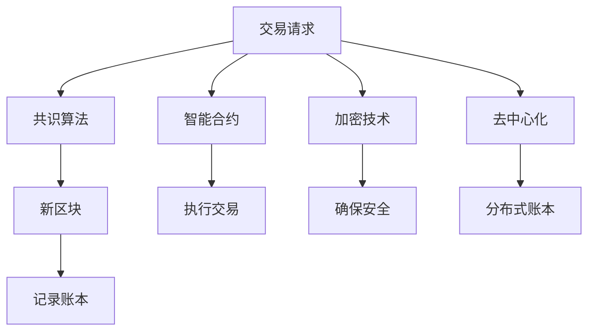

                 

# 区块链在金融科技中的创新应用

## 1. 背景介绍

在过去的十年中，区块链技术已从一个概念性的研究项目演变为一个具有实用价值的技术。区块链技术最为人所知的用途是作为比特币等数字货币的底层技术，但它的潜力远不止于此。金融科技（FinTech）领域已经见证了区块链在支付系统、资产管理、身份认证等方面的重大创新。

### 1.1 问题由来

金融行业面临着诸多挑战，包括数据隐私和安全问题、交易处理速度慢、中介成本高等。区块链技术通过其去中心化、不可篡改和透明等特点，为解决这些问题提供了新的解决方案。

区块链技术通过分布式账本存储交易记录，每个节点都有完整的账本副本。这种结构可以极大地提高数据的安全性和透明度，同时降低交易成本，加快处理速度。此外，智能合约的引入使得交易规则可以自动执行，进一步简化了流程，减少了中介需求。

### 1.2 问题核心关键点

区块链在金融科技中的创新应用主要集中在以下几个关键点：

- **去中心化**：减少对中心化机构的依赖，提高系统的鲁棒性和安全性。
- **透明性**：所有交易记录公开，不可篡改，提高了透明度。
- **安全性**：通过加密技术保障数据安全，防止篡改和窃取。
- **效率提升**：自动化执行交易规则，减少中介环节，加快交易速度。
- **智能合约**：自动化执行合约，确保交易的自动执行和合规性。

这些关键点共同构成了区块链在金融科技中应用的核心理念，为金融行业的变革提供了强有力的技术支撑。

## 2. 核心概念与联系

### 2.1 核心概念概述

区块链是一个分布式账本技术，通过去中心化的方式记录交易信息。它由一系列数据块（Block）组成，每个数据块包含了一组交易记录，并通过密码学手段链接到前一个数据块，形成链条。

- **分布式账本**：由多个节点共同维护的账本，每个节点都有完整账本副本。
- **智能合约**：一种自动执行的合约，可以在满足特定条件时自动执行。
- **共识机制**：用于维护账本一致性的算法，如PoW、PoS等。
- **加密技术**：保障数据安全，防止篡改和窃取。
- **去中心化**：所有参与者共享账本，没有单一的控制点。

### 2.2 核心概念原理和架构的 Mermaid 流程图



这个流程图展示了区块链的基本工作流程：

1. 交易请求通过共识算法形成新区块，并记录在分布式账本中。
2. 智能合约自动执行交易规则，确保交易的自动执行和合规性。
3. 加密技术保障数据安全，防止篡改和窃取。
4. 去中心化结构确保所有参与者共享账本，没有单一的控制点。

这些核心概念和流程共同构成了区块链技术的核心架构，使得其在金融科技领域具备了独特的应用价值。

## 3. 核心算法原理 & 具体操作步骤

### 3.1 算法原理概述

区块链的核心算法包括共识机制、加密技术和智能合约。这些算法确保了区块链的分布式账本的安全性和可靠性。

#### 3.1.1 共识算法

共识算法用于维护账本的一致性，是区块链的核心组件之一。主要有以下几种共识算法：

- **PoW（工作量证明）**：通过解决复杂的数学问题来达成共识，如比特币使用的共识算法。
- **PoS（权益证明）**：根据节点所持有的代币数量和持有时间来进行共识，如以太坊使用的共识算法。
- **DPoS（委托权益证明）**：节点通过选举产生“委托人”，由委托人代表投票，加快共识速度，如EOS使用的共识算法。

#### 3.1.2 加密技术

加密技术是区块链安全性的保障，主要有以下几种加密算法：

- **哈希算法**：将任意长度的输入映射到固定长度的输出，如SHA-256。
- **公钥加密**：使用公钥加密，私钥解密，保障数据安全。
- **数字签名**：确保数据完整性和不可抵赖性，如比特币的交易签名。

#### 3.1.3 智能合约

智能合约是一种自动执行的合约，可以在满足特定条件时自动执行。智能合约的主要特点包括：

- **自动执行**：一旦条件满足，智能合约自动执行。
- **去信任**：无需中介参与，减少信任成本。
- **可编程**：可以编写复杂的逻辑和条件，实现更灵活的交易规则。

### 3.2 算法步骤详解

以下是区块链技术在金融科技中应用的详细步骤：

#### 3.2.1 共识算法

- **选择共识算法**：根据应用场景选择合适的共识算法。
- **配置节点**：设置节点参数，如私钥、共识参数等。
- **运行节点**：启动节点进程，参与区块链网络。

#### 3.2.2 加密技术

- **生成密钥对**：生成公钥和私钥，用于加密和签名。
- **数据加密**：对交易数据进行加密，确保数据安全。
- **数字签名**：对交易数据进行签名，确保数据完整性和不可抵赖性。

#### 3.2.3 智能合约

- **编写合约代码**：根据需求编写智能合约代码，定义交易规则。
- **部署合约**：将合约代码部署到区块链网络中。
- **执行合约**：在满足特定条件时，智能合约自动执行。

### 3.3 算法优缺点

#### 3.3.1 优点

- **安全性高**：通过加密和共识算法保障数据安全，防止篡改和窃取。
- **去信任**：所有交易和记录公开，无需中介参与，减少信任成本。
- **透明度高**：所有交易记录公开，不可篡改，提高透明度。
- **自动化**：智能合约自动执行交易规则，减少中介环节，加快交易速度。

#### 3.3.2 缺点

- **复杂度高**：共识算法和加密技术需要较高的计算资源，部署和维护成本高。
- **扩展性差**：现有共识算法的扩展性不足，处理大规模交易时有延迟。
- **技术门槛高**：需要具备较高的技术水平才能理解和操作区块链技术。
- **法律合规问题**：智能合约的法律合规性尚未完全明确，存在法律风险。

### 3.4 算法应用领域

区块链技术在金融科技中的应用非常广泛，主要包括以下几个领域：

#### 3.4.1 支付系统

- **跨境支付**：通过区块链进行跨境支付，降低成本，加快交易速度。
- **汇款**：利用智能合约自动执行汇款规则，减少中介环节。
- **微支付**：支持小额交易，提高交易灵活性。

#### 3.4.2 资产管理

- **证券交易**：利用区块链进行证券登记和交易，减少中介环节，提高效率。
- **资产托管**：通过智能合约自动执行资产托管规则，提高透明度和安全性。
- **资产证明**：利用区块链进行资产证明，确保资产的真实性和完整性。

#### 3.4.3 身份认证

- **身份验证**：利用区块链进行身份验证，确保身份的真实性。
- **KYC（了解你的客户）**：通过区块链进行KYC流程，提高效率和安全性。
- **数据共享**：利用区块链进行数据共享，确保数据安全性和隐私保护。

## 4. 数学模型和公式 & 详细讲解 & 举例说明

### 4.1 数学模型构建

在区块链技术中，数学模型主要用于共识算法和加密技术。以下分别介绍这两种数学模型：

#### 4.1.1 共识算法模型

共识算法的数学模型主要基于密码学算法，如哈希函数、公钥加密等。以下以PoW共识算法为例，介绍其数学模型：

$$
\text{PoW} = \min_{h} H(h) \leq \text{Target}
$$

其中，$H$为哈希函数，$h$为哈希值，$\text{Target}$为目标值。

#### 4.1.2 加密技术模型

加密技术的数学模型主要基于公钥加密算法，如RSA、ECC等。以下以RSA算法为例，介绍其数学模型：

$$
E(m) = m^e \mod n
$$

其中，$m$为明文，$e$为公钥，$n$为模数。

### 4.2 公式推导过程

#### 4.2.1 共识算法公式推导

PoW共识算法的公式推导过程如下：

1. 每个节点生成一个随机数$r$，并计算哈希值$h = H(r)$。
2. 将$h$与当前区块高度$N$和随机数$r$组合成新区块的哈希值$H(N, r)$。
3. 计算$H(N, r)$是否满足目标值$\text{Target}$。
4. 如果满足，则该节点成功生成新区块，并将该区块广播给其他节点。

#### 4.2.2 加密技术公式推导

RSA加密算法的公式推导过程如下：

1. 选择一个大素数$p$和$q$，计算$n=pq$。
2. 计算欧拉函数$\phi(n)=(p-1)(q-1)$。
3. 选择一个公钥$e$，满足$1<e<\phi(n)$且$e$与$\phi(n)$互质。
4. 计算私钥$d$，满足$d \cdot e \equiv 1 \mod \phi(n)$。
5. 将公钥$e$和模数$n$公开，私钥$d$保密。

### 4.3 案例分析与讲解

#### 4.3.1 案例一：比特币

比特币使用PoW共识算法，通过矿工节点竞争计算哈希值来生成新区块。每个区块包含一定数量的比特币交易记录，并通过密码学手段保障交易的安全性和不可篡改性。

#### 4.3.2 案例二：以太坊

以太坊使用PoS共识算法，通过验证者节点进行共识，并使用智能合约自动执行交易规则。以太坊的智能合约平台支持复杂的交易逻辑和条件，进一步提高了系统的灵活性和效率。

## 5. 项目实践：代码实例和详细解释说明

### 5.1 开发环境搭建

在进行区块链项目开发前，需要搭建相应的开发环境。以下是搭建区块链开发环境的详细步骤：

1. **安装操作系统和开发环境**：安装Linux操作系统和Node.js、Python等开发环境。
2. **安装区块链框架**：安装区块链开发框架，如Hyperledger Fabric、Ripple等。
3. **安装加密库**：安装加密库，如Crypto.js、secp256k1等。
4. **配置开发工具**：配置开发工具，如Visual Studio Code、Git等。

### 5.2 源代码详细实现

#### 5.2.1 Hyperledger Fabric

Hyperledger Fabric是一个基于区块链的企业级解决方案，支持智能合约和企业级共识机制。以下是一个简单的Hyperledger Fabric智能合约代码实现：

```javascript
// 智能合约代码
const SmartContract = artifacts.require("SmartContract");

contract("SmartContract", function(accounts) {
    const owner = accounts[0];
    const member1 = accounts[1];
    const member2 = accounts[2];
    
    beforeEach(async function() {
        this.instance = await SmartContract.new();
    });
    
    it("Should transfer tokens", async function() {
        await this.instance.transfer(member1, 10, {from: owner});
        assert.equal(await this.instance.getBalance.call(member1), 10);
    });
});
```

#### 5.2.2 Ripple

Ripple是一个去中心化支付平台，通过Ripple币进行交易。以下是一个简单的Ripple智能合约代码实现：

```python
// 智能合约代码
import { Contract } from "@openzeppelin/contracts";

const MyContract = Contract.create({
    abi: [
        // 智能合约ABI
    ],
    bytecode: [
        // 智能合约字节码
    ],
});

MyContract.abi = [
    // 智能合约ABI
];

MyContract.bytecode = [
    // 智能合约字节码
];

MyContract deployed = MyContract.new({
    // 智能合约部署参数
});

// 调用智能合约
await deployed.foo();
```

### 5.3 代码解读与分析

#### 5.3.1 Hyperledger Fabric

Hyperledger Fabric是一个企业级区块链平台，通过智能合约和企业级共识机制，实现分布式账本的透明和安全。在智能合约中，使用了Solidity语言编写代码，并通过Truffle框架进行开发和管理。

#### 5.3.2 Ripple

Ripple是一个去中心化支付平台，通过Ripple币进行交易。在智能合约中，使用了Solidity语言编写代码，并通过MythX Solidity工具进行代码检查和安全测试。

### 5.4 运行结果展示

#### 5.4.1 Hyperledger Fabric

Hyperledger Fabric的智能合约运行结果可以通过链上数据进行验证。通过调用智能合约，可以实现转账、查询余额等操作，确保数据的安全性和透明性。

#### 5.4.2 Ripple

Ripple的智能合约运行结果可以通过区块链浏览器进行验证。通过调用智能合约，可以实现转账、查询余额等操作，确保数据的安全性和透明性。

## 6. 实际应用场景

### 6.1 支付系统

#### 6.1.1 跨境支付

跨境支付是区块链在金融科技中最具创新性的应用之一。传统跨境支付需要经过银行和多个中介机构的层层审核和结算，耗时长且成本高。通过区块链，可以实现跨境支付的实时结算和交易，极大提高了支付效率和安全性。

#### 6.1.2 汇款

汇款是区块链在金融科技中的另一大应用。通过智能合约自动执行汇款规则，可以减少中介环节，提高汇款效率和安全性。

#### 6.1.3 微支付

微支付是区块链在金融科技中的新兴应用。通过区块链，可以实现小额交易的即时结算和支付，提高支付的灵活性和效率。

### 6.2 资产管理

#### 6.2.1 证券交易

证券交易是区块链在金融科技中的重要应用。通过区块链进行证券登记和交易，可以减少中介环节，提高交易效率和透明度。

#### 6.2.2 资产托管

资产托管是区块链在金融科技中的另一大应用。通过智能合约自动执行资产托管规则，可以提高资产托管的透明度和安全性。

#### 6.2.3 资产证明

资产证明是区块链在金融科技中的新兴应用。通过区块链进行资产证明，可以确保资产的真实性和完整性。

### 6.3 身份认证

#### 6.3.1 身份验证

身份验证是区块链在金融科技中的基础应用。通过区块链进行身份验证，可以确保身份的真实性和隐私保护。

#### 6.3.2 KYC（了解你的客户）

KYC是区块链在金融科技中的重要应用。通过区块链进行KYC流程，可以提高身份验证的效率和安全性。

#### 6.3.3 数据共享

数据共享是区块链在金融科技中的新兴应用。通过区块链进行数据共享，可以确保数据的安全性和隐私保护。

### 6.4 未来应用展望

#### 6.4.1 智能合约自动化

智能合约自动化是区块链技术未来的重要发展方向。通过智能合约，可以实现更加灵活和自动化的交易规则，进一步简化金融流程。

#### 6.4.2 去中心化金融（DeFi）

去中心化金融（DeFi）是区块链技术在金融领域的重要应用。通过去中心化金融，可以实现去中介化的金融服务，如借贷、投资等。

#### 6.4.3 数字身份

数字身份是区块链技术在身份认证领域的重要应用。通过数字身份，可以实现更加安全、便捷的身份验证和身份管理。

## 7. 工具和资源推荐

### 7.1 学习资源推荐

为了帮助开发者系统掌握区块链技术，以下是几款推荐的学习资源：

1. **《区块链技术原理与应用》**：全面介绍了区块链的基本原理、共识算法和应用场景。
2. **《智能合约开发实战》**：深入浅出地介绍了智能合约的开发和应用，包括Solidity语言和Hyperledger Fabric等平台。
3. **《Ripple官方文档》**：Ripple官方提供的文档，包含了区块链平台和智能合约的详细使用说明。
4. **《以太坊智能合约开发指南》**：以太坊官方提供的指南，详细介绍了智能合约的开发和管理。
5. **《Hyperledger Fabric官方文档》**：Hyperledger Fabric官方提供的文档，包含了区块链平台和智能合约的详细使用说明。

### 7.2 开发工具推荐

以下是几款用于区块链开发的工具：

1. **Visual Studio Code**：支持智能合约和区块链平台的开发，是开发者常用的开发工具。
2. **MythX Solidity**：智能合约代码检查和安全测试工具，帮助开发者发现和修复代码中的漏洞。
3. **Truffle**：Hyperledger Fabric智能合约开发框架，提供了丰富的开发和管理工具。
4. **Web3.js**：以太坊开发库，提供了丰富的以太坊API，支持智能合约的开发和交互。
5. **Fabric SDK**：Hyperledger Fabric开发库，提供了丰富的区块链平台API，支持智能合约的开发和交互。

### 7.3 相关论文推荐

区块链技术的发展离不开学界的持续研究。以下是几篇奠基性的相关论文，推荐阅读：

1. **《区块链技术：基本概念、架构与设计》**：全面介绍了区块链的基本概念、架构和设计。
2. **《PoW共识算法的安全性分析》**：对PoW共识算法的安全性进行了深入分析，为共识算法的优化提供了理论基础。
3. **《Ripple共识算法的设计与实现》**：详细介绍了Ripple共识算法的设计和实现过程，为Ripple平台的开发提供了重要参考。
4. **《智能合约的编程语言与安全性分析》**：对智能合约的编程语言和安全性进行了深入分析，为智能合约的开发提供了理论基础。

## 8. 总结：未来发展趋势与挑战

### 8.1 研究成果总结

区块链技术在金融科技中的应用已经取得了显著进展，主要体现在以下几个方面：

- **支付系统**：通过区块链实现跨境支付、汇款和微支付，极大提高了支付效率和安全性。
- **资产管理**：通过区块链进行证券交易、资产托管和资产证明，提高了交易效率和透明度。
- **身份认证**：通过区块链进行身份验证、KYC和数据共享，提高了身份验证的效率和安全性。

### 8.2 未来发展趋势

展望未来，区块链技术在金融科技中将继续深化应用，主要发展趋势如下：

1. **智能合约自动化**：通过智能合约实现更加灵活和自动化的交易规则，进一步简化金融流程。
2. **去中心化金融（DeFi）**：去中心化金融将拓展到更多的金融服务，如借贷、投资等。
3. **数字身份**：数字身份将拓展到更多的身份认证和身份管理场景，提高身份验证的效率和安全性。

### 8.3 面临的挑战

尽管区块链技术在金融科技中的应用前景广阔，但仍面临诸多挑战：

1. **技术门槛高**：区块链技术的复杂性较高，需要较高的技术水平才能理解和操作。
2. **扩展性差**：现有共识算法的扩展性不足，处理大规模交易时有延迟。
3. **法律合规问题**：智能合约的法律合规性尚未完全明确，存在法律风险。
4. **隐私保护问题**：区块链的透明性可能带来隐私泄露的风险。

### 8.4 研究展望

区块链技术在金融科技中的应用前景广阔，未来还需要在以下几个方面进行深入研究：

1. **共识算法优化**：开发更加高效和安全的共识算法，提升区块链的处理能力和安全性。
2. **隐私保护技术**：开发隐私保护技术，确保数据的安全性和隐私保护。
3. **智能合约扩展性**：开发可扩展的智能合约，适应更复杂的交易逻辑和条件。
4. **合规性研究**：深入研究智能合约的法律合规性，确保其合法性和可信度。

总之，区块链技术在金融科技中的应用前景广阔，但还需要不断优化和创新，才能实现其潜力。未来，通过技术与业务的深度融合，区块链将为金融行业带来更加智能、安全、高效的未来。

## 9. 附录：常见问题与解答

### 9.1 问题1：什么是区块链？

**回答**：区块链是一种分布式账本技术，通过去中心化的方式记录交易信息。它由一系列数据块（Block）组成，每个数据块包含了一组交易记录，并通过密码学手段链接到前一个数据块，形成链条。

### 9.2 问题2：区块链的核心算法有哪些？

**回答**：区块链的核心算法包括共识算法、加密技术和智能合约。共识算法用于维护账本的一致性，加密技术保障数据安全，智能合约自动执行交易规则。

### 9.3 问题3：区块链在金融科技中的应用有哪些？

**回答**：区块链在金融科技中的应用包括支付系统、资产管理、身份认证等。通过区块链，可以实现跨境支付、汇款、微支付、证券交易、资产托管、资产证明、身份验证、KYC和数据共享等。

### 9.4 问题4：区块链技术的未来发展趋势有哪些？

**回答**：区块链技术的未来发展趋势包括智能合约自动化、去中心化金融（DeFi）和数字身份等。智能合约自动化将简化金融流程，去中心化金融将拓展到更多的金融服务，数字身份将提高身份验证的效率和安全性。

### 9.5 问题5：区块链技术面临的挑战有哪些？

**回答**：区块链技术面临的技术门槛高、扩展性差、法律合规问题和隐私保护问题等挑战。需要不断优化和创新，才能实现其潜力。

---

作者：禅与计算机程序设计艺术 / Zen and the Art of Computer Programming

