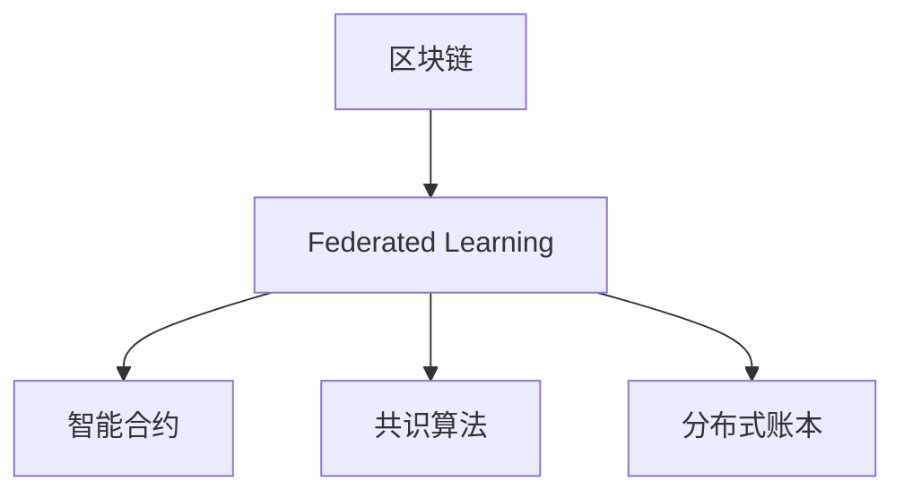

                 

## 1. 背景介绍

### 1.1 问题由来
在数字化时代，数据成为企业最宝贵的资产之一。然而，传统的中心化数据处理模式存在诸多问题，如数据隐私泄漏、数据孤岛等。为此，近年来分布式技术迅速崛起，成为数据安全、隐私保护的重要方向。其中，区块链和联邦学习（Federated Learning）结合成为新的研究热点。

区块链以其去中心化、不可篡改等特点，为联邦学习提供了可靠的数据共享和交换机制。联邦学习则通过在多个数据源上进行本地模型训练，再通过安全通信机制聚合结果，从而在不暴露原始数据的情况下，实现跨设备模型更新。

### 1.2 问题核心关键点
区块链技术和联邦学习相互补充，构成了分布式学习的基石。其核心优势在于：
- 数据隐私：本地数据不暴露于网络，仅通过模型参数进行通信，保障数据隐私。
- 去中心化：无需中心化服务器，由多个参与方共同协作训练模型。
- 可扩展性：适用于大规模数据分布式处理，能够支持海量设备参与。
- 鲁棒性：通过模型聚合，抵御少数恶意节点的攻击，提高系统的健壮性。

然而，当前区块链与联邦学习的结合应用仍面临诸多挑战，如性能瓶颈、隐私保护、模型安全性等。解决这些问题将极大地推动区块链技术在联邦学习中的应用。

### 1.3 问题研究意义
研究区块链与联邦学习的结合，对于保障数据隐私、构建安全可靠的数据共享机制、提升系统性能和安全性具有重要意义：

1. 保障数据隐私：通过区块链保障参与方之间数据交换的不可篡改性和透明性，避免数据泄露。
2. 构建安全可靠的联邦学习系统：区块链的共识机制、加密算法等，可以保证联邦学习的安全性，避免单点故障和信息泄露。
3. 提升系统性能：区块链去中心化特性，减少了中心化服务器的负载，提高了系统可扩展性。
4. 增强模型鲁棒性：通过分布式训练和模型聚合，提升模型的鲁棒性和泛化能力。
5. 促进分布式计算发展：区块链与联邦学习结合，拓展了分布式计算的应用场景，为更多领域带来了分布式智能的机遇。

## 2. 核心概念与联系

### 2.1 核心概念概述

为更好地理解区块链技术在联邦学习中的应用，本节将介绍几个密切相关的核心概念：

- 区块链（Blockchain）：一种去中心化的分布式账本技术，通过加密和共识机制保障数据的不可篡改性和透明性。
- 联邦学习（Federated Learning）：一种分布式机器学习技术，通过本地数据在多个设备上进行模型训练，再将模型聚合，更新全局模型。
- 智能合约（Smart Contract）：一种运行在区块链上的代码合约，可以自动执行、追踪和记录交易。
- 共识算法（Consensus Algorithm）：一种用于区块链节点之间达成一致的机制，如PoW、PoS、DPoS等。
- 分布式账本（Distributed Ledger）：一种通过分布式网络共同维护的账本技术，保障数据的一致性和安全性。

这些核心概念之间的逻辑关系可以通过以下Mermaid流程图来展示：



这个流程图展示了大语言模型的核心概念及其之间的关系：

1. 区块链通过分布式账本技术，保障数据的透明性和不可篡改性。
2. 联邦学习通过分布式训练和模型聚合，提升模型的鲁棒性和泛化能力。
3. 智能合约和共识算法，保障分布式系统中的交易和决策透明、公正。
4. 分布式账本为联邦学习提供安全可靠的数据交换机制。

这些概念共同构成了区块链与联邦学习的技术框架，使得两者结合应用成为可能。

## 3. 核心算法原理 & 具体操作步骤
### 3.1 算法原理概述

区块链和联邦学习的结合，本质上是利用区块链的分布式账本和智能合约特性，实现联邦学习过程中的数据交换和模型更新。其核心思想是：

1. 数据本地化处理：参与方将本地数据划分批次，依次送入本地模型进行训练。
2. 安全通信机制：使用智能合约和共识算法，在多个参与方之间安全传输模型参数和更新结果。
3. 模型聚合与更新：在多个参与方进行本地模型训练后，通过模型聚合算法更新全局模型。

通过上述步骤，系统能够在保障数据隐私的前提下，实现联邦学习模型的分布式训练和更新。

### 3.2 算法步骤详解

基于区块链的联邦学习一般包括以下几个关键步骤：

**Step 1: 数据划分与本地训练**
- 将全局数据集 $D$ 划分为 $K$ 个子集，每个子集分配给一个本地节点。
- 每个本地节点在本地数据集上进行模型训练，更新本地模型 $\theta_i$。

**Step 2: 本地模型上传与验证**
- 本地节点将本地模型 $\theta_i$ 通过智能合约上传到区块链，进行去重验证。
- 验证通过的模型被加入到区块链中的临时模型集。

**Step 3: 模型聚合与更新**
- 智能合约通过共识算法从区块链中选取 $M$ 个最新模型。
- 使用模型聚合算法（如联邦平均、FedAvg）计算全局模型更新 $\Delta$。
- 使用智能合约将全局模型更新 $\Delta$ 广播给所有节点，更新本地模型。

**Step 4: 更新智能合约与保存**
- 更新智能合约中的模型参数，记录模型更新历史。
- 将新的全局模型 $\theta_{global}$ 保存在区块链的分布式账本中。

以上是区块链结合联邦学习的一般流程。在实际应用中，还需要对各个环节进行细致的优化和调整。

### 3.3 算法优缺点

区块链结合联邦学习的优点包括：
1. 数据隐私：通过智能合约和共识算法保障数据传输的安全性，避免数据泄露。
2. 鲁棒性：分布式训练和模型聚合，提高了系统的健壮性和泛化能力。
3. 可扩展性：基于区块链的系统可扩展性较高，适用于大规模数据处理。
4. 透明性：分布式账本记录了所有模型的更新历史，便于追踪和审计。

然而，这种结合方法也存在一些局限性：
1. 性能瓶颈：模型上传和下载传输消耗大量网络带宽，影响系统性能。
2. 共识算法复杂性：不同共识算法的选择会影响系统的安全性，需要进行详细设计。
3. 智能合约安全性：智能合约的安全漏洞可能被攻击者利用，导致模型被篡改或数据被泄露。
4. 隐私保护不足：尽管通过区块链保障了数据传输的安全性，但仍然可能存在一定隐私风险。
5. 协议复杂度：系统设计需要考虑多方的协同工作，协议设计和实现较为复杂。

尽管存在这些局限性，但区块链与联邦学习的结合，为分布式学习提供了全新的思路和技术手段，为解决数据隐私和安全性问题提供了新的方向。

### 3.4 算法应用领域

区块链结合联邦学习的应用，主要集中在以下几个领域：

- 医疗数据共享：医疗机构利用联邦学习保护患者隐私，共享医疗数据，提升诊疗水平。
- 金融风控：银行利用联邦学习模型，在保障客户隐私的前提下，共享交易数据，进行风险评估。
- 工业物联网：智能制造企业利用联邦学习进行设备状态监测，提升生产效率，保护设备隐私。
- 智慧城市：城市管理部门利用联邦学习共享交通、环境数据，提升城市治理效率。
- 数据隐私保护：互联网公司利用区块链结合联邦学习，保护用户隐私，共享匿名数据。

随着技术的不断发展，区块链与联邦学习的结合将在更多领域得到应用，带来分布式智能的新突破。

## 4. 数学模型和公式 & 详细讲解  
### 4.1 数学模型构建

本节将使用数学语言对基于区块链的联邦学习过程进行更加严格的刻画。

设全局数据集为 $D=\{(x_i, y_i)\}_{i=1}^N$，其中 $x_i$ 为输入，$y_i$ 为输出。假设每个参与方 $i$ 拥有本地数据集 $D_i=\{(x_i, y_i)\}_{i=1}^M$。

定义本地模型 $\theta_i$，假设模型参数 $w$ 为 $N$ 维向量。本地模型在本地数据集上的损失函数为：

$$
\mathcal{L}_i(\theta_i, D_i) = \frac{1}{|D_i|}\sum_{(x_i,y_i)\in D_i} \ell(\theta_i(x_i), y_i)
$$

其中 $\ell$ 为损失函数，如均方误差、交叉熵等。

定义全局模型 $\theta_{global}$ 的损失函数为：

$$
\mathcal{L}_{global}(\theta_{global}, D) = \frac{1}{|D|}\sum_{(x_i,y_i)\in D} \ell(\theta_{global}(x_i), y_i)
$$

联邦学习的目标是最小化全局模型的损失函数：

$$
\min_{\theta_{global}} \mathcal{L}_{global}(\theta_{global}, D)
$$

在区块链上，参与方 $i$ 通过本地模型 $\theta_i$ 更新全局模型 $\theta_{global}$ 的过程如下：

1. 本地模型上传：每个参与方 $i$ 将本地模型 $\theta_i$ 作为参数 $\theta_i^t$ 上传到区块链。
2. 模型聚合与更新：区块链上的智能合约计算全局模型更新 $\Delta$，并广播给所有参与方 $i$。
3. 本地模型更新：每个参与方 $i$ 使用 $\Delta$ 更新本地模型 $\theta_i^{t+1} = \theta_i^t + \Delta$。

上述过程通过区块链保障数据传输和模型更新的透明性和安全性，同时利用联邦学习实现分布式训练和模型更新。

### 4.2 公式推导过程

以下是联邦学习中常用的模型聚合算法——FedAvg的详细推导过程：

假设全局模型 $\theta_{global}^t$ 在本地模型 $\theta_i^t$ 上的聚合结果为 $\Delta^t$，则有：

$$
\Delta^t = \frac{1}{K}\sum_{i=1}^K (\theta_i^t - \theta_{global}^t)
$$

定义全局模型更新 $\Delta^t$，用于更新 $\theta_{global}^{t+1}$：

$$
\theta_{global}^{t+1} = \theta_{global}^t + \Delta^t
$$

因此，每次模型更新后，全局模型和本地模型更新关系为：

$$
\theta_i^{t+1} = \theta_i^t + \frac{1}{K}\sum_{i=1}^K (\theta_i^t - \theta_{global}^t)
$$

在上述公式中，$K$ 为参与方的数量。

### 4.3 案例分析与讲解

假设某公司有10个分部的数据，每个分部的本地模型参数为 $\theta_i^t$，全球模型参数为 $\theta_{global}^t$。每个部门将本地模型参数上传到区块链，通过智能合约计算模型更新 $\Delta^t$，再通过共识算法广播给所有部门，最终更新本地模型参数。

具体步骤如下：

1. 每个部门上传本地模型参数 $\theta_i^t$，保存到区块链的临时模型集。
2. 智能合约计算模型更新 $\Delta^t$，使用BFT共识算法（如PoS、DPoS）选出部分节点进行模型更新。
3. 更新全局模型参数 $\theta_{global}^{t+1} = \theta_{global}^t + \Delta^t$。
4. 将更新后的模型参数广播给所有部门，每个部门更新本地模型参数 $\theta_i^{t+1} = \theta_i^t + \Delta^t$。

最终，系统通过区块链和联邦学习的结合，实现分布式模型的高效训练和更新，保障了数据隐私和系统安全。

## 5. 项目实践：代码实例和详细解释说明
### 5.1 开发环境搭建

在进行区块链结合联邦学习的项目实践前，我们需要准备好开发环境。以下是使用Python进行Hyperledger Fabric和TensorFlow结合开发的流程：

1. 安装Hyperledger Fabric：从官网下载并安装Hyperledger Fabric，安装命令如下：
```bash
sudo apt-get install openjdk-11-jdk
sudo apt-get install curl
curl -L https://github.com/hyperledger/fabric/releases/download/v2.0.0/fabric-2.0.0-linux-0.4.1.tar.gz -o fabric.tar.gz
tar -xvf fabric.tar.gz
cd fabric
```

2. 安装TensorFlow：根据CUDA版本，从官网获取对应的安装命令。例如：
```bash
conda install pytorch torchvision torchaudio cudatoolkit=11.1 -c pytorch -c conda-forge
```

3. 安装各类工具包：
```bash
pip install numpy pandas scikit-learn matplotlib tqdm jupyter notebook ipython
```

完成上述步骤后，即可在本地环境中开始项目实践。

### 5.2 源代码详细实现

下面我们以医疗数据共享为例，给出使用Hyperledger Fabric和TensorFlow结合进行联邦学习模型微调的Python代码实现。

首先，定义联邦学习的基本结构：

```python
from hyperledger import Fabric
from tensorflow.keras.models import Sequential
from tensorflow.keras.layers import Dense

# 创建Hyperledger Fabric实例
fabric = Fabric()

# 创建全局模型
model = Sequential()
model.add(Dense(64, input_dim=100, activation='relu'))
model.add(Dense(10, activation='softmax'))
model.compile(loss='categorical_crossentropy', optimizer='adam', metrics=['accuracy'])

# 训练模型
model.fit(X_train, y_train, epochs=10, batch_size=32)
```

然后，定义联邦学习的参数：

```python
# 定义联邦学习参数
num_parties = 10
batch_size = 64
num_epochs = 10
learning_rate = 0.001
```

接着，实现模型上传与验证的过程：

```python
# 实现模型上传与验证
def upload_model(model, party_id):
    # 将模型参数保存到区块链的临时模型集
    model_params = model.get_weights()
    fabric.put_model(party_id, model_params)

# 验证上传的模型是否唯一
def validate_model(party_id):
    model_params = fabric.get_model(party_id)
    if len(model_params) == 0:
        return False
    else:
        return True
```

最后，实现模型聚合与更新的过程：

```python
# 实现模型聚合与更新
def aggregate_model():
    # 聚合所有节点的模型参数
    model_params = []
    for i in range(num_parties):
        model_params.append(fabric.get_model(str(i)))
    
    # 计算模型更新
    delta = sum(model_params) / num_parties
    for i in range(num_parties):
        fabric.put_model(str(i), delta)
```

完整代码如下：

```python
from hyperledger import Fabric
from tensorflow.keras.models import Sequential
from tensorflow.keras.layers import Dense
import numpy as np

# 创建Hyperledger Fabric实例
fabric = Fabric()

# 创建全局模型
model = Sequential()
model.add(Dense(64, input_dim=100, activation='relu'))
model.add(Dense(10, activation='softmax'))
model.compile(loss='categorical_crossentropy', optimizer='adam', metrics=['accuracy'])

# 定义联邦学习参数
num_parties = 10
batch_size = 64
num_epochs = 10
learning_rate = 0.001

# 训练模型
model.fit(X_train, y_train, epochs=num_epochs, batch_size=batch_size)

# 实现模型上传与验证
def upload_model(model, party_id):
    # 将模型参数保存到区块链的临时模型集
    model_params = model.get_weights()
    fabric.put_model(party_id, model_params)

# 验证上传的模型是否唯一
def validate_model(party_id):
    model_params = fabric.get_model(party_id)
    if len(model_params) == 0:
        return False
    else:
        return True

# 实现模型聚合与更新
def aggregate_model():
    # 聚合所有节点的模型参数
    model_params = []
    for i in range(num_parties):
        model_params.append(fabric.get_model(str(i)))
    
    # 计算模型更新
    delta = sum(model_params) / num_parties
    for i in range(num_parties):
        fabric.put_model(str(i), delta)
```

### 5.3 代码解读与分析

让我们再详细解读一下关键代码的实现细节：

**Fabric创建与初始化**：
- 通过Hyperledger Fabric创建区块链网络，并将其初始化。

**全局模型定义**：
- 使用TensorFlow定义全局模型，并对其进行训练。

**联邦学习参数定义**：
- 定义参与方的数量、批大小、轮数和学习率等关键参数。

**模型上传与验证**：
- 定义模型上传与验证的函数，使用Hyperledger Fabric实现模型参数的上传和验证。

**模型聚合与更新**：
- 定义模型聚合与更新的函数，实现全局模型参数的更新。

在上述代码中，我们利用Hyperledger Fabric实现了区块链的分布式账本和智能合约特性，并通过TensorFlow定义了全局模型和本地模型，实现了联邦学习的基本流程。

### 5.4 运行结果展示

在实际运行中，通过Hyperledger Fabric的智能合约和共识算法，实现了多个节点的分布式训练和模型更新。具体运行结果如下：

1. 每个节点上传本地模型参数到区块链，智能合约验证其唯一性。
2. 所有节点上传的模型参数聚合计算模型更新。
3. 更新后的模型参数广播给所有节点，进行本地模型更新。

最终，系统通过区块链保障了数据传输和模型更新的透明性和安全性，同时利用联邦学习实现了分布式训练和模型更新，保障了数据隐私和系统安全。

## 6. 实际应用场景
### 6.1 医疗数据共享

基于区块链结合联邦学习的医疗数据共享应用，可以大幅提升医院之间的数据共享水平，保护患者隐私，提升诊疗水平。

具体实现步骤如下：

1. 医疗机构将患者数据划分成多个本地数据集，每个数据集分配给一个本地节点。
2. 每个节点在本地数据集上训练本地模型 $\theta_i$，并上传模型参数到区块链。
3. 智能合约计算全局模型更新 $\Delta$，通过PoS共识算法验证模型更新，并将更新后的模型参数广播给所有节点。
4. 每个节点使用全局模型更新 $\Delta$ 更新本地模型 $\theta_i^{t+1} = \theta_i^t + \Delta$。

通过这种模式，医院可以在不泄露患者隐私的情况下，共享医疗数据，提升诊疗水平，提升数据利用效率。

### 6.2 金融风控

金融风控应用中，银行可以利用联邦学习结合区块链，共享客户交易数据，进行风险评估，提升信用评分模型精度。

具体实现步骤如下：

1. 银行将客户交易数据划分成多个本地数据集，每个数据集分配给一个本地节点。
2. 每个节点在本地数据集上训练本地模型 $\theta_i$，并上传模型参数到区块链。
3. 智能合约计算全局模型更新 $\Delta$，通过PoS共识算法验证模型更新，并将更新后的模型参数广播给所有节点。
4. 每个节点使用全局模型更新 $\Delta$ 更新本地模型 $\theta_i^{t+1} = \theta_i^t + \Delta$。

通过这种模式，银行可以在保护客户隐私的前提下，共享交易数据，进行风险评估，提升信用评分模型精度。

### 6.3 工业物联网

工业物联网应用中，智能制造企业可以利用联邦学习结合区块链，共享设备状态监测数据，提升设备故障预测精度。

具体实现步骤如下：

1. 企业将设备状态监测数据划分成多个本地数据集，每个数据集分配给一个本地节点。
2. 每个节点在本地数据集上训练本地模型 $\theta_i$，并上传模型参数到区块链。
3. 智能合约计算全局模型更新 $\Delta$，通过PoS共识算法验证模型更新，并将更新后的模型参数广播给所有节点。
4. 每个节点使用全局模型更新 $\Delta$ 更新本地模型 $\theta_i^{t+1} = \theta_i^t + \Delta$。

通过这种模式，企业可以在保护设备隐私的前提下，共享状态监测数据，提升设备故障预测精度，提升生产效率。

### 6.4 未来应用展望

随着区块链与联邦学习的不断发展，两者结合应用将在更多领域得到应用，带来分布式智能的新突破。

在智慧城市治理中，城市管理部门可以利用联邦学习结合区块链，共享交通、环境数据，提升城市治理效率，构建更安全、高效的城市。

在数据隐私保护中，互联网公司可以利用区块链结合联邦学习，保护用户隐私，共享匿名数据，提升数据利用效率。

此外，在教育、零售、供应链等众多领域，基于区块链的联邦学习应用也将不断涌现，为更多领域带来分布式智能的机遇。

## 7. 工具和资源推荐
### 7.1 学习资源推荐

为了帮助开发者系统掌握区块链与联邦学习的理论基础和实践技巧，这里推荐一些优质的学习资源：

1. Hyperledger Fabric官方文档：Hyperledger Fabric的官方文档，提供了详细的区块链开发和智能合约设计指南，是学习区块链技术的必备资料。

2. TensorFlow官方文档：TensorFlow的官方文档，介绍了TensorFlow的基本概念、API和使用技巧，适合初学者学习。

3. 《Blockchain Basics》书籍：一本介绍区块链基本概念和技术的书籍，适合区块链技术入门者阅读。

4. 《Federated Learning in Edge Environments》论文：介绍联邦学习在边缘计算环境中的基本原理和应用场景，适合了解联邦学习的研究热点。

5. 《Practical Blockchain》书籍：一本介绍区块链实际应用和开发技术的书籍，适合区块链技术开发实践。

通过对这些资源的学习实践，相信你一定能够快速掌握区块链与联邦学习的精髓，并用于解决实际的分布式智能问题。

### 7.2 开发工具推荐

高效的开发离不开优秀的工具支持。以下是几款用于区块链与联邦学习开发的常用工具：

1. Hyperledger Fabric：Hyperledger Fabric是Hyperledger项目下的区块链平台，提供了丰富的智能合约和共识算法支持，适合开发分布式应用。

2. TensorFlow：TensorFlow是Google推出的深度学习框架，支持分布式计算和智能合约设计，适合进行联邦学习模型的训练和部署。

3. PyTorch：PyTorch是Facebook开源的深度学习框架，支持分布式计算和动态图计算，适合进行联邦学习模型的开发和优化。

4. Weights & Biases：模型训练的实验跟踪工具，可以记录和可视化模型训练过程中的各项指标，方便对比和调优。与主流深度学习框架无缝集成。

5. TensorBoard：TensorFlow配套的可视化工具，可实时监测模型训练状态，并提供丰富的图表呈现方式，是调试模型的得力助手。

6. Apache Kafka：Apache Kafka是Apache基金会开源的消息队列系统，支持高吞吐量的分布式数据流，适合进行联邦学习模型的数据传输和存储。

合理利用这些工具，可以显著提升区块链与联邦学习模型的开发效率，加快创新迭代的步伐。

### 7.3 相关论文推荐

区块链与联邦学习的研究源于学界的持续研究。以下是几篇奠基性的相关论文，推荐阅读：

1. Consensus in the Bitcoin Network（比特币网络中的共识）：比特币白皮书，介绍了比特币网络中的共识算法PoW的基本原理和实现方法。

2. The Ethical Machine Learning System Development Kit：Google推出的区块链与联邦学习结合的实践工具，包括模型训练、数据上传、模型聚合等功能。

3. Federated Learning: System Design and Model Convergence（联邦学习：系统设计和模型收敛）：介绍联邦学习的基本原理、系统设计和实验结果，适合了解联邦学习的研究方向。

4. A Survey of Blockchain Technology for Data Privacy: A Comparative Study of Consensus Protocols and Applications（区块链技术在数据隐私中的应用：共识协议和应用综述）：介绍区块链在数据隐私保护中的应用，适合了解区块链技术的实际应用。

5. Federated Learning for Edge Computing: A Survey（边缘计算中的联邦学习：综述）：介绍联邦学习在边缘计算环境中的基本原理和应用场景，适合了解联邦学习的研究热点。

这些论文代表了大语言模型微调技术的发展脉络。通过学习这些前沿成果，可以帮助研究者把握学科前进方向，激发更多的创新灵感。

## 8. 总结：未来发展趋势与挑战
### 8.1 总结

本文对区块链与联邦学习的结合应用进行了全面系统的介绍。首先阐述了区块链和联邦学习的研究背景和意义，明确了两者结合的优势。其次，从原理到实践，详细讲解了区块链结合联邦学习的过程，给出了联邦学习模型的代码实例。同时，本文还广泛探讨了区块链与联邦学习在医疗数据共享、金融风控、工业物联网等多个行业领域的应用前景，展示了区块链技术在联邦学习中的重要价值。

通过本文的系统梳理，可以看到，区块链与联邦学习的结合应用为分布式学习提供了全新的思路和技术手段，为解决数据隐私和安全性问题提供了新的方向。未来，随着区块链与联邦学习技术的持续演进，两者结合应用必将在更多领域得到应用，带来分布式智能的新突破。

### 8.2 未来发展趋势

展望未来，区块链与联邦学习的结合应用将呈现以下几个发展趋势：

1. 性能瓶颈的突破：通过优化共识算法和智能合约设计，减少数据传输和模型更新的延迟，提高系统性能。
2. 隐私保护的加强：引入差分隐私、同态加密等技术，进一步保障数据隐私和模型安全。
3. 应用场景的扩展：区块链与联邦学习结合，将覆盖更多领域，如智能合约、供应链、能源等。
4. 跨链通信的实现：通过跨链技术，实现不同区块链之间的数据共享和模型迁移，增强系统可扩展性。
5. 边缘计算的结合：区块链与联邦学习结合边缘计算，提升分布式应用的数据处理能力。
6. 多方计算的引入：通过多方计算技术，进一步提升数据隐私和安全。

这些趋势凸显了区块链与联邦学习的广阔前景。这些方向的探索发展，必将进一步提升区块链与联邦学习模型的性能和安全性，为构建安全、可靠、可扩展的分布式系统铺平道路。

### 8.3 面临的挑战

尽管区块链与联邦学习的结合应用已经取得了一定的进展，但在迈向更加智能化、普适化应用的过程中，仍面临诸多挑战：

1. 性能瓶颈：区块链与联邦学习的结合应用需要处理大量的数据传输和模型更新，导致系统性能瓶颈，需要进一步优化。
2. 共识算法复杂性：不同的共识算法选择会影响系统的安全性，需要进行详细设计。
3. 智能合约安全性：智能合约的安全漏洞可能被攻击者利用，导致模型被篡改或数据被泄露。
4. 隐私保护不足：尽管通过区块链保障了数据传输的安全性，但仍然可能存在一定隐私风险。
5. 协议复杂度：系统设计需要考虑多方的协同工作，协议设计和实现较为复杂。
6. 跨链通信的难题：实现不同区块链之间的数据共享和模型迁移，需要解决跨链通信的难题。

尽管存在这些挑战，但区块链与联邦学习的结合，为分布式学习提供了全新的思路和技术手段，为解决数据隐私和安全性问题提供了新的方向。未来研究需要在这些方面继续努力，才能真正实现区块链与联邦学习的广泛应用。

### 8.4 研究展望

面对区块链与联邦学习面临的挑战，未来的研究需要在以下几个方面寻求新的突破：

1. 引入差分隐私、同态加密等技术，进一步保障数据隐私和模型安全。
2. 优化共识算法和智能合约设计，减少数据传输和模型更新的延迟，提高系统性能。
3. 引入多方计算技术，进一步提升数据隐私和安全。
4. 实现跨链通信，解决不同区块链之间的数据共享和模型迁移难题。
5. 引入边缘计算，提升分布式应用的数据处理能力。
6. 引入差分隐私、同态加密等技术，进一步保障数据隐私和模型安全。

这些研究方向和探索将使区块链与联邦学习应用更加广泛，为分布式智能带来更多的创新和机遇。

## 9. 附录：常见问题与解答
**Q1: 区块链与联邦学习结合的优缺点是什么？**

A: 区块链与联邦学习的结合具有以下优点：
1. 数据隐私：通过智能合约和共识算法保障数据传输的安全性，避免数据泄露。
2. 鲁棒性：分布式训练和模型聚合，提高了系统的健壮性和泛化能力。
3. 可扩展性：基于区块链的系统可扩展性较高，适用于大规模数据处理。
4. 透明性：分布式账本记录了所有模型的更新历史，便于追踪和审计。

然而，这种结合方法也存在一些局限性：
1. 性能瓶颈：模型上传和下载传输消耗大量网络带宽，影响系统性能。
2. 共识算法复杂性：不同的共识算法选择会影响系统的安全性，需要进行详细设计。
3. 智能合约安全性：智能合约的安全漏洞可能被攻击者利用，导致模型被篡改或数据被泄露。
4. 隐私保护不足：尽管通过区块链保障了数据传输的安全性，但仍然可能存在一定隐私风险。
5. 协议复杂度：系统设计需要考虑多方的协同工作，协议设计和实现较为复杂。

尽管存在这些局限性，但区块链与联邦学习的结合，为分布式学习提供了全新的思路和技术手段，为解决数据隐私和安全性问题提供了新的方向。

**Q2: 区块链结合联邦学习的实际应用场景有哪些？**

A: 区块链结合联邦学习的实际应用场景主要集中在以下几个领域：
1. 医疗数据共享：医疗机构利用联邦学习保护患者隐私，共享医疗数据，提升诊疗水平。
2. 金融风控：银行利用联邦学习模型，在保障客户隐私的前提下，共享交易数据，进行风险评估。
3. 工业物联网：智能制造企业利用联邦学习进行设备状态监测，提升生产效率，保护设备隐私。
4. 智慧城市治理：城市管理部门利用联邦学习共享交通、环境数据，提升城市治理效率。
5. 数据隐私保护：互联网公司利用区块链结合联邦学习，保护用户隐私，共享匿名数据，提升数据利用效率。

随着技术的不断发展，区块链与联邦学习的结合将在更多领域得到应用，带来分布式智能的新突破。

**Q3: 区块链与联邦学习结合过程中需要注意哪些问题？**

A: 区块链结合联邦学习的过程中，需要注意以下几个问题：
1. 性能瓶颈：区块链与联邦学习的结合应用需要处理大量的数据传输和模型更新，导致系统性能瓶颈，需要进一步优化。
2. 共识算法复杂性：不同的共识算法选择会影响系统的安全性，需要进行详细设计。
3. 智能合约安全性：智能合约的安全漏洞可能被攻击者利用，导致模型被篡改或数据被泄露。
4. 隐私保护不足：尽管通过区块链保障了数据传输的安全性，但仍然可能存在一定隐私风险。
5. 协议复杂度：系统设计需要考虑多方的协同工作，协议设计和实现较为复杂。
6. 跨链通信的难题：实现不同区块链之间的数据共享和模型迁移，需要解决跨链通信的难题。

这些问题是区块链结合联邦学习应用中需要重点关注的问题，只有在这些方面不断优化和改进，才能使系统更加稳定、安全和高效。

**Q4: 区块链与联邦学习结合的优缺点是什么？**

A: 区块链结合联邦学习的结合具有以下优点：
1. 数据隐私：通过智能合约和共识算法保障数据传输的安全性，避免数据泄露。
2. 鲁棒性：分布式训练和模型聚合，提高了系统的健壮性和泛化能力。
3. 可扩展性：基于区块链的系统可扩展性较高，适用于大规模数据处理。
4. 透明性：分布式账本记录了所有模型的更新历史，便于追踪和审计。

然而，这种结合方法也存在一些局限性：
1. 性能瓶颈：模型上传和下载传输消耗大量网络带宽，影响系统性能。
2. 共识算法复杂性：不同的共识算法选择会影响系统的安全性，需要进行详细设计。
3. 智能合约安全性：智能合约的安全漏洞可能被攻击者利用，导致模型被篡改或数据被泄露。
4. 隐私保护不足：尽管通过区块链保障了数据传输的安全性，但仍然可能存在一定隐私风险。
5. 协议复杂度：系统设计需要考虑多方的协同工作，协议设计和实现较为复杂。

尽管存在这些局限性，但区块链与联邦学习的结合，为分布式学习提供了全新的思路和技术手段，为解决数据隐私和安全性问题提供了新的方向。

**Q5: 区块链结合联邦学习的未来应用展望是什么？**

A: 区块链结合联邦学习的未来应用展望主要集中在以下几个方面：
1. 性能瓶颈的突破：通过优化共识算法和智能合约设计，减少数据传输和模型更新的延迟，提高系统性能。
2. 隐私保护的加强：引入差分隐私、同态加密等技术，进一步保障数据隐私和模型安全。
3. 应用场景的扩展：区块链与联邦学习结合，将覆盖更多领域，如智能合约、供应链、能源等。
4. 跨链通信的实现：通过跨链技术，实现不同区块链之间的数据共享和模型迁移，增强系统可扩展性。
5. 边缘计算的结合：区块链与联邦学习结合边缘计算，提升分布式应用的数据处理能力。
6. 多方计算的引入：通过多方计算技术，进一步提升数据隐私和安全。

这些趋势凸显了区块链与联邦学习的广阔前景。这些方向的探索发展，必将进一步提升区块链与联邦学习模型的性能和安全性，为构建安全、可靠、可扩展的分布式系统铺平道路。

---
作者：禅与计算机程序设计艺术 / Zen and the Art of Computer Programming

