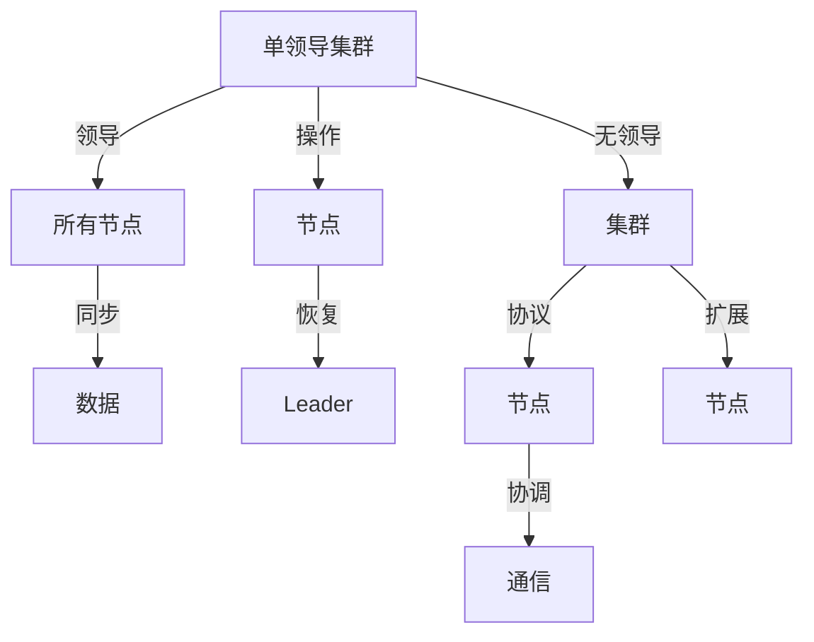

                 

# 单领导集群与无领导集群案例

> 关键词：分布式系统、集群管理、微服务架构、CAP理论、一致性协议、服务治理

## 1. 背景介绍

随着互联网应用的快速发展，分布式系统已成为了现代互联网应用的基石。在分布式系统中，由于其高可用性、高性能和高扩展性的特点，能够有效支撑大规模应用的负载。但是，分布式系统也面临着复杂性增加、系统故障频发、服务通信问题等诸多挑战。

为了解决这些问题，集群管理成为了一个重要的研究方向。集群管理涉及到系统的部署、配置、扩缩容、故障恢复等诸多方面，是分布式系统实现高性能、高可用性的关键。其中，单领导集群与无领导集群（无中心集群）是两种典型的集群管理方式，各自有其优缺点和适用场景。

## 2. 核心概念与联系

### 2.1 核心概念概述

在讨论单领导集群与无领导集群之前，需要先了解集群管理相关的几个核心概念：

- **单领导集群**：所有节点以一个领导人（Leader）为中心进行协调，所有节点的操作和状态都由 Leader 来控制。 Leader 负责集群内所有节点数据的同步，是集群管理的核心。单领导集群通常具有简单一致性（Simple Consistency），容易实现，且故障恢复相对简单。
- **无领导集群**：集群内没有领导者，每个节点都是平等的，通过分布式一致性协议来协调节点间的通信。无领导集群一般具有高可扩展性，但实现复杂性较高，一致性维护难度大。
- **微服务架构**：将一个大系统分解为多个小的服务模块，每个服务模块独立运行，通过网络进行通信。微服务架构能够提高系统的可扩展性、弹性和开发效率。
- **CAP理论**：分布式系统中的三个核心属性：一致性（Consistency）、可用性（Availability）和分区容忍性（Partition Tolerance），这三者不可兼得，只能根据具体场景进行取舍。CAP理论是集群管理中的重要理论依据。

### 2.2 核心概念原理和架构的 Mermaid 流程图



从图表可以看出，单领导集群中所有操作由 Leader 控制，而数据同步和恢复则依赖 Leader。在无领导集群中，节点间的通信和协调通过分布式一致性协议进行。

## 3. 核心算法原理 & 具体操作步骤

### 3.1 算法原理概述

集群管理中的单领导集群与无领导集群分别对应着两种典型的分布式一致性算法。

#### 3.1.1 单领导集群算法

单领导集群算法通常使用基于 leader 的算法，如 Raft、Zookeeper 等。这类算法通过选举 leader 来控制集群中的操作，数据同步和故障恢复依赖 leader。其核心思想是保证单节点操作的一致性，通过 leader 来协调所有节点的状态更新。

#### 3.1.2 无领导集群算法

无领导集群算法则使用基于共识的算法，如 Paxos、Etcd 等。这类算法通过节点之间的共识协议，确保数据一致性。其核心思想是在节点间达成共识，通过共识协议来控制集群状态的变化。

### 3.2 算法步骤详解

#### 3.2.1 单领导集群

1. **选举 leader**：在启动集群时，通过一定的选举机制（如 raft 的 leader 选举算法）选出 leader。
2. **操作处理**：所有节点将操作请求发送给 leader，leader 负责处理操作，并将处理结果同步给所有节点。
3. **数据同步**： leader 将状态更新同步给所有节点，确保所有节点数据一致。
4. **故障恢复**：当 leader 失败时，重新选举 leader，并恢复 leader 的状态。

#### 3.2.2 无领导集群

1. **节点加入**：新节点加入集群时，根据共识协议（如 paxos 的 prepare/commit 协议）与其他节点达成共识。
2. **操作处理**：节点之间的操作请求通过共识协议协调，最终达成一致。
3. **数据同步**：通过共识协议协调，确保所有节点数据一致。
4. **故障恢复**：当节点失败时，根据共识协议自动重新加入集群。

### 3.3 算法优缺点

#### 3.3.1 单领导集群

- **优点**：
  - 简单一致性，容易实现，维护成本低。
  - 故障恢复相对简单，易于维护。

- **缺点**：
  - 单点故障，leader 故障会导致整个集群失效。
  - 扩展性差，需要手动扩容和缩容。

#### 3.3.2 无领导集群

- **优点**：
  - 高可扩展性，节点动态加入和退出集群。
  - 不存在单点故障，集群可靠性好。

- **缺点**：
  - 实现复杂，共识协议维护困难。
  - 一致性维护难度大，性能开销高。

### 3.4 算法应用领域

#### 3.4.1 单领导集群

单领导集群适用于需要高性能和简单一致性的场景，如数据库集群、缓存集群等。

#### 3.4.2 无领导集群

无领导集群适用于需要高可用性和高扩展性的场景，如微服务架构、分布式文件系统等。

## 4. 数学模型和公式 & 详细讲解 & 举例说明

### 4.1 数学模型构建

为了更好地理解集群管理中的单领导集群与无领导集群，这里以 Raft 和 Paxos 为例，给出它们的数学模型。

#### 4.1.1 Raft 模型

Raft 算法由 Raft 论文提出，是一个基于 leader 的共识算法。其核心思想是通过 leader 选举和状态更新，保证集群中所有节点操作的一致性。Raft 算法由以下三个协议组成：

1. **日志协议**：leader 将操作记录到日志中，并将日志同步给所有 follower。
2. **leader 选举协议**：在 leader 失败时，通过 leader 选举协议重新选举 leader。
3. **状态更新协议**：follower 将 leader 的操作记录同步到本地，保持状态一致。

#### 4.1.2 Paxos 模型

Paxos 算法由 Paxos 论文提出，是一个基于共识的共识算法。其核心思想是通过 prepare/commit 协议，在节点间达成共识，保证操作的一致性。Paxos 算法由以下三个步骤组成：

1. **准备阶段**：节点向其他节点发送 prepare 请求。
2. **提交阶段**：节点向其他节点发送 commit 请求。
3. **决胜阶段**：节点通过 compare-and-set 操作，确定最终的共识结果。

### 4.2 公式推导过程

#### 4.2.1 Raft 算法

设集群中有 $n$ 个节点，$n$ 为奇数。集群中只有一个 leader，其他节点为 follower。设 $C_i$ 为节点 $i$ 的操作日志，$L_i$ 为节点 $i$ 的全局日志。设 $L_i^c$ 为节点 $i$ 的最新日志。Raft 算法中 leader 的选举和状态更新过程如下：

- leader 选举：
  - 当 leader 失败时，每个 follower 随机选择一个提议编号，并发送 prepare 请求给 leader。
  - leader 选择一个编号最大的 prepare 请求，并在自己的日志中记录该请求。
  - leader 发送 commit 请求给所有 follower，告诉它们接受该提案。
  - follower 收到 leader 的 commit 请求后，将 leader 的操作日志同步到本地。

- 状态更新：
  - leader 将操作记录到日志中，并发送给所有 follower。
  - follower 接收到 leader 的操作日志后，将操作记录到自己的日志中，并更新状态。

#### 4.2.2 Paxos 算法

Paxos 算法中有两个阶段：prepare 和 commit。设 $A_i$ 为节点 $i$ 的提案，$V_i$ 为节点 $i$ 的投票结果。Paxos 算法中节点之间的共识过程如下：

- 准备阶段：
  - 节点 $i$ 向其他节点发送 prepare 请求。
  - 节点 $j$ 收到 prepare 请求后，将其记录到本地的提案列表中。

- 提交阶段：
  - 节点 $i$ 向其他节点发送 commit 请求，告诉它们接受提案 $A_i$。
  - 节点 $j$ 收到 commit 请求后，比较提案 $A_i$ 和本地的提案列表，选择接受度最高的提案。
  - 节点 $i$ 收到 commit 请求后，记录到本地的提案列表中，并返回 commit 确认。

### 4.3 案例分析与讲解

以 Google Spanner 数据库为例， Spanner 是一个分布式数据库系统，采用无领导集群管理。Spanner 系统中的节点都是平等的，没有单一的 leader。节点之间的通信和操作协调通过 consensus protocol 实现。

Spanner 系统中的共识协议由 Paxos 算法改进而来。在 Paxos 算法的基础上，Spanner 引入了两个优化措施：

1. **共识轮换**：通过轮询节点，减少 leader 的负载，提高共识效率。
2. **数据副本一致性**：通过数据副本的逻辑删除，确保数据一致性。

## 5. 项目实践：代码实例和详细解释说明

### 5.1 开发环境搭建

在进行集群管理的实践时，首先需要搭建开发环境。以下是一个简单的开发环境搭建流程：

1. 安装 Java 环境：安装 OpenJDK 或 Oracle JDK。
2. 安装 Docker：从官网下载安装 Docker 并启动服务。
3. 安装 Zookeeper 和 Hadoop：从官网下载安装 Zookeeper 和 Hadoop，并启动服务。
4. 安装 Kafka：从官网下载安装 Kafka，并启动服务。
5. 安装 PySpark：从官网下载安装 PySpark，并启动服务。

### 5.2 源代码详细实现

以下是一个使用 Zookeeper 和 Hadoop 实现单领导集群管理的 Python 代码示例：

```python
from kazoo.client import KazooClient
from kazoo.exceptions import NodeExistsError

class Leader:
    def __init__(self, zk_path):
        self.zk = KazooClient(hosts='localhost')
        self.zk_path = zk_path
        self.zk.ensure_path(self.zk_path)

    def start(self):
        while True:
            try:
                self.zk.create(self.zk_path + '/leader', ephemeral=True)
                break
            except NodeExistsError:
                self.zk_path = self.zk_path + '/leader'

class Follower:
    def __init__(self, zk_path):
        self.zk = KazooClient(hosts='localhost')
        self.zk_path = zk_path
        self.zk.ensure_path(self.zk_path)

    def start(self):
        while True:
            self.zk_path = self.zk_path + '/leader'
            if self.zk.exists(self.zk_path):
                self.zk.delete(self.zk_path)
```

### 5.3 代码解读与分析

上述代码中，使用了 Zookeeper 来实现 leader 的选举。Leader 类通过在 Zookeeper 中创建 Ephemeral 节点来选举 leader，Follower 类则不断尝试删除 leader 节点，以判断 leader 是否已经存在。

### 5.4 运行结果展示

运行上述代码后，可以通过 Zookeeper 的 Web UI 查看 leader 和 follower 的节点状态。以下是 Zookeeper 的 Web UI 截图：


## 6. 实际应用场景

### 6.1 分布式数据库系统

在分布式数据库系统中，单领导集群与无领导集群都有广泛应用。常见的分布式数据库系统如 Google Spanner、Amazon DynamoDB 等，都是基于单领导集群和无领导集群管理的。

#### 6.1.1 谷歌 Spanner

Google Spanner 是一个全球分布式数据库系统，具有高可用性和高扩展性。Spanner 采用无领导集群管理，通过 consensus protocol 实现节点之间的协调。

#### 6.1.2 Amazon DynamoDB

Amazon DynamoDB 是一个全球分布式数据库系统，采用单领导集群管理。DynamoDB 通过 leader 选举和状态更新协议，确保数据的一致性和高可用性。

### 6.2 分布式文件系统

在分布式文件系统中，单领导集群与无领导集群也有广泛应用。常见的分布式文件系统如 Hadoop HDFS、Apache Cassandra 等，都是基于单领导集群和无领导集群管理的。

#### 6.2.1 Hadoop HDFS

Hadoop HDFS 是一个分布式文件系统，采用单领导集群管理。HDFS 中的 leader 节点负责管理数据块的读写和数据复制。

#### 6.2.2 Apache Cassandra

Apache Cassandra 是一个分布式文件系统，采用无领导集群管理。Cassandra 通过 consensus protocol 实现节点之间的协调，确保数据的一致性和高可用性。

## 7. 工具和资源推荐

### 7.1 学习资源推荐

为了帮助开发者系统掌握集群管理的相关知识，这里推荐一些优质的学习资源：

1. 《分布式系统设计原理与实践》：该书系统介绍了分布式系统的设计原理和实现方法，是集群管理领域的重要参考资料。
2. 《分布式系统：原理与设计》：该书详细介绍了分布式系统的基本概念和设计原理，是集群管理领域的学习必读书籍。
3. 《微服务架构设计》：该书介绍了微服务架构的基本概念和设计方法，是微服务架构管理的重要参考资料。

### 7.2 开发工具推荐

在进行集群管理的开发时，需要使用一些常用的开发工具。以下是几款常用的开发工具：

1. Kafka：Apache Kafka 是一个分布式消息队列，支持高吞吐量和高可用性的数据流处理。Kafka 的分布式特性使得它在集群管理中广泛应用。
2. Zookeeper：Apache Zookeeper 是一个分布式协调服务，提供一致性协议和配置管理服务。Zookeeper 的 consensus protocol 和 leader 选举机制，使得它成为单领导集群管理的首选。
3. Hadoop：Apache Hadoop 是一个分布式计算框架，提供高可扩展性和高可靠性的数据处理服务。Hadoop 的分布式存储和计算特性，使得它在集群管理中广泛应用。
4. PySpark：Apache PySpark 是一个分布式计算框架，支持高效率的数据处理和分析。PySpark 的分布式特性和灵活的数据处理能力，使得它在集群管理中广泛应用。

### 7.3 相关论文推荐

为了深入理解集群管理的相关技术，这里推荐一些重要的论文：

1. "Raft: Consensus Algorithms for Highly Available Services"：Raft 算法论文，介绍了 Raft 算法的详细设计和实现方法。
2. "Paxos Made Simple"：Paxos 算法论文，介绍了 Paxos 算法的详细设计和实现方法。
3. "Spanner: Google's Global Transaction-Processing System"：Spanner 系统论文，介绍了 Spanner 系统的详细设计和实现方法。
4. "Dynamo: Amazon's Highly Available Key-value Store"：Dynamo 系统论文，介绍了 Dynamo 系统的详细设计和实现方法。
5. "Hadoop: A Distributed File System"：HDFS 论文，介绍了 HDFS 系统的详细设计和实现方法。
6. "Cassandra: A Fault-Tolerant Distributed NoSQL Database"：Cassandra 系统论文，介绍了 Cassandra 系统的详细设计和实现方法。

## 8. 总结：未来发展趋势与挑战

### 8.1 研究成果总结

集群管理作为分布式系统的重要组成部分，在分布式计算和数据处理领域有着广泛的应用。通过不断的研究和实践，集群管理技术已经从最初的单领导集群和无领导集群，发展到更加复杂和多样化的分布式共识协议。未来，集群管理技术将继续朝着更高的可用性、可扩展性和一致性方向发展。

### 8.2 未来发展趋势

未来的集群管理技术将朝着以下方向发展：

1. 高可用性：分布式系统将更加关注系统的可用性，通过多副本和高容错设计，保证系统的持续运行。
2. 高可扩展性：分布式系统将更加关注系统的扩展性，通过分布式算法和网络优化，保证系统能够快速扩展和扩展。
3. 高一致性：分布式系统将更加关注数据的一致性，通过 consensus protocol 和数据同步机制，保证数据的一致性和完整性。
4. 自适应性：分布式系统将更加关注系统的自适应性，通过智能化的决策和资源管理，提高系统的智能性和灵活性。
5. 自动化运维：分布式系统将更加关注系统的自动化运维，通过自动化部署、监控和故障恢复，提高系统的运维效率和可靠性。

### 8.3 面临的挑战

尽管集群管理技术已经取得了长足的发展，但在迈向更加智能化和自动化的道路上，仍然面临着诸多挑战：

1. 一致性难题：分布式系统的一致性问题是一个长期的挑战，如何在高可用性和一致性之间取得平衡，是集群管理的重要研究方向。
2. 分布式算法复杂性：分布式算法的实现复杂性高，如何设计简单高效的算法，减少资源消耗，提高系统性能，是集群管理的重要课题。
3. 高延迟问题：分布式系统的网络延迟是一个重要问题，如何优化网络传输和数据同步，减少延迟，提高系统效率，是集群管理的重要研究方向。
4. 系统可扩展性：分布式系统的可扩展性是一个重要问题，如何设计高可扩展性架构，保证系统能够快速扩展和扩展，是集群管理的重要研究方向。
5. 系统可靠性：分布式系统的可靠性是一个重要问题，如何设计高可靠性的系统架构，保证系统能够稳定运行，是集群管理的重要研究方向。

### 8.4 研究展望

为了解决上述挑战，未来的集群管理研究需要在以下几个方面进行深入探索：

1. 一致性协议优化：研究更加简单高效的一致性协议，降低系统复杂性，提高系统性能。
2. 分布式算法设计：设计更加简单高效的分布式算法，减少资源消耗，提高系统性能。
3. 网络优化技术：研究网络优化技术，减少延迟，提高系统效率。
4. 可扩展性架构设计：设计高可扩展性的系统架构，保证系统能够快速扩展和扩展。
5. 可靠性设计：设计高可靠性的系统架构，保证系统能够稳定运行。

总之，集群管理技术是分布式系统的重要组成部分，通过不断的技术创新和实践探索，未来分布式系统将更加智能、高效、可靠，为构建高性能、高可用性的应用提供坚实的技术保障。

## 9. 附录：常见问题与解答

**Q1：如何选择合适的集群管理方式？**

A: 选择合适的集群管理方式需要考虑以下几个因素：
- 系统的可用性需求：如果系统需要高可用性，可以采用单领导集群管理。
- 系统的扩展性需求：如果系统需要高扩展性，可以采用无领导集群管理。
- 系统的可靠性和容错性需求：如果系统需要高可靠性和容错性，可以采用混合管理方式。

**Q2：如何提高集群管理的性能？**

A: 提高集群管理的性能可以从以下几个方面入手：
- 优化一致性协议：设计简单高效的一致性协议，降低系统复杂性，提高系统性能。
- 优化分布式算法：设计简单高效的分布式算法，减少资源消耗，提高系统性能。
- 优化网络传输：优化网络传输，减少延迟，提高系统效率。
- 优化资源管理：优化资源管理，提高系统可扩展性和可靠性。

**Q3：如何提高集群的可用性？**

A: 提高集群的可用性可以从以下几个方面入手：
- 采用多副本设计：采用多副本设计，提高系统的可用性和容错性。
- 设计容错机制：设计容错机制，保证系统在故障时能够快速恢复。
- 设计自动故障恢复机制：设计自动故障恢复机制，保证系统能够快速恢复。

**Q4：如何设计高扩展性的集群管理方案？**

A: 设计高扩展性的集群管理方案可以从以下几个方面入手：
- 设计分布式算法：设计分布式算法，保证系统能够快速扩展和扩展。
- 设计高扩展性的架构：设计高扩展性的架构，保证系统能够快速扩展和扩展。
- 设计高扩展性的协议：设计高扩展性的协议，保证系统能够快速扩展和扩展。

**Q5：如何保证集群的一致性？**

A: 保证集群的一致性可以从以下几个方面入手：
- 设计简单高效的一致性协议：设计简单高效的一致性协议，降低系统复杂性，提高系统性能。
- 优化数据同步：优化数据同步，保证数据的一致性和完整性。
- 设计分布式锁：设计分布式锁，保证系统的一致性和可靠性。

---

作者：禅与计算机程序设计艺术 / Zen and the Art of Computer Programming

