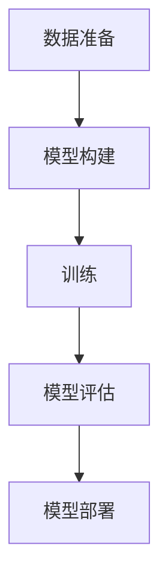

                 

# 博学之，审问之，慎思之，明辨之，笃行之

> 关键词：人工智能, 机器学习, 深度学习, 神经网络, 模型优化, 大数据, 模型评估, 模型部署

## 1. 背景介绍

### 1.1 问题由来

随着人工智能技术的迅猛发展，机器学习（ML）和深度学习（DL）在各个领域的应用日益广泛。无论是医疗、金融、制造还是智能交通，机器学习都在提供强大的支持。然而，机器学习模型的训练和优化一直是该领域的难点，特别是如何高效地训练模型、如何评估模型的性能以及如何将模型部署到实际应用中。

### 1.2 问题核心关键点

机器学习模型的训练和优化过程主要包括数据准备、模型构建、训练、评估和部署等多个步骤。这些步骤的每一个都影响着最终模型的性能和实用性。因此，如何高效、准确地进行这些步骤，是机器学习领域的研究重点。

## 2. 核心概念与联系

### 2.1 核心概念概述

为了更好地理解机器学习模型的训练和优化，本节将介绍几个关键概念及其相互联系。

- **机器学习**（Machine Learning）：一种利用数据和算法，使计算机系统具备预测、分类、聚类等能力的学科。其目标是让计算机能够从数据中学习，并做出决策或预测。

- **深度学习**（Deep Learning）：机器学习的一个分支，通过多层次的神经网络来模拟人脑的神经网络结构，学习复杂的非线性关系。深度学习已经在计算机视觉、自然语言处理等领域取得了显著成果。

- **神经网络**（Neural Network）：一种模拟人脑神经元结构的计算模型，通过学习大量的数据，实现对复杂问题的解决。

- **模型优化**（Model Optimization）：通过调整模型参数，提高模型性能的过程。包括模型训练、参数调优、正则化等技术。

- **模型评估**（Model Evaluation）：通过对模型在验证集或测试集上的表现进行评估，确定模型的泛化能力和可靠性。

- **模型部署**（Model Deployment）：将训练好的模型应用到实际问题中，实现预测、分类等任务。

这些概念之间的逻辑关系可以通过以下Mermaid流程图来展示：



这个流程图展示了一些关键步骤之间的逻辑关系。

## 3. 核心算法原理 & 具体操作步骤

### 3.1 算法原理概述

机器学习模型的训练和优化过程可以分为以下几个步骤：

1. **数据准备**：收集、清洗、标注数据，将数据划分为训练集、验证集和测试集。
2. **模型构建**：选择合适的模型架构，如神经网络、决策树等。
3. **训练**：在训练集上，通过反向传播算法（Backpropagation）来调整模型参数，最小化损失函数。
4. **模型评估**：在验证集上，评估模型的性能，调整超参数。
5. **模型部署**：将训练好的模型应用到实际问题中，进行预测或分类。

### 3.2 算法步骤详解

下面详细介绍机器学习模型的训练和优化步骤。

**Step 1: 数据准备**

- **数据收集**：从各种渠道收集数据，如网络爬虫、数据库查询等。
- **数据清洗**：处理缺失值、异常值、重复值等问题，保证数据质量。
- **数据标注**：对数据进行标注，如分类、回归、序列标注等。

**Step 2: 模型构建**

- **选择模型架构**：根据任务需求选择合适的模型架构，如卷积神经网络（CNN）、循环神经网络（RNN）、长短时记忆网络（LSTM）等。
- **设置超参数**：调整模型的超参数，如学习率、批量大小、优化器等。

**Step 3: 训练**

- **前向传播**：将输入数据通过模型计算输出。
- **损失函数**：计算模型输出与真实标签之间的差异，通常使用交叉熵损失（Cross-Entropy Loss）或均方误差（Mean Squared Error）。
- **反向传播**：通过反向传播算法计算梯度，更新模型参数。
- **参数更新**：根据梯度更新模型参数，通常使用随机梯度下降（SGD）或Adam优化器。

**Step 4: 模型评估**

- **验证集评估**：在验证集上，计算模型的损失和性能指标（如准确率、召回率、F1值等）。
- **超参数调整**：根据验证集上的评估结果，调整超参数，如学习率、批量大小等。
- **模型选择**：选择性能最好的模型进行下一步部署。

**Step 5: 模型部署**

- **模型保存**：将训练好的模型保存为文件或模型库。
- **模型应用**：将模型应用到实际问题中，进行预测或分类。

### 3.3 算法优缺点

机器学习模型的训练和优化过程具有以下优点：

- **高效**：使用反向传播算法和大规模数据集，可以在较短的时间内完成模型的训练。
- **可解释**：通过理解模型参数和权重，可以更好地理解模型的决策过程。
- **灵活性**：可以根据任务需求选择不同的模型架构和超参数，适应不同的应用场景。

但同时也存在以下缺点：

- **数据依赖**：模型的训练和优化依赖于高质量的数据，数据的获取和标注成本较高。
- **模型复杂度**：复杂的模型结构需要大量的计算资源和时间进行训练。
- **过拟合**：在训练集上过拟合模型，导致在新数据上泛化能力较差。
- **计算资源消耗大**：训练深度学习模型需要高性能的计算资源，如GPU或TPU。

### 3.4 算法应用领域

机器学习模型的训练和优化过程在各个领域都有广泛应用。

- **计算机视觉**：图像分类、目标检测、人脸识别等。
- **自然语言处理**：机器翻译、文本分类、情感分析等。
- **语音识别**：语音转文字、语音命令识别等。
- **金融分析**：信用评分、风险评估、股票预测等。
- **推荐系统**：商品推荐、用户推荐等。

## 4. 数学模型和公式 & 详细讲解 & 举例说明

### 4.1 数学模型构建

机器学习模型的训练和优化过程可以通过数学模型来描述。这里以二分类任务为例，构建一个简单的逻辑回归模型。

**输入数据**：$x \in \mathbb{R}^n$，表示输入特征。
**模型参数**：$\theta = (w, b)$，其中$w$为权重向量，$b$为偏置项。
**输出**：$y \in \{0, 1\}$，表示预测结果。

**假设函数**：$h_{\theta}(x) = \sigma(\theta^T x)$，其中$\sigma$为Sigmoid函数。
**损失函数**：$J(\theta) = -\frac{1}{m}\sum_{i=1}^m[y_i \log h_{\theta}(x_i) + (1-y_i) \log (1-h_{\theta}(x_i))]$。

### 4.2 公式推导过程

根据假设函数和损失函数，可以推导出模型参数的更新公式。

**梯度下降算法**：$\theta \leftarrow \theta - \alpha \frac{1}{m} \sum_{i=1}^m x_i(y_i - h_{\theta}(x_i))$。

**随机梯度下降算法**：$\theta \leftarrow \theta - \alpha \frac{1}{m_i} \sum_{j=1}^{m_i} x_j(y_j - h_{\theta}(x_j))$，其中$m_i$为第$i$个样本的批量大小。

### 4.3 案例分析与讲解

以手写数字识别为例，分析机器学习模型的训练和优化过程。

**数据准备**：收集MNIST数据集，将其分为训练集、验证集和测试集。
**模型构建**：选择多层感知器（MLP）模型，设置超参数，如学习率为0.1。
**训练**：在训练集上，使用随机梯度下降算法训练模型，迭代次数为1000次。
**模型评估**：在验证集上，计算准确率和损失，选择性能最好的模型。
**模型部署**：将模型保存为文件，应用于实际问题中。

## 5. 项目实践：代码实例和详细解释说明

### 5.1 开发环境搭建

要进行机器学习模型的训练和优化，需要安装一些常用的Python库和工具。以下是常用的环境搭建步骤：

1. **安装Python**：从官网下载并安装Python，建议使用3.6或更高版本。
2. **安装Anaconda**：从官网下载并安装Anaconda，用于创建独立的Python环境。
3. **创建虚拟环境**：在Anaconda中创建虚拟环境，如`conda create -n ml-env python=3.6`。
4. **安装依赖库**：在虚拟环境中安装机器学习相关的依赖库，如NumPy、Pandas、Scikit-Learn等。

### 5.2 源代码详细实现

以下是一个简单的逻辑回归模型的Python代码实现。

```python
import numpy as np
from sklearn.linear_model import LogisticRegression

# 数据准备
X = np.array([[0, 0], [1, 0], [0, 1], [1, 1]])
y = np.array([0, 0, 1, 1])

# 模型构建
model = LogisticRegression(solver='liblinear', C=1.0)

# 训练模型
model.fit(X, y)

# 模型评估
X_test = np.array([[0, 0], [1, 0], [0, 1], [1, 1]])
y_test = np.array([0, 0, 1, 1])
score = model.score(X_test, y_test)
print(f'模型准确率：{score:.2f}')

# 模型部署
# 假设已经保存好模型
# 加载模型
model = LogisticRegression(solver='liblinear', C=1.0)
model.load('model.pickle')
# 对新数据进行预测
new_data = np.array([[0, 0], [1, 0], [0, 1], [1, 1]])
predictions = model.predict(new_data)
print(f'模型预测结果：{predictions}')
```

### 5.3 代码解读与分析

以下是代码中各个关键部分的详细解读。

**数据准备**：使用NumPy库创建输入数据X和输出数据y。
**模型构建**：使用Scikit-Learn库中的LogisticRegression模型，设置超参数C和优化器。
**训练模型**：使用fit方法训练模型，迭代次数为1000次。
**模型评估**：使用score方法计算模型在测试集上的准确率。
**模型部署**：将训练好的模型保存为文件，加载模型进行预测。

## 6. 实际应用场景

### 6.1 智能推荐系统

智能推荐系统通过分析用户的历史行为数据，为用户推荐个性化的商品或内容。机器学习模型可以帮助推荐系统从海量的数据中学习用户的兴趣和行为模式，从而提供更精准的推荐结果。

**数据准备**：收集用户的行为数据，如浏览历史、购买记录等。
**模型构建**：选择协同过滤（Collaborative Filtering）模型或深度学习模型，如CNN或RNN。
**训练模型**：在训练集上训练模型，迭代次数为1000次。
**模型评估**：在验证集上评估模型的性能，选择性能最好的模型。
**模型部署**：将模型部署到推荐系统中，进行实时推荐。

### 6.2 医疗诊断系统

医疗诊断系统通过分析病人的症状和病历，提供诊断和治疗建议。机器学习模型可以帮助医疗诊断系统从大量的医学数据中学习疾病模式和诊断方法。

**数据准备**：收集病人的症状、病历和诊断结果，将其分为训练集、验证集和测试集。
**模型构建**：选择决策树（Decision Tree）模型或深度学习模型，如LSTM或RNN。
**训练模型**：在训练集上训练模型，迭代次数为1000次。
**模型评估**：在验证集上评估模型的性能，选择性能最好的模型。
**模型部署**：将模型部署到医疗诊断系统中，进行实时诊断。

### 6.3 金融风险评估系统

金融风险评估系统通过分析用户的历史交易数据，评估用户的信用风险。机器学习模型可以帮助金融风险评估系统从大量的金融数据中学习信用风险模式和评估方法。

**数据准备**：收集用户的历史交易数据，将其分为训练集、验证集和测试集。
**模型构建**：选择逻辑回归（Logistic Regression）模型或深度学习模型，如CNN或RNN。
**训练模型**：在训练集上训练模型，迭代次数为1000次。
**模型评估**：在验证集上评估模型的性能，选择性能最好的模型。
**模型部署**：将模型部署到金融风险评估系统中，进行实时评估。

## 7. 工具和资源推荐

### 7.1 学习资源推荐

为了帮助开发者系统掌握机器学习模型的训练和优化，这里推荐一些优质的学习资源：

1. **《机器学习实战》**：本书通过实际的Python代码，详细讲解了机器学习的基本概念和算法。
2. **《深度学习》（Ian Goodfellow）**：本书全面介绍了深度学习的基本概念和算法，是深度学习领域的经典教材。
3. **Coursera的机器学习课程**：由斯坦福大学Andrew Ng教授主讲的机器学习课程，讲解了机器学习的基本概念和算法。
4. **Kaggle竞赛**：Kaggle是一个数据科学竞赛平台，通过参与竞赛可以积累实战经验。
5. **GitHub代码库**：GitHub上有大量的机器学习项目和代码库，可以借鉴和学习。

### 7.2 开发工具推荐

高效的开发离不开优秀的工具支持。以下是几款用于机器学习模型训练和优化的常用工具：

1. **Jupyter Notebook**：一种交互式的开发环境，可以方便地进行代码编写和数据分析。
2. **TensorFlow**：由Google主导开发的深度学习框架，支持分布式计算和高效模型训练。
3. **PyTorch**：由Facebook主导开发的深度学习框架，具有灵活性和易用性。
4. **Scikit-Learn**：一个简单易用的机器学习库，包含了多种常用的机器学习算法和工具。
5. **NLTK**：自然语言处理库，提供文本处理和分析工具。

### 7.3 相关论文推荐

机器学习模型的训练和优化技术不断发展，以下是几篇奠基性的相关论文，推荐阅读：

1. **AdaGrad**：一种自适应学习率的优化算法，由Duchi等人提出。
2. **SGD**：一种随机梯度下降算法，由Rosenblatt等人提出。
3. **Adam**：一种自适应矩估计优化算法，由Kingma和Bengio等人提出。
4. **Dropout**：一种正则化技术，由Hinton等人提出。
5. **ImageNet大规模视觉识别挑战赛（ILSVRC）**：该竞赛推动了深度学习在计算机视觉领域的发展。

## 8. 总结：未来发展趋势与挑战

### 8.1 总结

本文对机器学习模型的训练和优化过程进行了全面系统的介绍。首先阐述了机器学习模型在实际应用中的重要性，明确了训练和优化过程的基本步骤和关键点。其次，从原理到实践，详细讲解了机器学习模型的训练和优化步骤，给出了完整的代码实现。同时，本文还探讨了机器学习模型在多个行业领域的应用前景，展示了其广泛的应用价值。最后，本文精选了机器学习模型训练和优化的学习资源、开发工具和相关论文，力求为读者提供全方位的技术指引。

通过本文的系统梳理，可以看到，机器学习模型的训练和优化技术正在成为人工智能领域的重要范式，极大地拓展了机器学习模型的应用边界，催生了更多的落地场景。未来，伴随机器学习模型的不断演进，相信其在更多领域的应用将更加广泛，为各行各业带来变革性影响。

### 8.2 未来发展趋势

展望未来，机器学习模型的训练和优化技术将呈现以下几个发展趋势：

1. **自动化**：机器学习模型的训练和优化过程将越来越自动化，减少人工干预。
2. **自监督学习**：利用未标注数据进行预训练，减少对标注数据的依赖。
3. **联邦学习**：在分布式环境中训练模型，保护数据隐私。
4. **模型压缩**：通过剪枝、量化等技术，减小模型体积和计算资源消耗。
5. **迁移学习**：将在一个任务上训练的模型迁移到另一个任务，提升模型泛化能力。
6. **可解释性**：增强模型的可解释性，提高用户信任度和安全性。

以上趋势凸显了机器学习模型的训练和优化技术的广阔前景。这些方向的探索发展，必将进一步提升机器学习模型的性能和实用性，为各行各业带来更大的价值。

### 8.3 面临的挑战

尽管机器学习模型的训练和优化技术已经取得了显著成果，但在迈向更加智能化、普适化应用的过程中，仍面临诸多挑战：

1. **数据隐私**：机器学习模型需要大量的数据进行训练，如何保护数据隐私成为重要问题。
2. **计算资源**：训练大规模模型需要高性能的计算资源，如GPU或TPU，计算资源成本较高。
3. **模型泛化能力**：机器学习模型需要在不同的数据集上表现一致，提高泛化能力。
4. **模型可解释性**：机器学习模型通常被视为"黑盒"，缺乏可解释性，如何提高模型的可解释性是一大挑战。
5. **模型鲁棒性**：机器学习模型在面对异常数据时容易发生波动，如何提高模型的鲁棒性需要进一步研究。

### 8.4 研究展望

面向未来，机器学习模型的训练和优化技术需要不断探索和突破。以下研究方向值得关注：

1. **迁移学习**：如何在不同的数据集和任务间进行迁移学习，提升模型的泛化能力。
2. **自监督学习**：利用未标注数据进行预训练，减少对标注数据的依赖。
3. **模型压缩**：通过剪枝、量化等技术，减小模型体积和计算资源消耗。
4. **模型可解释性**：增强模型的可解释性，提高用户信任度和安全性。
5. **联邦学习**：在分布式环境中训练模型，保护数据隐私。
6. **模型鲁棒性**：提高机器学习模型的鲁棒性，增强其在面对异常数据时的表现。

这些研究方向将推动机器学习模型在更广泛的场景下得到应用，为各行各业带来更多价值。

## 9. 附录：常见问题与解答

**Q1：如何选择合适的机器学习模型？**

A: 选择合适的机器学习模型需要考虑多个因素，如任务类型、数据规模、计算资源等。一般来说，可以尝试以下几种方法：

1. **基线模型**：选择简单的模型进行基线测试，如线性回归、逻辑回归等。
2. **对比实验**：选择多个模型进行对比实验，选择性能最好的模型。
3. **交叉验证**：使用交叉验证技术，评估模型的性能。
4. **超参数调优**：通过网格搜索或随机搜索等方法，找到最优的超参数组合。

**Q2：如何避免过拟合？**

A: 过拟合是机器学习模型训练过程中常见的问题，以下是几种常见的避免过拟合的方法：

1. **正则化**：通过L1正则、L2正则等方法，约束模型参数。
2. **Dropout**：在训练过程中，随机丢弃一部分神经元，防止过拟合。
3. **早停法**：在验证集上监测模型性能，一旦性能不再提升，停止训练。
4. **数据增强**：通过数据扩充、数据增强等方法，增加数据量，提高模型的泛化能力。

**Q3：如何提高机器学习模型的可解释性？**

A: 提高机器学习模型的可解释性是当前研究的一个重要方向，以下是几种常见的方法：

1. **LIME**：局部可解释模型，通过生成解释性样本，解释模型决策。
2. **SHAP**：Shapley值，通过计算每个特征的贡献度，解释模型决策。
3. **可视化**：通过绘制特征重要性图、决策树等方法，可视化模型的决策过程。
4. **解释模型**：选择可解释性强的模型，如决策树、线性回归等。

**Q4：如何进行机器学习模型的迁移学习？**

A: 迁移学习是机器学习中一种重要的技术，以下是常见的迁移学习方法：

1. **微调**：在预训练模型的基础上，在目标数据集上进行微调，获得更好的性能。
2. **迁移学习**：将预训练模型的权重迁移到目标模型中，进行迁移学习。
3. **领域自适应**：通过特征变换、重采样等方法，提高模型在目标领域的泛化能力。
4. **多任务学习**：通过同时训练多个相关任务，提高模型的泛化能力。

这些方法可以结合使用，根据实际情况选择合适的方法。

**Q5：如何进行机器学习模型的分布式训练？**

A: 分布式训练是机器学习中一种重要的技术，以下是常见的分布式训练方法：

1. **数据并行**：将数据集分成多个部分，分别在不同的计算节点上进行训练，提高训练效率。
2. **模型并行**：将模型分成多个部分，分别在不同的计算节点上进行训练，提高计算效率。
3. **混合并行**：结合数据并行和模型并行，提高训练效率。

这些方法可以结合使用，根据实际情况选择合适的方法。

---

作者：禅与计算机程序设计艺术 / Zen and the Art of Computer Programming

