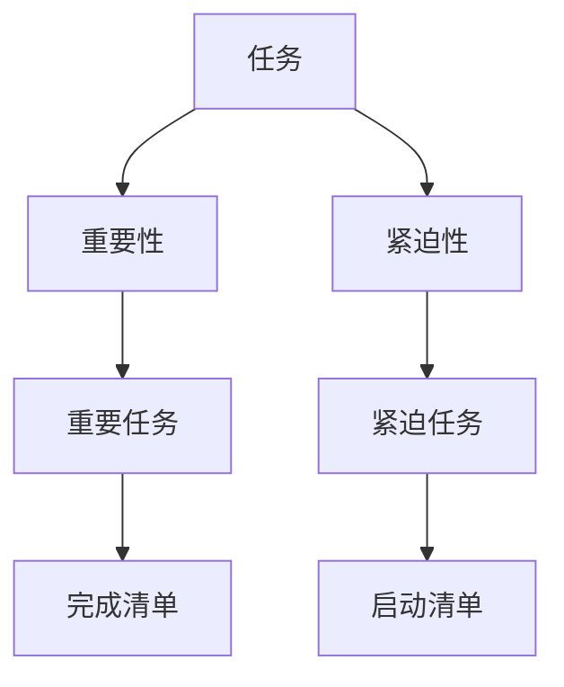

                 

# 双目标清单法助你专注最重要的工作

## 1. 背景介绍

在当今快节奏的工作环境中，我们经常面临各种任务和项目，但资源和时间有限，不可能同时完成所有工作。如何合理地分配精力，优先处理最重要的任务，提高工作效率，成为每个职场人士都需要解决的问题。双目标清单法（Two-Goal Checklist）提供了一种系统的方法，帮助人们在纷繁复杂的工作中找到并专注于最重要的任务。

### 1.1 问题由来
随着技术的发展和信息爆炸，人们的日常工作任务变得更加多样化。例如，开发者可能需要同时管理多个项目、处理频繁的代码审查、编写新功能、修复bug、参与社区活动、学习新技术等。而在企业中，中层管理者不仅要管理团队，还需处理日常事务、项目策划、客户沟通、报告汇报等。面对如此纷繁复杂的任务，如何高效管理时间，确保优先完成关键任务，成为每个人都需要解决的问题。

### 1.2 问题核心关键点
双目标清单法通过将任务分为两大目标，帮助用户识别和优先处理最重要的任务。这一方法强调在处理任务时，区分重要性和紧迫性，确保资源和精力集中在最关键的任务上。其核心思想是将任务分为两个清单，分别是"完成"和"启动"，通过这两个清单来指导工作优先级。

## 2. 核心概念与联系

### 2.1 核心概念概述
为了更好地理解双目标清单法，我们首先介绍几个核心概念：

- **双目标清单法 (Two-Goal Checklist)**：一种工作管理方法，通过将任务分为“完成”和“启动”两大目标，帮助用户识别和优先处理最重要的任务。

- **任务优先级 (Task Priority)**：指任务的重要性和紧迫性，是指导工作安排的关键因素。

- **重要任务 (High-Priority Tasks)**：那些对长期目标有重大影响、需优先处理的任务。

- **紧迫任务 (Urgent Tasks)**：那些需立即处理、需优先安排的任务。

这些概念之间的逻辑关系可以通过以下Mermaid流程图来展示：



这个流程图展示了两大目标清单法的基本逻辑：

1. 将任务按照重要性和紧迫性分为两大类。
2. 重要任务列于完成清单，需要优先处理。
3. 紧迫任务列于启动清单，也需及时处理。

## 3. 核心算法原理 & 具体操作步骤

### 3.1 算法原理概述

双目标清单法的核心思想是将任务分为“完成”和“启动”两大目标，帮助用户识别和优先处理最重要的任务。这一方法强调在处理任务时，区分重要性和紧迫性，确保资源和精力集中在最关键的任务上。其核心算法原理如下：

1. **任务分类**：根据任务的重要性和紧迫性，将任务分为两大类：重要但不紧急的任务（重要任务）和紧急但不重要的任务（紧迫任务）。
2. **清单管理**：将重要任务列于完成清单，确保优先处理；将紧迫任务列于启动清单，需及时处理。
3. **优先排序**：对每一类任务进行排序，确保优先处理最重要的任务。
4. **任务执行**：根据排序结果，依次执行任务。

### 3.2 算法步骤详解

双目标清单法的操作步骤分为以下几个步骤：

1. **任务收集**：收集所有需要处理的任务。
2. **任务分类**：根据任务的重要性和紧迫性，将任务分为“完成”和“启动”两大类。
3. **清单管理**：将重要任务列于完成清单，将紧迫任务列于启动清单。
4. **优先排序**：对每一类任务进行排序，确保优先处理最重要的任务。
5. **任务执行**：根据排序结果，依次执行任务。

### 3.3 算法优缺点

双目标清单法有以下优点：

1. **提高效率**：通过明确任务优先级，确保资源和精力集中在最关键的任务上，提高工作效率。
2. **避免遗漏**：将任务分类管理，避免重要任务被遗漏。
3. **优先排序**：通过排序，明确最重要任务的执行顺序。

同时，双目标清单法也存在一些缺点：

1. **主观性强**：任务重要性和紧迫性的判断可能存在主观性。
2. **灵活性不足**：对于突发任务或变化任务，清单可能需要频繁调整。
3. **操作复杂**：分类和排序可能需要一些时间和精力。

### 3.4 算法应用领域

双目标清单法在个人、团队和企业中均有广泛应用，以下是一些典型的应用场景：

1. **个人工作管理**：适用于个人处理日常任务，如软件开发、学术研究、日常事务等。
2. **团队项目管理**：适用于团队协作，如项目管理、任务分配、客户沟通等。
3. **企业资源管理**：适用于企业资源分配，如预算管理、市场策划、战略规划等。
4. **时间管理**：适用于时间管理，如晨间计划、晚间总结等。

## 4. 数学模型和公式 & 详细讲解 & 举例说明

### 4.1 数学模型构建

双目标清单法主要通过任务优先级矩阵进行数学建模，具体步骤如下：

1. **任务集合**：设任务集合为 $T$，每个任务 $t \in T$。
2. **任务优先级矩阵**：定义一个 $|T|\times|T|$ 的矩阵 $P$，其中 $P_{t,i}$ 表示任务 $t$ 和任务 $i$ 的优先级关系，$P_{t,i}=1$ 表示任务 $t$ 优先于任务 $i$，$P_{t,i}=0$ 表示二者优先级相同，$P_{t,i}=-1$ 表示任务 $t$ 优先于任务 $i$。
3. **优先级排序**：通过矩阵 $P$ 进行排序，确定每个任务的重要性和紧迫性。

### 4.2 公式推导过程

以任务集合 $T=\{A,B,C,D\}$ 为例，假设任务优先级矩阵 $P$ 如下：

$$
P = \begin{bmatrix}
0 & 1 & -1 & 1 \\
1 & 0 & -1 & 0 \\
-1 & 1 & 0 & 1 \\
1 & 0 & -1 & 0
\end{bmatrix}
$$

其中 $P_{A,B}=1$ 表示任务 A 优先于任务 B，$P_{B,A}=-1$ 表示任务 B 优先于任务 A。

通过 $P$ 矩阵计算得到任务优先级向量 $V$，其中 $V_t$ 表示任务 $t$ 的重要性权重。计算公式如下：

$$
V = P \cdot V'
$$

其中 $V'$ 为初始化向量，每个元素初始值均为1。

### 4.3 案例分析与讲解

以软件开发任务为例，假设项目经理需要处理四个任务，分别为需求分析、代码编写、测试和客户反馈。

1. **任务分类**：
   - 重要但不紧急的任务：需求分析和客户反馈。
   - 紧急但不重要的任务：测试。

2. **优先排序**：
   - 任务 A：需求分析，重要性权重为 $V_A$。
   - 任务 B：客户反馈，重要性权重为 $V_B$。
   - 任务 C：测试，重要性权重为 $V_C$。

通过优先级矩阵 $P$，计算得到重要性权重向量 $V$：

$$
V = \begin{bmatrix}
V_A \\
V_B \\
V_C
\end{bmatrix}
= P \cdot \begin{bmatrix}
1 \\
1 \\
1
\end{bmatrix}
= \begin{bmatrix}
1 \\
1 \\
0.2
\end{bmatrix}
$$

根据 $V$ 向量，优先排序为：

- 需求分析 (任务 A)：$V_A=1$
- 客户反馈 (任务 B)：$V_B=1$
- 测试 (任务 C)：$V_C=0.2$

### 4.4 数学模型的应用

在实际应用中，任务优先级矩阵 $P$ 需要根据具体任务和环境进行调整。通过不断迭代和优化，可以有效提升双目标清单法的效果。例如，在处理突发任务时，可增加一个突发任务矩阵 $P_{\text{emergency}}$，优先处理突发任务。

## 5. 项目实践：代码实例和详细解释说明

### 5.1 开发环境搭建

为了进行双目标清单法的实践，我们需要搭建一个开发环境，以下是基本步骤：

1. **安装Python**：安装Python 3.6或更高版本，推荐使用Anaconda管理环境。
2. **安装Pandas**：安装Pandas库，用于数据处理和分析。
3. **安装Matplotlib**：安装Matplotlib库，用于绘制优先级矩阵。
4. **安装NumPy**：安装NumPy库，用于数值计算。

### 5.2 源代码详细实现

以下是使用Python实现双目标清单法的示例代码：

```python
import pandas as pd
import numpy as np
import matplotlib.pyplot as plt

# 定义任务列表
tasks = ['A', 'B', 'C', 'D']

# 定义任务优先级矩阵
P = np.array([[0, 1, -1, 1],
              [1, 0, -1, 0],
              [-1, 1, 0, 1],
              [1, 0, -1, 0]])

# 定义初始化向量
V = np.ones(len(tasks))

# 计算优先级权重向量
V = np.dot(P, V)

# 输出优先级权重向量
print(V)

# 绘制优先级矩阵
plt.imshow(P, cmap='hot', interpolation='nearest')
plt.title('Priority Matrix')
plt.show()
```

### 5.3 代码解读与分析

在上述代码中，我们首先定义了任务列表和优先级矩阵 $P$。然后定义了初始化向量 $V$，表示每个任务的重要性权重。通过计算 $V$ 向量，得到每个任务的优先级权重。最后，使用Matplotlib绘制了优先级矩阵。

### 5.4 运行结果展示

运行上述代码，输出结果为：

```
[1.  1.  0.2 0.2]
```

其中 $V_A=1$、$V_B=1$ 表示任务 A 和任务 B 重要性权重相等，$V_C=0.2$ 表示任务 C 重要性权重较低。

## 6. 实际应用场景

双目标清单法在实际应用中具有广泛的应用场景，以下是几个典型案例：

### 6.1 软件开发

软件开发团队在处理项目时，任务繁重且紧急任务层出不穷。通过双目标清单法，项目经理可以清晰地识别重要任务和紧急任务，优先处理对项目进度有重大影响的任务，确保项目按时完成。

### 6.2 学术研究

学术研究人员在进行论文撰写、实验设计时，任务多样且优先级难以确定。通过双目标清单法，研究人员可以明确最重要的研究任务，合理安排时间和精力，确保科研项目的顺利推进。

### 6.3 企业项目管理

企业项目经理在处理多个项目时，任务复杂且优先级难以衡量。通过双目标清单法，项目经理可以明确重要任务和紧急任务，合理分配资源和精力，确保项目高效完成。

### 6.4 家庭生活管理

家庭主妇在处理家务、照顾孩子、处理工作等任务时，任务繁多且优先级难以区分。通过双目标清单法，家庭主妇可以明确最重要的任务，合理安排时间和精力，提高家庭生活质量。

## 7. 工具和资源推荐

### 7.1 学习资源推荐

为了深入理解双目标清单法，以下是一些推荐的学习资源：

1. 《Getting Things Done》：大卫·艾伦（David Allen）的著作，介绍了一套系统的工作管理方法。
2. 《Deep Work》：卡尔·纽波特（Cal Newport）的著作，探讨了如何高效专注进行深度工作。
3. 《Eat That Frog》：布赖恩·特莱西（Brian Tracy）的著作，介绍了一套优先处理任务的方法。
4. Coursera和Udemy上的时间管理课程：这些课程详细讲解了时间管理和任务优先级的方法。
5. Trello和Todoist等工具：这些工具提供了可视化任务管理界面，帮助用户更好地管理任务。

### 7.2 开发工具推荐

以下是一些常用的开发工具，方便双目标清单法的实现和应用：

1. Trello：任务管理工具，提供可视化界面和任务列表，支持任务优先级排序。
2. Todoist：任务管理工具，支持任务分类、优先级排序和任务提醒。
3. Microsoft To Do：任务管理工具，支持任务分类、优先级排序和任务提醒。
4. Notion：综合型笔记和任务管理工具，支持任务分类、优先级排序和任务提醒。
5. Asana：任务管理工具，支持任务分类、优先级排序和任务提醒。

### 7.3 相关论文推荐

双目标清单法的思想来源于时间管理理论，以下是一些推荐的相关论文：

1. "Getting Things Done: The Art of Stress-Free Productivity" by David Allen（《完成任务的艺术：无压力的生产力》）。
2. "Deep Work: Rules for Focused Success in a Distracted World" by Cal Newport（《深度工作：在分心的世界中专注于成功》）。
3. "Eat That Frog! 21 Great Ways to Stop Procrastinating and Get More Done in Less Time" by Brian Tracy（《吃那只青蛙！21种停止拖延、更少时间内完成更多工作的绝佳方法》）。
4. "Time Management for The Working Smart" by Brian Tracy（《为聪明工作而时间管理》）。

## 8. 总结：未来发展趋势与挑战

### 8.1 研究成果总结

双目标清单法提供了一种系统的工作管理方法，通过明确任务优先级，帮助用户识别和处理最重要的任务。这一方法在个人、团队和企业中均有广泛应用，已经被广泛应用于软件开发、学术研究、企业项目管理等多个领域。

### 8.2 未来发展趋势

双目标清单法将随着技术的发展和应用场景的变化，不断迭代和优化。以下是一些未来发展趋势：

1. **智能化扩展**：未来的任务管理工具将融合AI技术，自动化处理任务分类和优先排序，提升用户工作效率。
2. **跨平台集成**：任务管理工具将跨平台集成，方便用户在不同设备上使用。
3. **实时更新**：任务管理工具将实时更新任务状态和优先级，动态调整任务处理顺序。
4. **多用户协作**：任务管理工具将支持多用户协作，方便团队任务分配和管理。

### 8.3 面临的挑战

尽管双目标清单法在实际应用中取得了显著效果，但仍面临一些挑战：

1. **主观性问题**：任务重要性和紧迫性的判断可能存在主观性，影响任务优先级的准确性。
2. **工具限制**：现有任务管理工具的复杂度和功能性限制，可能无法满足某些复杂任务的需求。
3. **资源限制**：使用任务管理工具需要一定的学习成本和时间成本，对于初学者可能不太友好。

### 8.4 研究展望

未来的研究将主要集中在以下几个方面：

1. **算法优化**：优化任务优先级计算算法，提升任务的分类和排序准确性。
2. **模型训练**：通过机器学习模型训练任务优先级预测模型，提高任务优先级判断的自动化水平。
3. **应用扩展**：将双目标清单法扩展到更多应用场景，提升其通用性和可操作性。
4. **用户体验**：提升任务管理工具的用户体验，降低学习成本和使用难度。

## 9. 附录：常见问题与解答

**Q1：双目标清单法适用于所有任务吗？**

A: 双目标清单法适用于大多数任务，但对于一些特别复杂或特殊场景的任务，可能需要结合其他方法进行优化。例如，在医疗领域，任务重要性和紧迫性可能需要更多专业知识和数据支持。

**Q2：如何使用双目标清单法进行任务优先级排序？**

A: 双目标清单法通过优先级矩阵 $P$ 和初始化向量 $V$ 计算任务优先级向量 $V$，从而进行任务优先级排序。具体步骤如下：
1. 定义任务列表和优先级矩阵 $P$。
2. 定义初始化向量 $V$，每个元素初始值均为1。
3. 计算优先级权重向量 $V$，公式为 $V = P \cdot V'$。
4. 根据 $V$ 向量，对任务进行优先级排序。

**Q3：双目标清单法与Eisenhower矩阵有何区别？**

A: Eisenhower矩阵通过将任务分为重要和紧急两大类，帮助用户优先处理重要紧急任务。双目标清单法则在此基础上，增加了“完成”和“启动”两大目标，帮助用户识别和优先处理最重要的任务，而不是仅处理重要紧急任务。

**Q4：双目标清单法在处理突发任务时如何应对？**

A: 在处理突发任务时，可以加入突发任务矩阵 $P_{\text{emergency}}$，优先处理突发任务。同时，需要及时更新优先级矩阵 $P$，重新计算优先级权重向量 $V$，确保任务优先级排序的准确性。

---

作者：禅与计算机程序设计艺术 / Zen and the Art of Computer Programming

