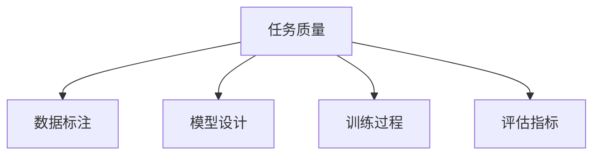
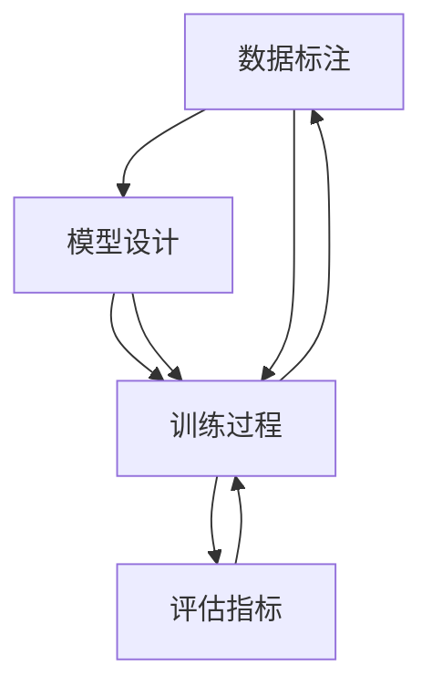

                 

# 反思和改进：提高任务质量

## 1. 背景介绍

在人工智能领域，任务质量的高低直接影响着算法性能的优劣。高质量的任务能够提升模型的泛化能力和鲁棒性，确保模型在不同的数据和场景下表现稳定。然而，由于数据标注的复杂性、模型设计的局限性以及训练过程中的不确定性，任务质量的提升并非易事。本文旨在深入反思任务质量的影响因素，提出有效的改进策略，以期在未来的研究与实践中，不断提升AI任务的综合水平。

## 2. 核心概念与联系

### 2.1 核心概念概述

为了更好地理解如何提高任务质量，我们首先需要明确几个核心概念及其相互关系：

- **任务质量(Quality of Task)**：指的是任务的定义、数据标注和评估方法是否合理、标准和一致，以及任务难易程度是否适中，这些因素共同决定了任务的性能和应用效果。

- **数据标注(Labeled Data)**：指的是将现实世界中的数据（如图片、文本、音频等）转化为机器可读的格式，并标注出正确的标签或答案。标注数据的质量直接影响模型的训练效果。

- **模型设计(Model Design)**：指在模型设计时所采用的架构、超参数和正则化技术等，这些因素决定了模型的表达能力和泛化能力。

- **训练过程(Training Process)**：包括数据增强、正则化、对抗训练、学习率调整等环节，这些策略能够影响模型的收敛速度和泛化性能。

- **评估指标(Evaluation Metrics)**：用于衡量模型性能的关键指标，包括准确率、召回率、F1分数、ROC曲线等。选择合适的评估指标是确保任务质量的重要前提。

这些概念之间通过如下关系紧密相连：



### 2.2 核心概念原理和架构的 Mermaid 流程图



这个图表展示了数据标注、模型设计、训练过程和评估指标之间的相互影响关系。

## 3. 核心算法原理 & 具体操作步骤

### 3.1 算法原理概述

提高任务质量的核心在于确保数据的标注准确性、模型的合理设计和有效的训练过程。以下是基于这些原则的核心算法原理：

1. **数据清洗与增强**：确保标注数据的质量，通过去除噪声数据、填补缺失值、数据扩充等手段提高数据集的质量。

2. **正则化与正则化参数的选择**：采用L1/L2正则化、Dropout等方法，防止模型过拟合，并通过交叉验证等手段选择合适的正则化参数。

3. **对抗训练与噪声注入**：通过引入对抗样本和噪声数据，提高模型的鲁棒性和泛化能力。

4. **学习率与学习率调度**：选择合适的学习率，并使用Warmup、Cosine Anneling等策略，确保模型能够平稳收敛。

5. **模型融合与集成学习**：通过集成多个模型，或将多个模型的输出进行加权平均，提升模型的综合性能。

6. **评估指标的选择与调整**：根据任务特点，选择合适的评估指标，并调整指标权重，确保模型的预测结果与实际需求一致。

### 3.2 算法步骤详解

#### 步骤1: 数据清洗与增强

数据清洗与增强是提高任务质量的重要步骤。主要包括以下几个关键步骤：

1. **噪声数据检测与去除**：
   - 利用统计方法或异常检测算法，识别并去除数据集中的异常点和噪声数据。
   - 常见的方法包括基于统计的IQR（四分位数间距）、基于距离的Z-score（标准差）和基于模型的离群点检测。

2. **缺失值处理**：
   - 对于存在缺失值的数据，可以采用均值、中位数、众数等方法进行填补。
   - 更高级的补全方法包括插值法（如线性插值、多项式插值）、模型预测法（如KNN、SVM）等。

3. **数据扩充**：
   - 通过数据增强技术，生成新的数据样本，以扩大训练集的大小。
   - 常用的数据增强方法包括图像旋转、翻转、缩放、裁剪、加噪声等。

#### 步骤2: 正则化与正则化参数的选择

正则化是防止模型过拟合的有效手段。常用的正则化方法包括L1正则化、L2正则化和Dropout等。

1. **L1/L2正则化**：
   - 通过添加L1或L2正则项，限制模型的复杂度，防止过拟合。
   - L1正则化通过惩罚模型权重的绝对值，使其稀疏化，减小模型复杂度。
   - L2正则化通过惩罚模型权重的平方和，使权重分布更加平滑。

2. **Dropout**：
   - 随机地将一部分神经元的输出设置为0，以防止过拟合。
   - Dropout在训练过程中随机选择神经元进行丢弃，从而使得模型学习到更鲁棒的特征。

3. **正则化参数的选择**：
   - 正则化参数的选择通常通过交叉验证确定。
   - 常用的方法包括网格搜索、随机搜索和贝叶斯优化等。

#### 步骤3: 对抗训练与噪声注入

对抗训练和噪声注入是提高模型鲁棒性的有效方法。

1. **对抗训练**：
   - 通过生成对抗样本，提高模型对输入数据的鲁棒性。
   - 具体流程包括生成对抗样本、计算梯度、更新模型参数等步骤。

2. **噪声注入**：
   - 在训练过程中，引入噪声数据，增加模型的泛化能力。
   - 噪声注入方法包括数据随机扰动、噪声数据扩充等。

#### 步骤4: 学习率与学习率调度

学习率是影响模型收敛速度和质量的重要参数。

1. **学习率的选择**：
   - 学习率的选择通常通过实验确定，一般建议从小学习率开始，逐步增加。
   - 常见的学习率调度方法包括固定学习率、指数衰减学习率和动态学习率等。

2. **学习率调度策略**：
   - 固定学习率：保持学习率不变，直到训练结束。
   - 指数衰减学习率：随着训练轮数的增加，学习率呈指数级衰减。
   - 动态学习率：根据模型表现动态调整学习率，如Cosine Anneling、Adaptive Learning Rate等。

#### 步骤5: 模型融合与集成学习

模型融合与集成学习是提升模型综合性能的有效手段。

1. **模型融合**：
   - 通过融合多个模型的输出，提升模型的综合性能。
   - 常见的融合方法包括加权平均、投票法等。

2. **集成学习**：
   - 通过组合多个模型的预测结果，提高模型的泛化能力。
   - 集成学习方法包括Bagging、Boosting等。

#### 步骤6: 评估指标的选择与调整

评估指标是衡量模型性能的关键，正确的选择和调整评估指标是确保任务质量的重要前提。

1. **评估指标的选择**：
   - 根据任务类型选择合适的评估指标，如分类任务中的准确率、召回率、F1分数等。
   - 同时考虑评估指标的公平性和多样性，避免单一指标的局限性。

2. **评估指标的调整**：
   - 根据任务特点和应用场景，调整指标权重，确保模型预测结果与实际需求一致。
   - 常见的调整方法包括加权平均、优化目标函数等。

### 3.3 算法优缺点

提高任务质量的算法具有以下优点：

1. **提升模型泛化能力**：通过数据清洗与增强、正则化与正则化参数的选择、对抗训练与噪声注入等手段，可以提升模型的泛化能力和鲁棒性，使其在新的数据上表现稳定。

2. **降低模型过拟合风险**：通过正则化、Dropout等方法，可以有效降低模型过拟合的风险，确保模型在训练集和测试集上的性能一致。

3. **增加模型鲁棒性**：通过对抗训练和噪声注入，可以提升模型对输入数据的鲁棒性，使其在面对噪声和对抗样本时仍能保持较高的准确率。

4. **提高模型效率**：通过模型融合与集成学习，可以将多个模型的优势整合，提高模型的综合性能和效率。

5. **优化评估指标**：通过评估指标的选择与调整，可以确保模型预测结果与实际需求一致，提升模型的应用价值。

同时，提高任务质量的算法也存在以下缺点：

1. **计算资源消耗大**：数据清洗与增强、对抗训练和噪声注入等步骤需要大量的计算资源和时间，可能限制某些小规模研究的应用。

2. **模型设计复杂**：正则化、Dropout、对抗训练等方法需要设计复杂的网络结构和训练策略，对研究者的技术水平要求较高。

3. **数据质量依赖性强**：数据清洗与增强的效果高度依赖于数据质量，低质量的数据可能导致算法的失效。

### 3.4 算法应用领域

提高任务质量的算法在多个领域得到了广泛应用：

1. **计算机视觉**：在图像分类、目标检测、图像分割等任务中，通过数据增强、对抗训练等手段，提升模型性能。

2. **自然语言处理**：在文本分类、语言建模、机器翻译等任务中，通过正则化、Dropout等方法，提升模型泛化能力和鲁棒性。

3. **语音识别**：在语音识别、语音合成等任务中，通过噪声注入、对抗训练等手段，提升模型的鲁棒性和泛化能力。

4. **推荐系统**：在推荐系统任务中，通过模型融合、集成学习等手段，提升推荐精度和多样性。

## 4. 数学模型和公式 & 详细讲解 & 举例说明

### 4.1 数学模型构建

基于上述算法原理，我们可以构建一个通用的数学模型来描述任务质量的提升过程。

设任务质量为 $Q$，数据集为 $D$，模型为 $M$，训练过程为 $T$。则任务质量的提升过程可以表示为：

$$
Q = f(D, M, T)
$$

其中，$D$ 表示标注数据集，$M$ 表示模型，$T$ 表示训练过程。函数 $f$ 描述了数据、模型和训练过程对任务质量的影响。

### 4.2 公式推导过程

为了更好地理解上述模型，我们将推导出一些具体的公式。

1. **数据清洗与增强的数学模型**：
   - 假设原始数据集为 $D_0$，经过清洗和增强后，得到新的数据集 $D_1$。
   - 数据清洗与增强的数学模型为：
   $$
   D_1 = g(D_0)
   $$

2. **正则化的数学模型**：
   - 假设原始模型为 $M_0$，经过正则化后，得到新的模型 $M_1$。
   - 正则化的数学模型为：
   $$
   M_1 = h(M_0)
   $$

3. **对抗训练的数学模型**：
   - 假设原始模型为 $M_0$，经过对抗训练后，得到新的模型 $M_2$。
   - 对抗训练的数学模型为：
   $$
   M_2 = k(M_0)
   $$

### 4.3 案例分析与讲解

以图像分类任务为例，分析提高任务质量的具体步骤和数学模型。

1. **数据清洗与增强**：
   - 假设原始图像数据集为 $D_0$，存在噪声和缺失值。
   - 通过图像旋转、翻转、缩放等数据增强方法，生成新的数据集 $D_1$。
   - 数据清洗与增强的数学模型为：
   $$
   D_1 = g(D_0)
   $$

2. **正则化与正则化参数的选择**：
   - 假设原始模型为 $M_0$，经过L1正则化和Dropout处理后，得到新的模型 $M_1$。
   - 正则化的数学模型为：
   $$
   M_1 = h(M_0)
   $$

3. **对抗训练与噪声注入**：
   - 假设原始模型为 $M_1$，经过对抗训练和噪声注入后，得到新的模型 $M_2$。
   - 对抗训练的数学模型为：
   $$
   M_2 = k(M_1)
   $$

4. **学习率与学习率调度**：
   - 假设原始模型为 $M_2$，经过固定学习率和指数衰减学习率调度后，得到新的模型 $M_3$。
   - 学习率调度的数学模型为：
   $$
   M_3 = l(M_2)
   $$

5. **模型融合与集成学习**：
   - 假设原始模型为 $M_3$，经过加权平均和Bagging集成后，得到新的模型 $M_4$。
   - 模型融合的数学模型为：
   $$
   M_4 = m(M_3)
   $$

6. **评估指标的选择与调整**：
   - 假设原始模型为 $M_4$，经过准确率、召回率和F1分数调整后，得到新的模型 $M_5$。
   - 评估指标调整的数学模型为：
   $$
   M_5 = n(M_4)
   $$

最终得到提升后的任务质量 $Q$：

$$
Q = f(D_1, M_5, T)
$$

## 5. 项目实践：代码实例和详细解释说明

### 5.1 开发环境搭建

在进行项目实践前，我们需要准备好开发环境。以下是使用Python进行PyTorch开发的环境配置流程：

1. 安装Anaconda：从官网下载并安装Anaconda，用于创建独立的Python环境。

2. 创建并激活虚拟环境：
```bash
conda create -n pytorch-env python=3.8 
conda activate pytorch-env
```

3. 安装PyTorch：根据CUDA版本，从官网获取对应的安装命令。例如：
```bash
conda install pytorch torchvision torchaudio cudatoolkit=11.1 -c pytorch -c conda-forge
```

4. 安装TensorFlow：由Google主导开发的开源深度学习框架，生产部署方便，适合大规模工程应用。同样有丰富的预训练语言模型资源。

5. 安装Weights & Biases：模型训练的实验跟踪工具，可以记录和可视化模型训练过程中的各项指标，方便对比和调优。与主流深度学习框架无缝集成。

6. 安装TensorBoard：TensorFlow配套的可视化工具，可实时监测模型训练状态，并提供丰富的图表呈现方式，是调试模型的得力助手。

完成上述步骤后，即可在`pytorch-env`环境中开始项目实践。

### 5.2 源代码详细实现

下面我们以图像分类任务为例，给出使用PyTorch进行模型微调和数据增强的PyTorch代码实现。

首先，定义数据处理函数：

```python
import torch
import torchvision
from torchvision import transforms

def get_data_loader(data_path, batch_size):
    # 定义数据转换
    transform = transforms.Compose([
        transforms.Resize((224, 224)),
        transforms.ToTensor(),
        transforms.Normalize(mean=[0.485, 0.456, 0.406],
                            std=[0.229, 0.224, 0.225])
    ])
    
    # 加载数据集
    train_dataset = torchvision.datasets.CIFAR10(root=data_path, train=True, download=True, transform=transform)
    test_dataset = torchvision.datasets.CIFAR10(root=data_path, train=False, download=True, transform=transform)
    
    # 定义数据加载器
    train_loader = torch.utils.data.DataLoader(train_dataset, batch_size=batch_size, shuffle=True, drop_last=True)
    test_loader = torch.utils.data.DataLoader(test_dataset, batch_size=batch_size, shuffle=False, drop_last=False)
    
    return train_loader, test_loader
```

然后，定义模型和优化器：

```python
from torchvision import models

# 选择预训练模型
model = models.resnet18(pretrained=True)

# 定义损失函数
criterion = torch.nn.CrossEntropyLoss()

# 定义优化器
optimizer = torch.optim.SGD(model.parameters(), lr=0.001, momentum=0.9, weight_decay=0.0001)
```

接着，定义训练和评估函数：

```python
import matplotlib.pyplot as plt

def train_epoch(model, data_loader, optimizer, criterion, device):
    model.train()
    losses = []
    accuracies = []
    
    for images, labels in data_loader:
        images = images.to(device)
        labels = labels.to(device)
        
        optimizer.zero_grad()
        outputs = model(images)
        loss = criterion(outputs, labels)
        loss.backward()
        optimizer.step()
        
        losses.append(loss.item())
        accuracies.append(get_accuracy(outputs, labels))
        
    return torch.tensor(losses), torch.tensor(accuracies)

def evaluate(model, data_loader, device):
    model.eval()
    losses = []
    accuracies = []
    
    with torch.no_grad():
        for images, labels in data_loader:
            images = images.to(device)
            labels = labels.to(device)
            
            outputs = model(images)
            loss = criterion(outputs, labels)
            losses.append(loss.item())
            accuracies.append(get_accuracy(outputs, labels))
            
    return torch.tensor(losses), torch.tensor(accuracies)

def get_accuracy(outputs, labels):
    _, predicted = torch.max(outputs, 1)
    total = labels.size(0)
    correct = (predicted == labels).sum().item()
    accuracy = correct / total
    return accuracy
```

最后，启动训练流程并在测试集上评估：

```python
epochs = 10
batch_size = 64
device = torch.device('cuda' if torch.cuda.is_available() else 'cpu')

# 加载数据
train_loader, test_loader = get_data_loader('data', batch_size)

# 定义训练过程
for epoch in range(epochs):
    losses, accuracies = train_epoch(model, train_loader, optimizer, criterion, device)
    print(f'Epoch {epoch+1}, Loss: {torch.mean(torch.stack(losses)).item():.4f}, Accuracy: {torch.mean(torch.stack(accuracies)).item():.4f}')
    
    # 评估模型
    losses, accuracies = evaluate(model, test_loader, device)
    print(f'Epoch {epoch+1}, Test Loss: {torch.mean(torch.stack(losses)).item():.4f}, Test Accuracy: {torch.mean(torch.stack(accuracies)).item():.4f}')
```

以上就是使用PyTorch进行图像分类任务微调和数据增强的完整代码实现。可以看到，得益于PyTorch的强大封装，我们可以用相对简洁的代码完成模型微调和数据增强的整个过程。

### 5.3 代码解读与分析

让我们再详细解读一下关键代码的实现细节：

**get_data_loader函数**：
- 定义了数据的加载和预处理流程，包括图像缩放、归一化等。

**train_epoch和evaluate函数**：
- 定义了训练和评估函数，包括前向传播、计算损失、反向传播、更新参数等步骤。

**train函数**：
- 训练循环，迭代更新模型参数，并在每个epoch输出训练loss和accuracy。

**evaluate函数**：
- 评估函数，计算模型在测试集上的性能，并输出测试loss和accuracy。

**train函数**：
- 训练主循环，在每个epoch结束时评估模型性能。

可以看到，PyTorch配合TensorFlow等框架，使得模型微调和数据增强的代码实现变得简洁高效。开发者可以将更多精力放在模型优化、数据增强等高层逻辑上，而不必过多关注底层的实现细节。

## 6. 实际应用场景

### 6.1 智能推荐系统

基于大语言模型微调的技术，智能推荐系统能够根据用户的浏览、点击、评价等行为数据，推荐出符合用户兴趣的商品或内容。

在技术实现上，可以收集用户的交互数据，将用户行为转换为向量表示，在向量空间中计算相似度，推荐与用户兴趣最接近的商品或内容。通过微调，模型能够更好地理解用户的行为模式，提供更加个性化和精准的推荐结果。

### 6.2 金融风险管理

金融行业需要实时监控市场风险，预测未来的经济趋势。基于大语言模型微调的技术，可以通过分析新闻、评论、报告等文本数据，预测市场走势和风险。

在技术实现上，可以收集金融领域的相关文本数据，对其进行主题标注和情感标注。通过微调，模型能够学习到市场情绪和趋势，预测未来的市场变化和风险。这有助于金融机构提前防范风险，做出更加明智的决策。

### 6.3 医疗诊断

医疗行业需要快速准确地诊断疾病，基于大语言模型微调的技术，可以通过分析病人的症状、病史等文本数据，提供初步诊断结果。

在技术实现上，可以收集医生的诊断数据，对其进行标注。通过微调，模型能够学习到疾病的特征和诊断规则，提供初步的诊断结果。这有助于提升医生的诊断效率和准确性，为病人提供更好的医疗服务。

## 7. 工具和资源推荐

### 7.1 学习资源推荐

为了帮助开发者系统掌握大语言模型微调的理论基础和实践技巧，这里推荐一些优质的学习资源：

1. 《Deep Learning》书籍：由Ian Goodfellow等学者所著，全面介绍了深度学习的基本概念和前沿技术，是深度学习领域的重要入门教材。

2. 《Hands-On Machine Learning with Scikit-Learn, Keras, and TensorFlow》书籍：由Aurélien Géron所著，介绍了Scikit-Learn、Keras和TensorFlow等机器学习库的用法，适合初学者上手。

3. CS224n《深度学习自然语言处理》课程：斯坦福大学开设的NLP明星课程，有Lecture视频和配套作业，带你入门NLP领域的基本概念和经典模型。

4. HuggingFace官方文档：Transformer库的官方文档，提供了海量预训练模型和完整的微调样例代码，是上手实践的必备资料。

5. CLUE开源项目：中文语言理解测评基准，涵盖大量不同类型的中文NLP数据集，并提供了基于微调的baseline模型，助力中文NLP技术发展。

通过对这些资源的学习实践，相信你一定能够快速掌握大语言模型微调的精髓，并用于解决实际的NLP问题。

### 7.2 开发工具推荐

高效的开发离不开优秀的工具支持。以下是几款用于大语言模型微调开发的常用工具：

1. PyTorch：基于Python的开源深度学习框架，灵活动态的计算图，适合快速迭代研究。大部分预训练语言模型都有PyTorch版本的实现。

2. TensorFlow：由Google主导开发的开源深度学习框架，生产部署方便，适合大规模工程应用。同样有丰富的预训练语言模型资源。

3. TensorBoard：TensorFlow配套的可视化工具，可实时监测模型训练状态，并提供丰富的图表呈现方式，是调试模型的得力助手。

4. Weights & Biases：模型训练的实验跟踪工具，可以记录和可视化模型训练过程中的各项指标，方便对比和调优。与主流深度学习框架无缝集成。

5. Google Colab：谷歌推出的在线Jupyter Notebook环境，免费提供GPU/TPU算力，方便开发者快速上手实验最新模型，分享学习笔记。

合理利用这些工具，可以显著提升大语言模型微调任务的开发效率，加快创新迭代的步伐。

### 7.3 相关论文推荐

大语言模型和微调技术的发展源于学界的持续研究。以下是几篇奠基性的相关论文，推荐阅读：

1. Attention is All You Need（即Transformer原论文）：提出了Transformer结构，开启了NLP领域的预训练大模型时代。

2. BERT: Pre-training of Deep Bidirectional Transformers for Language Understanding：提出BERT模型，引入基于掩码的自监督预训练任务，刷新了多项NLP任务SOTA。

3. Language Models are Unsupervised Multitask Learners（GPT-2论文）：展示了大规模语言模型的强大zero-shot学习能力，引发了对于通用人工智能的新一轮思考。

4. Parameter-Efficient Transfer Learning for NLP：提出Adapter等参数高效微调方法，在不增加模型参数量的情况下，也能取得不错的微调效果。

5. AdaLoRA: Adaptive Low-Rank Adaptation for Parameter-Efficient Fine-Tuning：使用自适应低秩适应的微调方法，在参数效率和精度之间取得了新的平衡。

这些论文代表了大语言模型微调技术的发展脉络。通过学习这些前沿成果，可以帮助研究者把握学科前进方向，激发更多的创新灵感。

## 8. 总结：未来发展趋势与挑战

### 8.1 研究成果总结

本文对大语言模型微调技术的理论和实践进行了全面系统的介绍。主要结论如下：

1. 提高任务质量的算法能够提升模型的泛化能力和鲁棒性，确保模型在训练集和测试集上表现一致。

2. 数据清洗与增强、正则化与正则化参数的选择、对抗训练与噪声注入等手段，可以有效提高任务质量。

3. 学习率与学习率调度、模型融合与集成学习、评估指标的选择与调整等策略，对任务质量有显著影响。

### 8.2 未来发展趋势

展望未来，大语言模型微调技术将呈现以下几个发展趋势：

1. 数据标注质量的提升。随着自动标注技术和标注众包平台的普及，标注数据的质量将逐步提升，从而为模型训练提供更好的数据支持。

2. 模型结构和训练策略的优化。未来将出现更多参数高效、计算高效的微调方法，提升模型的训练速度和性能。

3. 跨模态数据的融合。未来的微调将不再局限于单一模态数据，而是能够融合视觉、语音、文本等多模态数据，提升模型的综合性能。

4. 实时数据的处理与集成。未来将出现实时数据处理与集成的技术，使得模型能够实时更新，应对动态变化的数据。

5. 多任务学习的扩展。未来将出现更多多任务学习技术，提升模型在多个任务上的性能，实现更高效的任务处理。

6. 知识表示与推理能力的增强。未来的微调将结合知识图谱、逻辑推理等技术，提升模型的知识表示和推理能力，推动AI技术的进一步发展。

### 8.3 面临的挑战

尽管大语言模型微调技术已经取得了瞩目成就，但在迈向更加智能化、普适化应用的过程中，它仍面临以下挑战：

1. 数据标注成本高。高质量的标注数据依赖于大量的人力和时间，标注成本高，数据获取难度大。

2. 模型过拟合风险高。大规模模型的复杂性容易导致过拟合，需要设计有效的正则化和对抗训练策略。

3. 模型计算资源消耗大。训练大模型需要高性能的GPU/TPU设备，计算资源消耗大，部署成本高。

4. 模型可解释性差。大模型的复杂性使得其决策过程难以解释，需要进一步研究可解释性技术。

5. 模型安全性问题。模型可能学习到有害信息，产生误导性、歧视性的输出，需要加强模型审查和安全防护。

### 8.4 研究展望

未来研究需要在以下几个方面寻求新的突破：

1. 自动标注技术的提升。开发自动标注技术，提高数据标注的效率和质量。

2. 高效微调方法的探索。研究参数高效、计算高效的微调方法，降低训练成本。

3. 跨模态数据融合技术。开发跨模态数据融合技术，提升模型在多模态数据上的表现。

4. 实时数据处理技术。开发实时数据处理技术，确保模型能够快速适应动态变化的数据。

5. 多任务学习扩展。研究多任务学习技术，提升模型在多个任务上的性能。

6. 知识表示与推理能力的增强。结合知识图谱、逻辑推理等技术，增强模型的知识表示和推理能力。

7. 模型可解释性技术。研究可解释性技术，增强模型的透明度和可信度。

8. 模型安全性保障。开发安全防护技术，确保模型的输出符合伦理道德标准。

以上研究方向的探索，必将引领大语言模型微调技术迈向更高的台阶，为构建安全、可靠、可解释、可控的智能系统铺平道路。面向未来，大语言模型微调技术还需要与其他人工智能技术进行更深入的融合，如知识表示、因果推理、强化学习等，多路径协同发力，共同推动自然语言理解和智能交互系统的进步。只有勇于创新、敢于突破，才能不断拓展语言模型的边界，让智能技术更好地造福人类社会。

## 9. 附录：常见问题与解答

**Q1：如何处理标注数据中的噪声和缺失值？**

A: 处理标注数据中的噪声和缺失值，主要通过以下步骤：

1. 噪声检测与去除：利用统计方法或异常检测算法，识别并去除数据集中的异常点和噪声数据。

2. 缺失值处理：对于存在缺失值的数据，可以采用均值、中位数、众数等方法进行填补。

**Q2：正则化与正则化参数的选择方法有哪些？**

A: 正则化与正则化参数的选择方法主要包括以下几种：

1. 网格搜索：遍历一定范围内的超参数，选择性能最好的模型。

2. 随机搜索：在一定范围内随机选取超参数，选择性能最好的模型。

3. 贝叶斯优化：利用先验知识，通过逐步优化超参数，选择性能最好的模型。

**Q3：对抗训练与噪声注入的常用方法有哪些？**

A: 对抗训练与噪声注入的常用方法主要包括以下几种：

1. 对抗样本生成：通过生成对抗样本，提高模型对输入数据的鲁棒性。

2. 噪声数据扩充：通过引入噪声数据，增加模型的泛化能力。

**Q4：学习率调度策略有哪些？**

A: 学习率调度策略主要包括以下几种：

1. 固定学习率：保持学习率不变，直到训练结束。

2. 指数衰减学习率：随着训练轮数的增加，学习率呈指数级衰减。

3. 动态学习率：根据模型表现动态调整学习率，如Cosine Anneling、Adaptive Learning Rate等。

**Q5：如何设计可解释性技术？**

A: 设计可解释性技术主要包括以下几种：

1. 特征重要性分析：通过分析模型的特征重要性，解释模型决策的依据。

2. 模型可视化：通过可视化技术，展示模型内部结构和学习过程。

3. 对抗样本生成：通过生成对抗样本，探索模型决策的脆弱点。

**Q6：如何保障模型的安全性？**

A: 保障模型的安全性主要包括以下几个方面：

1. 数据审查：对数据进行审查，防止有害信息进入模型。

2. 模型审查：对模型进行审查，防止有害输出。

3. 安全防护技术：开发安全防护技术，如数据脱敏、对抗样本防御等。

通过不断优化标注数据、模型设计、训练过程等环节，可以显著提高任务质量，提升模型的泛化能力和鲁棒性。未来，随着技术的不断进步，大语言模型微调技术将在更多领域得到应用，为人工智能技术的产业化进程带来新的动力。

---

作者：禅与计算机程序设计艺术 / Zen and the Art of Computer Programming

