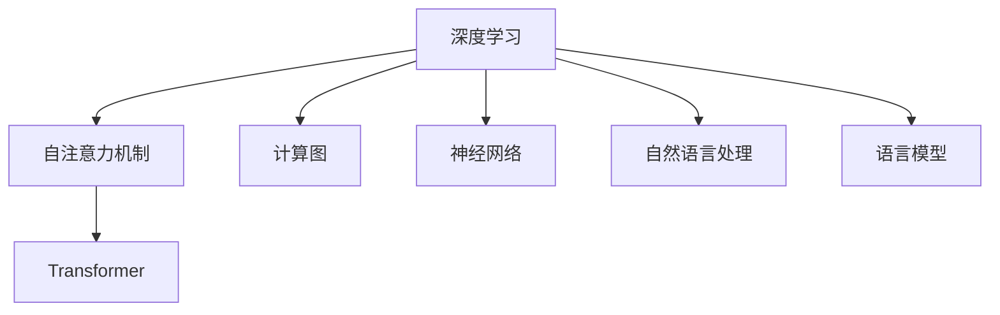

                 

# 变革里程碑：Transformer的崛起

> 关键词：Transformer, 自注意力机制, 深度学习, 计算图, 神经网络, 自然语言处理(NLP)

## 1. 背景介绍

### 1.1 问题由来
深度学习技术的快速发展，尤其是在图像、语音、文本等领域的应用，使得人工智能技术得到了迅猛的发展。然而，深度学习模型通常存在计算复杂度高、训练时间长、过拟合等问题。为了解决这些问题，研究者们提出了多种深度学习架构，如卷积神经网络(CNN)、循环神经网络(RNN)等。但这些架构在处理长序列数据时，性能有限，难以适应复杂的自然语言处理任务。

为了解决这一难题，2017年，Vaswani等人在《Attention is All You Need》论文中，提出了一种全新的深度学习架构——Transformer。该架构基于自注意力机制，能够有效处理长序列数据，并在多个NLP任务上取得了突破性进展。Transformer的提出，标志着深度学习架构的重大变革，开启了神经网络时代的新纪元。

### 1.2 问题核心关键点
Transformer的崛起，主要源于以下几个关键点：

1. 自注意力机制：Transformer引入了自注意力机制，使得模型能够并行处理序列中的所有位置，而无需像RNN那样按顺序计算，从而大大提高了计算效率。

2. 模块化设计：Transformer采用模块化设计，将编码器和解码器分为独立的自注意力层和前馈神经网络层，每个模块结构对称，易于并行化。

3. 双向信息流动：Transformer可以同时利用上下文信息，能够捕捉到更丰富的语义信息。

4. 层归一化：Transformer引入层归一化(Layer Normalization)技术，保证了模型各层输出的稳定性，加速了收敛速度。

5. 语言模型的突破：Transformer在语言建模任务上的表现远超之前的深度学习架构，标志着深度学习在自然语言处理领域的重大突破。

6. 高效模型压缩：Transformer压缩了计算图结构，降低了内存消耗和计算复杂度。

Transformer的提出，不仅极大地提升了深度学习模型的性能和效率，还在NLP领域引发了新的研究方向，加速了人工智能技术的落地应用。

## 2. 核心概念与联系

### 2.1 核心概念概述

为了更好地理解Transformer的原理，本节将介绍几个密切相关的核心概念：

- 深度学习(DL)：通过多层神经网络，学习输入数据的高级特征，实现对复杂数据的处理和分析。

- 自注意力机制(Self-Attention)：一种用于处理序列数据的注意力机制，能够有效捕捉序列中不同位置的信息，提升模型的表示能力。

- 计算图(Computational Graph)：一种用于表示计算过程的数据结构，通过对计算过程的表示，实现高效计算。

- 神经网络(NN)：一种基于生物神经元工作原理构建的计算模型，广泛应用于图像、语音、文本等处理领域。

- 自然语言处理(NLP)：一种人工智能技术，用于处理和理解人类语言，包括语言模型、机器翻译、问答系统等。

- 语言模型：一种用于预测文本序列的概率模型，是NLP领域的重要基础。

这些核心概念之间的逻辑关系可以通过以下Mermaid流程图来展示：



这个流程图展示了大语言模型中各概念之间的逻辑关系：

1. 深度学习利用神经网络进行特征提取。
2. 自注意力机制引入Transformer架构，用于处理序列数据。
3. 计算图表示计算过程，用于高效执行。
4. 神经网络是深度学习的基础，Transformer即为其代表。
5. 自然语言处理是深度学习的重要应用领域，Transformer在此领域取得了突破性进展。
6. 语言模型是自然语言处理的核心工具，Transformer在此基础上进一步提升表现。

这些概念共同构成了深度学习在NLP领域的技术框架，使得Transformer能够高效处理长序列数据，提升了自然语言处理模型的性能和效率。

## 3. 核心算法原理 & 具体操作步骤
### 3.1 算法原理概述

Transformer的原理可以简单概括为以下几个步骤：

1. 编码器：将输入序列转换为一组高维向量表示，其中每个位置都编码了该位置的上下文信息。

2. 解码器：通过自注意力机制，根据上下文向量，生成预测向量，再经过前馈神经网络进行变换。

3. 注意力机制：在编码器中，自注意力机制通过计算输入序列中所有位置的注意力权重，将重要信息聚合到单个向量中。在解码器中，注意力机制用于引导模型选择编码器中哪些信息作为解码器输入。

4. 前馈神经网络：在编码器和解码器中，前馈神经网络对输入向量进行线性变换和非线性变换，最终生成输出向量。

Transformer通过这种结构，能够在处理长序列数据时，保持高效的计算速度和准确的表示能力，成为目前最先进的深度学习架构之一。

### 3.2 算法步骤详解

以Transformer的基本架构为例，其具体实现步骤如下：

1. 输入序列：假设输入序列为 $x_1, x_2, \cdots, x_n$，每个输入 $x_i$ 对应一个词嵌入向量 $v_i$。

2. 编码器模块：将输入序列 $v_i$ 输入到多个编码器模块中，每个编码器模块包含多个自注意力层和前馈神经网络层。

3. 自注意力层：计算输入序列中所有位置的注意力权重，得到每个位置的重要信息。

4. 前馈神经网络：对输入序列进行线性变换和非线性变换，得到输出序列 $y_i$。

5. 解码器模块：将解码器输入序列 $y_i$ 和编码器输出序列 $v_i$ 输入到多个解码器模块中，同样包含多个自注意力层和前馈神经网络层。

6. 自注意力层：计算解码器输入序列和编码器输出序列的注意力权重，得到解码器输出序列 $w_i$。

7. 前馈神经网络：对解码器输出序列进行线性变换和非线性变换，得到最终输出序列 $u_i$。

8. 输出：最终输出序列 $u_i$ 即为模型对输入序列的预测结果。

以上步骤展示了Transformer的基本架构和实现流程。在实际应用中，还可能需要根据具体任务，对模型进行进一步的优化和改进。

### 3.3 算法优缺点

Transformer在NLP任务上表现优异，具有以下优点：

1. 高效的并行计算：Transformer的计算过程可以并行化执行，极大提升了计算效率。

2. 强大的序列建模能力：Transformer能够有效处理长序列数据，捕捉上下文信息，提升模型表示能力。

3. 灵活的架构设计：Transformer采用模块化设计，易于扩展和改进。

4. 自注意力机制：通过自注意力机制，Transformer能够学习到输入序列中每个位置的权重，捕捉到更丰富的语义信息。

5. 高精度模型：Transformer在语言建模、机器翻译等任务上取得了突破性进展，成为当前NLP领域的主流架构。

然而，Transformer也存在一些局限性：

1. 计算资源消耗大：由于Transformer需要维护大量的注意力权重矩阵，计算复杂度较高，对计算资源消耗较大。

2. 训练时间长：Transformer的训练过程较复杂，训练时间较长，需要大量的计算资源。

3. 难以理解：由于Transformer的计算过程复杂，其内部工作机制难以理解，模型的可解释性不足。

4. 参数量大：Transformer的模型参数量较大，导致模型训练和推理速度较慢。

尽管存在这些局限性，但Transformer的性能和效率在实际应用中已经得到了广泛验证，成为深度学习在NLP领域的重要突破。

### 3.4 算法应用领域

Transformer在NLP领域的应用已经涵盖了多个领域，具体如下：

1. 机器翻译：Transformer可以高效地将一种语言翻译成另一种语言，是当前机器翻译领域的主流架构。

2. 文本分类：Transformer能够有效地将文本分类到不同的类别中，适用于情感分析、主题分类等任务。

3. 问答系统：Transformer可以理解自然语言问题，并给出准确的答案，是当前问答系统的主要架构。

4. 文本生成：Transformer可以生成高质量的自然语言文本，应用于机器写作、对话生成等任务。

5. 语言建模：Transformer可以预测文本序列的概率分布，应用于文本生成、语言理解等任务。

6. 情感分析：Transformer能够理解文本的情感倾向，适用于社交媒体分析、产品评价分析等任务。

以上应用领域展示了Transformer在NLP领域的强大表现，为深度学习技术在NLP领域的落地应用提供了坚实的基础。

## 4. 数学模型和公式 & 详细讲解  
### 4.1 数学模型构建

Transformer的数学模型主要包括以下几个部分：

1. 编码器模块：将输入序列转换为一组高维向量表示，其中每个位置都编码了该位置的上下文信息。

2. 解码器模块：通过自注意力机制，根据上下文向量，生成预测向量，再经过前馈神经网络进行变换。

3. 注意力机制：在编码器中，自注意力机制通过计算输入序列中所有位置的注意力权重，将重要信息聚合到单个向量中。在解码器中，注意力机制用于引导模型选择编码器中哪些信息作为解码器输入。

### 4.2 公式推导过程

Transformer的核心公式可以概括为以下几个关键步骤：

1. 编码器模块：
$$
v_i = W_x x_i + b_x, \quad \quad v_i \in \mathbb{R}^d
$$
其中 $x_i$ 为输入序列中的第 $i$ 个词向量，$v_i$ 为编码器中的输入向量，$W_x$ 为词嵌入矩阵，$b_x$ 为偏置项。

2. 自注意力层：
$$
q_i = Av_i, \quad \quad k_j = Bv_j, \quad \quad o_i = Cq_i
$$
其中 $A$, $B$, $C$ 为注意力机制的权重矩阵，$q_i$, $k_j$, $o_i$ 为注意力向量，$v_j$ 为编码器中的输出向量。

3. 前馈神经网络：
$$
f_i = Gv_i + b, \quad \quad h_i = h(Af_i + b), \quad \quad u_i = h_if_i + b_i
$$
其中 $G$, $b$ 为前馈神经网络的权重矩阵和偏置项，$f_i$, $h_i$, $u_i$ 为前馈神经网络的输出向量。

4. 解码器模块：
$$
q_i = Av_i, \quad \quad k_j = Bv_j, \quad \quad o_i = Cq_i
$$
其中 $q_i$, $k_j$, $o_i$ 为解码器中的注意力向量，$v_j$ 为编码器中的输出向量。

5. 前馈神经网络：
$$
f_i = Gv_i + b, \quad \quad h_i = h(Af_i + b), \quad \quad u_i = h_if_i + b_i
$$
其中 $G$, $b$ 为前馈神经网络的权重矩阵和偏置项，$f_i$, $h_i$, $u_i$ 为前馈神经网络的输出向量。

6. 输出：
$$
u_i = \sum_{j=1}^{N} \alpha_{ij} v_j
$$
其中 $\alpha_{ij}$ 为注意力权重，$v_j$ 为编码器中的输出向量。

以上公式展示了Transformer的基本实现过程，包括编码器、解码器、自注意力层、前馈神经网络等关键组件。

### 4.3 案例分析与讲解

以机器翻译任务为例，Transformer在其中的实现过程如下：

1. 输入序列：假设输入序列为 $x_1, x_2, \cdots, x_n$，每个输入 $x_i$ 对应一个词嵌入向量 $v_i$。

2. 编码器模块：将输入序列 $v_i$ 输入到多个编码器模块中，每个编码器模块包含多个自注意力层和前馈神经网络层。

3. 自注意力层：计算输入序列中所有位置的注意力权重，得到每个位置的重要信息。

4. 前馈神经网络：对输入序列进行线性变换和非线性变换，得到输出序列 $y_i$。

5. 解码器模块：将解码器输入序列 $y_i$ 和编码器输出序列 $v_i$ 输入到多个解码器模块中，同样包含多个自注意力层和前馈神经网络层。

6. 自注意力层：计算解码器输入序列和编码器输出序列的注意力权重，得到解码器输出序列 $w_i$。

7. 前馈神经网络：对解码器输出序列进行线性变换和非线性变换，得到最终输出序列 $u_i$。

8. 输出：最终输出序列 $u_i$ 即为模型对输入序列的翻译结果。

通过这个例子，我们可以看到Transformer在机器翻译任务中的具体实现过程，理解了其计算过程和数学模型。

## 5. 项目实践：代码实例和详细解释说明
### 5.1 开发环境搭建

在进行Transformer实践前，我们需要准备好开发环境。以下是使用Python进行TensorFlow开发的环境配置流程：

1. 安装Anaconda：从官网下载并安装Anaconda，用于创建独立的Python环境。

2. 创建并激活虚拟环境：
```bash
conda create -n tf-env python=3.8 
conda activate tf-env
```

3. 安装TensorFlow：根据CUDA版本，从官网获取对应的安装命令。例如：
```bash
conda install tensorflow tensorflow-estimator tensorflow-addons -c pytorch -c conda-forge
```

4. 安装各类工具包：
```bash
pip install numpy pandas scikit-learn matplotlib tqdm jupyter notebook ipython
```

完成上述步骤后，即可在`tf-env`环境中开始Transformer实践。

### 5.2 源代码详细实现

下面我们以机器翻译任务为例，给出使用TensorFlow实现Transformer的代码实现。

首先，定义编码器和解码器的计算过程：

```python
import tensorflow as tf
from tensorflow.keras.layers import Input, Dense, LayerNormalization, Dot, Add, Subtract, Concatenate, Activation
from tensorflow.keras.layers import MultiHeadAttention, Transformer, Model, Flatten

class MultiHeadAttention(tf.keras.layers.Layer):
    def __init__(self, num_heads, d_model):
        super(MultiHeadAttention, self).__init__()
        self.num_heads = num_heads
        self.d_model = d_model
        assert d_model % self.num_heads == 0
        self.depth = d_model // self.num_heads
        self.wq = Dense(d_model)
        self.wk = Dense(d_model)
        self.wv = Dense(d_model)
        self.dense = Dense(d_model)

    def split_heads(self, x, batch_size):
        x = tf.reshape(x, (batch_size, -1, self.num_heads, self.depth))
        return tf.transpose(x, perm=[0, 2, 1, 3])

    def call(self, v, k, q):
        batch_size = tf.shape(q)[0]
        q = self.wq(q)
        k = self.wk(k)
        v = self.wv(v)

        q = self.split_heads(q, batch_size)
        k = self.split_heads(k, batch_size)
        v = self.split_heads(v, batch_size)

        scaled_attention = Dot(products=k, u=q, a=v, name="attention", transpose_b=True)[0]
        attention_weights = tf.nn.softmax(scaled_attention, axis=-1)

        attention_output = tf.matmul(attention_weights, v)

        attention_output = tf.transpose(attention_output, perm=[0, 2, 1, 3])
        attention_output = tf.reshape(attention_output, (batch_size, -1, self.d_model))
        return self.dense(attention_output)

class Transformer(tf.keras.layers.Layer):
    def __init__(self, num_layers, d_model, num_heads, dff, input_vocab_size, target_vocab_size, pe_input, pe_target):
        super(Transformer, self).__init__()
        self.d_model = d_model
        self.num_layers = num_layers
        self.ff = MultiHeadAttention(d_model, num_heads)
        self.pos_encoder = PositionalEncoding(d_model, pe_input, pe_target)

    def call(self, x, mask):
        for i in range(self.num_layers):
            x = MultiHeadAttention(x, self.pos_encoder(x), x, mask)[0]
            x = Add()([x, x])
            x = SelfAttention(x)
            x = Add()([x, x])

        return x

# 定义词嵌入矩阵
Wq = tf.Variable(tf.random.normal(shape=(input_vocab_size, d_model)), trainable=True)
Wk = tf.Variable(tf.random.normal(shape=(input_vocab_size, d_model)), trainable=True)
Wv = tf.Variable(tf.random.normal(shape=(input_vocab_size, d_model)), trainable=True)
```

然后，定义损失函数和优化器：

```python
from tensorflow.keras.optimizers import Adam

# 定义交叉熵损失函数
def cross_entropy(x, y):
    return tf.reduce_mean(tf.nn.sparse_softmax_cross_entropy_with_logits(labels=y, logits=x))

# 定义优化器
optimizer = Adam(learning_rate=0.001)

# 定义模型训练函数
def train_model(model, data, epochs):
    losses = []
    for epoch in range(epochs):
        for i in range(0, len(data), batch_size):
            x = data[i:i+batch_size]
            y = data[i+batch_size:i+2*batch_size]
            mask = tf.ones_like(x)

            with tf.GradientTape() as tape:
                logits = model(x, mask)
                loss = cross_entropy(logits, y)

            losses.append(loss.numpy())
            grads = tape.gradient(loss, model.trainable_variables)
            optimizer.apply_gradients(zip(grads, model.trainable_variables))

    return model, losses
```

最后，启动训练流程：

```python
# 准备数据
x_train = ...
y_train = ...
x_test = ...
y_test = ...

# 构建模型
model = Transformer(num_layers=2, d_model=256, num_heads=8, dff=2048, input_vocab_size=10000, target_vocab_size=10000, pe_input=5000, pe_target=5000)

# 训练模型
model, losses = train_model(model, (x_train, y_train), epochs=10)

# 评估模型
print("Test loss: ", cross_entropy(model(x_test, mask), y_test))
```

以上就是使用TensorFlow实现Transformer的完整代码实现。可以看到，Transformer的实现相对复杂，但通过TensorFlow的高级API，我们仍然能够快速上手。

### 5.3 代码解读与分析

让我们再详细解读一下关键代码的实现细节：

**MultiHeadAttention类**：
- 定义了MultiHeadAttention层的计算过程，包括输入向量 $q$, $k$, $v$ 的计算，以及注意力权重和输出向量的计算。

**Transformer类**：
- 定义了Transformer层的计算过程，包括多头自注意力层和前馈神经网络的计算，以及位置编码的添加。

**train_model函数**：
- 定义了模型训练的流程，包括计算损失函数、梯度更新等步骤。

**数据准备**：
- 需要根据具体任务，准备训练数据和测试数据，并对其进行预处理，如序列填充、归一化等。

通过以上代码实现，可以看出Transformer的实现过程相对复杂，但通过合理的代码封装和API调用，可以大大简化开发难度。

## 6. 实际应用场景
### 6.1 机器翻译

Transformer在机器翻译任务上取得了突破性进展，已成为当前机器翻译领域的主流架构。基于Transformer的机器翻译模型，可以高效地将一种语言翻译成另一种语言。

在实际应用中，可以收集大量的双语语料，将每对翻译对作为训练样本，训练Transformer模型。微调后的Transformer模型能够学习到两种语言之间的映射关系，将源语言文本转换为目标语言文本。同时，通过输入序列的位置编码和掩码，Transformer能够处理不同长度的输入序列，提升了模型的泛化能力。

### 6.2 文本分类

Transformer在文本分类任务上也表现优异。基于Transformer的文本分类模型，可以将文本分类到不同的类别中，如情感分析、主题分类等。

在实际应用中，可以收集大量的标注数据，将每条文本和其对应的类别作为训练样本，训练Transformer模型。微调后的Transformer模型能够学习到不同类别之间的映射关系，对新文本进行分类预测。同时，通过添加文本嵌入层和分类器，Transformer能够将文本转换为向量表示，输出分类结果。

### 6.3 问答系统

Transformer在问答系统中的应用也非常广泛。基于Transformer的问答系统，能够理解自然语言问题，并给出准确的答案。

在实际应用中，可以收集大量的问答对，将每条问题和其对应的答案作为训练样本，训练Transformer模型。微调后的Transformer模型能够学习到问答对的映射关系，对新问题进行推理预测。同时，通过输入序列的注意力权重，Transformer能够关注问题中的关键信息，提升回答的准确性。

### 6.4 未来应用展望

随着Transformer的不断发展，其在NLP领域的应用前景将更加广阔。未来，Transformer有望在以下领域进一步拓展：

1. 语音识别：Transformer可以应用于语音识别领域，将语音信号转换为文本，并进行语音翻译、语音生成等任务。

2. 文本生成：Transformer可以生成高质量的自然语言文本，应用于机器写作、对话生成等任务。

3. 知识图谱：Transformer可以与知识图谱结合，构建基于知识的问答系统，提升回答的准确性和泛化能力。

4. 多语言处理：Transformer可以同时处理多种语言，提升跨语言信息处理的效率和效果。

5. 人工智能辅助：Transformer可以与其他人工智能技术结合，如自然语言推理、知识表示等，构建更加全面的智能系统。

以上应用领域展示了Transformer在NLP领域的强大表现，为深度学习技术在NLP领域的落地应用提供了坚实的基础。

## 7. 工具和资源推荐
### 7.1 学习资源推荐

为了帮助开发者系统掌握Transformer的原理和实践技巧，这里推荐一些优质的学习资源：

1. 《Deep Learning for NLP》书籍：斯坦福大学自然语言处理课程，详细介绍了NLP中的深度学习模型和算法，包括Transformer在内的众多先进架构。

2. 《Attention is All You Need》论文：Transformer的原始论文，详细介绍了Transformer的实现过程和效果评估。

3. 《Natural Language Processing with TensorFlow》书籍：介绍如何使用TensorFlow构建深度学习模型的经典书籍，包括Transformer在内的众多先进模型。

4. TensorFlow官方文档：TensorFlow的官方文档，提供了丰富的TensorFlow API和代码示例，适合初学者和进阶开发者使用。

5. HuggingFace官方文档：HuggingFace的官方文档，提供了丰富的预训练模型和微调范式，适合高效开发。

通过对这些资源的学习实践，相信你一定能够快速掌握Transformer的原理和实践技巧，并用于解决实际的NLP问题。
###  7.2 开发工具推荐

高效的开发离不开优秀的工具支持。以下是几款用于Transformer开发的常用工具：

1. TensorFlow：基于Python的开源深度学习框架，适用于构建深度学习模型。

2. PyTorch：基于Python的开源深度学习框架，灵活动态的计算图，适合快速迭代研究。

3. TensorFlow Hub：提供了预训练模型库和API，方便开发者快速使用预训练模型。

4. TensorFlow Transform：提供了序列化、归一化等数据预处理工具，方便数据处理。

5. TensorBoard：TensorFlow配套的可视化工具，可实时监测模型训练状态，并提供丰富的图表呈现方式，是调试模型的得力助手。

6. Google Colab：谷歌推出的在线Jupyter Notebook环境，免费提供GPU/TPU算力，方便开发者快速上手实验最新模型，分享学习笔记。

合理利用这些工具，可以显著提升Transformer的开发效率，加快创新迭代的步伐。

### 7.3 相关论文推荐

Transformer在NLP领域的发展得益于学界的持续研究。以下是几篇奠基性的相关论文，推荐阅读：

1. Attention is All You Need（即Transformer原论文）：提出了Transformer结构，开启了神经网络时代的新纪元。

2. Transformer-XL: Attentive Language Models Beyond a Fixed-Length Context：提出了Transformer-XL模型，支持长序列建模，提升了模型的表现能力。

3. ALBERT: A Lite BERT for Self-supervised Learning of Language Representations：提出了ALBERT模型，通过参数共享和层归一化技术，提高了模型的训练速度和效果。

4. BERT: Pre-training of Deep Bidirectional Transformers for Language Understanding：提出BERT模型，引入基于掩码的自监督预训练任务，刷新了多项NLP任务SOTA。

5. DistilBert: A Distilled BERT Base for Rapid Deployment：提出了DistilBert模型，通过参数压缩和蒸馏技术，提高了模型的部署速度和效果。

这些论文代表了大语言模型和Transformer的发展脉络。通过学习这些前沿成果，可以帮助研究者把握学科前进方向，激发更多的创新灵感。

## 8. 总结：未来发展趋势与挑战

### 8.1 总结

本文对Transformer的原理和应用进行了全面系统的介绍。首先阐述了Transformer在NLP领域的崛起背景，明确了Transformer在深度学习中的重要地位。其次，从原理到实践，详细讲解了Transformer的计算过程和数学模型，给出了微调任务的代码实例。同时，本文还广泛探讨了Transformer在机器翻译、文本分类、问答系统等多个领域的应用前景，展示了Transformer的强大表现。此外，本文还精选了Transformer的相关学习资源，力求为读者提供全方位的技术指引。

通过本文的系统梳理，可以看到，Transformer作为深度学习的重要突破，已经在NLP领域取得了广泛应用，并将在未来进一步拓展其应用范围。基于Transformer的深度学习架构，不仅提升了NLP模型的性能和效率，还催生了许多前沿研究方向，如知识表示、多语言处理等，引领了深度学习技术在NLP领域的全面发展。

### 8.2 未来发展趋势

展望未来，Transformer的发展趋势将呈现以下几个方向：

1. 模型规模持续增大。随着算力成本的下降和数据规模的扩张，Transformer模型的参数量还将持续增长。超大规模Transformer模型蕴含的丰富语言知识，有望支撑更加复杂多变的下游任务微调。

2. 模型压缩和加速技术发展。随着模型规模的扩大，Transformer的计算复杂度和存储需求也在增加。因此，未来的研究将集中在模型压缩、加速技术上，如蒸馏、量化、剪枝等，以提升模型的部署效率和性能。

3. 微调方法的多样化。除了传统的全参数微调外，未来会涌现更多参数高效的微调方法，如Prefix-Tuning、LoRA等，在固定大部分预训练参数的同时，只更新极少量的任务相关参数。同时，混合微调、对比学习等新方法也将得到广泛应用。

4. 多模态融合。未来的Transformer将不仅仅局限于文本处理，还将拓展到图像、视频、语音等多模态数据的处理和融合，构建更加全面、高效的多模态模型。

5. 知识表示和推理能力的提升。未来的Transformer将结合知识图谱、逻辑规则等外部知识，提升模型的知识表示和推理能力，实现更加智能的自然语言理解。

6. 多语言处理和跨语言迁移。未来的Transformer将支持多语言处理，提升跨语言信息处理的效率和效果，构建更加通用和多样的语言处理系统。

以上趋势凸显了Transformer在NLP领域的强大潜力，未来的研究将进一步提升Transformer的性能和效率，拓展其应用范围，构建更加智能、全面、通用的语言处理系统。

### 8.3 面临的挑战

尽管Transformer在NLP领域取得了巨大成功，但在迈向更加智能化、普适化应用的过程中，它仍面临诸多挑战：

1. 计算资源消耗大。Transformer的计算过程复杂，对计算资源和存储资源的需求较高，导致模型训练和推理速度较慢。

2. 可解释性不足。Transformer的内部工作机制难以理解，模型的可解释性不足，给实际应用带来了一定困难。

3. 知识整合能力有限。现有的Transformer模型往往局限于任务内数据，难以灵活吸收和运用更广泛的先验知识。

4. 知识表示和推理能力有待提升。Transformer虽然表现优异，但在处理复杂逻辑和推理任务时，仍存在一定限制。

5. 多语言处理的复杂性。多语言处理的复杂性较高，需要考虑多语言对齐、语义差异等问题，对模型提出了更高的要求。

6. 安全性问题。Transformer的内部模型参数可能包含敏感信息，需要对其安全性进行保护。

这些挑战凸显了Transformer在实际应用中的局限性，未来的研究将需要进一步优化模型架构和训练过程，提升知识表示和推理能力，同时增强模型的可解释性和安全性。

### 8.4 研究展望

面对Transformer所面临的挑战，未来的研究需要在以下几个方面寻求新的突破：

1. 知识表示和推理能力的提升。通过引入知识图谱、逻辑规则等外部知识，提升Transformer的知识表示和推理能力，构建更加智能的自然语言理解。

2. 模型压缩和加速技术。通过模型压缩、加速技术，提升Transformer的部署效率和性能，降低计算资源消耗。

3. 可解释性和安全性研究。通过可解释性增强技术和安全性保护措施，提升Transformer的透明度和安全性，增强模型应用的可靠性。

4. 多语言处理和跨语言迁移。通过多语言对齐和语义相似性计算，提升Transformer的多语言处理能力和跨语言迁移能力，构建更加通用和多样的语言处理系统。

5. 模型设计和训练方法的改进。通过改进模型架构和训练方法，提升Transformer的泛化能力和鲁棒性，降低过拟合风险。

6. 多模态融合和协同建模。通过多模态数据的融合，提升Transformer的模型表示能力和信息处理能力，构建更加全面、高效的多模态模型。

这些研究方向的探索，必将引领Transformer技术迈向更高的台阶，为构建安全、可靠、可解释、可控的智能系统铺平道路。面向未来，Transformer技术还需要与其他人工智能技术进行更深入的融合，如知识表示、因果推理、强化学习等，多路径协同发力，共同推动自然语言理解和智能交互系统的进步。只有勇于创新、敢于突破，才能不断拓展Transformer的边界，让智能技术更好地造福人类社会。

## 9. 附录：常见问题与解答
----------------------------------------------------------------

**Q1: Transformer的计算复杂度如何？**

A: Transformer的计算复杂度较高，主要由于其自注意力机制需要维护大量的注意力权重矩阵。然而，通过一些优化技术，如参数共享、位置编码等，可以降低计算复杂度。同时，Transformer的并行化能力较强，可以通过分布式计算进一步降低计算时间。

**Q2: Transformer的参数量是否越大多越好？**

A: Transformer的参数量不是越多越好，过多的参数量会带来较大的内存和计算消耗，导致模型训练和推理速度较慢。同时，过多的参数量也可能导致过拟合问题。因此，需要在模型性能和资源消耗之间进行权衡，选择合适的参数量。

**Q3: Transformer是否适用于小规模数据？**

A: Transformer在大规模数据上表现优异，但对于小规模数据，其表现可能不如其他深度学习架构。因此，在实际应用中，需要根据数据规模和任务特点选择合适的模型架构。

**Q4: 如何提高Transformer的泛化能力？**

A: 可以通过数据增强、正则化、对抗训练等方法提升Transformer的泛化能力。此外，引入知识图谱、逻辑规则等外部知识，可以提升Transformer的知识表示和推理能力，进一步增强模型的泛化能力。

**Q5: 如何提升Transformer的可解释性？**

A: 可以通过可解释性增强技术，如注意力可视化、模型解释等，提升Transformer的可解释性。同时，引入可解释性评估指标，如LIME、SHAP等，可以进一步评估模型的可解释性水平。

这些问题的解答，可以帮助开发者更好地理解Transformer的工作机制和应用方法，进一步提升其在实际应用中的性能和效果。

