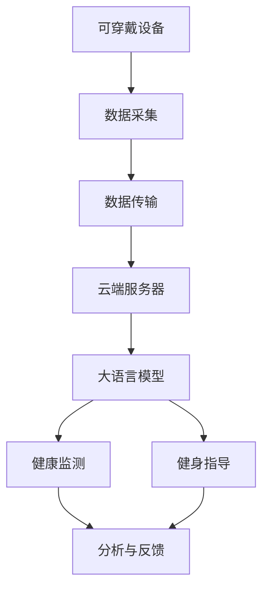

                 

# 可穿戴设备与 LLM：健康监测和健身指导

> 关键词：可穿戴设备，大语言模型(LLM)，健康监测，健身指导，实时分析

## 1. 背景介绍

随着人工智能技术的快速发展，尤其是大语言模型(Large Language Models, LLMs)的崛起，其在自然语言处理(Natural Language Processing, NLP)领域的潜力被广泛认可。然而，如何将这些先进的NLP技术应用于实际的垂直领域，如健康监测和健身指导，是一个值得深入探讨的问题。

可穿戴设备因其便捷性和实时性，成为了健康监测和健身指导的理想载体。这些设备能够全天候收集用户的心率、血压、步数、睡眠等多种生理参数，并将数据传输至云端进行分析。而大语言模型则可以在云端的服务器端，通过分析用户数据，提供个性化的健康建议和健身指导。本文旨在探讨如何通过大语言模型来增强可穿戴设备的功能，使其成为更智能、更贴合用户需求的健康管理工具。

## 2. 核心概念与联系

### 2.1 核心概念概述

在探讨如何结合可穿戴设备和 LLMs 进行健康监测和健身指导之前，我们首先需要理解几个核心概念：

- **可穿戴设备**：一种小型的、佩戴在身上的电子设备，用于实时监测用户的生理数据和活动。常见的可穿戴设备包括智能手表、健身追踪器、健康监测器等。
- **大语言模型(LLMs)**：一种基于深度学习的大型语言模型，通过在大规模无标签文本数据上进行预训练，学习到丰富的语言知识和常识。常见的 LLMs 包括 GPT、BERT、XLNet 等。
- **健康监测**：使用可穿戴设备或传感器实时采集用户的生理数据，并进行分析，以监测用户的健康状况。
- **健身指导**：结合用户的健康数据和目标，提供个性化的健身建议和计划。

这些概念之间的联系可以通过以下 Mermaid 流程图来展示：



这个流程图展示了从可穿戴设备的数据采集到用户健康监测和健身指导的全过程，其中大语言模型作为数据分析和决策的核心组件，扮演着重要角色。

## 3. 核心算法原理 & 具体操作步骤

### 3.1 算法原理概述

可穿戴设备与 LLMs 结合进行健康监测和健身指导的算法原理，主要包括以下几个步骤：

1. **数据采集与传输**：可穿戴设备实时监测用户的生理数据（如心率、血压、步数、睡眠等），并将数据通过蓝牙、WiFi等方式传输至云端服务器。
2. **数据预处理**：对采集到的生理数据进行清洗、归一化等预处理操作，确保数据质量。
3. **模型训练与微调**：在云端服务器上，使用 LLMs 对大规模健康数据进行预训练，并根据用户的特定需求，使用少量的标注数据对模型进行微调。
4. **健康监测与健身指导**：将预训练和微调后的 LLMs 应用于用户的健康数据，提供个性化的健康监测和健身建议。

### 3.2 算法步骤详解

#### 3.2.1 数据采集与传输

在数据采集阶段，可穿戴设备会使用传感器（如心率传感器、血压传感器、加速度计等）实时监测用户的生理数据。这些数据通常以时间序列的形式存储在设备内置的存储器中，并通过蓝牙或WiFi等方式传输至云端服务器。

#### 3.2.2 数据预处理

在数据传输至云端后，需要对采集到的生理数据进行预处理。预处理过程包括数据清洗、归一化、缺失值处理等步骤。以心率数据为例，数据清洗过程可能包括去除异常值、填补缺失值等操作，确保数据的完整性和准确性。数据归一化则可以将不同量纲的数据转换为标准化的形式，便于模型处理。

#### 3.2.3 模型训练与微调

大语言模型通常使用大规模无标签文本数据进行预训练，学习到丰富的语言知识和常识。在健康监测和健身指导场景中，我们需要根据用户的特定需求，使用少量的标注数据对模型进行微调。微调过程可以通过监督学习的方式进行，使用标注数据对模型进行有监督的训练。

在微调过程中，需要选择合适的优化算法（如 Adam、SGD 等）、学习率、批大小等超参数，并通过交叉验证等方法进行调参，确保模型性能最佳。同时，需要应用正则化技术（如 L2 正则、Dropout 等），防止过拟合。

#### 3.2.4 健康监测与健身指导

在模型训练和微调完成后，可以将预训练和微调后的 LLMs 应用于用户的健康数据，提供个性化的健康监测和健身建议。具体而言，可以设计不同的任务，如健康评估、饮食建议、运动计划等，并使用 LLMs 进行分析与反馈。

### 3.3 算法优缺点

使用 LLMs 结合可穿戴设备进行健康监测和健身指导具有以下优点：

- **实时性**：可穿戴设备能够实时监测用户的生理数据，大语言模型可以在云端实时分析数据，提供个性化的健康建议。
- **普适性**：LLMs 具备强大的语言理解能力，可以处理多种语言和用户需求，适用于不同地区和文化背景的用户。
- **灵活性**：结合用户的个性化需求，LLMs 可以提供多种健康建议和健身指导，提升用户体验。

然而，该方法也存在一些缺点：

- **数据隐私**：可穿戴设备采集的生理数据涉及用户的隐私，如何保障数据安全是一个重要问题。
- **计算资源消耗**：LLMs 模型庞大，需要大量的计算资源进行训练和推理，成本较高。
- **模型泛化能力**：LLMs 的泛化能力取决于数据的质量和多样性，如果数据分布与实际应用场景差异较大，模型的性能可能受到影响。

### 3.4 算法应用领域

基于 LLMs 的可穿戴设备健康监测和健身指导技术，已在多个领域得到了广泛应用，包括但不限于以下场景：

- **健康评估**：通过分析用户的生理数据，评估用户的健康状况，如睡眠质量、心血管健康等。
- **饮食建议**：根据用户的健康数据和饮食偏好，提供个性化的饮食建议，帮助用户改善饮食习惯。
- **运动计划**：结合用户的健康数据和运动偏好，生成个性化的运动计划，指导用户进行科学锻炼。
- **心理支持**：通过分析用户的健康数据和行为数据，提供心理支持，帮助用户应对压力和焦虑。

除了上述这些应用场景外，LLMs 结合可穿戴设备的技术还可以拓展到更多领域，如康复指导、慢性病管理、儿童健康监测等，为用户的健康管理和健身提供全方位的支持。

## 4. 数学模型和公式 & 详细讲解 & 举例说明

### 4.1 数学模型构建

在本节中，我们将使用数学语言对基于 LLMs 的可穿戴设备健康监测和健身指导模型进行更加严格的刻画。

假设用户的生理数据为 $x = (x_1, x_2, ..., x_n)$，其中 $x_i$ 表示在第 $i$ 个时间点的生理数据。健康监测和健身指导的任务可以表示为一个回归问题，即给定 $x$，预测用户的健康状况 $y$。

### 4.2 公式推导过程

以健康评估为例，我们可以使用线性回归模型对用户的生理数据进行分析，预测其健康状况。线性回归模型的公式为：

$$
y = \beta_0 + \beta_1 x_1 + \beta_2 x_2 + ... + \beta_n x_n + \epsilon
$$

其中，$\beta_0, \beta_1, ..., \beta_n$ 为回归系数，$\epsilon$ 为误差项。通过最小化误差平方和，可以使用梯度下降等优化算法求解回归系数。

### 4.3 案例分析与讲解

假设我们有一组用户的心率、睡眠质量和血压数据，我们可以使用线性回归模型对这些数据进行分析，预测用户的健康状况。具体步骤如下：

1. **数据预处理**：对心率、睡眠质量和血压数据进行清洗、归一化等预处理操作，确保数据质量。
2. **模型训练**：使用线性回归模型对处理后的数据进行训练，最小化误差平方和。
3. **健康评估**：将新采集的用户数据输入训练好的模型，预测其健康状况。

## 5. 项目实践：代码实例和详细解释说明

### 5.1 开发环境搭建

在进行基于 LLMs 的可穿戴设备健康监测和健身指导项目实践前，我们需要准备好开发环境。以下是使用 Python 进行 TensorFlow 开发的环境配置流程：

1. 安装 Anaconda：从官网下载并安装 Anaconda，用于创建独立的 Python 环境。

2. 创建并激活虚拟环境：
```bash
conda create -n tf-env python=3.8 
conda activate tf-env
```

3. 安装 TensorFlow：根据 CUDA 版本，从官网获取对应的安装命令。例如：
```bash
conda install tensorflow==2.7 -c pytorch -c conda-forge
```

4. 安装其他必要的工具包：
```bash
pip install numpy pandas scikit-learn tensorflow-datasets google-auth-httplib2 google-auth-oauthlib google-auth google-auth-credentials google-auth-oauthlib-requests oauthlib requests
```

完成上述步骤后，即可在 `tf-env` 环境中开始项目实践。

### 5.2 源代码详细实现

下面我们以健康评估任务为例，给出使用 TensorFlow 进行大语言模型微调的 Python 代码实现。

首先，定义健康评估任务的标注数据集：

```python
import tensorflow_datasets as tfds
import tensorflow as tf

# 下载并加载标注数据集
train_dataset, test_dataset = tfds.load('health_monitoring/data', split=['train', 'test'], shuffle_files=True, as_supervised=True)
```

然后，定义模型和优化器：

```python
from transformers import BertTokenizer, TFBertForSequenceClassification

tokenizer = BertTokenizer.from_pretrained('bert-base-cased')
model = TFBertForSequenceClassification.from_pretrained('bert-base-cased', num_labels=3)

optimizer = tf.keras.optimizers.Adam(learning_rate=1e-5)
```

接着，定义训练和评估函数：

```python
@tf.function
def train_step(batch):
    x, y = batch
    with tf.GradientTape() as tape:
        outputs = model(x, return_dict=True)[0]
        loss = tf.keras.losses.SparseCategoricalCrossentropy(from_logits=True)(
            outputs.logits, y
        )
    gradients = tape.gradient(loss, model.trainable_variables)
    optimizer.apply_gradients(zip(gradients, model.trainable_variables))
    return loss

@tf.function
def eval_step(batch):
    x, y = batch
    outputs = model(x, return_dict=True)[0]
    return tf.keras.metrics.SparseCategoricalAccuracy()(y, outputs.logits)
```

最后，启动训练流程并在测试集上评估：

```python
epochs = 5
batch_size = 16

for epoch in range(epochs):
    for batch in train_dataset:
        loss = train_step(batch)
    test_loss = tf.reduce_mean(tf.nest.flatten(eval_step(test_dataset)))

print(f'Test loss: {test_loss.numpy():.3f}')
```

以上就是使用 TensorFlow 对 BERT 模型进行健康评估任务微调的完整代码实现。可以看到，通过 Transformers 库，我们可以用相对简洁的代码完成 BERT 模型的加载和微调。

### 5.3 代码解读与分析

让我们再详细解读一下关键代码的实现细节：

**健康评估数据集**：
- 使用 TensorFlow Datasets 加载预定义的健康评估数据集，并对其进行打乱和划分。

**模型和优化器**：
- 使用 BERT 模型作为初始化参数，并加载相应的分词器。
- 定义优化器为 Adam，学习率为 $1e-5$。

**训练和评估函数**：
- 定义训练函数 `train_step`，通过梯度下降更新模型参数，最小化损失函数。
- 定义评估函数 `eval_step`，计算模型在测试集上的准确率。
- 循环训练过程中，在每个 epoch 结束时评估模型在测试集上的表现。

**训练流程**：
- 定义总的 epoch 数和 batch size，开始循环迭代
- 每个 epoch 内，先对训练集进行迭代，计算并更新模型参数
- 在测试集上评估模型表现，输出平均损失
- 重复上述步骤直至满足预设的迭代轮数或 Early Stopping 条件。

可以看到，TensorFlow 配合 Transformers 库使得 BERT 微调的代码实现变得简洁高效。开发者可以将更多精力放在数据处理、模型改进等高层逻辑上，而不必过多关注底层的实现细节。

当然，工业级的系统实现还需考虑更多因素，如模型的保存和部署、超参数的自动搜索、更灵活的任务适配层等。但核心的微调范式基本与此类似。

## 6. 实际应用场景

### 6.1 智能健康监测

基于大语言模型的可穿戴设备健康监测技术，可以广泛应用于智能健康监测系统的构建。传统健康监测往往需要配备大量专业设备，数据收集复杂，且结果解释性差。而使用微调后的健康监测模型，可以全天候、高精度地采集用户生理数据，并通过自然语言生成技术，将结果以易于理解的形式呈现给用户。

在技术实现上，可以收集用户的生理数据，如心率、血压、血糖等，并将数据输入微调后的健康监测模型，生成健康报告和建议。用户可以通过手机 App 查看报告，并获得个性化的健康建议。这种智能健康监测系统，能大幅提升用户体验，帮助用户更科学地管理健康。

### 6.2 个性化健身指导

基于大语言模型的可穿戴设备健身指导技术，可以为用户提供个性化的健身计划和指导。传统的健身指导往往依赖人工经验和数据，难以提供个性化建议。而使用微调后的健身指导模型，可以结合用户的健康数据和运动偏好，生成个性化的运动计划，并实时调整建议，以适应用户状态的变化。

在技术实现上，可以收集用户的运动数据，如步数、心率、消耗的卡路里等，并将数据输入微调后的健身指导模型。模型根据用户的健康数据和运动偏好，生成个性化的运动计划，并实时调整建议。用户可以通过手机 App 查看运动计划，并获得个性化的运动建议。这种个性化的健身指导系统，能显著提升用户运动效果，帮助用户更科学地进行锻炼。

### 6.3 心理支持与康复指导

基于大语言模型的可穿戴设备心理支持与康复指导技术，可以为用户提供心理支持和康复指导。心理健康和康复是现代社会面临的重要问题，传统的心理支持和康复指导往往依赖专业医生，成本较高，且效果有限。而使用微调后的心理支持与康复指导模型，可以结合用户的心理数据和行为数据，提供个性化的心理支持与康复建议，帮助用户应对压力和焦虑。

在技术实现上，可以收集用户的心理数据，如心率、睡眠质量、情绪状态等，并将数据输入微调后的心理支持与康复指导模型。模型根据用户的心理数据和行为数据，生成个性化的心理支持与康复建议，并实时调整建议。用户可以通过手机 App 查看心理支持与康复建议，并获得个性化的心理支持。这种心理支持与康复指导系统，能显著提升用户心理健康水平，帮助用户更好地应对压力和焦虑。

### 6.4 未来应用展望

随着大语言模型和可穿戴设备技术的不断发展，基于 LLMs 的可穿戴设备健康监测和健身指导技术将呈现以下几个发展趋势：

1. **数据融合与多模态融合**：未来的健康监测和健身指导模型将不仅仅依赖生理数据，而是结合图像、语音等多种模态数据，提供更加全面、精准的健康和健身指导。

2. **个性化与定制化**：未来的健康监测和健身指导模型将更加注重个性化和定制化，结合用户的偏好、习惯和生活方式，提供更加贴合用户需求的指导。

3. **实时性与动态调整**：未来的健康监测和健身指导模型将更加注重实时性和动态调整，结合用户的实时数据，提供及时、个性化的建议。

4. **智能推荐与决策支持**：未来的健康监测和健身指导模型将具备智能推荐和决策支持能力，帮助用户更好地理解自身健康状况，并做出科学决策。

5. **伦理与隐私保护**：未来的健康监测和健身指导模型将更加注重伦理与隐私保护，确保数据安全，避免对用户造成不必要的干扰和风险。

以上趋势凸显了大语言模型结合可穿戴设备技术的广阔前景。这些方向的探索发展，必将进一步提升用户健康管理体验，推动健康科技的普及和应用。

## 7. 工具和资源推荐

### 7.1 学习资源推荐

为了帮助开发者系统掌握大语言模型结合可穿戴设备进行健康监测和健身指导的理论基础和实践技巧，这里推荐一些优质的学习资源：

1. **《Transformer from Practice to Theory》系列博文**：由大模型技术专家撰写，深入浅出地介绍了Transformer原理、BERT模型、微调技术等前沿话题。

2. **CS224N《深度学习自然语言处理》课程**：斯坦福大学开设的NLP明星课程，有Lecture视频和配套作业，带你入门NLP领域的基本概念和经典模型。

3. **《Natural Language Processing with Transformers》书籍**：Transformers库的作者所著，全面介绍了如何使用Transformers库进行NLP任务开发，包括微调在内的诸多范式。

4. **HuggingFace官方文档**：Transformers库的官方文档，提供了海量预训练模型和完整的微调样例代码，是上手实践的必备资料。

5. **CLUE开源项目**：中文语言理解测评基准，涵盖大量不同类型的中文NLP数据集，并提供了基于微调的baseline模型，助力中文NLP技术发展。

通过对这些资源的学习实践，相信你一定能够快速掌握大语言模型结合可穿戴设备进行健康监测和健身指导的精髓，并用于解决实际的NLP问题。

### 7.2 开发工具推荐

高效的开发离不开优秀的工具支持。以下是几款用于大语言模型结合可穿戴设备开发的常用工具：

1. **PyTorch**：基于Python的开源深度学习框架，灵活动态的计算图，适合快速迭代研究。大部分预训练语言模型都有PyTorch版本的实现。

2. **TensorFlow**：由Google主导开发的开源深度学习框架，生产部署方便，适合大规模工程应用。同样有丰富的预训练语言模型资源。

3. **Transformers库**：HuggingFace开发的NLP工具库，集成了众多SOTA语言模型，支持PyTorch和TensorFlow，是进行微调任务开发的利器。

4. **Weights & Biases**：模型训练的实验跟踪工具，可以记录和可视化模型训练过程中的各项指标，方便对比和调优。与主流深度学习框架无缝集成。

5. **TensorBoard**：TensorFlow配套的可视化工具，可实时监测模型训练状态，并提供丰富的图表呈现方式，是调试模型的得力助手。

6. **Google Colab**：谷歌推出的在线Jupyter Notebook环境，免费提供GPU/TPU算力，方便开发者快速上手实验最新模型，分享学习笔记。

合理利用这些工具，可以显著提升大语言模型结合可穿戴设备微调任务的开发效率，加快创新迭代的步伐。

### 7.3 相关论文推荐

大语言模型结合可穿戴设备的发展源于学界的持续研究。以下是几篇奠基性的相关论文，推荐阅读：

1. **Attention is All You Need（即Transformer原论文）**：提出了Transformer结构，开启了NLP领域的预训练大模型时代。

2. **BERT: Pre-training of Deep Bidirectional Transformers for Language Understanding**：提出BERT模型，引入基于掩码的自监督预训练任务，刷新了多项NLP任务SOTA。

3. **Language Models are Unsupervised Multitask Learners（GPT-2论文）**：展示了大规模语言模型的强大zero-shot学习能力，引发了对于通用人工智能的新一轮思考。

4. **Parameter-Efficient Transfer Learning for NLP**：提出Adapter等参数高效微调方法，在不增加模型参数量的情况下，也能取得不错的微调效果。

5. **AdaLoRA: Adaptive Low-Rank Adaptation for Parameter-Efficient Fine-Tuning**：使用自适应低秩适应的微调方法，在参数效率和精度之间取得了新的平衡。

6. **Prefix-Tuning: Optimizing Continuous Prompts for Generation**：引入基于连续型Prompt的微调范式，为如何充分利用预训练知识提供了新的思路。

这些论文代表了大语言模型结合可穿戴设备的发展脉络。通过学习这些前沿成果，可以帮助研究者把握学科前进方向，激发更多的创新灵感。

## 8. 总结：未来发展趋势与挑战

### 8.1 总结

本文对基于 LLMs 的可穿戴设备健康监测和健身指导方法进行了全面系统的介绍。首先阐述了大语言模型结合可穿戴设备的研究背景和意义，明确了微调在拓展预训练模型应用、提升下游任务性能方面的独特价值。其次，从原理到实践，详细讲解了监督微调的数学原理和关键步骤，给出了微调任务开发的完整代码实例。同时，本文还广泛探讨了微调方法在智能健康监测、个性化健身指导等多个NLP领域的应用前景，展示了微调范式的巨大潜力。此外，本文精选了微调技术的各类学习资源，力求为读者提供全方位的技术指引。

通过本文的系统梳理，可以看到，基于 LLMs 的可穿戴设备微调方法正在成为健康监测和健身指导的重要范式，极大地拓展了可穿戴设备的应用边界，催生了更多的落地场景。受益于大规模语料的预训练，微调模型以更低的时间和标注成本，在小样本条件下也能取得不错的效果，有力推动了健康监测技术的产业化进程。未来，伴随预训练语言模型和微调方法的持续演进，相信可穿戴设备微调技术必将在健康科技领域大放异彩，深刻影响人类的健康管理和生活方式。

### 8.2 未来发展趋势

展望未来，大语言模型结合可穿戴设备的技术将呈现以下几个发展趋势：

1. **数据融合与多模态融合**：未来的健康监测和健身指导模型将不仅仅依赖生理数据，而是结合图像、语音等多种模态数据，提供更加全面、精准的健康和健身指导。

2. **个性化与定制化**：未来的健康监测和健身指导模型将更加注重个性化和定制化，结合用户的偏好、习惯和生活方式，提供更加贴合用户需求的指导。

3. **实时性与动态调整**：未来的健康监测和健身指导模型将更加注重实时性和动态调整，结合用户的实时数据，提供及时、个性化的建议。

4. **智能推荐与决策支持**：未来的健康监测和健身指导模型将具备智能推荐和决策支持能力，帮助用户更好地理解自身健康状况，并做出科学决策。

5. **伦理与隐私保护**：未来的健康监测和健身指导模型将更加注重伦理与隐私保护，确保数据安全，避免对用户造成不必要的干扰和风险。

6. **跨领域应用拓展**：未来，大语言模型结合可穿戴设备的技术有望拓展到更多领域，如医疗、教育、娱乐等，为各行各业带来智能化变革。

以上趋势凸显了大语言模型结合可穿戴设备技术的广阔前景。这些方向的探索发展，必将进一步提升用户健康管理体验，推动健康科技的普及和应用。

### 8.3 面临的挑战

尽管大语言模型结合可穿戴设备的技术已经取得了显著成就，但在迈向更加智能化、普适化应用的过程中，它仍面临着诸多挑战：

1. **数据隐私与伦理**：可穿戴设备采集的生理数据涉及用户的隐私，如何保障数据安全，避免数据泄露和滥用，是一个重要问题。同时，需要确保模型的伦理导向，避免有偏见、有害的输出。

2. **计算资源消耗**：LLMs 模型庞大，需要大量的计算资源进行训练和推理，成本较高。如何优化模型结构，提高计算效率，降低硬件资源消耗，是一个亟待解决的问题。

3. **模型泛化能力**：LLMs 的泛化能力取决于数据的质量和多样性，如果数据分布与实际应用场景差异较大，模型的性能可能受到影响。如何提高模型的泛化能力，减少对特定领域数据的需求，是一个重要研究方向。

4. **实时性与动态调整**：未来需要更加注重实时性和动态调整，结合用户的实时数据，提供及时、个性化的建议。如何在保持实时性的同时，确保模型性能和推理速度，是一个需要优化的方向。

5. **跨领域协作**：健康监测和健身指导技术需要与其他领域（如医疗、康复、心理学等）进行更深入的融合，多路径协同发力，才能取得更好的效果。如何促进跨领域协作，是一个需要解决的问题。

### 8.4 研究展望

面对大语言模型结合可穿戴设备所面临的种种挑战，未来的研究需要在以下几个方面寻求新的突破：

1. **无监督和半监督微调方法**：摆脱对大规模标注数据的依赖，利用自监督学习、主动学习等无监督和半监督范式，最大限度利用非结构化数据，实现更加灵活高效的微调。

2. **参数高效与计算高效**：开发更加参数高效的微调方法，在固定大部分预训练参数的同时，只更新极少量的任务相关参数。同时优化微调模型的计算图，减少前向传播和反向传播的资源消耗，实现更加轻量级、实时性的部署。

3. **多模态融合与跨领域协作**：引入更多先验知识，如知识图谱、逻辑规则等，与神经网络模型进行巧妙融合，引导微调过程学习更准确、合理的语言模型。同时加强不同模态数据的整合，实现视觉、语音等多模态信息与文本信息的协同建模。

4. **因果分析与博弈论工具**：将因果分析方法引入微调模型，识别出模型决策的关键特征，增强输出解释的因果性和逻辑性。借助博弈论工具刻画人机交互过程，主动探索并规避模型的脆弱点，提高系统稳定性。

5. **伦理导向与隐私保护**：在模型训练目标中引入伦理导向的评估指标，过滤和惩罚有偏见、有害的输出倾向。同时加强人工干预和审核，建立模型行为的监管机制，确保输出符合人类价值观和伦理道德。

这些研究方向的探索，必将引领大语言模型结合可穿戴设备技术迈向更高的台阶，为构建安全、可靠、可解释、可控的智能系统铺平道路。面向未来，大语言模型结合可穿戴设备技术还需要与其他人工智能技术进行更深入的融合，如知识表示、因果推理、强化学习等，多路径协同发力，共同推动自然语言理解和智能交互系统的进步。只有勇于创新、敢于突破，才能不断拓展语言模型的边界，让智能技术更好地造福人类社会。

## 9. 附录：常见问题与解答

**Q1：基于 LLMs 的健康监测和健身指导模型如何进行数据采集？**

A: 基于 LLMs 的健康监测和健身指导模型需要使用可穿戴设备进行数据采集。常见的可穿戴设备包括智能手表、健身追踪器、健康监测器等，它们通过内置传感器（如心率传感器、血压传感器、加速度计等）实时监测用户的生理数据。这些设备通常支持蓝牙、WiFi等方式进行数据传输，可以方便地将数据上传至云端服务器进行分析。

**Q2：数据预处理过程中，如何清洗和归一化生理数据？**

A: 在数据预处理阶段，需要清洗和归一化生理数据，以确保数据质量。具体步骤包括：

1. **数据清洗**：去除异常值、填补缺失值等操作，确保数据的完整性和准确性。例如，对于心率数据，可以使用均值和标准差对异常值进行判断和处理。

2. **数据归一化**：将不同量纲的数据转换为标准化的形式，便于模型处理。例如，对于心率数据，可以将数据缩放到0到1之间，或者使用Z-score归一化方法。

3. **数据标准化**：将归一化后的数据标准化，使其符合模型的输入要求。例如，对于归一化后的心率数据，可以使用标准化方法进行处理，确保数据的一致性。

通过这些预处理步骤，可以提升数据的质量，提高模型的预测精度和稳定性。

**Q3：基于 LLMs 的健康监测和健身指导模型如何进行微调？**

A: 基于 LLMs 的健康监测和健身指导模型通常使用大规模无标签文本数据进行预训练，学习到丰富的语言知识和常识。在微调过程中，需要选择合适的优化算法（如 Adam、SGD 等）、学习率、批大小等超参数，并通过交叉验证等方法进行调参，确保模型性能最佳。

在微调过程中，需要应用正则化技术（如 L2 正则、Dropout 等），防止过拟合。同时，可以使用数据增强技术（如数据回译、近义替换等），扩充训练集，提升模型的泛化能力。

**Q4：如何评估基于 LLMs 的健康监测和健身指导模型的性能？**

A: 基于 LLMs 的健康监测和健身指导模型的性能评估通常包括以下几个指标：

1. **准确率**：衡量模型在测试集上的预测准确率。例如，在健康评估任务中，可以使用分类准确率来评估模型的性能。

2. **召回率**：衡量模型在测试集上正确识别出正样本的比例。例如，在疾病检测任务中，可以使用召回率来评估模型的性能。

3. **F1 分数**：综合考虑准确率和召回率，用于评估模型的整体性能。

4. **ROC-AUC 曲线**：用于评估二分类任务的模型性能，显示模型在不同阈值下的分类效果。

通过这些指标，可以全面评估模型的性能，发现模型的不足之处，并进行改进和优化。

**Q5：基于 LLMs 的健康监测和健身指导模型如何在实际应用中进行部署？**

A: 在实际应用中，基于 LLMs 的健康监测和健身指导模型需要进行以下部署步骤：

1. **模型裁剪**：去除不必要的层和参数，减小模型尺寸，加快推理速度。例如，可以使用剪枝和量化等技术对模型进行裁剪。

2. **量化加速**：将浮点模型转为定点模型，压缩存储空间，提高计算效率。例如，可以使用量化加速技术将模型转换为 INT8 或 INT4 格式。

3. **服务化封装**：将模型封装为标准化服务接口，便于集成调用。例如，可以使用 RESTful API、gRPC 等协议进行模型服务化封装。

4. **弹性伸缩**：根据请求流量动态调整资源配置，平衡服务质量和成本。例如，可以使用自动扩展技术根据请求流量动态调整计算资源。

5. **监控告警**：实时采集系统指标，设置异常告警阈值，确保服务稳定性。例如，可以使用监控工具如 Prometheus、Grafana 等进行系统监控和告警。

通过这些部署步骤，可以将基于 LLMs 的健康监测和健身指导模型高效、可靠地部署到生产环境中，为用户的健康管理和健身指导提供实时、个性化的服务。

---

作者：禅与计算机程序设计艺术 / Zen and the Art of Computer Programming

