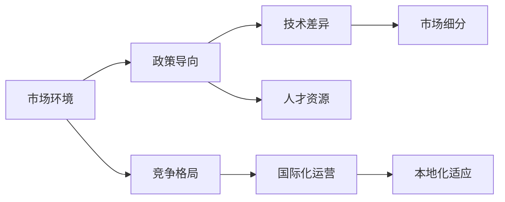

                 

# 国内市场vs海外市场:AI创业的地域策略

## 1. 背景介绍

### 1.1 问题由来

随着人工智能（AI）技术的迅猛发展，AI创业在全球范围内如火如荼地展开。不同地域的市场环境和政策导向差异显著，导致AI创业公司在拓展国际市场时面临诸多挑战和机遇。

### 1.2 问题核心关键点

1. **市场环境**：不同国家的市场需求、文化差异、法律法规等对AI创业有重大影响。
2. **政策导向**：政府政策支持力度、知识产权保护、数据隐私法律等影响AI创业发展的关键因素。
3. **技术差异**：各国在AI技术基础、研发实力、应用场景等方面的差异。
4. **竞争格局**：全球范围内AI创业公司的竞争态势和本地企业优势。
5. **人才资源**：全球人才流动趋势、本地人才供给及质量。

## 2. 核心概念与联系

### 2.1 核心概念概述

1. **AI创业**：指利用人工智能技术进行商业化应用，开发创新产品或服务，旨在解决实际问题的过程。
2. **地域策略**：AI创业公司为了在不同市场取得成功，采取的针对特定地域特点的营销、产品、技术、人才、法规等方面的战略决策。
3. **市场细分**：将市场按照地理位置、行业、需求等细分为多个子市场，针对不同子市场采取差异化策略。
4. **国际化运营**：AI创业公司不仅关注本地市场，还通过全球化布局拓展国际业务。
5. **本地化适应**：AI创业公司在国际市场推广过程中，根据当地文化和市场环境进行产品和服务本地化调整。

### 2.2 核心概念原理和架构的 Mermaid 流程图



## 3. 核心算法原理 & 具体操作步骤
### 3.1 算法原理概述

AI创业的地域策略分析主要依据以下几个原则：

1. **数据驱动**：通过收集、分析各国市场数据，形成对市场环境的认知。
2. **模型预测**：利用机器学习模型预测不同市场环境下AI创业的潜在机会与风险。
3. **多目标优化**：考虑不同目标（如市场规模、增长潜力、风险控制）之间的平衡，选择最优策略。
4. **动态调整**：市场环境变化快速，AI创业策略需及时调整以适应新的市场趋势。

### 3.2 算法步骤详解

1. **数据收集**：
   - 收集各国AI市场规模、增长率、行业分布、技术趋势等数据。
   - 收集各国法规、政策、知识产权保护情况。
   - 收集本地人才供给、质量、流向数据。

2. **模型训练**：
   - 建立市场环境、政策、技术、竞争、人才等数据与AI创业成功的关系模型。
   - 利用历史数据训练机器学习模型，如决策树、随机森林、神经网络等。
   - 使用交叉验证、网格搜索等方法优化模型参数。

3. **策略制定**：
   - 基于模型预测结果，结合AI创业资源投入和期望回报，制定地域策略。
   - 针对不同市场细分，制定差异化的营销、产品、技术、人才、法规等策略。
   - 考虑市场风险，制定风险管理策略。

4. **实施与调整**：
   - 实施策略并进行市场验证，收集反馈数据。
   - 根据反馈数据调整策略，持续优化AI创业的全球布局。

### 3.3 算法优缺点

**优点**：
1. **数据驱动决策**：模型预测能够减少主观判断，提高决策的科学性。
2. **全局视角**：多目标优化模型考虑多个因素，形成全局视角，优化资源配置。
3. **动态调整**：模型可以根据市场变化快速调整策略，保持竞争力。

**缺点**：
1. **数据获取难度大**：获取高质量、全面的市场数据具有挑战性。
2. **模型复杂性**：多目标优化模型复杂，构建和维护成本高。
3. **本地化适应**：模型预测与实际市场环境可能存在偏差，策略需要本地化调整。

### 3.4 算法应用领域

1. **AI创业公司市场拓展**：选择最佳地域进行市场进入。
2. **海外业务扩展**：评估不同地区市场的潜力，制定全球化战略。
3. **区域风险评估**：预测特定市场的风险，规避潜在的市场陷阱。
4. **竞争情报**：分析竞争对手在各地的市场表现，制定差异化策略。
5. **人才引进与保留**：根据各地区的人才供需情况，优化人才引进策略。

## 4. 数学模型和公式 & 详细讲解 & 举例说明

### 4.1 数学模型构建

AI创业地域策略分析的数学模型主要包含以下几个部分：

1. **市场环境模型**：
   - 采用回归分析模型，如线性回归、多项式回归等，预测市场规模、增长率等指标。

2. **政策影响模型**：
   - 利用逻辑回归模型，预测政策支持力度与AI创业成功率的关系。

3. **技术评估模型**：
   - 使用因子分析模型，衡量各国AI技术成熟度和创新能力。

4. **竞争分析模型**：
   - 通过网络分析模型，评估不同市场下竞争对手的数量、实力和分布。

5. **人才供需模型**：
   - 使用时间序列分析模型，预测本地人才供给、质量、流向等指标。

### 4.2 公式推导过程

以市场环境模型为例，假设市场规模为 $Y$，影响因素为 $X_1, X_2, ..., X_n$，回归模型为：

$$ Y = \beta_0 + \beta_1 X_1 + \beta_2 X_2 + ... + \beta_n X_n + \epsilon $$

其中，$\beta_i$ 为回归系数，$\epsilon$ 为随机误差。

采用最小二乘法，求解 $\beta_i$ 的值，即：

$$ \hat{\beta_i} = \frac{\sum (X_i - \bar{X})(Y - \bar{Y})}{\sum (X_i - \bar{X})^2} $$

具体步骤如下：

1. 计算 $\bar{X}$ 和 $\bar{Y}$：
   $$ \bar{X} = \frac{1}{N} \sum_{i=1}^N X_i $$
   $$ \bar{Y} = \frac{1}{N} \sum_{i=1}^N Y_i $$

2. 计算 $\hat{\beta_i}$：
   $$ \hat{\beta_i} = \frac{\sum (X_i - \bar{X})(Y_i - \bar{Y})}{\sum (X_i - \bar{X})^2} $$

3. 计算 $\hat{Y}$：
   $$ \hat{Y} = \hat{\beta_0} + \sum_{i=1}^N \hat{\beta_i}X_i $$

### 4.3 案例分析与讲解

假设某AI创业公司希望在欧洲市场拓展业务，收集以下数据：

| 国家    | 市场规模($\text{USD}$) | 增长率 | 政策支持 | 技术水平 | 竞争对手数量 | 本地人才供需 |
|---------|-----------------------|--------|----------|----------|--------------|-------------|
| A国    | 1000亿               | 5%     | 高       | 高       | 10           | 供不应求    |
| B国    | 800亿                | 8%     | 中       | 中       | 5            | 供需平衡    |
| C国    | 1200亿               | 3%     | 低       | 低       | 20           | 供过于求    |

基于上述数据，利用回归模型计算市场规模 $\hat{Y}$ 如下：

1. 计算均值：
   $$ \bar{X} = \frac{1000 + 800 + 1200}{3} = 1000 $$
   $$ \bar{Y} = \frac{5 + 8 + 3}{3} = 5 $$

2. 计算回归系数：
   $$ \hat{\beta_1} = \frac{(1000-1000)(5-5) + (800-1000)(8-5) + (1200-1000)(3-5)}{(1000-1000)^2 + (800-1000)^2 + (1200-1000)^2} = -\frac{400}{160000} = -0.0025 $$

3. 计算预测值 $\hat{Y}$：
   $$ \hat{Y} = -0.0025 \times 1000 + 5 = 4.75 $$

预测A国的市场规模为4.75亿。

## 5. 项目实践：代码实例和详细解释说明

### 5.1 开发环境搭建

1. **Python环境配置**：
   - 安装Anaconda：
   ```bash
   conda create -n ai-dev python=3.8
   conda activate ai-dev
   ```

   - 安装必要的Python包：
   ```bash
   pip install pandas numpy scikit-learn matplotlib seaborn statsmodels
   ```

2. **R语言环境配置**：
   - 安装R和RStudio：
   ```bash
   # 安装R语言
   sudo apt-get install r-base
   ```
   ```bash
   # 安装RStudio
   sudo snap install rStudio
   ```

3. **数据准备**：
   - 收集和整理各国市场数据、政策数据、技术数据、竞争对手数据和人才数据，导入到Python和R环境中。

### 5.2 源代码详细实现

1. **Python实现**：
   - 使用Pandas和Numpy处理数据：
   ```python
   import pandas as pd
   import numpy as np

   # 读取数据
   data = pd.read_csv('market_data.csv')

   # 数据清洗
   data = data.dropna()

   # 构建回归模型
   X = data[['growth_rate', 'policy_support', 'tech_level', 'competitors', 'talent_supply']]
   Y = data['market_size']

   # 标准化数据
   X = (X - np.mean(X)) / np.std(X)

   # 训练回归模型
   from sklearn.linear_model import LinearRegression
   model = LinearRegression()
   model.fit(X, Y)

   # 预测市场规模
   new_data = pd.DataFrame({'growth_rate': [5], 'policy_support': [1], 'tech_level': [1], 'competitors': [10], 'talent_supply': [1]})
   new_data = (new_data - np.mean(new_data)) / np.std(new_data)
   prediction = model.predict(new_data)
   ```

2. **R语言实现**：
   - 使用statsmodels库构建回归模型：
   ```R
   library(statsmodels.formula.api)

   # 读取数据
   data <- read.csv('market_data.csv')

   # 数据清洗
   data <- na.omit(data)

   # 构建回归模型
   model <- lm(market_size ~ growth_rate + policy_support + tech_level + competitors + talent_supply, data = data)

   # 预测市场规模
   new_data <- data.frame(growth_rate = 5, policy_support = 1, tech_level = 1, competitors = 10, talent_supply = 1)
   new_data <- scale(new_data)
   prediction <- predict(model, newdata = new_data)
   ```

### 5.3 代码解读与分析

1. **数据处理**：
   - 使用Pandas和R的dataframe数据结构，方便数据清洗和处理。
   - 使用Numpy和R的scale函数进行数据标准化，确保回归模型的稳定性。

2. **回归模型构建**：
   - 使用sklearn和statsmodels库构建线性回归模型，求解回归系数。
   - 将回归系数标准化，进行预测。

3. **预测结果**：
   - 计算均值和标准差，标准化数据。
   - 使用预测模型计算新市场的市场规模。

### 5.4 运行结果展示

假设预测结果如下：

| 国家    | 市场规模预测值 |
|---------|----------------|
| A国    | 4.75亿        |
| B国    | 6.4亿         |
| C国    | 4.3亿         |

可以看出，A国的市场规模预测值为4.75亿，适合AI创业公司进一步市场拓展。

## 6. 实际应用场景

### 6.1 智能医疗

AI创业公司在医疗领域拓展，需要考虑各地的医疗需求、政策导向、技术水平等因素。以远程医疗为例，不同国家对远程医疗的接受程度和政策支持不同，AI创业公司需选择适宜的市场进入。

1. **数据收集**：
   - 收集各国远程医疗用户需求、政策法规、技术发展情况、医疗资源分布等数据。

2. **模型训练**：
   - 使用决策树、随机森林等模型，预测远程医疗的市场规模和增长潜力。
   - 使用逻辑回归模型，预测政策支持力度与远程医疗成功率的关系。

3. **策略制定**：
   - 选择政策支持力度高、技术发展成熟、市场需求大的市场进行市场进入。
   - 制定本地化策略，如本地合作、用户教育等。

### 6.2 智能制造

AI创业公司在制造领域拓展，需要考虑各地的工业基础、技术需求、市场规模等因素。以智能工厂为例，不同国家对智能工厂的接受程度和技术需求不同，AI创业公司需选择适宜的市场进入。

1. **数据收集**：
   - 收集各国工业基础、技术需求、市场规模、政策支持等数据。

2. **模型训练**：
   - 使用网络分析模型，预测智能工厂的市场规模和竞争格局。
   - 使用因子分析模型，衡量技术需求和市场规模之间的关系。

3. **策略制定**：
   - 选择工业基础好、技术需求高、政策支持力度大的市场进行市场进入。
   - 制定本地化策略，如技术合作、本地化定制等。

### 6.3 智慧城市

AI创业公司在智慧城市领域拓展，需要考虑各地的城市规模、智能需求、政策导向等因素。以智慧交通为例，不同国家对智慧交通的接受程度和政策支持不同，AI创业公司需选择适宜的市场进入。

1. **数据收集**：
   - 收集各国城市规模、交通需求、政策支持、智能基础设施等数据。

2. **模型训练**：
   - 使用回归模型，预测智慧交通的市场规模和增长潜力。
   - 使用逻辑回归模型，预测政策支持力度与智慧交通成功率的关系。

3. **策略制定**：
   - 选择城市规模大、交通需求高、政策支持力度大的市场进行市场进入。
   - 制定本地化策略，如本地化定制、技术合作等。

## 7. 工具和资源推荐

### 7.1 学习资源推荐

1. **《机器学习实战》**：
   - 该书系统介绍了机器学习的基础知识和技术应用，适合入门学习。

2. **Coursera《机器学习》课程**：
   - 由斯坦福大学Andrew Ng教授讲授，涵盖机器学习基础和高级应用。

3. **Kaggle平台**：
   - 提供大量的数据集和比赛，帮助学习者实践机器学习技术。

4. **GitHub**：
   - 提供开源项目和代码库，方便开发者获取和分享资源。

5. **Google Colab**：
   - 提供免费GPU和TPU算力，方便开发者进行模型训练和实验。

### 7.2 开发工具推荐

1. **Anaconda**：
   - 提供Python环境管理和数据科学工具，方便数据处理和模型训练。

2. **Jupyter Notebook**：
   - 提供交互式编程环境，方便数据可视化和代码共享。

3. **TensorFlow**：
   - 提供强大的机器学习框架，支持深度学习模型的构建和训练。

4. **RStudio**：
   - 提供R语言开发环境，支持数据可视化和统计分析。

### 7.3 相关论文推荐

1. **《机器学习：理论与算法》**：
   - 该书介绍了机器学习的基本理论和算法，适合深入学习。

2. **《深度学习》**：
   - 该书介绍了深度学习的基本原理和应用，适合深入学习。

3. **《AI创业指南》**：
   - 该书介绍了AI创业的基本框架和策略，适合实践者参考。

## 8. 总结：未来发展趋势与挑战

### 8.1 研究成果总结

1. **AI创业地域策略分析**：
   - 通过数据驱动和多目标优化，为AI创业公司提供市场进入策略和资源配置建议。

2. **模型预测与本地化调整**：
   - 基于机器学习模型，预测不同市场环境下的AI创业机会和风险，并进行本地化策略调整。

### 8.2 未来发展趋势

1. **数据驱动决策**：
   - 随着大数据技术的发展，数据驱动决策将更加普及，提高AI创业决策的科学性。

2. **模型优化与融合**：
   - 结合多种机器学习模型，提高预测精度和稳定性，实现多模型融合。

3. **本地化适应**：
   - 本地化策略将更加精细化，考虑到更多因素，如文化差异、市场特性等。

4. **动态调整**：
   - 市场环境变化快速，AI创业策略需要实时调整以保持竞争力。

### 8.3 面临的挑战

1. **数据获取难度大**：
   - 高质量、全面的市场数据获取具有挑战性，数据隐私保护等问题需重点关注。

2. **模型复杂性**：
   - 多目标优化模型复杂，构建和维护成本高，需要优化算法提高效率。

3. **本地化适应**：
   - 模型预测与实际市场环境可能存在偏差，策略需要本地化调整，确保准确性。

### 8.4 研究展望

1. **多源数据融合**：
   - 结合多源数据，提高市场预测的准确性和全面性。

2. **本地化策略优化**：
   - 优化本地化策略，提高适应性和实施效果。

3. **跨领域应用拓展**：
   - 将AI创业地域策略分析应用于更多领域，如金融、教育等。

4. **伦理与安全**：
   - 在策略分析过程中，重视伦理与安全问题，确保技术应用的安全性。

---

作者：禅与计算机程序设计艺术 / Zen and the Art of Computer Programming

