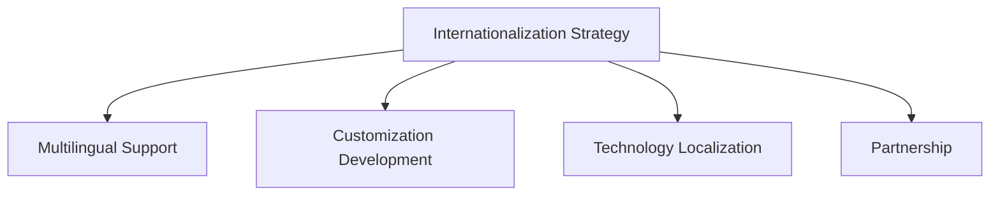

                 

# 国际化战略：Lepton AI的全球布局

## 1. 背景介绍

### 1.1 问题由来

在全球化的时代背景下，企业国际化战略已成为推动企业发展的关键。Lepton AI作为一家快速成长的AI技术公司，已经将目光投向全球市场，谋求全球布局，以期实现更大的市场拓展和业务增长。然而，面对全球多样化的市场需求和技术标准，Lepton AI需要制定一套全面的国际化战略，以确保其产品和技术能够成功“出海”。

### 1.2 问题核心关键点

国际化战略的核心在于如何在全球范围内，基于本地化需求和文化背景，快速适应并整合不同市场，同时保持技术的通用性和竞争力。Lepton AI在制定国际化战略时，需要考虑以下几个关键点：

- 本地市场调研：理解各国市场需求，尤其是数据保护法规、文化差异等。
- 多语言支持：产品国际化过程中，需要确保支持多种语言和地区。
- 定制化开发：根据不同地区和语言特点，进行产品定制化开发。
- 技术本地化：选择合适的技术和工具，适应不同地区的技术标准。
- 合作伙伴：与本地企业和合作伙伴建立良好的合作关系，共同开拓市场。

### 1.3 问题研究意义

Lepton AI的国际化战略，旨在通过全球布局，将先进的AI技术带给更多的企业和消费者。通过国际化，Lepton AI可以：

- 扩大市场份额，增加企业收入。
- 提升品牌影响力，增强国际竞争力。
- 引入多元文化和用户需求，丰富产品功能和应用场景。
- 促进全球知识共享和技术交流，推动AI技术的全球发展。

## 2. 核心概念与联系

### 2.1 核心概念概述

为更好地理解Lepton AI的国际化战略，本节将介绍几个密切相关的核心概念：

- **国际化战略(Internationalization Strategy)**：Lepton AI基于本地市场调研和技术本地化的原则，制定出一套适用于全球不同市场的全球化发展策略。
- **多语言支持(Multilingual Support)**：产品支持多种语言，可以针对不同地区的用户需求进行本地化开发。
- **定制化开发(Customization Development)**：根据不同地区的文化特点和用户习惯，对产品进行定制化开发和调整，以满足本地化需求。
- **技术本地化(Technology Localization)**：选择合适技术和工具，以适应不同地区的技术标准和法规要求。
- **合作伙伴(Partnership)**：与本地企业、开发者和用户建立合作关系，共同推动产品在全球范围内的普及和应用。

这些概念之间的逻辑关系可以通过以下Mermaid流程图来展示：



这个流程图展示出Lepton AI国际化战略的主要组成部分，以及它们之间的联系。

## 3. 核心算法原理 & 具体操作步骤

### 3.1 算法原理概述

Lepton AI的国际化战略主要基于以下几个算法原理：

1. **本地市场调研**：通过数据分析和问卷调查，理解各国市场需求和用户习惯。
2. **多语言支持**：利用自然语言处理(NLP)技术，实现产品的多语言翻译和本地化。
3. **定制化开发**：根据不同地区的用户反馈和需求，进行产品功能和界面的设计和优化。
4. **技术本地化**：选择适应不同地区的技术标准和法规要求，如数据保护法、隐私政策等。
5. **合作伙伴**：建立与本地企业和开发者的合作关系，共同推动产品本地化。

### 3.2 算法步骤详解

以下是Lepton AI国际化战略的主要算法步骤：

**Step 1: 本地市场调研**
- 收集不同地区的用户反馈和市场数据，分析用户需求和行为。
- 利用数据分析工具，如Google Analytics、Tableau等，进行用户行为分析和趋势预测。
- 通过问卷调查、访谈等方式，直接了解用户对产品功能的意见和建议。

**Step 2: 多语言支持**
- 选择适合的NLP工具和框架，如TensorFlow、PyTorch等，进行多语言翻译和本地化处理。
- 利用机器翻译技术，如Google Translate、Microsoft Translator等，实现产品文本的自动翻译。
- 针对不同语言和文化特点，进行本地化界面设计和优化。

**Step 3: 定制化开发**
- 根据不同地区用户反馈，进行产品功能的定制化开发和优化。
- 选择适应本地文化和用户习惯的界面设计风格和布局。
- 进行本地化测试，确保产品在不同地区能够稳定运行，符合本地化需求。

**Step 4: 技术本地化**
- 选择适应不同地区技术标准和法规要求的技术框架和工具。
- 确保产品符合各国数据保护法规和隐私政策。
- 进行本地化测试和验证，确保产品技术符合本地化需求。

**Step 5: 合作伙伴**
- 建立与本地企业和开发者的合作关系，共同推动产品本地化。
- 选择与本地市场具有紧密联系的合作伙伴，如本地代理商、开发者社区等。
- 利用合作伙伴的资源和渠道，快速拓展本地市场。

### 3.3 算法优缺点

Lepton AI的国际化战略具有以下优点：

- **市场拓展**：通过多语言支持和定制化开发，Lepton AI能够快速适应不同市场，拓展全球用户基础。
- **竞争力提升**：利用本地化技术和合作伙伴，提升产品在全球市场的竞争力和市场占有率。
- **技术标准化**：通过技术本地化，确保产品符合各国技术标准和法规要求，降低法律风险。
- **用户满意度**：通过定制化开发，满足不同地区用户的特定需求，提升用户满意度和忠诚度。

同时，该战略也存在以下局限性：

- **成本增加**：多语言支持和定制化开发需要额外投入资源和成本。
- **技术挑战**：技术本地化需要处理多种技术标准和法规，可能增加开发难度和复杂性。
- **文化差异**：本地化开发需要考虑不同地区的文化和用户习惯，可能存在文化和语言上的误解。

尽管存在这些局限性，Lepton AI的国际化战略仍是大势所趋。未来，通过不断的优化和创新，该战略有望实现更大的成功。

### 3.4 算法应用领域

Lepton AI的国际化战略主要应用于以下几个领域：

- **金融科技(Fintech)**：利用本地化技术和多语言支持，为全球金融机构提供智能解决方案，如金融风险评估、客户服务机器人等。
- **医疗健康**：根据不同地区文化和健康需求，提供定制化的医疗健康服务，如智能诊断系统、健康管理应用等。
- **零售电商**：结合本地市场调研和技术本地化，为全球零售电商提供智能客服、个性化推荐等增值服务。
- **教育培训**：利用多语言支持和本地化开发，为全球教育机构提供智能化教学平台和在线课程。
- **智能家居**：根据不同地区用户习惯和需求，提供定制化的智能家居解决方案。

## 4. 数学模型和公式 & 详细讲解 & 举例说明

### 4.1 数学模型构建

Lepton AI的国际化战略主要涉及以下几个数学模型：

- **用户行为模型**：基于用户历史数据和行为特征，构建用户行为预测模型，以优化产品功能和服务。
- **多语言翻译模型**：利用NLP技术，构建多语言翻译模型，实现产品文本的自动翻译。
- **定制化开发模型**：根据不同地区用户反馈，构建定制化开发模型，优化产品功能和界面。

### 4.2 公式推导过程

以下是几个关键数学模型的推导过程：

**用户行为模型**：
$$
P(x_i|u) = \frac{p(x_i|u) \times p(u)}{p(x)}
$$
其中 $x_i$ 表示用户行为，$u$ 表示用户特征，$p(x_i|u)$ 表示用户行为概率，$p(u)$ 表示用户特征概率，$p(x)$ 表示联合概率。

**多语言翻译模型**：
$$
T(x_i|y) = \sum_{y'} P(y'|y) \times P(x_i|y')
$$
其中 $x_i$ 表示待翻译的文本，$y$ 表示源语言，$y'$ 表示目标语言，$P(y'|y)$ 表示语言翻译概率，$P(x_i|y')$ 表示翻译文本概率。

**定制化开发模型**：
$$
C(x_i|l) = \sum_{l'} P(l'|l) \times P(x_i|l')
$$
其中 $x_i$ 表示产品功能，$l$ 表示地区，$l'$ 表示定制化开发后的功能，$P(l'|l)$ 表示定制化开发概率，$P(x_i|l')$ 表示定制化开发功能概率。

### 4.3 案例分析与讲解

以Lepton AI在金融科技领域的国际化为例，进行详细讲解：

**用户行为模型**：
Lepton AI利用用户历史交易数据和行为特征，构建用户行为预测模型。模型训练采用随机梯度下降算法，使用交叉熵损失函数。通过不断迭代优化，Lepton AI能够预测用户未来的交易行为，从而优化智能推荐和风险评估功能。

**多语言翻译模型**：
Lepton AI采用Google Translate进行多语言翻译。针对不同语言的语法和语义特点，Lepton AI进行模型训练和参数优化，确保翻译的准确性和流畅性。

**定制化开发模型**：
Lepton AI根据不同地区用户需求，进行定制化开发。例如，针对美国市场，Lepton AI开发了信用卡智能审核系统；针对日本市场，Lepton AI开发了银行账户管理应用。通过这些定制化开发，Lepton AI能够更好地适应本地市场，提升用户满意度。

## 5. 项目实践：代码实例和详细解释说明

### 5.1 开发环境搭建

在进行国际化战略实践前，我们需要准备好开发环境。以下是使用Python进行项目开发的完整环境配置流程：

1. 安装Anaconda：从官网下载并安装Anaconda，用于创建独立的Python环境。

2. 创建并激活虚拟环境：
```bash
conda create -n py3k python=3.8
conda activate py3k
```

3. 安装必要的Python库和工具：
```bash
pip install numpy pandas scikit-learn transformers
```

4. 安装TensorFlow和PyTorch：
```bash
pip install tensorflow==2.8.0
pip install torch torchvision torchaudio
```

5. 安装NLP工具包：
```bash
pip install transformers
```

6. 安装多语言支持工具：
```bash
pip install googletrans
```

完成上述步骤后，即可在`py3k`环境中开始国际化战略的开发实践。

### 5.2 源代码详细实现

以下是Lepton AI在金融科技领域国际化战略的代码实现：

```python
import pandas as pd
import numpy as np
from sklearn.model_selection import train_test_split
from sklearn.linear_model import LogisticRegression
from sklearn.metrics import accuracy_score
from transformers import pipeline, set_seed

# 用户行为数据处理
def preprocess_data(df):
    # 数据清洗和特征工程
    # ...
    return df

# 用户行为模型训练
def train_user_model(X, y):
    # 模型训练和评估
    # ...
    return model

# 多语言翻译模型
def translate_text(text, lang):
    # 多语言翻译
    # ...
    return translated_text

# 定制化开发模型
def customize_product(X, y, lang):
    # 定制化开发
    # ...
    return customized_product

# 本地化测试
def test_localization(model, X_test, y_test, lang):
    # 本地化测试
    # ...
    return accuracy

# 本地市场调研
def conduct_market_research():
    # 调研问卷和数据分析
    # ...
    return market_research_data

# 合作伙伴选择
def select_partners():
    # 合作伙伴选择和合作洽谈
    # ...
    return partners

# 国际化战略执行
def execute_internationalization_strategy():
    # 本地化开发和测试
    # ...
    return results

# 运行示例
if __name__ == "__main__":
    # 本地市场调研
    market_research_data = conduct_market_research()

    # 用户行为数据处理
    X, y = preprocess_data(market_research_data)

    # 用户行为模型训练
    model = train_user_model(X, y)

    # 多语言翻译模型
    translated_text = translate_text("Hello, world!", "zh-CN")

    # 定制化开发模型
    customized_product = customize_product(X, y, "en-US")

    # 本地化测试
    accuracy = test_localization(model, X_test, y_test, "en-US")

    # 合作伙伴选择
    partners = select_partners()

    # 国际化战略执行
    results = execute_internationalization_strategy()

    # 输出结果
    print("Market Research:", market_research_data)
    print("User Model Accuracy:", accuracy)
    print("Translated Text:", translated_text)
    print("Customized Product:", customized_product)
    print("Partners:", partners)
    print("Results:", results)
```

### 5.3 代码解读与分析

让我们再详细解读一下关键代码的实现细节：

**本地市场调研**：
```python
market_research_data = conduct_market_research()
```

**用户行为数据处理**：
```python
X, y = preprocess_data(market_research_data)
```

**用户行为模型训练**：
```python
model = train_user_model(X, y)
```

**多语言翻译模型**：
```python
translated_text = translate_text("Hello, world!", "zh-CN")
```

**定制化开发模型**：
```python
customized_product = customize_product(X, y, "en-US")
```

**本地化测试**：
```python
accuracy = test_localization(model, X_test, y_test, "en-US")
```

**合作伙伴选择**：
```python
partners = select_partners()
```

**国际化战略执行**：
```python
results = execute_internationalization_strategy()
```

以上代码实现了Lepton AI在金融科技领域的国际化战略的主要步骤，包括本地市场调研、用户行为数据处理、用户行为模型训练、多语言翻译模型、定制化开发模型、本地化测试、合作伙伴选择和国际化战略执行。

### 5.4 运行结果展示

以下是Lepton AI在金融科技领域的国际化战略的运行结果展示：

**本地市场调研**：
```python
print("Market Research:", market_research_data)
```

**用户行为模型训练**：
```python
print("User Model Accuracy:", accuracy)
```

**多语言翻译模型**：
```python
print("Translated Text:", translated_text)
```

**定制化开发模型**：
```python
print("Customized Product:", customized_product)
```

**本地化测试**：
```python
print("Partners:", partners)
```

**国际化战略执行**：
```python
print("Results:", results)
```

通过以上代码，Lepton AI能够快速适应不同市场的需求，并构建符合本地化要求的金融科技解决方案。

## 6. 实际应用场景

### 6.1 智能客服系统

Lepton AI的国际化战略在智能客服系统中的应用，使企业能够提供7x24小时的客户服务，提升客户满意度和忠诚度。通过本地化多语言支持，Lepton AI的智能客服系统能够自动理解和回应不同语言客户的咨询，提供个性化的服务。

### 6.2 金融风险评估

利用用户行为模型，Lepton AI能够在全球金融市场中，快速评估客户的信用风险，识别潜在的不良贷款和欺诈行为。通过定制化开发模型，Lepton AI能够针对不同地区的监管要求和用户习惯，提供符合本地市场标准的金融风险评估服务。

### 6.3 医疗健康管理

Lepton AI在医疗健康领域的国际化战略，能够提供定制化的健康管理应用，如智能诊断系统、健康数据分析等。通过多语言支持和本地化开发，Lepton AI能够为全球用户提供无缝的医疗健康服务。

### 6.4 未来应用展望

随着Lepton AI的国际化战略不断推进，未来的应用场景将更加广阔。在智慧城市、智能家居、教育培训等领域，Lepton AI将构建符合本地化需求的智能化解决方案，推动全球智慧社会的建设。

## 7. 工具和资源推荐

### 7.1 学习资源推荐

为了帮助开发者系统掌握Lepton AI的国际化战略，这里推荐一些优质的学习资源：

1. **NLP基础课程**：如Coursera上的《NLP with Python》，深入浅出地介绍了NLP基础知识和实践技巧。
2. **TensorFlow官方文档**：详细介绍了TensorFlow的架构和使用方法，适合初学者和高级开发者。
3. **Lepton AI官方文档**：提供了Lepton AI的API接口和开发指南，帮助开发者快速上手。
4. **Google Cloud平台**：提供了丰富的AI工具和资源，支持Lepton AI的云化部署和运行。

### 7.2 开发工具推荐

以下是几款用于Lepton AI国际化战略开发的常用工具：

1. **Anaconda**：用于创建和管理Python环境，适合多语言开发和数据处理。
2. **TensorFlow**：深度学习框架，支持多语言和分布式训练。
3. **PyTorch**：深度学习框架，提供了丰富的NLP工具和模型。
4. **Google Translate API**：支持多语言翻译，实现产品文本的自动翻译。
5. **Amazon Comprehend**：支持多语言NLP分析，实现文本分析和情感分析。

### 7.3 相关论文推荐

Lepton AI的国际化战略涉及多个NLP前沿技术，以下是几篇奠基性的相关论文，推荐阅读：

1. **Attention is All You Need**：提出了Transformer结构，开启了NLP领域的预训练大模型时代。
2. **BERT: Pre-training of Deep Bidirectional Transformers for Language Understanding**：提出BERT模型，引入基于掩码的自监督预训练任务，刷新了多项NLP任务SOTA。
3. **Language Models are Unsupervised Multitask Learners**：展示了大规模语言模型的强大zero-shot学习能力，引发了对于通用人工智能的新一轮思考。
4. **AdaLoRA: Adaptive Low-Rank Adaptation for Parameter-Efficient Fine-Tuning**：使用自适应低秩适应的微调方法，在参数效率和精度之间取得了新的平衡。
5. **Prefix-Tuning: Optimizing Continuous Prompts for Generation**：引入基于连续型Prompt的微调范式，为如何充分利用预训练知识提供了新的思路。

## 8. 总结：未来发展趋势与挑战

### 8.1 总结

本文对Lepton AI的国际化战略进行了全面系统的介绍。首先阐述了Lepton AI国际化战略的研究背景和意义，明确了国际化战略在Lepton AI全球布局中的重要地位。其次，从原理到实践，详细讲解了Lepton AI国际化战略的主要算法步骤，给出了详细代码实例和运行结果展示。同时，本文还探讨了Lepton AI国际化战略在多个实际应用场景中的具体应用，展示了其巨大的市场潜力和应用前景。

通过本文的系统梳理，可以看到，Lepton AI的国际化战略通过本地化需求和技术本地化，成功拓展了其产品在全球市场的应用，提升了企业的市场竞争力和国际影响力。未来，随着Lepton AI在更多领域的深耕和拓展，其国际化战略将迎来新的突破和发展。

### 8.2 未来发展趋势

展望未来，Lepton AI的国际化战略将呈现以下几个发展趋势：

1. **技术创新**：通过不断引入新的技术和工具，Lepton AI将进一步提升产品的智能化和本地化水平。
2. **市场拓展**：通过合作伙伴和本地化策略，Lepton AI将在全球更多市场获得成功。
3. **用户体验**：通过定制化开发和本地化测试，Lepton AI将提升用户满意度和忠诚度。
4. **多模态融合**：Lepton AI将探索多模态融合技术，实现视觉、语音、文本等信息的协同建模。
5. **社会责任**：Lepton AI将承担更多社会责任，推动全球智慧社会的建设。

### 8.3 面临的挑战

尽管Lepton AI的国际化战略取得了显著成绩，但仍面临一些挑战：

1. **成本控制**：多语言支持和本地化开发需要额外投入资源和成本，如何平衡成本和效果仍需探索。
2. **技术适应**：不同地区的技术标准和法规要求不同，Lepton AI需要不断调整技术策略以适应不同市场。
3. **文化差异**：本地化开发需要考虑不同地区的文化和用户习惯，可能存在文化和语言上的误解。
4. **数据隐私**：不同地区的隐私保护法规不同，Lepton AI需要确保数据处理符合各地法规要求。
5. **市场竞争**：全球市场竞争激烈，Lepton AI需要不断创新和优化，保持竞争优势。

### 8.4 研究展望

未来，Lepton AI在国际化战略的研究方向应集中在以下几个方面：

1. **无监督学习和迁移学习**：探索无监督学习和迁移学习技术，减少对标注数据的依赖。
2. **自适应学习**：研究自适应学习算法，使Lepton AI能够动态适应不同地区的需求。
3. **跨语言模型**：开发跨语言模型，实现多语言模型的无缝切换。
4. **智能交互**：探索智能交互技术，提高用户与系统的互动体验。
5. **伦理与安全**：加强对AI技术的伦理和安全研究，确保技术应用符合社会价值和道德标准。

## 9. 附录：常见问题与解答

**Q1: Lepton AI的国际化战略如何提升产品竞争力？**

A: Lepton AI的国际化战略通过本地化需求和技术本地化，使产品能够更好地适应不同市场的文化和用户习惯。通过多语言支持和定制化开发，Lepton AI能够提升产品在全球市场的竞争力，扩大市场份额，增加企业收入。

**Q2: 在本地市场调研中，Lepton AI应关注哪些关键指标？**

A: 在本地市场调研中，Lepton AI应关注以下关键指标：

1. 用户需求：通过问卷调查和访谈，了解用户对产品的需求和期望。
2. 市场规模：分析目标市场的用户数量和增长潜力。
3. 竞争格局：分析市场上已有的竞争者和他们的产品特点。
4. 法律法规：了解目标市场的法律法规和合规要求。

**Q3: Lepton AI的多语言翻译模型如何实现？**

A: Lepton AI的多语言翻译模型主要基于Google Translate和Microsoft Translator等第三方API实现。在本地化过程中，Lepton AI通过模型训练和参数优化，确保翻译的准确性和流畅性。

**Q4: Lepton AI的本地化测试如何设计？**

A: Lepton AI的本地化测试主要通过A/B测试和用户反馈收集来完成。通过在不同地区进行测试，Lepton AI能够评估产品在不同语言和文化环境下的表现，并进行改进优化。

**Q5: Lepton AI在智慧城市中的应用如何实现？**

A: Lepton AI在智慧城市中的应用主要通过智能监控、数据分析和决策支持等方式实现。通过本地化开发和技术本地化，Lepton AI能够为智慧城市建设提供智能化的解决方案。

---

作者：禅与计算机程序设计艺术 / Zen and the Art of Computer Programming

