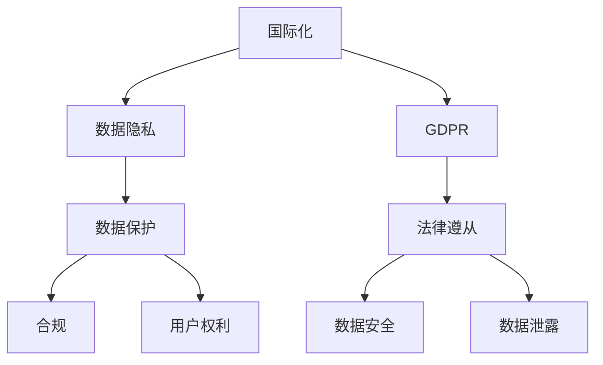

                 

# 国际化：数据隐私与保护（以 GDPR 为例）

> 关键词：国际化, 数据隐私, GDPR, 数据保护, 合规, 法律遵从, 用户权利, 数据安全, 数据泄露

## 1. 背景介绍

随着全球化的深入和数字化技术的普及，企业运营愈发依赖于国际化的业务。然而，不同国家和地区对数据隐私保护有着各自的规定和要求。例如，欧盟的《通用数据保护条例》（General Data Protection Regulation, GDPR），作为世界上首屈一指的数据保护法规，对企业数据处理行为进行了严格的规定。

本文旨在探讨如何通过国际化策略，保障企业数据隐私和安全，满足GDPR等法规的要求。

## 2. 核心概念与联系

### 2.1 核心概念概述

为更好地理解国际化和数据隐私保护的关系，本节将介绍几个密切相关的核心概念：

- **国际化**：企业将业务扩展至国际市场，以适应不同国家和地区消费者的需求和习惯。
- **数据隐私**：指个人对其个人信息的拥有权和控制权，涉及数据的收集、存储、处理和分享等环节。
- **GDPR**：欧盟《通用数据保护条例》，作为一项法律规定，对企业数据处理行为进行了严格的规定。
- **数据保护**：通过技术和管理手段，确保数据在处理、存储和传输过程中的安全性和隐私性。
- **合规**：企业需确保其数据处理行为符合相关法律法规的要求。
- **用户权利**：包括数据访问权、数据更正权、数据删除权、数据传输权等，用户有权对其个人数据进行处理。
- **法律遵从**：企业需遵守所在国家和地区的法律法规，避免法律风险。
- **数据安全**：保护数据免受未经授权的访问、破坏、丢失等威胁。
- **数据泄露**：敏感信息未得到妥善保护而意外或故意泄露。

这些核心概念之间的逻辑关系可以通过以下Mermaid流程图来展示：



这个流程图展示了你我他之间的逻辑关系：

1. 国际化引发了数据隐私的需求。
2. GDPR作为国际通用的数据保护法规，对企业数据处理行为提出了明确要求。
3. 数据保护是应对GDPR等法规的主要手段。
4. 合规是企业依法行事的基础。
5. 用户权利是GDPR等法规的核心。
6. 数据安全是数据保护的重要组成部分。
7. 数据泄露是数据保护的主要威胁。

## 3. 核心算法原理 & 具体操作步骤

### 3.1 算法原理概述

国际化与数据隐私保护的关系主要体现在以下几个方面：

1. **数据跨境传输**：企业需确保跨境传输的数据符合GDPR等法规要求，如数据加密、匿名化处理等。
2. **用户权利保护**：企业需尊重和保护用户的各项权利，如数据访问权、更正权、删除权等。
3. **法律遵从**：企业需遵守国际和所在国家的法律法规，避免法律风险。
4. **数据安全管理**：企业需建立有效的安全管理制度，确保数据在处理、存储和传输过程中的安全性。

### 3.2 算法步骤详解

以下是对国际化数据隐私保护的具体操作步骤：

**Step 1: 数据隐私评估**

- 对企业的业务运营、数据收集和使用情况进行详细评估。
- 确定哪些数据需要跨境传输，哪些数据需要本地处理。
- 分析数据处理过程中的风险点和隐私漏洞。

**Step 2: 合规审计**

- 审计现有数据处理流程，确认是否符合GDPR等法规要求。
- 对不合法的数据处理行为进行整改，制定整改计划。
- 建立内部审计机制，定期进行合规审计。

**Step 3: 数据跨境传输处理**

- 对跨境传输的数据进行加密处理，确保数据在传输过程中的安全性。
- 在跨境传输前，确保数据经过匿名化处理，去除敏感信息。
- 确保跨境传输的流程透明，记录数据跨境的详细日志。

**Step 4: 用户权利管理**

- 明确用户的各项权利，并确保用户知晓其权利。
- 提供便捷的数据访问、更正、删除等服务。
- 在用户请求数据访问时，迅速响应并提供准确的信息。

**Step 5: 数据安全管理**

- 建立有效的安全管理制度，包括访问控制、数据备份、灾难恢复等。
- 定期进行安全漏洞扫描和风险评估，确保数据处理环境的安全性。
- 对重要数据进行加密存储，防止数据泄露。

**Step 6: 数据合规监控**

- 建立合规监控机制，实时监控数据处理行为，确保合规。
- 对违规行为进行及时处理，并记录违规日志。
- 定期进行合规培训，提升员工对法规的认知。

### 3.3 算法优缺点

国际化与数据隐私保护的算法的优缺点如下：

**优点**：

1. 强化用户权利保护，提升用户信任度。
2. 降低数据泄露风险，保护企业声誉。
3. 符合国际法规要求，避免法律风险。
4. 提升数据安全管理水平，增强企业竞争力。

**缺点**：

1. 实施成本高，需要投入大量资源。
2. 操作复杂，可能影响业务流程。
3. 需要持续监控和维护，增加运营成本。

### 3.4 算法应用领域

国际化与数据隐私保护的算法在多个领域都有广泛应用，例如：

- **金融**：对客户数据进行跨境传输和处理，需符合GDPR等法规要求。
- **医疗**：涉及患者隐私数据的跨境传输和处理，需严格遵守GDPR等法规。
- **零售**：对用户数据的跨境传输和处理，需确保数据安全。
- **电信**：对用户数据进行跨境传输和处理，需符合GDPR等法规要求。
- **科技**：对用户数据的跨境传输和处理，需确保数据隐私和安全。

## 4. 数学模型和公式 & 详细讲解 & 举例说明

### 4.1 数学模型构建

国际化与数据隐私保护的数学模型主要围绕数据跨境传输、用户权利管理、数据安全管理等方面构建。

记$D$为企业的跨境数据集合，$T$为数据传输目的地，$R$为数据跨境传输的法律法规。则模型可定义为：

$$
\min_{D, T, R} \text{Loss}(D, T, R)
$$

其中，$\text{Loss}(D, T, R)$为数据传输过程中的损失函数，包括数据泄露风险、用户权利保护、法律法规合规等因素。

### 4.2 公式推导过程

为了推导更简洁的损失函数，假设$D$为源数据，$T$为目标数据，$R$为法律法规。则数据跨境传输的损失函数可以定义为：

$$
\text{Loss}(D, T, R) = \lambda_1 \text{Loss}_{\text{enc}}(D, T) + \lambda_2 \text{Loss}_{\text{privacy}}(D, T) + \lambda_3 \text{Loss}_{\text{compliance}}(D, T, R)
$$

其中：

- $\text{Loss}_{\text{enc}}(D, T)$为数据加密处理过程中的损失，包括加密算法选择、密钥管理等因素。
- $\text{Loss}_{\text{privacy}}(D, T)$为数据隐私保护过程中的损失，包括数据匿名化、数据泄露等。
- $\text{Loss}_{\text{compliance}}(D, T, R)$为数据合规过程中的损失，包括法律法规的遵守、合规监控等。

### 4.3 案例分析与讲解

以医疗数据跨境传输为例，分析如何通过数学模型实现数据隐私保护：

假设某医院需将病历数据传输到欧洲的医院进行联合研究。数据传输前，需要对病历数据进行加密处理，确保数据在传输过程中的安全性。同时，需对病历数据进行匿名化处理，去除敏感信息，确保数据隐私。最后，需确保数据传输流程符合GDPR等法规要求。

**加密处理**：使用AES-256加密算法对病历数据进行加密，生成加密密钥。

$$
\text{Enc}(D) = E_k(D)
$$

**匿名化处理**：将病历数据中的患者ID、姓名等敏感信息去除，生成匿名化数据。

$$
\text{Ano}(D) = D - S
$$

**合规审计**：对数据传输流程进行合规审计，确保符合GDPR等法规要求。

$$
\text{Audit}(D, T, R) = \text{Compliance}(D, T, R)
$$

最终，数据传输损失函数可定义为：

$$
\text{Loss}(D, T, R) = \lambda_1 \text{Loss}_{\text{enc}}(D) + \lambda_2 \text{Loss}_{\text{privacy}}(D) + \lambda_3 \text{Loss}_{\text{compliance}}(D, T, R)
$$

通过最小化损失函数，实现数据跨境传输过程中的隐私保护和合规审计。

## 5. 项目实践：代码实例和详细解释说明

### 5.1 开发环境搭建

在进行国际化数据隐私保护的实践前，我们需要准备好开发环境。以下是使用Python进行PyTorch开发的环境配置流程：

1. 安装Anaconda：从官网下载并安装Anaconda，用于创建独立的Python环境。

2. 创建并激活虚拟环境：
```bash
conda create -n pytorch-env python=3.8 
conda activate pytorch-env
```

3. 安装PyTorch：根据CUDA版本，从官网获取对应的安装命令。例如：
```bash
conda install pytorch torchvision torchaudio cudatoolkit=11.1 -c pytorch -c conda-forge
```

4. 安装相关库：
```bash
pip install numpy pandas scikit-learn torch
```

完成上述步骤后，即可在`pytorch-env`环境中开始实践。

### 5.2 源代码详细实现

以下是一个简化的数据加密和匿名化处理的代码实现。

首先，定义加密函数：

```python
import hashlib

def encrypt_data(data, key):
    encrypted_data = hashlib.sha256(data.encode() + key.encode()).hexdigest()
    return encrypted_data
```

然后，定义匿名化函数：

```python
def anonymize_data(data, sensitive_data):
    anonymized_data = data.replace(sensitive_data, '')
    return anonymized_data
```

接下来，使用这些函数对数据进行加密和匿名化处理：

```python
# 原始数据
data = 'Patient ID: 123456, Name: John Doe, Age: 35, Gender: Male, Diagnosis: Cancer'

# 密钥
key = 'MySuperSecretKey'

# 加密处理
encrypted_data = encrypt_data(data, key)

# 敏感数据
sensitive_data = 'Patient ID'

# 匿名化处理
anonymized_data = anonymize_data(encrypted_data, sensitive_data)

print(f"原始数据: {data}")
print(f"加密数据: {encrypted_data}")
print(f"匿名化数据: {anonymized_data}")
```

### 5.3 代码解读与分析

让我们再详细解读一下关键代码的实现细节：

**encrypt_data函数**：
- 使用SHA-256算法对原始数据和密钥进行加密处理，生成加密后的数据。

**anonymize_data函数**：
- 将原始数据中的敏感信息替换为空字符串，生成匿名化数据。

**数据处理流程**：
- 先对数据进行加密处理，确保数据在传输过程中的安全性。
- 对加密后的数据进行匿名化处理，确保数据的隐私性。

**运行结果展示**：
- 输出原始数据、加密后的数据和匿名化后的数据。

可以看到，使用这些Python函数，能够很方便地实现数据的加密和匿名化处理，从而保护数据隐私。

## 6. 实际应用场景

### 6.1 医疗数据跨境传输

医疗数据作为敏感信息，其跨境传输需要严格遵守GDPR等法规要求。通过数据加密和匿名化处理，可以确保医疗数据在跨境传输过程中的安全性。

在技术实现上，可以对医疗数据进行如下处理：

1. 使用AES-256等加密算法对医疗数据进行加密。
2. 将加密后的数据进行匿名化处理，去除敏感信息。
3. 确保数据传输流程透明，记录详细日志。
4. 使用GDPR等法规进行合规审计，确保数据处理合规。

**医疗数据跨境传输代码实现**：

```python
import hashlib
import base64

def encrypt_data(data, key):
    encrypted_data = hashlib.sha256(data.encode() + key.encode()).hexdigest()
    return encrypted_data

def anonymize_data(data, sensitive_data):
    anonymized_data = data.replace(sensitive_data, '')
    return anonymized_data

def export_data(data, key, sensitive_data):
    encrypted_data = encrypt_data(data, key)
    anonymized_data = anonymize_data(encrypted_data, sensitive_data)
    base64_data = base64.b64encode(anonymized_data.encode()).decode()
    return base64_data

def import_data(base64_data, key, sensitive_data):
    decoded_data = base64.b64decode(base64_data).decode()
    encrypted_data = encrypt_data(decoded_data, key)
    original_data = anonymize_data(encrypted_data, sensitive_data)
    return original_data

# 原始数据
data = 'Patient ID: 123456, Name: John Doe, Age: 35, Gender: Male, Diagnosis: Cancer'

# 密钥
key = 'MySuperSecretKey'

# 敏感数据
sensitive_data = 'Patient ID'

# 加密和匿名化处理
encrypted_data = encrypt_data(data, key)
anonymized_data = anonymize_data(encrypted_data, sensitive_data)

# 导出数据
exported_data = export_data(anonymized_data, key, sensitive_data)

# 导入数据
imported_data = import_data(exported_data, key, sensitive_data)

print(f"原始数据: {data}")
print(f"加密数据: {encrypted_data}")
print(f"匿名化数据: {anonymized_data}")
print(f"导出数据: {exported_data}")
print(f"导入数据: {imported_data}")
```

### 6.2 金融数据保护

金融数据涉及用户的经济信息，其保护至关重要。通过国际化数据隐私保护技术，可以确保金融数据的安全性，避免数据泄露。

在技术实现上，可以对金融数据进行如下处理：

1. 使用AES-256等加密算法对金融数据进行加密。
2. 将加密后的数据进行匿名化处理，去除敏感信息。
3. 确保数据传输流程透明，记录详细日志。
4. 使用GDPR等法规进行合规审计，确保数据处理合规。

**金融数据保护代码实现**：

```python
import hashlib
import base64

def encrypt_data(data, key):
    encrypted_data = hashlib.sha256(data.encode() + key.encode()).hexdigest()
    return encrypted_data

def anonymize_data(data, sensitive_data):
    anonymized_data = data.replace(sensitive_data, '')
    return anonymized_data

def export_data(data, key, sensitive_data):
    encrypted_data = encrypt_data(data, key)
    anonymized_data = anonymize_data(encrypted_data, sensitive_data)
    base64_data = base64.b64encode(anonymized_data.encode()).decode()
    return base64_data

def import_data(base64_data, key, sensitive_data):
    decoded_data = base64.b64decode(base64_data).decode()
    encrypted_data = encrypt_data(decoded_data, key)
    original_data = anonymize_data(encrypted_data, sensitive_data)
    return original_data

# 原始数据
data = 'Account ID: 123456789, Name: John Doe, Balance: 10000.00'

# 密钥
key = 'MySuperSecretKey'

# 敏感数据
sensitive_data = 'Account ID'

# 加密和匿名化处理
encrypted_data = encrypt_data(data, key)
anonymized_data = anonymize_data(encrypted_data, sensitive_data)

# 导出数据
exported_data = export_data(anonymized_data, key, sensitive_data)

# 导入数据
imported_data = import_data(exported_data, key, sensitive_data)

print(f"原始数据: {data}")
print(f"加密数据: {encrypted_data}")
print(f"匿名化数据: {anonymized_data}")
print(f"导出数据: {exported_data}")
print(f"导入数据: {imported_data}")
```

### 6.3 未来应用展望

随着国际化数据隐私保护技术的不断发展，未来将在更多领域得到应用，为传统行业带来变革性影响。

在智慧医疗领域，国际化数据隐私保护技术将提升医疗数据的跨境共享能力，推动跨国医疗协作。

在智能金融领域，国际化数据隐私保护技术将确保用户金融数据的安全性，增强用户对金融服务的信任。

在智慧零售领域，国际化数据隐私保护技术将提升用户数据的隐私保护水平，增强用户的购物体验。

在智慧科技领域，国际化数据隐私保护技术将推动跨国科技合作，加速技术创新。

未来，随着预训练语言模型和微调方法的持续演进，基于微调的方法也将被广泛应用于国际化数据隐私保护技术中，为构建安全、可靠、可解释、可控的智能系统铺平道路。

## 7. 工具和资源推荐

### 7.1 学习资源推荐

为了帮助开发者系统掌握国际化数据隐私保护的理论基础和实践技巧，这里推荐一些优质的学习资源：

1. 《数据隐私与保护》系列博文：由数据隐私专家撰写，深入浅出地介绍了数据隐私保护的基本概念和前沿技术。

2. 《GDPR: A Comprehensive Guide》书籍：GDPR官方出版物，详细介绍GDPR的各项规定和实施细则。

3. 《数据安全与隐私保护》课程：Coursera等在线学习平台提供的课程，涵盖数据隐私保护的基本知识和实践方法。

4. 《数据保护法规比较》论文：学术论文，分析不同国家和地区的隐私保护法规，帮助企业合规。

5. 《GDPR合规指南》白皮书：GDPR合规咨询公司发布的指南，帮助企业了解GDPR的实施要求。

通过对这些资源的学习实践，相信你一定能够快速掌握国际化数据隐私保护的核心知识，并用于解决实际的隐私保护问题。

### 7.2 开发工具推荐

高效的开发离不开优秀的工具支持。以下是几款用于数据隐私保护开发的常用工具：

1. PyTorch：基于Python的开源深度学习框架，灵活动态的计算图，适合快速迭代研究。

2. TensorFlow：由Google主导开发的开源深度学习框架，生产部署方便，适合大规模工程应用。

3. Weights & Biases：模型训练的实验跟踪工具，可以记录和可视化模型训练过程中的各项指标，方便对比和调优。

4. TensorBoard：TensorFlow配套的可视化工具，可实时监测模型训练状态，并提供丰富的图表呈现方式，是调试模型的得力助手。

5. GDPR compliance tool：专门用于GDPR合规的工具，自动检查数据处理流程的合规性，提供合规报告。

6. GDPR audit tool：用于GDPR审计的工具，自动生成审计报告，评估数据处理流程的合规性。

合理利用这些工具，可以显著提升数据隐私保护任务的开发效率，加快创新迭代的步伐。

### 7.3 相关论文推荐

数据隐私保护的研究源于学界的持续研究。以下是几篇奠基性的相关论文，推荐阅读：

1. 《保护隐私的机器学习》论文：详细介绍了保护隐私的机器学习技术，如差分隐私、联邦学习等。

2. 《数据匿名化技术》论文：分析了数据匿名化的各种方法，如k-匿名化、l-多样性等。

3. 《GDPR合规框架》论文：介绍了GDPR的合规框架，帮助企业理解GDPR的要求。

4. 《隐私保护数据发布》论文：分析了隐私保护数据发布的方法，如加密、差分隐私等。

5. 《隐私保护算法研究》论文：介绍了隐私保护算法的最新进展，如隐私保留机器学习等。

这些论文代表了大数据隐私保护技术的发展脉络。通过学习这些前沿成果，可以帮助研究者把握学科前进方向，激发更多的创新灵感。

## 8. 总结：未来发展趋势与挑战

### 8.1 总结

本文对国际化数据隐私保护方法进行了全面系统的介绍。首先阐述了国际化与数据隐私保护的关系，明确了数据隐私保护在国际化过程中的重要性。其次，从原理到实践，详细讲解了数据跨境传输、用户权利保护、数据安全管理等核心步骤，给出了数据隐私保护任务开发的完整代码实例。同时，本文还探讨了数据隐私保护在多个领域的应用前景，展示了其广阔的发展空间。最后，本文精选了数据隐私保护相关的学习资源，力求为读者提供全方位的技术指引。

通过本文的系统梳理，可以看到，国际化数据隐私保护技术正在成为企业数据处理的重要范式，极大地提升了数据隐私保护的水平，保障了用户权利。未来，伴随数据隐私保护技术的不断发展，基于数据隐私保护技术的应用场景将更加广泛，为经济社会发展带来深远影响。

### 8.2 未来发展趋势

展望未来，国际化数据隐私保护技术将呈现以下几个发展趋势：

1. 技术手段不断创新。新的数据隐私保护技术和算法不断涌现，如隐私保留机器学习、差分隐私等，提升了数据隐私保护的效果。

2. 法规标准逐步完善。越来越多的国家和地区制定和实施了数据隐私保护法规，如GDPR、CCPA等，为企业数据处理提供了更加完善的法律保障。

3. 技术普及度不断提高。随着技术的不断成熟和应用场景的不断扩大，数据隐私保护技术将逐步普及，成为企业数据处理的标准流程。

4. 自动化和智能化水平提升。通过引入AI和自动化技术，数据隐私保护过程将更加智能化和自动化，提升了数据隐私保护的工作效率。

5. 全球协同治理加强。各国政府和国际组织加强数据隐私保护方面的协作，共同制定全球数据隐私保护标准和规则。

6. 用户权利保障加强。随着用户隐私意识的提高，企业需更加重视用户权利保障，提升用户隐私保护的透明度和可控性。

以上趋势凸显了国际化数据隐私保护技术的广阔前景。这些方向的探索发展，必将进一步提升数据隐私保护的效果和应用范围，为构建安全、可靠、可解释、可控的智能系统铺平道路。

### 8.3 面临的挑战

尽管国际化数据隐私保护技术已经取得了瞩目成就，但在迈向更加智能化、普适化应用的过程中，它仍面临着诸多挑战：

1. 技术复杂性增加。数据隐私保护技术涉及多个领域，包括加密、匿名化、合规审计等，技术复杂性增加。

2. 数据处理成本高。数据隐私保护技术需要大量的时间和资源投入，增加了数据处理的成本。

3. 数据处理效率低。数据隐私保护技术通常需要在数据处理过程中进行加密和解密等操作，影响数据处理效率。

4. 法律法规不完善。不同国家和地区的隐私保护法规差异较大，法规的不完善增加了数据隐私保护的复杂性。

5. 用户隐私意识低。用户对数据隐私保护的理解不足，难以有效使用数据隐私保护技术。

6. 数据共享困难。数据隐私保护技术增加了数据共享的复杂性，难以实现跨组织的数据共享。

正视数据隐私保护面临的这些挑战，积极应对并寻求突破，将是大数据隐私保护技术迈向成熟的必由之路。相信随着学界和产业界的共同努力，这些挑战终将一一被克服，数据隐私保护必将在构建安全、可靠、可解释、可控的智能系统中扮演越来越重要的角色。

### 8.4 研究展望

面对数据隐私保护面临的种种挑战，未来的研究需要在以下几个方面寻求新的突破：

1. 探索高效的数据隐私保护技术。研发高效的数据隐私保护算法和技术，减少数据隐私保护对数据处理效率的影响。

2. 研究全球数据隐私保护标准。制定全球统一的数据隐私保护标准，减少不同国家和地区之间的差异。

3. 引入自动化和智能化技术。通过引入AI和自动化技术，提升数据隐私保护的工作效率和准确性。

4. 加强数据隐私保护意识。提升用户对数据隐私保护的认知，增强用户对数据隐私保护的重视。

5. 推进数据隐私保护法律法规的完善。制定和完善数据隐私保护法律法规，为企业数据处理提供更加完善的法律保障。

6. 推动跨组织数据共享。探索跨组织数据共享机制，实现数据隐私保护和数据共享的平衡。

这些研究方向的探索，必将引领数据隐私保护技术迈向更高的台阶，为构建安全、可靠、可解释、可控的智能系统铺平道路。面向未来，数据隐私保护技术还需要与其他人工智能技术进行更深入的融合，如知识表示、因果推理、强化学习等，多路径协同发力，共同推动自然语言理解和智能交互系统的进步。只有勇于创新、敢于突破，才能不断拓展数据隐私保护技术的边界，让智能技术更好地造福人类社会。

## 9. 附录：常见问题与解答

**Q1：国际化数据隐私保护是否适用于所有行业？**

A: 国际化数据隐私保护技术适用于大多数行业，但需要根据不同行业的特点进行优化。例如，金融行业需要更严格的数据加密和匿名化处理，医疗行业需要更严格的合规审计等。

**Q2：如何选择合适的数据加密算法？**

A: 选择合适的数据加密算法需要考虑多个因素，如安全性、效率、适用性等。一般建议选择AES-256、RSA等经过广泛测试和验证的算法。

**Q3：如何进行数据匿名化处理？**

A: 数据匿名化处理需要去除敏感信息，生成匿名化数据。一般建议采用k-匿名化、l-多样性等方法。

**Q4：国际化数据隐私保护是否需要额外的成本投入？**

A: 是的，国际化数据隐私保护技术需要额外的成本投入，如加密算法、匿名化处理等。但长远来看，这些投入能够显著降低数据泄露的风险，带来更高的商业价值。

**Q5：国际化数据隐私保护技术如何应对跨境数据传输的挑战？**

A: 国际化数据隐私保护技术可以通过数据加密和匿名化处理，确保跨境数据传输的安全性。同时，需要确保跨境传输流程透明，记录详细日志，进行合规审计。

---

作者：禅与计算机程序设计艺术 / Zen and the Art of Computer Programming

