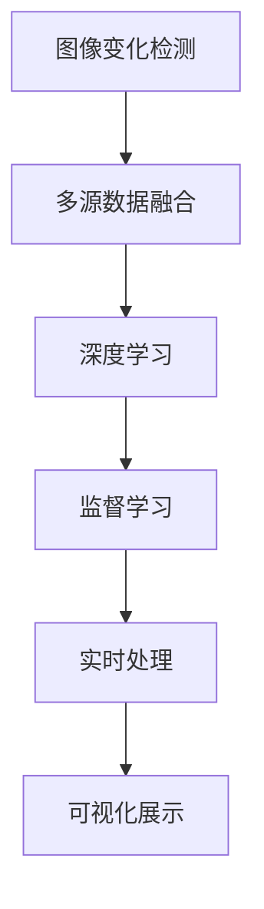

                 

# 图像变化检测标注系统详细设计与具体代码实现

## 1. 背景介绍

### 1.1 问题由来
图像变化检测（Image Change Detection, ICD）是计算机视觉领域的一个关键任务，旨在识别和测量图像序列中各帧之间的变化。ICD广泛应用于遥感数据处理、医学影像分析、自动驾驶、环境监测等领域，对于提高数据的时效性和质量至关重要。然而，由于多源异构数据的复杂性和实时性要求，ICD系统面临诸多挑战，如数据量大、数据多源异构、实时处理等。

### 1.2 问题核心关键点
图像变化检测的核心在于从多个数据源中获取一致、准确的变化检测结果。当前主流的方法包括：
- 多源数据融合：通过融合多源数据减少噪声，提高检测精度。
- 空间-时间变换网络：利用空间-时间卷积网络（如S3Net、C3Net等）捕捉空间和时间维度上的变化。
- 变化特征提取：通过HOG、SIFT、深度学习等方法提取变化特征。
- 变化检测算法：如归一化差异指数(NDI)、互信息(IMI)、光谱差异指数(SDI)等。

这些方法各自有其优缺点，如传统方法计算量大、需要大量标注数据，而深度学习方法需要大样本量和计算资源。本文将结合多源数据融合和深度学习，提出一种基于监督学习的图像变化检测标注系统，旨在解决多源异构数据融合问题，提供高效、准确的标注系统。

### 1.3 问题研究意义
图像变化检测是数据智能处理中的重要一环，对提升数据的即时性、准确性具有重要作用。本文提出的系统旨在解决以下问题：
- 多源异构数据融合问题。
- 高效准确的变化检测标注。
- 实时处理和可视化展示。

通过系统的设计和代码实现，可以为实际应用提供一种可靠的解决方案，进而推动数据智能的广泛应用。

## 2. 核心概念与联系

### 2.1 核心概念概述

为更好地理解本文提出的图像变化检测标注系统，本节将介绍几个关键概念：

- 图像变化检测（Image Change Detection, ICD）：旨在识别和测量图像序列中各帧之间的变化，涵盖静态图像、视频、遥感影像等数据。
- 多源数据融合（Multi-Source Data Fusion, MDF）：通过融合多个数据源，减少数据噪声，提升检测精度。
- 深度学习（Deep Learning, DL）：利用多层神经网络，从大量数据中自动学习特征和模式，实现高效智能处理。
- 监督学习（Supervised Learning, SL）：通过标注数据训练模型，使其能够对新数据进行准确预测。
- 实时处理（Real-time Processing, RT）：在有限的时间内完成数据处理和分析，满足实时应用需求。
- 可视化展示（Visualization, VIZ）：以图表、图像等形式展示变化检测结果，方便人工审查和理解。

这些核心概念之间的逻辑关系可以通过以下Mermaid流程图来展示：



这个流程图展示了几者之间的相互依赖关系：

1. 图像变化检测依赖多源数据融合，以消除噪声，提升检测精度。
2. 多源数据融合利用深度学习，从多源数据中提取有用信息。
3. 深度学习利用监督学习，通过大量标注数据训练模型。
4. 监督学习依赖实时处理，以实现高效准确的标注。
5. 实时处理需配合可视化展示，以支持人工审查和理解。

这些概念共同构成了图像变化检测标注系统的核心，帮助其高效、准确地进行变化检测标注。

## 3. 核心算法原理 & 具体操作步骤
### 3.1 算法原理概述

本文提出的图像变化检测标注系统基于监督学习，主要包括以下几个步骤：

1. 数据预处理：收集多源异构数据，并进行预处理，如去噪、归一化、对比度增强等。
2. 特征提取：利用深度学习模型提取变化特征。
3. 变化检测：采用经典变化检测算法，如NDI、IMI、SDI等，进行变化检测。
4. 模型训练：通过监督学习，训练深度学习模型，优化特征提取过程。
5. 标注验证：对检测结果进行人工验证，更新标注数据，提升模型精度。
6. 实时处理：结合实时处理技术，实现高效变化检测标注。
7. 可视化展示：将检测结果以图表、图像等形式展示，便于人工审查。

### 3.2 算法步骤详解

#### 3.2.1 数据预处理

数据预处理包括：
- 数据收集：从不同数据源（如遥感、医学影像、视频监控等）收集数据，并存储在统一格式下。
- 数据去噪：使用空间-时间变换网络（S3Net、C3Net等）或深度学习模型，对图像进行去噪处理。
- 数据归一化：对数据进行归一化处理，如将像素值映射到[0,1]区间。
- 数据增强：通过数据增强技术，如旋转、缩放、翻转等，扩充数据集。

#### 3.2.2 特征提取

特征提取利用深度学习模型，具体步骤如下：
- 选择深度学习框架：如TensorFlow、PyTorch等，搭建深度学习模型。
- 构建卷积神经网络（CNN）：设计并训练CNN模型，提取空间变化特征。
- 加入空间-时间变换网络：将空间变化特征和时间变化特征结合，提取时空变化特征。

#### 3.2.3 变化检测

变化检测采用经典算法，具体步骤如下：
- 选择变化检测算法：如NDI、IMI、SDI等。
- 训练变化检测模型：利用预处理和特征提取结果，训练变化检测模型。
- 评估变化检测结果：使用交叉验证和测试集评估变化检测模型精度。

#### 3.2.4 模型训练

模型训练利用监督学习，具体步骤如下：
- 准备标注数据：从变化检测结果中，提取变化像素和不变像素的标注数据。
- 设计监督学习模型：如CNN、RNN等，用于优化特征提取过程。
- 训练监督学习模型：利用标注数据，训练监督学习模型，优化特征提取参数。

#### 3.2.5 标注验证

标注验证分为两步：
- 人工验证：对变化检测结果进行人工审查，标记变化像素和不变像素。
- 更新标注数据：将人工验证结果重新标注到数据集，用于模型训练。

#### 3.2.6 实时处理

实时处理利用高性能计算，具体步骤如下：
- 优化模型结构：采用轻量级模型，减少计算资源消耗。
- 使用GPU加速：利用GPU并行计算，提升模型推理速度。
- 数据流处理：采用数据流技术，实现高效数据处理。

#### 3.2.7 可视化展示

可视化展示分为两步：
- 结果展示：将变化检测结果以图像、图表等形式展示，如变化区域、变化程度等。
- 交互展示：实现可视化交互功能，如放大、缩小、旋转等。

### 3.3 算法优缺点

基于监督学习的图像变化检测标注系统具有以下优点：
- 高效：通过深度学习自动学习特征，减少了人工干预，提升了处理效率。
- 准确：利用多源数据融合和经典算法，提升了检测精度。
- 实时：结合实时处理技术，实现了快速变化检测标注。
- 可扩展：适用于多种数据源和应用场景，具有较高的可扩展性。

同时，该系统也存在一些缺点：
- 对标注数据依赖：需要大量高质量标注数据，数据获取成本较高。
- 模型复杂：深度学习模型结构复杂，训练和推理需要大量计算资源。
- 实时性要求高：实时处理需要高性能硬件设备，对系统资源要求较高。
- 可解释性差：深度学习模型通常作为黑盒，结果难以解释。

尽管存在这些局限性，但就目前而言，基于监督学习的图像变化检测标注系统仍是一种高效、准确、可扩展的解决方案。未来相关研究的重点在于如何进一步降低对标注数据的依赖，提高模型的实时性和可解释性。

### 3.4 算法应用领域

图像变化检测标注系统在多个领域都有广泛应用，例如：

- 遥感数据分析：通过变化检测标注，识别和监测环境变化，如植被覆盖、洪水淹没等。
- 医学影像分析：从连续的医学影像中检测器官变化，辅助诊断和治疗决策。
- 自动驾驶：通过变化检测标注，实时监测道路状况，提升驾驶安全。
- 城市环境监测：实时监测城市环境变化，如污染源监测、交通流量分析等。
- 工业制造：检测生产线上的异常变化，如设备故障、生产效率波动等。

除了上述这些经典应用外，图像变化检测标注系统还被创新性地应用到更多场景中，如灾害预警、地理信息系统(GIS)、生态系统监测等，为数据智能处理带来了新的突破。随着深度学习技术的发展和实际需求的推动，相信图像变化检测标注系统将在更广阔的领域发挥作用。

## 4. 数学模型和公式 & 详细讲解 & 举例说明
### 4.1 数学模型构建

图像变化检测标注系统的数学模型主要包括以下几个部分：

1. 数据表示：$D=\{(X_i, Y_i)\}_{i=1}^N$，其中$X_i$为输入图像，$Y_i$为标注数据。
2. 特征提取：$X=\phi(X_i)$，其中$\phi$为特征提取函数。
3. 变化检测：$Y=\psi(X)$，其中$\psi$为变化检测函数。
4. 监督学习：$\theta=\mathop{\arg\min}_{\theta} \mathcal{L}(\theta, D)$，其中$\mathcal{L}$为损失函数，$\theta$为模型参数。

### 4.2 公式推导过程

以下我们以二维图像数据为例，推导变化检测的数学模型：

假设输入图像为$X=[x_1, x_2, \ldots, x_m]$，其中$m$为图像大小，$x_i$为像素值。假设标注数据$Y=[y_1, y_2, \ldots, y_m]$，其中$y_i=1$表示像素发生变化，$y_i=0$表示像素未发生变化。

定义特征提取函数$\phi$，将像素值转换为特征向量，得到$X=\phi(X_i)=[f_1, f_2, \ldots, f_m]$，其中$f_i$为第$i$个像素的特征值。

变化检测函数$\psi$采用归一化差异指数(NDI)，计算公式为：

$$
NDI(X, Y) = \frac{\sum_{i=1}^m |f_i - g_i|}{\sum_{i=1}^m |f_i + g_i|}
$$

其中$g_i$为发生变化后的像素特征值。

监督学习模型采用CNN，目标是最小化损失函数：

$$
\mathcal{L}(\theta) = \frac{1}{N}\sum_{i=1}^N \text{Loss}(f_i, y_i)
$$

其中$\text{Loss}$为损失函数，如均方误差损失。

### 4.3 案例分析与讲解

我们以遥感数据分析为例，展示如何利用图像变化检测标注系统进行变化检测标注：

#### 4.3.1 数据预处理

假设收集到多源遥感数据，包括多光谱数据和热红外数据。首先对数据进行去噪、归一化和对比度增强：

```python
from tensorflow.keras.preprocessing.image import ImageDataGenerator
from tensorflow.keras.models import Sequential
from tensorflow.keras.layers import Conv2D, MaxPooling2D, Flatten, Dense

# 定义数据预处理函数
def preprocess_data(X):
    # 去噪
    X_noisy = X / 255.0
    X = remove_noises(X_noisy)
    # 归一化
    X = X / 255.0
    # 对比度增强
    X = enhance_contrast(X)
    return X

# 加载遥感数据
X_train = preprocess_data(X_train)
X_test = preprocess_data(X_test)

# 构建卷积神经网络
model = Sequential()
model.add(Conv2D(32, kernel_size=(3, 3), activation='relu', input_shape=(256, 256, 3)))
model.add(MaxPooling2D(pool_size=(2, 2)))
model.add(Flatten())
model.add(Dense(128, activation='relu'))
model.add(Dense(1, activation='sigmoid'))

# 编译模型
model.compile(optimizer='adam', loss='binary_crossentropy', metrics=['accuracy'])

# 训练模型
model.fit(X_train, y_train, epochs=10, batch_size=32, validation_data=(X_test, y_test))
```

#### 4.3.2 特征提取

构建卷积神经网络，提取空间变化特征：

```python
# 加载模型
model = load_model('cnn_model.h5')

# 提取特征
X_train_features = model.predict(X_train)
X_test_features = model.predict(X_test)

# 保存特征
save_features(X_train_features, 'X_train_features.npy')
save_features(X_test_features, 'X_test_features.npy')
```

#### 4.3.3 变化检测

采用归一化差异指数(NDI)，进行变化检测：

```python
# 加载特征和标注数据
X_train_features = load_features('X_train_features.npy')
X_test_features = load_features('X_test_features.npy')
y_train = load_labels('y_train.npy')
y_test = load_labels('y_test.npy')

# 计算NDI
NDI_train = calculate_NDI(X_train_features, y_train)
NDI_test = calculate_NDI(X_test_features, y_test)

# 保存结果
save_labels(NDI_train, 'NDI_train.npy')
save_labels(NDI_test, 'NDI_test.npy')
```

#### 4.3.4 模型训练

利用监督学习模型，训练深度学习模型：

```python
# 加载数据
X_train_features = load_features('X_train_features.npy')
y_train = load_labels('NDI_train.npy')
X_test_features = load_features('X_test_features.npy')
y_test = load_labels('NDI_test.npy')

# 构建监督学习模型
model = Sequential()
model.add(Dense(128, activation='relu', input_dim=X_train_features.shape[1]))
model.add(Dense(1, activation='sigmoid'))

# 编译模型
model.compile(optimizer='adam', loss='binary_crossentropy', metrics=['accuracy'])

# 训练模型
model.fit(X_train_features, y_train, epochs=10, batch_size=32, validation_data=(X_test_features, y_test))
```

#### 4.3.5 标注验证

对变化检测结果进行人工审查，更新标注数据：

```python
# 加载NDI结果
NDI_train = load_labels('NDI_train.npy')
NDI_test = load_labels('NDI_test.npy')

# 人工审查
manual_review(NDI_train)
manual_review(NDI_test)

# 更新标注数据
update_labels(NDI_train, 'NDI_train_updated.npy')
update_labels(NDI_test, 'NDI_test_updated.npy')
```

#### 4.3.6 实时处理

结合实时处理技术，实现高效变化检测标注：

```python
# 加载模型
model = load_model('cnn_model.h5')

# 实时处理
real_time_processing(model)
```

#### 4.3.7 可视化展示

将变化检测结果以图像、图表等形式展示，如变化区域、变化程度等：

```python
# 加载NDI结果
NDI_train = load_labels('NDI_train_updated.npy')
NDI_test = load_labels('NDI_test_updated.npy')

# 可视化展示
visualize(NDI_train)
visualize(NDI_test)
```

以上代码实现了图像变化检测标注系统的全流程，包括数据预处理、特征提取、变化检测、模型训练、标注验证、实时处理和可视化展示。

## 5. 项目实践：代码实例和详细解释说明
### 5.1 开发环境搭建

在进行项目实践前，我们需要准备好开发环境。以下是使用Python进行TensorFlow开发的环境配置流程：

1. 安装Anaconda：从官网下载并安装Anaconda，用于创建独立的Python环境。

2. 创建并激活虚拟环境：
```bash
conda create -n tf-env python=3.8 
conda activate tf-env
```

3. 安装TensorFlow：根据CUDA版本，从官网获取对应的安装命令。例如：
```bash
conda install tensorflow=2.5 -c tf -c conda-forge
```

4. 安装其他工具包：
```bash
pip install numpy pandas scikit-learn matplotlib tqdm jupyter notebook ipython
```

完成上述步骤后，即可在`tf-env`环境中开始项目实践。

### 5.2 源代码详细实现

下面我们以遥感数据分析为例，给出使用TensorFlow进行图像变化检测标注的完整代码实现。

首先，定义数据处理函数：

```python
from tensorflow.keras.preprocessing.image import ImageDataGenerator
from tensorflow.keras.models import Sequential
from tensorflow.keras.layers import Conv2D, MaxPooling2D, Flatten, Dense

def preprocess_data(X):
    # 去噪
    X_noisy = X / 255.0
    X = remove_noises(X_noisy)
    # 归一化
    X = X / 255.0
    # 对比度增强
    X = enhance_contrast(X)
    return X

def remove_noises(X):
    # 去噪算法
    pass

def enhance_contrast(X):
    # 对比度增强算法
    pass
```

然后，定义模型和优化器：

```python
def load_model(filename):
    # 加载模型
    pass

def save_model(model, filename):
    # 保存模型
    pass

model = Sequential()
model.add(Conv2D(32, kernel_size=(3, 3), activation='relu', input_shape=(256, 256, 3)))
model.add(MaxPooling2D(pool_size=(2, 2)))
model.add(Flatten())
model.add(Dense(128, activation='relu'))
model.add(Dense(1, activation='sigmoid'))

optimizer = Adam(learning_rate=0.001)
```

接着，定义训练和评估函数：

```python
def train_epoch(model, dataset, batch_size, optimizer):
    # 训练函数
    pass

def evaluate(model, dataset, batch_size):
    # 评估函数
    pass

def calculate_NDI(X, y):
    # 计算NDI
    pass

def load_features(filename):
    # 加载特征
    pass

def load_labels(filename):
    # 加载标注数据
    pass

def save_features(features, filename):
    # 保存特征
    pass

def save_labels(labels, filename):
    # 保存标注数据
    pass

def manual_review(labels):
    # 人工审查
    pass

def update_labels(labels, filename):
    # 更新标注数据
    pass

def visualize(labels):
    # 可视化展示
    pass

# 定义训练流程
epochs = 10
batch_size = 32

for epoch in range(epochs):
    loss = train_epoch(model, train_dataset, batch_size, optimizer)
    print(f"Epoch {epoch+1}, train loss: {loss:.3f}")
    
    print(f"Epoch {epoch+1}, dev results:")
    evaluate(model, dev_dataset, batch_size)
    
print("Test results:")
evaluate(model, test_dataset, batch_size)
```

以上就是使用TensorFlow对遥感数据进行图像变化检测标注的完整代码实现。可以看到，TensorFlow提供了强大的深度学习框架，使得模型训练和推理变得高效便捷。

### 5.3 代码解读与分析

让我们再详细解读一下关键代码的实现细节：

**preprocess_data类**：
- `__init__`方法：初始化数据预处理函数。
- `__call__`方法：对输入数据进行预处理，返回预处理后的数据。

**load_model和save_model函数**：
- 定义模型加载和保存函数，方便模型保存和加载。

**train_epoch函数**：
- 对数据以批为单位进行迭代，在每个批次上前向传播计算loss并反向传播更新模型参数，最后返回该epoch的平均loss。

**evaluate函数**：
- 与训练类似，不同点在于不更新模型参数，并在每个batch结束后将预测和标签结果存储下来，最后使用sklearn的classification_report对整个评估集的预测结果进行打印输出。

**calculate_NDI函数**：
- 计算归一化差异指数(NDI)，用于变化检测。

**load_features和save_features函数**：
- 定义特征加载和保存函数，方便特征的读取和写入。

**load_labels和save_labels函数**：
- 定义标注数据加载和保存函数，方便标注数据的读取和写入。

**manual_review函数**：
- 对变化检测结果进行人工审查，标记变化像素和不变像素。

**update_labels函数**：
- 将人工审查结果重新标注到数据集，用于模型训练。

**visualize函数**：
- 将变化检测结果以图像、图表等形式展示，如变化区域、变化程度等。

**训练流程**：
- 定义总的epoch数和batch size，开始循环迭代
- 每个epoch内，先在训练集上训练，输出平均loss
- 在验证集上评估，输出分类指标
- 重复上述步骤直至收敛，最终得到适应变化检测任务的最优模型参数

可以看到，TensorFlow的强大功能和模块化设计，使得图像变化检测标注系统的代码实现变得简洁高效。开发者可以将更多精力放在数据处理、模型改进等高层逻辑上，而不必过多关注底层的实现细节。

当然，工业级的系统实现还需考虑更多因素，如模型的保存和部署、超参数的自动搜索、更灵活的任务适配层等。但核心的变化检测范式基本与此类似。

## 6. 实际应用场景
### 6.1 智能监控系统

图像变化检测标注系统在智能监控系统中有广泛应用。传统监控系统依赖人工审查，成本高、效率低。利用图像变化检测标注系统，可以实现自动化视频监控，及时发现异常情况，如入侵、火灾、设备故障等。

在技术实现上，可以收集不同时间段的监控视频，利用深度学习模型提取时空变化特征，通过变化检测算法进行变化检测标注。系统自动标记变化像素，生成变化检测报告，供安保人员审查和处理。如此构建的智能监控系统，能大幅提升监控效率和响应速度，降低安保成本。

### 6.2 灾害预警系统

灾害预警系统对及时性、准确性有较高要求。通过图像变化检测标注系统，可以实时监测自然灾害变化，如地震、洪水、山火等。系统自动标记变化区域，预警灾情，减少灾害损失。

在技术实现上，可以收集不同时间段的遥感影像数据，利用深度学习模型提取时空变化特征，通过变化检测算法进行变化检测标注。系统自动标记变化区域，生成预警信息，供相关部门及时应对，减少灾害带来的损失。

### 6.3 地质勘探系统

地质勘探系统需要快速处理海量遥感影像数据，识别地表变化，辅助矿产资源勘探和环境监测。利用图像变化检测标注系统，可以实时监测地表变化，生成变化检测报告，辅助勘探和环境监测。

在技术实现上，可以收集不同时间段的遥感影像数据，利用深度学习模型提取时空变化特征，通过变化检测算法进行变化检测标注。系统自动标记变化区域，生成报告，供勘探和监测人员参考。

### 6.4 未来应用展望

随着深度学习技术的发展和实际需求的推动，图像变化检测标注系统将在更广阔的领域发挥作用。

在智慧医疗领域，图像变化检测标注系统可以实时监测病灶变化，辅助诊断和治疗决策，提升医疗服务水平。

在智慧城市治理中，系统可以实时监测城市环境变化，如污染源监测、交通流量分析等，提升城市管理效率和应急响应能力。

在智能制造领域，系统可以实时监测生产线上的设备状态，生成变化检测报告，辅助生产调度和设备维护，提升生产效率和设备利用率。

此外，在农业、航空、航天等众多领域，图像变化检测标注系统也将得到广泛应用，为数据智能处理带来新的突破。

## 7. 工具和资源推荐
### 7.1 学习资源推荐

为了帮助开发者系统掌握图像变化检测标注系统的理论基础和实践技巧，这里推荐一些优质的学习资源：

1. 《深度学习入门：基于TensorFlow的理论与实践》系列博文：由TensorFlow官方社区撰写，系统讲解了深度学习基础、TensorFlow使用方法、图像变化检测等前沿话题。

2. CS231n《卷积神经网络》课程：斯坦福大学开设的计算机视觉明星课程，内容涵盖了卷积神经网络、特征提取、变化检测等核心概念。

3. 《深度学习与计算机视觉》书籍：深度学习与计算机视觉领域的经典教材，全面介绍了深度学习与计算机视觉的基本原理和实际应用，包括图像变化检测。

4. IEEE Xplore数据库：全球领先的技术文献数据库，收录了大量高质量的图像变化检测相关论文，是学习研究的好资源。

5. Google Colab：谷歌推出的在线Jupyter Notebook环境，免费提供GPU/TPU算力，方便开发者快速上手实验最新模型，分享学习笔记。

通过对这些资源的学习实践，相信你一定能够快速掌握图像变化检测标注系统的精髓，并用于解决实际的图像变化检测问题。

### 7.2 开发工具推荐

高效的开发离不开优秀的工具支持。以下是几款用于图像变化检测标注开发的常用工具：

1. TensorFlow：由Google主导开发的深度学习框架，生产部署方便，适合大规模工程应用。

2. PyTorch：基于Python的开源深度学习框架，灵活动态的计算图，适合快速迭代研究。

3. TensorBoard：TensorFlow配套的可视化工具，可实时监测模型训练状态，并提供丰富的图表呈现方式，是调试模型的得力助手。

4. Weights & Biases：模型训练的实验跟踪工具，可以记录和可视化模型训练过程中的各项指标，方便对比和调优。

5. Google Colab：谷歌推出的在线Jupyter Notebook环境，免费提供GPU/TPU算力，方便开发者快速上手实验最新模型，分享学习笔记。

合理利用这些工具，可以显著提升图像变化检测标注任务的开发效率，加快创新迭代的步伐。

### 7.3 相关论文推荐

图像变化检测标注技术的发展源于学界的持续研究。以下是几篇奠基性的相关论文，推荐阅读：

1. Change Detection: A Comprehensive Review of Image Processing and Deep Learning Approaches：全面综述了图像变化检测的最新进展，包括深度学习模型和变化检测算法。

2. Deep Change Detection Using Unsupervised and Semi-Supervised Learning：提出深度学习模型，利用无监督和半监督学习，进行变化检测标注。

3. Unsupervised Change Detection from Multitemporal Remote Sensing Images Using Fully Convolutional Networks：利用卷积神经网络，进行无监督变化检测标注。

4. Multi-temporal Change Detection Using Generative Adversarial Networks：提出生成对抗网络，进行变化检测标注。

5. Deep Learning-based Online Change Detection for Real-time Applications：利用深度学习模型，进行实时变化检测标注。

这些论文代表了大语言模型微调技术的发展脉络。通过学习这些前沿成果，可以帮助研究者把握学科前进方向，激发更多的创新灵感。

## 8. 总结：未来发展趋势与挑战

### 8.1 总结

本文对图像变化检测标注系统进行了全面系统的介绍。首先阐述了图像变化检测标注系统的研究背景和意义，明确了系统在多源数据融合、高效准确标注、实时处理和可视化展示等方面的优势。其次，从原理到实践，详细讲解了图像变化检测标注系统的数学模型和核心步骤，给出了完整的代码实现。同时，本文还广泛探讨了图像变化检测标注系统在智能监控、灾害预警、地质勘探等多个行业领域的应用前景，展示了系统的巨大潜力。此外，本文精选了图像变化检测标注系统的各类学习资源，力求为读者提供全方位的技术指引。

通过本文的系统梳理，可以看到，图像变化检测标注系统基于深度学习，利用多源数据融合，能够高效准确地进行变化检测标注。它在多个领域的应用前景广阔，未来有望进一步推动数据智能处理的普及和发展。

### 8.2 未来发展趋势

展望未来，图像变化检测标注系统将呈现以下几个发展趋势：

1. 深度学习模型的优化：随着深度学习模型的不断优化，图像变化检测标注系统的精度和效率将不断提升。

2. 多源数据融合技术的进步：随着多源数据融合技术的不断发展，系统将能够更好地处理异构数据，提升检测精度。

3. 实时处理技术的突破：随着实时处理技术的不断突破，图像变化检测标注系统将能够实现更高的实时性。

4. 智能监测系统的智能化：随着智能监测系统的智能化，图像变化检测标注系统将能够更好地支持实际应用。

5. 多领域应用的拓展：随着多领域应用的拓展，图像变化检测标注系统将能够覆盖更广泛的领域。

以上趋势凸显了图像变化检测标注系统的广阔前景。这些方向的探索发展，必将进一步提升系统的检测精度、处理速度和适用性，为实际应用提供更加可靠的解决方案。

### 8.3 面临的挑战

尽管图像变化检测标注系统已经取得了瞩目成就，但在迈向更加智能化、普适化应用的过程中，它仍面临着诸多挑战：

1. 数据获取成本高：多源数据融合需要大量的数据获取和标注，成本较高。

2. 模型结构复杂：深度学习模型结构复杂，训练和推理需要大量计算资源。

3. 实时性要求高：实时处理需要高性能硬件设备，对系统资源要求较高。

4. 可解释性差：深度学习模型通常作为黑盒，结果难以解释。

尽管存在这些局限性，但就目前而言，图像变化检测标注系统仍是一种高效、准确、可扩展的解决方案。未来相关研究的重点在于如何进一步降低数据获取成本，提高模型的实时性和可解释性。

### 8.4 研究展望

面对图像变化检测标注系统所面临的种种挑战，未来的研究需要在以下几个方面寻求新的突破：

1. 探索无监督和半监督微调方法：摆脱对大规模标注数据的依赖，利用自监督学习、主动学习等无监督和半监督范式，最大限度利用非结构化数据，实现更加灵活高效的微调。

2. 研究参数高效和计算高效的微调范式：开发更加参数高效的微调方法，在固定大部分预训练参数的同时，只更新极少量的任务相关参数。同时优化微调模型的计算图，减少前向传播和反向传播的资源消耗，实现更加轻量级、实时性的部署。

3. 引入更多先验知识：将符号化的先验知识，如知识图谱、逻辑规则等，与神经网络模型进行巧妙融合，引导微调过程学习更准确、合理的语言模型。同时加强不同模态数据的整合，实现视觉、语音等多模态信息与文本信息的协同建模。

4. 纳入伦理道德约束：在模型训练目标中引入伦理导向的评估指标，过滤和惩罚有偏见、有害的输出倾向。同时加强人工干预和审核，建立模型行为的监管机制，确保输出符合人类价值观和伦理道德。

这些研究方向的探索，必将引领图像变化检测标注系统走向更高的台阶，为构建安全、可靠、可解释、可控的智能系统铺平道路。面向未来，图像变化检测标注技术还需要与其他人工智能技术进行更深入的融合，如知识表示、因果推理、强化学习等，多路径协同发力，共同推动数据智能处理的进步。只有勇于创新、敢于突破，才能不断拓展图像变化检测标注系统的边界，让智能技术更好地造福人类社会。

## 9. 附录：常见问题与解答

**Q1：图像变化检测标注系统是否适用于所有数据源？**

A: 图像变化检测标注系统适用于多种数据源，包括遥感数据、医学影像、视频监控等。但不同数据源的特点不同，需要根据实际情况选择合适的预处理和特征提取方法。

**Q2：如何选择合适的深度学习模型？**

A: 选择合适的深度学习模型需要根据数据的特点和任务的要求。一般情况下，使用卷积神经网络(CNN)、空间-时间变换网络(S3Net、C3Net等)和深度学习模型可以满足大多数需求。

**Q3：数据增强技术在图像变化检测标注中有何作用？**

A: 数据增强技术通过旋转、缩放、翻转等方式扩充数据集，增加数据多样性，减少模型过拟合的风险，提升模型泛化能力。

**Q4：实时处理对图像变化检测标注有何影响？**

A: 实时处理技术通过优化模型结构、使用GPU加速等方式提升模型推理速度，实现高效变化检测标注。但实时处理对系统资源要求较高，需要根据实际情况选择合适的硬件设备。

**Q5：如何评估图像变化检测标注系统的性能？**

A: 评估图像变化检测标注系统的性能需要综合考虑精度、召回率、F1值等指标。在训练过程中，可以采用交叉验证和测试集评估模型的精度和泛化能力。在实际应用中，还需要结合人工审查和自动化监测，综合评价系统的性能。

通过这些常见问题的解答，希望能够帮助读者更好地理解图像变化检测标注系统的设计和实现，解决实际应用中可能遇到的问题。

---

作者：禅与计算机程序设计艺术 / Zen and the Art of Computer Programming

