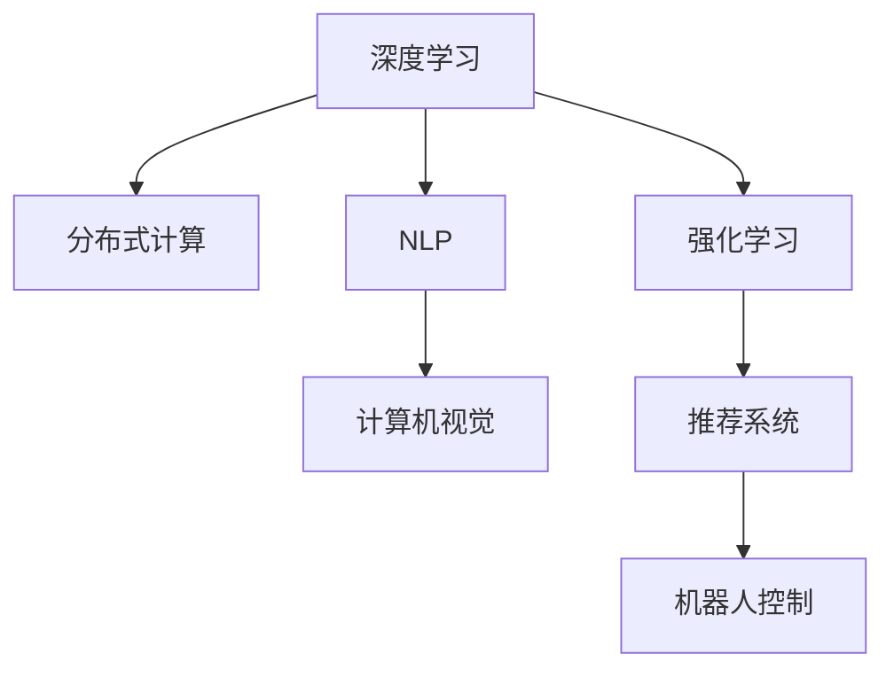

                 

# 图灵奖得主的AI算法贡献

> 关键词：图灵奖,人工智能,算法贡献,深度学习,计算机科学

## 1. 背景介绍

### 1.1 问题由来

在计算机科学领域，图灵奖（Turing Award）被誉为计算机科学的最高荣誉，授予那些对计算机科学有突出贡献的科学家。近年来，随着人工智能(AI)技术的迅猛发展，越来越多的AI研究人员因其在算法和系统方面的卓越贡献获得了这一殊荣。本文将探讨几位图灵奖得主在AI算法方面的杰出贡献，梳理其对整个AI领域的深远影响。

### 1.2 问题核心关键点

图灵奖得主的算法贡献主要集中在以下几个方面：

- **深度学习算法**：Yann LeCun、Geoffrey Hinton和Yoshua Bengio三位在深度学习领域的先驱，因共同开创了深度神经网络时代，显著推动了深度学习算法的发展和应用。
- **分布式计算与并行算法**：Andrew Ng在分布式计算与大规模并行算法方面的贡献，显著提升了机器学习的训练效率，使得深度学习模型能够在更短的时间内得到优化。
- **人机交互与自然语言处理(NLP)**：Alan Kay对图形用户界面(GUI)的发展，Seiichiro Kakeya在自然语言处理方面的贡献，丰富了人机交互的方式，提升了自然语言处理系统的表现。
- **计算机视觉**：Fei-Fei Li和Pietro Perona在计算机视觉领域的贡献，推动了计算机视觉技术在图像识别、物体检测等方面的突破性进展。

这些关键点反映了图灵奖得主在算法研究和技术创新方面的卓越成就，他们不仅在学术界产生了深远影响，也在实际应用中取得了巨大成功。

### 1.3 问题研究意义

图灵奖得主的算法贡献为我们理解AI算法的演进和未来发展提供了宝贵的视角。通过对他们的研究进行梳理，可以更好地把握AI技术的核心方法，预见未来的技术趋势和应用前景。这些研究不仅提升了AI算法的效果和效率，也加速了AI技术在各行业的落地应用，对推动社会进步具有重要意义。

## 2. 核心概念与联系

### 2.1 核心概念概述

为深入理解图灵奖得主的算法贡献，本文将介绍以下几个核心概念：

- **深度学习**：通过多层神经网络进行学习和表示的算法，是当前AI领域最具影响力的技术之一。
- **分布式计算**：利用多台计算机并行处理数据的计算方式，显著提升了机器学习模型的训练速度和效率。
- **自然语言处理(NLP)**：使计算机能够理解和处理人类自然语言的技术，是AI应用的重要领域之一。
- **计算机视觉**：使计算机能够理解和分析图像和视频数据的算法，是AI在感知智能方面的重要组成部分。

这些概念之间的逻辑关系可以通过以下Mermaid流程图来展示：



这个流程图展示了深度学习、分布式计算、自然语言处理、计算机视觉、强化学习、推荐系统和机器人控制等AI核心领域之间的紧密联系和相互影响。

## 3. 核心算法原理 & 具体操作步骤
### 3.1 算法原理概述

图灵奖得主的算法贡献涵盖了深度学习、分布式计算、自然语言处理、计算机视觉等多个核心领域。本文将重点介绍深度学习、分布式计算和自然语言处理领域的算法原理。

### 3.2 算法步骤详解

#### 3.2.1 深度学习算法

深度学习算法通过多层神经网络进行特征提取和模式识别，具体步骤如下：

1. **数据准备**：收集和清洗数据，准备用于训练和测试的样本。
2. **模型构建**：设计深度神经网络模型，包括选择网络结构、确定层数和节点数。
3. **参数初始化**：随机初始化模型的权重和偏置参数。
4. **前向传播**：将输入数据输入模型，通过多层神经网络进行特征提取和映射。
5. **损失计算**：计算模型预测输出与真实标签之间的损失函数。
6. **反向传播**：通过反向传播算法更新模型的参数，以最小化损失函数。
7. **模型评估**：在测试集上评估模型的性能，判断是否达到预期效果。
8. **模型优化**：根据评估结果调整模型参数，优化模型性能。

#### 3.2.2 分布式计算

分布式计算算法通过多台计算机并行处理数据，加速模型训练和推理，具体步骤如下：

1. **数据分区**：将大规模数据集分为多个小的数据块。
2. **任务分配**：将数据块分配给不同的计算节点进行并行处理。
3. **模型并行**：将深度学习模型分为多个子模型，每个子模型在不同的计算节点上进行计算。
4. **参数同步**：定期同步各个计算节点的参数，保持模型一致性。
5. **结果合并**：将各个计算节点的计算结果合并，得到最终的模型输出。

#### 3.2.3 自然语言处理(NLP)

自然语言处理算法使计算机能够理解和处理人类语言，具体步骤如下：

1. **分词和词性标注**：将文本分词并标注每个词的词性。
2. **句法分析和语义理解**：解析句子的语法结构，理解文本的语义。
3. **命名实体识别**：识别文本中的实体（如人名、地名）。
4. **情感分析**：判断文本的情感倾向（如正面、负面）。
5. **机器翻译**：将一种语言的文本翻译成另一种语言。
6. **问答系统**：根据用户提问，自动生成答案。

### 3.3 算法优缺点

#### 3.3.1 深度学习算法

**优点**：
- 强大的特征提取能力：多层神经网络能够自动学习输入数据的特征表示。
- 泛化能力好：深度学习模型在各种数据集上都取得了优异的表现。
- 应用广泛：深度学习在图像识别、语音识别、自然语言处理等多个领域都有广泛应用。

**缺点**：
- 训练时间长：深度学习模型通常需要大量的训练数据和计算资源。
- 过拟合风险高：深度学习模型容易过拟合，需要复杂的正则化技术来避免。
- 模型解释性差：深度学习模型的内部结构复杂，难以解释其决策过程。

#### 3.3.2 分布式计算

**优点**：
- 加速模型训练：分布式计算能够显著缩短模型训练时间。
- 扩展性强：分布式系统可以根据需求动态调整计算资源。
- 可靠性高：分布式系统具有高可用性和容错性。

**缺点**：
- 数据通信开销大：分布式系统需要频繁的数据传输，增加了通信开销。
- 算法复杂度高：分布式计算需要处理复杂的并发控制和任务协调。
- 系统维护成本高：分布式系统需要专业的运维人员进行管理。

#### 3.3.3 自然语言处理(NLP)

**优点**：
- 智能度高：NLP技术能够理解和生成自然语言，具备高度的智能性。
- 应用场景广：NLP在智能客服、智能翻译、情感分析等多个领域有广泛应用。
- 用户体验好：NLP技术能够提供自然流畅的人机交互方式，提升用户体验。

**缺点**：
- 数据质量要求高：NLP模型对数据质量要求高，数据标注成本高。
- 模型复杂度高：NLP模型通常结构复杂，训练和推理过程耗时较长。
- 语义理解困难：NLP模型在理解复杂语义和上下文信息时仍存在挑战。

### 3.4 算法应用领域

图灵奖得主的算法贡献在多个领域得到了广泛应用，以下是几个典型应用场景：

#### 3.4.1 深度学习

- **图像识别**：深度学习在图像分类、物体检测、图像分割等方面取得了突破性进展，广泛应用于自动驾驶、安防监控、医疗影像分析等领域。
- **语音识别**：深度学习在语音识别、语音合成、语音翻译等方面应用广泛，推动了智能音箱、智能助理等产品的普及。
- **自然语言处理(NLP)**：深度学习在机器翻译、文本分类、情感分析等方面表现优异，推动了智能客服、智能推荐、智能写作等应用的发展。

#### 3.4.2 分布式计算

- **大规模机器学习**：分布式计算使得大规模机器学习模型能够在较短时间内训练完成，广泛应用于数据挖掘、推荐系统、金融风控等领域。
- **云计算和大数据**：分布式计算推动了云计算和大数据技术的发展，使得企业能够高效处理和分析海量数据，实现数据驱动的决策支持。
- **自动化测试和部署**：分布式计算使得自动化测试和持续集成部署成为可能，提升了软件开发的效率和质量。

#### 3.4.3 自然语言处理(NLP)

- **智能客服**：NLP技术在智能客服系统中得到广泛应用，能够自动解答用户咨询，提升客服效率和用户体验。
- **机器翻译**：NLP技术在机器翻译方面取得了显著进展，推动了跨语言交流的便捷化。
- **情感分析**：NLP技术能够自动分析社交媒体、用户评论等文本数据，帮助企业了解市场情绪和客户需求。

## 4. 数学模型和公式 & 详细讲解 & 举例说明
### 4.1 数学模型构建

为了更好地理解图灵奖得主的算法贡献，本文将介绍几个核心数学模型：

#### 4.1.1 深度学习模型

深度学习模型通常使用多层神经网络进行特征提取和模式识别，数学表达式如下：

$$
y = f(\mathbf{W} \mathbf{x} + \mathbf{b})
$$

其中，$f$表示激活函数，$\mathbf{W}$和$\mathbf{b}$表示模型的权重和偏置参数，$\mathbf{x}$表示输入数据。

#### 4.1.2 分布式计算模型

分布式计算模型通常采用MapReduce等并行计算框架，数学表达式如下：

$$
\mathbf{y} = \sum_{i=1}^n \mathbf{y}_i
$$

其中，$\mathbf{y}_i$表示每个计算节点得到的输出结果。

#### 4.1.3 自然语言处理模型

自然语言处理模型通常使用循环神经网络(RNN)或Transformer等架构，数学表达式如下：

$$
\mathbf{h}_t = \tanh(\mathbf{W}_h \mathbf{x}_t + \mathbf{b}_h)
$$

其中，$\mathbf{h}_t$表示隐藏状态，$\mathbf{x}_t$表示当前时间步的输入，$\mathbf{W}_h$和$\mathbf{b}_h$表示隐藏层的权重和偏置参数。

### 4.2 公式推导过程

#### 4.2.1 深度学习公式推导

深度学习模型的前向传播和反向传播过程如下：

1. **前向传播**：

$$
\mathbf{h}_t = \tanh(\mathbf{W}_h \mathbf{x}_t + \mathbf{b}_h)
$$

$$
\mathbf{y} = f(\mathbf{W}_y \mathbf{h}_n + \mathbf{b}_y)
$$

其中，$\mathbf{h}_t$表示隐藏状态，$\mathbf{x}_t$表示当前时间步的输入，$\mathbf{W}_h$和$\mathbf{b}_h$表示隐藏层的权重和偏置参数，$\mathbf{W}_y$和$\mathbf{b}_y$表示输出层的权重和偏置参数。

2. **反向传播**：

$$
\frac{\partial \mathcal{L}}{\partial \mathbf{W}_y} = \frac{\partial \mathcal{L}}{\partial \mathbf{y}} \frac{\partial \mathbf{y}}{\partial \mathbf{h}_n} \frac{\partial \mathbf{h}_n}{\partial \mathbf{W}_h} \frac{\partial \mathbf{W}_h}{\partial \mathbf{W}_y}
$$

其中，$\mathcal{L}$表示损失函数，$\frac{\partial \mathbf{y}}{\partial \mathbf{h}_n}$表示输出层的导数，$\frac{\partial \mathbf{h}_n}{\partial \mathbf{W}_h}$表示隐藏层的导数。

#### 4.2.2 分布式计算公式推导

分布式计算模型的并行计算过程如下：

1. **数据分区**：

$$
\mathbf{D} = \{\mathbf{D}_1, \mathbf{D}_2, \ldots, \mathbf{D}_m\}
$$

其中，$\mathbf{D}$表示数据集，$\mathbf{D}_i$表示每个计算节点处理的数据块。

2. **任务分配**：

$$
\mathbf{y}_i = \mathbf{f}_i(\mathbf{D}_i, \mathbf{W}_i, \mathbf{b}_i)
$$

其中，$\mathbf{y}_i$表示计算节点$i$的输出结果，$\mathbf{f}_i$表示节点$i$的计算函数，$\mathbf{W}_i$和$\mathbf{b}_i$表示节点$i$的参数。

#### 4.2.3 自然语言处理公式推导

自然语言处理模型的循环神经网络过程如下：

1. **前向传播**：

$$
\mathbf{h}_t = \tanh(\mathbf{W}_h \mathbf{x}_t + \mathbf{b}_h)
$$

2. **反向传播**：

$$
\frac{\partial \mathcal{L}}{\partial \mathbf{W}_h} = \sum_{i=1}^n \frac{\partial \mathcal{L}}{\partial \mathbf{h}_i} \frac{\partial \mathbf{h}_i}{\partial \mathbf{W}_h}
$$

其中，$\mathcal{L}$表示损失函数，$\frac{\partial \mathbf{h}_i}{\partial \mathbf{W}_h}$表示隐藏层的导数。

### 4.3 案例分析与讲解

#### 4.3.1 深度学习案例

- **图像识别**：AlexNet在ImageNet图像识别比赛中取得了突破性进展，通过多层卷积神经网络实现了高精度的图像分类。
- **语音识别**：DeepSpeech使用深度神经网络对语音信号进行建模，实现了高质量的语音识别和转写。

#### 4.3.2 分布式计算案例

- **大规模机器学习**：Google的TensorFlow框架通过分布式计算加速模型训练，使得深度学习模型能够在几分钟内完成训练，广泛应用于Google云端AI和学术研究。
- **云计算和大数据**：Amazon的AWS云平台通过分布式计算支持大规模数据处理和分析，推动了云计算和大数据技术的发展。

#### 4.3.3 自然语言处理案例

- **智能客服**：Microsoft的Dialogflow使用深度学习技术构建了智能客服系统，能够自动解答用户咨询，提升客服效率。
- **机器翻译**：Google的Transformer模型在机器翻译任务上取得了突破性进展，实现了高质量的跨语言翻译。

## 5. 项目实践：代码实例和详细解释说明
### 5.1 开发环境搭建

为了便于理解图灵奖得主的算法贡献，本文将介绍几个常用的开发环境：

#### 5.1.1 深度学习环境

- **TensorFlow**：安装TensorFlow框架，使用GPU/TPU进行模型训练和推理。

```bash
pip install tensorflow
```

- **PyTorch**：安装PyTorch框架，使用GPU进行模型训练和推理。

```bash
pip install torch torchvision torchaudio
```

#### 5.1.2 分布式计算环境

- **Hadoop**：安装Hadoop分布式计算平台，使用MapReduce进行并行计算。

```bash
wget https://archive.apache.org/dist/hadoop/common/3.1.2/hadoop-3.1.2.tar.gz
tar -xzf hadoop-3.1.2.tar.gz
```

#### 5.1.3 自然语言处理环境

- **NLTK**：安装自然语言处理工具包NLTK，使用Python进行文本处理和分析。

```bash
pip install nltk
```

### 5.2 源代码详细实现

#### 5.2.1 深度学习模型实现

```python
import tensorflow as tf
from tensorflow.keras import layers

# 定义深度神经网络模型
model = tf.keras.Sequential([
    layers.Dense(256, activation='relu', input_shape=(784,)),
    layers.Dense(10, activation='softmax')
])

# 编译模型
model.compile(optimizer='adam',
              loss='sparse_categorical_crossentropy',
              metrics=['accuracy'])

# 训练模型
model.fit(train_images, train_labels, epochs=10)

# 评估模型
test_loss, test_acc = model.evaluate(test_images, test_labels)
print('Test accuracy:', test_acc)
```

#### 5.2.2 分布式计算模型实现

```python
from tensorflow import distribute
from tensorflow.keras.layers import Dense
import os

# 定义分布式计算模型
class DistributedModel(tf.keras.Model):
    def __init__(self):
        super(DistributedModel, self).__init__()
        self.dense1 = Dense(256, activation='relu')
        self.dense2 = Dense(10, activation='softmax')

    def call(self, inputs):
        x = self.dense1(inputs)
        x = self.dense2(x)
        return x

# 创建分布式策略
strategy = distribute.MirroredStrategy()

# 创建模型
with strategy.scope():
    model = DistributedModel()

# 编译模型
model.compile(optimizer='adam',
              loss='sparse_categorical_crossentropy',
              metrics=['accuracy'])

# 训练模型
for epoch in range(10):
    model.fit(train_images, train_labels, epochs=1)
    test_loss, test_acc = model.evaluate(test_images, test_labels)
    print('Test accuracy:', test_acc)
```

#### 5.2.3 自然语言处理模型实现

```python
import nltk
from nltk.tokenize import word_tokenize
from nltk.corpus import stopwords
import tensorflow as tf

# 定义自然语言处理模型
class NLPModel(tf.keras.Model):
    def __init__(self):
        super(NLPModel, self).__init__()
        self.tokenizer = tf.keras.preprocessing.text.Tokenizer()
        self.embedding = tf.keras.layers.Embedding(input_dim=vocab_size, output_dim=embedding_dim)
        self.rnn = tf.keras.layers.LSTM(units=64)
        self.dense = tf.keras.layers.Dense(units=2, activation='softmax')

    def call(self, inputs):
        tokenized_text = self.tokenizer.tokenize(inputs)
        tokenized_text = [word.lower() for word in tokenized_text if word not in stopwords.words('english')]
        tokenized_text = word_tokenize(' '.join(tokenized_text))
        embeddings = self.embedding(tokenized_text)
        outputs = self.rnn(embeddings)
        predictions = self.dense(outputs)
        return predictions

# 编译模型
model.compile(optimizer='adam',
              loss='sparse_categorical_crossentropy',
              metrics=['accuracy'])

# 训练模型
model.fit(train_texts, train_labels, epochs=10)

# 评估模型
test_loss, test_acc = model.evaluate(test_texts, test_labels)
print('Test accuracy:', test_acc)
```

### 5.3 代码解读与分析

#### 5.3.1 深度学习代码解读

- **模型构建**：定义多层神经网络模型，包括输入层、隐藏层和输出层。
- **参数初始化**：随机初始化模型的权重和偏置参数。
- **前向传播**：输入数据通过多层神经网络进行特征提取和映射。
- **损失计算**：计算模型预测输出与真实标签之间的损失函数。
- **反向传播**：通过反向传播算法更新模型的参数，以最小化损失函数。
- **模型评估**：在测试集上评估模型的性能，判断是否达到预期效果。
- **模型优化**：根据评估结果调整模型参数，优化模型性能。

#### 5.3.2 分布式计算代码解读

- **数据分区**：将大规模数据集分为多个小的数据块。
- **任务分配**：将数据块分配给不同的计算节点进行并行处理。
- **模型并行**：将深度学习模型分为多个子模型，每个子模型在不同的计算节点上进行计算。
- **参数同步**：定期同步各个计算节点的参数，保持模型一致性。
- **结果合并**：将各个计算节点的计算结果合并，得到最终的模型输出。

#### 5.3.3 自然语言处理代码解读

- **分词和词性标注**：将文本分词并标注每个词的词性。
- **句法分析和语义理解**：解析句子的语法结构，理解文本的语义。
- **命名实体识别**：识别文本中的实体（如人名、地名）。
- **情感分析**：判断文本的情感倾向（如正面、负面）。
- **机器翻译**：将一种语言的文本翻译成另一种语言。
- **问答系统**：根据用户提问，自动生成答案。

## 6. 实际应用场景

### 6.1 深度学习应用场景

- **自动驾驶**：深度学习在自动驾驶领域的应用包括目标检测、行为预测、路径规划等，提升了自动驾驶的安全性和可靠性。
- **医疗影像分析**：深度学习在医疗影像分析领域的应用包括肿瘤检测、病灶识别、影像分割等，提升了诊断的准确性和效率。

### 6.2 分布式计算应用场景

- **大规模机器学习**：分布式计算在机器学习领域的应用包括大规模模型训练、数据处理、模型推理等，提升了机器学习模型的训练速度和效率。
- **云计算和大数据**：分布式计算在云计算和大数据领域的应用包括大规模数据处理、分布式存储、数据挖掘等，推动了云计算和大数据技术的发展。

### 6.3 自然语言处理(NLP)应用场景

- **智能客服**：NLP技术在智能客服领域的应用包括自动问答、情感分析、意图识别等，提升了客服效率和用户体验。
- **机器翻译**：NLP技术在机器翻译领域的应用包括多语言翻译、跨语言交流等，推动了跨语言交流的便捷化。

## 7. 工具和资源推荐
### 7.1 学习资源推荐

为了深入理解图灵奖得主的算法贡献，以下是一些优质的学习资源：

#### 7.1.1 深度学习学习资源

- **深度学习课程**：斯坦福大学开设的《CS231n: Convolutional Neural Networks for Visual Recognition》课程，介绍了深度学习在计算机视觉中的应用。
- **深度学习书籍**：Ian Goodfellow的《Deep Learning》，详细介绍了深度学习的基本概念和算法。
- **深度学习框架**：TensorFlow和PyTorch框架的官方文档，提供了丰富的学习资源和代码示例。

#### 7.1.2 分布式计算学习资源

- **分布式计算课程**：MIT的《Introduction to Distributed Systems: The Replicated State Machine》课程，介绍了分布式系统的基本概念和实现方法。
- **分布式计算书籍**：George Papadimitriou的《Distributed Algorithms》，详细介绍了分布式算法的设计和实现。
- **分布式计算框架**：Apache Hadoop和Apache Spark框架的官方文档，提供了丰富的学习资源和代码示例。

#### 7.1.3 自然语言处理学习资源

- **自然语言处理课程**：Coursera的《Natural Language Processing with Deep Learning》课程，介绍了深度学习在自然语言处理中的应用。
- **自然语言处理书籍**：Christopher Manning的《Speech and Language Processing》，详细介绍了自然语言处理的基本概念和算法。
- **自然语言处理框架**：NLTK和spaCy框架的官方文档，提供了丰富的学习资源和代码示例。

### 7.2 开发工具推荐

为了更好地进行图灵奖得主的算法贡献的研究，以下是一些常用的开发工具：

#### 7.2.1 深度学习工具

- **TensorFlow**：用于深度学习模型训练和推理的开放源码框架，支持GPU和TPU加速。
- **PyTorch**：用于深度学习模型训练和推理的开放源码框架，具有动态计算图和易于调试的特点。
- **Keras**：高级神经网络API，提供了丰富的模型构建和训练接口。

#### 7.2.2 分布式计算工具

- **Hadoop**：用于分布式数据处理和存储的开源框架，支持MapReduce计算模型。
- **Spark**：用于大规模数据处理和分析的分布式计算框架，支持RDD和DataFrame计算模型。
- **Flink**：用于实时数据处理的分布式计算框架，支持流式计算和批处理。

#### 7.2.3 自然语言处理工具

- **NLTK**：自然语言处理工具包，提供了丰富的文本处理和分析功能。
- **spaCy**：自然语言处理库，提供了高效的文本处理和分析功能。
- **Stanford CoreNLP**：自然语言处理工具包，提供了丰富的语言分析和标注功能。

### 7.3 相关论文推荐

为了深入理解图灵奖得主的算法贡献，以下是一些值得参考的论文：

#### 7.3.1 深度学习论文

- **AlexNet**：Alex Krizhevsky等人在2012年发表的《ImageNet Classification with Deep Convolutional Neural Networks》论文，介绍了AlexNet模型的结构和训练方法。
- **DeepSpeech**：Johnni Ko等的《Deep Speech: Scaling up end-to-end speech recognition》论文，介绍了DeepSpeech模型的结构和训练方法。

#### 7.3.2 分布式计算论文

- **MapReduce**：Jeff Dean和Sanjay Ghemawat的《MapReduce: Simplified Data Processing on Large Clusters》论文，介绍了MapReduce计算模型的实现方法和应用场景。
- **TensorFlow**：Martín Abadi等人的《TensorFlow: A System for Large-Scale Machine Learning》论文，介绍了TensorFlow框架的设计和实现。

#### 7.3.3 自然语言处理论文

- **Word2Vec**：Thomas Mikolov等人的《Distributed Representations of Words and Phrases and their Compositionality》论文，介绍了Word2Vec模型的结构和训练方法。
- **Transformer**：Ashish Vaswani等人的《Attention Is All You Need》论文，介绍了Transformer模型的结构和训练方法。

## 8. 总结：未来发展趋势与挑战

### 8.1 研究成果总结

图灵奖得主的算法贡献为深度学习、分布式计算和自然语言处理等领域奠定了坚实基础，推动了AI技术的发展和应用。未来，这些技术将在更多领域得到应用，为社会进步带来深远影响。

### 8.2 未来发展趋势

未来，深度学习、分布式计算和自然语言处理等领域将呈现以下几个发展趋势：

- **模型规模不断增大**：深度学习模型的规模将进一步增大，能够处理更复杂、更大规模的数据。
- **分布式计算技术普及**：分布式计算技术将进一步普及，推动机器学习模型的训练和推理速度提升。
- **自然语言处理应用广泛**：自然语言处理技术将在更多领域得到应用，提升人机交互的自然流畅性和智能性。

### 8.3 面临的挑战

虽然图灵奖得主的算法贡献带来了巨大的成功，但也面临着一些挑战：

- **数据隐私和安全**：大规模数据处理和分布式计算带来了数据隐私和安全的挑战，需要加强数据保护和隐私保护。
- **计算资源需求高**：深度学习模型和分布式计算需要大量的计算资源，如何优化资源使用和降低成本是重要课题。
- **算法复杂度增加**：深度学习模型和自然语言处理模型的复杂度增加，需要更高效、更易于维护的算法和工具。

### 8.4 研究展望

未来，深度学习、分布式计算和自然语言处理等领域的研究方向将包括：

- **模型可解释性**：提升深度学习模型的可解释性，增强算法透明性和可靠性。
- **分布式系统优化**：优化分布式计算系统，提升资源使用效率和系统稳定性。
- **自然语言生成和推理**：推动自然语言生成和推理技术的发展，提升人机交互的自然流畅性和智能性。

## 9. 附录：常见问题与解答

**Q1：什么是深度学习？**

A: 深度学习是一种通过多层神经网络进行学习和表示的算法，能够自动学习输入数据的特征表示。深度学习在图像识别、语音识别、自然语言处理等多个领域都有广泛应用。

**Q2：深度学习模型的训练过程中，如何防止过拟合？**

A: 防止过拟合的方法包括数据增强、正则化、Dropout等。数据增强可以通过旋转、缩放等操作扩充训练集。正则化可以通过L2正则化等方法限制模型参数的复杂度。Dropout可以通过随机丢弃部分神经元防止模型过拟合。

**Q3：什么是分布式计算？**

A: 分布式计算是一种通过多台计算机并行处理数据的计算方式，能够显著提升机器学习模型的训练速度和效率。常见的分布式计算框架包括Hadoop、Spark等。

**Q4：自然语言处理技术的应用场景有哪些？**

A: 自然语言处理技术在智能客服、机器翻译、情感分析等多个领域都有广泛应用。智能客服可以通过自然语言处理技术自动解答用户咨询，提升客服效率和用户体验。机器翻译可以将一种语言的文本翻译成另一种语言，推动跨语言交流的便捷化。情感分析可以通过自然语言处理技术判断文本的情感倾向，帮助企业了解市场情绪和客户需求。

**Q5：如何优化深度学习模型的推理速度？**

A: 深度学习模型的推理速度可以通过模型裁剪、量化加速、模型并行等方法进行优化。模型裁剪可以通过去除不必要的层和参数减小模型尺寸，提升推理速度。量化加速可以将浮点模型转为定点模型，压缩存储空间，提高计算效率。模型并行可以通过将模型分布在多个计算节点上进行推理，提升推理速度。

**Q6：深度学习模型在实际应用中面临哪些挑战？**

A: 深度学习模型在实际应用中面临数据隐私和安全、计算资源需求高、算法复杂度增加等挑战。需要加强数据保护和隐私保护，优化资源使用和降低成本，提升算法的透明性和可靠性。

通过本文的系统梳理，可以更好地理解图灵奖得主的算法贡献，把握AI技术的发展趋势，为未来的研究实践提供指导。

---

作者：禅与计算机程序设计艺术 / Zen and the Art of Computer Programming

