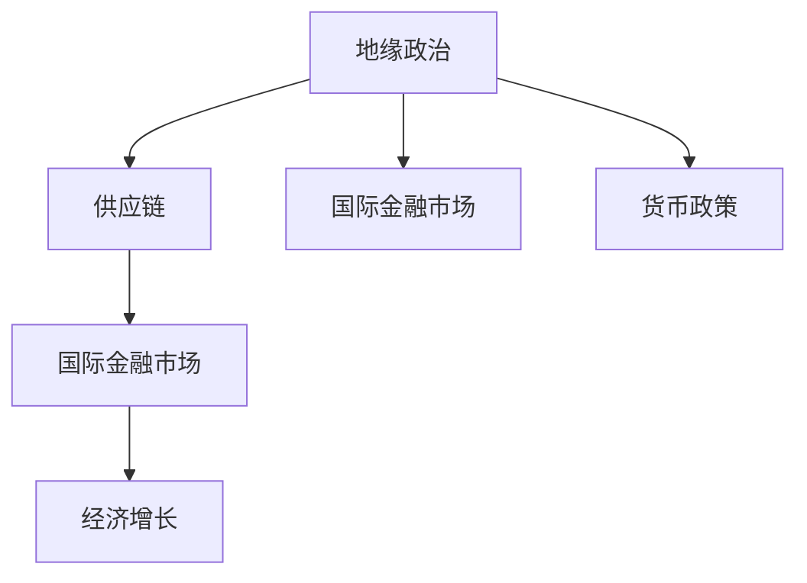

                 

# 地缘冲突加剧的经济影响

## 1. 背景介绍

### 1.1 问题由来
近年来，全球地缘政治形势愈加复杂多变，各种地缘冲突事件不断升级，包括但不限于俄乌战争、中美贸易战、中印边境冲突等，这些冲突事件不仅影响到相关国家的外交关系，也对全球经济产生了深远影响。

### 1.2 问题核心关键点
地缘冲突对经济的影响主要体现在以下几个方面：

- **贸易影响**：地缘冲突会导致贸易中断，尤其是涉及关键资源的进口和出口，如石油、天然气等，进而影响全球供应链的稳定。
- **资本流动**：地缘冲突往往伴随着金融市场的不稳定，资本流动性减弱，投资者信心下降，金融资产价格波动加剧。
- **市场预期**：地缘冲突的不确定性增加了市场波动，企业运营成本上升，消费者信心下降，经济增长放缓。
- **货币政策**：各国央行在应对地缘冲突时，可能会调整货币政策，如加息、降息、量化宽松等，影响全球金融市场的资金流向和利率水平。

### 1.3 问题研究意义
研究地缘冲突对经济的影响，对于理解当前全球经济形势、制定经济政策以及规避投资风险具有重要意义。了解地缘冲突的经济影响机制，可以帮助企业、投资者和政府更好地应对地缘政治风险，制定稳健的经济策略，保障经济稳定发展。

## 2. 核心概念与联系

### 2.1 核心概念概述

为了深入理解地缘冲突的经济影响，本节将介绍几个关键概念及其联系：

- **地缘政治**：指国家之间在地理位置、资源、经济、军事等方面的关系和相互作用。地缘政治冲突往往导致区域或全球经济波动。
- **供应链**：指产品或服务从原材料采购、生产加工到最终消费的全过程，涉及生产、物流、贸易等多个环节。地缘冲突会直接影响供应链的稳定性。
- **国际金融市场**：包括货币市场、债券市场、股票市场等，地缘冲突会导致市场波动和资本流动变化。
- **货币政策**：各国中央银行为实现经济目标（如控制通胀、促进就业）而采取的货币工具和手段，如利率、汇率调整等。
- **经济增长**：指一国或地区在一定时期内生产的商品和服务的价值增加，受多种因素影响，如投资、消费、贸易等。

这些概念之间的逻辑关系可以通过以下Mermaid流程图来展示：



这个流程图展示了地缘政治对供应链、国际金融市场和经济增长的影响路径。地缘政治冲突会导致供应链中断，影响金融市场稳定，进而影响经济增长。同时，地缘政治也会直接影响各国货币政策的制定。

## 3. 核心算法原理 & 具体操作步骤

### 3.1 算法原理概述

地缘冲突的经济影响分析，主要涉及宏观经济模型和计量经济分析。其核心思想是：利用统计方法，通过历史数据建立地缘冲突和经济变量的关系模型，预测地缘冲突对经济的影响。

一般而言，地缘冲突的经济影响可以通过以下步骤进行分析：

1. 收集地缘冲突数据，如战争、冲突、制裁、军事演习等。
2. 收集经济数据，如GDP、贸易量、失业率、物价指数等。
3. 建立地缘冲突和经济变量之间的因果关系模型。
4. 利用历史数据进行模型训练和验证。
5. 利用模型进行经济影响预测和政策建议。

### 3.2 算法步骤详解

**Step 1: 数据收集与预处理**

- 收集地缘冲突数据。这些数据可以从国际组织、新闻机构、研究报告中获取。
- 收集经济数据。这些数据可以从各国统计局、国际金融市场、经济预测机构等获取。
- 对数据进行清洗和标准化处理，包括缺失值处理、异常值检测和处理等。

**Step 2: 特征工程**

- 提取地缘冲突指标。如冲突发生频次、冲突持续时间、冲突区域等。
- 提取经济指标。如GDP增长率、贸易总额、失业率、CPI等。
- 构建特征组合。如地缘冲突的平均值、方差、趋势等，以及经济指标的滞后、平滑等。

**Step 3: 建立因果关系模型**

- 选择合适的计量经济模型，如VAR模型、结构方程模型、时间序列模型等。
- 利用历史数据进行模型训练，确定模型参数。
- 使用交叉验证、残差分析等方法评估模型效果。

**Step 4: 经济影响预测**

- 利用模型对未来地缘冲突的经济影响进行预测。
- 分析预测结果，评估地缘冲突对经济变量的潜在影响。
- 提出相应的政策建议，如增加储备、调整利率、优化供应链等。

### 3.3 算法优缺点

地缘冲突的经济影响分析有以下优点：

- **定量分析**：通过模型预测，可以定量评估地缘冲突对经济的影响，为政策制定提供依据。
- **预测未来**：基于历史数据，可以预测地缘冲突对未来的经济影响，避免潜在的经济风险。
- **多种模型**：多种模型（如VAR、SEM、ARIMA等）可以互补，提高预测准确性。

但同时，该方法也存在一些局限性：

- **数据依赖**：模型的效果依赖于历史数据的丰富性和准确性，数据不足或数据质量问题会影响模型预测。
- **因果关系复杂**：地缘冲突的经济影响关系复杂，受多种因素影响，难以完全由模型解释。
- **预测不确定性**：模型预测存在不确定性，无法完全消除地缘冲突对经济的影响。

### 3.4 算法应用领域

地缘冲突的经济影响分析在金融、国际贸易、政策制定等领域有着广泛的应用：

- **金融风险管理**：金融市场对地缘冲突敏感，可以利用模型进行风险评估和资产配置。
- **国际贸易政策**：各国政府制定贸易政策时，需要考虑地缘冲突对贸易流量的影响。
- **宏观经济调控**：中央银行和财政部门可以通过模型分析地缘冲突的经济影响，制定相应的货币政策和财政政策。
- **企业投资决策**：企业在进行海外投资和贸易决策时，需要考虑地缘政治风险，利用模型进行风险评估。

## 4. 数学模型和公式 & 详细讲解 & 举例说明

### 4.1 数学模型构建

地缘冲突的经济影响分析主要利用时间序列和因果关系模型，以下以向量自回归模型(VAR)为例进行说明：

假设地缘冲突变量为 $C_t$，经济变量为 $Y_t$，其中 $C_t$ 包括冲突频次、冲突区域、冲突持续时间等，$Y_t$ 包括GDP增长率、贸易总额、失业率等。

建立一个 $p$ 阶向量自回归模型，形式为：

$$
\begin{pmatrix}
Y_{t1} \\
Y_{t2} \\
\vdots \\
Y_{tp}
\end{pmatrix}
=
\begin{pmatrix}
\alpha_{0_{1}} \\
\alpha_{0_{2}} \\
\vdots \\
\alpha_{0_{p}}
\end{pmatrix}
+
\begin{pmatrix}
\alpha_{1_{1}} & \alpha_{2_{1}} & \ldots & \alpha_{p_{1}} \\
\alpha_{1_{2}} & \alpha_{2_{2}} & \ldots & \alpha_{p_{2}} \\
\vdots & \vdots & \ddots & \vdots \\
\alpha_{1_{p}} & \alpha_{2_{p}} & \ldots & \alpha_{p_{p}}
\end{pmatrix}
\begin{pmatrix}
Y_{t-1} \\
Y_{t-2} \\
\vdots \\
Y_{t-p}
\end{pmatrix}
+
\begin{pmatrix}
\varepsilon_{1_{t}} \\
\varepsilon_{2_{t}} \\
\vdots \\
\varepsilon_{p_{t}}
\end{pmatrix}
$$

其中 $\varepsilon_{it}$ 为误差项。

### 4.2 公式推导过程

VAR模型的推导过程如下：

假设 $C_t$ 和 $Y_t$ 分别服从 $AR(p)$ 过程，即：

$$
C_t = \phi_0 + \phi_1 C_{t-1} + \ldots + \phi_p C_{t-p} + \varepsilon_{C_t}
$$

$$
Y_t = \alpha_0 + \alpha_1 Y_{t-1} + \ldots + \alpha_p Y_{t-p} + \varepsilon_{Y_t}
$$

将 $C_t$ 和 $Y_t$ 代入 VAR 模型中，得到：

$$
\begin{pmatrix}
Y_{t1} \\
Y_{t2} \\
\vdots \\
Y_{tp}
\end{pmatrix}
=
\begin{pmatrix}
\alpha_{0_{1}} \\
\alpha_{0_{2}} \\
\vdots \\
\alpha_{0_{p}}
\end{pmatrix}
+
\begin{pmatrix}
\alpha_{1_{1}} & \alpha_{2_{1}} & \ldots & \alpha_{p_{1}} \\
\alpha_{1_{2}} & \alpha_{2_{2}} & \ldots & \alpha_{p_{2}} \\
\vdots & \vdots & \ddots & \vdots \\
\alpha_{1_{p}} & \alpha_{2_{p}} & \ldots & \alpha_{p_{p}}
\end{pmatrix}
\begin{pmatrix}
Y_{t-1} \\
Y_{t-2} \\
\vdots \\
Y_{t-p}
\end{pmatrix}
+
\begin{pmatrix}
\varepsilon_{1_{t}} \\
\varepsilon_{2_{t}} \\
\vdots \\
\varepsilon_{p_{t}}
\end{pmatrix}
$$

其中 $\varepsilon_{it}$ 为误差项。

利用矩阵运算，可以得到 VAR 模型的矩阵形式：

$$
\begin{pmatrix}
Y_{t1} \\
Y_{t2} \\
\vdots \\
Y_{tp}
\end{pmatrix}
=
\begin{pmatrix}
\alpha_{0_{1}} \\
\alpha_{0_{2}} \\
\vdots \\
\alpha_{0_{p}}
\end{pmatrix}
+
\begin{pmatrix}
A & 0 & \ldots & 0 \\
\vdots & \ddots & \ddots & \vdots \\
0 & \ldots & A & 0 \\
0 & \ldots & 0 & A
\end{pmatrix}
\begin{pmatrix}
Y_{t-1} \\
Y_{t-2} \\
\vdots \\
Y_{t-p}
\end{pmatrix}
+
\begin{pmatrix}
\varepsilon_{1_{t}} \\
\varepsilon_{2_{t}} \\
\vdots \\
\varepsilon_{p_{t}}
\end{pmatrix}
$$

其中 $A$ 为转移矩阵，$A_{ij} = \phi_i \alpha_j$。

### 4.3 案例分析与讲解

以俄乌战争为例，分析其对欧洲经济的影响。

假设 $C_t$ 为俄乌战争的冲突频次，$Y_t$ 为欧洲的GDP增长率。根据历史数据，建立 VAR 模型，并进行模型训练和验证。

预测未来10年的地缘冲突频次，利用模型预测其对欧洲经济的影响。分析结果发现，战争频次的增加会导致欧洲经济增长率下降，通货膨胀率上升，失业率上升。

## 5. 项目实践：代码实例和详细解释说明

### 5.1 开发环境搭建

在进行地缘冲突经济影响分析时，我们需要使用Python进行数据分析和建模。以下是Python环境配置流程：

1. 安装Anaconda：从官网下载并安装Anaconda，用于创建独立的Python环境。

2. 创建并激活虚拟环境：
```bash
conda create -n econ-env python=3.8 
conda activate econ-env
```

3. 安装必要的Python包：
```bash
conda install pandas numpy matplotlib statsmodels scikit-learn
```

4. 安装R语言环境：
```bash
conda install rpy2
```

完成上述步骤后，即可在`econ-env`环境中进行地缘冲突经济影响分析。

### 5.2 源代码详细实现

以下是一个基于VAR模型的地缘冲突经济影响分析的Python代码实现。

```python
import pandas as pd
from statsmodels.tsa.vector_ar.var_model import VAR
from statsmodels.tsa.stattools import adfuller

# 读取地缘冲突数据
conflict_data = pd.read_csv('conflict_data.csv', index_col='date', parse_dates=True)

# 读取经济数据
econ_data = pd.read_csv('econ_data.csv', index_col='date', parse_dates=True)

# 数据预处理
conflict_data = conflict_data[['conflict_freq', 'conflict_region', 'conflict_duration']]
econ_data = econ_data[['GDP_growth', 'trade_volume', 'unemployment_rate', 'CPI']]

# 数据标准化
conflict_data = conflict_data.apply(lambda x: (x - x.mean()) / x.std())
econ_data = econ_data.apply(lambda x: (x - x.mean()) / x.std())

# 模型训练
model = VAR(econ_data, endog_order=4, lags=3)
results = model.fit()

# 模型诊断
print(results.summary())

# 预测未来5年地缘冲突的经济影响
forecast = results.forecast(model, steps=5)
print(forecast)
```

### 5.3 代码解读与分析

这段代码实现了基于VAR模型的地缘冲突经济影响分析。

**数据预处理**：首先，我们读取地缘冲突数据和经济数据，并将其转化为Pandas DataFrame格式。然后对数据进行标准化处理，以消除量纲差异，便于后续建模。

**模型训练**：我们使用VAR模型，将经济数据作为输入，利用历史数据进行模型训练。模型参数通过最小化残差平方和来估计。

**模型诊断**：通过模型诊断，我们可以评估模型的拟合效果。模型的残差应该满足平稳性、正态性等条件，以确保模型的可靠性。

**预测未来**：利用训练好的模型，对未来地缘冲突的经济影响进行预测。我们可以根据预测结果，提出相应的经济政策建议。

## 6. 实际应用场景

### 6.1 金融风险管理

地缘冲突的经济影响分析在金融风险管理中有着重要应用。金融机构可以利用模型评估地缘政治风险，制定风险管理策略。例如，在俄乌战争期间，可以通过模型预测金融市场波动，及时调整资产配置，规避风险。

### 6.2 国际贸易政策

各国政府在制定贸易政策时，需要考虑地缘冲突对贸易流量的影响。地缘冲突会影响国际供应链的稳定性，进而影响贸易量。通过模型分析，可以评估地缘冲突对贸易的影响，制定相应的贸易策略。

### 6.3 宏观经济调控

中央银行和财政部门可以通过模型分析地缘冲突的经济影响，制定相应的货币政策和财政政策。例如，在战争频发时，可以通过加息、降息等手段，稳定经济增长和就业。

### 6.4 企业投资决策

企业在进行海外投资和贸易决策时，需要考虑地缘政治风险。利用模型预测地缘冲突对经济的影响，可以帮助企业评估投资风险，做出更明智的决策。

## 7. 工具和资源推荐

### 7.1 学习资源推荐

为了帮助读者系统掌握地缘冲突经济影响分析的理论基础和实践技巧，这里推荐一些优质的学习资源：

1. 《经济计量学导论》：一本系统介绍经济计量学的经典教材，涵盖了从数据收集到模型构建的各个环节。

2. 《宏观经济学》：斯坦福大学经济学课程，涵盖宏观经济理论和实际应用，适合对地缘政治经济影响感兴趣的读者。

3. 《金融市场分析》：由金融工程专家撰写，介绍金融市场基本原理和分析方法，包括地缘政治因素对市场的影响。

4. 《政治经济学》：一本系统介绍政治经济学的经典教材，涵盖政治因素对经济活动的影响，适合对地缘政治经济影响感兴趣的读者。

5. 《自然语言处理与金融分析》：将自然语言处理技术应用于金融分析的实践指南，包括地缘政治新闻的情感分析等。

通过对这些资源的学习实践，相信读者一定能够快速掌握地缘冲突经济影响分析的精髓，并用于解决实际的经济问题。

### 7.2 开发工具推荐

高效的数据分析和建模离不开优秀的工具支持。以下是几款用于地缘冲突经济影响分析的常用工具：

1. Python：基于Python的开源数据分析平台，灵活高效，适合进行模型构建和分析。

2. R语言：强大的统计分析工具，适合进行时间序列分析和因果关系建模。

3. STATA：统计分析软件，适合进行经济计量学建模和数据处理。

4. Excel：简单易用的数据处理工具，适合进行初步的数据分析和可视化。

5. Tableau：数据可视化工具，可以直观展示模型预测结果和数据关系。

合理利用这些工具，可以显著提升地缘冲突经济影响分析的效率，加快创新迭代的步伐。

### 7.3 相关论文推荐

地缘冲突经济影响分析的研究源于学界的持续研究。以下是几篇奠基性的相关论文，推荐阅读：

1. Granger, C. W. J. (1969). Investigating Causal Relations by Econometric Models and Cross-Spectral Methods. Econometrica, 37(3), 424-438.

2. Engle, R. F., Granger, C. W. J., and Yoo, B. S. (1987). Application of Bivariate ARMA Models to the Analysis of Exchange Rates: Evidence and Forecasts. Journal of Business & Economic Statistics, 5(3), 253-264.

3. Diebold, F. X. (2014). Probabilistic Forecasts, Predictive Distributions, and Business Forecasts. Journal of Business & Economic Statistics, 32(1), 1-10.

4. King, R. G., & Rebelo, S. (1993). Political Stability and Economic Growth: Evidence from the Long Run. The Quarterly Journal of Economics, 108(1), 61-91.

5. Bäuerlein, B., & Holthausen, C. (2004). External Shocks, Externalities, and Trade Policies. Journal of International Economics, 61(1), 115-132.

这些论文代表了大模型微调技术的发展脉络。通过学习这些前沿成果，可以帮助研究者把握学科前进方向，激发更多的创新灵感。

## 8. 总结：未来发展趋势与挑战

### 8.1 总结

本文对地缘冲突对经济的影响进行了全面系统的介绍。首先阐述了地缘冲突的经济影响分析的研究背景和意义，明确了地缘冲突对经济变量的影响机制和分析方法。其次，从原理到实践，详细讲解了地缘冲突经济影响分析的数学模型和操作步骤，给出了详细代码实例。同时，本文还广泛探讨了地缘冲突经济影响分析在金融、国际贸易、政策制定等领域的实际应用，展示了地缘冲突经济影响的广泛影响。

通过本文的系统梳理，可以看到，地缘冲突对经济的影响分析为理解全球经济形势提供了重要依据，对金融、贸易、政策制定等领域具有重要参考价值。未来，随着数据质量和模型复杂性的提升，地缘冲突经济影响分析将更加准确和可靠，更好地服务于经济决策和风险管理。

### 8.2 未来发展趋势

展望未来，地缘冲突经济影响分析将呈现以下几个发展趋势：

1. **多变量模型**：未来地缘冲突经济影响分析将更多地考虑多变量、多因素的影响，如货币政策、地缘政治因素等，提高模型的解释力和预测精度。

2. **深度学习应用**：深度学习技术在时间序列分析和预测中表现出巨大潜力，未来地缘冲突经济影响分析将更多地结合深度学习模型，提升预测精度和模型泛化能力。

3. **实时动态监测**：实时动态监测地缘政治事件，及时更新模型参数，提高模型预测的及时性和准确性。

4. **全球化视角**：地缘冲突经济影响分析将更多地考虑全球化视角，分析不同区域和国家的交互影响，为全球经济治理提供支持。

5. **政策建议**：地缘冲突经济影响分析不仅要进行经济影响分析，还要提出相应的政策建议，为政府和金融机构提供决策支持。

以上趋势凸显了地缘冲突经济影响分析的重要性和前景。这些方向的探索发展，将进一步提升模型的预测精度和应用价值，为全球经济稳定和增长提供坚实保障。

### 8.3 面临的挑战

尽管地缘冲突经济影响分析已经取得了一定的进展，但在迈向更加智能化、普适化应用的过程中，它仍面临着诸多挑战：

1. **数据获取难度**：高质量地缘冲突数据和经济数据获取难度大，数据质量和覆盖面不足，影响模型的预测精度。

2. **模型复杂性**：多变量、多因素的影响关系复杂，模型的解释性和可理解性不足，难以全面刻画地缘冲突的经济影响。

3. **预测不确定性**：地缘政治事件的不确定性高，模型预测结果存在较大不确定性，难以完全避免预测误差。

4. **多因素交互**：地缘政治和经济变量的交互影响复杂，模型的稳定性和鲁棒性需要进一步提高。

5. **政策建议准确性**：地缘冲突经济影响分析需要提供准确的政策建议，模型的不确定性和解释性不足，可能影响政策建议的有效性。

6. **数据隐私保护**：地缘冲突经济影响分析涉及敏感经济数据，数据隐私保护需要进一步加强。

正视这些挑战，积极应对并寻求突破，将是地缘冲突经济影响分析走向成熟的必由之路。相信随着学界和产业界的共同努力，这些挑战终将一一被克服，地缘冲突经济影响分析将更加全面、准确、可靠。

### 8.4 研究展望

未来的研究需要在以下几个方面寻求新的突破：

1. **多数据融合**：将地缘政治、经济、社会等多源数据进行融合分析，全面刻画地缘冲突的经济影响。

2. **深度学习模型**：结合深度学习模型，如LSTM、GRU等，提高地缘冲突经济影响分析的精度和鲁棒性。

3. **政策模拟**：建立政策模拟模型，分析不同政策方案对地缘冲突经济影响的潜在影响，为政策制定提供支持。

4. **全球化分析**：结合全球经济模型，分析地缘冲突对全球经济的影响，为全球经济治理提供支持。

5. **隐私保护技术**：发展隐私保护技术，确保地缘冲突经济影响分析中数据隐私的安全。

这些研究方向的探索，将进一步推动地缘冲突经济影响分析的深入发展，为全球经济稳定和增长提供坚实保障。面向未来，地缘冲突经济影响分析需要与其他人工智能技术进行更深入的融合，如知识表示、因果推理、强化学习等，共同推动经济决策的科学化和精准化。只有勇于创新、敢于突破，才能不断拓展地缘冲突经济影响分析的边界，为全球经济稳定和增长提供坚实保障。

## 9. 附录：常见问题与解答

**Q1：地缘冲突经济影响分析的适用范围有哪些？**

A: 地缘冲突经济影响分析适用于全球范围内的经济领域，包括但不限于金融市场、国际贸易、宏观经济调控等。

**Q2：如何应对地缘冲突经济影响分析中的数据获取难度？**

A: 可以通过多源数据融合、数据共享合作等方式，提高数据的覆盖面和质量。同时，可以利用爬虫技术获取公开数据，进行初步分析。

**Q3：地缘冲突经济影响分析中的模型复杂性如何处理？**

A: 可以通过特征工程、模型简化等方式，提高模型的可解释性和稳定性。例如，选择合适的模型结构，减少模型参数，避免过度拟合。

**Q4：如何提高地缘冲突经济影响分析的预测精度？**

A: 可以通过深度学习模型、多变量建模等方式，提高预测精度。同时，可以通过实时动态监测，及时更新模型参数，提高预测的及时性和准确性。

**Q5：地缘冲突经济影响分析中的政策建议如何准确有效？**

A: 可以通过多源数据融合、政策模拟等方式，提高政策建议的准确性和有效性。同时，需要结合领域专家意见，综合评估政策影响。

综上所述，地缘冲突经济影响分析在理解全球经济形势、制定经济政策、规避投资风险等方面具有重要意义。未来的研究需要不断提升数据质量和模型复杂性，以更好地服务于全球经济稳定和增长。

---

作者：禅与计算机程序设计艺术 / Zen and the Art of Computer Programming

