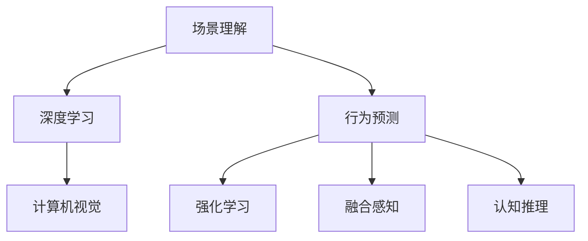

                 

# 场景理解与行为预测技术在自动驾驶中的新发展

> 关键词：自动驾驶,场景理解,行为预测,深度学习,计算机视觉,强化学习,融合感知,认知推理

## 1. 背景介绍

### 1.1 问题由来
随着智能交通系统的快速发展，自动驾驶技术已成为智能交通的重要组成部分。通过自动化感知、决策与控制，自动驾驶汽车有望提升道路交通安全、减少交通拥堵、降低能源消耗，为出行带来更高的舒适度和便利性。然而，自动驾驶的实现面临诸多技术挑战，其中场景理解与行为预测是自动驾驶决策的基础，直接关系到系统的安全性和可靠性。

当前自动驾驶系统大多依赖传感器（如激光雷达、摄像头、雷达等）收集道路环境和车辆行为信息，通过复杂算法处理这些数据，实现对场景的理解和行为预测。尽管如此，自动驾驶系统在实际应用中仍面临诸多难题，如数据量巨大、环境复杂多变、交互动态性强等，这些挑战对算法的性能和可靠性提出了严苛要求。

### 1.2 问题核心关键点
场景理解与行为预测的挑战主要体现在以下几个方面：
- 大规模复杂数据处理：自动驾驶系统需要同时处理来自多源传感器的海量数据，数据多样性和复杂性使得算法设计和实现难度极大。
- 实时性要求高：自动驾驶系统需要在毫秒级时间尺度内完成场景理解和行为预测，对算法效率和性能提出严苛要求。
- 动态环境交互：道路环境动态多变，其他车辆的意外行为难以预测，这对算法鲁棒性和适应性提出挑战。
- 高安全可靠性：自动驾驶系统直接关系到乘客和行人的生命安全，其决策过程必须经过严格的安全验证和测试。

### 1.3 问题研究意义
场景理解与行为预测技术是自动驾驶系统成功的关键。通过精确理解环境场景，准确预测其他车辆的行动，自动驾驶系统能够在复杂环境中做出安全和高效的决策，从而提高行车安全和舒适性。

场景理解与行为预测技术的突破将推动自动驾驶技术进入新的发展阶段，加速其落地应用。因此，探索和发展高精度、高效能、鲁棒性强的场景理解与行为预测技术具有重要意义。

## 2. 核心概念与联系

### 2.1 核心概念概述

为了更好地理解场景理解与行为预测技术，本节将介绍几个关键概念及其相互关系：

- 场景理解(Scene Understanding)：指自动驾驶系统对当前环境场景的分析和理解，包括对道路条件、交通流态、车辆和行人行为等信息的识别和处理。
- 行为预测(Behavior Prediction)：指基于对当前场景的理解，预测其他车辆和行人的未来行为，如转向、停车、加速等，为自动驾驶系统做出决策提供依据。
- 深度学习(Deep Learning)：一种基于多层神经网络进行复杂模式识别的机器学习方法，广泛应用于图像识别、语音处理等任务。
- 计算机视觉(Computer Vision)：研究如何使计算机“看”和理解图像、视频等视觉数据的技术，场景理解的重要工具。
- 强化学习(Reinforcement Learning, RL)：一种通过奖励和惩罚机制，让智能体在与环境的交互中不断学习优化决策策略的机器学习方法，常用于自动驾驶中的行为预测。
- 融合感知(Fusion Perception)：指将多种传感器数据（如激光雷达、摄像头、雷达等）融合处理，提升环境理解的全面性和准确性。
- 认知推理(Cognitive Reasoning)：指将知识图谱、逻辑推理等高级认知能力引入自动驾驶系统，辅助决策过程。

这些概念共同构成了自动驾驶场景理解与行为预测的框架，通过深度学习、计算机视觉、强化学习等技术手段，实现对复杂环境的精确理解和高鲁棒性的行为预测。

### 2.2 核心概念联系

上述概念之间的联系可通过以下Mermaid流程图表示：



这个流程图展示了各概念之间的紧密联系：

- 场景理解(A)：基于深度学习和计算机视觉技术，对传感器数据进行处理和分析。
- 行为预测(D)：结合强化学习和融合感知技术，对未来行为进行预测和决策。
- 融合感知(F)：将不同传感器数据融合处理，提升环境理解的全局性和准确性。
- 认知推理(G)：引入高级认知能力，辅助决策过程，提升系统智能水平。

## 3. 核心算法原理 & 具体操作步骤
### 3.1 算法原理概述

场景理解与行为预测技术的核心算法框架包括深度学习、计算机视觉、强化学习等技术。其中深度学习技术通过多层神经网络进行复杂模式识别和特征提取，计算机视觉技术用于图像处理和识别，强化学习技术则通过奖励和惩罚机制不断优化决策策略。

### 3.2 算法步骤详解

基于深度学习的场景理解与行为预测一般包括以下几个关键步骤：

**Step 1: 传感器数据采集与融合**

- 利用激光雷达、摄像头、雷达等传感器采集道路环境数据。
- 对不同传感器数据进行预处理，包括滤波、归一化等操作。
- 使用深度神经网络将多源数据进行融合，生成统一的感知结果。

**Step 2: 深度学习模型训练**

- 选择合适的深度学习模型，如CNN、RNN、Transformer等，进行场景理解。
- 在大型标注数据集上进行模型训练，学习环境特征。
- 使用监督学习和无监督学习相结合的策略，提升模型性能。

**Step 3: 行为预测模型训练**

- 根据预测任务选择合适的强化学习模型，如Q-Learning、Deep Q-Learning等。
- 设计合理的奖励函数和惩罚机制，训练模型学习最优决策策略。
- 使用模拟环境和实际数据相结合的方式进行模型评估和验证。

**Step 4: 融合感知与认知推理**

- 将融合感知结果和行为预测结果进行联合分析。
- 引入知识图谱和逻辑推理等高级认知能力，增强系统决策的鲁棒性和准确性。
- 利用实时数据更新模型参数，保持系统动态适应能力。

**Step 5: 系统集成与测试**

- 将场景理解与行为预测模块集成到自动驾驶系统中。
- 在模拟环境和高风险实际场景中进行系统测试，评估性能和安全性。
- 不断迭代优化模型和系统设计，提高系统可靠性和鲁棒性。

### 3.3 算法优缺点

场景理解与行为预测技术具有以下优点：
1. 深度学习技术能够处理高维复杂数据，提升环境理解的准确性和鲁棒性。
2. 强化学习技术能够模拟真实交互过程，训练出高效的行为预测策略。
3. 融合感知和认知推理技术能够综合多源信息，提高系统决策的全面性和智能性。
4. 系统具有较高的可扩展性和适应性，能够应对复杂多变的道路环境。

同时，该技术也存在一定的局限性：
1. 数据获取难度大：高质量标注数据集难以获得，限制了模型的训练效果。
2. 计算资源消耗高：大模型和复杂算法需要大量计算资源，增加了系统成本。
3. 算法复杂度高：多层次网络结构和复杂的训练过程增加了实现难度。
4. 安全性和鲁棒性挑战：系统需要在高风险环境中稳定运行，对算法的鲁棒性和安全性提出严苛要求。

### 3.4 算法应用领域

场景理解与行为预测技术已广泛应用于多个领域：

- 自动驾驶：结合深度学习、计算机视觉、强化学习技术，实现对道路环境和交通流态的精确理解，辅助决策过程。
- 智能交通：通过多源数据融合，实现对交通信号、交通拥堵等信息的监测和预测，优化交通管理。
- 智能监控：应用计算机视觉和行为分析技术，实时监测公共场所安全和异常行为，提高安全防范水平。
- 工业自动化：利用场景理解和行为预测技术，实现对工业环境中动态变化的管理和控制。

## 4. 数学模型和公式 & 详细讲解 & 举例说明（备注：数学公式请使用latex格式，latex嵌入文中独立段落使用 $$，段落内使用 $)
### 4.1 数学模型构建

本文以深度学习技术为基础，详细描述场景理解与行为预测的数学模型。

**深度学习模型**：假设场景理解模型为 $M_{\theta}:\mathcal{X} \rightarrow \mathcal{Y}$，其中 $\mathcal{X}$ 为输入空间，$\mathcal{Y}$ 为输出空间，$\theta \in \mathbb{R}^d$ 为模型参数。模型的输入为传感器数据 $x$，输出为场景理解结果 $y$。

**行为预测模型**：假设行为预测模型为 $P_{\phi}:\mathcal{S} \times \mathcal{A} \rightarrow \mathbb{R}$，其中 $\mathcal{S}$ 为状态空间，$\mathcal{A}$ 为动作空间，$\phi \in \mathbb{R}^e$ 为行为预测模型参数。模型的输入为场景理解结果 $s$ 和动作 $a$，输出为预测的行为概率 $p$。

### 4.2 公式推导过程

**深度学习模型推导**：

- 假设输入 $x \in \mathcal{X}$ 为传感器数据，输出 $y \in \mathcal{Y}$ 为场景理解结果。
- 模型 $M_{\theta}$ 的定义域和值域分别为 $\mathcal{X}$ 和 $\mathcal{Y}$。
- 损失函数 $L(y, y^*)$ 用于衡量模型输出与真实标签的差异。
- 训练样本集 $D=\{(x_i, y_i)\}_{i=1}^N$，其中 $x_i \in \mathcal{X}$ 为传感器数据，$y_i \in \mathcal{Y}$ 为真实标签。
- 训练过程的目标为最小化损失函数 $L$，即 $\min_{\theta} L(y, y^*)$。

**行为预测模型推导**：

- 假设状态 $s \in \mathcal{S}$ 为场景理解结果，动作 $a \in \mathcal{A}$ 为预测行为，行为概率 $p \in [0,1]$ 为行为预测结果。
- 行为预测模型 $P_{\phi}$ 将状态 $s$ 和动作 $a$ 映射到行为概率 $p$。
- 行为预测的目标是最大化奖励 $R$，即 $\max_{\phi} \sum_{t=1}^T R_t$。
- 奖励函数 $R_t$ 用于衡量行为 $a_t$ 在时间步 $t$ 的奖励，可包含奖励和惩罚两个部分。

### 4.3 案例分析与讲解

假设场景理解模型为CNN网络，行为预测模型为Q-Learning模型。

**CNN网络**：

- 输入 $x$ 为传感器数据，经过卷积层和池化层处理后得到特征图 $F$。
- 将特征图 $F$ 输入全连接层，输出场景理解结果 $y$。
- 使用交叉熵损失函数 $L(y, y^*)$ 计算模型输出与真实标签的差异。
- 训练过程中使用梯度下降算法，更新模型参数 $\theta$。

**Q-Learning模型**：

- 状态 $s$ 为场景理解结果 $y$，动作 $a$ 为预测行为，行为概率 $p$ 为预测行为概率。
- 设计奖励函数 $R$，包含行为 $a$ 带来的奖励和惩罚。
- 使用深度Q-Learning算法，更新行为预测模型参数 $\phi$。

## 5. 项目实践：代码实例和详细解释说明
### 5.1 开发环境搭建

在进行场景理解与行为预测项目实践前，我们需要准备好开发环境。以下是使用Python进行TensorFlow和PyTorch开发的环境配置流程：

1. 安装Anaconda：从官网下载并安装Anaconda，用于创建独立的Python环境。

2. 创建并激活虚拟环境：
```bash
conda create -n env python=3.8
conda activate env
```

3. 安装TensorFlow和PyTorch：根据GPU版本，从官网获取对应的安装命令。例如：
```bash
conda install tensorflow==2.x -c tf
conda install torch torchvision torchaudio cudatoolkit=11.1 -c pytorch -c conda-forge
```

4. 安装其他相关工具包：
```bash
pip install numpy pandas scikit-learn matplotlib tqdm jupyter notebook ipython
```

完成上述步骤后，即可在`env`环境中开始项目实践。

### 5.2 源代码详细实现

这里以一个简单的自动驾驶场景理解与行为预测为例，展示TensorFlow和PyTorch的代码实现。

**TensorFlow代码实现**：

```python
import tensorflow as tf
from tensorflow.keras.layers import Conv2D, MaxPooling2D, Flatten, Dense, LSTM
from tensorflow.keras.models import Model
from tensorflow.keras.losses import categorical_crossentropy

# 定义CNN网络
def build_cnn_model(input_shape):
    x = tf.keras.layers.Conv2D(32, (3,3), activation='relu', input_shape=input_shape)(tf.keras.layers.Input(shape=input_shape))
    x = tf.keras.layers.MaxPooling2D((2,2))(x)
    x = tf.keras.layers.Conv2D(64, (3,3), activation='relu')(x)
    x = tf.keras.layers.MaxPooling2D((2,2))(x)
    x = tf.keras.layers.Conv2D(128, (3,3), activation='relu')(x)
    x = tf.keras.layers.MaxPooling2D((2,2))(x)
    x = Flatten()(x)
    x = Dense(256, activation='relu')(x)
    y = Dense(10, activation='softmax')(x)
    model = Model(inputs=tf.keras.layers.Input(shape=input_shape), outputs=y)
    return model

# 训练函数
def train_cnn_model(model, data_train, data_val, epochs=10, batch_size=32):
    model.compile(optimizer='adam', loss=categorical_crossentropy, metrics=['accuracy'])
    history = model.fit(data_train, validation_data=data_val, epochs=epochs, batch_size=batch_size)
    return history

# 加载数据
data_train = tf.data.Dataset.from_tensor_slices((train_images, train_labels))
data_val = tf.data.Dataset.from_tensor_slices((val_images, val_labels))

# 定义输入数据形状
input_shape = (image_height, image_width, 3)

# 构建CNN模型
model = build_cnn_model(input_shape)

# 训练模型
history = train_cnn_model(model, data_train, data_val)
```

**PyTorch代码实现**：

```python
import torch
import torch.nn as nn
import torch.optim as optim
from torch.utils.data import DataLoader

# 定义CNN网络
class CNNModel(nn.Module):
    def __init__(self, input_shape):
        super(CNNModel, self).__init__()
        self.conv1 = nn.Conv2d(3, 32, 3, stride=1, padding=1)
        self.pool1 = nn.MaxPool2d(2, stride=2)
        self.conv2 = nn.Conv2d(32, 64, 3, stride=1, padding=1)
        self.pool2 = nn.MaxPool2d(2, stride=2)
        self.conv3 = nn.Conv2d(64, 128, 3, stride=1, padding=1)
        self.pool3 = nn.MaxPool2d(2, stride=2)
        self.fc1 = nn.Linear(128*image_height*image_width, 256)
        self.fc2 = nn.Linear(256, 10)

    def forward(self, x):
        x = torch.relu(self.conv1(x))
        x = self.pool1(x)
        x = torch.relu(self.conv2(x))
        x = self.pool2(x)
        x = torch.relu(self.conv3(x))
        x = self.pool3(x)
        x = x.view(-1, 128*image_height*image_width)
        x = torch.relu(self.fc1(x))
        x = self.fc2(x)
        return x

# 定义训练函数
def train_cnn_model(model, data_train, data_val, epochs=10, batch_size=32):
    criterion = nn.CrossEntropyLoss()
    optimizer = optim.Adam(model.parameters(), lr=0.001)
    for epoch in range(epochs):
        model.train()
        for batch_idx, (data, target) in enumerate(data_loader(train_dataset)):
            optimizer.zero_grad()
            output = model(data)
            loss = criterion(output, target)
            loss.backward()
            optimizer.step()
        model.eval()
        with torch.no_grad():
            correct = 0
            total = 0
            for batch_idx, (data, target) in enumerate(data_loader(val_dataset)):
                output = model(data)
                _, predicted = torch.max(output.data, 1)
                total += target.size(0)
                correct += (predicted == target).sum().item()
            print(f'Epoch {epoch+1} Acc: {100 * correct / total:.2f}')

# 加载数据
train_dataset = ...
val_dataset = ...

# 定义输入数据形状
image_height = ...
image_width = ...

# 构建CNN模型
model = CNNModel(input_shape)

# 训练模型
data_loader = DataLoader(train_dataset, batch_size=batch_size)
train_cnn_model(model, data_loader, val_dataset)
```

### 5.3 代码解读与分析

**TensorFlow代码分析**：

- 定义了CNN网络模型 `build_cnn_model`，包含卷积层、池化层和全连接层。
- 使用 `Model` 构建了完整的深度学习模型。
- 定义了训练函数 `train_cnn_model`，包含模型编译、数据迭代和损失计算。
- 加载数据集，并进行模型训练。

**PyTorch代码分析**：

- 定义了CNN网络模型 `CNNModel`，包含卷积层、池化层和全连接层。
- 定义了训练函数 `train_cnn_model`，包含损失函数、优化器、数据迭代和模型训练。
- 加载数据集，并进行模型训练。

通过对比两种框架的代码实现，可以看到，TensorFlow和PyTorch在深度学习模型构建和训练方面具有相似性，但PyTorch在动态计算图和自动微分方面具有天然优势。开发者可根据实际需求选择适合的框架进行项目开发。

## 6. 实际应用场景

### 6.1 智能驾驶系统

智能驾驶系统是场景理解与行为预测技术的重要应用场景。通过实时感知道路环境和车辆行为，自动驾驶系统能够做出安全、高效的决策，实现自动行驶。

智能驾驶系统包含多个子模块，如感知模块、决策模块、控制模块等。其中感知模块负责场景理解，通过摄像头、激光雷达等传感器采集道路环境信息，并使用深度学习模型进行处理和分析。决策模块则负责行为预测，通过强化学习模型对其他车辆的动态行为进行预测，并结合融合感知结果，生成最优驾驶策略。控制模块根据决策结果，控制车辆进行加速、减速、转向等操作，实现自动驾驶。

### 6.2 智能交通监控

智能交通监控系统通过实时分析道路环境和交通流态，提高交通管理和安全水平。场景理解与行为预测技术能够自动分析摄像头和雷达数据，识别出异常行为和交通违规，为交通管理提供决策支持。

在实际应用中，监控系统会将实时数据输入深度学习模型，进行场景理解。然后使用行为预测模型，对其他车辆和行人的行为进行预测，生成告警信息。当系统检测到异常行为或违规行为时，会自动进行告警和记录，帮助交警和安保人员及时响应。

### 6.3 智能仓储管理

智能仓储管理系统利用场景理解与行为预测技术，提升仓储效率和安全性。通过传感器采集环境数据，深度学习模型能够自动分析存储区域和物料位置，生成最优路径和调度方案。同时，行为预测模型能够预测员工的操作行为，辅助系统进行实时调度和管理。

## 7. 工具和资源推荐
### 7.1 学习资源推荐

为了帮助开发者系统掌握场景理解与行为预测的理论基础和实践技巧，这里推荐一些优质的学习资源：

1. 《深度学习》系列书籍：由Ian Goodfellow等人撰写，详细介绍了深度学习的原理、算法和应用。
2. 《计算机视觉：模型、学习和推理》书籍：由Simon J.D. Prince等人撰写，全面介绍了计算机视觉技术。
3. CS231n《卷积神经网络》课程：斯坦福大学开设的经典深度学习课程，涵盖CNN等模型的原理和实现。
4. DeepMind公开课《强化学习》：由DeepMind团队主讲，介绍了强化学习的核心思想和应用。
5. Coursera《深度学习专项课程》：由斯坦福大学Andrew Ng教授主讲，涵盖深度学习各个方面。

通过对这些资源的学习实践，相信你一定能够快速掌握场景理解与行为预测的精髓，并用于解决实际的自动驾驶问题。
###  7.2 开发工具推荐

高效的开发离不开优秀的工具支持。以下是几款用于场景理解与行为预测开发的常用工具：

1. TensorFlow：由Google开发的开源深度学习框架，支持多种编程语言，具备强大的分布式计算能力。
2. PyTorch：由Facebook开发的开源深度学习框架，灵活的动态计算图和自动微分技术，使其在研究和工程开发中具有广泛应用。
3. OpenCV：开源计算机视觉库，提供丰富的图像处理和计算机视觉算法，用于场景理解中的图像识别和特征提取。
4. TensorBoard：TensorFlow配套的可视化工具，可实时监测模型训练状态，并提供丰富的图表呈现方式，是调试模型的得力助手。
5. Weights & Biases：模型训练的实验跟踪工具，可以记录和可视化模型训练过程中的各项指标，方便对比和调优。

合理利用这些工具，可以显著提升场景理解与行为预测任务的开发效率，加快创新迭代的步伐。

### 7.3 相关论文推荐

场景理解与行为预测技术的发展源于学界的持续研究。以下是几篇奠基性的相关论文，推荐阅读：

1. Understanding the scene and predicting behavior of drivers and pedestrians based on trajectory data （场景理解与行为预测论文）：利用轨迹数据对驾驶员和行人的行为进行分析和预测，为自动驾驶系统提供决策支持。
2. Deep reinforcement learning for autonomous driving （强化学习应用于自动驾驶论文）：介绍深度强化学习在自动驾驶中的决策和控制过程，优化驾驶策略。
3. Real-time scene understanding and behavior prediction for autonomous driving （自动驾驶场景理解与行为预测论文）：介绍基于计算机视觉和深度学习的场景理解技术，为自动驾驶系统提供实时感知和决策支持。
4. Multi-sensor data fusion for autonomous driving （多传感器融合技术论文）：介绍多种传感器数据的融合处理，提升环境理解的全面性和准确性。
5. Cognitive reasoning for autonomous driving （认知推理应用于自动驾驶论文）：引入知识图谱和逻辑推理等高级认知能力，辅助自动驾驶系统的决策过程。

这些论文代表了场景理解与行为预测技术的发展脉络，通过学习这些前沿成果，可以帮助研究者把握学科前进方向，激发更多的创新灵感。

## 8. 总结：未来发展趋势与挑战
### 8.1 总结

本文对场景理解与行为预测技术在自动驾驶中的新发展进行了全面系统的介绍。首先阐述了自动驾驶场景理解与行为预测的研究背景和意义，明确了其对系统安全和可靠性的重要性。其次，从原理到实践，详细讲解了深度学习、计算机视觉、强化学习等核心算法，并给出了具体的代码实现。最后，探讨了场景理解与行为预测在智能驾驶、智能交通、智能仓储等领域的应用，展示了该技术广阔的发展前景。

通过本文的系统梳理，可以看到，场景理解与行为预测技术是大数据、深度学习和计算机视觉技术的融合产物，为自动驾驶系统提供了坚实的基础。随着技术的不断发展，该技术将在智能交通、智能监控等领域发挥更大的作用，为行业带来颠覆性变革。

### 8.2 未来发展趋势

展望未来，场景理解与行为预测技术将呈现以下几个发展趋势：

1. 模型规模持续增大。随着算力成本的下降和数据规模的扩张，深度学习模型和计算机视觉模型的参数量将继续增长，提升系统性能和鲁棒性。
2. 强化学习模型的优化。通过引入先进的强化学习算法，如Deep Q-Networks、Advantage Actor-Critic等，优化行为预测模型，提升决策策略的优化效果。
3. 多模态数据融合。利用多种传感器数据（如激光雷达、摄像头、雷达等）进行融合处理，提升环境理解的全面性和准确性。
4. 跨模态感知。引入跨模态感知技术，提升不同感知模态之间的信息交互，提高系统智能水平。
5. 知识图谱与逻辑推理。将知识图谱和逻辑推理引入系统，增强系统决策的全面性和智能性。
6. 系统集成与优化。将深度学习、计算机视觉、强化学习等技术进行集成和优化，构建一体化的自动驾驶系统。

### 8.3 面临的挑战

尽管场景理解与行为预测技术已经取得了重要进展，但在迈向更广泛应用的过程中，仍面临诸多挑战：

1. 数据获取难度大。高质量标注数据集难以获得，限制了模型的训练效果。
2. 计算资源消耗高。大模型和复杂算法需要大量计算资源，增加了系统成本。
3. 算法复杂度高。多层次网络结构和复杂的训练过程增加了实现难度。
4. 安全性和鲁棒性挑战。系统需要在高风险环境中稳定运行，对算法的鲁棒性和安全性提出严苛要求。
5. 模型解释性不足。深度学习模型的决策过程难以解释，难以满足高风险应用的安全性和可靠性要求。

### 8.4 研究展望

面对场景理解与行为预测技术面临的挑战，未来的研究需要在以下几个方面寻求新的突破：

1. 探索无监督和半监督学习范式。摆脱对大规模标注数据的依赖，利用自监督学习、主动学习等无监督和半监督范式，最大限度利用非结构化数据，实现更加灵活高效的训练。
2. 研究参数高效和计算高效的模型。开发更加参数高效的深度学习模型，在固定大部分预训练参数的同时，只更新极少量的任务相关参数。同时优化模型的计算图，减少前向传播和反向传播的资源消耗，实现更加轻量级、实时性的部署。
3. 引入因果推理和逻辑推理技术。通过引入因果推断和逻辑推理，增强系统建立稳定因果关系的能力，学习更加普适、鲁棒的语言表征，从而提升模型泛化性和抗干扰能力。
4. 结合知识图谱和符号逻辑。将知识图谱和逻辑推理引入系统，增强系统决策的全面性和智能性。
5. 纳入伦理道德约束。在模型训练目标中引入伦理导向的评估指标，过滤和惩罚有偏见、有害的输出倾向。同时加强人工干预和审核，建立模型行为的监管机制，确保输出符合人类价值观和伦理道德。

这些研究方向的探索，必将引领场景理解与行为预测技术迈向更高的台阶，为构建安全、可靠、可解释、可控的智能系统铺平道路。面向未来，场景理解与行为预测技术还需要与其他人工智能技术进行更深入的融合，如知识表示、因果推理、强化学习等，多路径协同发力，共同推动自然语言理解和智能交互系统的进步。只有勇于创新、敢于突破，才能不断拓展场景理解与行为预测技术的边界，让智能技术更好地造福人类社会。

## 9. 附录：常见问题与解答

**Q1：场景理解与行为预测技术是否适用于所有自动驾驶场景？**

A: 场景理解与行为预测技术适用于大多数自动驾驶场景，特别是对于数据量较小的任务。但对于一些特定领域的任务，如极端天气、复杂路面等，仍然存在一定的挑战。此时需要在特定领域数据上进一步预训练，再进行微调，才能获得理想效果。

**Q2：如何缓解场景理解与行为预测过程中的过拟合问题？**

A: 过拟合是场景理解与行为预测面临的主要挑战之一，尤其是在标注数据不足的情况下。常见的缓解策略包括：
1. 数据增强：通过数据扩充和增强技术，扩充训练集，提高模型的泛化能力。
2. 正则化：使用L2正则、Dropout等正则化技术，防止模型过度拟合。
3. 对抗训练：引入对抗样本，提高模型鲁棒性，防止过拟合。
4. 参数高效微调：只调整少量参数，减小过拟合风险。
5. 多模型集成：训练多个模型，取平均输出，抑制过拟合。

这些策略往往需要根据具体任务和数据特点进行灵活组合，只有在数据、模型、训练、推理等各环节进行全面优化，才能最大限度地发挥场景理解与行为预测的威力。

**Q3：场景理解与行为预测在实际应用中需要注意哪些问题？**

A: 将场景理解与行为预测技术转化为实际应用，还需要考虑以下因素：
1. 模型裁剪：去除不必要的层和参数，减小模型尺寸，加快推理速度。
2. 量化加速：将浮点模型转为定点模型，压缩存储空间，提高计算效率。
3. 服务化封装：将模型封装为标准化服务接口，便于集成调用。
4. 弹性伸缩：根据请求流量动态调整资源配置，平衡服务质量和成本。
5. 监控告警：实时采集系统指标，设置异常告警阈值，确保服务稳定性。
6. 安全防护：采用访问鉴权、数据脱敏等措施，保障数据和模型安全。

合理利用这些工具，可以显著提升场景理解与行为预测任务的开发效率，加快创新迭代的步伐。

**Q4：场景理解与行为预测的未来发展方向是什么？**

A: 场景理解与行为预测技术的未来发展方向主要包括以下几个方面：
1. 模型的多模态融合：将不同感知模态（如视觉、雷达、激光雷达等）的信息融合，提高环境理解的全面性和准确性。
2. 模型的跨模态推理：引入跨模态推理技术，提升不同感知模态之间的信息交互，提高系统智能水平。
3. 模型的因果推理：引入因果推理技术，增强系统建立稳定因果关系的能力，学习更加普适、鲁棒的语言表征，从而提升模型泛化性和抗干扰能力。
4. 模型的知识图谱和逻辑推理：将知识图谱和逻辑推理引入系统，增强系统决策的全面性和智能性。
5. 模型的伦理道德约束：在模型训练目标中引入伦理导向的评估指标，过滤和惩罚有偏见、有害的输出倾向。同时加强人工干预和审核，建立模型行为的监管机制，确保输出符合人类价值观和伦理道德。

这些研究方向将推动场景理解与行为预测技术迈向更高的台阶，为构建安全、可靠、可解释、可控的智能系统铺平道路。

---

作者：禅与计算机程序设计艺术 / Zen and the Art of Computer Programming

